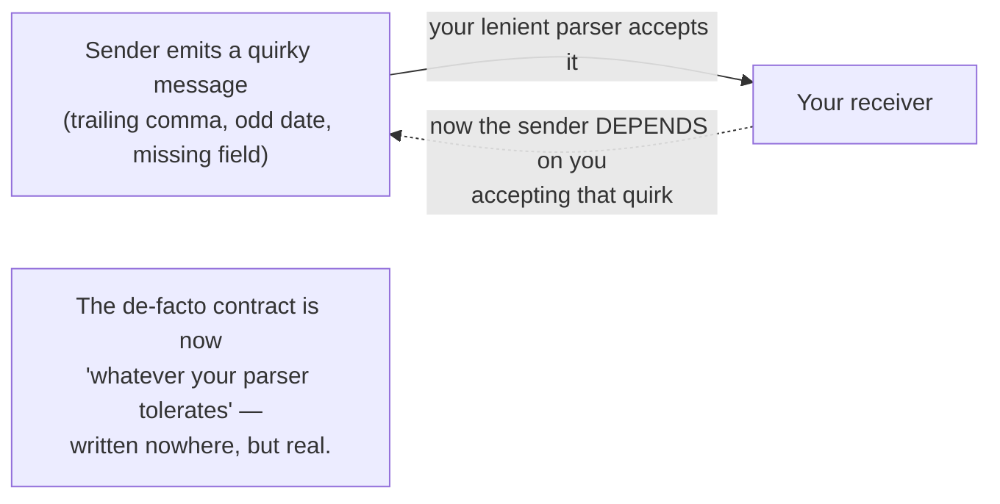
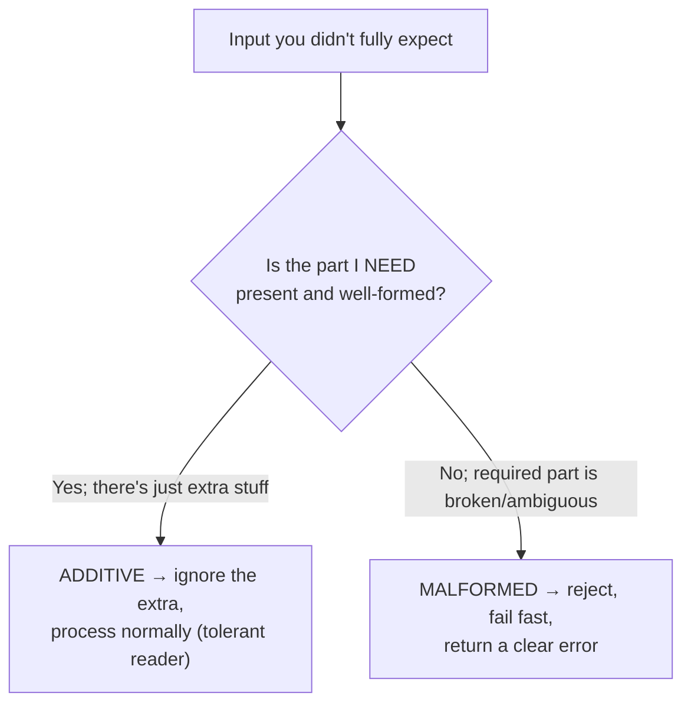
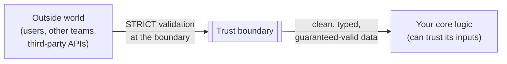
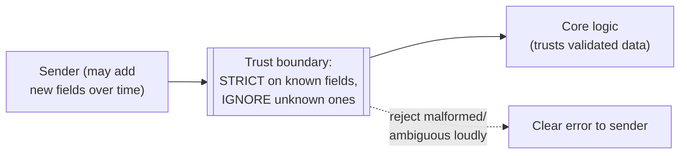
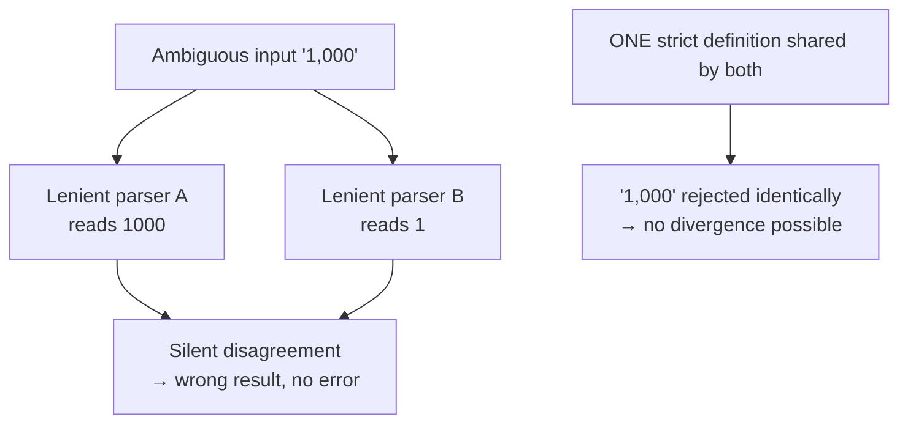

# Robustness Principle — Middle

> **Category:** [Coupling & Cohesion](../../README.md) — Jon Postel's interoperability rule: be conservative in what you send, be liberal in what you accept.

> **Prerequisite:** [Junior](junior.md)
> **Focus:** **Why** and **When**

---

## Introduction

> Focus: **Why** and **When**

At the junior level the principle is a slogan with a caveat. At the middle level it becomes a set of **operational decisions** you make whenever your code reads data from anything you don't fully control — a request body, a queue message, a config file, an upstream API.

The recurring question is not *"should I be liberal?"* but **"liberal about *what*, exactly?"** Being liberal about *unknown extra fields* is one of the best forward-compatibility tools in your kit. Being liberal about *malformed, ambiguous, or under-specified* input is how you build silent data corruption and security holes. These two things look superficially the same ("input I didn't fully expect") and could not be more different in consequence. This level teaches you to tell them apart and to act differently on each.

The frame that ties this to **coupling**: every deviation you tolerate is an *undocumented* dependency you've just created between your system and whoever sends that deviation. Leniency is not free; it is coupling you can't see.

---

## Why Leniency Is Hidden Coupling

This is *the* reason the Robustness Principle lives in the Coupling & Cohesion section.

Suppose your JSON parser tolerates trailing commas, or your API quietly accepts a date in three formats, or your message handler ignores a required field when it's missing. The moment any sender discovers that your code accepts the deviation, **they start relying on it.** That reliance is real coupling — a change to your code (tightening the parser) now breaks them — but it's coupling that appears in **no spec, no schema, and no documentation.**



Contrast with **strictness**, which keeps the contract *explicit*:

| | Lenient acceptance | Strict acceptance |
|---|---|---|
| Where the contract lives | Implicitly, in your parser's quirks | Explicitly, in the spec/schema |
| Visibility of the coupling | Hidden — nobody wrote it down | Visible — it's the documented format |
| What "valid" means over time | Drifts to "whatever the parser accepts" | Stays anchored to the spec |
| Cost to tighten later | High — you'll break silent dependents | Low — nothing depended on the slack |

> Strictness is a coupling-management tool. It forces the contract to be the *written* contract, not the *accidental behaviour of your parser.* This is exactly the [Minimise Coupling](../01-minimise-coupling/middle.md) goal applied to data formats: keep the dependency surface small, explicit, and intentional.

---

## The Tolerant Reader Pattern — Done Right

Here is where the principle earns its keep. The **Tolerant Reader** (Martin Fowler's name for it) is a *forward-compatibility* technique: a receiver reads only the parts of a message it actually needs and **ignores everything else**, so that *additive* changes to the message — new fields the sender adds later — don't break it.

This is the **good, safe** face of "be liberal." It is liberal about exactly one thing: **fields you don't recognise.** It is *not* liberal about the fields you *do* use — those it validates strictly.

```python
# TOLERANT READER — liberal about UNKNOWN fields, strict about KNOWN ones.
def read_user(payload: dict) -> User:
    # Required, known fields: validated STRICTLY. No guessing.
    try:
        user_id = payload["id"]
        email   = payload["email"]
    except KeyError as missing:
        raise InvalidMessage(f"missing required field: {missing}") from None
    if not isinstance(user_id, int):
        raise InvalidMessage("id must be an integer")
    if "@" not in email:
        raise InvalidMessage("email is malformed")

    # Unknown EXTRA fields the sender added later? Ignore them. (forward-compatible)
    # We simply don't read them — no error, no guess.
    return User(id=user_id, email=email)
```

The contrast with a **brittle reader** that binds to the *whole* message shape (e.g., deserialising into a strict class that rejects any unrecognised field) is that the tolerant reader survives the sender adding a `preferences` block tomorrow, while the brittle one throws. That's the legitimate value of leniency: **resilience to additive evolution.**

The discipline is the split: **liberal about unknown additions, strict about everything you actually consume.** Lose that split — become liberal about malformed *known* fields too — and you've crossed from forward-compatibility into the danger zone.

---

## Additive vs. Malformed: The Decision That Matters

Make this distinction explicit, because every safe use of the Robustness Principle depends on it.

| | **Unknown-but-additive** | **Malformed / ambiguous** |
|---|---|---|
| What it is | Extra fields/values you don't recognise, alongside valid data | Required data that violates the spec: bad syntax, wrong type, ambiguous meaning |
| Example | A new `"locale"` field your version doesn't use | `"date": "01-02-03"` (which order?), a missing required `id`, an unclosed tag |
| Safe response | **Ignore it** — keep processing (tolerant reader) | **Reject it** — fail fast; do not guess |
| Why | Ignoring extra data can't corrupt the data you *do* use | Guessing a meaning may pick the *wrong* one, silently |
| Coupling effect | None — you depend on nothing new | If you guess, the sender now couples to *your guess* |



The slogan to carry: **"Tolerate what you don't need; never guess at what you do."**

---

## A Parser-Differential Bug, Step by Step

The single most important harm to understand at this level is the **parser differential**: two pieces of code that are *both* lenient but lenient in *different ways*, so they disagree about what a message means. The disagreement is silent — neither errors — and that silence is the bug.

Here's a concrete, realistic version. A system has a frontend validator and a backend processor, both written to "be liberal":

```python
# FRONTEND validator — lenient: trims whitespace, lowercases, allows surrounding junk
def normalize_amount_frontend(raw: str) -> float:
    raw = raw.strip().replace(",", "")        # "1,000 " -> "1000"
    return float(raw)                          # also accepts "1e3", "  1000  "

# BACKEND processor — ALSO lenient, but parses DIFFERENTLY
def parse_amount_backend(raw: str) -> float:
    # takes the first numeric run it sees, ignores the rest ("be liberal")
    import re
    m = re.search(r"\d+", raw)                 # "1,000" -> "1"  (!!)
    return float(m.group()) if m else 0.0
```

Send `"1,000"`:

- The frontend sees **1000** and shows the user "charge $1,000 — confirmed."
- The backend sees **1** (it grabbed the first digit run before the comma) and charges **$1**.

Both were "liberal." Neither raised an error. They *disagree*, and the user is charged the wrong amount with no alarm anywhere. This is a parser differential, and at the [Senior](senior.md) level you'll see the security version of it (HTTP request smuggling), where an attacker *deliberately* crafts input that two lenient parsers read differently.

### The strict-but-forward-compatible fix

Define one canonical format, validate strictly against it, and *reject* anything ambiguous — while still ignoring unknown additive fields elsewhere in the payload:

```python
import re

AMOUNT_RE = re.compile(r"^\d+(\.\d{2})?$")     # exactly: digits, optional 2 decimals

def parse_amount_strict(raw: str) -> float:
    if not AMOUNT_RE.fullmatch(raw):
        raise InvalidMessage(f"amount must match NNN[.NN], got {raw!r}")
    return float(raw)

# Now "1,000" is REJECTED loudly at the boundary by BOTH sides, identically.
# The sender is told to send "1000.00". No silent disagreement is possible.
```

Both sides now share *one* strict definition. Ambiguity can't slip through, so the two components can't silently diverge. Note this is *not* the opposite of forward-compatibility — the surrounding payload can still grow new fields; we've only made the *value we actually use* unambiguous.

---

## Where to Validate Strictly: Trust Boundaries

The practical synthesis is *not* "be strict everywhere." It's **be strict at the boundary, then trust your validated data internally.**

A **trust boundary** is any point where data crosses from somewhere you don't control into your system: the HTTP edge, a message-queue consumer, a file importer, a third-party API client.



- **At the boundary:** validate strictly. Reject malformed/ambiguous input with a clear error. Tolerate only unknown-additive fields (tolerant reader). This is also where security input validation lives — see the [`input-validation`](../../README.md) discipline.
- **Inside the core:** the data has already been validated, so internal functions can assume it's well-formed and stay simple. You don't re-validate at every layer; you validate *once*, hard, at the edge.

This placement resolves the apparent tension: the system is *forgiving of additive evolution* (good for interoperability) and *strict about correctness* (good for safety) — at the same time, because the two apply to different things at one well-chosen place.

---

## Leniency and Versioning

The honest way to get the *benefit* the Robustness Principle promised (independent systems evolving without breaking each other) is **explicit versioning**, not implicit tolerance.

| Approach | How systems evolve together | Coupling |
|---|---|---|
| **Implicit leniency** (Postel-style) | Receiver guesses; sender relies on the guess | Hidden, undocumented, fragile |
| **Tolerant reader** (additive only) | Sender adds fields; receiver ignores unknowns | Low — only the documented fields are shared |
| **Explicit versioning** | New format = new version; old version still served | Visible — the version *is* the contract |

The modern stack combines the last two: **version your formats** so breaking changes are explicit, and use **tolerant readers** so *non*-breaking (additive) changes don't even require a version bump. Together they deliver graceful evolution *without* the silent-coupling tax of guessing at malformed input. (See the [`api-versioning`](../../README.md) discipline for the mechanics, and [Connascence](../03-connascence/middle.md) for why an explicit, named contract is weaker coupling than an implicit one.)

> The reframing: Postel wanted *graceful evolution and interoperability*. We now get that better from **schemas + versioning + tolerant readers** than from **lenient parsers**. Same goal; safer mechanism.

---

## When Leniency Is Safe vs. Dangerous

A compact decision guide you can apply in review:

| Situation | Verdict |
|---|---|
| Ignoring an unknown extra field (tolerant reader) | ✅ **Safe** — forward-compatibility, no guessing |
| Accepting a value in one well-defined canonical form | ✅ **Safe** — strict, unambiguous |
| Accepting multiple *unambiguous* equivalent forms (e.g., `true`/`TRUE`) | ⚠️ **Usually OK** — but document it; pick one canonical for *output* |
| Guessing intent from *ambiguous* input (`01-02-03` as a date) | ❌ **Dangerous** — different parsers guess differently |
| Silently "repairing" malformed input | ❌ **Dangerous** — may repair it wrong; hides sender bugs |
| Tolerating security-relevant malformation (odd encodings, smuggled bytes) | ❌ **Dangerous** — this is an attack surface (see [Senior](senior.md)) |

The dividing line is always the same: **does tolerating this require me to *guess* a meaning?** If no (it's just extra data, or a clearly-equivalent form), leniency is fine. If yes (the input is ambiguous or broken), reject it.

---

## Trade-offs

| Decision | Lean lenient (accept liberally) | Lean strict (reject aggressively) |
|---|---|---|
| Interoperability with buggy peers | Higher short-term | Lower short-term (peers must fix bugs) |
| Long-term spec health | Erodes (de-facto spec drifts) | Preserved (spec stays the truth) |
| Hidden coupling | High (undocumented tolerated quirks) | Low (contract is explicit) |
| Security surface | Larger (ambiguity, smuggling) | Smaller (one canonical interpretation) |
| Debuggability | Worse (silent wrong guesses) | Better (loud, early failure) |
| Forward-compatibility | Can be good *if* additive-only | Good *if* combined with tolerant reader |

The asymmetry that favours strictness: a strict reject is **loud, early, and local** — someone fixes the sender and moves on. A lenient mis-guess is **silent, late, and global** — it surfaces as corrupted data or a security incident far from the cause. Loud-and-early beats silent-and-late almost every time.

---

## Edge Cases

### 1. You genuinely cannot change a legacy sender

Sometimes you must accept a peer's quirk because you can't make them fix it (an old partner system, a shipped device). Then tolerate it — but **make the tolerance explicit and bounded**: a named, documented, tested compatibility shim that normalises the one known quirk to canonical form *at the boundary*, after which the rest of the system is strict. The leniency is contained, written down, and removable — not smeared through the codebase as an implicit assumption.

### 2. Postel's own protocol context vs. application data

The principle was written for *transport protocols* (TCP), where a dropped connection is costly and deviations are often benign timing/ordering quirks. Application-level data (money, identities, commands) has *semantics* that a wrong guess corrupts. Leniency that's reasonable at the byte/transport layer is often reckless at the business-meaning layer. Match your strictness to the stakes.

### 3. Human-facing input vs. machine-facing input

A search box for humans should be forgiving (people make typos). A machine-to-machine API should be strict (the machine can send the exact form, so accepting sloppiness only invites divergence). "Be liberal" has far more justification for *human* input than for *programmatic* input.

---

## Tricky Points

- **Tolerant reader ≠ lenient parser.** A tolerant reader ignores *unknown* fields while validating *known* ones strictly. A lenient parser tries to *interpret malformed* input. The first is safe forward-compatibility; the second is the dangerous half. Don't conflate them.
- **Leniency is coupling, not kindness.** Every tolerated deviation is an undocumented dependency. It *feels* generous; it *is* a hidden contract you'll be unable to change later.
- **"Strict at the boundary" is not "strict everywhere."** Validate hard once at the edge; trust the data internally. Re-validating at every layer is its own complexity smell.
- **Output strictness is non-negotiable.** Even people who reject "liberal in" keep "conservative out." Always emit one canonical form, regardless of how lenient your inputs are.
- **The benefit Postel wanted is still available — just from better tools.** Schemas + versioning + tolerant readers deliver graceful evolution without silent guessing. You're not giving up interoperability by being strict; you're buying it more safely.

---

## Best Practices

1. **Validate strictly at every trust boundary.** Reject malformed/ambiguous input with a clear, early error.
2. **Use the tolerant reader for forward-compatibility:** ignore unknown fields, validate the fields you use.
3. **Never guess at ambiguous input.** If a value has more than one reasonable interpretation, reject it and tell the sender the canonical form.
4. **Always emit one canonical, spec-correct output.** Keep "conservative in what you send" no matter what.
5. **Prefer explicit versioning to implicit tolerance** for evolving formats.
6. **If you must tolerate a quirk, contain it**: a named, documented, tested shim at the boundary that normalises to canonical form.
7. **Document anything you accept beyond the strict spec.** Undocumented leniency becomes a hidden contract.

---

## Test Yourself

1. Why does the Robustness Principle belong in a *coupling* chapter? What kind of coupling does leniency create?
2. Define the Tolerant Reader pattern. What is it liberal about, and what is it strict about?
3. Walk through a parser-differential bug. Why is it so dangerous compared to a parsing *error*?
4. Where should strict validation live, and why not everywhere?
5. Give the test that decides whether tolerating a given input is safe or dangerous.
6. How do schemas + versioning + tolerant readers deliver Postel's *goal* more safely than lenient parsing?

---

## Summary

- Leniency is **hidden coupling**: every tolerated deviation is an undocumented dependency, so the de-facto spec drifts to "whatever your parser accepts." This is why the principle lives in the coupling chapter.
- The **Tolerant Reader** is the *safe* face of "be liberal": ignore unknown/additive fields, validate the fields you use strictly.
- The decision that matters is **additive vs. malformed**: ignore additive, reject malformed. Never guess at ambiguous input.
- **Parser differentials** — two lenient parsers disagreeing silently — are the core harm; the fix is one shared strict definition.
- Validate **strictly at trust boundaries**, then trust data internally. Strict ≠ everywhere.
- Get Postel's *goal* (graceful evolution) from **schemas + versioning + tolerant readers**, not from lenient parsing. Always keep **conservative output**.

---

## Diagrams

### Strict boundary, tolerant of additive change



### The parser-differential trap




---

## Check your understanding

1. Explain Robustness Principle — Middle Level in your own words and name the problem it solves.
2. How would you apply the ideas around Table of Contents, Introduction, Why Leniency Is Hidden Coupling in a realistic engineering change?
3. What failure mode or misuse should you look for, and what evidence would reveal it?
4. Which local design trade-off would make you choose or reject Robustness Principle — Middle Level in an existing codebase?
5. What observable result would convince you that the approach improved the system?
