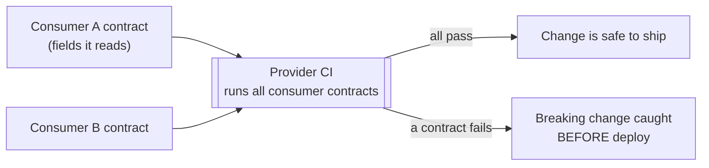
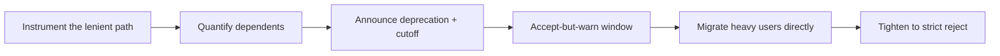
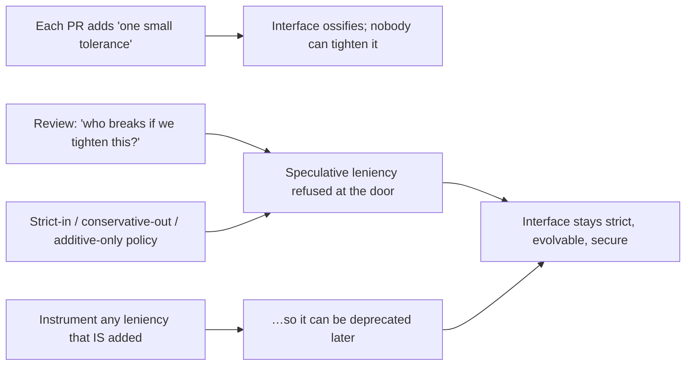
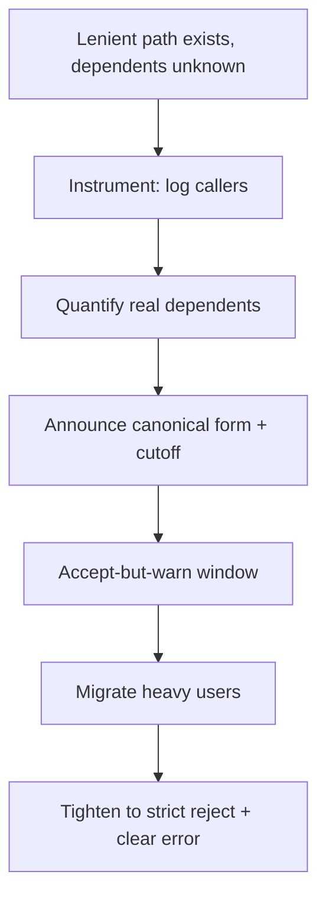

# Robustness Principle — Professional

> **Category:** [Coupling & Cohesion](../../README.md) — Jon Postel's interoperability rule: be conservative in what you send, be liberal in what you accept.

> **Prerequisites:** [Junior](junior.md) · [Middle](middle.md) · [Senior](senior.md)
> **Focus:** **Production** — reviews, contracts, deprecation, real incidents

---

## Introduction

> Focus: **production** — running strict, evolvable interfaces across many teams and versions.

In production, the Robustness Principle stops being a philosophy and becomes a set of **operational policies**: how your services validate inputs, how you let formats evolve without coordinated downtime, how you remove a leniency that's now load-bearing, and how you keep dozens of teams from each adding "one small tolerance" that aggregates into an unmaintainable, ossified, insecure interface.

The professional reality is that **leniency accumulates the way technical debt does** — one reasonable-looking accommodation at a time — and, like debt, it is far cheaper to refuse at review than to remove in production. The job is to make *strict-in, conservative-out, additive-tolerant, version-explicit* the default path, and to have a safe, tested procedure for the times you must tolerate a quirk anyway.

---

## Reviewing for Strictness at Boundaries

Most harmful leniency enters one PR at a time, dressed as helpfulness ("I made it accept both formats so callers don't have to change"). The reviewer's job is to catch it at the door.

### Review by question

1. **Where is the trust boundary?** Identify exactly where untrusted data enters (HTTP handler, queue consumer, file importer, third-party client). Strictness belongs *there*, once.
2. **Does this accept ambiguous input?** If a value has more than one reasonable interpretation, the change introduces a parser-differential risk. Reject ambiguity; demand one canonical form.
3. **Is the leniency additive or interpretive?** Ignoring an unknown extra field (tolerant reader) is fine. *Guessing* the meaning of a malformed known field is not. These look similar in a diff and must be told apart.
4. **Is the output strictly canonical?** Confirm the code *emits* one spec-correct form regardless of what it accepts. "Conservative out" is non-negotiable.
5. **Is any new leniency specified and documented?** Undocumented tolerance becomes a hidden contract. If we must accept a deviation, it needs a written, tested normalisation, not an improvised one.

### The highest-value review question

> **"If we tighten this parser in six months, who breaks — and do we even know who they are?"**

If the honest answer is "we can't know," the leniency is creating *invisible coupling* (see [Senior](senior.md)) and should be refused now, while it's cheap. Tolerance you can't later remove is tolerance you're stuck with forever.

### Review comment templates

> "This endpoint accepts `amount` as `'1,000'`, `'1000'`, and `'1e3'`. That's three interpretations across our stack — a parser-differential risk. Let's accept exactly `NNN[.NN]` and reject the rest with a 400, so the front-end and back-end can't disagree."

> "Ignoring the unknown `preferences` block is great (forward-compatible). But silently defaulting a *missing required* `tenantId` to the caller's last value is guessing — please 400 instead."

> "We emit dates as `2026/6/1` here. Output must be canonical ISO-8601 (`2026-06-01`); other systems shouldn't have to be lenient to read us."

> "This new tolerance is undocumented. If we keep it, it must be a named, tested normalisation at the boundary with a deprecation plan — not an implicit accept."

---

## Contract Testing and Consumer-Driven Contracts

The professional replacement for "be liberal so we don't break each other" is **contract testing**: make the contract between services *explicit and executable*, so independently-deployed systems can evolve without the silent-coupling tax of mutual leniency.

- **Provider contract / schema** — the producer publishes a strict schema (OpenAPI, JSON Schema, Protobuf/Avro). The schema *is* the contract; strict validation enforces it.
- **Consumer-Driven Contracts (CDC)** — each consumer publishes the subset of the response it actually depends on (the **tolerant reader** subset). The provider runs every consumer's contract in CI and learns *exactly* which fields are load-bearing before changing anything. (Tooling: Pact and similar.)



This is the mature realisation of what Postel actually wanted — **independent systems evolving without breaking each other** — achieved by making the coupling *explicit and tested* rather than *implicit and tolerated*. The tolerant-reader idea survives (consumers depend only on the fields they use); the lenient-parser idea is replaced by a verified contract. (See [`api-testing`](../../README.md) for mechanics.)

---

## Schema Evolution: Additive vs. Breaking

The entire forward-compatibility benefit of "be liberal" is captured, safely, by one rule: **prefer additive changes, and use tolerant readers so additive changes need no coordination.**

| Change to a message/schema | Compatible? | Why |
|---|---|---|
| **Add** a new optional field | ✅ Additive | Tolerant readers ignore unknowns; old consumers unaffected |
| Add a new enum value (consumers handle unknowns) | ⚠️ Usually additive | Only safe if consumers treat unknown enum values gracefully |
| **Remove** a field consumers read | ❌ Breaking | A consumer's required input vanishes |
| **Rename** a field | ❌ Breaking | = remove + add; old name disappears |
| **Tighten** a type/constraint | ❌ Breaking | Previously-valid messages now rejected |
| **Loosen** a type | ⚠️ Risky | Consumers may not expect the wider range |
| Change a field's **meaning** (same name) | ❌ Breaking *and* silent | The worst kind — no schema diff catches it |

The professional discipline:

- **Additive changes** ride the tolerant reader — ship them without a version bump or cross-team coordination. *This is the only "leniency" you should be relying on in production.*
- **Breaking changes** get an **explicit new version** and a deprecation window — never smuggled in behind parser leniency. (See [`api-versioning`](../../README.md) and [`database-migration-patterns`](../../README.md) for the expand/contract approach: add the new shape, migrate consumers, then remove the old — the data-layer twin of this rule.)

> The replacement for Postel's second half, in one line: **don't be liberal about *malformation*; be additive about *evolution*, and version your *breaking* changes.**

---

## Deprecating Tolerated Leniency Safely

The hard production problem is the one ossification warned about: a leniency that *already exists* and that unknown clients now depend on. You cannot just tighten the parser — that's an outage. The safe removal:

```text
1. INSTRUMENT — log every time the lenient path fires, with caller identity
   (API key, user-agent, source IP). You can't deprecate what you can't see.
2. QUANTIFY — measure who/how-many actually rely on the deviation, and how often.
3. ANNOUNCE — publish a deprecation: the canonical form, the cutoff date,
   and a clear error message the lenient path will eventually return.
4. WARN IN BAND — for a window, ACCEPT the deviation but emit a deprecation
   signal (a `Warning` / `Deprecation` header, a logged warning to the caller).
5. CONTACT the heavy dependents directly; help them migrate.
6. TIGHTEN — once usage is ~zero, switch the lenient path to a hard reject.
7. KEEP a clear error that names the canonical form, so stragglers self-serve.
```



The lesson encoded in this procedure is exactly Allman's warning lived forward: **leniency is easy to add and expensive to remove**, because by the time you want it gone, invisible dependents have formed. The instrumentation step is what makes the invisible coupling visible enough to dismantle.

---

## Team Conventions

Codify these so the safe path is the default, not a per-PR debate:

1. **Strict at trust boundaries.** Untrusted input is validated against a published schema and rejected on any violation. Ambiguous input is *always* a 4xx, never a guess.
2. **Conservative output, always.** Every service emits one canonical, spec-correct form. No "we emit the lenient form because others accept it."
3. **Tolerant reader is the *only* sanctioned leniency.** Consumers ignore unknown fields; they never tolerate malformed *known* fields.
4. **Additive-by-default schema policy.** Breaking changes require a new version and a deprecation window. Field *meaning* changes are forbidden without a rename.
5. **Consumer-driven contract tests in CI** for cross-service interfaces, so breaking changes are caught before deploy.
6. **Any necessary leniency must be specified.** A named, documented, tested normalisation at the boundary — never improvised per-implementation error recovery (the HTML5 lesson).
7. **Every leniency is instrumented from day one**, so it can be deprecated later. No un-loggable tolerant paths.

These conventions convert the senior reasoning into defaults juniors get right automatically and reviewers can cite as policy rather than opinion.

---

## Real Incidents

### Incident 1: HTTP request smuggling via dual leniency

A platform ran a front-end proxy and a back-end app server, each *liberally* tolerant of requests that carried **both** `Content-Length` and `Transfer-Encoding` headers. They resolved the conflict **differently**. An attacker crafted a request the proxy saw as one message and the back-end saw as two — smuggling a second, hidden request past the proxy's auth/WAF checks and poisoning the connection for the next user. **Root cause:** "be liberal in what you accept" applied to *ambiguous request framing* — a textbook parser differential. **Fix:** both tiers configured to **reject** any request with conflicting framing headers (strict acceptance at the boundary), eliminating the differential. **Lesson:** at a security boundary, liberal acceptance of ambiguity *is* the vulnerability. (See [Senior](senior.md).)

### Incident 2: The lenient date parser that corrupted reports

An ingestion endpoint accepted dates in "whatever format the partner sent" to be accommodating. One partner began sending `MM-DD-YYYY`; the parser, written assuming `DD-MM-YYYY`, silently transposed day and month for all dates ≤ 12. Months of financial reports were subtly wrong before reconciliation caught it — `03-04-2026` was read as April 3rd, not March 4th. **Root cause:** liberal acceptance of an *ambiguous* format with a silent guess. **Fix:** require ISO-8601 (`YYYY-MM-DD`) at the boundary, reject anything else with a clear error, and add a contained normalisation shim *only* for the one legacy partner who couldn't change — documented and instrumented. **Lesson:** ambiguity tolerated silently becomes data corruption; the cure is one canonical form plus *contained, explicit* exceptions.

### Incident 3: Ossified internal API nobody could change

An internal JSON API had, over three years, accumulated leniencies: it accepted unquoted keys, trailing commas, string-or-number IDs, and three boolean spellings — each added by a well-meaning PR to "unblock a caller." When the team tried to adopt strict schema validation, **dozens of internal callers broke**, because each had quietly come to rely on a different subset of the slack. The cleanup took two quarters. **Root cause:** unbounded, undocumented, un-instrumented leniency — the ossification loop, in miniature, inside one company. **Fix:** the deprecation procedure above (instrument → announce → warn → tighten), plus a policy that all new tolerance must be instrumented and documented. **Lesson:** leniency aggregates into ossification even internally; refuse it at review, and if you must add it, make it removable from day one.

### Incident 4: Over-strict rejection broke a legitimate partner

Over-correcting, a team shipped a parser so strict it rejected a partner's technically-valid-but-unusual (extra whitespace, uncommon-but-legal encoding) messages, cutting off a revenue-critical integration during business hours. **Root cause:** strictness applied beyond the *spec* — rejecting things the spec actually permits. **Fix:** validate strictly against the *real* spec (which permitted those forms), not against the team's narrower mental model; add the legitimate forms to the conformance tests. **Lesson:** "be strict" means *strictly conformant to the spec*, not *strictly matching my assumptions*. Strictness is a discipline about the spec, not an excuse to reject anything unfamiliar.

---

## Review Checklist

```text
ROBUSTNESS-PRINCIPLE REVIEW CHECKLIST
[ ] BOUNDARY — trust boundary identified; strict validation lives there, once
[ ] AMBIGUITY — no input with >1 valid interpretation is accepted (→ 4xx)
[ ] ADDITIVE vs MALFORMED — unknown fields ignored; malformed known fields rejected
[ ] NO GUESSING — code never infers meaning from broken/ambiguous input
[ ] OUTPUT — emits exactly one canonical, spec-correct form (conservative out)
[ ] SPECIFIED LENIENCY — any tolerance is documented + tested (not improvised)
[ ] INSTRUMENTED — any lenient path logs caller identity (so it's deprecable)
[ ] EVOLUTION — additive change (no version) vs breaking change (new version + deprecation)
[ ] CONTRACTS — cross-service change validated by consumer-driven contract tests
[ ] STRICT-TO-SPEC — strictness matches the REAL spec, not a narrower assumption
```

---

## Cheat Sheet

```text
ENFORCE       highest-value Q: "if we tighten this in 6 months, who breaks —
              and do we even know who they are?"  (invisible coupling alarm)

SAFE LENIENCY only the tolerant reader (ignore UNKNOWN fields). Never guess
              at MALFORMED known fields. Never accept AMBIGUOUS input.

OUTPUT        always one canonical, spec-correct form. (Postel's 1st half, kept.)

EVOLVE        additive → ride the tolerant reader (no version).
              breaking → new VERSION + deprecation window. Never via leniency.

CONTRACTS     consumer-driven contract tests in CI = Postel's GOAL (independent
              evolution) made explicit & verified, not implicit & tolerated.

DEPRECATE     instrument → quantify → announce → accept-but-warn → migrate →
              tighten. Leniency is easy to add, expensive to remove.

STRICT means  strictly conformant to the REAL SPEC — not "reject anything I
              didn't personally expect" (Incident 4).
```

---

## Diagrams

### Where leniency enters, and where it's stopped



### Safe deprecation of an existing leniency



---

## Related Topics

- **Coupling theory:** [Connascence](../03-connascence/professional.md), [Minimise Coupling](../01-minimise-coupling/professional.md).
- **Security:** [`input-validation`](../../README.md), [`api-security-checklist`](../../README.md), [`sql-injection-prevention`](../../README.md).
- **Evolution mechanics:** [`api-versioning`](../../README.md), [`api-testing`](../../README.md), [`database-migration-patterns`](../../README.md).
- **Write for the next reader:** [Code For The Maintainer](../../01-generic/04-code-for-the-maintainer/professional.md).

---


---

## Check your understanding

1. Explain Robustness Principle — Professional Level in your own words and name the problem it solves.
2. How would you apply the ideas around Table of Contents, Introduction, Reviewing for Strictness at Boundaries in a realistic engineering change?
3. What failure mode or misuse should you look for, and what evidence would reveal it?
4. How would you introduce and govern Robustness Principle — Professional Level across teams through reversible, measurable increments?
5. What observable result would convince you that the approach improved the system?
