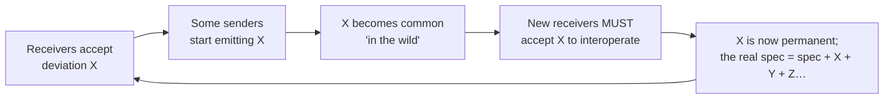
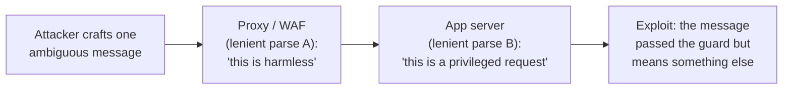
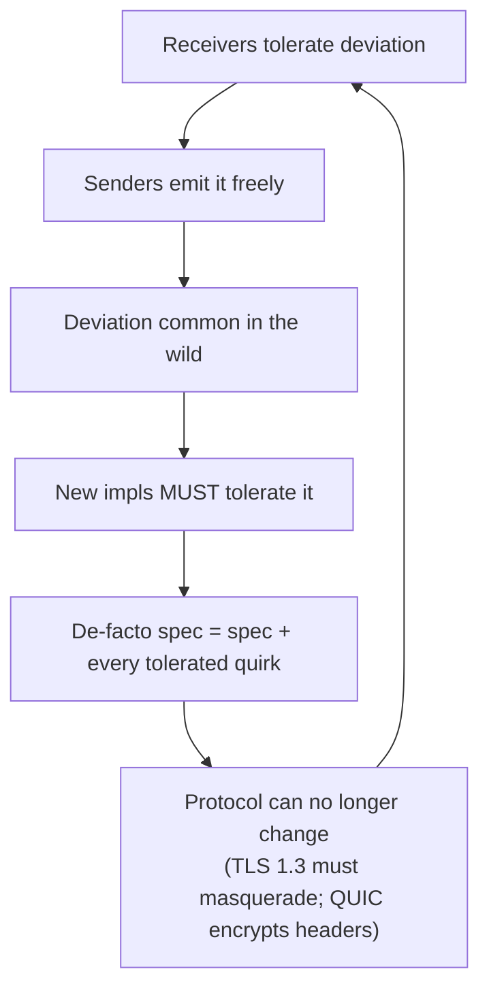
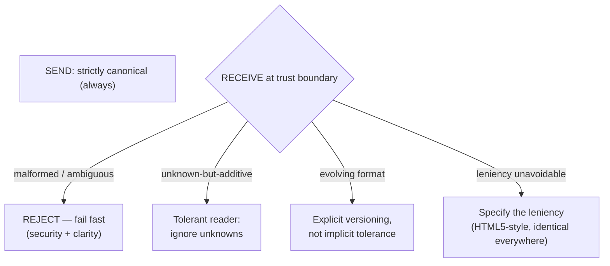

# Robustness Principle — Senior

> **Category:** [Coupling & Cohesion](../../README.md) — Jon Postel's interoperability rule: be conservative in what you send, be liberal in what you accept.

> **Prerequisites:** [Junior](junior.md) · [Middle](middle.md)
> **Focus:** **Design trade-offs** and **system-level reasoning**

---

## Introduction

> Focus: **design trade-offs** and **system-level reasoning**

A senior must be able to do something a junior cannot: **argue against a famous principle on the merits.** Postel's Law is taught as wisdom, and one half of it (conservative output) deserves that reputation. The other half (liberal input) is, in the considered judgement of much of the protocol-design community, a *mistake whose costs compound for decades.* This file makes that case honestly — naming the people who made it and the mechanisms they identified — and then rebuilds a defensible position from the rubble.

The three things a senior must hold simultaneously:

1. **Why liberal acceptance is genuinely harmful** at system scale — ossification, security, spec erosion.
2. **Why the principle nonetheless persists** — it solved a real interoperability problem and its replacement (strict + versioned) requires discipline the early internet didn't have.
3. **The coupling theory** that explains *both*: leniency trades visible coupling for invisible coupling, which is almost always a bad trade.

---

## The Critique, Stated Fairly: "Considered Harmful"

The modern critique is not a hot take; it comes from people who built the systems in question.

- **Eric Allman** — author of **sendmail**, the email server that *embodied* liberal acceptance for decades — wrote *"The Robustness Principle Reconsidered"* (ACM Queue, 2011). Having watched leniency play out at internet scale, his verdict: liberal acceptance **defers and amplifies** problems. A receiver that accepts a malformed message lets the buggy sender ship, so the bug spreads; by the time anyone notices, *many* senders depend on the leniency, and now the lenient behaviour can never be removed without breaking them all.
- **Martin Thomson** (IETF, deeply involved in HTTP/2, QUIC, TLS 1.3) wrote the IETF draft *"The Harmful Consequences of Postel's Robustness Principle."* His central claim is sharper still: liberal acceptance causes **protocol ossification** — the protocol becomes unchangeable — and the only sustainable cure is for implementations to be **strict, and even *actively intolerant*** of deviations, so that the spec stays the spec.

The argument, distilled:

> A tolerant receiver removes the sender's *incentive and feedback* to be correct. Bugs that "work" are never fixed. Over time the set of accepted-but-invalid messages grows, divergent implementations accumulate, and the **written spec stops describing reality** — reality is now "whatever the dominant lenient parser accepts." At that point the protocol is both *insecure* (multiple interpretations of one message) and *frozen* (you can't change it without breaking the accumulated quirks).

This is the case you must be able to make in a design review, fairly, without strawmanning Postel — who solved a real problem under real constraints.

---

## Protocol Ossification: How Tolerance Freezes a System

**Ossification** is the senior-level harm worth understanding deeply, because it's counterintuitive: *tolerance, intended to keep a system flexible, is what makes it rigid.*

The feedback loop:



Each turn of the loop **widens the gap between the written spec and the de-facto spec**, and *narrows* what you can change. Concrete, famous instances:

- **TLS version intolerance.** Middleboxes (firewalls, load balancers) were written to "be liberal" about TLS — but in practice many became *intolerant* of anything they hadn't seen, while others made assumptions about the handshake's exact bytes. The accumulated, undocumented behaviour of millions of deployed middleboxes made it nearly impossible to evolve TLS. **TLS 1.3 had to disguise itself as TLS 1.2** ("middlebox compatibility mode") to traverse the ossified internet — a direct, expensive symptom of decades of "be liberal" deployments hardening into an immovable de-facto standard.
- **QUIC's encryption of almost everything.** QUIC deliberately **encrypts its transport headers** specifically so middleboxes *cannot* observe and ossify around them. This is the anti-Postel design: hide the protocol from would-be lenient/intolerant intermediaries precisely so they can't freeze it. Ossification was treated as a primary threat to design *against*.

The lesson: **leniency does not preserve flexibility; it spends it.** Every tolerated deviation that propagates becomes a constraint future versions must honour. The way to keep a protocol *changeable* turns out to be strictness (and, where possible, opacity), not tolerance.

---

## Parser Differentials as a Security Class

The [Middle](middle.md) level introduced the parser differential as a correctness bug. At senior scope it is a **security vulnerability class** — one of the most productive in modern web security.

The pattern: two components on a request path **both** parse a message, **both** liberally, but with **different** leniencies. An attacker crafts a single message that the two parse *differently*, smuggling intent past the component that's supposed to police it.

| Attack | The differential being exploited |
|---|---|
| **HTTP request smuggling** | Front-end proxy and back-end server disagree on where one request ends and the next begins — because each is *liberal* about conflicting `Content-Length`/`Transfer-Encoding` headers, or about malformed framing. The attacker desyncs them and injects a request the front-end never saw. |
| **Parser-differential auth bypass** | A WAF/validator parses a body or URL one way; the application parses it another. Liberal acceptance of duplicate keys, odd encodings, or alternate forms lets the payload mean one thing to the filter and another to the app. |
| **XML / JSON interpretation gaps** | Lenient acceptance of entities, duplicate keys, or comments differs between the validator and the consumer; the "safe" parse and the "executed" parse diverge. |
| **SQL/command injection surface** | The broader principle: any place that *liberally* accepts and then *reinterprets* input expands the set of strings that can be coerced into an unintended meaning downstream. |



The security principle that falls out is unambiguous and is now industry consensus: **at a trust boundary, be *strict* in what you accept.** Reject ambiguous framing. Reject duplicate/conflicting headers. Reject anything with more than one valid interpretation. "Be liberal in what you accept" is, at a security boundary, a literal description of an attack surface. This is where the Robustness Principle's second half most clearly inverts into harm, and why the [`input-validation`](../../README.md) and [`api-security-checklist`](../../README.md) disciplines all preach strict rejection.

---

## The HTML5 Reaction: Specify the Leniency

HTML is the most-cited *success* of liberal acceptance — browsers render the web's oceans of malformed markup — and also the clearest illustration of the cure.

For years, "tolerate bad HTML" was *implicit*: each browser invented its own error-recovery, and those recoveries **differed**. The result was the classic mess — pages that rendered in one browser and broke in another, and a de-facto spec that was "whatever the market-leading browser did with garbage." That's ossification and parser-differential, in the most-deployed format on earth.

The **HTML5** answer was not "stop being lenient." It was:

> **Specify the leniency precisely.** Define an exact, deterministic error-recovery algorithm so that *every* browser, faced with the *same* malformed input, produces the *same* DOM.

This is the senior insight about tolerance: **leniency is only safe when it is *specified*, not *improvised*.** Implicit per-implementation leniency creates differentials and drift; a single, written, mandatory recovery algorithm collapses the differential to zero — every parser is liberal in *exactly the same way*, which is functionally a strict spec that happens to define behaviour for malformed input too. The HTML5 parsing spec turned an unbounded, divergent tolerance into a bounded, convergent one.

> The reusable rule: if you *must* be liberal, **make the leniency part of the spec, identical across all implementations.** Unspecified tolerance is the enemy; specified tolerance is just a more complete spec.

---

## The Coupling Theory Underneath

Why does this principle live in the coupling chapter? Because the whole debate is a **coupling trade**, and naming it as such resolves it.

- **Strict acceptance** makes the contract **explicit**. The coupling between sender and receiver is *exactly the published spec* — visible, named, minimal. In [Connascence](../03-connascence/senior.md) terms, both sides are connascent only on the **documented format**; that's manageable coupling.
- **Liberal acceptance** adds **implicit** coupling on top of the spec: every tolerated quirk is a hidden connascence between the receiver's parser internals and whatever senders rely on that quirk. This coupling is *invisible* (in no document), *unbounded* (grows with every deviation you accept), and *non-local* (spread across all parties). It's the worst kind: you can't see it, can't measure it, and can't remove it without breaking unknown dependents.

> Postel's Law, read through coupling, says: *trade visible, bounded, documented coupling for invisible, unbounded, undocumented coupling.* Stated that way, it's obviously a bad trade for anything you'll maintain for years. The early internet made it anyway because the alternative — coordinated strictness across uncoordinated parties — was impossible then. We have schemas, versioning, and contract testing now; we don't have to make that trade.

This is also why strictness is an [Orthogonality](../06-orthogonality/senior.md) win: a strict, single-interpretation format keeps the *meaning* of a message independent of *which parser* reads it. Liberal parsing entangles meaning with implementation — the same bytes mean different things depending on who reads them — which is non-orthogonal by definition.

---

## The Counter-Movement: Be Strict in What You Accept

The modern counter-principle, sometimes phrased as the inverse of Postel, has several compatible formulations:

- **"Be strict in what you accept"** (Thomson, the security community) — reject anything not strictly conformant at trust boundaries.
- **"Fail fast"** — surface malformed input immediately, loudly, and locally, rather than absorbing it and failing later, silently, elsewhere. (See [error-handling-patterns](../../README.md).)
- **"Crash early"** (Pragmatic Programmers) — a program that has detected an impossible state should stop, not limp on with corrupt data.
- **Robustness via *contracts*** — define the contract precisely and enforce it on both sides, rather than papering over violations.

The unifying logic: a malformed input is *information* — it tells you a sender is broken or an attacker is probing. Liberal acceptance **throws that information away** (and often acts on a wrong guess); strict rejection **acts on it** (alerts you, blocks the attack, forces the sender to conform). Strictness converts silent, late, global failures into loud, early, local ones — strictly better for both debuggability and security.

Crucially, the counter-movement does **not** reject the *first* half of Postel. "Conservative in what you send" survives untouched and universally endorsed. The fight is entirely over the second half.

---

## A Defensible Synthesis

A senior should leave with a position that's neither naïve Postel-worship nor reflexive rejection:

1. **Be conservative in what you send — always.** Emit one canonical, strictly-conformant form. No exceptions. (Postel's first half: keep it.)
2. **Be strict in what you accept at trust boundaries.** Reject malformed and *ambiguous* input loudly. Treat multiple valid interpretations of one message as a defect/vulnerability, not a convenience. (Reverse Postel's second half here.)
3. **Be tolerant of *unknown-but-additive* extension** — via the **Tolerant Reader** — so formats can evolve additively without breaking readers. This is the *only* form of "liberal" worth keeping, and it never involves guessing. (Salvage the useful sliver.)
4. **Evolve via explicit versioning**, not implicit tolerance. Breaking changes get a version; additive changes ride the tolerant reader. (Get Postel's goal — graceful evolution — from a safer mechanism.)
5. **If leniency is unavoidable, specify it.** Make the error-recovery a written, identical-across-implementations algorithm (the HTML5 move). Unspecified tolerance is the thing to eliminate.

This synthesis keeps the interoperability the principle was created to deliver while shedding the ossification, security, and spec-erosion costs that liberal *parsing* incurs.

---

## Code: From Differential to Canonical

A worked example of converting an ambiguity-tolerant boundary (a smuggling/differential risk) into a strict, canonical one — while preserving additive forward-compatibility.

```typescript
// BEFORE — "liberal": tolerates conflicting framing, duplicate keys, alt forms.
// This is the parser-differential / smuggling surface.
function readCommand(headers: Record<string, string | string[]>, body: string) {
  // duplicate header? just take the first ("be liberal")
  const idRaw = Array.isArray(headers["x-tenant"]) ? headers["x-tenant"][0]
                                                   : headers["x-tenant"];
  // tolerate any-case bool, missing values, junk around the number...
  const force = /true/i.test(String(headers["x-force"] ?? ""));
  const amount = parseFloat(body); // grabs leading number, ignores the rest
  return { tenant: idRaw, force, amount };
}

// AFTER — STRICT at the boundary: one interpretation or a hard reject.
// Still forward-compatible: unknown EXTRA headers/fields are simply ignored.
class BoundaryError extends Error {}

function readCommandStrict(
  headers: Record<string, string | string[]>,
  body: unknown,
): { tenant: string; force: boolean; amount: number } {
  // Conflicting/duplicate headers are AMBIGUOUS → reject, never pick one.
  const tenant = headers["x-tenant"];
  if (Array.isArray(tenant) || typeof tenant !== "string" || tenant === "")
    throw new BoundaryError("x-tenant must be exactly one non-empty value");

  // Exactly the canonical booleans. No case-insensitive guessing.
  const forceRaw = headers["x-force"] ?? "false";
  if (forceRaw !== "true" && forceRaw !== "false")
    throw new BoundaryError("x-force must be 'true' or 'false'");

  // Body is a typed object; amount must match ONE canonical numeric form.
  if (typeof body !== "object" || body === null)
    throw new BoundaryError("body must be a JSON object");
  const raw = (body as Record<string, unknown>)["amount"];
  if (typeof raw !== "number" || !Number.isFinite(raw) || raw < 0)
    throw new BoundaryError("amount must be a finite, non-negative number");

  // Unknown EXTRA fields on `body` are ignored → additive evolution still works.
  return { tenant, force: forceRaw === "true", amount: raw };
}
```

Every place the "before" version *guessed*, the "after" version *rejects* — collapsing the parser-differential surface to zero — yet it stays forward-compatible because unrecognised extra fields pass through untouched. That is the synthesis in code: **strict where ambiguity is dangerous, tolerant only where it's purely additive.**

---

## Liabilities

### Liability 1: Quoting Postel's Law as settled wisdom

In a serious protocol or API review, citing "be liberal in what you accept" as a justification for accepting malformed input will (rightly) draw the Allman/Thomson critique. Know the critique *before* you invoke the principle, or you'll be arguing for an attack surface without realising it.

### Liability 2: Mistaking the tolerant reader for "be liberal about everything"

The tolerant reader's safety comes *entirely* from the additive-only restriction. Teams that cite "tolerant reader" while actually accepting malformed *known* fields have kept the dangerous behaviour and given it a respectable name. The line is: ignore unknowns, never guess at knowns.

### Liability 3: Improvised (unspecified) leniency

Per-implementation error-recovery is how you *manufacture* parser differentials. If you tolerate malformation, the recovery must be specified and identical across implementations (HTML5), or it will diverge and ossify.

### Liability 4: Forgetting that strictness has a cost too

Strict rejection *can* break interoperability with peers you can't fix, and aggressive intolerance can itself harm the ecosystem (overly-strict middleboxes were *also* an ossification cause). The cure is contained, documented compatibility shims at the boundary — not blanket leniency, and not reckless strictness that breaks legitimate peers.

---

## Pros & Cons at the System Level

| Dimension | Liberal acceptance (Postel's 2nd half) | Strict acceptance (counter-movement) |
|---|---|---|
| Short-term interop with buggy peers | Higher | Lower (peers must conform) |
| Long-term protocol evolvability | **Low — ossifies** | **High — spec stays the truth** |
| Security surface | **Large** — parser differentials, smuggling | Small — one interpretation per message |
| Spec integrity over time | Erodes to "whatever the parser accepts" | Preserved |
| Coupling | Invisible, unbounded, undocumented | Visible, bounded, documented |
| Debuggability | Silent, late, global failures | Loud, early, local failures |
| Forward-compatibility | Good *only* if restricted to additive (tolerant reader) | Good *with* tolerant reader + versioning |
| Conservative *output* | Endorsed by both — keep it always | Endorsed by both — keep it always |

The table's verdict: liberal acceptance wins exactly one row (short-term interop with peers you can't fix) and loses the rest at system scale. That single win is real but addressable with contained shims; the losses are structural. Hence the senior default: **strict in, conservative out, tolerant only of additive change, evolve by version.**

---

## Diagrams

### The ossification loop (why tolerance freezes a protocol)



### The senior synthesis



---

## Related Topics

- **The coupling theory:** [Connascence](../03-connascence/senior.md), [Minimise Coupling](../01-minimise-coupling/senior.md).
- **Why single-interpretation matters:** [Orthogonality](../06-orthogonality/senior.md).
- **Security framing:** [`input-validation`](../../README.md), [`api-security-checklist`](../../README.md), [`sql-injection-prevention`](../../README.md).
- **Safer evolution mechanism:** [`api-versioning`](../../README.md).

---


---

## Check your understanding

1. Explain Robustness Principle — Senior Level in your own words and name the problem it solves.
2. How would you apply the ideas around Table of Contents, Introduction, The Critique, Stated Fairly: "Considered Harmful" in a realistic engineering change?
3. What failure mode or misuse should you look for, and what evidence would reveal it?
4. How would you validate a system-level decision about Robustness Principle — Senior Level under uncertainty?
5. What observable result would convince you that the approach improved the system?
