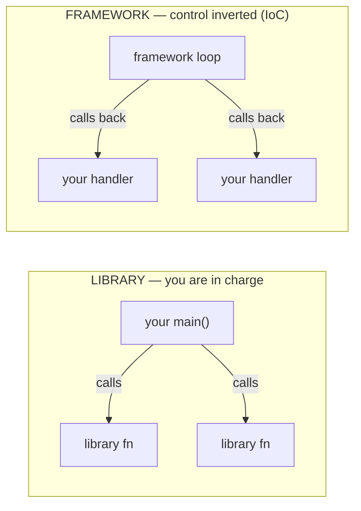
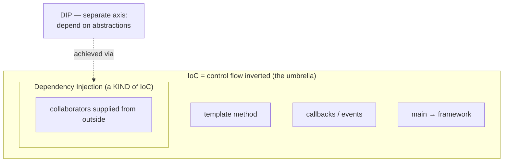

# Inversion of Control (IoC) — Junior

> **Category:** [Design Principles → Coupling & Cohesion](../../README.md) — the broad principle where the *flow of control* is inverted: instead of your code calling a library, a framework calls into your code. "Don't call us, we'll call you."

---

## Table of Contents

1. [Introduction](#introduction)
2. [Prerequisites](#prerequisites)
3. [Glossary](#glossary)
4. [The Core Idea: Who Is in Charge?](#the-core-idea-who-is-in-charge)
5. [Library vs. Framework](#library-vs-framework)
6. [The Hollywood Principle](#the-hollywood-principle)
7. [A Worked Example: Inverting a CLI Loop](#a-worked-example-inverting-a-cli-loop)
8. [The Forms of IoC](#the-forms-of-ioc)
9. [Code Examples](#code-examples)
10. [IoC vs DI vs DIP — First Contact](#ioc-vs-di-vs-dip--first-contact)
11. [Why IoC Lowers Coupling](#why-ioc-lowers-coupling)
12. [Best Practices](#best-practices)
13. [Common Mistakes](#common-mistakes)
14. [Tricky Points](#tricky-points)
15. [Test Yourself](#test-yourself)
16. [Cheat Sheet](#cheat-sheet)
17. [Summary](#summary)
18. [Further Reading](#further-reading)
19. [Related Topics](#related-topics)
20. [Diagrams](#diagrams)

---

## Introduction

> Focus: **What is it?** and **How to use it?**

**Inversion of Control (IoC)** is one of the broadest ideas in software design, and it has one defining sentence:

> **Inversion of Control** is the principle where the *flow of control* is inverted: instead of *your* code calling into reusable code, the reusable code (a framework) calls into *yours*.

In ordinary, "normal" code you are in charge. Your `main()` runs top to bottom, and whenever it needs something done, it *calls* a function or a library: `sort(list)`, `json.parse(text)`, `db.query("...")`. You decide the order, you decide when each thing happens. The library is passive — it sits there until you call it.

Under IoC the relationship flips. You hand your code to a *framework* — a web framework, a test runner, a UI library, a game engine — and **the framework runs the main loop.** It decides when to call your code. You no longer write "first do A, then B, then C"; you write small pieces (a request handler, a button-click callback, a test method, an overridden hook) and the framework invokes them at the right moments. **Control has been inverted** — it now flows *from* the framework *into* you, not the other way around.

### Why this matters

This single shift is what separates a *library* from a *framework*, and it's the engine behind almost every framework you'll ever use: Spring, React, JUnit, Express, Django, Unity. Understanding "who calls whom" tells you how to use a tool, where your code plugs in, and — the reason this topic lives in **Coupling & Cohesion** — *why* IoC keeps your code loosely coupled: the framework owns the wiring and the timing, so your code only depends on the small, well-defined pieces it's handed.

---

## Prerequisites

- **Required:** You can write functions, classes, and a basic `main()` program; you understand what "calling a function" means.
- **Required:** You've used at least one library (something you `import` and call).
- **Helpful:** You've used at least one *framework* (a web framework, a test runner, a UI toolkit) — even if you didn't notice the inversion at the time.
- **Helpful:** A first feel for **[coupling](../01-minimise-coupling/junior.md)** — how a change in one place forces a change in another.

---

## Glossary

| Term | Definition |
|------|-----------|
| **Flow of control** | The order in which statements and function calls actually execute at runtime — "what runs, and what calls what." |
| **Inversion of Control (IoC)** | The flow of control is inverted: the framework calls your code instead of your code calling the library. |
| **Library** | Reusable code **you call.** You stay in charge of the flow; you decide when to invoke it. |
| **Framework** | Reusable code that **calls you.** It owns the main loop and invokes your code at the right moments. |
| **Hollywood Principle** | "Don't call us, we'll call you" — the slogan for IoC: you register your code, the framework calls it back. |
| **Callback / hook** | A function (or method) you give to a framework so it can call you back when something happens. |
| **Dependency Injection (DI)** | One specific kind of IoC: an object's collaborators are *handed to it from outside* instead of being created inside it. |
| **Composition root** | The single place where the whole object graph is wired together (often near `main()` or a framework's startup). |

---

## The Core Idea: Who Is in Charge?

The entire topic collapses into one question: **who calls whom?**

```text
NORMAL control flow (you are in charge):
   your main()  ──calls──►  library
   your main()  ──calls──►  library
   (YOU decide the order and the timing)

INVERTED control flow (the framework is in charge):
   framework    ──calls──►  your code
   framework    ──calls──►  your code
   (the FRAMEWORK decides the order and the timing; you registered the pieces)
```

In the first picture the arrows point *out of* your code into reusable code. In the second they point *into* your code from the framework. That reversal of arrow direction **is** Inversion of Control. Everything else in this topic is detail about *how* that reversal is done and *why* it's useful.

A concrete pair to hold in your head:

- **You call a library:** `result = sorted(items, key=...)`. You wrote the `main`, you called `sorted`, you got the result back, you continued. Control never left your hands.
- **A framework calls you:** in a web app you write `def handle_get(request): ...` and *register* it for the URL `/users`. You never call `handle_get` yourself. The framework runs the server loop, waits for a request, and **calls your function for you** when one arrives. Control lives in the framework; your handler is summoned.

---

## Library vs. Framework

People use these two words loosely, but IoC gives a sharp, testable definition:

> A **library** is code you call. A **framework** is code that calls you. The dividing line is the **direction of control** — and that direction is exactly what IoC inverts.

| | **Library** | **Framework** |
|---|---|---|
| Who owns `main()` / the loop | **You** | **The framework** |
| Who calls whom | You → library | Framework → you |
| You provide | Calls at times you choose | Code to be called back later (handlers, hooks, components) |
| Mental model | A toolbox you reach into | A skeleton you fill in |
| Examples | `lodash`, `requests`, `math`, `jackson`, `numpy` | React, Spring, Django, JUnit, Express, Unity |
| Control is… | **Not** inverted | **Inverted** (this *is* IoC) |

> A simple test when you meet a new tool: *Do I call it, or does it call me?* If you call it, it's a library and you're in charge. If you register code and it calls you back, it's a framework and **control is inverted.**

Some tools are both: you call parts of them directly (library style) *and* register callbacks they invoke (framework style). Most large ecosystems blend the two. The useful skill is to notice, for any given line, *which way the call goes.*

---

## The Hollywood Principle

IoC has a famous nickname that captures it perfectly:

> **"Don't call us, we'll call you."** — the Hollywood Principle.

It comes from the (probably apocryphal) brush-off a casting agent gives an actor after an audition. You don't get to phone the studio every day asking if you've got the part; you leave your number, and *they* call *you* when they want you. That's exactly how framework code treats your code:

1. You **register** your code with the framework — a route handler, a button's `onClick`, a test method, an overridden lifecycle method.
2. You **give up** the right to call it yourself; you don't run the loop.
3. The framework **calls you back** at the right moment — when a request arrives, when the button is clicked, when the test runner reaches your method, when the component mounts.

The whole game of using a framework is: *figure out what to register, and what each callback should do, and then let go of control.* Beginners fight this — they look for "where do I call my handler?" The answer is: you don't. **The framework does. That's the point.**

---

## A Worked Example: Inverting a CLI Loop

The clearest way to *feel* IoC is to watch the same program written both ways. We'll build a tiny "command processor" that greets, adds numbers, and quits.

### Version A — You are in charge (library style, no inversion)

```python
# YOU own the loop. YOU call helpers. Control never leaves your code.
def greet(name):       return f"Hello, {name}!"
def add(a, b):         return a + b

def main():
    while True:
        line = input("> ")              # you call input
        parts = line.split()
        if parts[0] == "greet":
            print(greet(parts[1]))      # you call greet
        elif parts[0] == "add":
            print(add(int(parts[1]), int(parts[2])))  # you call add
        elif parts[0] == "quit":
            break

main()
```

Notice: **your** `main` runs the `while` loop, **your** code calls `greet` and `add`. `greet`/`add` are a tiny *library*. To add a new command you edit the `if/elif` ladder in the loop. You are fully in charge.

### Version B — A "framework" is in charge (control inverted)

Now imagine a tiny command-processor *framework* that owns the loop. You don't write the loop anymore; you **register handlers** and the framework calls them.

```python
# ---- the framework (someone else's code; you don't edit this) ----
class CommandApp:
    def __init__(self):
        self._handlers = {}                      # name -> your function

    def command(self, name):                     # registration decorator
        def register(fn):
            self._handlers[name] = fn
            return fn
        return register

    def run(self):                               # the framework owns the loop
        while True:
            parts = input("> ").split()
            handler = self._handlers.get(parts[0])
            if handler is None:
                print("unknown command"); continue
            if parts[0] == "quit":
                break
            print(handler(*parts[1:]))           # <<< the framework calls YOUR code

# ---- your code: you only register handlers; you never run the loop ----
app = CommandApp()

@app.command("greet")
def greet(name):          return f"Hello, {name}!"

@app.command("add")
def add(a, b):            return int(a) + int(b)

@app.command("quit")
def quit_():              return "bye"

app.run()                 # you hand control to the framework — and let go
```

What changed?

- In Version A, **your** code called `greet`. In Version B, **the framework's** `run` loop calls `greet` for you (`handler(*parts[1:])`). Control inverted.
- You no longer own the loop. You register pieces (`@app.command(...)`) and call `app.run()` *once*, handing control to the framework.
- Adding a command no longer means editing a central `if/elif` ladder — you just register a new handler. The framework already knows how to find and call it.

That last point is the payoff: **your handlers don't know about each other, and the loop doesn't know about your handlers** beyond the small `name -> function` contract. That decoupling is *why* this topic lives under Coupling & Cohesion.

> Every real framework you use — web, UI, test, game — is "Version B" at a much larger scale. Once you see the inversion here, you'll see it everywhere.

---

## The Forms of IoC

"IoC" is an umbrella. The *control* that gets inverted can be different things. Martin Fowler's point (in *bliki: InversionOfControl*) is that the useful question is always **"which control is inverted?"** Here are the common forms a junior will meet:

| Form of IoC | What gets inverted | Everyday example |
|---|---|---|
| **Framework lifecycle / template method** | The framework runs the algorithm and calls *your* steps | React calls your component's `render`; JUnit calls your `@Test` methods |
| **Event-driven / callbacks** | The event loop calls your handler when something happens | `button.onClick(handler)`; a UI event loop |
| **`main()` → framework** | The framework owns `main`/the run loop, not you | A web server runs the loop and dispatches requests to your handlers |
| **Dependency Injection (DI)** | The *construction* of your collaborators is done outside and handed in | A container creates your `OrderService` with its dependencies and gives it to you |
| **Service locator** | You ask a central registry for a dependency rather than constructing it | `Registry.get(Clock.class)` |

The first three invert **flow** (when your code runs). DI inverts **construction** (where your collaborators come from). They're all "inversion of control," which is exactly why the term is broad — and why seniors insist on naming *which* inversion they mean. (You'll see the airtight distinctions in [Middle](middle.md) and [Senior](senior.md).)

---

## Code Examples

### Template Method — the framework runs the algorithm, calls your hook (Java)

The original meaning of "IoC" is the **Template Method** pattern: a base class (the framework) defines the skeleton of an algorithm and calls *your* overridden steps.

```java
// Framework code: owns the algorithm, calls YOUR hooks (the "primitive operations").
abstract class ReportGenerator {
    public final void generate() {     // the framework drives the steps
        var data = loadData();         // <-- calls your hook
        var body = formatBody(data);   // <-- calls your hook
        write("REPORT\n" + body);      // framework's own step
    }
    protected abstract List<Row> loadData();          // YOU implement
    protected abstract String formatBody(List<Row> d);// YOU implement
    private void write(String s) { System.out.println(s); }
}

// Your code: you fill in the holes; you NEVER call generate()'s steps yourself.
class SalesReport extends ReportGenerator {
    protected List<Row> loadData()           { return db.sales(); }
    protected String formatBody(List<Row> d) { return d.toString(); }
}

new SalesReport().generate();   // control flows framework -> your hooks
```

You don't call `loadData` or `formatBody` — `generate()` (the framework) does. That's IoC at its most classic: **"Don't call us (the steps), we'll call you."**

### Callback / event handler — the loop calls you back (TypeScript)

```typescript
// You register a callback; the event loop calls it back when the click happens.
button.addEventListener("click", () => {
  console.log("clicked!");        // the loop calls THIS, you never do
});

// Same shape with a higher-order function: YOU pass code to be called back.
[1, 2, 3].forEach((n) => console.log(n * 2));   // forEach calls your arrow fn
```

### A test runner calls your tests (Python, pytest)

```python
# You never call test_add(). The pytest framework discovers it and calls it.
def test_add():
    assert 1 + 1 == 2

# Run `pytest` and the FRAMEWORK finds every test_* function and invokes it.
# Control is inverted: you wrote the checks; the runner owns the loop.
```

Every one of these is the same move from different angles: **you supply code; something else calls it.**

---

## IoC vs DI vs DIP — First Contact

These three get mixed up constantly. Here's the junior-level summary; the airtight version is in [Senior](senior.md) and in the sibling [Dependency Inversion topic](../../04-solid/05-dip-dependency-inversion/senior.md).

| Term | One-line meaning | The "inversion" it names |
|---|---|---|
| **IoC** (broad) | The framework calls your code instead of you calling it | Direction of **control / flow** |
| **DI** | An object's collaborators are *handed in from outside*, not built inside | Control of **construction** (a *kind* of IoC) |
| **DIP** | A *design principle*: depend on abstractions, not concrete details | Direction of **source-code dependencies** (a different axis entirely) |

The relationships to memorize:

- **DI is *a kind of* IoC.** "Inverting *who constructs* my collaborators" is one specific control inversion. IoC is the whole umbrella; DI is one slice of it.
- **DIP is *not* IoC.** DIP is a *principle* about which way your dependencies point (toward abstractions). IoC is about who *drives execution*. They cooperate beautifully — DI is usually how you achieve DIP — but they are different ideas on different axes. Don't say "IoC" when you mean "DIP."

> Memorize the shape: **IoC ⊃ DI** (DI is one kind of IoC). **DIP** lives on a separate axis (dependency direction) and is achieved *via* DI. We don't re-derive DIP here — see the [Dependency Inversion topic](../../04-solid/05-dip-dependency-inversion/junior.md) for that.

```text
        ┌──────────────── IoC (control flow inverted) ────────────────┐
        │  template method · callbacks/events · main→framework         │
        │  ┌─────────────── Dependency Injection ───────────────┐      │
        │  │  collaborators supplied from outside (a kind of IoC)│      │
        │  └─────────────────────────────────────────────────────┘      │
        └───────────────────────────────────────────────────────────────┘

   DIP  (separate axis): depend on abstractions, not details.
        Usually ACHIEVED using DI — but it is not the same thing.
```

---

## Why IoC Lowers Coupling

This topic is in **Coupling & Cohesion** for a concrete reason. IoC lowers coupling in two ways:

1. **The framework owns the wiring and the timing.** Your handler doesn't know how the request arrived, what ran before it, or what runs after. It depends only on the small contract it was handed (a `request` in, a `response` out). It does not depend on the loop, on other handlers, or on the framework's internals. *Fewer things to depend on → lower coupling.*

2. **Your high-level policy stays independent of low-level mechanism.** In Version B above, your `greet`/`add` logic doesn't depend on *how* input is read or *how* output is printed — the framework handles that. You could swap the loop (read from a file, a socket, a GUI) without touching your handlers. Policy and mechanism are decoupled.

A practical bonus: **testability.** Because your handler is just a function the framework happens to call, *you* can call it directly in a test — no framework, no loop, no server. Code that the framework calls is usually code you can call too, in isolation. (Deepened in [Middle](middle.md).)

---

## Best Practices

1. **Ask "who calls whom?" first.** For any tool, decide whether you call it (library) or it calls you (framework). That tells you where your code plugs in.
2. **When using a framework, let go of the loop.** Don't look for "where do I call my handler?" — you register it; the framework calls it. Embrace the inversion.
3. **Keep your callbacks/handlers small and focused.** A handler should do its one job; the framework handles the surrounding flow. Don't reach back into framework internals.
4. **Name *which* control is inverted** when you say "IoC" — flow (callbacks/template) or construction (DI). Vagueness here causes most of the confusion.
5. **Don't confuse IoC with DIP.** IoC = who drives execution. DIP = which way dependencies point. Use the right word.

---

## Common Mistakes

1. **"IoC means dependency injection."** No — **DI is just one kind of IoC.** Template methods, callbacks, and event loops are IoC with no DI at all. (See [The Forms of IoC](#the-forms-of-ioc).)
2. **Trying to call your own handler.** Writing a route handler and then looking for the line that calls it. The framework calls it; you only register it.
3. **Calling "IoC" what is really "DIP."** IoC is about control direction; DIP is about dependency direction. Keep them apart.
4. **Treating "framework" and "library" as synonyms.** The whole distinction is *who is in charge of control.* It's not about size.
5. **Fighting the framework's flow.** Trying to seize back the main loop, run things in your own order, or bypass the lifecycle — usually a sign you're using the framework wrong.

---

## Tricky Points

- **The same `forEach` is IoC.** When you pass a function to `forEach`/`map`, *it* calls *your* function — control is (briefly) inverted. IoC isn't only about giant frameworks; it shows up any time you hand code to be called back.
- **A framework is "a library that calls you."** There's no hard size threshold. The defining property is the inverted control direction, not lines of code.
- **You still write the *what*, the framework owns the *when*.** IoC doesn't take your logic away — it takes the *scheduling* of your logic away. You define behavior; the framework decides timing.
- **`main()` may not be "yours" anymore.** Under many frameworks, the real entry point is the framework's; your code is summoned from inside it. "Where does execution actually start?" becomes a real question (explored at [Senior](senior.md)).

---

## Test Yourself

1. State Inversion of Control in one sentence.
2. What is the single defining difference between a *library* and a *framework*?
3. What is the Hollywood Principle, and what does it describe?
4. Is Dependency Injection the same as IoC? Explain the relationship.
5. Name three different *forms* of IoC.
6. Give one reason IoC lowers coupling.

---

## Cheat Sheet

```text
INVERSION OF CONTROL (IoC)
  Definition   the FLOW OF CONTROL is inverted:
               framework calls YOUR code, instead of you calling a library.
  Slogan       "Don't call us, we'll call you" (the Hollywood Principle).

LIBRARY vs FRAMEWORK
  library      code YOU call      → you own the loop      (control NOT inverted)
  framework    code that CALLS you → it owns the loop      (control INVERTED = IoC)
  test:        "do I call it, or does it call me?"

FORMS OF IoC (which control is inverted?)
  template method  framework runs the algorithm, calls your hooks
  callbacks/events the loop calls your handler when something happens
  main→framework   the framework owns main()/the run loop
  DI               your collaborators are supplied from OUTSIDE (a KIND of IoC)
  service locator  you ask a registry for a dependency

DON'T CONFUSE
  IoC ⊃ DI         DI is ONE kind of IoC (inverts construction)
  IoC ≠ DIP        DIP = which way DEPENDENCIES point (a separate axis)

WHY IT HELPS COUPLING
  framework owns wiring/timing → your code depends on a tiny contract only
  policy stays independent of mechanism; handlers are directly testable
```

---

## Summary

- **Inversion of Control** is the broad principle where the *flow of control* is inverted: a **framework calls your code** instead of your code calling a library. Its slogan is the **Hollywood Principle** — *"Don't call us, we'll call you."*
- The line between a **library** (you call it) and a **framework** (it calls you) *is* the direction of control — exactly what IoC inverts.
- IoC is an **umbrella**: the inverted control can be the framework **lifecycle/template method**, **callbacks/events**, the **main loop**, **dependency injection**, or a **service locator**. Always ask *which* control is inverted.
- **DI is one kind of IoC** (IoC ⊃ DI). **DIP is a different axis** (dependency direction), achieved *via* DI — not the same as IoC.
- IoC **lowers coupling**: the framework owns wiring and timing, your code depends only on the small contract it's handed, policy stays independent of mechanism, and handlers become directly testable.

---

## Further Reading

- Martin Fowler, [*Inversion of Control Containers and the Dependency Injection pattern*](https://martinfowler.com/articles/injection.html) — the canonical clarification of IoC, DI, and the service locator.
- Martin Fowler, [*bliki: InversionOfControl*](https://martinfowler.com/bliki/InversionOfControl.html) — "which control is inverted?" and the library/framework distinction.
- Ralph Johnson & Brian Foote, *Designing Reusable Classes* — the origin of "Don't call us, we'll call you" for frameworks.
- The Template Method, Observer, and Strategy patterns — concrete IoC mechanisms.

---

## Related Topics

- **Separate axis (dependency direction):** [Dependency Inversion (DIP)](../../04-solid/05-dip-dependency-inversion/junior.md).
- **Sibling principles:** [Minimise Coupling](../01-minimise-coupling/junior.md), [Open/Closed](../../04-solid/02-ocp-open-closed/junior.md).
- **Patterns that implement IoC:** Design Patterns (Template Method, Observer, Strategy).

---

## Diagrams






---

## Check your understanding

1. Explain Inversion of Control (IoC) — Junior Level in your own words and name the problem it solves.
2. How would you apply the ideas around Table of Contents, Introduction, Prerequisites in a realistic engineering change?
3. What failure mode or misuse should you look for, and what evidence would reveal it?
4. What small example would prove that you can apply Inversion of Control (IoC) — Junior Level correctly?
5. What observable result would convince you that the approach improved the system?
