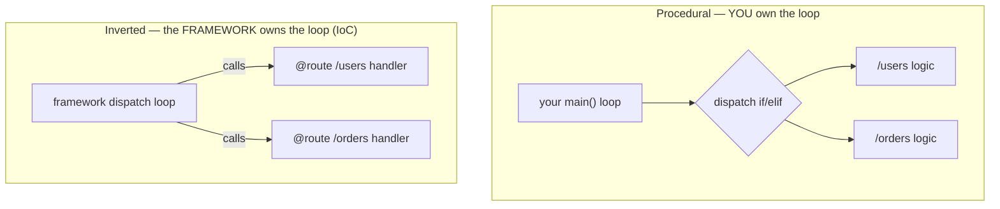
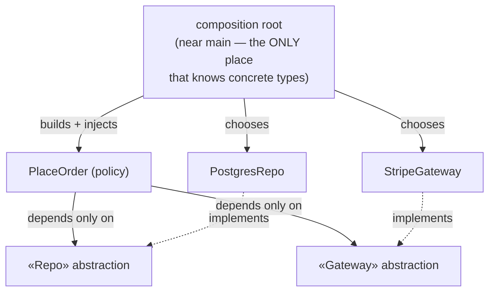

# Inversion of Control (IoC) — Middle

> **Category:** [Design Principles → Coupling & Cohesion](../../README.md) — the broad principle where the *flow of control* is inverted: a framework calls into your code instead of your code calling a library.

> **Prerequisite:** [Junior](junior.md)
> **Focus:** **Why** and **When**

---

## Table of Contents

1. [Introduction](#introduction)
2. [Which Control Is Inverted? (Fowler's Question)](#which-control-is-inverted-fowlers-question)
3. [Template Method: The Original IoC](#template-method-the-original-ioc)
4. [Strategy + Injection: Inverting a Pluggable Step](#strategy--injection-inverting-a-pluggable-step)
5. [Inverting a Whole Program: main → Framework](#inverting-a-whole-program-main--framework)
6. [The Composition Root](#the-composition-root)
7. [IoC vs DI vs DIP — The Working Distinction](#ioc-vs-di-vs-dip--the-working-distinction)
8. [Why IoC Lowers Coupling (Mechanically)](#why-ioc-lowers-coupling-mechanically)
9. [When to Reach for IoC — and When Not To](#when-to-reach-for-ioc--and-when-not-to)
10. [Trade-offs](#trade-offs)
11. [Edge Cases](#edge-cases)
12. [Tricky Points](#tricky-points)
13. [Best Practices](#best-practices)
14. [Test Yourself](#test-yourself)
15. [Summary](#summary)
16. [Diagrams](#diagrams)

---

## Introduction

> Focus: **Why** and **When**

At the junior level IoC was a slogan — *"don't call us, we'll call you"* — and a way to tell a library from a framework. At the middle level it becomes a **design tool you reach for deliberately**: you *invert control on purpose* to decouple a stable, high-level policy from the low-level mechanisms it would otherwise be glued to.

The recurring middle-level skills are three:

1. **Naming the inversion precisely.** "IoC" is too broad to be useful on its own; you must say *which* control is inverted (flow vs. construction) or you'll talk past your teammates — and conflate IoC, DI, and DIP.
2. **Choosing the right IoC mechanism** for the job: a template method, a strategy you inject, a callback, or full framework dispatch — each inverts a different thing at a different cost.
3. **Knowing when the inversion is *worth it*.** IoC trades explicit, easy-to-follow control flow for decoupling and pluggability. That trade pays off at real seams and *over*-pays everywhere else.

---

## Which Control Is Inverted? (Fowler's Question)

Martin Fowler's most useful contribution to this topic (in *bliki: InversionOfControl*) is a question, not a definition:

> Whenever someone says "this uses Inversion of Control," ask: **"Which control is being inverted?"**

The phrase is so broad it's almost meaningless without that answer. Here are the inversions you'll actually name as a mid-level engineer:

| The control being inverted | Before (you in charge) | After (inverted) | Mechanism |
|---|---|---|---|
| **Flow of an algorithm's steps** | Your code runs each step | A skeleton runs the algorithm, calls *your* steps | **Template Method** |
| **Which behavior a step uses** | The class hard-codes the behavior | The behavior is handed in and called | **Strategy + injection** |
| **When code runs (events)** | You poll / call in order | The loop calls your handler on an event | **Callbacks / Observer / event loop** |
| **The program's main loop** | Your `main()` drives | The framework's loop drives; it calls your handlers | **`main()` → framework** |
| **Where collaborators come from** | The object `new`s its own deps | An outside agent builds and supplies them | **Dependency Injection** |

The first four invert **flow** (*when/whether your code runs*). The last inverts **construction** (*where your collaborators come from*). Both are honestly "inversion of control" — which is exactly why the unqualified term causes so much confusion, and why a precise engineer always says *which*.

---

## Template Method: The Original IoC

When the term "Inversion of Control" was coined (for object-oriented frameworks in the late '80s), it meant precisely this: a **base class owns the algorithm and calls your overridden steps.** This is the Template Method pattern, and it's the purest illustration of the inversion.

```python
# FRAMEWORK side: owns the algorithm skeleton; calls YOUR hooks.
class HttpServer:
    def handle_request(self, raw):          # the framework drives every request
        req = self.parse(raw)               # framework step
        if not self.authorize(req):         # <-- YOUR hook
            return self.reject()            # framework step
        result = self.process(req)          # <-- YOUR hook (the real work)
        return self.render(result)          # <-- YOUR hook

    def parse(self, raw):  ...              # framework provides
    def reject(self):      ...              # framework provides
    # hooks you override:
    def authorize(self, req): return True   # default; override to change policy
    def process(self, req):   raise NotImplementedError
    def render(self, result): return str(result)

# YOUR side: fill in the holes. You never call handle_request's steps yourself.
class UserApi(HttpServer):
    def authorize(self, req): return req.token == "secret"
    def process(self, req):   return {"user": req.path.split("/")[-1]}
```

The control inversion is exact: **you do not call `authorize`, `process`, or `render` — `handle_request` does.** You supply *what* each step means; the framework supplies *when* it runs and *in what order*. The high-level algorithm (parse → authorize → process → render) lives once, in the framework, and is immune to your variations; your variations plug into named holes without knowing the surrounding flow.

> Template Method is the **inheritance-based** form of IoC. Its sibling, **Strategy + injection** (next), achieves the same inversion with **composition** — which is usually preferable. See [Composition Over Inheritance](../05-composition-over-inheritance/junior.md).

---

## Strategy + Injection: Inverting a Pluggable Step

Template Method inverts a step via *overriding a subclass method*. The composition-based alternative inverts the *same* step by **handing in an object** that does it — the Strategy pattern, supplied by **dependency injection**.

```typescript
// The pluggable step is an interface (a "port" the policy owns).
interface PricingStrategy { price(base: number): number; }

// High-level policy: it CALLS the strategy, but does NOT decide which one.
class Checkout {
  constructor(private pricing: PricingStrategy) {}   // injected from outside
  total(base: number): number {
    return this.pricing.price(base);                 // calls whatever was handed in
  }
}

// Interchangeable behaviors (the framework/composition root picks one):
class Standard implements PricingStrategy { price(b: number) { return b; } }
class BlackFriday implements PricingStrategy { price(b: number) { return b * 0.7; } }

// Composition root decides the wiring; Checkout never knows which it got.
const checkout = new Checkout(new BlackFriday());
```

Two inversions are stacked here:

- **Flow inversion (Strategy):** `Checkout` *calls* `pricing.price(...)` without knowing the concrete behavior — control over *which* pricing runs has been handed out.
- **Construction inversion (DI):** `Checkout` does not `new` its `PricingStrategy`; it's **handed in** from outside. That's the dependency-injection slice of IoC.

The result: `Checkout` (policy) is fully decoupled from any concrete pricing rule (mechanism). Add a `Clearance` strategy and `Checkout` doesn't change at all — that's [Open/Closed](../../04-solid/02-ocp-open-closed/junior.md) made real, and IoC is the lever. (The dependency-direction story — depending on the `PricingStrategy` *abstraction* rather than a concrete class — is **DIP**, covered in the [Dependency Inversion topic](../../04-solid/05-dip-dependency-inversion/junior.md).)

---

## Inverting a Whole Program: main → Framework

The biggest inversion is at the top: **who owns `main()` / the run loop.** Watch a procedural program become a framework-driven one.

### Procedural — your `main()` is in charge

```python
def main():
    server = socket.create_server(("", 8080))
    while True:                          # YOU own the loop
        conn, _ = server.accept()
        raw = conn.recv(65536)
        path = parse_path(raw)
        if path == "/users":             # YOU dispatch
            conn.send(users_response())
        elif path == "/orders":
            conn.send(orders_response())
        conn.close()
```

You own the accept loop, the parsing, and the dispatch `if/elif`. Every new route edits the central loop. The web *mechanism* (sockets, parsing, dispatch) is braided into your *policy* (what `/users` returns).

### Inverted — the framework owns the loop, calls your handlers

```python
app = Flask(__name__)               # the framework

@app.route("/users")                # you REGISTER a handler
def users():   return users_response()

@app.route("/orders")
def orders():  return orders_response()

app.run(port=8080)                  # hand control to the framework — and let go
```

The framework now owns the accept loop, parsing, and dispatch. You contribute only **handlers** and **route registrations**. Control is inverted: you never call `users()`; the framework calls it when a matching request arrives. Your policy (*what `/users` returns*) is completely separated from the mechanism (*sockets, parsing, dispatch*), which now lives in reusable framework code.

The same pattern recurs across every framework:

| Framework | Who owns the loop | What you register / override (it calls you) |
|---|---|---|
| **Flask / Express / Spring MVC** | request-dispatch loop | route handlers / controllers |
| **JUnit / pytest** | test runner | `@Test` methods / `test_*` functions |
| **React** | render/reconciliation loop | components, `useEffect`, event handlers |
| **Unity / a game engine** | game loop | `Update()`, `OnCollision()` |
| **GUI toolkits (Qt, Android)** | event loop | `onClick`, `onCreate`, lifecycle callbacks |

> React is a clean mental model: you never call `render` or `useEffect`. You *declare* a component, and React's reconciler decides when to call it, when effects run, when to re-render. The component lifecycle **is** IoC — control over *when your code runs* belongs to React.

---

## The Composition Root

Once construction is inverted (DI), a new question appears: **if objects don't build their own dependencies, who does — and where?** The answer is the **composition root**.

> The **composition root** is the single place, as close to the program's entry point as possible, where the entire object graph is wired together — concrete implementations are chosen and injected.

```python
# composition root: the ONE place that knows concrete types and wires them.
def build_app():
    clock      = SystemClock()
    repo       = PostgresOrderRepo(db_pool())     # concrete chosen HERE
    gateway    = StripeGateway(api_key=ENV_KEY)   # concrete chosen HERE
    place_order = PlaceOrder(repo, gateway, clock) # everything injected
    return CommandApp(place_order)

if __name__ == "__main__":
    build_app().run()        # after this point, nothing calls `new`/concrete ctors
```

Why concentrate wiring in one place?

- **Every other module stays free of concrete dependencies.** `PlaceOrder` knows only the *abstractions* it was handed; only the composition root knows that "the repo is Postgres" and "the gateway is Stripe."
- **Swapping an implementation is a one-line change** at the root (e.g., `InMemoryOrderRepo` for tests, `FakeGateway` for a demo). The policy code never changes.
- **The dependency graph is visible in one file** instead of scattered across a hundred `new` calls. You can read the whole system's wiring at a glance.

A **DI container** (next levels) is just an automated composition root: instead of writing the `new` calls by hand, you register types and let the container build the graph. Whether hand-wired or container-driven, the *principle* is the same — construction is inverted out of the objects and into one root.

---

## IoC vs DI vs DIP — The Working Distinction

This is the distinction that trips up most mid-level engineers in design discussions and interviews. Keep these on **three separate axes** — and keep it consistent with the [Dependency Inversion topic](../../04-solid/05-dip-dependency-inversion/senior.md), which owns the deep version.

| | **IoC** | **DI** | **DIP** |
|---|---|---|---|
| **What it is** | Architectural *principle/pattern* | Construction *technique* | Design *principle* |
| **Inverts** | Flow of **control** (who calls whom) | **Construction** (who builds your deps) | Direction of **source dependencies** |
| **Answers** | Does the framework call me, or I call it? | Are my collaborators built inside, or handed in? | Do I depend on abstractions or details? |
| **Scope** | Whole program / a step's timing | One object's collaborators | The compile-time dependency graph |
| **Example** | A web framework calls your handler | `new Service(repo)` — `repo` passed in | `Service` depends on `Repo` *interface*, not `PostgresRepo` |

The three relationships you must be able to state without hesitating:

1. **DI is a *kind of* IoC** (IoC ⊃ DI). DI inverts *construction*; IoC also covers inverting *flow* (template methods, callbacks, the main loop), which is not DI. Fowler even renamed the construction-sense of "IoC" to **"Dependency Injection"** *precisely because* IoC was too broad to specifically mean DI.

2. **DIP is *not* IoC — different axis.** DIP is about **which way dependencies point** (toward abstractions). IoC is about **who drives execution**. You can have IoC with no DIP (a template-method framework with no abstractions) and DIP with no framework IoC (a plain function taking an interface parameter). They *cooperate* — DI is usually how you achieve DIP — but they're distinct.

3. **DI is the usual bridge between them.** DI is a *kind of IoC* (it inverts construction) *and* the usual *means to DIP* (it supplies the abstraction). That dual role is why the three are so easy to fuse — and why naming them precisely is a senior signal.

> One sentence to memorize: **IoC = who controls *flow*; DI = who controls *construction* (a kind of IoC); DIP = which way *dependencies* point (a separate axis, usually reached via DI).** The deep version is in the [DIP topic — Senior](../../04-solid/05-dip-dependency-inversion/senior.md); we don't re-derive it here.

---

## Why IoC Lowers Coupling (Mechanically)

The Junior level said IoC lowers coupling; here's the mechanism, in coupling terms.

- **Policy depends on a small contract, not on the mechanism.** In the inverted web app, your handler depends on `(request) -> response`. It does **not** depend on the accept loop, the parser, the dispatcher, or sibling handlers. The number of things it's coupled to drops to one tiny interface — the lowest-coupling shape there is.
- **The mechanism's source dependency points *into* the policy, not out.** Under Template Method/Strategy, the framework calls *your* code; your code doesn't import the framework's loop. Combined with DIP (depending on an owned abstraction), the source dependency at the seam inverts — exactly the move that makes layered/hexagonal architectures possible. (Full treatment in the [DIP topic](../../04-solid/05-dip-dependency-inversion/senior.md).)
- **Pluggability falls out for free.** Because the framework calls *interchangeable* pieces (handlers, strategies, components), you add behavior by adding a piece — not by editing the loop. That's [Open/Closed](../../04-solid/02-ocp-open-closed/junior.md): the policy is closed against the change; the change is a new plug-in.
- **Testability falls out for free.** Code the framework calls is code *you* can call. A handler is a function — call it directly in a unit test with no server. A strategy is an object — pass a fake in. The inverted construction (DI) means you can substitute test doubles at the seam without touching production wiring.

The connascence view (see [Connascence](../03-connascence/junior.md)): IoC and DI replace strong, hidden couplings — a class *constructing* its own concrete collaborator (connascence of name/type on a concrete) and a hard-coded call ladder — with a weak, explicit one: connascence on a small interface, made visible at the composition root.

---

## When to Reach for IoC — and When Not To

IoC is a *tool with a cost*, not a default to apply everywhere. Reach for it deliberately.

**Reach for IoC when:**

- There's a **real seam with two or more sides** — a step that genuinely varies (pricing strategies, payment gateways, storage backends), or a boundary you want to fake in tests.
- You're **building on a framework** — then the inversion isn't a choice; you adopt the framework's lifecycle and register your code into it.
- A **stable high-level policy** must stay independent of a **volatile low-level mechanism** (the database, a third-party SDK, the UI toolkit).

**Stay direct (no inversion) when:**

- A dependency is **stable and singular** — there's one implementation, no boundary, no test seam. Injecting it or wrapping it in a strategy adds indirection that buys nothing. (Mirrors the "don't wrap every class in an interface" point in the [DIP topic — Senior](../../04-solid/05-dip-dependency-inversion/senior.md).)
- The program is **small and you own the whole flow** — a script's explicit `main()` is *clearer* than a framework's hidden loop. IoC's readability cost isn't worth paying.
- The collaborator is a **pure value or utility** — `new Money(...)`, a stateless helper. "New is not always glue"; plain construction of stable, harmless objects is fine and clearer.

> The guiding heuristic, identical to the rest of the curriculum: **invert at real seams; stay concrete in the middle.** IoC's decoupling is a real benefit at a boundary and a pure cost in the interior.

---

## Trade-offs

| Dimension | Direct control (you call it) | Inverted control (IoC) |
|---|---|---|
| Readability of flow | High — read top to bottom | Lower — flow is in the framework, not your file |
| "Where does execution start?" | Obvious (`main`) | Hidden in the framework's loop |
| Coupling | Higher — policy braided with mechanism | Lower — policy depends on a small contract |
| Pluggability / extension | Edit the central loop | Add a handler/strategy (Open/Closed) |
| Testability | Often needs the whole program | High — call handlers / inject fakes directly |
| Debuggability | Step through your own calls | Step *through framework magic* (harder) |
| Best when | Small program, stable single deps, you own the flow | Real seams, framework-based, policy vs. volatile mechanism |

The core asymmetry: IoC **buys** decoupling, pluggability, and testability; it **costs** explicit, easy-to-follow control flow. At a real seam the purchase is worth it; in straight-line interior logic you're paying for decoupling you don't need and losing readability you do.

---

## Edge Cases

### 1. The framework owns the loop but you need to do something *before* it starts

Most frameworks give you lifecycle hooks (`@PostConstruct`, `app.on_startup`, a constructor, `beforeAll`) precisely because you've handed away the main loop. Use the hook the framework provides; don't try to wedge code in *around* `app.run()`.

### 2. IoC without any DI

A pure template-method framework (or a plain `forEach`) inverts *flow* with **no dependency injection at all**. Don't assume "IoC" implies a container. Many of the cleanest inversions are just an overridden hook or a passed-in callback.

### 3. DI without DIP

`new Service(new PostgresClient())` injects a **concretion**. The *technique* is DI; the *principle* DIP is violated (you depended on a detail). Injection alone doesn't decouple you from a concrete type — you must inject an **abstraction**. (See the [DIP topic](../../04-solid/05-dip-dependency-inversion/junior.md).)

### 4. Callbacks that leak control timing

A callback hands control timing to the framework — including *error* timing and *threading*. A handler that assumes it runs on the main thread, or in a particular order relative to other callbacks, is coupling to undocumented framework behavior. Treat "when and on what thread will I be called?" as part of the contract.

---

## Tricky Points

- **"IoC" alone is too vague to design with.** Always say *which* control is inverted — flow (template/callback/loop) or construction (DI). Teams that skip this conflate IoC, DI, and DIP and argue past each other.
- **Inversion moves the *timing*, not the *logic*.** Your behavior is still yours; IoC takes away *when it runs*, not *what it does*. The cost is that "when" is now somebody else's code.
- **A container is not required for IoC, or even for DI.** Hand-wiring in a composition root is DI. Containers automate the wiring; they don't define the principle.
- **More inversion is not better.** Each inversion you add hides more flow. Inverting interior logic that has no seam buys nothing and costs readability — the same over-application warned about for DIP.
- **"New is glue" — but not always.** Constructing a *volatile* collaborator inside a class glues you to it (bad). Constructing a *stable value* (`new Money(5)`) glues you to nothing that matters (fine). The smell is `new`-ing things that should be swappable, not all `new`.

---

## Best Practices

1. **Always name the inversion.** Say "template-method IoC" or "DI" — never bare "IoC" — so flow vs. construction is unambiguous, and so you don't blur into DIP.
2. **Prefer composition (Strategy + injection) over inheritance (Template Method)** for pluggable steps — it's more flexible and avoids fragile base classes. (See [Composition Over Inheritance](../05-composition-over-inheritance/junior.md).)
3. **Inject *abstractions*, not concretions** — otherwise you have DI without DIP and remain coupled to a detail.
4. **Concentrate wiring in a composition root** near the entry point; keep every other module free of concrete-construction knowledge.
5. **Invert at real seams only.** Apply the volatility/seam test: boundary or second implementation → invert; stable, singular interior dependency → stay direct.
6. **Respect the framework's lifecycle** instead of fighting for the main loop; use the hooks it gives you.

---

## Test Yourself

1. What is Fowler's key question about any claim of "Inversion of Control," and why does it matter?
2. How do Template Method and Strategy+injection invert the *same* control differently?
3. What is a composition root, and what problem does it solve?
4. State the IoC / DI / DIP distinction in one sentence each.
5. Give two concrete reasons IoC lowers coupling.
6. When should you *not* invert control?

---

## Summary

- IoC is a **deliberate decoupling tool**: invert control to keep a stable, high-level **policy** independent of the low-level **mechanism** it would otherwise be glued to.
- Always answer Fowler's question — **"which control is inverted?"** The forms: **Template Method** (steps), **Strategy + injection** (which behavior), **callbacks/events** (when), **main → framework** (the loop), **DI** (construction).
- The **composition root** is the one place where the object graph is wired; it keeps all other modules free of concrete-construction knowledge. A **DI container** automates it.
- **IoC ⊃ DI** (DI inverts construction); **DIP is a separate axis** (dependency direction), usually reached *via* DI. Name them precisely.
- IoC lowers coupling mechanically: policy depends on a tiny contract, the source dependency inverts at the seam, and pluggability + testability fall out. **Invert at real seams; stay concrete in the middle.**

---

## Diagrams

### Procedural main vs. framework-driven (the big inversion)



### Composition root wires the graph; policy stays abstract




---

## Check your understanding

1. Explain Inversion of Control (IoC) — Middle Level in your own words and name the problem it solves.
2. How would you apply the ideas around Table of Contents, Introduction, Which Control Is Inverted? (Fowler's Question) in a realistic engineering change?
3. What failure mode or misuse should you look for, and what evidence would reveal it?
4. Which local design trade-off would make you choose or reject Inversion of Control (IoC) — Middle Level in an existing codebase?
5. What observable result would convince you that the approach improved the system?
