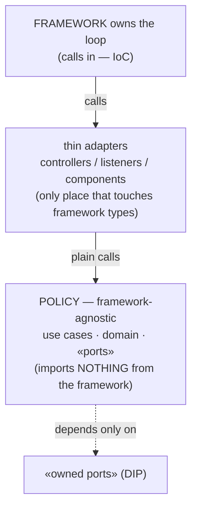
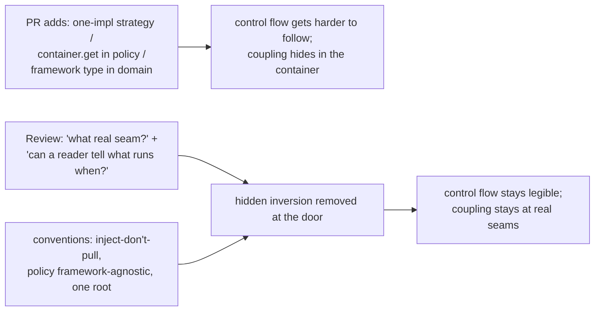

# Inversion of Control (IoC) — Professional

> **Category:** [Design Principles → Coupling & Cohesion](../../README.md) — the broad principle where the *flow of control* is inverted: a framework calls into your code instead of your code calling a library.

> **Prerequisites:** [Junior](junior.md) · [Middle](middle.md) · [Senior](senior.md)
> **Focus:** **Production** — reviews, framework adoption, team conventions, legacy systems

---

## Introduction

> Focus: **production** — sustaining sane control flow in a large, framework-heavy, multi-contributor codebase.

IoC is unavoidable in production software — every web service, every UI, every test suite is a framework calling your code. The professional question is not *whether* to use IoC but *how to keep it from metastasizing*: how to stop the codebase from drifting into a state where nobody can answer "what runs when?", where business logic is welded to a framework, where a DI container has quietly become a global service locator, and where every change requires understanding the framework's resolution magic.

At this level the skills are operational: reviewing PRs for inversions that *hide* more than they *decouple*; treating framework adoption as the consequential, hard-to-reverse IoC decision it is; keeping policy framework-agnostic so the inversion stays contained; governing the DI container so it doesn't rot into a service locator; and introducing IoC into legacy code safely, behind tests.

---

## Reviewing IoC: Where Inversion Helps and Where It Hides

Most harmful inversion enters one PR at a time — a strategy for a single implementation, a callback where a direct call would read better, a `container.get` deep in a service. The reviewer's job is to distinguish inversion that *decouples a real seam* from inversion that merely *hides control flow*.

### The two questions to ask of every new inversion

> **1. "What real seam does this inversion serve?"** A volatile boundary, a genuine second implementation, or a test seam — or none?
>
> **2. "After this change, can a reader still tell what runs when?"** If the inversion makes the flow harder to follow without buying decoupling, it's a net loss.

### Review by symptom

| Symptom in the PR | Likely problem | Reviewer response |
|---|---|---|
| New interface + Strategy + injection, **one** implementation, no test need | Inversion with no seam — hidden flow, no decoupling | "What's the second implementation? If none, call it directly." |
| `container.get(X)` / `Locator.get(X)` inside business logic | Container-as-service-locator — hidden global coupling | "Inject this in the constructor; don't pull from the container in policy code." |
| A callback where a direct sequential call would do | Inverted timing for no reason | "Is this genuinely event-driven? If it's just the next step, call it directly." |
| Policy class importing framework types (`@Entity`, `HttpServletRequest`) | IoC without DIP — logic welded to framework | "Keep policy framework-agnostic; move the framework touch into a thin adapter." |
| Deep template-method hierarchy for interior logic | Over-inversion via inheritance | "Prefer composition; and does this step actually vary?" |

### Review comment templates

> "This `PricingStrategy` has one implementation and one caller. Inversion here hides the flow and decouples nothing — let's call the concrete pricing directly and extract the interface when a second rule is real."

> "`container.get(Clock)` inside `ReportService` makes the dependency invisible and globally coupled. Inject `Clock` via the constructor so the dependency is explicit and the test can pass a fake."

> "`WelcomeFlow` imports `HttpServletRequest`. That welds our policy to the web framework. Pass in the two fields it needs; keep the controller as the only thing that touches the request."

> "Nice — the framework calls this handler and the handler depends only on `OrderPort`. That's IoC and DIP at the same seam; the policy compiles without the framework. Approved."

---

## Framework Adoption as an IoC Decision

Adopting a framework is **the** consequential IoC decision: you hand the framework your main loop, its lifecycle, its scopes, its idioms — and that is a **one-way door**. Migrating off a framework's IoC (its dispatch, DI container, lifecycle) is a multi-quarter rewrite, not a refactor. Treat the choice with the gravity of an irreversible architectural decision.

| Adopt the framework's IoC when… | Resist / minimize it when… |
|---|---|
| The framework's domain *is* your problem (HTTP serving, UI rendering, test running) | You'd adopt a heavyweight framework to solve a script-sized problem (*frameworkitis*) |
| The lifecycle/scopes it owns are real needs (per-request state, DI scopes) | You need none of its lifecycle machinery |
| The ecosystem (libraries, hiring, ops) outweighs the lock-in | The lock-in welds core business logic to a vendor you may leave |
| You can keep policy framework-agnostic behind the inversion | The framework's idioms would leak into every domain class |

> The professional reframe: a framework gives you enormous leverage by owning control flow — but it *takes the main loop* in exchange, and you don't get it back cheaply. Decide deliberately, isolate the blast radius (next section), and write down *why* in an architecture note, because this is a one-way door.

---

## Keeping Business Logic Out of the Framework's Reach

The single highest-value discipline for living with IoC at scale: **the framework calls your code, but your *business logic* must not depend on the framework.** This is IoC (the framework drives) combined with DIP (your policy depends only on owned abstractions) — and it's what keeps the inversion *contained* rather than *invasive*.

```text
   ┌─────────────────────────────────────────────────────────────┐
   │  FRAMEWORK (owns the loop; calls in)                          │
   │      controllers · listeners · components · test methods      │  ← thin adapters
   │             │ call (no framework types beyond here)            │     touch the framework
   ├─────────────▼───────────────────────────────────────────────┤
   │  POLICY (framework-agnostic; pure logic + owned ports)        │  ← imports NOTHING
   │      use cases · domain · «ports»                              │     from the framework
   └─────────────────────────────────────────────────────────────┘
```

The rules that enforce it:

1. **Keep handlers/controllers/listeners thin.** They translate framework types (`HttpRequest`, an event) into plain calls on policy objects and translate results back. No business rules live in framework-touched code.
2. **Policy depends only on owned abstractions** — never on `HttpServletRequest`, `@Entity`, the container, or framework annotations on domain types. This is DIP keeping the IoC contained.
3. **The framework's reach stops at the adapter layer.** If a domain class imports a framework package, the inversion has become invasive — flag it in review.

The payoff is concrete: business logic stays **portable** (survives a framework migration), **testable** (no framework needed to exercise it), and **readable** (its control flow is its own, not the framework's). The teams that suffer most from IoC are the ones that let framework concerns seep into every class; the inversion then can't be reasoned about or escaped.

---

## DI Container Governance

A DI container is an automated composition root (see [Senior](senior.md)). Left ungoverned, it rots into a global service locator and a source of startup-time mysteries. Govern it:

1. **Constructor injection only in policy code.** Ban `container.get`/`@Autowired` field-pulls inside business logic — that's the service-locator anti-pattern. Pull only at the composition root / framework integration points.
2. **Centralize bindings.** Keep wiring in a small number of explicit configuration modules, not scattered across the codebase as annotations on random classes. The graph should be readable in one place, container or not.
3. **Fail fast at startup, not first request.** Configure the container to validate the full graph on boot (eager singletons / startup validation) so a missing or ambiguous binding crashes the deploy, not a production request.
4. **Prefer explicit registration over deep convention.** Convention-over-configuration is convenient until "why did I get *this* implementation?" needs an archaeology dig through the container's resolution rules. Be explicit where it matters.
5. **Don't reach for a container for a small graph.** A hand-wired composition root is clearer, magic-free, and compile-time-safe. The container is an optimization for large graphs and framework integration — not a default.

> The recurring failure: the container exists, so people `container.get(X)` everywhere "for convenience." Now dependencies are hidden and global again — the exact coupling IoC removed, reintroduced through the tool meant to manage it. Governance is mostly *forbidding the pull*.

---

## Team Conventions for IoC

Codify these so the sane path is the default, not a per-PR argument:

1. **Invert at seams, stay concrete inside.** No Strategy/template-method/callback inversion for single-implementation interior logic. (Mirrors "no one-impl interface" from DIP conventions.)
2. **Constructor injection is the default; field/setter injection and `container.get` are exceptions** that require justification (true framework constraint).
3. **Policy code imports no framework types.** Framework annotations and request/response types live only in the adapter layer. Enforced in review (and, where possible, by architecture-test tooling like ArchUnit / import-linter).
4. **One composition root (or centralized binding modules).** Concrete construction lives there; nowhere else `new`s a volatile collaborator.
5. **Container failures are startup failures.** CI/boot validates the full object graph.
6. **Framework adoption is an ADR.** Any new framework that owns control flow gets an architecture decision record — it's a one-way door.
7. **Name the inversion in PR descriptions.** "Adds DI for the gateway port" / "template-method hook for the export step" — never bare "IoC."

---

## Introducing IoC into a Legacy System

Legacy code is typically the *opposite* of IoC: a class `new`s its own concrete collaborators, hard-codes its flow, and reaches out to globals — untestable because you can't substitute anything. Introducing IoC is how you create test seams and decouple — but it must be done behind tests, incrementally, never as a rewrite.

### The sequence

1. **Characterize first.** Before changing anything, pin current behavior with characterization tests. You can't safely invert control in code whose behavior isn't captured. (See *Working Effectively with Legacy Code* and [Refactoring as a Discipline](../../../craftsmanship-disciplines/03-refactoring-as-a-discipline/junior.md).)
2. **Find the seam.** Identify the painful coupling — usually a hard-`new`'d database/clock/HTTP client buried in business logic. That concrete construction is the thing to invert.
3. **Parameterize from above (the workhorse refactor).** Replace internal `new` with a constructor/method parameter — push construction *out* and up toward `main`. This is the smallest possible step toward DI and it immediately creates a test seam. (Michael Feathers' "Parameterize Constructor"/"Extract and Override.")
4. **Introduce the abstraction (DIP) at the seam.** Once the collaborator is injected, depend on an owned interface, not the concrete — now the legacy core is decoupled from the volatile detail and you can inject a fake.
5. **Hoist wiring into a composition root.** As more constructions are parameterized, collect the concrete choices into one wiring place near the entry point.
6. **Stay opportunistic (Boy Scout Rule).** Invert the seams you touch for feature work; don't launch a "add DI everywhere" mega-project.

```text
LEGACY                          STEP 3: parameterize             STEP 4: + DIP
class Billing {                 class Billing {                  class Billing {
  pay() {                         Gateway gw;                      Gateway gw;  // interface
    new StripeClient()...   →     Billing(Gateway gw){...}   →     Billing(Gateway gw){...}
  }                               pay(){ gw.charge()... }          // inject a fake in tests
}                               }                                }
(can't test — hard new)         (seam created — can inject)      (decoupled from Stripe)
```

### What *not* to do

- **Don't invert without characterization tests.** Pushing construction out can subtly change behavior (ordering, lazy init); without tests you won't notice.
- **Don't go straight to a container.** Hand-wire first. A container on top of a half-migrated legacy graph adds opacity to a system already hard to follow.
- **Don't over-invert the rescue.** Replacing hard-coded coupling with a Strategy-per-method and a container is trading one untestable mess for an over-engineered one. Invert the real seams; leave the rest.

---

## Real Incidents

### Incident 1: The container that became a global service locator

A service was "fully DI" — but over two years, `container.get(...)` calls had spread into hundreds of business methods because "it's easier than threading the dependency through constructors." Dependencies were invisible in signatures and globally coupled to the container. A change to one shared service silently affected unrelated features that *pulled* it. **Postmortem:** the container had become a service locator; DI's explicitness was gone. **Fix:** banned `container.get` outside the composition root (enforced by a lint rule), migrated to constructor injection module by module. **Lesson:** a container doesn't prevent hidden coupling — *pulling* from it reintroduces exactly the global coupling IoC removes. Inject; don't pull.

### Incident 2: Business logic welded to the web framework

Domain classes imported `HttpServletRequest` and framework annotations directly — convenient at first. When the team tried to reuse the billing logic in a batch job (no HTTP), it was impossible: the policy *needed* a request object that didn't exist in a batch context. **Fix:** extracted framework-agnostic use-case classes; controllers became thin adapters translating requests into plain calls. **Lesson:** IoC means the framework calls you — but if your *policy* depends on framework types, the inversion is invasive and your logic is trapped. Keep policy framework-agnostic (IoC + DIP), and the same logic runs under HTTP, a batch job, or a test.

### Incident 3: Frameworkitis on a script-sized problem

A team adopted a full DI-container-driven application framework to run a nightly data-sync that was, in essence, "read table A, transform, write table B." Startup took 40 seconds of container initialization; a missing binding once failed the job at *first record* rather than at compile time; new engineers spent days learning the framework to add a 10-line transform. **Fix:** replaced it with a plain `main` and a hand-wired composition root (~50 lines). Startup became instant; wiring was readable in one file. **Lesson:** IoC's price (lost explicit flow, startup-time failures, magic, lock-in) is only worth paying at the scale that justifies it. A small program with stable dependencies wants an explicit `main`, not a framework's inverted loop.

### Incident 4: Callback timing assumption caused a race

A handler registered with an event framework assumed it ran *before* another handler on the same event (because it was registered first). A framework upgrade changed callback ordering; the handler now ran *after* the state it depended on had been mutated, corrupting records intermittently. **Fix:** made the dependency explicit (an ordered pipeline step) instead of relying on registration order. **Lesson:** inverting flow hands the framework control over *timing* — including ordering and threading. Anything your callback assumes about *when* it runs is coupling to undocumented behavior. Treat callback timing as an explicit contract, not an accident of registration.

---

## Review Checklist

```text
IoC REVIEW CHECKLIST
[ ] SEAM         every new inversion (strategy/callback/template) serves a REAL
                 seam: volatile boundary, 2nd implementation, or test need
[ ] NO HIDDEN    no Strategy/interface/injection for single-impl interior logic
[ ] PUSH NOT PULL no container.get / Locator.get / @Autowired-field in policy code;
                 dependencies injected via constructor (explicit, testable)
[ ] AGNOSTIC     policy code imports NO framework types; framework touch is
                 confined to thin adapters (controllers/listeners/components)
[ ] ROOT         concrete construction lives in ONE composition root / binding module
[ ] FAIL FAST    container validates the full graph at startup, not first request
[ ] TIMING       callbacks don't assume framework-undefined ordering/threading
[ ] FLOW         after the change, a reader can still tell what runs when
[ ] ONE-WAY DOOR adopting a new control-flow-owning framework has an ADR
```

---

## Cheat Sheet

```text
REVIEW           two questions per inversion: "what real seam?" and
                 "can a reader still tell what runs when?"  No seam + hidden
                 flow = reject.

CONTAINMENT      framework calls your code (IoC), but POLICY imports no
                 framework types (DIP). Thin adapters touch the framework;
                 logic stays framework-agnostic → portable, testable, readable.

CONTAINER        push (constructor injection), never pull (container.get).
                 Centralize bindings; fail fast at startup. Hand-wire small graphs.

FRAMEWORK ADOPT  it's a ONE-WAY DOOR — you hand over the main loop and don't get
                 it back cheaply. ADR it. Avoid frameworkitis on small problems.

LEGACY           characterize → find the hard `new` → parameterize construction
                 up → introduce the abstraction (DIP) → hoist to a composition
                 root → opportunistic, test-guarded. Don't jump to a container.

PRICE OF IoC     lost explicit flow, framework-magic debugging, config opacity,
                 lock-in. Worth it at boundaries; pure cost in the interior.
```

---

## Diagrams

### Containment: the framework calls in, but policy stays agnostic



### Where harmful inversion enters, and where it's stopped



---

## Related Topics

- **Separate axis (dependency direction):** [Dependency Inversion (DIP) — Professional](../../04-solid/05-dip-dependency-inversion/professional.md).
- **Sibling principles:** [Minimise Coupling](../01-minimise-coupling/junior.md), [Open/Closed](../../04-solid/02-ocp-open-closed/junior.md).
- **Legacy technique:** [Refactoring as a Discipline](../../../craftsmanship-disciplines/03-refactoring-as-a-discipline/junior.md).
- **Tooling:** ArchUnit / import-linter (enforce "policy imports no framework"), DI containers (Spring, Guice, .NET DI, Dagger), lint rules banning `container.get` in policy code.

---


---

## Check your understanding

1. Explain Inversion of Control (IoC) — Professional Level in your own words and name the problem it solves.
2. How would you apply the ideas around Table of Contents, Introduction, Reviewing IoC: Where Inversion Helps and Where It Hides in a realistic engineering change?
3. What failure mode or misuse should you look for, and what evidence would reveal it?
4. How would you introduce and govern Inversion of Control (IoC) — Professional Level across teams through reversible, measurable increments?
5. What observable result would convince you that the approach improved the system?
