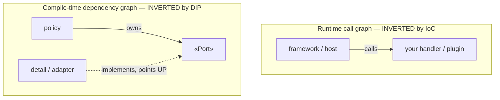

# Inversion of Control (IoC) — Senior

> **Category:** [Design Principles → Coupling & Cohesion](../../README.md) — the broad principle where the *flow of control* is inverted: a framework calls into your code instead of your code calling a library.

> **Prerequisites:** [Junior](junior.md) · [Middle](middle.md)
> **Focus:** **Design trade-offs** and **system-level reasoning**

---

## Introduction

> Focus: **design trade-offs** and **system-level reasoning**

At the senior level, IoC stops being "register a handler" and becomes a stance on **where control lives in a system, and what that costs.** A senior must be able to: state *precisely* what gets inverted (the runtime call graph, against the source-dependency graph) and how that differs from what DIP inverts; defend the IoC / DI / DIP / **service-locator** distinctions under interview-grade pushback; decide between a hand-wired composition root and a DI container at scale; recognize plugin architecture as IoC at module scale; and — the part juniors miss — know the *real price* of inversion (lost explicit control flow, framework-magic debugging, configuration opacity, lock-in) and when paying it is wrong.

This file answers four hard questions:

1. **What, exactly, is inverted by IoC — and how is that different from DIP's inversion?**
2. **How do IoC, DI, DIP, and the service locator relate without collapsing into one another?**
3. **At system scale, when do you reach for a DI container vs. hand-wiring — and what does a container *cost*?**
4. **What is the true price of inversion, and when does it make a design *worse*?**

---

## The Precise Theory: Inverting the Runtime Call Graph

IoC and DIP both contain the word "inversion," and both touch the same modules — but they invert **different graphs**. Getting this exactly right is the senior signal.

- **The runtime call graph (flow of control):** edge `A → B` means "A invokes B at runtime."
- **The compile-time dependency graph (source dependencies):** edge `A → B` means "A's source must know about B to compile."

> **IoC inverts the *runtime call graph* at a boundary.** **DIP inverts the *compile-time dependency graph* at a boundary.** They are inversions of two *different* graphs — which is exactly why they're distinct, and why they so powerfully reinforce each other.

In a procedural program both graphs point the same way: your `main` *calls* the helper (runtime) and *imports* the helper (compile-time). When you adopt a framework:

- **IoC flips the runtime arrow.** Now the framework calls *you*: `framework → yourHandler`. Control at runtime flows from framework into your code — the inversion this whole topic names.
- **DIP, applied at the same seam, flips the compile-time arrow.** Your policy owns an abstraction; the detail's *source* points up at the policy's abstraction.

```text
Procedural (both arrows parallel)      Framework + DIP (both arrows INVERTED, independently)

   main ──calls──► helper                 framework ──calls (IoC)──► yourHandler
   main ──imports► helper                 detail   ──implements (DIP)──► «Port» owned by policy
   (runtime & compile-time agree)         (runtime inverted by IoC; compile-time inverted by DIP)
```

The senior payoff: **IoC alone gives you the framework calling your code; DIP alone gives you the policy owning the abstraction; together they let the high-level policy be both the runtime-summoned *and* the compile-time-independent center** — the structural basis of Clean/Hexagonal architecture. A framework can invert *control* without inverting *dependencies* (a template-method base class your code still imports), and you can invert *dependencies* without a framework (a function taking an interface). The two inversions are orthogonal; great architecture applies both at the same seams.

---

## IoC vs DI vs DIP vs Service Locator — The Airtight Table

This is the four-way distinction a senior must hold without hesitation. It is consistent with — and extends — the three-way table in the [DIP topic — Senior](../../04-solid/05-dip-dependency-inversion/senior.md); that topic owns DIP's depth, this one owns IoC's.

| | **IoC** | **DI** | **DIP** | **Service Locator** |
|---|---|---|---|---|
| **Category** | Architectural *principle/pattern* | Construction *technique* | Design *principle* | Construction *pattern* |
| **The question it answers** | Does the framework call me, or I it? | Where do my collaborators come from? | Which way do source deps point? | How does code obtain a dependency? |
| **The inversion it names** | Flow of **control** | Control of **construction** | Direction of **source dependencies** | (none — it's a *pull*, not an inversion) |
| **How a dependency arrives** | n/a (it's about flow) | **Pushed in** (ctor/setter/param) | n/a (it's about direction) | **Pulled** from a registry by the consumer |
| **Relationship to IoC** | — | A **kind of** IoC | A separate axis; *cooperates* with IoC | Often *called* IoC, but it **does not invert** — see below |
| **Coupling cost** | Low (small contract) | Low (deps explicit at the seam) | Low (depend on abstraction) | **Hidden** — deps invisible in the signature |

Three precise statements:

1. **DI is a kind of IoC; DIP is a separate axis.** (Established at [Middle](middle.md): IoC ⊃ DI; DIP is dependency-direction, usually reached via DI.)

2. **Service locator is frequently *labeled* "IoC," but it does not invert control.** With a service locator the consumer *actively pulls* its dependency: `locator.get(Clock)`. Control of construction stays *inside* the consumer — it just delegated *where to look*. Compare DI, where the dependency is *pushed in* from outside and the consumer is passive. Fowler's *Inversion of Control Containers and the Dependency Injection pattern* draws exactly this line: both solve "how do I get my dependency," but **only DI actually inverts construction**; the locator is a pull, not an inversion. (Detailed next section.)

3. **The four are independent and can be mixed.** You can hold IoC+DI+DIP (Spring with interfaces, constructor injection); IoC without DI (template method); DI without DIP (inject a concretion); IoC with a service locator instead of DI (a framework that hands you a locator to pull from). Naming the exact combination is the senior skill.

> The one-sentence anchor: **IoC = direction of *control*; DI = construction *pushed in* (a kind of IoC); DIP = direction of *dependencies* (a separate axis); service locator = construction *pulled out* (a kind of IoC that hides its dependencies and is usually the worse choice).**

---

## Service Locator vs Dependency Injection

Both supply a collaborator without the consumer hard-constructing it; the difference is **push vs. pull**, and it has real coupling consequences.

```typescript
// SERVICE LOCATOR — the consumer PULLS. Dependencies are HIDDEN.
class ReportService {
  run() {
    const clock = Locator.get<Clock>("clock");   // hidden dependency
    const repo  = Locator.get<Repo>("repo");      // hidden dependency
    // ...nothing in the signature reveals that this needs a clock and a repo
  }
}

// DEPENDENCY INJECTION — the dependencies are PUSHED in. They are EXPLICIT.
class ReportService {
  constructor(private clock: Clock, private repo: Repo) {}  // visible contract
  run() { /* uses this.clock, this.repo */ }
}
```

Why DI is usually preferred:

- **Honest signatures.** The injected version *advertises* its dependencies in the constructor; the locator version hides them inside method bodies. Hidden dependencies are connascence you can't see — a coupling trap. (See [Connascence](../03-connascence/junior.md).)
- **Compile-time safety.** Forget a constructor arg and it won't compile; forget a `Locator.get` registration and it fails *at runtime*, often deep in production.
- **Testability without globals.** DI takes a fake in the constructor. A locator forces tests to mutate a *global* registry — order-dependent, leaky, and a frequent source of flaky tests.
- **No global coupling.** The locator *is* a global. Every consumer that pulls from it is coupled to that global, reintroducing exactly the hidden, system-wide coupling IoC was supposed to remove.

The senior position (and Fowler's): **the service locator is a legitimate pattern, but DI is the default; reach for a locator only when you genuinely cannot inject** (e.g., framework extension points that hand you nothing, or plugin code constructed reflectively). Pulling a dependency from a *DI container* inside business code — `container.get(X)` — is the **container-as-service-locator anti-pattern**: it wears a container's clothes but reintroduces hidden, global coupling. Inject; don't pull. (This matches Liability 4 in the [DIP topic — Senior](../../04-solid/05-dip-dependency-inversion/senior.md).)

---

## DI Containers and the Composition Root at Scale

A **DI container** (Spring, Guice, .NET's built-in DI, Dagger) is an *automated composition root*: you register types and their abstractions; the container builds the object graph by resolving constructor dependencies transitively.

```text
hand-wired root                          container-driven root
  repo  = PostgresRepo(pool)              register(Repo,    PostgresRepo)
  gw    = StripeGateway(key)              register(Gateway, StripeGateway)
  uc    = PlaceOrder(repo, gw)            container.resolve(PlaceOrder)  // graph built for you
  app.run(uc)                             // ctor deps resolved transitively
```

### When a container earns its place

| Use a DI container when… | Hand-wire when… |
|---|---|
| The object graph is **large** (hundreds of types, deep transitive graphs) | The graph is **small** — a hand-written root is clearer and has zero magic |
| You need **lifecycle/scope management** (singleton, per-request, per-session) | All objects are singletons or trivially scoped |
| The framework **expects** it (Spring, ASP.NET Core, Angular) | You're not on such a framework |
| You want **cross-cutting concerns** woven in (interceptors, AOP, proxies) | You don't need AOP-style weaving |

### What a container *costs* (the senior caveats)

- **Configuration-over-code opacity.** Wiring moves from readable constructor calls into annotations, XML, or convention. "Why did I get *this* implementation?" can require understanding the container's resolution rules, not reading code. The graph is no longer visible in one file.
- **Runtime failure modes.** Misconfiguration (missing binding, ambiguous binding, circular dependency) surfaces at *startup* or *first request*, not at compile time. Hand-wiring fails to compile.
- **Magic and lock-in.** Proxying, lazy init, and scope handling are container behavior your code now depends on. Migrating off a container is a real cost.
- **Invites the locator anti-pattern.** Once a container exists, the temptation to `container.get(X)` deep in code is strong — and it reintroduces the global coupling DI removed.

> Senior rule: **a container is an optimization for a *large* graph, not a default.** The *principle* is the composition root — one place that wires the graph. A container automates that wiring; it does not improve on a small hand-wired root, and it adds opacity, runtime failure modes, and lock-in. Use it where the graph's size or the framework demands it; hand-wire otherwise.

---

## Plugin Architecture: IoC at Module Scale

The largest expression of IoC is **plugin architecture**: the host application owns the control flow and *calls into* plugins it discovers at runtime, while the plugins' *source* depends *up* on a host-defined contract. This is IoC and DIP at module scale, simultaneously.

```text
   host application  ──owns control loop──►  calls plugin.execute()   (IoC: host calls plugin)
   plugin  ──implements──►  «Plugin» interface owned by the host       (DIP: source points UP)

   The host depends on NO plugin. Plugins depend on the host's contract.
   Drop in a new plugin jar/package → the host calls it, unchanged. (Open/Closed)
```

This is why plugin systems are the canonical demonstration that IoC + DIP underpin extensibility: editors (VS Code extensions), browsers, build tools (webpack loaders), and CI systems are all hosts that *call you*. The host's main loop is the inverted control; the host-owned plugin interface is the inverted dependency; together they make the host **closed for modification, open for extension**. (Full architecture-scale treatment: Plugin Architecture and the DIP, referenced from the [DIP topic](../../04-solid/05-dip-dependency-inversion/senior.md).)

---

## The Cost of Inversion: Where Does Execution Actually Start?

The honest senior treatment of IoC names its price. Inversion is not free; it trades *explicit control flow* — the single most valuable property for understanding and debugging code — for decoupling.

1. **Lost explicit control flow.** In a procedural program you read `main` top to bottom and you know what runs. Under heavy IoC, *"where does execution actually start?"* has no simple answer: the framework's loop calls your handler, which a container constructed, whose dependencies an annotation chose, whose lifecycle a scope rule governs. The flow is real but **distributed across framework code you didn't write and can't see in your file.**

2. **Debugging through framework magic.** A stack trace under a framework is mostly *framework frames*; your code is a thin slice summoned from deep inside. Breakpoints in your handler tell you *what* ran but not *why now* or *why this implementation*. Reflective construction, proxies, and AOP interception make the call path non-obvious.

3. **Configuration-over-code opacity.** When wiring lives in annotations/XML/convention, the answer to "which class did I actually get?" is in the container's resolution rules, not in any call you can grep for. Convention-over-configuration is convenient until it's wrong, and then it's opaque.

4. **Framework lock-in.** Adopting a framework's IoC means adopting its lifecycle, its scopes, its extension points, its idioms. Your business logic stays portable only if you keep it *out* of the framework's reach — handlers thin, policy in framework-agnostic classes. Otherwise the inversion welds you to the framework.

> The senior framing: IoC **moves complexity from your code into the framework and the configuration.** That's a *good trade at a real seam* — you delete loop/wiring/dispatch code and gain pluggability and testability. It's a *bad trade in straight-line interior logic*, where you've surrendered readable control flow for decoupling you never needed. The discipline is the same as DIP's: **invert at boundaries; keep the interior explicit.**

---

## When IoC Is the Wrong Move

- **Interior logic with no seam.** Wrapping a single-implementation step in a Strategy + injection, or pushing straight-line code behind a template-method hook, buys no decoupling and hides the flow. Stay direct.
- **A container for a tiny graph.** Pulling in Spring/Guice to wire five objects adds opacity, startup-time failure modes, and lock-in for nothing a three-line composition root wouldn't do more clearly.
- **Service-locator-by-reflex.** Reaching for a global registry (or `container.get`) because "it's flexible" reintroduces the hidden global coupling IoC exists to remove. Inject explicitly.
- **Frameworkitis.** Adopting a heavyweight framework's full lifecycle for a problem a script solves — the IoC tax (lost control flow, magic, lock-in) with none of the scale that justifies it.
- **Callback-timing assumptions.** Inverting flow to a framework whose callback ordering, threading, and error timing you don't fully understand — you've coupled to undocumented behavior, the worst kind.

The unifying judgement, identical across this curriculum: **the inversion is justified by a real boundary (a volatile mechanism behind a stable policy, a genuine second implementation, a test seam, or a framework you're building on) — never by a desire to "be decoupled" in the abstract.**

---

## Code Examples — Advanced

### IoC + DIP at a seam: framework calls you, your source stays independent (Java)

```java
// ── policy package (high-level; imports NOTHING from the framework or infra) ──
public interface NotificationPort { void send(UserId to, String body); }   // policy owns it

public final class WelcomeFlow {                 // pure policy
    private final NotificationPort notifier;     // DIP: depends on the abstraction
    public WelcomeFlow(NotificationPort n) { this.notifier = n; }   // DI: pushed in
    public void onUserRegistered(UserId id) {    // called BY the framework (IoC)
        notifier.send(id, "Welcome!");
    }
}

// ── framework/infra package (low-level; DEPENDS ON the policy package) ──
@EventListener                                   // framework will CALL this (IoC)
public final class RegistrationListener {
    private final WelcomeFlow flow;
    RegistrationListener(WelcomeFlow flow) { this.flow = flow; }  // container injects (DI)
    public void handle(UserRegistered e) { flow.onUserRegistered(e.userId()); }
}

final class EmailNotifier implements NotificationPort {   // adapter: source points UP at policy
    public void send(UserId to, String body) { /* SMTP */ }
}
// IoC: the event framework calls RegistrationListener -> WelcomeFlow (runtime arrow inverted).
// DIP: EmailNotifier's source depends on the policy's NotificationPort (compile-time arrow inverted).
// Two DIFFERENT graphs inverted at the SAME seam.
```

### Service locator vs. DI, side by side (Python)

```python
# Service locator — hidden deps, global coupling, runtime failure:
class Reports:
    def monthly(self):
        clock = Locator.get("clock")   # not in the signature; fails at runtime if unregistered
        repo  = Locator.get("repo")
        ...

# DI — explicit deps, compile/construct-time safety, trivially testable:
class Reports:
    def __init__(self, clock: Clock, repo: Repo):   # the contract is visible
        self._clock, self._repo = clock, repo
    def monthly(self): ...

# test: just push fakes in — no global registry to mutate
r = Reports(clock=FrozenClock("2026-06-11"), repo=InMemoryRepo())
```

### Hand-wired composition root vs. container (TypeScript)

```typescript
// Hand-wired root — zero magic, graph visible in one place (best for small graphs):
function buildApp(): App {
  const clock   = new SystemClock();
  const repo    = new PgOrderRepo(pool());          // concrete chosen HERE only
  const gateway = new StripeGateway(env.STRIPE_KEY);
  return new App(new PlaceOrder(repo, gateway, clock));
}

// Container — automated root (justified only when the graph is large/needs scopes):
container.register(Clock,   SystemClock);
container.register(Repo,    PgOrderRepo);
container.register(Gateway, StripeGateway);
const app = container.resolve(App);                 // transitive graph built for you
// cost: wiring is now in registrations + resolution rules, not in readable calls;
// a missing binding fails at startup, not at compile time.
```

---

## Liabilities

### Liability 1: "Where does it start?" — lost control flow

Heavy IoC scatters the flow across framework code; nobody can read one file and know the execution order. **Cure:** keep handlers thin and policy framework-agnostic; document the lifecycle; don't invert interior logic that has no seam.

### Liability 2: Container-as-service-locator

`container.get(X)` inside business code reintroduces hidden, global coupling — DI in name, service-locator in fact. **Cure:** inject via constructor; never pull from the container in policy code.

### Liability 3: Configuration opacity

Wiring in annotations/XML/convention makes "which implementation did I get?" un-greppable. **Cure:** prefer explicit constructor wiring; if using a container, keep bindings centralized and conventions documented.

### Liability 4: IoC without DIP (framework lock-in)

Inverting *control* to a framework while your policy still *imports* framework types welds business logic to the framework. **Cure:** also invert *dependencies* — keep policy depending only on owned abstractions; let thin adapters touch the framework.

### Liability 5: Over-inversion of the interior

Strategy/template-method/callbacks applied to single-implementation interior logic — indirection that hides flow and decouples nothing. **Cure:** the seam/volatility test; stay concrete where there's no boundary.

### Liability 6: Callback timing/threading coupling

A handler that assumes ordering, thread, or error-timing the framework never guaranteed. **Cure:** treat "when, on what thread, with what error semantics will I be called?" as part of the contract.

---

## Pros & Cons at the System Level

| Dimension | IoC at real boundaries | No inversion (procedural) | IoC over-applied (interior + heavy container) |
|---|---|---|---|
| Coupling | Low — policy depends on small contract | High — policy braided with mechanism | Low in theory, but hidden via container/locator |
| Pluggability / Open-Closed | High — add a plug-in | Low — edit the loop | High, mostly unused |
| Testability | High — inject fakes, call handlers directly | Low — needs whole program | High but via false seams |
| Readability of control flow | Slight cost at boundaries | **Highest** — read top to bottom | **Poor** — flow lost in framework magic |
| "Where does execution start?" | Mostly clear (boundaries only) | Obvious (`main`) | Opaque |
| Debuggability | Reasonable | Best | Worst — framework frames, reflection, proxies |
| Lock-in | Contained (thin adapters) | None | High — welded to framework/container |
| Best when | Volatile mechanism / 2nd impl / test seam / on a framework | Small program, stable single deps | **Never** |

The senior stance, crisp: **IoC wins decisively at boundaries where a stable policy meets a volatile mechanism, where a second implementation or a test seam is real, or where you're building on a framework.** Its price — lost explicit control flow, framework-magic debugging, configuration opacity, lock-in — is worth paying *only* there. Applied to interior logic, or via a container for a tiny graph, the price stays and the benefit vanishes. **Invert at boundaries; keep the interior explicit.**

---

## Diagrams

### Two graphs, two inversions (IoC vs DIP)



### Where a dependency comes from: DI (push) vs Service Locator (pull)

```mermaid
flowchart LR
    subgraph DI["Dependency Injection — PUSH (inverts construction)"]
      Root["composition root"] -->|injects| Svc1["consumer (passive, explicit deps)"]
    end
    subgraph SL["Service Locator — PULL (does NOT invert; hides deps)"]
      Svc2["consumer (active)"] -->|get(Dep)| Reg["global registry"]
    end
```

---

## Related Topics

- **Separate axis (dependency direction) — owns the deep DIP/DI distinction:** [Dependency Inversion (DIP) — Senior](../../04-solid/05-dip-dependency-inversion/senior.md).
- **Sibling principles:** [Minimise Coupling](../01-minimise-coupling/junior.md), [Connascence](../03-connascence/junior.md), [Composition Over Inheritance](../05-composition-over-inheritance/junior.md), [Open/Closed](../../04-solid/02-ocp-open-closed/junior.md).
- **Patterns that implement IoC:** Design Patterns (Template Method, Observer, Strategy).
- **Architecture scale:** Plugin Architecture and the DIP, The Dependency Rule.

---


---

## Check your understanding

1. Explain Inversion of Control (IoC) — Senior Level in your own words and name the problem it solves.
2. How would you apply the ideas around Table of Contents, Introduction, The Precise Theory: Inverting the Runtime Call Graph in a realistic engineering change?
3. What failure mode or misuse should you look for, and what evidence would reveal it?
4. How would you validate a system-level decision about Inversion of Control (IoC) — Senior Level under uncertainty?
5. What observable result would convince you that the approach improved the system?
