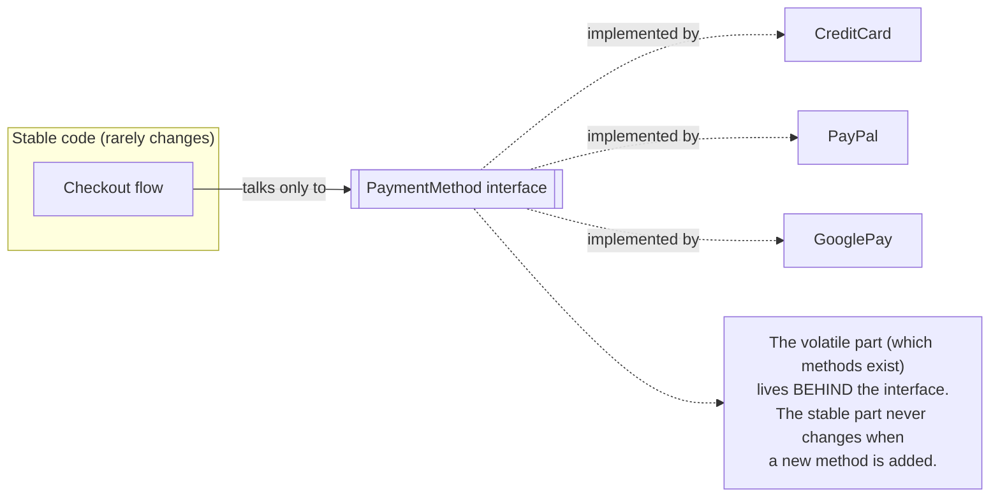
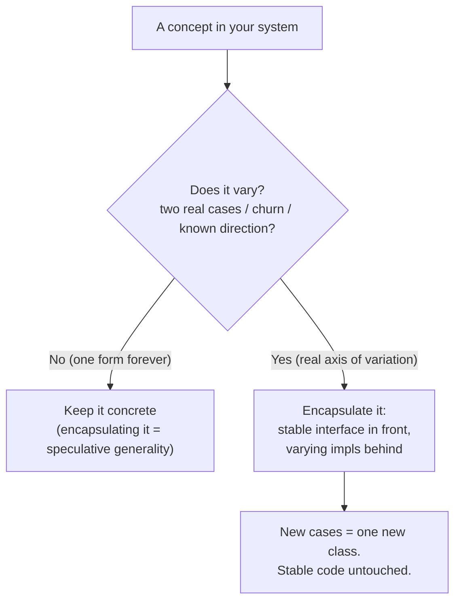

# Encapsulate What Changes — Junior

> **Category:** [Design Principles](../../README.md) — find the part of a system most likely to change and hide it behind a stable interface, so change stays contained.

---

## Introduction

> Focus: **What is it?** and **How to use it?**

**Encapsulate What Changes** is the first design principle in the *Design Patterns* book by the Gang of Four, and it reads like this:

> **Identify the aspects of your application that vary and separate them from what stays the same.**

That single sentence is one of the most useful ideas in software design. Every program has parts that are stable — they were written once and rarely touched — and parts that *churn*: they change every time a requirement shifts, a new option appears, a regulation updates. The principle says: **find the churning part, wall it off behind a clean boundary, and shield the rest of the system from it.**

When you do this well, a change to the volatile part — adding a new payment method, a new export format, a new notification channel — touches **one small, isolated place** instead of rippling through twenty files. The stable code never even notices.

### Why this matters

Imagine a checkout system where the words `"credit_card"` and the credit-card processing logic are scattered across fifteen files: the order page, the receipt builder, the refund job, the reporting query. The day the business adds PayPal, you must hunt down and edit all fifteen. Miss one, and you have a bug. This is the disease the principle cures. By **encapsulating** the "how do we take payment" concept behind one interface, adding PayPal becomes: write one new class, register it, done. Nothing else changes.

The hard part isn't the technique — hiding things behind an interface is mechanical. The hard part is *prediction*: correctly guessing **which** part will change. Get that right and the design ages gracefully. Guess wrong and you've wrapped something stable in needless machinery (we'll cover that trap, and it's a real one).

---

## Prerequisites

- **Required:** Comfort with classes, methods, and interfaces (or abstract types) in at least one language.
- **Required:** A basic feel for **encapsulation** — hiding a class's internals behind a public surface.
- **Helpful:** The idea of **[YAGNI](../../01-generic/02-yagni/junior.md)** — "You Aren't Gonna Need It" — because this principle has a sharp tension with it.
- **Helpful:** Exposure to the **Strategy** pattern, which is the most common way to encapsulate a varying behavior.

---

## Glossary

| Term | Definition |
|------|-----------|
| **Encapsulate What Changes** | Find the part of the system most likely to vary and hide it behind a stable interface. |
| **Encapsulation** | Hiding the internal representation and decisions of a module behind a public interface. |
| **Information hiding** | Decomposing a system so each module hides a *design decision* likely to change (Parnas, 1972). |
| **Axis of variation** | The dimension along which a concept changes — e.g., *which payment method*, *which currency*, *which format*. |
| **Volatile / volatility** | How likely a piece of code is to change. The volatile parts are what you encapsulate. |
| **Stable interface** | A boundary (interface, abstract type, port) whose shape stays put while implementations behind it change. |
| **Strategy** | An interchangeable object that encapsulates one varying behavior behind a common interface. |
| **Speculative generality** | Flexibility added for a future that never arrives — the cost of encapsulating a *non*-varying axis. |

---

## The Principle

Break the sentence into its two halves and you have the whole method:

1. **Identify what varies.** Look at the system and ask: *which concept here is going to change?* New cases will be added, rules will be tweaked, options will multiply. That concept is your **axis of variation**.
2. **Separate it from what stays the same.** Pull the varying concept out into its own place — a class, an interface, a function you pass in — so the stable code depends only on a **fixed boundary**, never on the volatile details.



The checkout flow knows it needs to *take a payment*. It does **not** know, or care, whether that's a credit card or PayPal. New payment methods slot in behind the interface without the checkout flow changing a single line. The volatile concept — *the set of payment methods* — has been **encapsulated**.

---

## A Quick Encapsulation Refresher

You already know encapsulation as "make fields private, expose methods." This principle uses a slightly bigger version of the same idea.

> **Encapsulation** = hiding a *decision* behind an interface, so the rest of the system depends on the interface, not the decision.

For full coverage of information hiding and abstraction, see Clean Code → Abstraction & Information Hiding. Here, the key point is *what* you choose to hide:

- **Ordinary encapsulation** hides *how a thing is stored* (a private field, a backing list).
- **Encapsulate What Changes** hides *a decision that is likely to change* (which payment methods exist, how prices are computed, where data is stored).

The intellectual foundation is a famous 1972 paper by **David Parnas**, *On the Criteria To Be Used in Decomposing Systems into Modules*. Parnas's radical claim: don't split your system around the **steps of the flowchart** (read input → process → write output). Instead, split it around the **design decisions most likely to change**, and give each module the job of *hiding* one such decision. That is **information hiding**, and "Encapsulate What Changes" is its practical, everyday form. We'll keep returning to Parnas — he's the source.

---

## How to Find What Changes

The technique is easy; finding the right axis is the skill. A few reliable signals:

- **Domain knowledge.** Some things are *known* to vary: payment methods, tax rules, currencies, notification channels, file formats, third-party vendors. If the business has more than one of something today, it will have more tomorrow.
- **Git history.** Look at which files change most often. A file that's been edited in 40 of the last 100 commits is *telling you* where the volatility is. (More on this at [Middle](middle.md).)
- **Known requirement direction.** If the product owner says "we'll launch in the US first, then Europe," currency and tax are about to become axes of variation.
- **The "list of things" smell.** Whenever you see a `switch`/`if-else` ladder over a *type* — `if method == "card" … elif method == "paypal" …` — that ladder *is* an axis of variation, scattered in the open. It wants to be encapsulated.

> Rule of thumb for a junior: **if you can already name two real cases of something (two payment methods, two formats, two channels), that concept is a candidate to encapsulate.** One case is not enough — see the YAGNI warning below.

---

## Real-World Analogies

| Concept | Analogy |
|---|---|
| **Encapsulate what changes** | A wall socket. Your toaster, lamp, and laptop charger all plug into the *same* socket. The socket (stable interface) hides the wildly varying devices behind it. Add a new device — no rewiring the house. |
| **Stable interface** | A power adapter for travel. The wall changes country to country; the adapter gives your laptop one unchanging plug to depend on. |
| **The volatile part** | The interchangeable lens on a camera. The camera body (stable) stays; you swap lenses (volatile) for the shot you need. |
| **Guessing the wrong axis** | Building a universal remote with 200 buttons for devices you'll never own. You paid for flexibility that never gets used. |

---

## Mental Models

**The intuition:** *"What is going to change here? Put a wall around it."*

```
        ┌──────────────────────────────────────┐
        │   STABLE CODE (the part that stays)   │
        │   depends only on ↓                   │
        ├──────────────────────────────────────┤
        │        STABLE INTERFACE (the wall)    │  ← never changes
        ├──────────────────────────────────────┤
        │   VOLATILE PART (the part that varies)│  ← swap / add freely
        │   CreditCard | PayPal | GooglePay ... │
        └──────────────────────────────────────┘
   Change happens BELOW the wall. The code ABOVE never notices.
```

A second model: think of the interface as a **shock absorber**. Requirements push and shake the volatile part below; the absorber soaks up the motion so the stable part above rides smoothly. Without it, every jolt travels straight through the whole system.

---

## A Worked Example: Payment Methods

Watch a volatile concept go from *scattered and hard-coded* to *encapsulated*.

### Start: the volatile concept is hard-coded and scattered

```python
def checkout(order):
    if order.payment_type == "credit_card":
        # 15 lines of Stripe API calls
        ...
    elif order.payment_type == "paypal":
        # 15 lines of PayPal API calls
        ...
    # and the SAME if-ladder appears again in refund(), in receipt(), in report()...
```

The concept "*which payment method*" is smeared across the codebase as a repeated `if`-ladder. Adding **Apple Pay** means finding *every* ladder and adding a branch to each. This is exactly the disease the principle treats — the varying part is exposed, not encapsulated.

### Step 1: name the stable interface

What stays the same across all payment methods? *Every* method can **charge** an amount and **refund** it. That's the stable boundary:

```python
from abc import ABC, abstractmethod

class PaymentMethod(ABC):
    @abstractmethod
    def charge(self, amount): ...
    @abstractmethod
    def refund(self, amount): ...
```

### Step 2: move each volatile case behind the interface

```python
class CreditCardPayment(PaymentMethod):
    def charge(self, amount): ...   # Stripe calls live here, ONLY here
    def refund(self, amount): ...

class PayPalPayment(PaymentMethod):
    def charge(self, amount): ...   # PayPal calls live here, ONLY here
    def refund(self, amount): ...
```

### Step 3: the stable code depends only on the interface

```python
def checkout(order, payment: PaymentMethod):
    payment.charge(order.total)     # no if-ladder, no knowledge of WHICH method
```

Now `checkout`, `refund`, `receipt`, and `report` all just call `payment.charge(...)` / `payment.refund(...)`. **Adding Apple Pay is one new class.** Nothing above the wall changes. The volatile concept has been **encapsulated behind a stable interface** — which is the whole principle.

---

## Code Examples

### TypeScript — encapsulating a varying notification channel

```typescript
// BEFORE: the varying concept ("which channel") is hard-coded and scattered
function notify(user: User, message: string) {
  if (user.pref === "email")      sendEmail(user.address, message);
  else if (user.pref === "sms")   sendSms(user.phone, message);
  // adding "push" means editing this AND every other place that notifies
}

// AFTER: the channel is encapsulated behind a stable interface
interface Notifier {
  send(user: User, message: string): void;
}

class EmailNotifier implements Notifier { send(u, m) { /* ... */ } }
class SmsNotifier   implements Notifier { send(u, m) { /* ... */ } }
// Adding PushNotifier = one new class. The caller below never changes:

function notify(notifier: Notifier, user: User, message: string) {
  notifier.send(user, message);
}
```

### Java — encapsulating a varying pricing rule

```java
// The "how do we price this" decision is volatile (promos, regions, tiers).
// Hide it behind a stable interface so new rules don't touch the cart.
interface PricingRule {
    Money priceFor(Cart cart);
}

class StandardPricing implements PricingRule { /* ... */ }
class BlackFridayPricing implements PricingRule { /* ... */ }

class Checkout {
    private final PricingRule pricing;   // depends on the STABLE boundary
    Checkout(PricingRule pricing) { this.pricing = pricing; }

    Money total(Cart cart) {
        return pricing.priceFor(cart);   // never knows WHICH rule
    }
}
```

### Python — encapsulating a varying storage backend

```python
class Storage(ABC):                     # the stable port
    @abstractmethod
    def save(self, key, data): ...
    @abstractmethod
    def load(self, key): ...

class S3Storage(Storage): ...           # volatile detail #1
class LocalDiskStorage(Storage): ...    # volatile detail #2

# The application depends on Storage, not on S3 or disk.
# Swapping backends = swap the object passed in; app code is untouched.
```

In every case the pattern is identical: **a stable interface in front, the volatile implementations behind it.** That's the principle in one shape.

---

## The YAGNI Warning

This principle has a dangerous evil twin. If "encapsulate what changes" is good, a beginner concludes "encapsulate *everything*, just in case." **That is wrong, and it's expensive.**

Encapsulating an axis that **never actually varies** gives you all the cost of the abstraction (an extra interface, indirection, more files to read) and **none** of the benefit (no change is ever contained, because no change ever comes). This is **speculative generality**, and it directly violates **[YAGNI](../../01-generic/02-yagni/junior.md)**.

```python
# DON'T: encapsulate something that has exactly one form, forever.
class GreetingStrategy(ABC):
    @abstractmethod
    def greet(self, name): ...

class EnglishGreeting(GreetingStrategy):
    def greet(self, name): return f"Hello, {name}"

# There is ONE greeting. There will only ever be one. This interface,
# this class, this indirection — all pure cost, zero benefit.

# DO: just write the function. Add the seam IF a second greeting is ever real.
def greet(name): return f"Hello, {name}"
```

> The skill is **prediction**. Encapsulate what **demonstrably** changes — what the domain or git history *shows* you varies — not what you *imagine* might. When in doubt, wait. A good guide: the **Rule of Three** — don't extract the abstraction until you've seen the variation about three times. By then you *know* the axis is real, and you know its shape.

The deeper treatment of this tension is at [Middle](middle.md) and [Senior](senior.md). For now, hold both ideas at once: **encapsulate what changes — but only what *actually* changes.**

---

## Best Practices

1. **Name the axis of variation explicitly.** Say out loud "the thing that varies here is *which payment method*." If you can't name it, you may not have found it.
2. **Require evidence of variation.** Two real cases (or clear domain knowledge / git churn) before you build the abstraction — not a hunch.
3. **Keep the interface small and stable.** Put on it only what *all* implementations share. A bloated interface is a leaky wall.
4. **Hide the decision, not just the data.** Encapsulate the *choice* (which method, which rule), not merely a private field.
5. **Replace `if`-ladders over a type with polymorphism** once the type list is a real axis of variation.
6. **When unsure, don't.** Per YAGNI, leave it concrete; add the seam when the second case is real.

---

## Common Mistakes

1. **Encapsulating a non-varying axis.** Wrapping something with one form forever in an interface — speculative generality, the exact opposite of the goal.
2. **Encapsulating everything "to be safe."** Every concept behind its own interface drowns the codebase in indirection. Encapsulate the *volatile* parts, not all parts.
3. **Splitting around flowchart steps, not decisions.** Parnas's warning: modules built around "step 1, step 2, step 3" don't hide change. Build them around *decisions likely to change*.
4. **A leaky interface.** Putting method-specific details (`getStripeToken()`) on the shared interface forces every implementation and caller to know about one case — the wall has a hole in it.
5. **Guessing the wrong axis.** Encapsulating *currency* when what actually changes is *tax rule*. Wrong axis = the abstraction doesn't contain the real change.
6. **Doing it once, then never adding the next case behind the wall.** New payment method bolted on with another `if` instead of a new class — the encapsulation rots.

---

## Tricky Points

- **Encapsulation here means hiding a *decision*, not just hiding *data*.** The thing you wall off is "which X do we use / how do we do Y," a choice that will change — not merely a private field.
- **Parnas vs. the flowchart.** The single biggest insight: decompose around *what changes*, not around the *order of processing steps*. A module's job is to **hide a decision**, so the decision can change without anyone else noticing.
- **The principle and YAGNI pull in opposite directions, and both are right.** Encapsulate what changes; don't encapsulate what doesn't. The whole art is telling the two apart — covered in depth at [Middle](middle.md).
- **One interface, many implementations is the *goal* — one interface, one implementation is a *smell*.** If your encapsulation has exactly one thing behind it and always will, you've probably encapsulated a non-axis.

---

## Test Yourself

1. State the Gang of Four's first design principle in one sentence.
2. What did David Parnas say a module's job is, and what did he say *not* to decompose around?
3. What is an "axis of variation"? Give two examples.
4. You see `if type == "a" … elif type == "b" …` repeated in five files. What does that tell you, and what's the fix?
5. Why is encapsulating an axis that never varies a *mistake*, not just harmless extra work?
6. What's a quick rule of thumb for *when* you have enough evidence to encapsulate a varying concept?

---

## Cheat Sheet

```text
THE PRINCIPLE (Gang of Four, #1)
  "Identify the aspects that vary and separate them from what stays the same."
  → find the volatile part, hide it behind a STABLE interface.

THE METHOD
  1. Identify the axis of variation (the concept that will change)
  2. Define a stable interface = what ALL cases share
  3. Put each varying case behind it (one impl per case)
  4. Stable code depends on the interface, never the cases

FOUNDATION
  Parnas (1972): decompose around DECISIONS LIKELY TO CHANGE,
  not around flowchart steps. A module HIDES a decision.

THE TENSION (do not skip)
  Encapsulate what DEMONSTRABLY changes — not what you IMAGINE might.
  Wrong axis / no axis = speculative generality = YAGNI violation.
  Evidence first: two real cases, domain knowledge, or git churn.
```

---

## Summary

- **Encapsulate What Changes** is the Gang of Four's first principle: *identify the aspects that vary and separate them from what stays the same.*
- You **find the volatile part** (domain knowledge, git churn, known requirement direction, scattered `if`-ladders), then **hide it behind a stable interface** so change is contained.
- The intellectual foundation is **Parnas (1972)**: decompose a system around the **design decisions most likely to change**, not around flowchart steps — each module's job is to **hide** one such decision.
- The payoff: adding a new case (payment method, channel, format, backend) touches **one place**; the stable code never changes.
- The danger is the **YAGNI tension**: encapsulating a non-varying axis is **speculative generality** — full cost, zero benefit. Encapsulate what **demonstrably** changes, not what you imagine might.

---

## Further Reading

- Gamma, Helm, Johnson, Vlissides (Gang of Four), *Design Patterns* — the "encapsulate what varies" principle in the introduction.
- David Parnas, *On the Criteria To Be Used in Decomposing Systems into Modules* (1972) — the information-hiding foundation; required reading.
- The [YAGNI principle](../../01-generic/02-yagni/junior.md) — the counterweight to over-encapsulation.
- Clean Code → Abstraction & Information Hiding — encapsulation and hiding details in full.

---

## Related Topics

- **Sibling:** [Command Query Separation](../02-command-query-separation/junior.md)
- **The engine behind:** [Open/Closed Principle](../../04-solid/02-ocp-open-closed/junior.md), [Dependency Inversion](../../04-solid/05-dip-dependency-inversion/junior.md)
- **Counterweight:** [YAGNI](../../01-generic/02-yagni/junior.md)

---

## Diagrams




---

## Check your understanding

1. Explain Encapsulate What Changes — Junior Level in your own words and name the problem it solves.
2. How would you apply the ideas around Table of Contents, Introduction, Prerequisites in a realistic engineering change?
3. What failure mode or misuse should you look for, and what evidence would reveal it?
4. What small example would prove that you can apply Encapsulate What Changes — Junior Level correctly?
5. What observable result would convince you that the approach improved the system?
