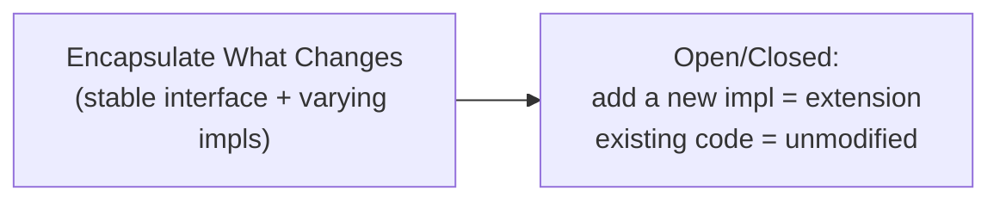
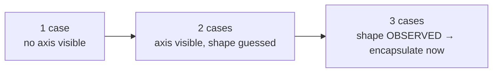
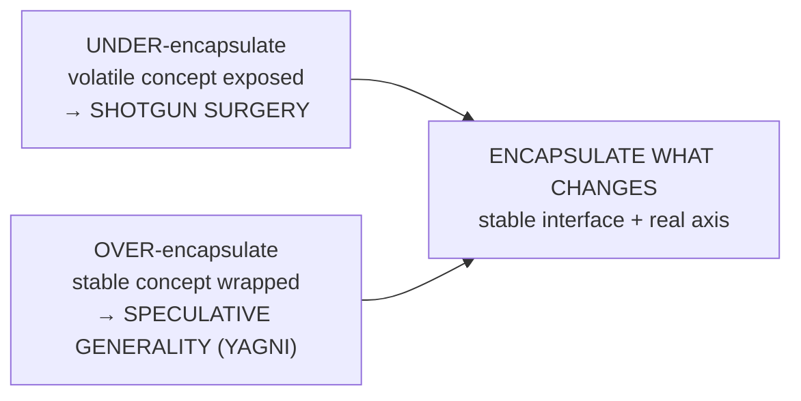
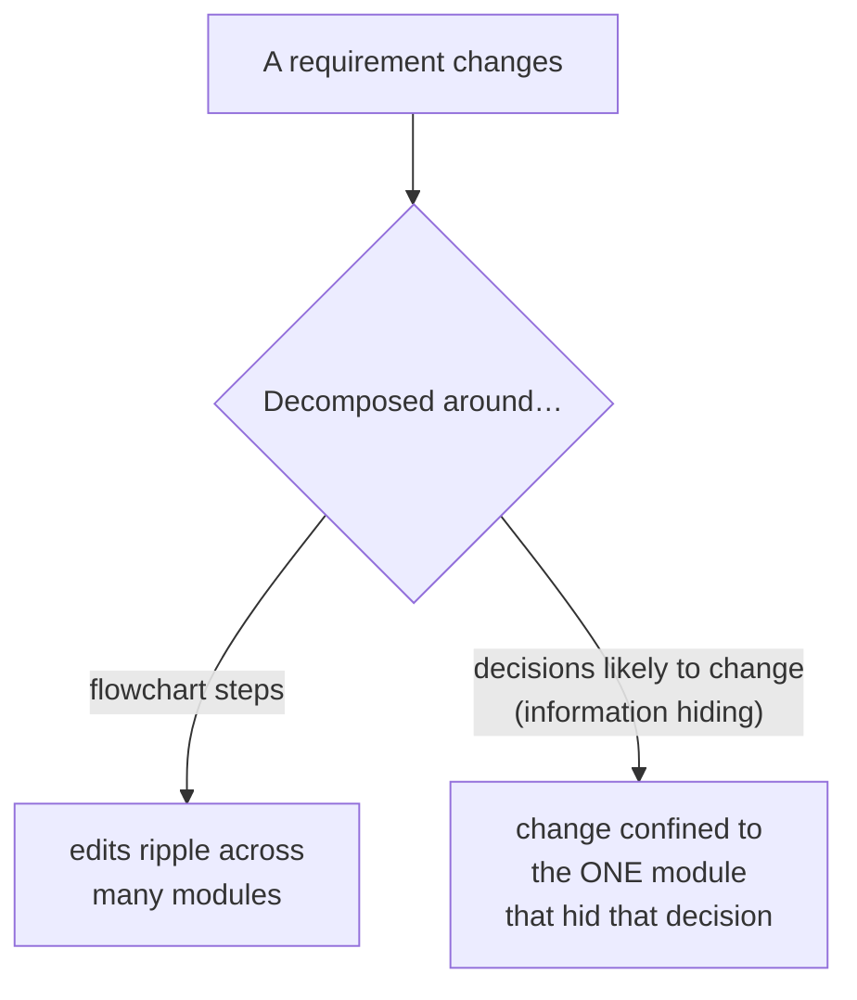

# Encapsulate What Changes — Middle

> **Category:** [Design Principles](../../README.md) — find the part of a system most likely to change and hide it behind a stable interface, so change stays contained.

> **Prerequisite:** [Junior](junior.md)
> **Focus:** **Why** and **When**

---

## Table of Contents

1. [Introduction](#introduction)
2. [The Parnas Insight, Properly](#the-parnas-insight-properly)
3. [Finding the Axis of Variation in Practice](#finding-the-axis-of-variation-in-practice)
4. [The Mechanisms of Encapsulation](#the-mechanisms-of-encapsulation)
5. [This Is the Engine Behind Open/Closed and DIP](#this-is-the-engine-behind-openclosed-and-dip)
6. [Depend on What Changes Least: Stable Dependencies](#depend-on-what-changes-least-stable-dependencies)
7. [The YAGNI Tension, Rigorously](#the-yagni-tension-rigorously)
8. [Relationship to SRP](#relationship-to-srp)
9. [Trade-offs](#trade-offs)
10. [Edge Cases](#edge-cases)
11. [Tricky Points](#tricky-points)
12. [Best Practices](#best-practices)
13. [Test Yourself](#test-yourself)
14. [Summary](#summary)
15. [Diagrams](#diagrams)

---

## Introduction

> Focus: **Why** and **When**

At the junior level, "encapsulate what changes" is a technique: find the varying thing, put an interface in front. At the middle level it becomes a **prediction problem with real stakes on both sides**:

- **Encapsulate too little** — leave a genuinely volatile concept scattered and exposed — and you get **shotgun surgery**: every change to that concept means editing many files, missing some, shipping bugs.
- **Encapsulate too much** — wrap a stable concept that never varies — and you get **speculative generality**: indirection and abstraction tax paid forever for a flexibility never used.

The principle is only *half* a sentence of advice. The other half — the half that separates engineers who apply it well from those who cargo-cult it — is **"…that vary."** The whole skill is identifying *which* aspects actually vary, with evidence, and resisting the urge to encapsulate the rest. This file is about making that judgement well.

---

## The Parnas Insight, Properly

The principle's foundation is David Parnas's 1972 paper, *On the Criteria To Be Used in Decomposing Systems into Modules*. It's worth understanding precisely, because most people who quote "encapsulate what changes" are unknowingly quoting Parnas.

Parnas compared **two ways to break a program into modules** for the same task (a simple text-formatting program):

| Decomposition | Module boundaries drawn around… | What each module hides |
|---|---|---|
| **Flowchart-based** (the naive default) | The *steps of processing* — read lines, store them, format, print | Nothing — every module shares the data representation |
| **Information-hiding** (Parnas's proposal) | The *design decisions likely to change* — input format, storage scheme, output format | One secret each: the line-storage module hides *how* lines are stored, etc. |

His decisive observation: when a requirement changes — say, the input format — the flowchart decomposition forces edits across **many** modules (they all touched the shared representation), while the information-hiding decomposition confines the change to **one** module (the one whose *secret* was that decision).

> **Parnas's criterion: a module should hide a design decision that is likely to change. Decompose around what changes, not around the order of operations.**

This is *exactly* "encapsulate what changes," stated thirteen years before the Gang of Four. The interface is the part you promise to keep stable; the "secret" behind it is the volatile decision. When that decision changes, only the module that hid it changes.

The practical corollary that middle engineers must internalize: **a good module boundary is defined by what it hides, and the best thing to hide is a decision that will change.** If your modules are named `Step1Processor`, `Step2Validator`, `Step3Writer`, you've decomposed around the flowchart and your design will not absorb change.

---

## Finding the Axis of Variation in Practice

The principle is only as good as your ability to find the *right* axis. Concrete methods, from cheapest to most rigorous:

### 1. Domain volatility analysis

Some categories of thing are *known* to vary in business software. Treat these as default axes of variation:

| Category | Why it varies |
|---|---|
| Payment methods | New providers, regions, regulations |
| Tax / pricing rules | Jurisdictions, promotions, tiers, law changes |
| Notification channels | Email, SMS, push, in-app, webhook — businesses add channels |
| Storage / persistence | Vendor changes, performance migrations, multi-cloud |
| Formats (import/export) | New partners, new standards (CSV → JSON → Parquet) |
| External integrations | Vendors get swapped; APIs version |
| Authentication providers | SSO, OAuth, SAML, passkeys added over time |

If a concept is in this list and you already have *two real cases*, it's almost certainly worth encapsulating.

### 2. Git history (what churns)

Volatility leaves a fingerprint. Files that change in many commits are *empirically* your volatile spots:

```bash
# Files changed most often in the last 12 months = your real volatility map
git log --since="12 months ago" --name-only --pretty=format: \
  | grep -v '^$' | sort | uniq -c | sort -rn | head -20
```

A file at the top of that list, scattered with branching logic, is begging to have its varying concept encapsulated. This is the single most objective signal you have — it's *measured* volatility, not guessed.

### 3. Known requirement direction

Roadmaps predict variation. "We launch US-only, then EU next quarter" means *currency* and *tax* are about to become axes. You can encapsulate **just ahead** of a *known, scheduled* requirement — that's not speculation, it's preparation. (The line between "known requirement" and "imagined future" is the whole YAGNI debate; see below.)

### 4. The scattered conditional smell

A `switch`/`if-else` ladder over a *type discriminator*, **repeated in more than one place**, is an axis of variation that has already escaped containment:

```python
# The SAME ladder in checkout(), refund(), and report() → the axis "payment type"
# has leaked everywhere. That repetition IS the evidence to encapsulate.
if t == "card": ...
elif t == "paypal": ...
elif t == "crypto": ...
```

When the same discriminator drives branching in several places, polymorphism (one stable interface, one class per case) collapses all of them.

---

## The Mechanisms of Encapsulation

"Hide it behind an interface" is the most common mechanism, but not the only one. Match the mechanism to the *kind* of variation:

| What varies | Mechanism | Example |
|---|---|---|
| A **behavior**, swapped at runtime | **Strategy** object behind an interface | `PricingRule`, `PaymentMethod` |
| **Which implementation** is constructed | **Factory** / dependency injection | `NotifierFactory.for(channel)` |
| A **value** that differs by environment | **Configuration** | timeout, feature flag, rate |
| An **open-ended set** of behaviors others add | **Plugin / extension point** | a registry of handlers |
| A **whole external system** | **Adapter / port** behind an interface | `Storage`, `EmailGateway` |
| **Which type** flows through a hierarchy | **Polymorphism** (subtype override) | `Shape.area()` |

The unifying idea: each is a way to put the **stable thing in front** and the **volatile thing behind**. Choosing the lightest mechanism that contains the variation is part of the skill — a config value is cheaper than a plugin system; don't reach for the plugin system when a config will do.

```python
# Strategy: behavior varies, hidden behind a stable call
class ShippingCalculator:
    def __init__(self, rate_policy: RatePolicy):   # the volatile decision, injected
        self._policy = rate_policy
    def cost(self, parcel):
        return self._policy.rate_for(parcel)       # stable call; policy varies behind it
```

---

## This Is the Engine Behind Open/Closed and DIP

Two SOLID principles are, mechanically, **"encapsulate what changes" applied to a specific situation.** Understanding this collapses three ideas into one.

### Open/Closed Principle

The [Open/Closed Principle](../../04-solid/02-ocp-open-closed/middle.md) says a module should be *open for extension, closed for modification* — you add new behavior without editing existing code. **The only way to achieve that is to encapsulate the varying part behind a stable interface.** Then "extension" = a new implementation behind the interface; the existing code (closed for modification) never changes.

> OCP is the *goal* ("don't modify existing code to add behavior"); Encapsulate What Changes is the *mechanism* that gets you there. You cannot be open/closed along an axis you haven't encapsulated.



### Dependency Inversion Principle

The [Dependency Inversion Principle](../../04-solid/05-dip-dependency-inversion/middle.md) says high-level policy should depend on **abstractions**, not on **concrete details** — and the details should depend on the abstraction, not vice versa. Notice *what the abstraction is*: it's the stable interface in front of the **volatile detail** (the database, the vendor, the framework). DIP is "encapsulate what changes" applied specifically to the **stable-policy / volatile-detail** boundary, with the dependency arrow pointed *toward* the stable thing.

So: **Encapsulate What Changes is the shared engine; OCP and DIP are two of its most important applications.** Learn the engine and the SOLID letters stop being arbitrary.

---

## Depend on What Changes Least: Stable Dependencies

A direct consequence worth stating on its own: **arrange dependencies so that volatile code depends on stable code, never the reverse.**

The interface you extract should be the *most stable* thing in the picture — that's the whole point of it being the "wall." Your high-level business policy should depend on that stable interface, and the volatile implementations should depend on it too (by implementing it). The volatility lives at the *leaves* of the dependency graph, behind the stable boundary, where a change can't propagate upward.

> **Depend in the direction of stability.** The thing least likely to change (the interface, the policy) should be the thing most depended upon. The thing most likely to change (the Stripe SDK, the S3 client) should be a leaf nobody depends on directly.

This is the deeper reason the principle works: it doesn't just *hide* the volatile part, it *positions* it so that its changes have nowhere to propagate. (At the architecture scale this becomes the Stable Dependencies / Stable Abstractions principles — see Clean Architecture.)

---

## The YAGNI Tension, Rigorously

This is the heart of the middle level. "Encapsulate what changes" and **[YAGNI](../../01-generic/02-yagni/middle.md)** ("don't build it until you need it") appear to contradict each other. They don't — but reconciling them takes precision.

### The two failure modes are symmetrical

| | **Under-encapsulation** | **Over-encapsulation** |
|---|---|---|
| What you did | Left a volatile concept exposed/scattered | Wrapped a stable concept in an interface |
| Symptom | **Shotgun surgery** — change ripples across files | **Speculative generality** — indirection nobody uses |
| Cost paid | Every change is expensive and bug-prone | Every *read* is more expensive; abstraction tax forever |
| The rule it violates | "Encapsulate what changes" | YAGNI |

Both are real. Most engineers fear the first (it's visibly painful) and so over-correct into the second (which *looks* sophisticated and is therefore rewarded). The middle skill is sitting exactly in between.

### The reconciliation: encapsulate what *demonstrably* changes

YAGNI and Encapsulate What Changes only conflict if you read the latter as "encapsulate what *might* change." Read correctly — "encapsulate what **varies**" — there's no conflict:

> **Encapsulate what *demonstrably* varies (evidence: two real cases, domain knowledge, git churn, a scheduled requirement). Do *not* encapsulate what you merely *imagine* might vary. The verb in the principle is "vary," present tense — not "might someday vary."**

The cost of guessing wrong is **asymmetric and high**: if you encapsulate the wrong axis, you've paid for an abstraction *and* it doesn't contain the change that actually comes, so you refactor anyway — you pay twice. Worse, a wrong abstraction *shapes* the future code badly: people contort new requirements to fit the seam you guessed, accumulating flags and special cases (the "wrong abstraction" death spiral, detailed at [Senior](senior.md)).

### The Rule of Three

The operational tool for this judgement:

> **Don't encapsulate the variation until you've seen it about three times.** One case: you know nothing about the axis. Two cases: you can see *an* axis but not its real shape (a two-point line fits many curves). Three cases: you can see what's *truly* invariant across all of them — so the interface you extract fits, instead of being a guess.



Exception: when variation is **certain and known** (the domain *guarantees* multiple cases — payment methods, currencies — or a requirement is *scheduled*), you may encapsulate at the second case or even the first. The Rule of Three protects against *guessing*; when there's nothing to guess, you don't need it.

---

## Relationship to SRP

The [Single Responsibility Principle](../../04-solid/01-srp-single-responsibility/middle.md) is usually stated as "a class should have one reason to change" — and a *reason to change* is precisely an **axis of variation**. The two principles are two views of the same idea:

- **SRP:** separate things that change for **different reasons** (different axes) into different modules.
- **Encapsulate What Changes:** find each axis of variation and hide it behind its own boundary.

A class that mixes "how we price an order" with "how we format the receipt" has **two** axes of variation tangled together — it violates SRP *and* fails to encapsulate either concept cleanly. Pull each axis behind its own interface and you satisfy both principles at once. SRP tells you *where the seams should be* (one per reason-to-change); Encapsulate What Changes tells you *what to put behind each seam* (the volatile decision).

This also connects to the [Optimize for Deletion](../../01-generic/06-optimize-for-deletion/middle.md) principle: a well-encapsulated volatile concept is **easy to delete or replace**, because the blast radius of removing it is exactly one module. Good encapsulation along the real axes of variation is what makes a system's parts independently replaceable — which is the same property as high **cohesion** ([Maximise Cohesion](../../02-coupling-and-cohesion/02-maximise-cohesion/middle.md)).

---

## Trade-offs

| Decision | Encapsulate the axis | Leave it concrete |
|---|---|---|
| Cost today | Higher — define interface, wire indirection | Lower — write the direct code |
| Cost when a new case arrives | **Low** — one new class behind the wall | High — edit every scattered branch |
| Cost if the axis *never* varies | **Wasted** — abstraction tax forever, no benefit | Zero — you built only what was needed |
| Readability now | Lower (indirection) if the axis is speculative; fine if real | High — direct, no indirection |
| Risk | Wrong axis → pay twice (remove + rebuild) | Real axis left exposed → shotgun surgery |
| Best when | Variation is **demonstrated** (cases / churn / schedule) | Variation is **imagined** or the concept is genuinely stable |

The asymmetry to remember: deferring (staying concrete) and being wrong costs you **one** refactor to add the seam later — cheap, especially behind tests. Encapsulating speculatively and being wrong costs you **two** refactors (remove the wrong abstraction, then build the right one) *plus* the carrying cost in between. Deferral is the lower-variance bet — which is why YAGNI is the tiebreaker when evidence is thin.

---

## Edge Cases

### 1. "We're 90% sure we'll need it"

High confidence about *existence* ("we'll add SMS") is much more reliable than confidence about *shape* (the exact interface SMS needs). Even when you're nearly certain a second case is coming, the second concrete case usually reveals the interface you'd have guessed wrong. Prefer to wait for it unless the requirement is *scheduled* and *imminent*.

### 2. The one-way-door exception

Some boundaries are expensive or impossible to change later — a database schema, a public API contract, a wire protocol. For these, you encapsulate **up front** even without three cases, because the cost of *not* having the seam (a painful migration) dwarfs the cost of the abstraction. (Detailed at [Senior](senior.md).)

### 3. Variation that's really just a constant

Sometimes "what varies" is one number that differs by environment. Don't build a Strategy hierarchy for it — a **configuration value** is the right-sized encapsulation. Match the mechanism's weight to the variation's complexity.

### 4. The interface with one implementation — forever

If, after honest analysis, a concept has exactly one form and the domain gives no reason for a second, **don't encapsulate it**. A one-implementation interface that will *stay* one implementation is pure speculative generality, regardless of how "clean" it looks.

---

## Tricky Points

- **"Encapsulate what changes" is not "encapsulate what *might* change."** The present-tense "vary/changes" is doing load-bearing work. Imagined variation is YAGNI's target, not this principle's.
- **A wrong axis is worse than no encapsulation.** If you guess the axis wrong, the abstraction doesn't contain the real change *and* it misleads everyone into bending new code around it. Wrong abstraction > duplication in cost. (See [Senior](senior.md).)
- **The interface must capture only the *shared* part.** Leak one case's specifics onto the interface (`getStripeToken()`) and the wall has a hole — every other implementation and caller now knows about Stripe.
- **OCP and DIP don't conflict with YAGNI either — *speculative* application of them does.** "Always program to an interface" applied to a one-implementation type is a YAGNI violation wearing a principle's clothes. Earn the abstraction with evidence.
- **Git churn beats intuition.** When unsure where the volatility is, *measure* it. The files that change most are the axes that need encapsulating, full stop.

---

## Best Practices

1. **Demand evidence before encapsulating.** Two real cases, domain knowledge, git churn, or a scheduled requirement — not a hunch.
2. **Apply the Rule of Three** for anything you're guessing about; encapsulate sooner only when variation is *certain* (known domain) or *irreversible* (one-way door).
3. **Measure volatility from git history** when you're unsure which concept is the real axis.
4. **Match the mechanism to the variation** — config for a value, Strategy for a behavior, plugin for an open set, adapter for an external system.
5. **Put only the shared contract on the interface;** keep case-specific details behind it.
6. **Point dependencies at stability** — volatile implementations depend on the stable interface, never the reverse.
7. **Treat OCP/DIP as applications of this principle** — earn them through real variation, don't front-load them.

---

## Test Yourself

1. Describe Parnas's two decompositions and which one absorbs change better, and why.
2. Give three concrete methods for finding the *real* axis of variation in a codebase.
3. Explain how "encapsulate what changes" is the engine behind both OCP and DIP.
4. State the precise reconciliation between this principle and YAGNI.
5. Why is encapsulating the *wrong* axis worse than not encapsulating at all?
6. How does this principle relate to SRP?

---

## Summary

- The middle-level skill is **predicting the right axis of variation with evidence**, sitting between under-encapsulation (**shotgun surgery**) and over-encapsulation (**speculative generality**).
- **Parnas (1972)** is the foundation: decompose around **design decisions likely to change**, not flowchart steps; a module's job is to **hide** one such decision.
- Find the axis via **domain volatility, git churn, known requirement direction, and scattered conditionals** — and match the **mechanism** (config, Strategy, factory, plugin, adapter) to the variation.
- This principle is the **engine behind OCP and DIP**: both are it, applied to a specific boundary; and it pairs with **SRP** (one axis per module) and **stable-dependencies** (point dependencies at stability).
- The **YAGNI reconciliation**: encapsulate what **demonstrably** varies, not what you imagine might. Use the **Rule of Three**; a *wrong* axis costs more than no encapsulation.

---

## Diagrams

### Under- vs. over-encapsulation — the principle sits between



### Parnas: hide the decision that changes




---

## Check your understanding

1. Explain Encapsulate What Changes — Middle Level in your own words and name the problem it solves.
2. How would you apply the ideas around Table of Contents, Introduction, The Parnas Insight, Properly in a realistic engineering change?
3. What failure mode or misuse should you look for, and what evidence would reveal it?
4. Which local design trade-off would make you choose or reject Encapsulate What Changes — Middle Level in an existing codebase?
5. What observable result would convince you that the approach improved the system?
