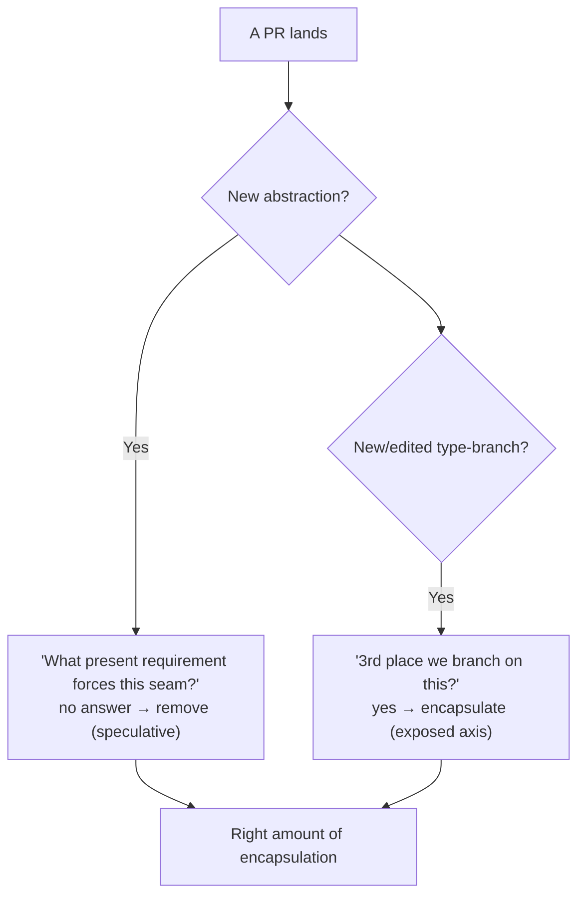
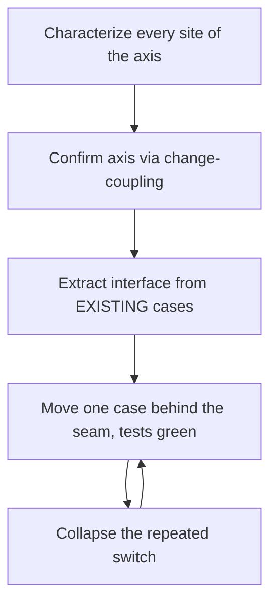

# Encapsulate What Changes — Professional

> **Category:** [Design Principles](../../README.md) — find the part of a system most likely to change and hide it behind a stable interface, so change stays contained.

> **Prerequisites:** [Junior](junior.md) · [Middle](middle.md) · [Senior](senior.md)
> **Focus:** **Production** — reviews, metrics, team conventions, legacy systems

---

## Introduction

> Focus: **production** — getting the axes of variation right across a large, multi-contributor codebase over years.

The principle is simple to state and brutal to sustain at scale. Two opposite failures accumulate in any long-lived codebase, often *in the same system*:

- **Speculative seams** pile up: interfaces with one implementation, plugin systems with no plugins, configuration nobody configures — each added by a well-meaning engineer "future-proofing."
- **Real axes stay exposed**: the payment-type `switch`, the format-handling `if`-ladder, the vendor SDK calls smeared through the domain — each left concrete because nobody noticed the volatility until the third painful change.

The professional question is operational: **how do you get a team to encapsulate the axes that genuinely vary, and *only* those, when changes land daily from dozens of people with different instincts?** The answer is a system — review standards that demand evidence for every seam, volatility metrics that point at the real axes, conventions that make the right call the default, and a disciplined way to add seams to legacy code without breaking it.

---

## Enforcing the Principle in Code Review

Both failure modes enter one PR at a time, so review is where they're caught. The reviewer's job is *symmetric*: challenge speculative seams **and** flag exposed axes.

### Catching the speculative seam

The single highest-value review question for any new abstraction:

> **"What present requirement — two real cases, a scheduled feature, or an irreversible boundary — forces this seam?"**

If the honest answer is "it's more flexible / future-proof / extensible," the seam is a YAGNI violation and should come out (add it the day the second case is real). Make this a routine, non-confrontational bar, not an accusation.

```text
> "This PaymentMethod interface has one implementation (Stripe) and one
>  caller. What's the second provider we're anticipating, and is it scheduled?
>  If it's hypothetical, let's use the concrete StripeGateway and extract the
>  interface when the second provider is real — the second case will tell us
>  the right shape."
```

### Catching the exposed axis

The mirror question, asked of any new or edited `switch`/`if`-ladder over a type discriminator:

> **"Is this the *third* place we branch on this same discriminator? If so, it's a real axis of variation that's leaked everywhere — let's encapsulate it."**

```text
> "This is the third place we switch on `order.payment_type` (also in
>  refund.py and report.py). That's a real axis — adding a method now means
>  editing three files and risking a miss. Let's pull it behind a
>  PaymentMethod interface so a new method is one new class."
```

### The leaky-interface check (the senior smell)

When a seam *does* exist, verify it doesn't leak each implementation's specifics across the boundary:

```text
> "charge(amount, cvv=None, mandate_id=None, redirect_url=None) leaks every
>  provider's specifics onto the shared interface — that's connascence of
>  meaning crossing the boundary, so it won't actually contain change. Either
>  the axis was guessed wrong, or these should be separate handlers."
```

These three questions — *what forces this seam? / is this the third branch? / does the interface leak?* — catch the great majority of both over- and under-encapsulation.

---

## Measuring Volatility to Locate the Real Axes

Intuition about "what changes" is unreliable; **git history is the ground truth.** The professional move is to *measure* volatility and point seams at the measured axes, not the imagined ones.

### Change frequency: where the churn is

```bash
# The files that change most often = your empirical volatility map.
git log --since="12 months ago" --name-only --pretty=format: \
  | grep -v '^$' | sort | uniq -c | sort -rn | head -25
```

A high-churn file dense with branching logic is an un-encapsulated axis. A high-churn file that's *already* a clean implementation behind a stable interface is fine — that's the volatility landing exactly where you put it.

### Change coupling: which files change *together*

The sharper signal. If `checkout.py`, `refund.py`, and `report.py` keep appearing in the *same commits*, they share an un-encapsulated axis — a change to one forces changes to the others (distributed connascence). That co-change pattern is the fingerprint of a missing seam:

```bash
# Pairs of files frequently changed together → candidates for a shared seam.
# (Conceptually: for each commit, emit all file pairs; count pair frequency.)
```

| Metric | What it tells you | Action |
|---|---|---|
| **Change frequency** (per file) | Where volatility concentrates | Encapsulate high-churn files dense with branching |
| **Change coupling** (co-change of files) | Which files share a hidden axis | Extract the shared axis behind one seam |
| **Element-count per feature** (trend) | Whether speculative seams are accruing | Rising → audit for one-impl interfaces |
| **Count of one-implementation interfaces** | Speculative-generality load | High → inline the dead seams |

> The honest-measurement rule: **change coupling identifies *under*-encapsulation (exposed axes); one-implementation-interface count identifies *over*-encapsulation (speculative seams).** Track both — a codebase usually suffers from each in different places. Don't report only one and declare victory.

---

## Team Conventions

Codify these so the right call is the default path, not a per-PR debate:

1. **Evidence before a seam.** No new interface/Strategy/plugin without a present requirement: two real cases, a scheduled feature, or an irreversible boundary. Written in the engineering handbook so reviewers cite policy, not opinion.
2. **Rule of Three for reversible axes.** Tolerate the duplication/branching twice; encapsulate on the third occurrence (unless variation is certain or the door is one-way).
3. **One-way doors get a seam from day one.** Persistence, third-party vendors, public API contracts, wire protocols — encapsulate behind a port immediately; these are exempt from the Rule of Three because reversibility, not evidence, governs.
4. **No one-implementation interfaces in new code** — except documented test seams. (A genuine need for a test double *is* a present requirement.)
5. **Type-discriminator `switch` over two-plus places ⇒ polymorphism.** A repeated discriminator branch is a flagged smell.
6. **Interfaces carry only the shared contract.** Reject parameters/methods that serve one implementation; they signal a wrong or leaky axis.
7. **Periodic volatility review.** Quarterly, re-run change-coupling/churn analysis; inline seams whose axis has frozen; add seams to newly-hot files.

These conventions encode the senior reasoning so that juniors get it right by default and reviewers enforce a standard rather than a preference.

---

## Introducing Seams into Legacy Systems

The greenfield case is easy. The real work is **carving an axis of variation out of code where it's currently smeared everywhere, untested, and in production.** The approach is incremental and test-guarded — never a rewrite.

### The sequence (Feathers' *Working Effectively with Legacy Code*)

1. **Characterize first.** Write tests that pin the *current* behavior of every site that touches the axis (e.g., every payment branch in checkout, refund, report) — including its quirks. You cannot safely move logic behind a seam without a net.
2. **Identify the true axis from churn.** Use change-coupling to confirm *which* files actually co-change on this concept — don't guess the seam location; measure it.
3. **Extract the interface from the existing cases.** With two or three concrete cases already in the code, you have the data the Rule of Three asks for — the interface shape is *observed*, not guessed. Define it to capture only the shared contract.
4. **Move one case behind the seam at a time**, keeping tests green, in small commits. Replace each scattered branch with a call to the interface.
5. **Collapse the discriminator.** Once every case is behind the seam, the repeated `switch`/`if`-ladders disappear; new cases become one new class.

### Removing a *wrong*, load-bearing seam (the harder legacy job)

Legacy systems are full of speculative interfaces that became load-bearing. The safe removal mirrors the senior-level "escape the wrong abstraction":

```text
1. Characterize: tests around every caller of the over-general/leaky seam.
2. Inline: push the interface's behavior back into each caller
   (temporarily MORE duplication — that's correct; the wrong seam was worse).
3. Simplify each caller independently — delete the flags/params it never used.
4. Re-extract ONLY the genuinely shared contract, if any axis is truly real.
5. Delete the old interface.
```

The intermediate state has *more* duplication on purpose — the wrong abstraction was worse than the duplication it replaced.

### What *not* to do

- **Don't add a seam without characterization tests.** A "harmless" extraction that subtly changes behavior is the classic legacy incident.
- **Don't replace a wrong seam with a different speculative one** ("now with hexagonal ports everywhere!"). Aim for the *real* axes, not a new favorite pattern.
- **Don't run a standalone "introduce seams" project.** Do it opportunistically (Boy Scout Rule) as feature work flows through the volatile files.

---

## Real Incidents

### Incident 1: The plugin system with no plugins

A team built a generic, configurable "integration framework" to hold what was, at launch, *two* hard-coded partner integrations — anticipating that partners would write their own plugins against the published SPI. Three years later it held four integrations, **all written by the same team**, none by an external party. The framework was ~12,000 lines; the integrations it ran were ~600. Every new integration required learning the framework's lifecycle and DSL. **Postmortem:** the axis ("third-party-authored integrations") was *imagined*, never demonstrated — speculative generality at framework scale. **Fix:** integrations re-expressed as plain adapter classes (~600 lines total) behind a thin interface; the framework deleted. "Add an integration" dropped from a week to an afternoon. **Lesson:** encapsulating an axis nobody actually varies along is pure cost. The present requirement was two integrations — the design should have been two adapters.

### Incident 2: The exposed axis that caused a production miss

A payments service branched on `payment_type` in *seven* places (checkout, refund, partial-refund, receipt, reconciliation, fraud-check, reporting). Adding "BNPL" required editing all seven; the engineer found six and missed the fraud-check path. BNPL transactions skipped fraud screening for **eleven days** before detection. **Postmortem:** a real, high-churn axis left un-encapsulated — classic shotgun surgery, with a missed site causing a security gap. **Fix:** the seven branches were collapsed behind a `PaymentMethod` interface (characterization tests first); adding the *next* method became one class touched in one place. **Lesson:** the cost of an exposed real axis isn't just toil — it's the *missed* edit. Change-coupling analysis had flagged these seven files as a co-change cluster months earlier; the signal was ignored.

### Incident 3: The leaky seam that contained nothing

A team *did* encapsulate notifications behind a `Notifier` interface — but the interface was `send(user, channel, subject, body, sms_template_id, push_payload, email_attachments)`. Every caller passed a soup of mostly-null arguments; every implementation ignored most of them. Adding a "webhook" channel meant *editing the interface* (and therefore every caller and implementation). **Postmortem:** the seam existed but leaked each channel's specifics across the boundary (connascence of meaning crossing the wall) — so it failed to contain change, the one thing it was for. **Fix:** narrowed the interface to `send(recipient, Message)` with channel-specific construction behind each implementation. **Lesson:** an interface that leaks implementation specifics is not encapsulation — it's a tollbooth that still requires editing the road. The test of a seam is whether a new case can be added *without touching the interface*.

### Incident 4: Under-engineering at a one-way door

To "keep it simple," a team made direct calls to a third-party email vendor's SDK throughout the codebase rather than behind an adapter — a defensible YAGNI call *if* the vendor were reversible. It wasn't: the vendor had an outage and a pricing change, and switching meant editing **140 files** with the SDK's types entangled in business logic. **Lesson:** YAGNI applies to *reversible* decisions. A third-party vendor boundary is a one-way door; "encapsulate what changes" *outranks* YAGNI there because the change (swapping vendors) is both foreseeable and catastrophic to retrofit.

---

## The Politics of Seams

Sustaining the principle is partly social:

- **Speculative seams *look* like senior work.** A "pluggable framework" signals sophistication; deleting it to a concrete class looks like under-delivery. Reframe relentlessly: **removing an unused seam is the senior move**, and *adding* one without evidence is the junior reflex.
- **Exposed axes are invisible until they bite.** Nobody gets credit for "I noticed payment_type was branched in seven places and encapsulated it before the next provider." Make change-coupling reports visible so the *prevention* is rewarded, not just the incident response.
- **"We might need it" is socially hard to refuse.** Arm the team with the evidence-before-a-seam policy and the reversibility test, so refusing speculation cites a standard rather than blocking a colleague.
- **Seniors set the reflex.** If the staff engineer reaches for an interface-per-noun by default, everyone does. Model "concrete until the second case — except at one-way doors," and *explain the axis* you did or didn't encapsulate.

---

## Review Checklist

```text
ENCAPSULATE-WHAT-CHANGES REVIEW CHECKLIST
[ ] NEW SEAM — has a PRESENT requirement (2 real cases / scheduled / one-way door)?
[ ] NEW SEAM — not a one-implementation interface (except documented test seam)?
[ ] INTERFACE — carries ONLY the shared contract (no per-impl params/methods)?
[ ] INTERFACE — can a new case be added WITHOUT editing the interface? (the real test)
[ ] EXPOSED AXIS — is this the 3rd+ place we branch on the same discriminator?
[ ] EXPOSED AXIS — does change-coupling show these files co-changing? → encapsulate
[ ] ONE-WAY DOOR — storage/vendor/public API/protocol encapsulated up front?
[ ] WRONG AXIS — does the seam contain the change, or leak specifics across it?
[ ] EVIDENCE — encapsulating what DEMONSTRABLY varies, not what we IMAGINE might?
```

---

## Cheat Sheet

```text
THE TWO QUESTIONS (ask both, symmetrically)
  speculative seam? → "what PRESENT requirement forces this?"
  exposed axis?     → "is this the 3rd branch on the same discriminator?"

MEASURE, DON'T GUESS
  change frequency  → where volatility concentrates (encapsulate hot+branchy)
  change coupling   → files that co-change share a HIDDEN axis (extract the seam)
  one-impl-iface ct → speculative-generality load (inline dead seams)

THE SEAM TEST
  a real seam: new case = new class, interface UNTOUCHED.
  a leaky seam: new case = edit the interface → wrong/leaky axis.

ONE-WAY DOORS  storage / vendor / public API / protocol → seam UP FRONT
               (reversibility governs, beats the Rule of Three & YAGNI)

LEGACY         characterize FIRST → confirm axis via churn → extract interface
               from existing cases → move one case at a time → collapse the switch.
               Wrong seam? inline back → simplify → re-extract real contract.

CULTURE        removing an unused seam = senior move. Reward PREVENTION
               (encapsulating an exposed axis before it bites), not just heroics.
```

---

## Diagrams

### Symmetric review: catch both failure modes at the door



### Safe legacy seam extraction



---

## Related Topics

- **Sibling:** [Command Query Separation](../02-command-query-separation/professional.md)
- **Specializations of this principle:** [Open/Closed](../../04-solid/02-ocp-open-closed/professional.md), [Dependency Inversion](../../04-solid/05-dip-dependency-inversion/professional.md), [Single Responsibility](../../04-solid/01-srp-single-responsibility/professional.md)
- **The counterweight:** [YAGNI](../../01-generic/02-yagni/professional.md)
- **Tooling:** git change-frequency & change-coupling analysis, SonarQube (one-implementation-interface and complexity rules), *Working Effectively with Legacy Code* (characterization tests, seams).

---


---

## Check your understanding

1. Explain Encapsulate What Changes — Professional Level in your own words and name the problem it solves.
2. How would you apply the ideas around Table of Contents, Introduction, Enforcing the Principle in Code Review in a realistic engineering change?
3. What failure mode or misuse should you look for, and what evidence would reveal it?
4. How would you introduce and govern Encapsulate What Changes — Professional Level across teams through reversible, measurable increments?
5. What observable result would convince you that the approach improved the system?
