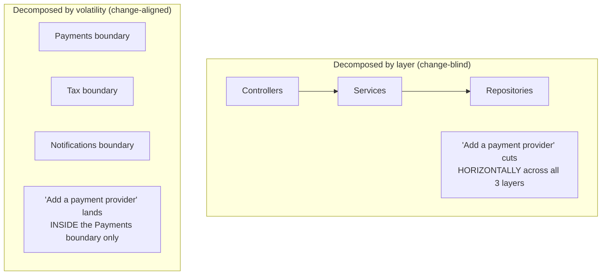
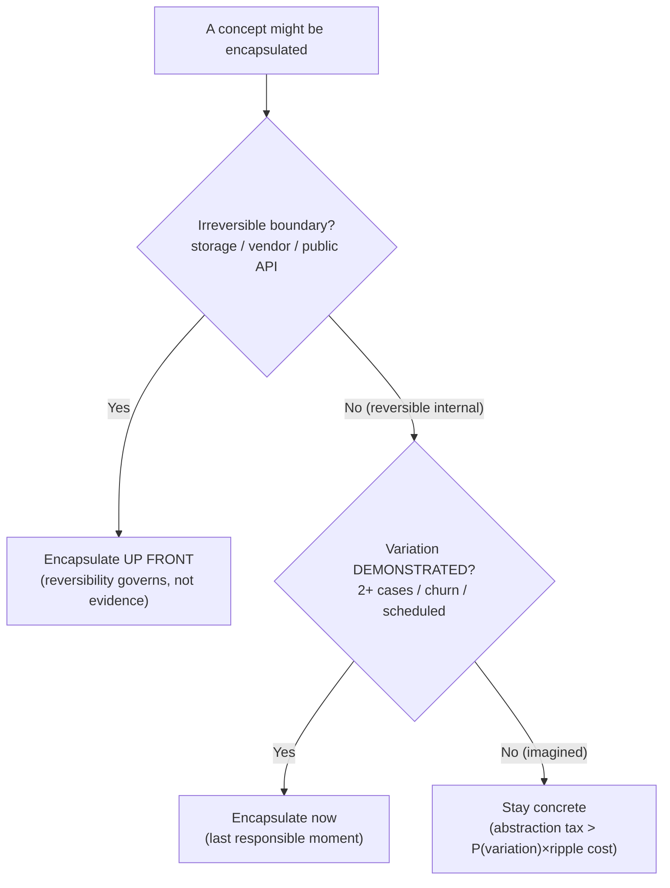
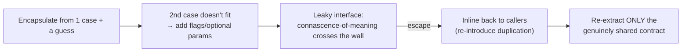

# Encapsulate What Changes — Senior

> **Category:** [Design Principles](../../README.md) — find the part of a system most likely to change and hide it behind a stable interface, so change stays contained.

> **Prerequisites:** [Junior](junior.md) · [Middle](middle.md)
> **Focus:** **Design trade-offs** and **system-level reasoning**

---

## Introduction

> Focus: **design trade-offs** and **system-level reasoning**

At the senior level, "encapsulate what changes" stops being a per-class technique and becomes a **theory of where to draw boundaries in a whole system**. Parnas's information-hiding criterion, scaled up, *is* an architectural philosophy: **structure the system so that the boundaries align with the axes of change.** Get the alignment right and most requirements land inside a single module; get it wrong and ordinary changes spray across the codebase.

This file covers the three hard questions a senior must answer:

1. **How do you decompose a system around volatility** rather than around nouns, layers, or flowchart steps?
2. **What is the true cost of guessing the axis wrong**, and why is it asymmetric enough to justify YAGNI as the default?
3. **When is an encapsulation a *net loss*** — and how do you recognize the abstraction tax before it accumulates?

---

## Volatility-Based Decomposition as an Architectural Stance

The naive ways to decompose a system are by **noun** (an `Order` module, a `Customer` module) or by **technical layer** (controllers, services, repositories). Both are seductive and both are *blind to change*: they tell you nothing about which boundaries will contain a future requirement and which will be crossed by it.

The senior reframing — Parnas scaled to architecture — is **volatility-based decomposition** (articulated sharply by Juval Löwy in *Righting Software*, though the idea is pure Parnas):

> **Decompose the system around the axes of change, not around the things or the steps. Every boundary should encapsulate something that varies independently of the others.**

Concretely, this means: before drawing modules, enumerate the axes of variation the domain *will* exercise — *which payment provider, which tax jurisdiction, which notification channel, which storage engine, which client format* — and make each its own encapsulated boundary. A requirement to "add Adyen as a payment provider" should then map to exactly one boundary (the payment one), because that boundary was defined *by* that axis of change.



The litmus test for a good decomposition: **take your three most likely upcoming requirements and trace which modules each one touches.** If each requirement maps to one module, your boundaries are aligned with your volatility. If each sprays across many, you decomposed around the wrong thing — almost always nouns or layers instead of axes of change.

---

## The Prediction Problem: Why the Axis Is Hard to Guess

The entire principle hinges on a prediction — *which* aspect varies — and prediction is genuinely hard. Seniors must respect the failure modes:

- **Confusing existence with shape.** You can often be confident a second case *will exist* ("we'll add another payment provider") while being wrong about the *shape* of the variation (the interface it needs). The first abstraction tends to be over-fit to the one case you have. The second concrete case is what reveals the real boundary — which is *why* the Rule of Three exists.
- **The axis moves.** What varied historically may freeze; what was stable may start churning. An encapsulation built for last year's volatility can become dead indirection around something that no longer changes. Volatility is not a static property — re-measure it.
- **Hidden axes.** The real axis of variation is sometimes *not* the obvious one. You encapsulate "currency" because money is involved, but what actually changes every quarter is the *rounding/compliance rule*. The visible noun is a decoy; the volatility is elsewhere. Git history is the corrective: it shows you what *actually* changed, not what you assumed would.

> The senior discipline: **encapsulate from evidence, not from nouns.** A noun (`Currency`, `Payment`, `Report`) tempts you to build an abstraction around it. Evidence (two real cases, churn, a scheduled requirement) tells you whether that noun is actually an *axis of change* or just a thing that happens to exist. Build seams around measured volatility, not around the domain's vocabulary.

---

## The Cost of the Wrong Axis

The reason YAGNI is the default tiebreaker — and the reason "encapsulate what *changes*" is not "encapsulate what *might* change" — is that the cost of guessing the axis wrong is **asymmetric and compounding.** Sandi Metz's formulation generalizes perfectly here:

> **The wrong abstraction is more expensive than no abstraction.**

The failure plays out predictably when you encapsulate a guessed axis:

1. You wrap a concept behind an interface based on one case and a hunch about the second.
2. The real second case arrives and **doesn't fit** the interface you guessed.
3. Rather than reshape the load-bearing interface (risky — it has callers), you add a parameter or flag to bridge the gap.
4. More cases arrive; more flags accrue. The "stable interface" becomes a leaky abstraction full of conditionals and optional parameters that serve one case each.
5. Now the abstraction is *harder* to change than the duplication would have been — and it's load-bearing, so it's *risky* to undo.

```python
# A payment interface guessed from ONE case (cards), now serving 3 that don't fit:
class PaymentMethod(ABC):
    @abstractmethod
    def charge(self, amount, cvv=None, redirect_url=None,
               mandate_id=None, installments=1): ...
    # cvv → cards only; redirect_url → PayPal only; mandate_id → SEPA only;
    # installments → BNPL only. The "stable interface" leaks every case's
    # specifics. Each implementation ignores most parameters. This is the
    # wrong axis encapsulated — worse than three separate concrete classes.
```

The recovery is counterintuitive and the same as for any wrong abstraction: **re-introduce duplication.** Inline the leaky interface back into its callers, let each become clear and independent, then re-extract *only* the genuinely shared contract (here, perhaps just `charge(amount) -> Receipt` with method-specific data passed in a method-specific way). You remove the *wrong* encapsulation, not all encapsulation.

This is the rigorous reason the principle is half-disclaimer: **a missing seam costs one refactor to add later; a wrong seam costs two refactors plus a carrying period of accumulating flags.** The expected cost of speculating is higher than the expected cost of waiting — so wait, unless variation is certain or the door is one-way.

---

## The Abstraction Tax: When Encapsulation Is Net-Negative

Every encapsulation charges a permanent tax, paid by everyone who reads or navigates the code, whether or not the variation ever materializes:

| Tax line item | What it costs |
|---|---|
| **Indirection** | A reader must jump from interface to implementation to follow real behavior |
| **Cognitive overhead** | One concept now spans an interface + ≥1 class + a wiring/factory site |
| **Navigation friction** | "Go to definition" lands on the interface, not the code that runs |
| **Testing surface** | The seam itself needs tests; mocks proliferate |
| **False flexibility signal** | The interface *advertises* variation, so people add cases that don't belong |

The tax is **worth paying** when it buys contained change along a real axis. It is **pure loss** when the axis never varies — you pay the tax forever and collect nothing. The senior judgement is a cost-benefit calculation, not a reflex:

> **Encapsulate when `P(variation) × cost_of_scattered_change > abstraction_tax`.** When variation is demonstrated, the left side dominates and you encapsulate. When variation is imagined, `P(variation)` is low and the tax dominates — leave it concrete.

The tell of a net-negative encapsulation: an interface with **one implementation that has never gained a second and shows no domain reason to**, especially one whose methods leak that single implementation's specifics. That's not a seam; it's a tollbooth on an empty road.

---

## Reversibility and the Last Responsible Moment

The default is "defer encapsulation until variation is demonstrated" — but two factors legitimately pull the decision *earlier*: **irreversibility** and the **last responsible moment**.

### Reversibility: the one-way-door carve-out

Some boundaries are cheap to add later; others are catastrophic to retrofit. The deciding question is reversibility:

| Boundary | Reversibility | When to encapsulate |
|---|---|---|
| Internal behavior (pricing rule, formatter) | Cheap (a refactor) | Defer — wait for evidence / Rule of Three |
| Persistence / storage engine | Expensive (data migration, code entangled everywhere) | **Up front** — encapsulate behind a port early |
| Third-party vendor SDK | Expensive (vendor lock-in spreads) | **Up front** — adapter at the boundary |
| Public / published API contract | Very expensive (clients break) | **Up front** — deliberate design |

For a one-way door, you encapsulate **before** you have three cases, because the cost of *not* having the seam (a migration that touches hundreds of files) dwarfs the abstraction tax. Inlining your persistence calls throughout the domain "for fewer elements" is the classic senior-level mistake here: it's a defensible YAGNI call *only* if storage were reversible, and it usually isn't.

### The last responsible moment

The synthesis of "defer" and "don't get caught out" is the **last responsible moment** (Lean): make the encapsulation decision *as late as possible, but no later than the point where deferring it would foreclose your options.*

> Defer the seam while it's cheap to add and reversible to omit. Introduce it the moment further delay would make it *expensive* to add — when the second concrete case lands (reversible internals) or when an irreversible decision is imminent (one-way doors). Not earlier (speculative generality), not later (you're now retrofitting under pressure).

This reframes YAGNI not as "never abstract early" but as "abstract at the *last responsible moment*, gated by reversibility." Reversible internals → wait for evidence. Irreversible boundaries → act before the door shuts.

---

## Encapsulate What Changes as the Root of OCP, DIP, and SRP

A senior should see this principle as the **common root** of a cluster of more famous principles — they are all "encapsulate the axis of variation," specialized:

| Principle | What it specializes |
|---|---|
| **[Open/Closed](../../04-solid/02-ocp-open-closed/senior.md)** | Encapsulate the axis so new cases are *added* (extension), not *edited in* (modification). |
| **[Dependency Inversion](../../04-solid/05-dip-dependency-inversion/senior.md)** | Encapsulate the *volatile detail* behind a stable abstraction, and point the dependency at the abstraction. |
| **[Single Responsibility](../../04-solid/01-srp-single-responsibility/senior.md)** | Give each axis of variation (each "reason to change") its own module — *separate* the axes. |
| **[Composition over Inheritance](../../02-coupling-and-cohesion/05-composition-over-inheritance/senior.md)** | Encapsulate the varying behavior as an *injected object* (Strategy) rather than baking it into a class hierarchy. |

That last one deserves emphasis. **Inheritance encapsulates variation badly**: a subclass that overrides one method is a Strategy you can't swap at runtime and can't combine. The Gang of Book's own corollary to "encapsulate what varies" is *"favor object composition over class inheritance"* precisely because composition lets the varying part be a separately-encapsulated, injectable object. When you find the axis of variation, **prefer to encapsulate it as a composed collaborator** (a `PricingRule` field) rather than as a subclass override — it's more flexible and the seam is explicit. (See [Composition over Inheritance](../../02-coupling-and-cohesion/05-composition-over-inheritance/senior.md).)

> The unifying senior insight: **OCP, DIP, SRP, and composition-over-inheritance are not four rules to memorize — they are four faces of "find the axis of change and encapsulate it."** Internalize the engine and the rest fall out.

---

## Connascence Across the Boundary

The deeper reason encapsulation *works* is measurable with **connascence** ([Connascence](../../02-coupling-and-cohesion/03-connascence/senior.md)): two pieces of code are connascent if changing one forces changing the other.

A scattered, un-encapsulated axis creates **connascence of meaning spread across modules** — the magic string `"credit_card"` and its handling logic appear in checkout, refund, and reporting, all of which must change together when a method is added. That's strong, *distributed* connascence: the worst kind, because it's both severe and non-local.

Encapsulating the axis **transforms** that connascence:

- It **weakens** it: callers now depend only on the interface's *names* (connascence of name — the mildest kind), not on the volatile *meaning* behind it.
- It **localizes** it: the strong connascence (the actual provider logic) is now confined *inside* one module, where strong coupling is acceptable because it's local.

> **Encapsulating the volatile concept = converting distributed strong connascence into localized strong connascence plus weak (name-only) connascence at the boundary.** That conversion is *why* the change stops rippling. This is also the precise way to tell a good seam from a bad one: a good encapsulation leaves only connascence-of-name crossing the boundary; a leaky one (the `cvv=None, mandate_id=None` interface above) leaks connascence-of-meaning across it, which is why it fails to contain change.

---

## Code Examples — Advanced

### Encapsulating a one-way-door boundary up front (Python)

```python
# Storage is a ONE-WAY DOOR: retrofitting a seam after the DB calls are
# entangled in 200 domain files is a multi-week migration. So we encapsulate
# EARLY — even with one implementation — because reversibility, not the
# Rule of Three, governs here.
class EventStore(ABC):
    @abstractmethod
    def append(self, stream: str, event: Event) -> None: ...
    @abstractmethod
    def read(self, stream: str) -> list[Event]: ...

class PostgresEventStore(EventStore): ...   # today's only implementation

# Domain code depends on EventStore. When compliance forces a migration to a
# different engine, the change is ONE new implementation — not 200 edits.
# Justified up-front encapsulation: the door is irreversible.
```

### Re-introducing duplication to escape a wrong axis (Python)

```python
# BEFORE — axis guessed from cards; now a leaky interface serving 3 misfits
def charge(method, amount, cvv=None, redirect=None, mandate=None):
    if method == "card":   return _card(amount, cvv)
    if method == "paypal": return _paypal(amount, redirect)
    if method == "sepa":   return _sepa(amount, mandate)

# AFTER — inline to three clear, independent handlers; keep only the REAL
# shared contract (each returns a Receipt). The "unified" signature was the
# wrong axis; these three are the right encapsulation.
class CardPayment:   def charge(self, amount, cvv) -> Receipt: ...
class PayPalPayment: def charge(self, amount, redirect) -> Receipt: ...
class SepaPayment:   def charge(self, amount, mandate) -> Receipt: ...
# A thin dispatch picks the handler; each method takes only what IT needs.
```

### Earning the seam from a second real case (Go)

```go
// DON'T speculate: one provider, one interface, day one (abstraction tax,
// no benefit — and you'll guess the interface shape wrong).
// DO use the concrete type until a second provider is REAL:
type StripeGateway struct{ /* ... */ }
func (s StripeGateway) Charge(amt Money) (Receipt, error) { /* ... */ }

// When Adyen becomes a real requirement, extract the interface NOW —
// shaped by TWO concrete gateways, so it fits both. Go's structural typing
// lets you add the interface later WITHOUT touching StripeGateway:
type PaymentGateway interface{ Charge(amt Money) (Receipt, error) }
```

The languages reward deferral differently — Go's structural typing makes "extract the interface later" free, which is the language nudging you toward the YAGNI-correct timing.

---

## Liabilities

### Liability 1: Encapsulating nouns instead of axes of change

Building an interface around every domain noun (`ICustomer`, `IOrder`, `IProduct`) regardless of whether it varies. Most nouns have one implementation forever. This is speculative generality at architectural scale — abstraction tax with no contained change. Encapsulate *measured volatility*, not vocabulary.

### Liability 2: Guessing the axis and leaking it

Encapsulating from one case produces an interface over-fit to that case; the second case forces flags and optional parameters that leak each implementation's specifics across the boundary (connascence of meaning crossing the wall). The seam now *advertises* a flexibility it doesn't actually provide cleanly. Wait for the second case; let it shape the interface.

### Liability 3: Missing the one-way door

The mirror image of over-encapsulation: applying YAGNI to an *irreversible* boundary (storage, vendor, public API) and entangling the volatile detail everywhere. "We'll add the seam later" is true for reversible internals and false for one-way doors. Audit reversibility *before* deferring.

### Liability 4: Frozen encapsulation around a frozen axis

A seam built for a volatility that has since stopped — the axis froze, but the indirection remains, now pure tax. Volatility is not permanent. Periodically ask of each abstraction: *does this still encapsulate something that changes?* If not, inline it.

---

## Pros & Cons at the System Level

| Dimension | Encapsulate the axis (when real) | Leave concrete / defer |
|---|---|---|
| Cost of a new case along the axis | **Low** — one new implementation | High — scattered edits, missable |
| Cost if the axis never varies | High — abstraction tax forever | **Zero** — built only what was needed |
| Cost of guessing the axis *wrong* | **Very high** — remove wrong seam + build right one + flag debt | N/A — nothing to undo |
| Readability of the flow | Lower (indirection) — worth it only if the axis is real | Higher — direct |
| Change blast radius | One module (if aligned with volatility) | Many modules (if axis was real and left exposed) |
| Risk on one-way doors | **Low** — seam in place before the door shuts | **High** — retrofitting under pressure |
| Best when | Variation is **demonstrated** *or* the boundary is **irreversible** | Variation is **imagined** *and* the boundary is **reversible** |

The senior stance the table encodes: **encapsulate along axes whose variation is demonstrated, or whose boundary is irreversible; defer everywhere else.** The principle's power is entirely in choosing the *right* axes — a perfectly executed encapsulation around the wrong axis is worse than no encapsulation at all.

---

## Diagrams

### The cost-benefit gate for encapsulation



### Wrong-axis death spiral and its escape



---

## Related Topics

- **Sibling:** [Command Query Separation](../02-command-query-separation/senior.md)
- **Specializations of this principle:** [Open/Closed](../../04-solid/02-ocp-open-closed/senior.md), [Dependency Inversion](../../04-solid/05-dip-dependency-inversion/senior.md), [Single Responsibility](../../04-solid/01-srp-single-responsibility/senior.md), [Composition over Inheritance](../../02-coupling-and-cohesion/05-composition-over-inheritance/senior.md)
- **The counterweight:** [YAGNI](../../01-generic/02-yagni/senior.md)
- **The theory beneath the boundary:** [Connascence](../../02-coupling-and-cohesion/03-connascence/senior.md)

---


---

## Check your understanding

1. Explain Encapsulate What Changes — Senior Level in your own words and name the problem it solves.
2. How would you apply the ideas around Table of Contents, Introduction, Volatility-Based Decomposition as an Architectural Stance in a realistic engineering change?
3. What failure mode or misuse should you look for, and what evidence would reveal it?
4. How would you validate a system-level decision about Encapsulate What Changes — Senior Level under uncertainty?
5. What observable result would convince you that the approach improved the system?
