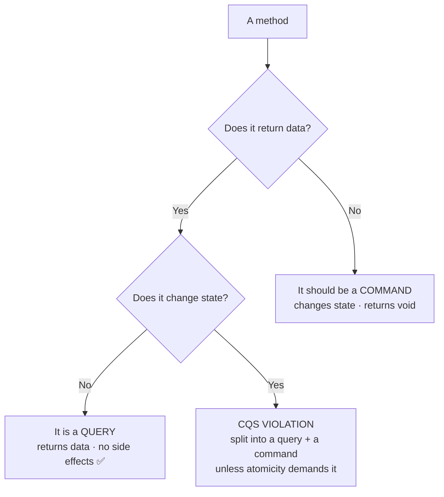

# Command Query Separation — Junior

> **Category:** [Design Principles](../../README.md) — every method should either *do* something or *answer* something, but never both.

---

## Table of Contents

1. [Introduction](#introduction)
2. [Prerequisites](#prerequisites)
3. [Glossary](#glossary)
4. [The Principle in One Sentence](#the-principle-in-one-sentence)
5. [Commands vs. Queries](#commands-vs-queries)
6. [Why It Matters: Asking a Question Shouldn't Change the Answer](#why-it-matters-asking-a-question-shouldnt-change-the-answer)
7. [Real-World Analogies](#real-world-analogies)
8. [Mental Models](#mental-models)
9. [A Worked Example: Splitting a Method That Does Both](#a-worked-example-splitting-a-method-that-does-both)
10. [Code Examples](#code-examples)
11. [Spotting Violations](#spotting-violations)
12. [The Famous Accepted Exception: `pop()`](#the-famous-accepted-exception-pop)
13. [Best Practices](#best-practices)
14. [Common Mistakes](#common-mistakes)
15. [Tricky Points](#tricky-points)
16. [Test Yourself](#test-yourself)
17. [Cheat Sheet](#cheat-sheet)
18. [Summary](#summary)
19. [Further Reading](#further-reading)
20. [Related Topics](#related-topics)
21. [Diagrams](#diagrams)

---

## Introduction

> Focus: **What is it?** and **How to use it?**

**Command Query Separation (CQS)** is a rule about how you design the methods on an object. It was named by **Bertrand Meyer** in *Object-Oriented Software Construction* (the book where the Eiffel language and "Design by Contract" come from). The rule is short enough to memorize:

> **Every method should be either a *command* that performs an action — and changes state — or a *query* that returns data — and causes no observable side effects. A method should never be both.**

Meyer summarized the spirit of it in a sentence worth carving above your desk:

> **"Asking a question should not change the answer."**

That's the whole idea. A **query** is a method you call to *find something out*: `account.balance()`, `list.size()`, `user.isActive()`. It hands you a value and leaves the world exactly as it found it. A **command** is a method you call to *make something happen*: `account.deposit(100)`, `list.clear()`, `user.deactivate()`. It changes the state of the object and, by convention, returns nothing.

The trouble starts when a single method tries to do both at once — change state *and* report a value. That method is harder to reason about, harder to test, and full of nasty surprises, because every time you *ask* it something you also *change* something.

### Why this matters

If you keep commands and queries separate, you gain a superpower: **you can call any query as many times as you like, in any order, anywhere — in a log line, a debugger watch, an assertion, a loop condition — and know for certain you haven't changed anything.** You stop fearing your own getters. Code becomes predictable, and predictable code is code you can reason about.

---

## Prerequisites

- **Required:** Comfort with methods/functions, objects, and the difference between *returning a value* and *mutating state*.
- **Required:** A basic feel for **side effects** — anything a method does besides return a value (writing a field, printing, sending a network call, updating a database).
- **Helpful:** Familiarity with **[encapsulation](../01-encapsulate-what-changes/junior.md)** — CQS is a sibling principle about what a method's *contract* should be.
- **Helpful:** Having written a unit test, so you appreciate why a side-effect-free query is easy to test.

---

## Glossary

| Term | Definition |
|------|-----------|
| **Command** | A method that performs an action and changes observable state. Conventionally returns `void`/nothing. |
| **Query** | A method that returns data and causes **no observable side effects** — it only reads. |
| **Side effect** | Anything a method does besides compute and return its value: mutating a field, writing to a DB, printing, sending a message. |
| **Observable side effect** | A side effect a caller can detect — a changed result on the next call, a new row in a table, a sent email. (Caching *behind the scenes* is **not** observable.) |
| **Idempotent (in effect)** | Calling it again produces no *additional* observable change. A pure query is trivially this way. |
| **Referential transparency** | A call can be replaced by its result value without changing program behavior — true of side-effect-free queries. |
| **Mutator** | Another word for a command — it mutates state. |
| **Accessor / getter** | Another word for a query — it accesses (reads) state. |

---

## The Principle in One Sentence

> **A method does something, or it answers something — never both.**

Put differently: after you call a method, you should be able to say *either* "the world changed and I got nothing back" (command) *or* "I got an answer and the world is unchanged" (query). If you can't cleanly say one or the other, the method is violating CQS.

---

## Commands vs. Queries

| Aspect | **Command** | **Query** |
|---|---|---|
| Purpose | *Do* something | *Answer* something |
| Changes state? | **Yes** (that's the point) | **No** |
| Returns a value? | No (conventionally `void`) | **Yes** (that's the point) |
| Safe to call repeatedly? | No — each call may change things | **Yes** — no observable effect |
| Safe to skip? | No — skipping changes behavior | **Yes** — removing it changes nothing observable |
| Examples | `deposit()`, `save()`, `clear()`, `deactivate()` | `balance()`, `size()`, `isActive()`, `findById()` |
| Verb feel | An imperative: "Do this!" | A question: "What is…?" |

A quick test by name: if the method name is an **imperative verb** (`add`, `remove`, `update`, `send`), it's probably a command and should return nothing. If it's a **question or a noun** (`isReady`, `count`, `total`, `getName`), it's a query and must not change anything.

---

## Why It Matters: Asking a Question Shouldn't Change the Answer

Imagine a getter that secretly mutates. You write a debug log:

```python
logger.debug(f"current value is {counter.value()}")
```

If `value()` is a clean **query**, this log is harmless — you can add it, remove it, or call it ten times, and the program behaves identically. But if `value()` *also increments the counter*, then merely *logging* the value changes the program. Now:

- **Debugging changes behavior.** Adding a log line makes the bug move or vanish. ("It only fails when I'm *not* watching it.")
- **Asserts change behavior.** `assert counter.value() == 5` in a test silently bumps the counter, so the next assertion is wrong — and removing the assert "fixes" it.
- **You can't reorder or repeat freely.** `a = q(); b = q();` may give `a != b` for reasons that have nothing to do with the data you care about.
- **Caching breaks.** You'd love to remember the answer to avoid recomputing — but you can't, because each call has a different effect.

Clean queries give you **four freedoms** beginners learn to love:

1. **Repeat** them safely (call as often as you want).
2. **Reorder** them (the order of two queries doesn't matter).
3. **Cache / memoize** them (remember the answer).
4. **Remove** them when unused (deleting a query call changes nothing observable).

Commands give you none of those freedoms — and *that's fine*, because a command's job is precisely to change the world. The principle just says: **keep the two jobs in separate methods so you always know which freedoms you have.**

---

## Real-World Analogies

| Concept | Analogy |
|---|---|
| **Query** | Checking a clock. You read the time; the clock keeps ticking on its own, but your *looking* didn't change it. You can look as often as you like. |
| **Command** | Setting the clock. You change the time. Calling it twice sets it twice. |
| **A method that does both** | A thermometer that *raises* the temperature a little every time you read it. Now you can't measure the room without disturbing it — and you can never trust the number. |
| **"Asking shouldn't change the answer"** | A scale at the doctor's office. Stepping on it to *read* your weight shouldn't *add* a kilogram each time. |
| **The four freedoms of queries** | A reference book: you can re-read a page, read pages out of order, photocopy it, or never open it — none of that edits the book. |

---

## Mental Models

**The intuition:** *"A method is either a hand that moves something, or an eye that looks at something — not a hand pretending to be an eye."*

```
        ┌──────────────────────────────────────────┐
        │  COMMAND                                   │
        │  ───────                                   │
        │  changes state · returns nothing           │
        │  "Do it."     (deposit, save, clear)       │
        ├──────────────────────────────────────────┤
        │  QUERY                                     │
        │  ─────                                      │
        │  returns data · changes nothing            │
        │  "What is it?"  (balance, size, isActive)  │
        └──────────────────────────────────────────┘
   A method lives in ONE box. Never straddling both.
```

A second model: think of the **light switch vs. the window**. A switch is a command — flip it and the room changes. A window is a query — look through it as often as you like; looking doesn't change the weather. CQS says: don't build a "window that changes the weather when you look."

---

## A Worked Example: Splitting a Method That Does Both

A shopping cart with a method that **both** removes the next item **and** returns it — a classic CQS violation.

### Start: one method doing two jobs

```python
class Cart:
    def __init__(self):
        self._items = []

    def add(self, item):
        self._items.append(item)

    def take_next(self):          # ❌ COMMAND + QUERY in one method
        item = self._items.pop(0) # mutates: removes the item
        return item               # AND returns it
```

`take_next()` mutates the cart *and* returns a value. Watch the trouble it causes:

```python
# You want to peek at what's next — but you can't, without removing it:
print(f"Next up: {cart.take_next()}")   # oops, you just removed it from the cart!
```

Logging "what's next" *deleted* the item. Asking the question changed the answer.

### The CQS split: a query to look, a command to act

```python
class Cart:
    def __init__(self):
        self._items = []

    def add(self, item):          # COMMAND: changes state, returns nothing
        self._items.append(item)

    def next_item(self):          # QUERY: returns data, changes nothing
        return self._items[0]

    def remove_next(self):        # COMMAND: changes state, returns nothing
        del self._items[0]
```

Now the two jobs are separate, and the caller decides:

```python
print(f"Next up: {cart.next_item()}")   # safe — only looks
# ...later, when you actually want to consume it:
item = cart.next_item()
cart.remove_next()
```

You can now *peek* without consuming, log freely, and the cart only changes when you explicitly tell it to with a command. That clarity is the entire payoff of CQS.

> Note: there's a famous, *deliberate* exception — `Stack.pop()` returns **and** removes on purpose, for good reasons covered [below](#the-famous-accepted-exception-pop). CQS is a strong default with conscious exceptions, not an absolute law.

---

## Code Examples

### Java — a "getter" that secretly mutates (violation → fix)

```java
// ❌ VIOLATION: looks like a query, but lazily mutates on read
class Session {
    private Instant lastAccess;
    public Instant getLastAccess() {
        this.lastAccess = Instant.now();   // side effect hidden in a getter!
        return this.lastAccess;
    }
}
// Calling getLastAccess() to LOG it changes the session's state.
```

```java
// ✅ FIX: a pure query to read, a separate command to update
class Session {
    private Instant lastAccess;
    public Instant lastAccess() {       // QUERY: no side effects
        return this.lastAccess;
    }
    public void touch() {               // COMMAND: updates, returns void
        this.lastAccess = Instant.now();
    }
}
```

### Python — `get_and_increment` split into a query and a command

```python
# ❌ VIOLATION: returns the value AND changes it
class Counter:
    def __init__(self): self._n = 0
    def get_and_increment(self):
        n = self._n
        self._n += 1
        return n            # query + command in one

# ✅ FIX
class Counter:
    def __init__(self): self._n = 0
    def value(self):        # QUERY
        return self._n
    def increment(self):    # COMMAND (returns nothing)
        self._n += 1
```

### TypeScript — command returns nothing; query returns data

```typescript
class TodoList {
  private items: string[] = [];

  add(item: string): void {        // COMMAND: void return is the signal
    this.items.push(item);
  }

  count(): number {                // QUERY: returns data, mutates nothing
    return this.items.length;
  }

  // ❌ would violate CQS:
  // addAndCount(item: string): number { this.items.push(item); return this.items.length; }
}
```

Notice how the **return type tells the story**: a command returns `void`, a query returns data. When you see a non-`void` method that *also* mutates, your CQS alarm should go off.

---

## Spotting Violations

You can often catch a CQS violation just by reading a method's signature and name:

| Smell | Why it's a violation |
|---|---|
| A method named `getX()` that writes a field, logs, or calls the network | A query with hidden side effects — asking changes the answer. |
| `getAndIncrement()`, `popAndReturn()`, `fetchAndDelete()` | The name literally says "do two things." |
| `iterator.next()` | Returns the next element *and* advances the cursor (state change) — a built-in violation. |
| A command (`save()`, `add()`) that returns the thing it just changed *because* you might want it | Mixing — though returning a *status/id* is a softer, debated case (see [Middle](middle.md)). |
| An HTTP `GET` endpoint that records, charges, or mutates data | Breaks CQS at the API level — and breaks REST/caching too (see [Middle](middle.md)). |

**Rule of thumb for a beginner:** if a method returns a value, ask *"does calling this twice in a row change anything?"* If yes, you've probably got a hidden command inside a query.

---

## The Famous Accepted Exception: `pop()`

The single most important nuance to learn early: **CQS is a guideline, not an iron law, and the canonical accepted violation is `Stack.pop()`.**

```python
item = stack.pop()   # removes the top element (COMMAND) AND returns it (QUERY)
```

`pop()` both mutates the stack *and* returns the removed element — a textbook CQS violation. Yet every standard library has it, and nobody objects. Why?

- **It's atomic and safe.** "Remove the top and tell me what it was" is a single, indivisible operation. Splitting it into `top()` (query) then `remove_top()` (command) opens a gap: in a multi-threaded program, another thread could change the stack *between* the two calls, so the value you read isn't the one you removed.
- **The combined version is clearer for this idiom.** Consuming a stack/queue element is naturally one step, and `pop()` reads better than two calls.

Meyer himself acknowledged such pragmatic exceptions. The lesson for you now is **the shape of the rule**: follow CQS by default; break it only *consciously*, when combining the two is genuinely safer or clearer (usually for atomicity). We'll make this precise — `pop`, `compareAndSet`, `queue.poll` — at the [Middle](middle.md) and [Senior](senior.md) levels.

---

## Best Practices

1. **Let the return type signal intent.** Commands return `void`/nothing; queries return data. When a method does both, that's your cue to split it.
2. **Name by job.** Imperative verbs for commands (`add`, `save`, `clear`); questions or nouns for queries (`isReady`, `count`, `balance`).
3. **Keep queries pure.** No DB writes, no logging that matters, no field mutation, no network calls with effects — a query just reads.
4. **Split "do-and-tell" methods** like `getAndX`, `popAndReturn` into a query and a command — *unless* you have a deliberate atomicity reason (then document it).
5. **Treat a getter that mutates as a bug**, even if "it works." It will surprise the next person who logs it.
6. **Call queries freely** in logs, asserts, and debuggers — that's exactly the freedom CQS buys you. If you *can't*, find out why.

---

## Common Mistakes

1. **Thinking CQS forbids all side effects.** It doesn't — *commands exist to have side effects.* CQS only says don't put them in the *same* method as a return value.
2. **Hiding a mutation in a getter** ("lazy init that also logs," "getNext that advances"). The classic trap.
3. **Treating CQS as an absolute law.** `pop()` and friends are accepted exceptions for atomicity. The skill is knowing *when* to break it (see [Middle](middle.md)).
4. **Confusing CQS with CQRS.** They sound alike and are related, but CQS is a *method-level* rule on one object; **CQRS** is a *system architecture* pattern. Don't mix them up (full distinction at [Middle](middle.md)).
5. **Returning data from a command "just in case."** If nobody needs it, a command should return nothing — adding a return value invites it to become a query-in-disguise.

---

## Tricky Points

- **"No side effects" really means "no *observable* side effects."** A query may cache its result internally (memoization) or update a hit counter for metrics — that's fine, because the *caller can't observe a difference*. Asking the question still gives the same answer. (More at [Middle](middle.md).)
- **A command *can* throw an exception.** Failing isn't "returning data"; CQS is about the normal-path contract.
- **Returning `this` from a builder is not a violation in spirit.** `builder.add(x).add(y)` returns `this` for chaining, but it isn't answering a *question about domain state* — it's the same object back. (Discussed at [Middle](middle.md).)
- **`pop()` is a violation that everyone accepts.** Memorize it as *the* example of a conscious, justified exception — atomicity beats the rule here.

---

## Test Yourself

1. State Command Query Separation in one sentence, and give Meyer's one-line summary of its spirit.
2. What does a command return? What does a query return? Why?
3. Name the four "freedoms" you get from a pure query.
4. Why is a getter that secretly mutates so dangerous for debugging and testing?
5. Why is `Stack.pop()` an *accepted* violation of CQS?
6. Is `iterator.next()` a command, a query, or both? Explain.

---

## Cheat Sheet

```text
COMMAND QUERY SEPARATION (Bertrand Meyer)
  "Asking a question should not change the answer."

  COMMAND   does something    changes state    returns NOTHING (void)
  QUERY     answers something changes NOTHING   returns DATA

  A method lives in exactly ONE box — never both.

QUERIES GIVE YOU FOUR FREEDOMS
  repeat · reorder · cache/memoize · remove   (commands give none — that's fine)

SPOT A VIOLATION
  return type is non-void AND the method mutates?  → probably a split is needed
  getAndIncrement / popAndReturn / a getter that writes/logs/calls network

ACCEPTED EXCEPTION (memorize)
  Stack.pop() returns AND removes — atomicity makes the combined op safer.
  Break CQS only CONSCIOUSLY (usually for thread-safe atomic operations).

DON'T CONFUSE
  CQS  = method-level rule on ONE object       (this topic)
  CQRS = system architecture (separate read/write models)  (different scope)
```

---

## Summary

- **CQS** (Bertrand Meyer): every method is either a **command** (does something, changes state, returns nothing) or a **query** (answers something, returns data, changes nothing) — **never both**.
- The spirit: **"Asking a question should not change the answer."**
- Pure queries give you four freedoms — **repeat, reorder, cache, remove** — which make code predictable, testable, and safe to log/assert against.
- A getter that secretly mutates is the classic bug: observing the program changes it.
- CQS is a **strong default with conscious exceptions**: `Stack.pop()` returns *and* removes for **atomicity**, and that's fine when done deliberately.
- Don't confuse **CQS** (one object's methods) with **CQRS** (a system-level architecture) — same idea, very different scope.

---

## Further Reading

- Bertrand Meyer, *Object-Oriented Software Construction* — the origin of CQS and "asking a question should not change the answer."
- Martin Fowler, [CommandQuerySeparation](https://martinfowler.com/bliki/CommandQuerySeparation.html) — concise canonical restatement, including the `pop()` exception.
- The sibling principle: [Encapsulate What Changes](../01-encapsulate-what-changes/junior.md).
- [Law of Demeter / Tell-Don't-Ask](../../02-coupling-and-cohesion/04-law-of-demeter/junior.md) — a related, sometimes-tense principle.

---

## Related Topics

- **Sibling principle:** [Encapsulate What Changes](../01-encapsulate-what-changes/junior.md).
- **Related principles:** [Tell-Don't-Ask / Law of Demeter](../../02-coupling-and-cohesion/04-law-of-demeter/junior.md), [Single Responsibility](../../04-solid/01-srp-single-responsibility/junior.md).
- **Builds toward:** CQRS (a system-level architecture inspired by CQS — covered conceptually at [Middle](middle.md)).

---

## Diagrams




---

## Check your understanding

1. Explain Command Query Separation — Junior Level in your own words and name the problem it solves.
2. How would you apply the ideas around Table of Contents, Introduction, Prerequisites in a realistic engineering change?
3. What failure mode or misuse should you look for, and what evidence would reveal it?
4. What small example would prove that you can apply Command Query Separation — Junior Level correctly?
5. What observable result would convince you that the approach improved the system?
