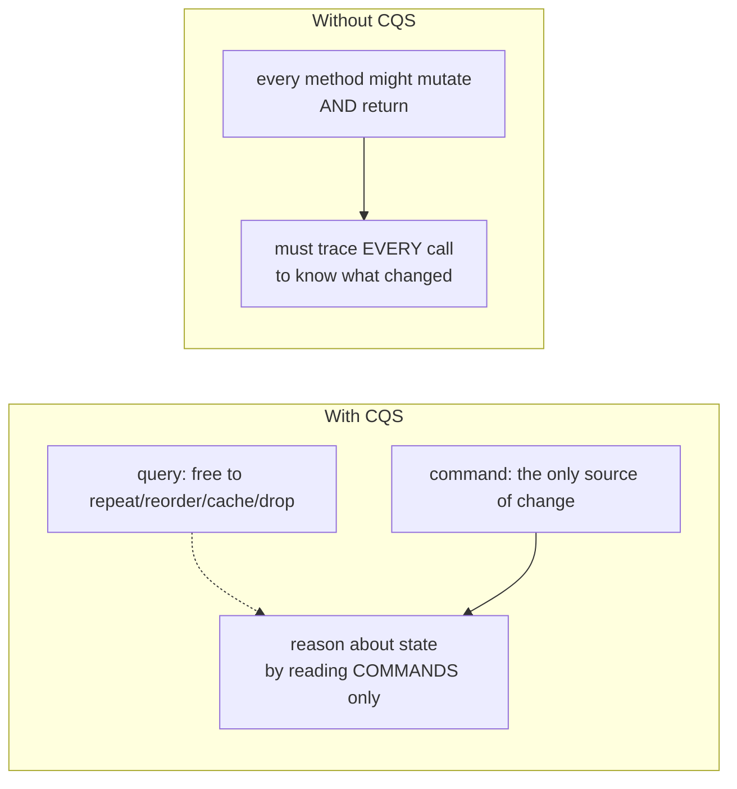
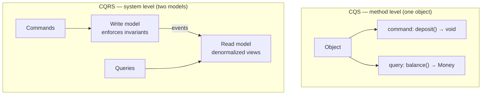
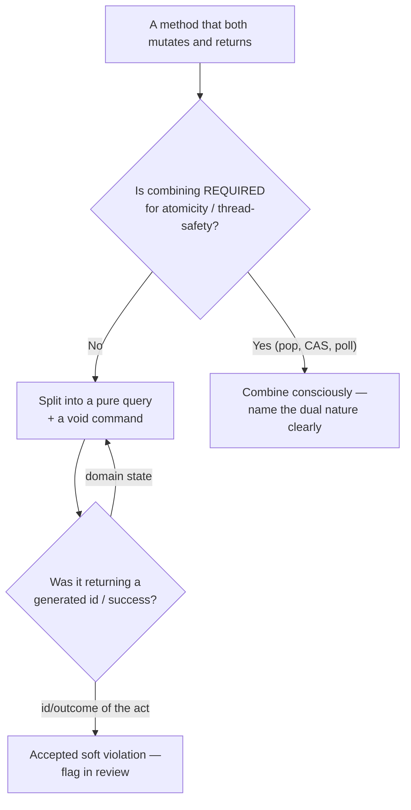
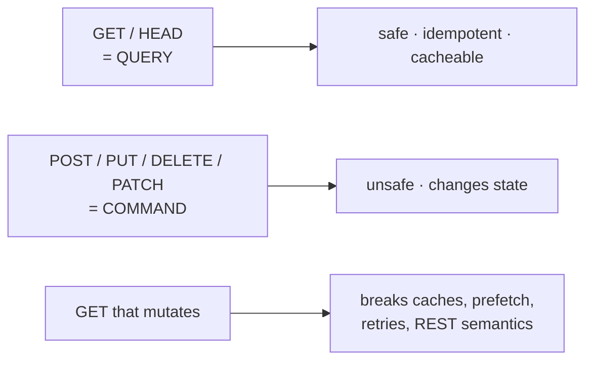

# Command Query Separation — Middle

> **Category:** [Design Principles](../../README.md) — every method should either *do* something or *answer* something, but never both.

> **Prerequisite:** [Junior](junior.md)
> **Focus:** **Why** and **When**

---

## Table of Contents

1. [Introduction](#introduction)
2. [Observable vs. Non-Observable Side Effects](#observable-vs-non-observable-side-effects)
3. [Why CQS Makes Code Easier to Reason About](#why-cqs-makes-code-easier-to-reason-about)
4. [The Conscious Exceptions: When to Combine Command and Query](#the-conscious-exceptions-when-to-combine-command-and-query)
5. [CQS vs. CQRS — Clearing Up the Confusion](#cqs-vs-cqrs--clearing-up-the-confusion)
6. [CQS and HTTP: Safe Methods, Idempotency, and Caching](#cqs-and-http-safe-methods-idempotency-and-caching)
7. [CQS and Tell-Don't-Ask: A Real Tension](#cqs-and-tell-dont-ask-a-real-tension)
8. [The Debated Cases](#the-debated-cases)
9. [Trade-offs](#trade-offs)
10. [Edge Cases](#edge-cases)
11. [Tricky Points](#tricky-points)
12. [Best Practices](#best-practices)
13. [Test Yourself](#test-yourself)
14. [Summary](#summary)
15. [Diagrams](#diagrams)

---

## Introduction

> Focus: **Why** and **When**

At the junior level, CQS is a rule you apply: split the method that does both. At the middle level it becomes a set of *judgement calls*. The rule has a precise boundary ("no **observable** side effects," not "no side effects"), a set of **deliberate exceptions** (atomic operations like `pop` and `compareAndSet`), and a famous near-namesake it's constantly confused with (**CQRS**). Getting CQS right in real code means knowing:

- **What counts as a side effect** the principle cares about (observable ones) versus what's fine (memoization, metrics, lazy caching).
- **When to break the rule on purpose** — and why those exceptions exist (thread-safety / atomicity).
- **How CQS relates to neighboring ideas:** HTTP method semantics, Tell-Don't-Ask, immutability, and the architecture pattern CQRS.

The recurring theme: CQS is a **strong default that buys you predictability**, and the middle skill is knowing exactly when paying a small price (a deliberate combined operation) buys you something more valuable (atomicity).

---

## Observable vs. Non-Observable Side Effects

The most common over-reading of CQS is "a query must be *pure* — it cannot touch anything." That's too strict. Meyer's rule, stated carefully, is about **observable** side effects:

> A query must have **no side effects the caller can observe.** Two calls with the same inputs return the same answer, and calling it (or not) is invisible to the rest of the program.

So these are **fine inside a query**, even though they technically "do something":

| Hidden activity inside a query | Why it's allowed |
|---|---|
| **Memoization / caching the result** | The *answer* is identical with or without the cache. The cache is invisible to the caller. |
| **Lazy initialization of a computed value** | The first call computes and stores; every call returns the same value. No observable change. |
| **Incrementing a metrics/hit counter** | The counter is internal bookkeeping; it doesn't change the query's answer or any domain state the caller reads. |
| **Writing a debug log** | A diagnostic, not a state change the program logic depends on. (Be careful — *meaningful* logging can become observable.) |

And these are **not** allowed in a query, because they're observable:

```python
def balance(self):              # ❌ NOT a query
    self._read_count += 1       # OK by itself (metrics)...
    self._apply_pending_fees()  # ...but THIS changes the balance the caller reads!
    return self._balance        # next call returns a DIFFERENT answer
```

The litmus test:

> **Would a caller — or a test — get a different result, or see a different world, because this query ran?** If yes, the side effect is observable and it's a violation. If no, it's invisible bookkeeping and CQS is satisfied.

This distinction is why "referential transparency" is the deeper idea behind a query: a side-effect-free query can be replaced by its cached result anywhere, because *observably* it's a pure value.

---

## Why CQS Makes Code Easier to Reason About

CQS pays off because it lets you treat queries and commands with completely different mental rules:

**For queries, you get four guarantees** (the "freedoms" from junior, now with their formal names):

1. **Idempotent in effect** — calling it again adds no observable change.
2. **Reorderable** — two queries can run in either order; results don't depend on sequence.
3. **Cacheable** — the answer can be memoized, since it's stable.
4. **Eliminable** — an unused query call can be deleted with no behavioral change (dead-code elimination is safe).

These are exactly the properties a compiler, a caching layer, or *your own brain* relies on to optimize and reason. When queries are pure, you can read a block of code and ignore every query call's effect — there is none. You only have to track what the **commands** do. That collapses the state-space you hold in your head.

**For commands, you accept the opposite** — order matters, repetition matters, they can't be cached — but you *gain* a clean place to concentrate all the mutation. Every state change is in a method that announces itself by returning `void`. When you're hunting a "why did this value change?" bug, you search the commands, not the queries.



This is the core "why": **CQS shrinks the set of methods that can change state, so you can reason about change by looking in fewer places.**

---

## The Conscious Exceptions: When to Combine Command and Query

CQS is a guideline, and the exceptions are not failures — they're *engineering decisions*. The dominant reason to combine a command and a query into one method is **atomicity**: when splitting them would create a race condition or a check-then-act gap.

### Why splitting can be unsafe: the check-then-act gap

```java
// Pure-CQS version — but UNSAFE under concurrency
if (!stack.isEmpty()) {        // QUERY
    Item x = stack.top();      // QUERY
    stack.removeTop();         // COMMAND
    process(x);
}
```

Between `isEmpty()`/`top()` and `removeTop()`, another thread can pop the same element. Now two threads process the same item, or one operates on an empty stack. The three separate CQS-clean calls have a **race window** between them.

### The fix: a single atomic operation that returns *and* mutates

```java
Item x = stack.pop();          // atomic: remove-and-return as ONE operation
if (x != null) process(x);
```

`pop()` violates CQS on purpose, and that's *correct* here: the combined operation closes the race window. The whole point of these methods is that "decide what to remove" and "remove it" happen as one indivisible step.

The canonical atomic exceptions every engineer should recognize:

| Operation | Returns | Mutates | Why combined (the justification) |
|---|---|---|---|
| `Stack.pop()` | the removed element | removes it | "Remove the top and tell me what it was" must be atomic. |
| `Queue.poll()` | head element (or null) | removes it | Same — dequeue is naturally one step; splitting races. |
| `AtomicInteger.getAndIncrement()` | old value | increments | The *whole reason* it exists is to read-and-update atomically; splitting defeats its purpose. |
| `compareAndSet(expected, new)` | `boolean` success | sets if matched | The atomic compare-and-swap primitive — splitting it is *impossible* to do safely. |
| `Map.putIfAbsent(k, v)` | previous value | inserts if missing | Check-then-put as one atomic step. |
| `Iterator.next()` | next element | advances cursor | Advancing-and-returning is the natural single operation of iteration. |

> **The rule for breaking the rule:** combine command and query *only* when the combination buys **atomicity** (or, occasionally, when the two are so inseparable that splitting them is genuinely less clear). And when you do, make the combined nature obvious in the name (`pop`, `getAndIncrement`, `poll`) so callers aren't surprised.

What is **not** a good excuse: "it was convenient to return the value." Convenience-driven combining (a `save()` that returns the saved entity because the caller "might want it") is where CQS quietly erodes — see [The Debated Cases](#the-debated-cases).

---

## CQS vs. CQRS — Clearing Up the Confusion

This is the single most important distinction at this level, because the names are nearly identical and people routinely conflate them. **They are related in spirit but operate at completely different scopes.**

> **CQS** (Bertrand Meyer) is a **method-level principle** on a single object: a method either changes state *or* returns data.
>
> **CQRS** (Command Query Responsibility Segregation — Greg Young, building on Bertrand Meyer and popularized with Udi Dahan) is a **system/architecture pattern**: the *read model* and the *write model* are separated into different objects, services, or even different data stores.

CQRS was *inspired by* CQS — Greg Young took Meyer's "separate the asking from the doing" idea and pushed it up to the architecture level: instead of one model handling both reads and writes, you have a **command side** (handles state changes, enforces invariants) and a **query side** (optimized purely for reads, often a denormalized/precomputed view). Frequently the two sides have **separate data stores** kept in sync (often via events / event sourcing), so reads never touch the write model and can be scaled and shaped independently.

| | **CQS** | **CQRS** |
|---|---|---|
| **Scope** | A single method on one object | A whole system / bounded context |
| **What's separated** | Command *methods* from query *methods* | The entire read *model* from the write *model* |
| **Who** | Bertrand Meyer | Greg Young / Udi Dahan (inspired by Meyer's CQS) |
| **Granularity** | Method signatures | Objects, services, data stores |
| **Typical artifacts** | `void deposit()` vs. `Money balance()` | A command handler + a separate read database/view |
| **Data store** | One — same object's fields | Often **two** (write store + read store), synced via events |
| **When you reach for it** | Always — a default coding discipline | Selectively — high read/write asymmetry, complex read views, scaling reads |
| **Cost** | ~Free; it's just method design | High — eventual consistency, sync infrastructure, two models to maintain |



The crisp mental hook: **CQS separates *methods*; CQRS separates *models*.** You apply CQS everywhere by default at almost no cost. You apply CQRS *selectively*, as an architectural choice with real costs (eventual consistency, two models, sync machinery). CQRS lives in the system-design curriculum; here we only need to know it's a *different scope* so we don't confuse a method-level discipline with an architecture decision.

---

## CQS and HTTP: Safe Methods, Idempotency, and Caching

CQS isn't only an OO idea — the same separation is baked into **HTTP and REST**, and understanding it explains *why* certain web bugs happen.

HTTP classifies methods into **safe** (read-only — effectively *queries*) and **unsafe** (state-changing — *commands*):

| HTTP method | CQS role | Safe? | Idempotent? | Cacheable? |
|---|---|---|---|---|
| `GET`, `HEAD` | **Query** | Yes — should not change state | Yes | **Yes** |
| `PUT`, `DELETE` | **Command** (idempotent) | No | Yes | No |
| `POST` | **Command** (non-idempotent) | No | No | No |
| `PATCH` | **Command** | No | Not necessarily | No |

A **`GET` with side effects is a CQS violation at the API level**, and it breaks things that *depend* on `GET` being a pure query:

```
GET /articles/42/delete     ❌  a "query" that mutates — disaster waiting to happen
```

Why it's harmful, concretely:

- **Caches and proxies break it.** A CDN or browser may cache a `GET`, or *prefetch* it, or replay it — because the spec promises `GET` is safe. If your `GET` deletes or charges, a prefetcher can delete/charge without a user ever clicking. (Real outage class: a crawler or "link prefetch" following `GET /delete` links and wiping data.)
- **Idempotency guarantees evaporate.** Clients and proxies retry `GET`s freely on timeout, assuming no harm. A side-effecting `GET` gets executed multiple times.
- **It breaks REST semantics**, so every tool built on those semantics (caches, retries, prefetch, security scanners) reasons about your endpoint incorrectly.

The fix is the same as in OO: **use the right verb for the role.** Reads → `GET` (query). State changes → `POST`/`PUT`/`DELETE`/`PATCH` (command). HTTP's safe/unsafe split is essentially CQS scaled to the network, and **idempotency** is the HTTP-flavored version of a query's "safe to repeat" guarantee.

---

## CQS and Tell-Don't-Ask: A Real Tension

[Tell-Don't-Ask](../../02-coupling-and-cohesion/04-law-of-demeter/junior.md) says: *don't pull data out of an object to make a decision and act on it — instead, **tell** the object to do the work itself.* It pushes you toward **commands** (rich behavior methods) and away from chains of getters.

CQS and Tell-Don't-Ask **agree** most of the time — both dislike anemic getter-soup and both want clear responsibilities. But there's a genuine point of friction:

- **Tell-Don't-Ask** pushes: "Send a command; let the object do the work."
- **CQS** insists: "Fine — but that command still shouldn't *also* hand back a query result as part of doing the work."

The tension surfaces when a "tell" operation naturally *produces* information you want:

```java
// Tell-Don't-Ask nudges you toward a single rich method:
boolean ok = account.withdraw(amount);   // tells the account to act...
                                         // ...but ALSO returns a query result (did it succeed?)
```

Is `withdraw` returning a success boolean a CQS violation? Strictly, yes — it's a command that also answers a question. The pragmatic resolutions (debated, covered next):

1. **Throw on failure** — the command stays `void`; failure is an exception, not a return value. (`withdraw` throws `InsufficientFundsException`.) This keeps both principles happy.
2. **Query first, then tell** — `if (account.canWithdraw(amount)) account.withdraw(amount);` — pure CQS, but reintroduces a check-then-act gap (the same atomicity problem as `pop`).
3. **Accept the violation consciously** — return a result object, treating it like `pop`: an atomic "do-it-and-report-the-outcome."

> The honest synthesis: Tell-Don't-Ask and CQS pull in *slightly* different directions on "should a command report its outcome?" CQS's purist answer is "no — use exceptions or a separate query." The pragmatic answer is "a command may report *success/failure of the action itself*, but it should not double as a *query about domain state*." Returning "did this command succeed" is a softer violation than returning "and by the way here's the current balance."

---

## The Debated Cases

Not every combined method is as clearly justified as `pop`. These are the genuinely contested ones — know the arguments on both sides:

| Case | The CQS-violation view | The pragmatic-defense view |
|---|---|---|
| `save(entity)` **returns the saved entity (with generated id)** | A command shouldn't return data | The id is *generated by the act of saving* and is needed immediately; treat like `pop` (atomic do-and-report). Very common in ORMs/repositories. |
| `command()` **returns a success/error result** | A command shouldn't answer "did it work?" | Reporting the outcome of the *action itself* (not external state) is widely accepted; alternative is exceptions, which some teams avoid for control flow. |
| `list.add(x)` **returns `boolean`** (Java collections) | Returns whether the collection changed | Atomic "add-and-tell-if-it-changed"; useful for `Set`. A deliberate, documented standard-library choice. |
| **Fluent builder** `b.add(x).add(y)` returns `this` | Returns a value from a mutator | **Not a real violation** — it returns the *same object* for chaining, not a *query about domain state*. No question is being answered. |

The guiding distinction: **does the return value answer a question about domain state, or is it the direct, atomic result/acknowledgement of the action?** Returning *domain state* from a command is the real smell. Returning *an id the save just minted*, *whether the action succeeded*, or *`this` for chaining* are softer cases — defensible, but worth flagging in review.

---

## Trade-offs

| Decision | Strict CQS (split) | Combine command + query |
|---|---|---|
| Reasoning / predictability | High — queries are pure, change is localized | Lower — a method both mutates and returns |
| Thread-safety of "check-then-act" | **Risky** — race window between query and command | **Safe** — one atomic operation |
| Clarity for inherently-single operations (pop, poll) | Worse — two calls for one idea | Better — one call matches the concept |
| Testability | High — queries trivial to test, commands isolated | Lower — must test the combined effect |
| Cacheability of reads | High — queries memoizable | N/A — combined op isn't a pure query |
| API/network semantics (HTTP) | Aligns with safe/unsafe, caching, idempotency | Breaks caching/idempotency if a "GET" mutates |

The asymmetry: **strict CQS is the right default because predictability compounds**, but it has *one* genuine weakness — the check-then-act race — which is exactly where the atomic exceptions earn their keep. Choose strict CQS until concurrency (or an inherently atomic concept) forces a deliberate, well-named combined operation.

---

## Edge Cases

### 1. The query that *must* lazily compute

`getFullName()` that computes and caches `first + " " + last` on first call is fine — the cache is non-observable, the answer is stable. This is CQS-clean despite "writing a field," because no caller can observe a difference.

### 2. The command that legitimately needs to report failure

A `transfer()` that can fail (insufficient funds, account frozen) has to communicate that. CQS's preferred channel is an **exception**, keeping the command `void`. If your team avoids exceptions for expected failures, returning a result object is the accepted softening — but keep it to *outcome of the action*, not *current domain state*.

### 3. Generated identifiers on create

`repository.create(order)` returning the new id is the most common "accepted" violation in line-of-business code. It's atomic (the id exists only because of the create) and the caller needs it right away. Treat it like `pop`; just be consistent across the codebase.

### 4. A query that triggers an audit-log *write*

If "someone viewed this record" must be persisted, the *read* now has an observable side effect (a new audit row). This is a real CQS violation — and the usual resolution is to make the audit an explicit, separate concern (e.g., the caller issues a `recordAccess` command, or an aspect/middleware does it), keeping the domain query pure.

---

## Tricky Points

- **CQS is about *observable* effects, not *all* effects.** Memoization, lazy init, and metrics are fine; anything that changes the answer or visible state is not.
- **The exceptions exist for atomicity, not convenience.** `pop`/`compareAndSet`/`poll` combine because splitting them races. "I wanted the value back" is not the same justification.
- **CQS ≠ CQRS.** Method-level discipline vs. system-level architecture with (often) two data stores. Conflating them is the #1 vocabulary error here.
- **Returning `this` from a builder isn't a violation.** No domain question is answered; it's the same object for chaining.
- **A side-effecting `GET` breaks the web, not just style.** Caches/prefetchers/retries assume `GET` is a pure query — violate that and they mutate your data for you.
- **Exceptions keep commands `void`.** Preferring an exception over a returned status is how purists let commands report failure without becoming queries.

---

## Best Practices

1. **Default to splitting**; combine only for **atomicity** or a genuinely inseparable concept — and name the combined op so its dual nature is obvious (`pop`, `getAndIncrement`).
2. **Apply the observable-effect test:** *would a caller or test see a different result/world because this query ran?* If yes, it's not a query.
3. **Let queries cache/memoize freely** — that's allowed and often valuable; it doesn't break CQS.
4. **Map CQS onto HTTP:** reads are `GET` (safe, cacheable, idempotent); state changes are `POST`/`PUT`/`DELETE`/`PATCH`. Never mutate in a `GET`.
5. **Prefer exceptions over returned status** to keep commands `void` when reporting failure.
6. **Reconcile with Tell-Don't-Ask:** tell objects to act, but don't let those commands double as queries about domain state — use exceptions or a separate query.
7. **Don't reach for CQRS** when CQS will do. CQRS is an architecture with real costs; CQS is free method design.

---

## Test Yourself

1. Restate CQS precisely using the word "observable." Give two activities allowed inside a query and one that isn't.
2. Name three atomic operations that deliberately violate CQS, and the single reason all three do.
3. Explain the difference between CQS and CQRS in one sentence each, including scope.
4. Why does a `GET` request with side effects break caching and idempotency?
5. Where exactly do CQS and Tell-Don't-Ask conflict, and what are the two ways to resolve it?
6. Is a fluent builder returning `this` a CQS violation? Why or why not?

---

## Summary

- CQS forbids **observable** side effects in queries — memoization, lazy init, and metrics are fine; changing the answer or visible state is not.
- Queries earn four formal guarantees — **idempotent-in-effect, reorderable, cacheable, eliminable** — which let you reason about state by reading only the **commands**.
- The deliberate exceptions (`pop`, `poll`, `getAndIncrement`, `compareAndSet`, `putIfAbsent`, `next`) exist for **atomicity** — splitting them opens a check-then-act race. Combine only for that reason, and name the dual nature clearly.
- **CQS ≠ CQRS:** CQS separates *methods* on one object (free, default); **CQRS** separates the *read model from the write model* at the system level (an architecture with real costs — eventual consistency, two stores).
- HTTP encodes CQS: `GET`/`HEAD` are safe queries (cacheable, idempotent); `POST`/`PUT`/`DELETE`/`PATCH` are commands. A side-effecting `GET` breaks caching, prefetch, and retries.
- CQS and **Tell-Don't-Ask** mostly agree but tense on "should a command report its outcome?" — resolved with exceptions or a consciously-combined atomic operation.

---

## Diagrams

### The decision: split or consciously combine



### CQS scaled up to HTTP




---

## Check your understanding

1. Explain Command Query Separation — Middle Level in your own words and name the problem it solves.
2. How would you apply the ideas around Table of Contents, Introduction, Observable vs. Non-Observable Side Effects in a realistic engineering change?
3. What failure mode or misuse should you look for, and what evidence would reveal it?
4. Which local design trade-off would make you choose or reject Command Query Separation — Middle Level in an existing codebase?
5. What observable result would convince you that the approach improved the system?
