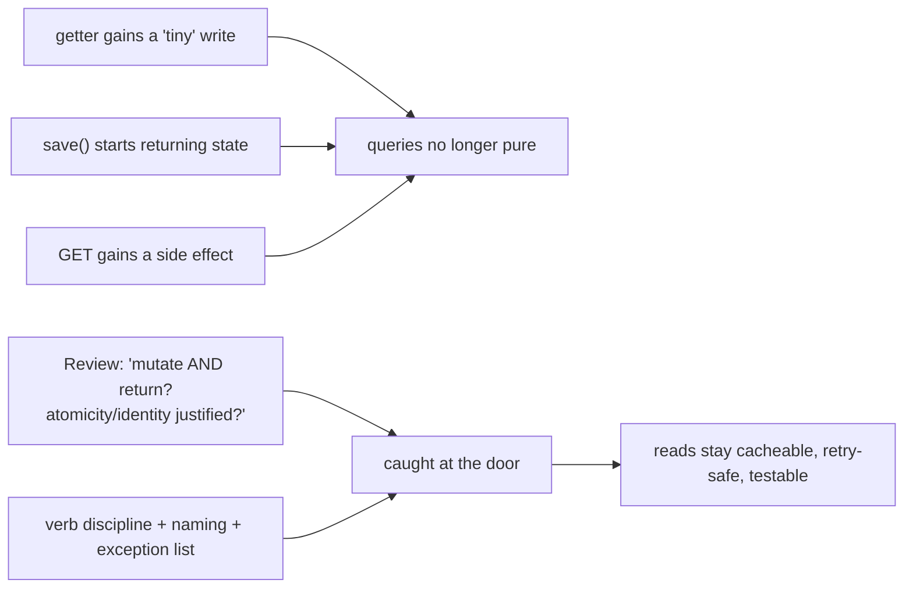
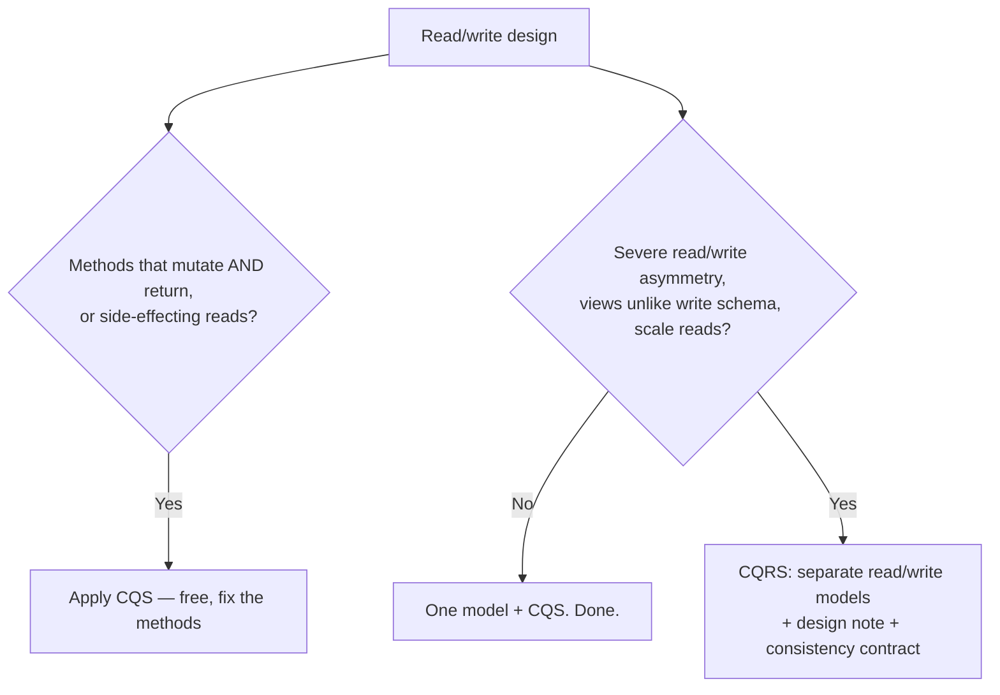

# Command Query Separation — Professional

> **Category:** [Design Principles](../../README.md) — every method should either *do* something or *answer* something, but never both.

> **Prerequisites:** [Junior](junior.md) · [Middle](middle.md) · [Senior](senior.md)
> **Focus:** **Production** — reviews, API contracts, team conventions, legacy systems

---

## Table of Contents

1. [Introduction](#introduction)
2. [Enforcing CQS in Code Review](#enforcing-cqs-in-code-review)
3. [CQS at the API Boundary](#cqs-at-the-api-boundary)
4. [Team Conventions for CQS](#team-conventions-for-cqs)
5. [Refactoring Toward CQS in Legacy Systems](#refactoring-toward-cqs-in-legacy-systems)
6. [Deciding CQS vs. CQRS in Production](#deciding-cqs-vs-cqrs-in-production)
7. [Real Incidents](#real-incidents)
8. [Review Checklist](#review-checklist)
9. [Cheat Sheet](#cheat-sheet)
10. [Diagrams](#diagrams)
11. [Related Topics](#related-topics)

---

## Introduction

> Focus: **production** — keeping CQS intact across a large, long-lived, multi-contributor codebase.

CQS is cheap to *state* and easy to *erode*. The erosion is gradual and always reasonable-looking: a getter gains a "tiny" lazy write, a `save` starts returning the entity "because the caller needs the id," a `GET` endpoint adds a "last viewed" timestamp update. No single change is wrong; the aggregate is a codebase where you can no longer trust a query, can't cache reads, and can't retry safely.

At the professional level the question is operational: **how do you keep commands and queries separate when hundreds of changes land per week, when an HTTP contract promises safety to caches and clients you don't control, and when half the codebase predates the convention?** The answer is the usual system: review standards that name the smells, API conventions that make the safe path the verb's job, team rules that codify the deliberate exceptions, and a disciplined way to claw CQS back into legacy code without breaking it.

---

## Enforcing CQS in Code Review

Most CQS violations enter one PR at a time, and they're easy to miss because they "work." A reviewer applying CQS reads each new or changed method and asks the central question:

> **"Does this method both change observable state *and* return domain data? If so, is the combination justified by atomicity or generated-identity — and is that justification stated?"**

### Review by category

1. **Getters that mutate.** Any method named `get*`/`is*`/`*count`/`*total` that writes a field, calls the network with effects, persists, or enqueues. The classic: lazy init that *also* logs-meaningfully, or "touch on read." Flag every one.
2. **Commands that return domain state.** A `void`-shaped operation (`update`, `apply`, `process`) that now returns the updated entity or related state. Ask: does the caller need the *outcome of the action*, or are they reaching for a *query*? If the latter, split it.
3. **`getAndX` / `xAndReturn` names.** The name admits two jobs. Accept only with an atomicity justification (and then the name should be a recognized idiom: `getAndIncrement`, `poll`, `pop`).
4. **Side-effecting `GET` endpoints.** A read route that mutates. This is both a CQS violation *and* a caching/idempotency bug — escalate it as a correctness issue, not style.

### Review comment templates

> "`getCurrentToken()` refreshes the token as a side effect — so logging it or calling it twice changes behavior. Let's split: a pure `currentToken()` query and an explicit `refreshToken()` command."

> "This `save()` now returns the updated `Order`. If the caller only needs the generated id, that's an accepted atomic exception — keep it but name it clearly. If they're using it to read *other* state, let's expose a query instead."

> "`GET /report/{id}` increments a view counter. Caches and prefetchers can replay GETs — this will over-count and can't be cached. Move the increment to an explicit `POST /report/{id}/views` or record it server-side as a separate command."

> "We're splitting `pop()` into `peek()` + `remove()` here — that reintroduces a race under concurrent access. Keep the atomic `pop()`; CQS yields to thread-safety."

The professional reframe: **push back on a query that mutates as hard as on a bug**, because a mutating query *is* a latent bug — it breaks the moment someone logs it, caches it, or retries it.

---

## CQS at the API Boundary

Internally, a CQS violation is a maintainability cost. **At a public API boundary, it's a correctness and security contract you owe to clients, caches, and proxies you don't control** — so the bar is higher.

### HTTP: the verb *is* the command/query declaration

| Verb | Role | Promise you're making to the whole internet |
|---|---|---|
| `GET`, `HEAD` | Query | **Safe** (no state change), **idempotent**, **cacheable** — proxies/CDNs/browsers may cache, prefetch, and replay it |
| `PUT`, `DELETE` | Command | Idempotent (retry-safe), not cacheable, not safe |
| `POST` | Command | Not idempotent — needs idempotency keys for safe retry |
| `PATCH` | Command | Not necessarily idempotent |

A side-effecting `GET` is a production hazard because **infrastructure you don't own acts on the promise**: link prefetchers, security crawlers, CDN edge caches, and client-side retry-on-timeout all assume `GET` is safe. The professional rules:

- **Reads are `GET`. State changes are never `GET`.** No exceptions for "it's just a counter."
- **Make commands idempotent where the protocol expects it** (`PUT`/`DELETE`), and supply **idempotency keys** for `POST` so a retried command doesn't double-charge. Idempotency is the network-scale version of a query's "safe to repeat" — but for commands you must *engineer* it.
- **Don't return mutated domain state from a command response and let clients treat it as authoritative read state** without understanding consistency. (This is where API CQS shades into the CQS-vs-CQRS consistency conversation.)

### Other boundaries

- **GraphQL** encodes CQS structurally: **queries** (reads) vs. **mutations** (writes) are separate root types. A "query" that mutates violates both GraphQL and CQS — and breaks query caching/normalization.
- **gRPC / RPC:** the convention is weaker, so it must be a *team* convention — name read RPCs as queries (`GetX`, `ListX`) and write RPCs as commands (`CreateX`, `UpdateX`, `DeleteX`), and keep `Get`/`List` side-effect-free.
- **Message/event systems:** commands (imperatives: `ChargeCard`) vs. events (facts: `CardCharged`) is the messaging expression of command/query thinking.

---

## Team Conventions for CQS

Codify these so the separation is the default, not a per-PR argument:

1. **Naming convention by role.** Queries are questions/nouns (`balance`, `isActive`, `findById`); commands are imperatives (`deposit`, `deactivate`, `save`). Enforced in review; ideally linted.
2. **Commands return `void` (or a narrow result type), never domain state.** A documented exception list: **generated identity** on create, and **atomic operations** (`pop`/`poll`/CAS-style). Anything else returning domain state from a mutator is a review block.
3. **Queries must be observably side-effect-free.** Memoization/lazy-init/metrics allowed; any write that changes a future answer or visible state is not. Make audit-on-read an explicit separate command.
4. **HTTP/GraphQL verb discipline is mandatory.** Reads → `GET`/`query`; writes → `POST`/`PUT`/`DELETE`/`PATCH`/`mutation`. A side-effecting read is a blocking defect, not a nit.
5. **Atomic exceptions must be named and documented.** When you combine for atomicity, the method name signals it and a comment states the TOCTOU reason.
6. **CQRS requires a design note.** Splitting read and write *models* (separate stores, eventual consistency) is an architecture decision with a written justification and a consistency contract — not a default "because we like CQS."

These conventions turn the senior reasoning into rules juniors follow by default and reviewers cite as policy rather than personal taste.

---

## Refactoring Toward CQS in Legacy Systems

Greenfield CQS is trivial. The real work is **introducing it into a system full of mutating getters and command methods that return domain state — under tests, without changing behavior.**

### The sequence

1. **Characterize first.** Before touching a method that both mutates and returns, write tests that pin its *current* behavior — including the side effect, because callers may *depend* on it. (See [Refactoring as a Discipline](../../../craftsmanship-disciplines/03-refactoring-as-a-discipline/junior.md) and *Working Effectively with Legacy Code*.)
2. **Find who relies on the side effect.** A mutating getter is dangerous to "fix" because some caller may be (accidentally or deliberately) relying on the mutation. Map the callers before splitting.
3. **Introduce the split alongside the old method.** Add the pure query and the explicit command; keep the combined method as a thin, deprecated wrapper that calls both, so callers migrate incrementally.
4. **Migrate callers, then remove the combined method.** Each caller chooses query, command, or both — making the previously-hidden mutation explicit at each site.
5. **Guard the new query's purity in CI** so it can't silently regain a side effect.

```text
1. Characterize: tests pin current behavior INCLUDING the side effect.
2. Map callers of the mutate-and-return method.
3. Add pure query + explicit command; keep old method as deprecated wrapper.
4. Migrate callers one by one (now the mutation is explicit at each call site).
5. Delete the combined method. Lint/test to prevent the query re-mutating.
```

### The trap: "fixing" a mutating getter that callers depend on

If `getNextId()` both returns *and* increments, some caller almost certainly relies on the increment. Naively making it a pure query *silently breaks* every caller that expected the side effect — the bug is now that nothing advances. **Always map and migrate callers; never just neuter the side effect.** Characterization tests catch this before production does.

### What *not* to do

- **Don't split atomic operations to "achieve CQS."** Turning `pop()` into `peek()`+`remove()` in concurrent code *introduces* a race. CQS yields to thread-safety.
- **Don't ship the split without migrating callers** — a half-migrated state where both the combined and split methods exist indefinitely is worse than either.
- **Don't conflate the cleanup with a CQRS rewrite.** Separating *methods* is a local refactor; separating *models* (CQRS) is an architecture project. Keep them separate pieces of work.

---

## Deciding CQS vs. CQRS in Production

A professional is the person in the room who stops a team from adopting **CQRS** when they only needed **CQS** — a common and expensive mistake.

| Signal | Reach for… |
|---|---|
| Methods that both mutate and return; mutating getters; side-effecting `GET`s | **CQS** — free, always-on, just fix the methods |
| Reads and writes share one model, but read load ≈ write load and views match the schema | **CQS only** — no CQRS needed |
| Severe read/write asymmetry (e.g., 100:1 reads), read views radically unlike the write schema, independent read/write scaling | **CQRS** — separate read/write models, justified |
| Need an audit/event log as the source of truth, temporal queries, replay | **CQRS + event sourcing** — and accept eventual consistency |

> The decision rule: **CQS is the default for every method; CQRS is a targeted architecture for a specific scaling/modeling problem.** Adopting CQRS imports eventual consistency, dual models, and sync infrastructure — pay that only when the read/write asymmetry genuinely demands it. "We already do CQS" is *not* a reason to do CQRS. (Architecture-level decision criteria live in System Design; the professional point here is to *not* let a free method-level discipline talk a team into an expensive distributed architecture.)

---

## Real Incidents

### Incident 1: The prefetcher that deleted the database

An internal admin tool exposed actions as links: `GET /records/{id}/delete`, `GET /records/{id}/archive`. It worked in testing. After an antivirus/browser **link-prefetcher** was rolled out to staff laptops, it began *prefetching* every link on the admin pages — silently issuing the `GET`s — and deleted/archived records nobody clicked. **Root cause:** state-changing operations behind `GET`, a CQS-at-the-API violation. **Fix:** moved all mutations to `POST`/`DELETE` with confirmation. **Lesson:** `GET` is a promise of safety to infrastructure you don't control; a side-effecting `GET` will eventually be fired by something automated.

### Incident 2: The mutating getter that made a bug vanish under logging

A `getSessionState()` lazily *refreshed* the session (extending its TTL) as a side effect. A flaky "sessions expire too early" bug was impossible to reproduce — because adding a debug log that called `getSessionState()` *refreshed* the session and hid the bug. Engineers spent days chasing a Heisenbug. **Root cause:** a query with an observable side effect (TTL extension) — observing the system changed it. **Fix:** split into a pure `sessionState()` query and an explicit `refreshSession()` command. The bug reproduced immediately and was fixed. **Lesson:** "asking changed the answer" — the exact failure CQS prevents.

### Incident 3: The CQRS that didn't need to exist

A team adopted full CQRS with separate read/write databases synced by events for an internal admin app with a few hundred users and roughly symmetric read/write load. The eventual consistency produced a stream of "I saved it but the list still shows the old value" support tickets; the projection/sync code became the top source of bugs and on-call pages. **Root cause:** promoting CQS to CQRS by analogy, with no read/write asymmetry to justify it. **Fix:** collapsed back to a single model (keeping CQS at the method level); the consistency tickets and most of the sync bugs disappeared. **Lesson:** CQS is free and always worth it; CQRS is an architecture you adopt for a *specific* scaling problem, not because it "sounds like CQS scaled up."

### Incident 4: Splitting an atomic op to satisfy a linter

A well-meaning cleanup replaced a concurrent queue's `poll()` (atomic dequeue) with `peek()` + `remove()` "to make each method a clean command or query." Under load, two worker threads occasionally `peek()`ed the same head element before either `remove()`d it, processing the same job twice (a TOCTOU race). **Fix:** reverted to the atomic `poll()`; added a comment documenting the deliberate CQS exception. **Lesson:** CQS yields to atomicity. Mechanically splitting atomic operations *creates* concurrency bugs — the exception exists for a reason.

---

## Review Checklist

```text
CQS REVIEW CHECKLIST
[ ] No getter/query mutates OBSERVABLE state (memoization/metrics OK)
[ ] Commands return void or a narrow result — NOT domain-state queries
[ ] Any mutate-and-return is justified: atomicity OR generated identity, and SAID SO
[ ] Atomic combined ops are NAMED as such (pop/poll/getAndX/CAS) + commented
[ ] HTTP: reads = GET/HEAD (safe, cacheable); writes = POST/PUT/DELETE/PATCH
[ ] No side-effecting GET (blocking defect — caching/prefetch/retry hazard)
[ ] POST commands have idempotency keys; PUT/DELETE are idempotent
[ ] GraphQL: reads in `query`, writes in `mutation` (no mutating queries)
[ ] Audit/log-on-read is an EXPLICIT command, not buried in a read path
[ ] CQRS (separate read/write MODELS) — only with a design note + consistency contract
[ ] Legacy: split is characterized, callers mapped & migrated, atomic ops left intact
```

---

## Cheat Sheet

```text
ENFORCE     central question: "does it change observable state AND return
            domain data? if so, is atomicity/identity the stated reason?"

QUERIES     observably side-effect-free. logging/caching that CHANGES the
            answer or visible state is a violation. audit-on-read → command.

COMMANDS    return void (or narrow result). exceptions: generated id on create,
            atomic ops (pop/poll/CAS). report failure via EXCEPTIONS, not state.

API         GET/HEAD = query (safe·idempotent·cacheable). never mutate in GET.
            writes = POST/PUT/DELETE/PATCH. POST needs idempotency keys.
            GraphQL query vs mutation. RPC: name Get/List vs Create/Update/Delete.

DON'T       split atomic ops to satisfy CQS (creates TOCTOU races).
            adopt CQRS because "we already do CQS" — CQRS needs read/write
            asymmetry; it costs eventual consistency + dual models + sync.

LEGACY      characterize → map callers (they may depend on the side effect!)
            → add query+command, keep old as deprecated wrapper → migrate → delete.
```

---

## Diagrams

### Where CQS erodes, and where it's defended



### CQS vs CQRS — the production decision



---

## Related Topics

- **Sibling principle:** [Encapsulate What Changes](../01-encapsulate-what-changes/professional.md)
- **Related principles:** [Single Responsibility (SRP)](../../04-solid/01-srp-single-responsibility/professional.md), [Tell-Don't-Ask / Law of Demeter](../../02-coupling-and-cohesion/04-law-of-demeter/professional.md)
- **Architecture (different scope):** CQRS / event sourcing — System Design
- **Tooling:** static analysis for `@CheckReturnValue`/side-effect annotations, GraphQL query/mutation separation, HTTP method linters.

---


---

## Check your understanding

1. Explain Command Query Separation — Professional Level in your own words and name the problem it solves.
2. How would you apply the ideas around Table of Contents, Introduction, Enforcing CQS in Code Review in a realistic engineering change?
3. What failure mode or misuse should you look for, and what evidence would reveal it?
4. How would you introduce and govern Command Query Separation — Professional Level across teams through reversible, measurable increments?
5. What observable result would convince you that the approach improved the system?
