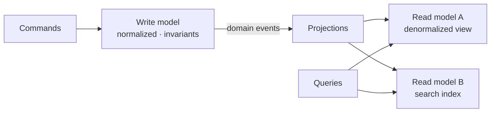
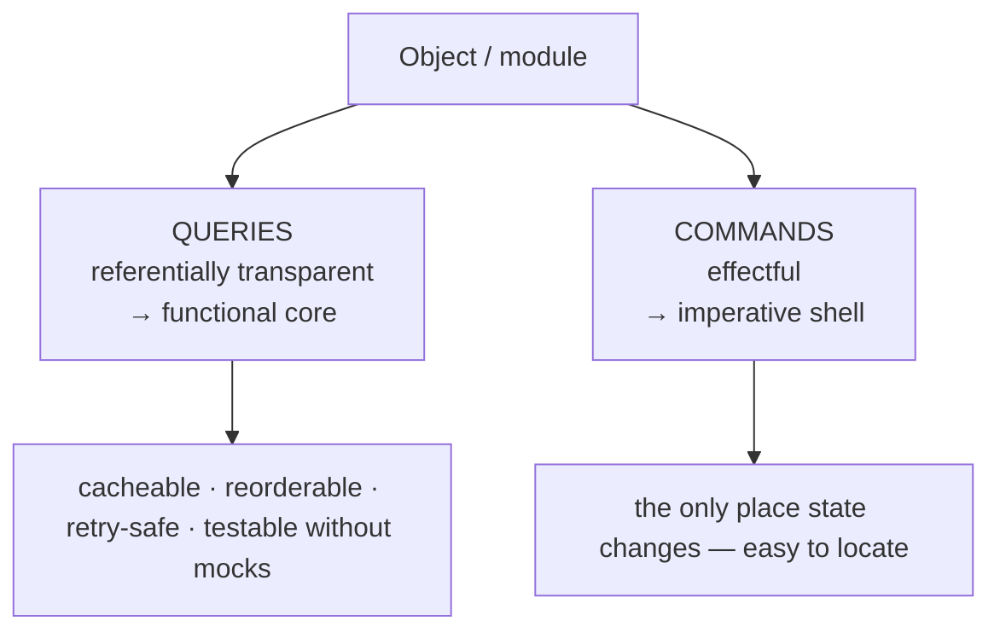
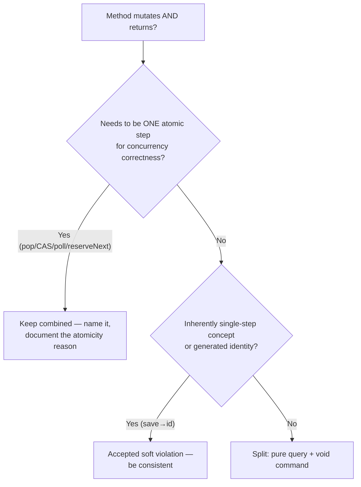

# Command Query Separation — Senior

> **Category:** [Design Principles](../../README.md) — every method should either *do* something or *answer* something, but never both.

> **Prerequisites:** [Junior](junior.md) · [Middle](middle.md)
> **Focus:** **Design trade-offs** and **system-level reasoning**

---

## Introduction

> Focus: **design trade-offs** and **system-level reasoning**

At the senior level CQS stops being "a tidiness rule for methods" and becomes a lens on a deeper property: **which parts of your system are *referentially transparent* and which parts *change the world*.** That distinction — pure reads versus effectful writes — is the same one that underlies functional programming's *functional core / imperative shell*, immutability, the safety of caching and retries, and ultimately the architectural pattern **CQRS**. CQS is the *method-scale* expression of an idea that recurs at every scale.

A senior must be able to answer three hard questions:

1. **Why is CQS valuable in theory** — what property does it actually protect, and what does that buy a caching layer, a test, or a compiler?
2. **When is strict CQS *wrong*** — where does insisting on the split create races, awkward APIs, or worse designs?
3. **Where does method-level CQS end and architectural CQRS begin** — and what are the real costs of crossing that line?

---

## CQS as a Theory of Referential Transparency

Strip CQS to its essence and it's a rule about **referential transparency**: a query, having no observable side effects, can be replaced by its result value anywhere in the program without changing behavior. `account.balance()` *is* the number it returns — you can substitute the value, cache it, hoist it out of a loop, or compute it lazily, and nothing downstream notices.

That single property is what makes the four "freedoms" rigorous rather than folklore:

- **Eliminable** = the query call is *dead code* if its result is unused — safe to delete (a compiler does this routinely with pure functions).
- **Reorderable / hoistable** = two pure queries commute; one can be moved out of a loop (common-subexpression elimination).
- **Cacheable** = memoization is *sound* precisely because the call has no observable effect to lose.
- **Idempotent-in-effect** = retrying is free, which is why **safe HTTP methods can be retried by proxies** and pure reads can be replayed after a failure.

Commands are the opposite: they are *not* referentially transparent — their value is the change they make, and that change does not commute, cache, or replay safely. CQS's entire contribution is to **draw a bright line between the referentially-transparent part of an object and the effectful part**, so every tool and every engineer knows which reasoning rules apply to which method.

> The senior reframing: **CQS is the object-oriented method-level encoding of "separate pure computation from effects."** It's the same instinct functional programmers formalize as purity — applied to OO methods instead of functions.

---

## The Functional Core, Imperative Shell

CQS connects directly to one of the most useful architectural patterns for testability: **functional core, imperative shell** (Gary Bernhardt). The idea generalizes CQS from a single object to a whole module:

- The **functional core** is all queries: pure functions/methods that compute results from inputs with no side effects. It holds the complex decision logic. It's trivially testable — feed inputs, assert outputs, no mocks.
- The **imperative shell** is all commands: a thin layer that performs the effects (DB writes, network calls, I/O) the core *decided* on.

CQS at the method level naturally aggregates into this shape: if every method is cleanly a query or a command, you can push the queries inward (the decision-making core) and the commands outward (the effectful shell). The payoff is the same one CQS gives, scaled up:

```python
# CORE (queries): pure decision — no side effects, no I/O. Easy to test.
def next_actions(account: Account, request: WithdrawRequest) -> list[Action]:
    if request.amount > account.balance:
        return [Reject("insufficient funds")]
    return [Debit(account.id, request.amount), Notify(account.owner)]

# SHELL (commands): performs the effects the core decided on.
def handle(account, request, db, mailer):
    for action in next_actions(account, request):   # call the pure query...
        action.perform(db, mailer)                  # ...then run the effects
```

The core (`next_actions`) is a giant **query**: all the branching logic, zero effects, testable without a database. The shell is all **commands**. This is CQS's reasoning advantage — *concentrate the change* — realized as an architecture. It's why senior engineers reach for CQS first: it's the local discipline that makes the global "pure core / effectful shell" structure emerge.

---

## CQS and Immutability

CQS and **immutability** are complementary attacks on the same problem — uncontrolled mutation — and they interact in an interesting way.

- On a **mutable** object, CQS keeps the *reads* (queries) clean while concentrating *writes* in clearly-marked commands. The queries are referentially transparent *as long as no command runs between them*.
- On an **immutable** object, the question partly dissolves: a "command" can't mutate in place, so it returns a *new* object instead — which looks like it "returns data." But that's not a CQS violation, because it doesn't mutate the receiver; it's a **transformation**, not a command-plus-query.

```java
// Mutable + CQS: command mutates, returns void; query reads.
money.add(other);              // COMMAND (void) — mutates `money`
BigDecimal v = money.amount(); // QUERY

// Immutable: there are no in-place commands; "changes" are transformations.
Money sum = money.plus(other); // returns a NEW Money — not a CQS violation:
                               // `money` is unchanged; nothing was mutated.
```

The reconciliation: **CQS governs methods that *mutate*. Immutable types have no mutating methods, so CQS's command/query split is mostly moot for them** — every method is effectively a (pure) query that returns a transformed value. This is why functional languages rarely *talk* about CQS: immutability gives you its benefits for free. In OO with mutable objects, CQS is the discipline that recovers those benefits. Seniors use this as a design dial: *the more you lean on immutability, the less CQS tension you have*; the more mutable your objects, the more rigorously CQS pays off.

---

## The Atomicity Exception, Rigorously

The junior/middle levels said "combine for atomicity." A senior must articulate *why* the split is unsafe and *what class of bug* the combined operation prevents — because this is the one place CQS is *wrong* to enforce.

The unsafe pattern is **check-then-act** (or read-then-modify): a query observes state, then a command acts on what was observed. Under concurrency, the observed state can change in the gap:

```java
// TOCTOU race: the value READ is not guaranteed to be the value REMOVED.
if (!queue.isEmpty()) {     //  T1 sees size 1
    // <-- T2 dequeues the last element here -->
    var x = queue.peek();   //  T1 reads... now stale or null
    queue.remove();         //  T1 removes... wrong element / underflow
}
```

This is a **time-of-check-to-time-of-use (TOCTOU)** bug — the same class as filesystem and security races. The atomic combined operation closes the window because the runtime guarantees the read and the write happen as one indivisible step:

```java
var x = queue.poll();       // atomic: observe-and-remove as ONE step. Never stale.
if (x != null) process(x);
```

`compareAndSet` is the purest example: it *is* the atomic check-then-act primitive — *impossible* to express as a CQS-clean query + command, because the entire value of CAS is that the compare and the set are inseparable:

```java
// The whole point: read-compare-write with NO gap. A CQS split cannot do this.
boolean won = ref.compareAndSet(expected, updated);   // returns success AND mutates
```

> The senior rule, precisely: **break CQS exactly when the operation must be a single atomic step to be correct under concurrency** — i.e., when a CQS-clean split would introduce a TOCTOU/check-then-act race. Outside concurrency (or when the structure is confined to one thread), prefer the split. And whenever you combine, encode the dual nature in the name (`pop`, `poll`, `getAndSet`, `compareAndSet`, `putIfAbsent`) so callers aren't ambushed.

This also explains why these methods cluster in *concurrent* data structures (`java.util.concurrent`, atomics): the exceptions are *born from* the very problem — concurrency — that strict CQS can't solve on its own.

---

## When Strict CQS Is the Wrong Call

CQS is a default, and seniors must recognize where the default produces *worse* designs:

- **Atomic operations** (above) — the dominant case. Forcing the split creates races.
- **Inherently single-step domain concepts.** "Reserve the next available seat and tell me which one" is *one* business operation; modeling it as `findNextFreeSeat()` (query) + `reserve(seat)` (command) both races *and* misrepresents the domain (the seat isn't chosen by the caller). A combined `reserveNextSeat() -> Seat` is clearer and correct.
- **Generated identity on creation.** `repo.save(order) -> id` — the id exists *only because* of the save; the caller needs it immediately; splitting is artificial. Pervasive in ORMs/repositories and rightly accepted.
- **Performance-critical paths where the split doubles work.** If computing the query result is expensive and the command must redo that computation, a combined operation that does it once can be a justified optimization (measure first).
- **Result-returning commands for control flow.** When a command's outcome (success/failure, conflict) is part of normal flow and exceptions would be misused-as-control-flow, returning a result object is defensible — *if* it reports the *action's outcome*, not unrelated domain state.

The senior discipline is the same as with every principle: **CQS is a heuristic, not a law.** Apply it everywhere by default; override it *consciously* in these bounded cases, and make the override legible (name, docs, a comment naming the atomicity/identity reason). An unexamined violation is a bug; an examined one is an engineering decision.

The anti-pattern to watch for is the reverse: **CQS zealotry** that mechanically splits atomic operations, producing race conditions in the name of purity. A `pop()` re-implemented as `top()` + `remove()` "to satisfy CQS" is not cleaner — it's *broken* under concurrency.

---

## CQS → CQRS: The Scaling Argument and Its Costs

CQRS is CQS's idea promoted to architecture, and a senior must know *both* the argument for it *and* the price — because the same teams that correctly love CQS often *incorrectly* reach for CQRS.

**The scaling argument.** Once you've separated commands from queries at the method level, a natural question arises at the system level: *why should reads and writes share the same model at all?* They have opposing pressures:

- **Writes** need a normalized model that enforces invariants, validates, and protects consistency.
- **Reads** want denormalized, precomputed, query-shaped views — often very different from the write schema, and usually far more numerous (read/write ratios of 100:1+ are common).

CQRS answers: give them **separate models**. The write side handles commands and owns the source of truth; the read side serves queries from one or more **read models** optimized per use-case, kept in sync — frequently asynchronously, via domain **events** (and often paired with **event sourcing**, where the write model is a log of events and read models are projections).



**The costs — why CQRS is *selective*, not default:**

| Cost | What it means |
|---|---|
| **Eventual consistency** | Read models lag the write model. "I saved it but don't see it yet" becomes a designed-for reality, not a bug. |
| **Two (or more) models to maintain** | Schemas, mappings, and projections must evolve together. More code, more failure modes. |
| **Sync infrastructure** | Event bus, projection rebuild, idempotent consumers, ordering, replay — real operational weight. |
| **Cognitive load** | Engineers must reason about command/event/projection flows, not one CRUD model. |

> The senior judgement: **CQS is free and always-on; CQRS is expensive and situational.** Reach for CQRS only when the read/write asymmetry is *severe* (very high read load, or read views radically different from the write model, or independent read/write scaling needs) — and never as a default just because it "sounds like CQS at scale." Most systems want CQS in every method and *no* CQRS. (Full treatment lives in system-design; here, the load-bearing point is that promoting a free method-level principle to an architecture incurs distributed-systems costs.)

---

## CQS, SRP, and Tell-Don't-Ask: Reconciling the Principles

A senior must hold several principles at once without letting them collide:

- **CQS and [SRP](../../04-solid/01-srp-single-responsibility/junior.md):** CQS is SRP at method granularity — "do one thing" specialized to "either change state *or* report it." A method that both mutates and answers has (at least) two responsibilities. CQS and SRP *agree*: the split that CQS demands is the same separation SRP would.
- **CQS and [Tell-Don't-Ask](../../02-coupling-and-cohesion/04-law-of-demeter/junior.md):** mostly aligned (both dislike getter-soup and want behavior on objects), but tense on "should a command report its outcome?" TDA says "tell the object to act"; CQS says "fine, but the act shouldn't hand back domain-state query data." The reconciliation is the one from [Middle](middle.md): use **exceptions** for command failure so the command stays `void`, or accept a *result-of-the-action* return (not a domain-state query) as a conscious soft violation.
- **CQS and [Encapsulate What Changes](../01-encapsulate-what-changes/senior.md):** CQS keeps the *mutation surface* small and explicit (only commands change state), which makes the change-prone parts easy to locate and hide — the two principles reinforce.

The integrating insight: these principles all push toward the same shape — **a small, explicit set of state-changing operations (commands) and a large set of pure observations (queries)** — which is precisely the functional-core/imperative-shell structure. CQS is the method-level rule that makes that shape *emerge* from ordinary OO code.

---

## Code Examples — Advanced

### Escaping a query that mutates (audit-on-read) without violating CQS

```python
# BEFORE — a "read" with a hidden, observable write (audit row). CQS violation.
class DocumentService:
    def view(self, doc_id, user):
        self._audit.record_access(doc_id, user)   # ❌ side effect in a query path
        return self._repo.get(doc_id)              # callers can't cache; reads aren't pure

# AFTER — keep the query pure; make the effect an explicit command at the shell.
class DocumentService:
    def get(self, doc_id):                         # QUERY: pure, cacheable, retry-safe
        return self._repo.get(doc_id)

    def record_access(self, doc_id, user):         # COMMAND: explicit effect
        self._audit.record_access(doc_id, user)

# Caller (the imperative shell) composes them — and the audit is now visible,
# testable, and skippable in contexts (e.g., admin tooling) where it shouldn't fire.
doc = service.get(doc_id)
service.record_access(doc_id, current_user)
```

Pulling the effect out of the read makes the query referentially transparent again — cacheable and safe to call from logs, exports, and tests.

### A conscious, well-named atomic exception (Java)

```java
// Deliberate CQS violation — and CORRECT, because the split would race.
final class SeatMap {
    private final Deque<Seat> free = new ConcurrentLinkedDeque<>();

    /** Atomically reserves and returns the next free seat, or null if full.
     *  Combined on purpose: a query (peek) + command (remove) split would
     *  let two threads reserve the same seat (TOCTOU). */
    Seat reserveNext() {
        return free.poll();          // observe-and-remove as ONE atomic step
    }
}
```

The doc comment carries the senior justification: the violation is *named*, *bounded*, and *explained by atomicity* — the mark of a deliberate engineering decision rather than an accident.

---

## Liabilities

### Liability 1: CQS zealotry that manufactures races

Mechanically splitting atomic operations to "satisfy CQS" reintroduces TOCTOU bugs. The split is *wrong* exactly where atomicity is required. CQS yields to correctness.

### Liability 2: The non-observable effect that quietly becomes observable

A "harmless" cache or lazy-init inside a query can become observable later (a cache that affects a result, a lazy compute with a side effect). Each query's purity is a *contract* that must be maintained as the code evolves — a once-pure query can rot into a violation.

### Liability 3: Promoting CQS to CQRS without need

Adopting CQRS because "we already do CQS, so this is the natural next step" imports distributed-systems costs (eventual consistency, dual models, sync infra) to solve a problem you may not have. CQRS is justified by *read/write asymmetry and scale*, not by an analogy to a method-level principle.

### Liability 4: Result-returning commands sliding into query-disguise

A command that returns "success" is a soft violation; left unchecked it accretes — soon it returns the updated entity, then related state, and you're back to methods that mutate-and-answer. Police the line: commands report the *outcome of the action*, never *domain-state queries*.

---

## Pros & Cons at the System Level

| Dimension | Strict CQS / pure-query design | Combined / effectful methods |
|---|---|---|
| Reasoning about state changes | High — change confined to named commands | Low — any method might mutate |
| Testability | High — queries are pure (no mocks); commands isolated | Lower — must test mixed effect + return |
| Caching / memoization of reads | Sound — queries are referentially transparent | Unsound — combined ops aren't cacheable |
| Retry / idempotency (incl. HTTP) | Safe — reads replay freely | Unsafe — replaying mutates |
| Concurrency correctness | **Risky for check-then-act** (needs atomic exceptions) | **Safe** — atomic combined ops close TOCTOU gaps |
| API/domain fit for single-step concepts | Awkward (two calls for one idea) | Natural (one call = one concept) |
| Path to functional-core/imperative-shell | Direct — queries aggregate into the pure core | Blocked — effects scattered through "reads" |

The senior stance the table encodes: **strict CQS wins on reasoning, testing, caching, and retry — which is most code — and loses on exactly one axis, concurrency's check-then-act, which is precisely where the named atomic exceptions live.** Apply CQS by default; carve out conscious, named exceptions for atomicity and inherently-single-step concepts; and don't mistake the free method-level principle for the expensive architecture (CQRS) it inspired.

---

## Diagrams

### CQS as the bright line between pure and effectful



### When to break CQS



---

## Related Topics

- **Sibling principle:** [Encapsulate What Changes](../01-encapsulate-what-changes/senior.md)
- **Reconciled with:** [Single Responsibility (SRP)](../../04-solid/01-srp-single-responsibility/senior.md), [Tell-Don't-Ask / Law of Demeter](../../02-coupling-and-cohesion/04-law-of-demeter/senior.md)
- **Scaled up to architecture:** CQRS / event sourcing — see System Design
- **Related ideas:** immutability and functional-core/imperative-shell (functional programming).

---


---

## Check your understanding

1. Explain Command Query Separation — Senior Level in your own words and name the problem it solves.
2. How would you apply the ideas around Table of Contents, Introduction, CQS as a Theory of Referential Transparency in a realistic engineering change?
3. What failure mode or misuse should you look for, and what evidence would reveal it?
4. How would you validate a system-level decision about Command Query Separation — Senior Level under uncertainty?
5. What observable result would convince you that the approach improved the system?
