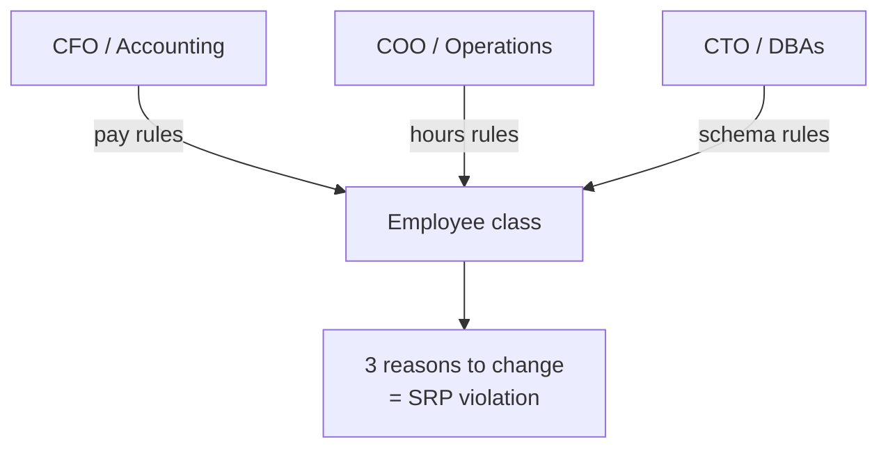
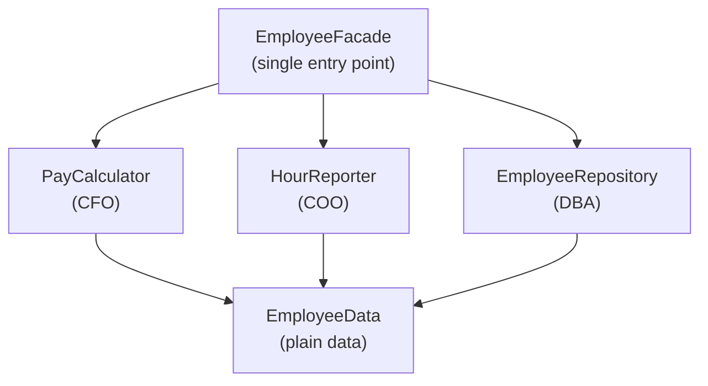

# Single Responsibility Principle (SRP) — Junior

> **Category:** [Design Principles → SOLID](../../README.md) — the first of the five SOLID principles: a class should have one, and only one, reason to change.

---

## Introduction

> Focus: **What is it?** and **How to use it?**

The **Single Responsibility Principle** is the "S" in SOLID, the five object-oriented design principles popularized by Robert C. Martin ("Uncle Bob"). It is the most quoted of the five — and the most misunderstood. Almost everyone who has heard of it can recite *"a class should do one thing."* Almost everyone is wrong.

The principle's actual statement is:

> **A class should have one, and only one, reason to change.**

The word that does the work there is **"reason."** SRP is not about how many things a class *does*; it is about how many *separate forces* can demand that the class be modified. If two different people, for two different business reasons, can each walk up to the same class and say "this needs to change," that class has two responsibilities — and SRP says to split them apart.

### Why this matters

When unrelated responsibilities live in one class, they become entangled. A change requested by the accounting department to fix a payroll formula now sits in the same file as the logic the operations department relies on for timesheet reports. Edit one, and you risk breaking the other — even though, conceptually, they have nothing to do with each other. The class becomes a place where unrelated teams collide: merge conflicts, accidental breakage, and "I only touched the tax calculation, why did the report change?" bugs.

SRP is the discipline of **keeping the things that change for the same reason together, and the things that change for different reasons apart.** Get this right and changes stay local, blast radius stays small, and two teams can work on the same area of the product without stepping on each other.

---

## Prerequisites

- **Required:** Comfort with classes, methods, and fields in an object-oriented language (Java, Python, TypeScript, C#).
- **Required:** A feel for what it means to *change* code in response to a new requirement — SRP is about change, so you must be able to imagine "who would ask for this to be different?"
- **Helpful:** Exposure to **[cohesion](../../02-coupling-and-cohesion/02-maximise-cohesion/)** — SRP is, at bottom, a statement about cohesion ("group what changes together").
- **Helpful:** Familiarity with **[coupling](../../02-coupling-and-cohesion/01-minimise-coupling/)** — violating SRP creates accidental coupling between unrelated concerns.

---

## Glossary

| Term | Definition |
|------|-----------|
| **Single Responsibility Principle (SRP)** | A class (or module) should have one, and only one, reason to change. |
| **Reason to change** | A business or technical force that can require the code to be modified — tied to a specific *actor*. |
| **Actor** | A person, role, or stakeholder group that requests changes (e.g. the CFO/accounting, the COO/operations, the CTO/DBAs). One actor = one reason to change. |
| **Responsibility** | An axis of change driven by a single actor. "Responsibility to whom?" — to one stakeholder. |
| **Cohesion** | How strongly the elements inside a module belong together. SRP maximises cohesion *with respect to actors*. |
| **Coupling** | How much a change in one place forces a change elsewhere. Mixing responsibilities creates *accidental* coupling. |
| **Shotgun surgery** | A smell where one logical change forces edits scattered across many classes — the inverse symptom of a poorly-applied SRP. |
| **Facade** | A single entry-point class that delegates to the specialised, per-responsibility classes behind it, preserving a simple public surface. |

---

## The Real Definition

Uncle Bob has stated SRP two ways over the years, and you need both.

**The original (1990s, *Agile Software Development*):**

> A class should have one, and only one, reason to change.

**The reframing (2014+, *Clean Architecture*), to fix the "reason" ambiguity:**

> Gather together the things that change for the same reasons. Separate those things that change for different reasons.

And, most precisely:

> A module should be responsible to one, and only one, **actor.**

These three are the same idea viewed from different angles:

- "Reason to change" — focuses on the *force*.
- "Things that change together" — focuses on *cohesion* (this is just cohesion restated).
- "Responsible to one actor" — focuses on *who* requests the change.

The last framing is the sharpest, because it makes the abstract idea concrete and testable. You stop asking the unanswerable *"is this one responsibility?"* and start asking *"who would request a change to this code?"* If the answer is more than one role, you have more than one responsibility.

---

## What SRP Is NOT: Debunking "Do One Thing"

The most common way SRP is taught is also wrong:

> ❌ "A class should do only one thing."
> ❌ "A class should have only one method."
> ❌ "Keep your classes small."

These are oversimplifications, and following them literally produces *worse* designs. Consider:

- A `Stack` class that does `push`, `pop`, `peek`, `size`, and `isEmpty` clearly "does many things" — yet it has exactly **one** reason to change (the definition of a stack), so it is *perfectly* SRP-compliant. The "do one thing" rule would tell you to split it into five classes. That is absurd.
- "Do one thing" applies reasonably well to *functions* (a single function should do one level of abstraction), but SRP is a **class/module-level** principle about *reasons to change*, not about counting verbs.

> **The trap:** "do one thing" leads you to count *operations*. SRP wants you to count *actors* — the sources of change. A class can do ten things for one actor and still be perfectly cohesive; a class that does one thing for three actors is the real violation.

Whenever you hear "SRP means a class does one thing," mentally correct it to **"SRP means a class answers to one actor."** That single substitution prevents most SRP mistakes.

---

## Responsibility = An Axis of Change

A **responsibility** is best understood as an **axis along which the code can change**, and each axis is driven by **one actor**.

Picture a class that serves three different departments:

```text
                    ┌────────────────────────┐
   CFO / Accounting │                        │
   ─── pay rules ──▶│                        │
                    │     Employee class     │
   COO / Operations │  (3 reasons to change) │
   ─ hours rules ──▶│                        │
                    │                        │
   CTO / DBAs       │                        │
   ─ schema rules ─▶│                        │
                    └────────────────────────┘
```

Three actors, three reasons to change, three axes. The accounting actor changes pay rules; the operations actor changes how hours are reported; the database actor changes how the row is persisted. SRP says these three should live in **three separate classes**, each answering to exactly one actor.

> A responsibility is "a reason to change," and a reason to change is "an actor who can request a change." The whole principle reduces to: **one class, one actor.**

---

## Real-World Analogies

| Concept | Analogy |
|---|---|
| **One class, one actor** | A specialist doctor. You don't want your cardiologist also doing your taxes and fixing your car — when tax law changes, you shouldn't have to renegotiate your heart medication. One professional, one domain of responsibility. |
| **Mixing responsibilities** | A Swiss Army knife welded into your car's steering column. Sharpening the blade now means dismantling the steering. The tools were fine separately; fusing them made every change dangerous. |
| **Reason to change = actor** | A restaurant. The chef changes the menu; the accountant changes the prices' bookkeeping; the landlord changes the rent. Three people, three reasons the "restaurant" changes — you keep their paperwork in separate folders so one person's edit doesn't corrupt another's. |
| **Facade over split classes** | A hotel front desk. You ask one person (the facade) for room service, housekeeping, and a taxi; behind the desk, three separate departments handle each. Simple front, specialised back. |
| **Shotgun surgery (the opposite smell)** | A light switch wired so that flipping it requires rewiring every room in the house. One conceptual change, edits scattered everywhere. |

---

## Mental Models

**The core question:** *"If I imagine every person who could ask me to change this class, how many different people are there?"* If the answer is one, SRP is satisfied. If it's more than one, split along the people.

```text
  ASK OF EVERY CLASS:  "Who requests changes to this?"

     one actor   ──────────────▶  ✅ single responsibility
     two actors  ──────────────▶  ❌ split into two classes
     "I'm not sure who" ────────▶  ⚠️ the boundary is unclear — investigate
```

A second model: **a responsibility is a "line of cleavage."** Like a crystal that splits cleanly along certain planes, a well-designed class splits cleanly along actor boundaries. If your class is hard to split — if pulling out the pay logic drags the hours logic with it — that entanglement is the *symptom* the principle is warning you about.

A third model: **SRP is cohesion seen through the lens of change.** "[Maximise cohesion](../../02-coupling-and-cohesion/02-maximise-cohesion/)" says *put together things that belong together.* SRP sharpens "belong together" to a precise test: things belong together if they *change for the same reason* (the same actor). SRP and cohesion are two names for the same target.

---

## A Worked Example: The Employee Class

This is Uncle Bob's canonical example, and it makes the principle click.

### The violation

```java
class Employee {
    // Used by the accounting department (CFO)
    public Money calculatePay() {
        // ... payroll rules, tax brackets, overtime policy ...
    }

    // Used by the operations / HR department (COO)
    public Hours reportHours() {
        // ... timesheet aggregation rules ...
    }

    // Used by the database administrators (CTO)
    public void save() {
        // ... SQL, schema, persistence ...
    }
}
```

One class, **three actors**:

| Method | Actor (who requests changes) | Reason to change |
|---|---|---|
| `calculatePay()` | CFO / accounting | tax law, overtime policy |
| `reportHours()` | COO / operations | how non-billable time is counted |
| `save()` | CTO / DBAs | schema migrations, persistence tech |

This violates SRP. The danger is not abstract. Suppose `calculatePay()` and `reportHours()` *share* a private helper — say `regularHours()` — written to satisfy accounting's overtime policy. One day **operations** asks to tweak how `reportHours()` counts non-billable time, and an engineer edits `regularHours()` to do it. The change ships. Nobody realised `calculatePay()` also called `regularHours()` — so the payroll numbers are now subtly wrong, and the company *overpays everyone*. Two actors, one shared piece of code, and one actor's request silently broke the other's behaviour. **That is exactly the bug SRP prevents.**

### The fix: extract per-actor classes

```java
// One responsibility each — one actor each.
class PayCalculator   { Money calculatePay(EmployeeData e) { /* CFO rules  */ } }
class HourReporter    { Hours reportHours(EmployeeData e)  { /* COO rules  */ } }
class EmployeeRepository { void save(EmployeeData e)       { /* DBA rules  */ } }

// Plain data, no behaviour that belongs to a specific actor.
class EmployeeData { /* name, id, rate, timesheet ... */ }
```

Now accounting's changes touch only `PayCalculator`; operations' changes touch only `HourReporter`; the DBAs' changes touch only `EmployeeRepository`. The shared `regularHours()` bug can no longer happen, because each actor's logic is isolated.

### Keeping a single entry point: the Facade

Splitting into three classes can make callers juggle three objects. If you want to preserve the convenient single handle, use a **Facade**:

```java
class EmployeeFacade {
    private final PayCalculator pay = new PayCalculator();
    private final HourReporter hours = new HourReporter();
    private final EmployeeRepository repo = new EmployeeRepository();

    Money calculatePay(EmployeeData e) { return pay.calculatePay(e); }
    Hours reportHours(EmployeeData e)  { return hours.reportHours(e); }
    void  save(EmployeeData e)         { repo.save(e); }
}
```

Callers still get one object, but each *responsibility* lives in its own class with its own reason to change. The facade itself has one reason to change — the set of operations it exposes — which is fine.

---

## Code Examples

### Python — a "God" service split by actor

```python
# ❌ Violation: one class, three reasons to change
class ReportService:
    def fetch_data(self):          # changes when the DB/query changes (DBA)
        return db.query("SELECT ...")

    def format_html(self, data):   # changes when design/marketing tweaks layout
        return f"<table>...{data}...</table>"

    def email(self, html):         # changes when the email provider changes (infra)
        smtp.send(to="boss@co", body=html)
```

```python
# ✅ Fix: each concern answers to one actor
class ReportRepository:           # DBA actor
    def fetch(self): return db.query("SELECT ...")

class ReportRenderer:             # design actor
    def to_html(self, data): return f"<table>...{data}...</table>"

class ReportMailer:               # infra actor
    def send(self, html): smtp.send(to="boss@co", body=html)

# Orchestration lives in one thin coordinator (its own single responsibility):
class ReportJob:
    def __init__(self, repo, renderer, mailer):
        self.repo, self.renderer, self.mailer = repo, renderer, mailer
    def run(self):
        self.mailer.send(self.renderer.to_html(self.repo.fetch()))
```

### TypeScript — the classic "presentation + persistence in the model" mix

```typescript
// ❌ The User model knows about HTML *and* SQL — two actors
class User {
  constructor(public name: string, public email: string) {}
  toHtmlRow(): string { return `<tr><td>${this.name}</td></tr>`; } // design actor
  save(): void { db.exec(`INSERT INTO users ...`); }              // DBA actor
}

// ✅ The model holds data + rules; rendering and persistence move out
class User {
  constructor(public name: string, public email: string) {}
  // only domain behaviour that the *business* owns lives here
}
class UserRowView    { render(u: User): string { return `<tr>...</tr>`; } }
class UserRepository { save(u: User): void { db.exec(`INSERT ...`); } }
```

In all three examples the move is the same: **find the actors, draw a line between them, give each its own class.**

---

## Symptoms of a Violation

You usually *feel* an SRP violation before you can name it. The tells:

- **Merge conflicts across teams.** Two teams keep colliding in the same file because their unrelated changes both live there.
- **"Why did *that* break?"** A change requested by actor A silently breaks behaviour owned by actor B (the `regularHours()` bug above) — **accidental coupling.**
- **The class has "and" in its description.** "This class calculates pay *and* reports hours *and* saves to the DB." Each "and" is often another actor.
- **Mixed vocabulary.** One class talks about tax brackets, HTML tables, *and* SQL connections — three different worlds.
- **The class is hard to name.** `EmployeeManager`, `OrderUtil`, `DataProcessor` — vague names often signal "I'm doing too many unrelated things to name precisely."
- **Tests pull in unrelated machinery.** To test the pay calculation you must spin up a database and a mail server — because those responsibilities are tangled in.

---

## Best Practices

1. **Identify the actors first.** Before splitting, list *who* requests changes to the code. The actors are your seams.
2. **Name classes after the responsibility, not the entity.** `PayCalculator`, `HourReporter`, `UserRepository` — names that reveal the single reason to change.
3. **Move persistence and presentation out of domain models.** "Save to DB" (DBA actor) and "render to HTML" (design actor) almost never belong in a business model.
4. **Use a Facade** when you want one convenient entry point over several single-responsibility classes.
5. **Let cohesion guide you.** If a method always changes alongside others, they share an actor — keep them together. (See [Maximise Cohesion](../../02-coupling-and-cohesion/02-maximise-cohesion/).)
6. **Don't split prematurely.** A class with one actor that happens to have many methods is *fine*. Split when a *second actor* appears, not to chase a method count.

---

## Common Mistakes

1. **Equating SRP with "one method" or "one thing."** The principle is about *reasons to change* (actors), not operation count. (See the [debunking section](#what-srp-is-not-debunking-do-one-thing).)
2. **Over-splitting into a swarm of tiny classes.** Pushed too far, SRP produces dozens of one-method classes that are hard to navigate. Split along *actors*, not arbitrarily. (Covered deeply at [Middle](middle.md) and [Senior](senior.md).)
3. **Splitting by noun instead of by actor.** Creating `EmployeeName`, `EmployeeSalary`, `EmployeeAddress` classes — that's decomposing data, not separating *reasons to change*.
4. **Leaving shared helpers across responsibilities.** The whole point is that two actors no longer share mutable logic. A leftover shared helper re-introduces the exact coupling you split to avoid.
5. **Calling everything its own "responsibility."** If you can't name a distinct actor, you probably haven't found a real second responsibility.

---

## Tricky Points

- **"Responsibility" is defined by *actor*, not by *behaviour*.** A `Stack` with five methods serves one actor and is SRP-clean. An `Employee` with three methods serves three actors and is not. Count actors, not methods.
- **SRP is just cohesion restated.** "One reason to change" = "all elements change together" = high cohesion *along the actor axis*. If you understand [cohesion](../../02-coupling-and-cohesion/02-maximise-cohesion/), you understand SRP. The deeper coupling theory is [connascence](../../02-coupling-and-cohesion/03-connascence/), covered at [Senior](senior.md).
- **The same code can satisfy or violate SRP depending on the org.** If accounting and operations are *the same team* with *the same change cadence*, they may be one actor for your purposes. Responsibilities are defined by your *actual* sources of change, not by a universal taxonomy.
- **SRP can conflict with simplicity.** Splitting always *adds elements*. Sometimes a tiny program with one developer has one effective actor, and the "violation" isn't worth fixing. Knowing when *not* to split is senior judgement — see [Middle](middle.md).

---

## Test Yourself

1. State SRP in its most precise form (the "actor" framing).
2. Why is *"a class should do one thing"* a misleading way to teach SRP? Give a counterexample.
3. In the `Employee` example, name the three actors and the method each owns.
4. Describe the concrete bug that SRP prevents in the `Employee`/`regularHours()` story.
5. What is the role of a Facade after you split a class by responsibility?
6. List three symptoms that suggest a class is violating SRP.

---

## Cheat Sheet

```text
SRP — THE ONE-LINER
  A class should have one, and only one, REASON TO CHANGE.
  = it should be responsible to one, and only one, ACTOR.

THE TEST
  "Who would ask me to change this class?"
     one person/role  → ✅ single responsibility
     two or more      → ❌ split along the actors

NOT WHAT IT MEANS
  ✗ "do one thing"      ✗ "one method"      ✗ "small classes"
  (a Stack does 5 things, 1 actor → SRP-clean)

EMPLOYEE EXAMPLE (the canonical violation)
  calculatePay()  → CFO / accounting
  reportHours()   → COO / operations      } 3 actors = 3 responsibilities
  save()          → CTO / DBAs            } → split into 3 classes

THE FIX
  extract one class per actor → optional Facade for a single entry point

SYMPTOMS OF VIOLATION
  cross-team merge conflicts · "why did THAT break?" · "and" in the name ·
  mixed vocabulary (tax+HTML+SQL) · tests need a DB just to check a formula
```

---

## Summary

- **SRP** = *a class should have one, and only one, reason to change* — most precisely, *it should be responsible to one, and only one, actor.*
- A **responsibility** is an **axis of change driven by a single actor** (a person/role/stakeholder who requests changes). One class, one actor.
- *"A class should do one thing"* is a **myth** — SRP counts *actors*, not operations. A `Stack` does many things for one actor and is SRP-clean.
- The canonical **`Employee`** example serves three actors (CFO `calculatePay`, COO `reportHours`, DBA `save`); the fix is **one class per actor**, optionally fronted by a **Facade**.
- Violations show up as **cross-team merge conflicts, accidental coupling** (one actor's change breaks another's), and classes hard to name or test in isolation.
- SRP is **cohesion restated through the lens of change** — group what changes together, separate what changes for different reasons.

---

## Further Reading

- Robert C. Martin, *Agile Software Development, Principles, Patterns, and Practices* — the original SRP chapter.
- Robert C. Martin, *Clean Architecture* (Ch. 7) — the "responsible to one actor" reframing and the `Employee` example.
- Robert C. Martin, [The Single Responsibility Principle](https://blog.cleancoder.com/uncle-bob/2014/05/08/SingleReponsibilityPrinciple.html) — the canonical blog restatement.
- [Maximise Cohesion](../../02-coupling-and-cohesion/02-maximise-cohesion/) — SRP is cohesion seen through the lens of change.

---

## Related Topics

- **Sibling SOLID principles:** [Open/Closed](../02-ocp-open-closed/), [Liskov Substitution](../03-lsp-liskov-substitution/), [Interface Segregation](../04-isp-interface-segregation/), [Dependency Inversion](../05-dip-dependency-inversion/).
- **Underlying principle:** [Maximise Cohesion](../../02-coupling-and-cohesion/02-maximise-cohesion/), [Minimise Coupling](../../02-coupling-and-cohesion/01-minimise-coupling/).
- **How the five interlock:** [SOLID as a Whole and Smells](../06-solid-as-a-whole-and-smells/).

---

## Diagrams

### Three actors, one class — the violation



### The fix — one class per actor, optional facade




---

## Check your understanding

1. Explain Single Responsibility Principle (SRP) — Junior Level in your own words and name the problem it solves.
2. How would you apply the ideas around Table of Contents, Introduction, Prerequisites in a realistic engineering change?
3. What failure mode or misuse should you look for, and what evidence would reveal it?
4. What small example would prove that you can apply Single Responsibility Principle (SRP) — Junior Level correctly?
5. What observable result would convince you that the approach improved the system?
