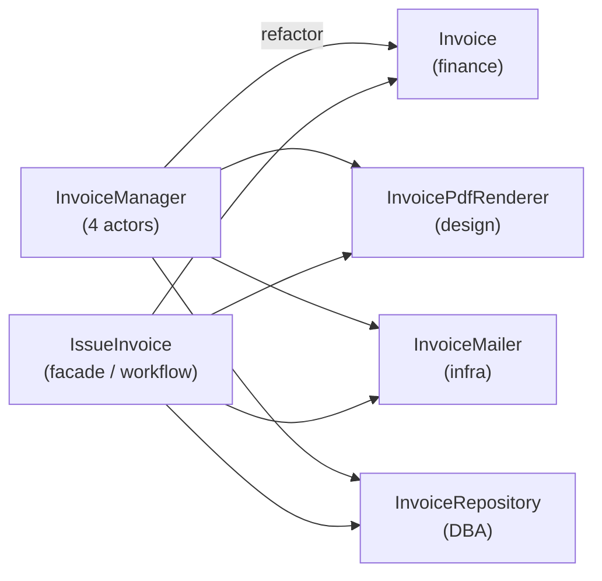
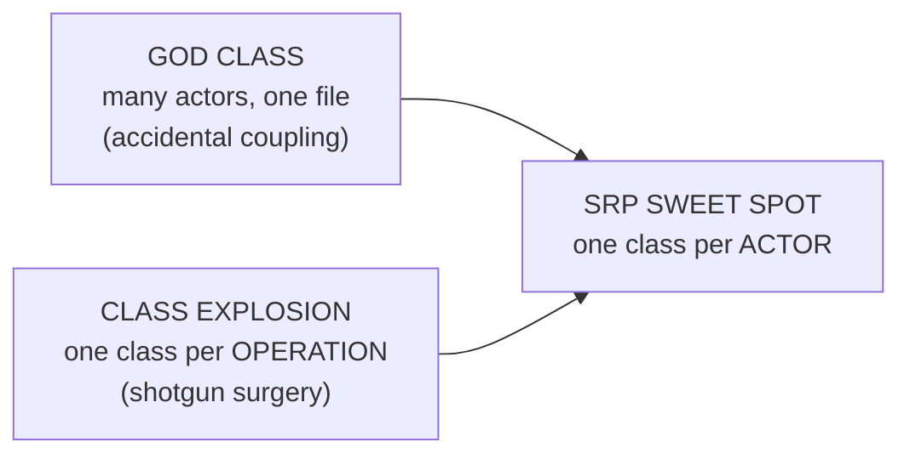

# Single Responsibility Principle (SRP) — Middle

> **Category:** [Design Principles → SOLID](../../README.md) — a class should have one, and only one, reason to change.

> **Prerequisite:** [Junior](junior.md)
> **Focus:** **Why** and **When**

---

## Table of Contents

1. [Introduction](#introduction)
2. [Finding the Actors in Real Code](#finding-the-actors-in-real-code)
3. [Refactoring a God Class by Actor](#refactoring-a-god-class-by-actor)
4. [SRP at Three Levels: Function, Class, Module](#srp-at-three-levels-function-class-module)
5. [SRP Is Cohesion](#srp-is-cohesion)
6. [The Facade Pattern as the SRP Companion](#the-facade-pattern-as-the-srp-companion)
7. [Over-Application: The Class Explosion](#over-application-the-class-explosion)
8. [When NOT to Split](#when-not-to-split)
9. [Trade-offs](#trade-offs)
10. [Edge Cases](#edge-cases)
11. [Tricky Points](#tricky-points)
12. [Best Practices](#best-practices)
13. [Test Yourself](#test-yourself)
14. [Summary](#summary)
15. [Diagrams](#diagrams)

---

## Introduction

> Focus: **Why** and **When**

At the junior level, SRP is a definition you can recite: *one class, one actor.* At the middle level it becomes a set of judgement calls you make daily. The hard part is never the principle — it's two operational questions:

1. **How do I find the actors** in a class that wasn't designed with them in mind?
2. **When have I split too far** — turning one understandable class into a dust cloud of tiny ones?

Most engineers, once they "get" SRP, swing too hard and start splitting everything, because over-splitting *looks* disciplined. The middle-level skill is calibration: split along **real actor boundaries**, and stop. SRP applied without judgement produces a **class explosion** that is, in its own way, as hard to maintain as the god class you started with — you've traded one big tangle for a hundred-file scavenger hunt.

---

## Finding the Actors in Real Code

The principle says "one actor per class," but production code rarely labels its actors. Here is the practical procedure to surface them.

**1. List the reasons the class has changed historically.** Open the git log for the file. Each *distinct kind* of change (a tax tweak, a UI relayout, a query optimisation) hints at an actor.

**2. Ask "who requested it?" for each reason.** Tie every change-reason to a role: finance, marketing/design, ops, platform/infra, security, the DBAs. Different requesters → different actors.

**3. Group the methods by actor.** Methods that always change for the same requester belong together; methods that change for *different* requesters are your split lines.

**4. Look for vocabulary shifts.** Within one class, a jump from `taxBracket` to `<td>` to `connectionPool` is three vocabularies — almost always three actors.

```python
class InvoiceManager:               # which actors hide here?
    def total(self): ...            # finance  — pricing/tax rules
    def to_pdf(self): ...           # design   — document layout
    def email_to(self, addr): ...   # infra    — delivery channel
    def persist(self): ...          # DBA      — storage
```

`InvoiceManager` answers to **four** actors. The vague `Manager` suffix is itself a symptom — when you can't name a class for a single responsibility, you've usually bundled several.

> **Heuristic:** if you describe the class and your description contains the word *"and"* connecting two different *vocabularies* (not two steps of the same vocabulary), each side is probably a separate responsibility.

---

## Refactoring a God Class by Actor

Take the `InvoiceManager` above and split it the way you would in practice — incrementally, behind tests.

### Step 1 — pin behaviour with tests (Rule 1 of any refactor)

You cannot safely split without tests. Write characterization tests for `total`, `to_pdf`, `email_to`, and `persist` that capture *current* behaviour, so the refactor can't silently change anything.

### Step 2 — extract one actor at a time

```python
# Data + the rules the BUSINESS owns stay in the domain object.
class Invoice:
    def __init__(self, lines): self.lines = lines
    def total(self):                       # finance actor — domain rule, stays
        return sum(l.price * l.qty for l in self.lines) * (1 + VAT_RATE)

# Each other actor moves to its own class.
class InvoicePdfRenderer:                  # design actor
    def render(self, invoice: Invoice) -> bytes: ...

class InvoiceMailer:                       # infra actor
    def send(self, pdf: bytes, to: str): ...

class InvoiceRepository:                   # DBA actor
    def save(self, invoice: Invoice): ...
```

Note a subtlety: `total()` is a *domain rule* owned by the business/finance actor, and the `Invoice` object *is* the natural home for that one actor's behaviour. SRP does **not** say "models must be anaemic bags of data" — it says each class answers to one actor. The `Invoice` answers to finance; that's allowed.

### Step 3 — orchestrate in a thin coordinator

```python
class IssueInvoice:                        # one responsibility: the use case
    def __init__(self, renderer, mailer, repo):
        self._renderer, self._mailer, self._repo = renderer, mailer, repo
    def execute(self, invoice: Invoice, customer_email: str):
        self._repo.save(invoice)
        pdf = self._renderer.render(invoice)
        self._mailer.send(pdf, customer_email)
```

The coordinator's single reason to change is "the *steps* of issuing an invoice change." That's a legitimate, distinct responsibility (the workflow), separate from *how* each step is implemented.

---

## SRP at Three Levels: Function, Class, Module

SRP is usually taught at the class level, but the same "one reason to change" idea scales up and down.

| Level | "One responsibility" means | Violation looks like |
|---|---|---|
| **Function** | One level of abstraction; does *or* answers, not both | A function that validates, computes, *and* writes to the DB |
| **Class** | Responsible to one actor | The `Employee` with `calculatePay`/`reportHours`/`save` |
| **Module / package** | Serves one actor or bounded context | A `utils` package importing the web framework, the ORM, *and* the mailer |

The actor framing is cleanest at the class and module level. At the **function** level it shades into "do one thing" / command-query separation — and that's fine, because functions are small enough that "one level of abstraction" is a workable test. The mistake is dragging the function-level "do one thing" *up* to the class level, where it becomes the "one method per class" anti-pattern. **Use the actor test at the class/module level; use the abstraction-level test at the function level.**

---

## SRP Is Cohesion

Here is the unifying insight a middle engineer should internalise: **SRP and high cohesion are the same property, named twice.**

- [**Cohesion**](../../02-coupling-and-cohesion/02-maximise-cohesion/) measures how well the elements *inside* a module belong together.
- **SRP** says the elements belong together when they **change for the same reason** (the same actor).

So "maximise cohesion" and "one reason to change" are the same instruction. The most desirable form of cohesion — *functional* cohesion (everything in the module contributes to a single well-defined task) — is exactly what SRP produces. The worst form — *coincidental* cohesion (the `Util` grab-bag) — is exactly an SRP violation.

```text
COHESION SPECTRUM (low → high)
  coincidental → logical → temporal → procedural → communicational → sequential → FUNCTIONAL
  └─ "Util grab-bag"                                                          └─ SRP target
     (SRP violation)                                                            (one actor)
```

When you split a god class by actor, you are *raising its cohesion* toward functional. SRP is the actionable rule; cohesion is the underlying quality.

---

## The Facade Pattern as the SRP Companion

Splitting a class multiplies the objects a caller must coordinate. The **Facade** restores a single, simple entry point without re-merging the responsibilities.

```typescript
// Behind the facade: three single-responsibility classes
class UserFacade {
  constructor(
    private repo: UserRepository,     // DBA actor
    private mailer: WelcomeMailer,    // infra actor
    private auditor: AuditLog,        // security/compliance actor
  ) {}

  register(user: User): void {
    this.repo.save(user);
    this.mailer.sendWelcome(user);
    this.auditor.record("user.registered", user.id);
  }
}
```

The facade gives callers one method (`register`) while each responsibility stays isolated. Crucially, the facade itself has **one reason to change** — the registration *workflow*. It is *not* an SRP violation just because it touches three collaborators; it doesn't *implement* persistence, mail, or auditing — it *coordinates* them. Coordinating is itself a single responsibility.

> **The distinction that matters:** a class that *implements* three concerns violates SRP; a class that *delegates to* three single-responsibility classes does not. Delegation is one responsibility (orchestration); implementation-of-many is several.

---

## Over-Application: The Class Explosion

SRP's failure mode is **over-application**, and it's seductive because it masquerades as rigour.

```text
   "calculate pay" becomes:
     PayCalculator
       → OvertimePolicy
         → OvertimePolicyFactory
           → OvertimePolicyConfig
             → OvertimePolicyConfigLoader
               → ... for a 3-line formula
```

When you split past the actor boundary, you get:

- **Navigation cost.** Understanding one feature means opening fifteen files and chasing the call chain across all of them. The logic is no longer anywhere; it's *between* everywhere.
- **Indirection without payoff.** Each tiny class adds an interface, a constructor, a wiring line in the DI container — ceremony serving no actual variation.
- **Lost locality.** Code that conceptually belongs together (because it's one actor's logic) is scattered, so a single change becomes **shotgun surgery** — the *opposite* smell from the god class, but just as painful.

The line is the **actor**, not the **operation**. `PayCalculator` answers to finance and may legitimately contain the overtime formula, the tax lookup, and the rounding rule — *all finance's concern, one actor.* Splitting those into separate classes doesn't improve SRP; it manufactures a class explosion. SRP says split when a *second actor* appears, never to chase a lower method count.

---

## When NOT to Split

Knowing when to *stop* is the senior-track skill. Don't split when:

1. **There's only one real actor.** Many methods, one requester → leave it whole. A `Stack`, a `Money` value object, a `Matrix` — rich behaviour, one reason to change.
2. **The "second actor" is speculative.** You *imagine* design and finance might diverge, but today they're the same team changing things together. Split when the second actor is *real*, not anticipated. (This is [YAGNI](../../01-generic/02-yagni/) applied to SRP.)
3. **Splitting would force a worse smell.** If extracting a class drags shared state across the boundary, you may create more coupling than you remove. Sometimes the cohesive whole is genuinely the simplest design.
4. **The program is tiny.** A 200-line script with one author and one change-source has, effectively, one actor. Ceremonial splitting buys nothing.

> SRP is a heuristic, not a law. The cost of a split (more elements, more indirection, more navigation) is real and must be paid for by a real benefit (an actual second actor whose changes you're isolating). No second actor, no benefit, no split.

---

## Trade-offs

| Dimension | Keep cohesive (don't split) | Split by responsibility |
|---|---|---|
| Number of elements | Few | More (classes, interfaces, wiring) |
| Change isolation | Low — actors share a file | High — each actor isolated |
| Navigation cost | Low (logic is local) | Higher (logic spread across files) |
| Risk of accidental coupling | High when ≥2 actors share code | Low |
| Testability | Often poor (must mock unrelated machinery) | Good (test one concern in isolation) |
| Best when | One real actor; small program | Two or more real, diverging actors |

The asymmetry: an **under-split** class (god class) hurts every time *two different actors* both need to change — frequent, expensive, bug-prone. An **over-split** design hurts every time you *read or navigate* — constant low-grade friction. The right cut is at the actor boundary, where you pay the split cost exactly once per genuine source of change.

---

## Edge Cases

### 1. The model that "must" persist itself (Active Record)

Frameworks like Rails/Django put `save()` on the model (`user.save()`). This *technically* mixes the domain actor and the DBA actor in one class. It's a deliberate trade: the productivity of Active Record vs. SRP purity. For small/medium apps it's often the right call; as persistence logic grows complex, teams extract repositories. Know that it's a **conscious trade-off**, not an oversight.

### 2. The "and" that's actually one responsibility

"This class parses *and* validates the config." Parsing and validating a config might be **one** actor (whoever owns the config format), changing together. The "and" test is a *hint*, not proof — confirm by checking whether the two parts change for *different* reasons.

### 3. A genuinely cross-cutting concern

Logging, metrics, and auth touch every class. You don't give each class a "logging responsibility"; you extract the cross-cutting concern (via a decorator, middleware, or aspect) so the core class keeps its single responsibility. (See [Separation of Concerns](../../01-generic/03-separation-of-concerns/).)

---

## Tricky Points

- **Actors, not nouns, define the split.** Splitting `Employee` into `EmployeeName`/`EmployeeSalary` decomposes *data*; SRP wants you to split by *reason to change* (finance vs. ops vs. DBA), which cuts *across* those nouns.
- **SRP ≠ anaemic models.** Putting *behaviour* on a class is fine as long as it's *one actor's* behaviour. The mistake is mixing actors, not having logic.
- **A facade/coordinator touching many classes is not an SRP violation** — orchestration is itself one responsibility. Implementing many concerns is the violation; *delegating* to many is not.
- **The actor boundary depends on your organisation.** If two "different" concerns always change together because one team owns both, they may be one actor *for you*. SRP is defined by your real sources of change, not a universal catalogue.
- **Over-splitting causes shotgun surgery** — the inverse smell. Both the god class and the dust cloud make one logical change expensive; the sweet spot is the actor boundary.

---

## Best Practices

1. **Find actors from the git history.** Past change-reasons reveal the real axes of change better than guessing.
2. **Split at the actor boundary — and stop there.** Not per operation, not per noun.
3. **Move presentation and persistence out of domain models** (the two most common foreign actors), but keep *domain rules* in the domain object.
4. **Use a Facade** to preserve a single entry point after splitting.
5. **Apply [YAGNI](../../01-generic/02-yagni/) to SRP:** split when the second actor is *real*, not anticipated.
6. **Treat the `Manager`/`Util`/`Processor` suffix as a smell** — it usually marks an unnamed bundle of responsibilities.
7. **Refactor behind characterization tests**, one actor at a time, in small commits.

---

## Test Yourself

1. Give a practical procedure for finding the actors hidden in a god class.
2. Why is "SRP is cohesion restated" an accurate statement? Which cohesion type is the SRP target?
3. Why is a facade/coordinator that calls three classes *not* an SRP violation?
4. Describe the class-explosion failure mode and the smell it causes.
5. Name three situations where you should *not* split a class.
6. How does the right level (function vs. class) change which "one responsibility" test you apply?

---

## Summary

- The middle-level skill is **finding the real actors** (best surfaced from change history) and **splitting only at actor boundaries** — never per operation or per noun.
- **SRP is cohesion restated**: it targets *functional cohesion*, where every element changes for one actor's reason.
- A **Facade** preserves a single entry point after splitting; a facade/coordinator is **not** an SRP violation because *orchestration is one responsibility*.
- **Over-application** produces a **class explosion** → navigation cost, indirection, and **shotgun surgery** (the inverse smell). The line is the actor, not the operation.
- **Don't split** when there's one real actor, the second actor is speculative ([YAGNI](../../01-generic/02-yagni/)), splitting worsens coupling, or the program is tiny.
- SRP scales across **function / class / module** levels, but the *actor* test belongs at class/module level; the *abstraction-level* test belongs at function level.

---

## Diagrams

### God class → split by actor → facade



### The sweet spot between two failure modes




---

## Check your understanding

1. Explain Single Responsibility Principle (SRP) — Middle Level in your own words and name the problem it solves.
2. How would you apply the ideas around Table of Contents, Introduction, Finding the Actors in Real Code in a realistic engineering change?
3. What failure mode or misuse should you look for, and what evidence would reveal it?
4. Which local design trade-off would make you choose or reject Single Responsibility Principle (SRP) — Middle Level in an existing codebase?
5. What observable result would convince you that the approach improved the system?
