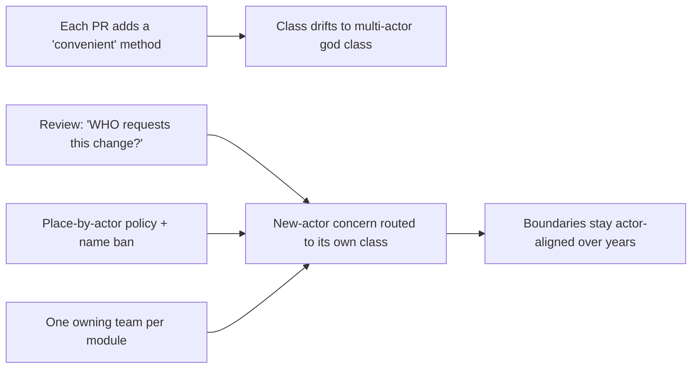
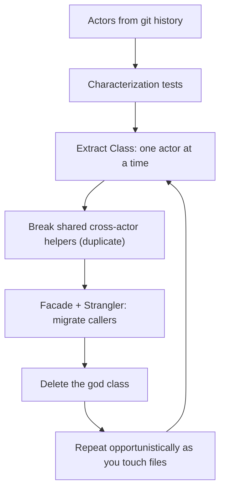

# Single Responsibility Principle (SRP) — Professional

> **Category:** [Design Principles → SOLID](../../README.md) — a class should have one, and only one, reason to change.

> **Prerequisites:** [Junior](junior.md) · [Middle](middle.md) · [Senior](senior.md)
> **Focus:** **Production** — reviews, metrics, team conventions, legacy systems, incidents

---

## Table of Contents

1. [Introduction](#introduction)
2. [Enforcing SRP in Code Review](#enforcing-srp-in-code-review)
3. [Fighting Violations Before They Land](#fighting-violations-before-they-land)
4. [Measuring SRP](#measuring-srp)
5. [Team Conventions for SRP](#team-conventions-for-srp)
6. [Refactoring Legacy God Classes Toward SRP](#refactoring-legacy-god-classes-toward-srp)
7. [Real Incidents](#real-incidents)
8. [The Politics of Splitting](#the-politics-of-splitting)
9. [Review Checklist](#review-checklist)
10. [Cheat Sheet](#cheat-sheet)
11. [Diagrams](#diagrams)
12. [Related Topics](#related-topics)

---

## Introduction

> Focus: **production** — sustaining single-responsibility boundaries across a large codebase over years.

SRP is easy to agree with in a slide and hard to hold in a living codebase. The erosion is gradual: a method is added "because it's convenient to have it here," a model gains a `save()` "to ship faster," a `Manager` accretes one more concern each sprint. No single change is wrong; the aggregate is a god class that three teams fight over and nobody dares refactor.

At the professional level the question is operational: **how do you keep boundaries aligned to actors when hundreds of changes land per week from people who don't share your mental model of the actors?** The answer is a system — review standards that name the actors, metrics that surface drift (without lying about it), conventions that make the right boundary the default, and a disciplined, test-guarded way to claw back boundaries in legacy code.

---

## Enforcing SRP in Code Review

Code review is where SRP is won or lost, because god classes grow one PR at a time. The reviewer's job is to catch *responsibility creep* — a change that quietly adds a *second actor's* concern to a class that had one.

### Review by actor, not by size

The wrong review reflex is "this class is big, split it." Size is not the test. The test is:

> **"Does this change make the class answer to a *new actor*?"**

A 600-line class serving one actor is fine. A 40-line class that now does both order validation (product team) *and* audit logging (compliance team) is the violation. Review for **actors, not lines.**

### The highest-value review questions

1. **"Who requests changes to this class?"** — if the honest answer lists two roles, flag it.
2. **"Does this new method change for a *different reason* than the existing ones?"** — a new persistence/rendering/notification method in a domain class usually does.
3. **"If team X changes their requirement, does this file need editing? What about team Y?"** — two yeses = two actors.

### Review comment templates

> "This adds `sendEmail()` to the `Order` model. Order rules change when the *product* team changes pricing; email changes when *infra* changes the provider — two actors. Let's move delivery to a `NotificationService` so an email change can't touch order logic."

> "`UserManager` now does auth, profile updates, *and* CSV export. Each is requested by a different team. Could we split by actor (auth / profile / reporting) so their changes stop colliding here?"

> "These two `calculate*` methods share `regularHours()`. They answer to finance and ops respectively — if ops edits the helper, finance's numbers move silently. I'd duplicate the helper so each owns its own."

> "Good split, but `OrderService` and `OrderRepository` now both parse the line-item format. That parsing is one piece of knowledge owned by one actor — extract it once rather than duplicating across the two."

### The subtle reviewer skill: not over-splitting

Equally important is pushing back on *over*-splitting (the [class explosion](senior.md)):

> "`PayCalculator` → `OvertimePolicy` → `OvertimePolicyFactory` is a lot of indirection for one finance rule. These all change together for one actor — let's keep the policy inline until a second pay regime is real."

---

## Fighting Violations Before They Land

The cheapest SRP violation to fix is the one that never merges. The common entry points and how to block them:

| Entry point | How the violation enters | Counter |
|---|---|---|
| **"It's convenient here"** | A method dropped into the nearest class regardless of actor | Review question: *whose change is this?* Place by actor, not by proximity |
| **Active Record drift** | `model.save()` → then `model.sendEmail()` → then `model.toCsv()` | Keep persistence on the model if you've chosen AR, but draw a hard line at *other* actors (no mail/render/report on the model) |
| **The `Manager`/`Service`/`Util` magnet** | Vague-named classes attract every orphan method | Ban grab-bag names in new code; force a responsibility-revealing name |
| **"While I'm here" additions** | An unrelated concern bolted onto an open file | Separate PR for the unrelated concern; keep the change single-actor |
| **Cross-cutting concern in core** | Logging/metrics/auth woven into business logic | Extract via decorator/middleware/aspect ([Separation of Concerns](../../01-generic/03-separation-of-concerns/)) |

The cultural reframe a professional must drive: **"convenient to write" is not "correct to place."** Code lives where its *actor* lives, not where it was easiest to type.

---

## Measuring SRP

SRP's payoff is *change isolation*, and the honest metrics measure exactly that — how changes actually flow through the code. Static structure metrics are weak proxies; *historical change* metrics are the ground truth.

| Metric | Tracks SRP? | Notes |
|---|---|---|
| **LCOM** (Lack of Cohesion of Methods) | **Partially** | High LCOM = methods using disjoint field sets = likely multiple responsibilities. A useful *static* smell detector, but blind to *actors* |
| **Lines / methods per class** | **Weakly** | A trend signal only; a big one-actor class is fine, a small two-actor class isn't |
| **Change-coupling / co-change** (git history) | **Yes (best single proxy)** | If two concerns in a class *always change in separate commits by different authors/teams*, they're different actors → SRP violation |
| **Number of distinct authors/teams per file** | **Yes** | A file edited by 4 teams is almost always serving 4 actors |
| **Fan-out / efferent coupling per class** | **Partially** | A class importing the ORM, the web layer, *and* the mailer is touching multiple actors' worlds |
| **Change-failure rate / blast radius per change** | **Yes (outcome)** | The real signal: do changes here break *unrelated* behaviour? |

### The honest-measurement rules

- **Lead with change-coupling, not LCOM.** LCOM finds *structural* incohesion; it can't tell you the methods answer to different *actors*. Mining git history for *which concerns change together vs. separately, and by whom* is the metric that actually reflects SRP, because it measures the real thing — sources of change.
- **Count teams/authors per file.** A file with many distinct teams in its blame is a near-certain multi-actor violation, and it's trivial to compute.
- **Watch responsibility creep as a trend.** Track methods-per-class and authors-per-class over time; a rising slope on a "hot" file flags a god class forming.
- **The ground truth is blast radius.** If a change to one concern in a class keeps breaking an *unrelated* concern (cross-actor bugs in the incident log), the boundary is wrong regardless of what the static metrics say.

> Don't quote LCOM alone to "prove" an SRP win after a refactor — LCOM can stay flat while you've genuinely separated two actors. Report change-coupling, authors-per-file, and the drop in cross-concern incidents.

---

## Team Conventions for SRP

Codify these so the single-actor boundary is the default, not a per-PR debate:

1. **Name classes after their responsibility, ban grab-bag suffixes.** No new `Manager`/`Util`/`Helper`/`Processor`/`Data` in new code; a class you can't name precisely is a class doing too much.
2. **No foreign actors in domain models.** Persistence may live on the model *only if* the team has chosen Active Record (documented); presentation, notification, and reporting never do.
3. **Place code by actor, not by convenience.** PR template asks: *which stakeholder owns this change?* — and the code goes where that actor's code lives.
4. **One PR, one concern.** Unrelated changes (a second actor's) go in a separate PR. Keeps reviews single-actor and history change-coupled correctly.
5. **Split on the second real actor, not the imagined one.** [YAGNI](../../01-generic/02-yagni/) for responsibilities — no speculative interfaces/strategies "for flexibility." (And the inverse: don't over-split a single actor's logic.)
6. **Align ownership with code boundaries (Conway).** Each module has one owning team; if two teams keep editing one file, that's an SRP smell *and* an ownership smell — fix both.
7. **Cross-cutting concerns are extracted, never embedded.** Logging/metrics/auth go through shared middleware/decorators.

These encode the senior reasoning so reviewers cite a policy, not a personal preference — and so juniors get the boundary right by default.

---

## Refactoring Legacy God Classes Toward SRP

Greenfield SRP is easy. The professional reality is **separating responsibilities in a god class that is under-tested and in production.** The approach is incremental, test-guarded, and opportunistic — never a rewrite.

### The sequence

1. **Identify the actors from history.** Mine the git log of the god class: group its changes by *kind* and by *requesting team*. The clusters are your seams. This is more reliable than reading the code, because it shows the *real* axes of change.
2. **Pin behaviour with characterization tests.** You cannot safely move responsibilities without tests capturing *current* behaviour (bugs included). (See [Refactoring as a Discipline](../../../craftsmanship-disciplines/03-refactoring-as-a-discipline/) and *Working Effectively with Legacy Code*.)
3. **Extract one actor at a time** (Fowler's *Extract Class*). Pull the highest-pain actor's methods and the *fields they exclusively use* into a new, well-named class. Leave a delegating method behind so callers don't break yet.
4. **Break cross-actor connascence.** Where two actors shared a helper, *duplicate* it so each owns its copy — then let them diverge. (Coincidental sharing was the bug; see [Incident 2](#real-incidents).)
5. **Introduce a Facade for the old call sites**, then migrate callers off the god class incrementally (Strangler Fig).
6. **Delete the god class** once it's empty.

### Extract Class, step by step

```text
1. Pick ONE actor's methods (e.g. all the reporting methods).
2. Create ReportFormatter; move those methods + their exclusive fields in.
3. In the old class, replace each moved method body with delegation.
4. Run characterization tests — green.
5. Migrate callers to use ReportFormatter directly.
6. Remove the now-unused delegating methods.
7. Repeat for the next actor. The god class shrinks to nothing.
```

### What *not* to do

- **Don't split without tests.** Moving a method that subtly shares state is the classic legacy-refactor incident.
- **Don't big-bang rewrite the god class.** Strangle it; rewrites of complex legacy almost always lose edge-case behaviour.
- **Don't over-split while you're in there.** Replacing one god class with forty one-method classes trades a known smell for shotgun surgery. Stop at the actor boundary.
- **Don't fix the *whole* file at once.** Refactor opportunistically (Boy Scout Rule) — extract the actor you're touching for feature work, leave the rest.

---

## Real Incidents

### Incident 1: The model that emailed its own customers

An `Order` Active Record class accreted, over two years, `save()`, then `sendConfirmation()`, then `generateInvoicePdf()`, then `pushToWarehouseQueue()`. A refactor to the email templating (infra's change) altered a shared string-builder that the **PDF invoice** also used — and invoices started rendering with a broken total. Two actors (infra's email, finance's invoice) shared code inside one class. **Fix:** extracted `OrderConfirmationMailer`, `InvoiceRenderer`, and `WarehouseDispatcher`; the `Order` kept only domain rules and (per the team's AR convention) `save()`. **Lesson:** persistence on the model was a deliberate trade; *email, PDF, and queueing* were foreign actors that never belonged there. Every one of them was a separate reason to change.

### Incident 2: The shared helper that overpaid the company

A payroll service had `calculatePay()` and `reportHours()` sharing a private `regularHours()` — the textbook `Employee` setup. Operations requested a change to how *unpaid breaks* counted in reports and edited `regularHours()`. The change passed review (it was "just the hours report"). It silently altered the *pay* calculation, and payroll **overpaid 4,000 employees** one cycle before reconciliation caught it. **Root cause:** cross-actor connascence of algorithm — one actor's edit propagated into another's behaviour. **Fix:** each actor got its own hour computation; the methods were never truly the same rule, just coincidentally identical. **Lesson:** this is *the* SRP defect. The cure is separating by actor *and* not sharing mutable logic across the boundary. (See [Senior](senior.md) on connascence.)

### Incident 3: The distributed monolith

A platform team "did SRP at the service level" by splitting into a `ValidationService`, a `MappingService`, and a `PersistenceService` — i.e., split by *technical layer*, not by *actor/capability*. Shipping any single business feature required a coordinated change and deploy across all three services, with a distributed transaction stitching them. Lead time for a one-line feature was *days*. **Fix:** re-decomposed by business capability (bounded context) so each service owned one capability end-to-end; most features then touched one service. **Lesson:** SRP at the service tier means "one *business capability* per service," not "one technical layer per service." Splitting by mechanism creates shotgun surgery over the network — the most expensive SRP violation there is.

### Incident 4: Over-split into unmaintainability

A team, newly enthusiastic about SRP, decomposed a checkout flow into ~70 single-method classes (`PriceFetcher`, `PriceRounder`, `PriceFormatter`, `TaxApplier`, `TaxRounder`, …). Understanding "compute the order total" meant opening twenty files; a single tax-rule change became shotgun surgery across a dozen of them. **Fix:** re-collapsed the finance-actor logic into a cohesive `Pricing` class (one actor, many methods) while keeping the genuinely separate actors (persistence, rendering) split. **Lesson:** SRP splits by *actor*, not by *operation*. The dust cloud was as unmaintainable as a god class, in the opposite direction.

---

## The Politics of Splitting

Sustaining SRP is partly a social problem:

- **"Just put it here, it's faster" is the default pressure.** Convenience always argues for piling onto the nearest class. Arm reviewers with the actor question so refusing is citing a standard, not blocking a colleague.
- **Splitting looks like overhead under a deadline.** "Why three classes for one feature?" Educate that the split *isolates* future changes — the cost is paid once, the benefit recurs every time an actor changes.
- **Over-splitting can be résumé-driven.** Beware the engineer who turns every method into a class "for SRP." Reframe: SRP splits by *actor*; an unnecessary class is itself a smell.
- **Ownership and code boundaries must move together.** If a file is owned by no one because three teams edit it, no amount of refactoring sticks. Fix the boundary *and* assign one owning team (Conway).
- **Senior engineers set the boundary by example.** If the staff engineer drops persistence and notification onto a model "to ship," everyone does. Model "place by actor," and explain the actor when you do.

---

## Review Checklist

```text
SRP REVIEW CHECKLIST
[ ] ACTOR — who requests changes to this class? (one role, not two+)
[ ] CREEP — does this change add a NEW actor's concern to the class?
[ ] FOREIGN — no persistence/render/notify on the domain model (AR = persist only)
[ ] CONNASCENCE — no helper shared across two actors' methods (silent-break risk)
[ ] NAME — class named for its responsibility (no Manager/Util/Processor)
[ ] PLACEMENT — code lives where its ACTOR lives, not where it was convenient
[ ] NOT-OVER-SPLIT — one actor's logic kept cohesive (no class-per-operation)
[ ] CROSS-CUTTING — logging/metrics/auth extracted, not embedded
[ ] OWNERSHIP — one owning team per module (Conway alignment)
[ ] TESTS — concern testable in isolation (no DB/mailer to test a formula)
```

---

## Cheat Sheet

```text
ENFORCE       highest-value review Q: "WHO requests changes to this class?"
              two roles → split by actor.  (Review for ACTORS, not LINES.)

ENTRY POINTS  "convenient here" · AR drift (model.save→sendEmail→toCsv) ·
              Manager/Util magnet · "while I'm here" · cross-cutting in core

MEASURE       change-coupling (git co-change) + authors/teams-per-file +
              blast-radius of changes.  NOT LCOM-alone, NOT lines-alone.

LEGACY        actors-from-history → characterization tests → Extract Class
              one actor at a time → break shared cross-actor helpers →
              Facade + Strangler → delete god class.  Never big-bang.

INCIDENTS     model emailing customers · shared helper overpaying payroll ·
              distributed monolith (split by LAYER not capability) ·
              over-split dust cloud (split by OPERATION not actor)

REMEMBER      split by ACTOR (different reasons) · keep cohesive what serves
              ONE actor · no foreign actors on the model · code lives where
              its actor lives
```

---

## Diagrams

### Where responsibility creep enters, and where it's stopped



### Safe legacy de-godding



---

## Related Topics

- **Refactoring mechanics:** [Refactoring as a Discipline](../../../craftsmanship-disciplines/03-refactoring-as-a-discipline/), Fowler's *Extract Class*.
- **Underlying theory:** [Connascence](../../02-coupling-and-cohesion/03-connascence/), [Maximise Cohesion](../../02-coupling-and-cohesion/02-maximise-cohesion/).
- **In tension with:** [YAGNI](../../01-generic/02-yagni/), [KISS](../../01-generic/01-kiss/).
- **How the five interlock:** [SOLID as a Whole and Smells](../06-solid-as-a-whole-and-smells/).
- **Tooling:** SonarQube (LCOM, cohesion), git change-coupling analysis, CODEOWNERS for actor/ownership alignment.

---


---

## Check your understanding

1. Explain Single Responsibility Principle (SRP) — Professional Level in your own words and name the problem it solves.
2. How would you apply the ideas around Table of Contents, Introduction, Enforcing SRP in Code Review in a realistic engineering change?
3. What failure mode or misuse should you look for, and what evidence would reveal it?
4. How would you introduce and govern Single Responsibility Principle (SRP) — Professional Level across teams through reversible, measurable increments?
5. What observable result would convince you that the approach improved the system?
