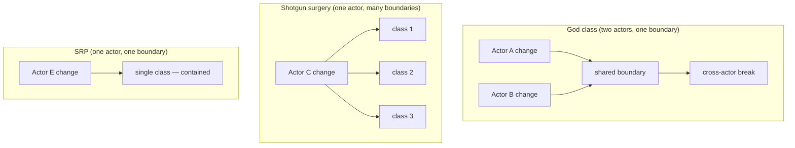
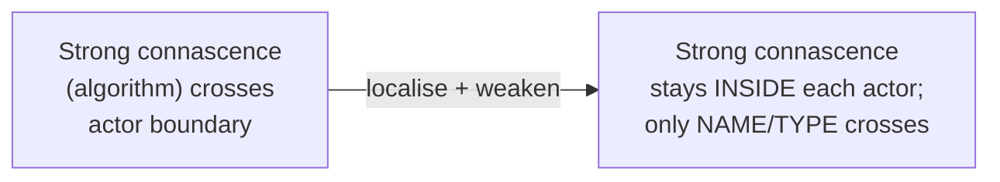

# Single Responsibility Principle (SRP) — Senior

> **Category:** [Design Principles → SOLID](../../README.md) — a class should have one, and only one, reason to change.

> **Prerequisites:** [Junior](junior.md) · [Middle](middle.md)
> **Focus:** **Theory** and **system-level trade-offs**

---

## Table of Contents

1. [Introduction](#introduction)
2. [SRP, Cohesion, and the Closure of Reasons-to-Change](#srp-cohesion-and-the-closure-of-reasons-to-change)
3. [SRP Through Connascence](#srp-through-connascence)
4. [SRP vs. Coupling: Two Forces in Tension](#srp-vs-coupling-two-forces-in-tension)
5. [Why "Reason to Change" Is Ambiguous — and How Actors Fix It](#why-reason-to-change-is-ambiguous--and-how-actors-fix-it)
6. [The Conway's Law Connection](#the-conways-law-connection)
7. [SRP at the Module and Service Boundary](#srp-at-the-module-and-service-boundary)
8. [SRP vs. Simplicity and Locality](#srp-vs-simplicity-and-locality)
9. [Advanced Examples](#advanced-examples)
10. [Liabilities](#liabilities)
11. [Pros & Cons at the System Level](#pros--cons-at-the-system-level)
12. [Diagrams](#diagrams)
13. [Related Topics](#related-topics)

---

## Introduction

> Focus: **theory** and **system-level reasoning**

At the senior level, SRP stops being "split classes by actor" and becomes a lens on a deeper question: **what is the unit of independent change in a system, and how do you align your boundaries with it?** SRP is one local heuristic for a global property — that the system should be *decomposable* so that each foreseeable change touches as few places as possible, and as few *teams* as possible.

This file covers the three things a senior must be able to reason about:

1. **The precise theory underneath SRP** — it is cohesion, and cohesion is best formalised as *[connascence](../../02-coupling-and-cohesion/03-connascence/)*. "One reason to change" is a statement about *connascence of meaning and execution* being kept local.
2. **The tension SRP lives in** — it can fight low coupling, simplicity, and locality. Splitting always adds elements; senior judgement is knowing when the actor boundary is worth the cost.
3. **The organisational dimension** — actors are *people*, so SRP is secretly about [Conway's Law](#the-conways-law-connection): aligning code boundaries with team boundaries.

---

## SRP, Cohesion, and the Closure of Reasons-to-Change

The cleanest senior framing of SRP is the **Common Closure Principle** (CCP), SRP's component-level sibling:

> **The classes in a component should be closed against the same kinds of changes. A change that affects the component affects all its classes and no others.**

SRP is CCP applied to a single class: a class should be *closed* against exactly one kind of change (one actor's). This reframes SRP as a statement about **closure** — you draw the boundary so that one reason-to-change is fully *contained* inside it and never leaks across it. A change either:

- stays entirely inside one class (good — the boundary captured the responsibility), or
- forces edits across several classes (bad — the responsibility was split across boundaries, i.e. **shotgun surgery**), or
- forces *unrelated* behaviour in the same class to break (bad — two responsibilities share a boundary, the classic god-class coupling).

SRP, then, is **maximising the closure of each reason-to-change**: every actor's changes fully contained, no actor's changes bleeding into another's. This is just **[functional cohesion](../../02-coupling-and-cohesion/02-maximise-cohesion/)** stated in change-terms — the highest, most desirable cohesion, where a module's elements are unified by serving one purpose for one actor.

> SRP is not really about classes at all. It's about ensuring each *axis of change* is captured by exactly one boundary — neither split across several (shotgun surgery) nor sharing one with a different axis (god class). Both failures are *misaligned closure*.

---

## SRP Through Connascence

"One reason to change" is vague; **[connascence](../../02-coupling-and-cohesion/03-connascence/)** (Meilir Page-Jones) makes it precise. Two elements are *connascent* if a change in one requires a corresponding change in the other to keep the system correct. SRP violations are, mechanically, **strong connascence that crosses an actor boundary.**

Consider the `Employee`/`regularHours()` bug from the junior level: `calculatePay()` and `reportHours()` share a helper, so they are bound by **connascence of algorithm** (both rely on the same hour-computation logic). That connascence is fine *if both belong to one actor*. The defect is that the two methods answer to **different actors** — so a change driven by one actor propagates, via the connascence, into the other's behaviour. SRP's prescription ("separate things that change for different reasons") is exactly: **do not let connascence span an actor boundary.**

This gives a sharper rule than "one reason to change":

> **Keep strong connascence inside an actor boundary; allow only weak connascence (name, type) to cross it.**

The three connascence properties map directly onto SRP refactoring:

| Connascence property | SRP move |
|---|---|
| **Strength** (weaken it) | Replace a shared mutable helper (algorithm/execution connascence) with separate, named code per actor — degrading cross-boundary connascence to mere *name* connascence. |
| **Locality** (localise it) | Pull each actor's strongly-connascent code into one class, so the strong connascence stays *inside* the boundary. |
| **Degree** (lower it) | Fewer elements entangled across actors. |

So the senior reframing of SRP: **don't "separate responsibilities" — localise strong connascence within actor boundaries and weaken any that must cross them.** This instantly explains why splitting a `Stack` is wrong (its methods are strongly connascent *and* serve one actor — keep them together) and why splitting `Employee` is right (strong connascence spanning three actors — break it).

---

## SRP vs. Coupling: Two Forces in Tension

A naive reading is "SRP reduces coupling." It does — *across actor boundaries.* But splitting can also *increase* coupling of another kind, and seniors must see both effects.

When you extract `PayCalculator`, `HourReporter`, and `EmployeeRepository` from `Employee`, you:

- **Reduce coupling between actors** (accounting's changes no longer reach operations' code). ✅
- **Introduce structural coupling between the new classes** — they must now collaborate, be wired together, and agree on shared data (`EmployeeData`). They are coupled by *name and type* (weak connascence), which is the *good* trade. ⚠️

The senior judgement: SRP is worth it when it **trades strong, hidden, cross-actor coupling (connascence of meaning/algorithm) for weak, explicit, structural coupling (connascence of name/type).** That trade almost always pays off — explicit weak coupling is visible and cheap; hidden strong coupling is the source of the "why did *that* break?" bugs. But the trade is *not free*, and when there's only one actor, you'd be adding weak coupling and indirection for no reduction in strong coupling — a net loss. **No second actor → no coupling to reduce → don't split.**

---

## Why "Reason to Change" Is Ambiguous — and How Actors Fix It

Uncle Bob himself acknowledged that "reason to change" is the weakest phrasing, because *everything* can change for many reasons and engineers argue endlessly about whether two changes are "the same reason." The **actor** reframing resolves this by grounding "reason" in something observable: a **person or role who requests changes**.

This matters because it makes SRP **falsifiable in a design review**:

- "Is logging a separate responsibility from order processing?" — unanswerable in the abstract.
- "Does a *different stakeholder* request logging changes than order-processing changes?" — usually yes (platform/observability team vs. the product team) → separate responsibilities. Answerable.

The actor lens also exposes a non-obvious truth: **responsibilities are not intrinsic to the code; they are intrinsic to the organisation around it.** The *same* class can be SRP-compliant in one company and a violation in another, depending on whether the concerns it bundles map to one team or several. There is no universal, context-free decomposition — which is why SRP is a *design* skill, not a mechanical rule.

---

## The Conway's Law Connection

If actors are *people*, then SRP is, at bottom, an instance of **Conway's Law**:

> *Organisations design systems that mirror their communication structures.*

SRP says: align each module with **one actor** — i.e., **one team / one stakeholder**. Do this and you get the property Conway's Law predicts is healthy: a change requested by one team touches code owned by that team, reviewed by that team, deployed by that team — with no cross-team coordination. Violate SRP and you get the pathology: two teams share a file, every change needs the *other* team's review, and merge conflicts and coordination overhead tax every change.

> SRP is Conway's Law applied at the class level: **make code boundaries match team (actor) boundaries**, so the cost of change stays inside one team.

This is why senior SRP decisions are inseparable from org design. When you split `Employee` by CFO/COO/CTO actors, you are pre-aligning the code with the three departments that will request the changes — so future changes stay single-team. The "inverse Conway maneuver" (shaping teams to get the architecture you want) is the same insight run in reverse.

---

## SRP at the Module and Service Boundary

SRP scales from classes to components to microservices, and the actor framing scales with it:

| Scope | "One responsibility" | Misaligned-closure failure |
|---|---|---|
| Class | One actor | God class / shotgun surgery |
| Component / package | One reason-to-change family (CCP) | A change rebuilds half the system |
| Microservice | One bounded context / business capability | The "distributed monolith" — one change redeploys many services |

The **distributed monolith** is SRP failure at the service tier: services split by *technical layer* (a "validation service," a "formatting service") rather than by *business capability* (actor), so a single feature change ripples across every service — shotgun surgery over the network, the most expensive form. Conversely, a service that owns *several* business capabilities is a god-service. The same actor test applies: **split services where different stakeholders drive change, keep together what changes for one reason.** (See Event-Driven Architecture for how bounded contexts realise this.)

> The most expensive SRP violations are not in classes — they are in service boundaries, because there the "shotgun surgery" of a misaligned change becomes a multi-team, multi-deploy, distributed-transaction problem.

---

## SRP vs. Simplicity and Locality

SRP is in genuine, irreducible tension with two other goods, and a senior must hold the trade-off honestly.

**SRP vs. simplicity ([KISS](../../01-generic/01-kiss/) / fewest elements).** Every split *adds* elements: a class, an interface, a constructor, a line of wiring. [Simple design's "fewest elements" rule](../../../craftsmanship-disciplines/04-simple-design/) pushes *against* eager splitting. The resolution: SRP earns its elements only when there's a *real second actor*. Splitting for an imagined actor is **speculative generality** — an SRP-flavoured [YAGNI](../../01-generic/02-yagni/) violation.

**SRP vs. locality of behaviour.** There is real value in being able to read one cohesive unit top-to-bottom without jumping between files. Over-applied SRP destroys this: the logic for one *feature* is smeared across fifteen single-method classes, and no file tells the whole story. "Locality of behaviour" (the principle that code that changes together should be *readable* together) can pull *against* SRP's separation. The reconciliation is, again, the actor: **separate by actor (different reasons), keep local what serves one actor (same reason).** When you find yourself jumping across files to understand *one actor's* logic, you've over-split.

```text
   UNDER-SPLIT                SWEET SPOT                 OVER-SPLIT
   god class                  one class / actor          class explosion
   ──────────────             ──────────────             ──────────────
   strong cross-actor         strong connascence         feature logic smeared
   connascence (bugs)         localised per actor        across files (no locality)
   fails SRP                  ✅                         fails KISS + locality
```

---

## Advanced Examples

### Localising connascence: weakening a cross-actor shared helper (Java)

```java
// BEFORE — connascence of ALGORITHM crosses an actor boundary.
class Employee {
    private double regularHours() { /* overtime policy — finance's rule */ }
    double calculatePay()  { return regularHours() * rate * payMultiplier(); } // CFO
    Hours  reportHours()   { return new Hours(regularHours()); }               // COO
    // COO edits regularHours() → silently changes CFO's pay. Cross-actor bug.
}

// AFTER — each actor owns its own, named computation. Cross-boundary
// connascence degraded from ALGORITHM to NAME (they merely agree on a type).
class PayCalculator {                    // CFO actor
    Money calculatePay(Timesheet t) {
        return payableHours(t).times(rate).times(payMultiplier());
    }
    private Hours payableHours(Timesheet t) { /* finance's overtime policy */ }
}
class HourReporter {                     // COO actor
    Hours reportHours(Timesheet t) { /* operations' counting rule */ }
}
```

The two `…Hours` computations were *coincidentally* identical; binding them via a shared helper manufactured cross-actor connascence. Splitting them — even at the cost of a little duplication — is correct, because they answer to different actors and *will diverge*. (This is the "prefer duplication to the wrong abstraction" insight, now grounded in SRP.)

### A facade preserving SRP without a god class (TypeScript)

```typescript
// Each collaborator has ONE actor. The use-case object has ONE responsibility:
// the registration WORKFLOW (which itself has a single reason to change — the steps).
class RegisterUser {
  constructor(
    private users: UserRepository,    // DBA
    private email: WelcomeMailer,     // infra
    private audit: AuditLog,          // compliance
  ) {}
  async execute(cmd: RegisterCommand): Promise<void> {
    const user = User.create(cmd);    // domain rule — business actor
    await this.users.save(user);
    await this.email.sendWelcome(user);
    this.audit.record("user.registered", user.id);
  }
}
```

`RegisterUser` touches four actors' worth of *collaborators* but *implements* none of their concerns — it only sequences them. Orchestration is one responsibility. This is how you keep a single, readable entry point (locality of the *workflow*) while every implementation concern stays SRP-isolated.

---

## Liabilities

### Liability 1: "SRP" as a license for class explosion

The most common senior-level failure is over-application: splitting per *operation* instead of per *actor*, producing a dust cloud of one-method classes. This destroys locality and causes shotgun surgery — the inverse of the disease SRP treats. Split by actor; stop there.

### Liability 2: Confusing technical layers with responsibilities

Splitting by *mechanism* (a "ValidationService," a "MappingService") rather than by *actor/capability* yields anaemic, ripple-prone designs — the distributed monolith at the service tier, the lasagna of forwarding layers at the class tier. Responsibilities are defined by *who drives change*, not by technical role.

### Liability 3: Treating responsibilities as context-free

Believing there's a universal "correct" decomposition. The actor boundary depends on *your* organisation; importing another company's split (or a framework's) without checking your own actors yields boundaries that don't match your change pressure.

### Liability 4: Anaemic-domain over-correction

Mishearing "move persistence/presentation out of the model" as "models must hold no behaviour at all," producing anaemic data bags with all logic in procedural services. SRP permits — indeed encourages — domain behaviour on the model, *as long as it's one actor's* (the business's). The error is mixing actors, not having logic.

---

## Pros & Cons at the System Level

| Dimension | Strong SRP (split by actor) | Weak SRP (cohesive god classes) |
|---|---|---|
| Change isolation | High — one actor's change stays in one class | Low — actors collide in shared files |
| Accidental coupling (cross-actor bugs) | Low | High — the "why did that break?" defect |
| Team parallelism | High — code boundaries match teams (Conway) | Low — cross-team coordination per change |
| Testability | High — test one concern without unrelated machinery | Low — must stand up DB/mailer to test a formula |
| Element count / simplicity | Lower — more classes, wiring, indirection | Higher — fewer moving parts |
| Locality of behaviour | Lower if over-split — feature logic spread | Higher — but tangled with other actors |
| Navigation cost | Higher if over-split | Lower (until the god class grows) |
| Best when | Multiple real, diverging actors | One real actor; small program |

The senior synthesis: SRP wins decisively on **change isolation, accidental-coupling avoidance, team parallelism, and testability** — and loses on **element count and (if over-applied) locality/navigation**. Because the winning columns are about *cost of change* and the losing columns are about *cost of reading*, and most software is read-then-changed-many-times, SRP pays off *whenever there's a genuine second actor* — and is a net cost when there isn't.

---

## Diagrams

### Misaligned closure: the two SRP failure modes



### SRP as localised connascence



---

## Related Topics

- **The underlying theory:** [Connascence](../../02-coupling-and-cohesion/03-connascence/), [Maximise Cohesion](../../02-coupling-and-cohesion/02-maximise-cohesion/), [Minimise Coupling](../../02-coupling-and-cohesion/01-minimise-coupling/).
- **In tension with:** [KISS](../../01-generic/01-kiss/), [YAGNI](../../01-generic/02-yagni/), [Simple Design](../../../craftsmanship-disciplines/04-simple-design/).
- **Sibling SOLID:** [Interface Segregation](../04-isp-interface-segregation/) (SRP for interfaces), [Open/Closed](../02-ocp-open-closed/).
- **How the five interlock:** [SOLID as a Whole and Smells](../06-solid-as-a-whole-and-smells/).

---


---

## Check your understanding

1. Explain Single Responsibility Principle (SRP) — Senior Level in your own words and name the problem it solves.
2. How would you apply the ideas around Table of Contents, Introduction, SRP, Cohesion, and the Closure of Reasons-to-Change in a realistic engineering change?
3. What failure mode or misuse should you look for, and what evidence would reveal it?
4. How would you validate a system-level decision about Single Responsibility Principle (SRP) — Senior Level under uncertainty?
5. What observable result would convince you that the approach improved the system?
