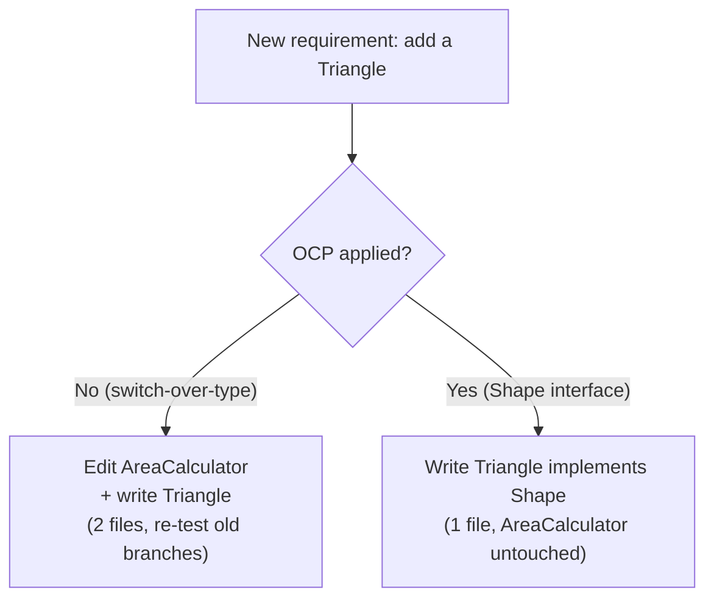

# Open/Closed Principle (OCP) — Junior

> **Category:** [Design Principles → SOLID](../../README.md) — the second of the five SOLID principles: add new behavior by writing new code, not by editing code that already works.

---

## Table of Contents

1. [Introduction](#introduction)
2. [Prerequisites](#prerequisites)
3. [Glossary](#glossary)
4. [What the Principle Says](#what-the-principle-says)
5. [Why "Closed" and "Open" at the Same Time?](#why-closed-and-open-at-the-same-time)
6. [The Mechanism: Abstraction + Polymorphism](#the-mechanism-abstraction--polymorphism)
7. [Real-World Analogies](#real-world-analogies)
8. [Mental Models](#mental-models)
9. [A Worked Example: The Area Calculator](#a-worked-example-the-area-calculator)
10. [Code Examples](#code-examples)
11. ["Closed Against What?"](#closed-against-what)
12. [Best Practices](#best-practices)
13. [Common Mistakes](#common-mistakes)
14. [Tricky Points](#tricky-points)
15. [Test Yourself](#test-yourself)
16. [Cheat Sheet](#cheat-sheet)
17. [Summary](#summary)
18. [Further Reading](#further-reading)
19. [Related Topics](#related-topics)
20. [Diagrams](#diagrams)

---

## Introduction

> Focus: **What is it?** and **How to use it?**

The **Open/Closed Principle (OCP)** is a one-sentence rule with a deceptively large payoff:

> **Software entities (classes, modules, functions) should be open for extension, but closed for modification.**
> — Bertrand Meyer, *Object-Oriented Software Construction* (1988)

Read literally that sounds like a contradiction — how can something be *open* and *closed* at once? The resolution is the whole point of the principle:

- **Open for extension** — you can give the entity *new behavior* when requirements grow.
- **Closed for modification** — you do that **without editing the entity's existing, tested source code.**

In plain terms: **when a new requirement arrives, you should be able to satisfy it by adding new code, not by going back and changing code that already works.** Adding a new payment method, a new file format, a new report type, a new shape — ideally none of these forces you to reopen and re-edit the module that already handles the existing cases.

### Why this matters

Every time you edit working, tested code, you risk breaking it. You might introduce a bug in a case you weren't even thinking about, force a re-test of the whole module, and create a merge conflict with whoever else touched the file. Code that you keep editing is code that keeps breaking.

OCP's promise is that the *core* of your system — the part that's hard to get right and expensive to break — becomes **stable**. New features land as new, isolated pieces. The old code is never touched, so it can't regress. That's the difference between a system that gets *safer* to change as it grows and one that gets *scarier*.

---

## Prerequisites

- **Required:** Comfort with **classes, interfaces, and inheritance** in at least one OO language (Java, C#, TypeScript, Python).
- **Required:** Understanding of **polymorphism** — calling the same method on different objects and getting different behavior. This is the engine OCP runs on.
- **Helpful:** The first SOLID principle, [Single Responsibility](../01-srp-single-responsibility/junior.md) — OCP works best when each class already has one job.
- **Helpful:** [YAGNI](../../01-generic/02-yagni/junior.md) — because OCP can be *over*-applied, and YAGNI is the brake.

---

## Glossary

| Term | Definition |
|------|-----------|
| **Open for extension** | New behavior can be added to the system. |
| **Closed for modification** | Existing, working source code is not edited to add that behavior. |
| **Abstraction** | An interface or abstract type that hides *which* concrete implementation is used (e.g., a `Shape` interface). |
| **Polymorphism** | One call site invoking different implementations depending on the object's runtime type. |
| **Axis of variation** | The specific direction in which a system is expected to change (e.g., "new shapes," "new payment methods"). |
| **Extension point / seam** | A place (usually an interface) where new behavior can be plugged in without editing existing code. |
| **Plugin architecture** | A design where new features are added as separate modules that the core discovers and uses, never edits. |
| **Speculative abstraction** | An extension point built for a variation that hasn't actually arrived — the over-application of OCP. |

---

## What the Principle Says

OCP has **two famous formulations**, and knowing both prevents confusion:

1. **Bertrand Meyer's original (1988)** framed it around inheritance: a class is *closed* (it's compiled, used, depended upon) yet remains *open* because you can create a subclass that extends it. You add behavior in the subclass, leaving the parent untouched.

2. **Robert C. Martin's (Uncle Bob's) reformulation** — the version most people mean today — is **polymorphic**: depend on an **abstraction** (an interface), and add new behavior by writing a **new implementation** of that abstraction. The code that uses the abstraction never changes; you just hand it a new implementor.

> The modern, practical reading: **isolate the thing that varies behind an abstraction, then add new variants as new classes that implement the abstraction.** The code that depends on the abstraction is "closed" — it never sees the new variant's existence.

Both formulations share one idea: **new behavior comes from new code, plugged in through a stable interface — not from surgery on old code.**

---

## Why "Closed" and "Open" at the Same Time?

The trick is that "open" and "closed" describe **two different things**:

- A module is **closed for modification** with respect to its **source code** — you don't edit it.
- A module is **open for extension** with respect to its **behavior** — its behavior can grow.

A good interface is exactly the device that lets both be true. The interface is fixed (closed), but the set of things implementing it can grow forever (open).

```
        ┌─────────────────────────────────────────┐
        │   CLOSED: this code never changes        │
        │   when you add a new variant             │
        │   ┌─────────────────────────────────┐    │
        │   │  uses  ──►  «interface» Shape    │    │  ← the stable seam
        │   └─────────────────────────────────┘    │
        └─────────────────────────────────────────┘
                      ▲           ▲           ▲
                      │           │           │
                  Circle      Rectangle    Triangle  ← OPEN: add new
                  (existing)   (existing)   (NEW)        implementors freely
```

---

## The Mechanism: Abstraction + Polymorphism

OCP is not magic; it is **abstraction plus polymorphism**, used deliberately.

1. **Find what varies.** Identify the behavior that changes from case to case (the shape's area formula, the payment provider, the export format).
2. **Hide it behind an abstraction.** Define an interface that captures *what* must happen (`double area()`), not *how* any particular case does it.
3. **Depend on the abstraction, never the concretes.** The calling code holds a `Shape`, not a `Circle` or `Rectangle`.
4. **Add new behavior as new implementations.** A new requirement = a new class implementing the interface. Nothing existing is edited.

The classic giveaway that OCP is being *violated* is a `switch`/`if`-ladder over a **type**:

```python
if shape_type == "circle":   ...
elif shape_type == "square": ...
elif shape_type == "triangle": ...   # every new type edits THIS function
```

Every new type forces you back into that function. Polymorphism dissolves the ladder: each type knows how to compute its own area, and the calling code just asks.

---

## Real-World Analogies

| Concept | Analogy |
|---|---|
| **Open for extension** | A power strip with empty sockets — you can plug in new devices without rewiring the wall. |
| **Closed for modification** | The wall socket's shape is fixed. Manufacturers build new appliances to fit the socket; nobody re-cuts the wall for each new toaster. |
| **The abstraction (interface)** | The standard plug shape — the agreed contract that lets old wall and new device cooperate without either knowing the other's internals. |
| **`switch`-over-type smell** | A vending machine where adding a new snack means re-welding the chassis, instead of just loading a new tray. |
| **Plugin architecture** | A browser: new extensions add behavior; you never recompile the browser to install one. |

---

## Mental Models

**The one-liner:** *"To add a feature, write a new class — don't reopen an old one."*

```
        NEW REQUIREMENT
              │
   ┌──────────┴───────────┐
   │  OCP-friendly?       │
   └──────────┬───────────┘
         yes  │  no
   ┌──────────┘  └───────────────┐
   ▼                             ▼
 ADD a new class             EDIT the existing
 implementing the            switch / if-ladder
 interface.                   (risk of regression,
 (old code untouched)          re-test everything)
```

A second model: **the stable spine and the growing ribs.** The interface is a spine — rigid, unchanging. Implementations are ribs you can keep attaching. The spine's stability is what makes attaching new ribs safe.

A third: **think of editing tested code as a tax.** Every edit costs re-reading, re-testing, and risk. OCP is a way to *not pay that tax* for the common case of "add one more variant."

---

## A Worked Example: The Area Calculator

The canonical OCP example. We must compute the total area of a list of shapes.

### Start: a type-switching violation

```java
class AreaCalculator {
    double area(Object shape) {
        if (shape instanceof Circle c) {
            return Math.PI * c.radius * c.radius;
        } else if (shape instanceof Rectangle r) {
            return r.width * r.height;
        }
        throw new IllegalArgumentException("Unknown shape");
    }
}
```

This **works** today. But watch what happens when product asks for triangles: you must **reopen `AreaCalculator`**, add an `else if`, re-test it, and risk breaking the circle and rectangle branches. Add a pentagon next week and you do it again. `AreaCalculator` is *open for modification* — every new shape edits it. That is the violation.

### Fix: an abstraction the shapes implement

```java
interface Shape {
    double area();          // the stable contract — the "closed" seam
}

record Circle(double radius) implements Shape {
    public double area() { return Math.PI * radius * radius; }
}

record Rectangle(double width, double height) implements Shape {
    public double area() { return width * height; }
}

class AreaCalculator {
    double totalArea(List<Shape> shapes) {
        return shapes.stream().mapToDouble(Shape::area).sum();
    }
}
```

Now add a triangle:

```java
record Triangle(double base, double height) implements Shape {
    public double area() { return 0.5 * base * height; }
}
```

**`AreaCalculator` is not touched.** No `else if`, no re-test of existing branches, no merge conflict with the person who owns the calculator. The new behavior is a new class. `AreaCalculator` is now **closed for modification** (it never changes when shapes are added) and the *system* is **open for extension** (any number of new `Shape`s can appear).

> The diagnostic: in the "before" version, "add a shape" touched **two** files (the new shape *and* the calculator). In the "after" version, it touches **one** (just the new shape). That reduction is OCP in action.

---

## Code Examples

### TypeScript — the Strategy pattern *is* OCP

A discount system that must support new discount rules over time.

```typescript
// The stable abstraction (closed)
interface DiscountPolicy {
  apply(price: number): number;
}

class NoDiscount implements DiscountPolicy {
  apply(price: number) { return price; }
}

class PercentageDiscount implements DiscountPolicy {
  constructor(private rate: number) {}
  apply(price: number) { return price * (1 - this.rate); }
}

// Closed: this never changes when a new policy appears
class Checkout {
  constructor(private policy: DiscountPolicy) {}
  total(price: number) { return this.policy.apply(price); }
}

// OPEN: a brand-new rule is a brand-new class — Checkout untouched
class BlackFridayDiscount implements DiscountPolicy {
  apply(price: number) { return Math.max(price - 50, price * 0.5); }
}
```

`Checkout` depends on the *abstraction* `DiscountPolicy`. New rules plug in; `Checkout` is closed. This is the **Strategy pattern**, and Strategy is one of the most direct realizations of OCP.

### Python — replacing a type-switch with polymorphism

```python
# BEFORE — violates OCP: every new format edits this function
def serialize(report, fmt):
    if fmt == "json":
        return to_json(report)
    elif fmt == "csv":
        return to_csv(report)
    # new format => reopen and edit this function

# AFTER — open for extension via an abstraction
from abc import ABC, abstractmethod

class Serializer(ABC):
    @abstractmethod
    def serialize(self, report) -> str: ...

class JsonSerializer(Serializer):
    def serialize(self, report): return to_json(report)

class CsvSerializer(Serializer):
    def serialize(self, report): return to_csv(report)

def export(report, serializer: Serializer) -> str:
    return serializer.serialize(report)   # closed; new formats are new classes
```

### Python — higher-order functions: OCP without a class

OCP doesn't require interfaces. A function that *takes a function* is open for extension too:

```python
def total_cost(items, pricing_rule):
    return sum(pricing_rule(item) for item in items)

# Extend by passing a NEW rule — total_cost never changes
total_cost(cart, lambda i: i.price)                       # base
total_cost(cart, lambda i: i.price * 0.9)                 # 10% off
total_cost(cart, lambda i: i.price * (0.5 if i.clearance else 1))
```

`total_cost` is closed for modification; the *rule* is the extension point. **OCP is about the shape of dependency, not about any particular keyword.**

---

## "Closed Against What?"

This is the single most important nuance, and the thing juniors miss most:

> **You cannot make a module closed against *all* possible changes — only against a *specific, chosen* kind of change.**

The `AreaCalculator` is closed against **new shapes**. It is *not* closed against, say, "areas must now be computed in square meters with unit conversion" — that might require reopening it. You picked an **axis of variation** ("new shapes will be added") and protected against *that* axis. A different axis would need a different abstraction.

This has two consequences you must internalize:

1. **You have to predict the *likely* axis of variation.** Good OCP requires guessing *which direction* the code will grow. Guess right and new features are free. Guess wrong and you built an abstraction nobody uses while the *real* change still forces edits.
2. **Don't abstract every axis "just in case."** Building extension points for variations that never arrive is **speculative abstraction** — needless indirection that makes the code harder to read for no benefit. This is where OCP collides with **[YAGNI](../../01-generic/02-yagni/junior.md)**: apply OCP to the axis you have *evidence* will vary (usually after you've seen it vary once or twice), not to every axis you can imagine. See [Encapsulate What Changes](../../03-module-and-class/01-encapsulate-what-changes/junior.md) — find the *actual* hotspot of change and wrap *that*.

The honest senior framing, explored more at the [Middle](middle.md) and [Senior](senior.md) levels: **OCP is a bet on where change will happen. A simple `if` is the correct design until you have a reason to believe that particular `if` will keep growing.**

---

## Best Practices

1. **Spot the type-switch.** A `switch`/`if`-ladder over a *type* or *kind* is the textbook OCP-violation smell. It's the first candidate for an abstraction.
2. **Depend on abstractions for the varying part.** Calling code should hold the interface (`Shape`, `DiscountPolicy`), never the concrete classes.
3. **Add behavior as new classes/functions**, not as new branches in old ones.
4. **Choose the axis from evidence, not imagination.** Abstract the variation you've actually seen change — usually after the second or third occurrence (the *rule of three*).
5. **Combine with the right pattern.** Strategy, Template Method, Decorator, and plugin registries are all standard OCP mechanisms — see Design Patterns.
6. **Let OCP emerge.** Start with the simple `if`; introduce the abstraction the moment a new requirement would otherwise force you to edit working code.

---

## Common Mistakes

1. **Editing the switch again and again.** Treating "add another `else if`" as normal. Each addition is an OCP violation and a regression risk.
2. **Abstracting too early (speculative OCP).** Building a `Shape` interface, a factory, and a registry for a program that has exactly one shape. That's indirection without payoff — a YAGNI violation wearing OCP's clothes.
3. **Choosing the wrong axis.** Protecting against "new shapes" when the real churn is "new *operations* on shapes" (area, perimeter, render) — now every new operation edits *every* shape class. (This is the classic "expression problem"; see [Senior](senior.md).)
4. **Leaking the concrete type.** Casting back to `Circle` inside the calculator (`if (shape instanceof Circle)`) re-introduces the very switch you removed.
5. **Confusing OCP with "never change code ever."** You *do* change code — to fix bugs, to add the abstraction in the first place. OCP is about not editing existing code to add *new variants*.

---

## Tricky Points

- **"Closed" is relative, never absolute.** A module is closed *against a particular axis of variation*, not against all change. Stating "closed for modification" without "closed against *what*" is meaningless.
- **OCP can be over-applied.** An interface with one implementation that will never get a second is needless indirection — the opposite of simple. OCP is a *response to observed variation*, not a default.
- **The `instanceof`/`switch`-over-type smell vs. a legitimate switch.** A switch over a *closed, fixed set* that genuinely never grows (e.g., the four suits in a deck of cards) is fine — OCP earns its keep only when the set is *expected to grow*.
- **OCP and DIP are siblings.** "Depend on an abstraction" is also the [Dependency Inversion Principle](../05-dip-dependency-inversion/junior.md). OCP is *why* you'd want that abstraction; DIP is the rule about *which way the dependency points*. They almost always show up together.

---

## Test Yourself

1. State the Open/Closed Principle and explain how something can be open and closed at once.
2. What is the textbook code smell that signals an OCP violation?
3. What two ingredients make OCP work mechanically?
4. What does "closed against *what*?" mean, and why can't you be closed against everything?
5. How does OCP relate to YAGNI — when should you *not* apply it?
6. Name a design pattern that is a direct realization of OCP.

---

## Cheat Sheet

```text
OPEN/CLOSED PRINCIPLE (OCP) — SOLID #2
  Definition:  open for EXTENSION, closed for MODIFICATION
  Meaning:     add new behavior by adding new code,
               NOT by editing existing, tested code

SMELL THAT SCREAMS "OCP":
  switch/if-ladder over a TYPE   →  every new type edits this function

THE MECHANISM
  1. find what varies
  2. hide it behind an ABSTRACTION (interface / function type)
  3. depend on the abstraction, never the concretes
  4. add new behavior as a NEW implementation (old code untouched)

"CLOSED AGAINST WHAT?"
  you close against ONE chosen axis of variation, not all change.
  pick the axis from evidence, not imagination.

WATCH OUT (the YAGNI brake)
  one-implementation interface "for the future" = speculative abstraction.
  apply OCP to variation you've SEEN, not variation you imagine.

PATTERNS THAT ARE OCP:  Strategy, Template Method, Decorator, plugins
SIBLING PRINCIPLE:      Dependency Inversion (depend on abstractions)
```

---

## Summary

- **OCP:** software entities should be **open for extension, closed for modification** — add new behavior with new code, not by editing existing, tested code.
- The contradiction dissolves because "open" refers to **behavior** and "closed" refers to **source code**: a stable interface, growing set of implementations.
- The **mechanism is abstraction + polymorphism**; the **smell is a `switch`/`if`-ladder over a type.**
- You are only ever **closed against a chosen axis of variation** — pick it from evidence, because predicting the wrong axis wastes the abstraction.
- OCP is constrained by **[YAGNI](../../01-generic/02-yagni/junior.md)**: don't build extension points for variation that hasn't arrived. The simple `if` is correct until the code shows you it will keep growing.

---

## Further Reading

- Bertrand Meyer, *Object-Oriented Software Construction* (1988) — the origin of the principle.
- Robert C. Martin, *Agile Software Development: Principles, Patterns, and Practices* — the polymorphic reformulation and the shape example.
- Robert C. Martin, ["The Open-Closed Principle"](https://blog.cleancoder.com/uncle-bob/2014/05/12/TheOpenClosedPrinciple.html) — concise modern restatement.
- *Design Patterns* (Gang of Four) — Strategy, Template Method, Decorator as OCP mechanisms.

---

## Related Topics

- **Sibling principle:** [Dependency Inversion (DIP)](../05-dip-dependency-inversion/junior.md) — "depend on abstractions," the other half of OCP.
- **Prerequisite SOLID rule:** [Single Responsibility (SRP)](../01-srp-single-responsibility/junior.md).
- **The brake on OCP:** [YAGNI](../../01-generic/02-yagni/junior.md) and [Encapsulate What Changes](../../03-module-and-class/01-encapsulate-what-changes/junior.md).
- **Patterns that realize OCP:** Design Patterns — Strategy, Decorator, Template Method.

---

## Diagrams

### OCP turns "edit two files" into "add one file"



### The closed seam, the open implementors


---

## Check your understanding

1. Explain Open/Closed Principle (OCP) — Junior Level in your own words and name the problem it solves.
2. How would you apply the ideas around Table of Contents, Introduction, Prerequisites in a realistic engineering change?
3. What failure mode or misuse should you look for, and what evidence would reveal it?
4. What small example would prove that you can apply Open/Closed Principle (OCP) — Junior Level correctly?
5. What observable result would convince you that the approach improved the system?
