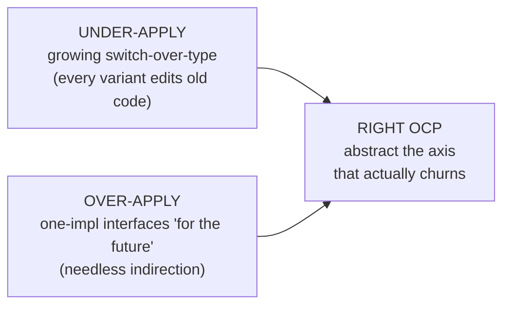
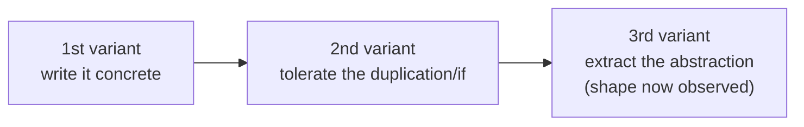

# Open/Closed Principle (OCP) — Middle

> **Category:** [Design Principles → SOLID](../../README.md) — add new behavior by writing new code, not by editing code that already works.

> **Prerequisite:** [Junior](junior.md)
> **Focus:** **Why** and **When**

---

## Introduction

> Focus: **Why** and **When**

At the junior level OCP is a definition and a refactor: *replace the type-switch with an interface.* At the middle level it becomes a **judgement call you make repeatedly**: *Is this the axis that will actually vary? Have I seen enough change to justify the abstraction, or am I building indirection for a future that may never come?*

The recurring tension is between **two failure modes**, and they are symmetrical:

- **Under-applying OCP** — a `switch`-over-type that grows every sprint, so each new variant edits and re-tests working code. Brittle.
- **Over-applying OCP** — interfaces, factories, and registries for variations that never materialize. Needless indirection that makes the code harder to read with no payoff (a [YAGNI](../../01-generic/02-yagni/middle.md) violation).

The middle-level skill is calibrating between them, and the calibration tools are **evidence of variation** and the **rule of three**.

---

## Applying OCP to Real Code

Consider a notification feature that starts simple and grows. The first version:

```python
def notify(user, message):
    send_email(user.email, message)      # one channel, works, ship it
```

Then product asks for SMS. The tempting (and wrong) move is a flag:

```python
def notify(user, message, channel="email"):
    if channel == "email":  send_email(user.email, message)
    elif channel == "sms":  send_sms(user.phone, message)
    # next: push? slack? each one re-opens this function
```

That `elif` ladder is the OCP violation. Now there's *evidence of an axis* — "channels will keep being added" — so the abstraction is earned:

```python
from abc import ABC, abstractmethod

class Channel(ABC):
    @abstractmethod
    def send(self, user, message): ...

class EmailChannel(Channel):
    def send(self, user, message): send_email(user.email, message)

class SmsChannel(Channel):
    def send(self, user, message): send_sms(user.phone, message)

def notify(user, message, channel: Channel):
    channel.send(user, message)          # closed: never edited for a new channel
```

A Slack channel is now a new class, not an edit to `notify`. The key insight: **we did not abstract on day one.** We abstracted when the *second* requirement proved the axis was real. The first single-channel version was *correct* OCP-wise — there was no variation to be open against yet.

> The discipline isn't "always build the channel abstraction." It's: build it **the day a second channel becomes a real requirement**, not the day you imagine one might.

---

## Choosing the Axis of Variation

This is the heart of middle-level OCP. **You can only be closed against one axis of variation at a time, and choosing the wrong one is worse than choosing none.**

Take a reporting system. Two plausible axes:

| Axis you protect | New "free" change | Change that still forces edits |
|---|---|---|
| **New report *types*** (interface `Report`, each type a class) | Add a `SalesReport`, `TaxReport` — free | Add a new *operation* (export to PDF) → edit *every* report class |
| **New *operations*** (visitor over a fixed report set) | Add `exportPdf`, `summarize` — free | Add a new *report type* → edit *every* operation |

You cannot have both cheap with a single inheritance hierarchy — this is the **expression problem** (covered at [Senior](senior.md)). The middle-level takeaway: **abstract the axis that actually churns.** If your history shows new report *types* arriving monthly and operations rarely changing, protect against types. If operations churn and types are stable, protect against operations. **Look at the git history of the module — the axis that has changed before is the axis that will change again.**

> Choosing the axis is a *prediction*. The best predictor is the past: the dimension that has varied is the dimension to make open. Guessing from imagination is how you end up with the wrong abstraction.

---

## Mechanisms Across Paradigms

OCP is not tied to interfaces or inheritance. The *shape of dependency* is what matters: **depend on something pluggable, extend by supplying a new plug.**

| Mechanism | How it achieves OCP | Typical language |
|---|---|---|
| **Inheritance** (Meyer's original) | Subclass extends behavior; base class untouched | Any OO |
| **Interface + polymorphism** (Strategy) | New implementation of a stable interface | Java, C#, TS |
| **Composition / delegation** | Inject a collaborator that holds the varying behavior | Any OO |
| **Higher-order functions** | Pass a function as the extension point | Python, JS, Go, FP |
| **Configuration / data** | Move the varying part into a table/config the code reads | Any |
| **Plugin registry** | New modules register themselves; core discovers them | Any |

### Higher-order function form (TypeScript)

```typescript
// Closed: sortBy never changes when a new ordering is needed
function sortBy<T>(items: T[], key: (item: T) => number): T[] {
  return [...items].sort((a, b) => key(a) - key(b));
}

sortBy(orders, o => o.total);        // extend by passing a NEW key fn
sortBy(orders, o => o.createdAt);    // no edit to sortBy
```

### Configuration/data form (Python)

```python
# Closed: the dispatcher never changes; new commands add a registry entry
HANDLERS = {}

def command(name):
    def register(fn):
        HANDLERS[name] = fn
        return fn
    return register

@command("refund")
def handle_refund(order): ...

@command("ship")          # NEW command — dispatcher untouched
def handle_ship(order): ...

def dispatch(name, order):
    return HANDLERSname
```

The decorator-driven registry is OCP without a single interface keyword: the dispatcher is closed, and new behaviors register themselves. **OCP is a property of the dependency structure, not of any particular syntax.**

---

## OCP and the Open/Closed via Dependency Injection

OCP and **[Dependency Inversion (DIP)](../05-dip-dependency-inversion/middle.md)** are almost always used together, and middle engineers should understand the division of labor:

- **OCP** says: *the varying behavior should live behind an abstraction so new variants don't edit existing code.*
- **DIP** says: *high-level code should depend on that abstraction, not on the concrete variant — and the concrete is supplied from outside.*
- **Dependency injection** is the *mechanism*: the concrete implementation is handed in (constructor, parameter, container) rather than constructed internally.

```java
// OCP gives you the seam; DI supplies the implementation through it
class OrderService {
    private final PaymentGateway gateway;          // abstraction (OCP seam)
    OrderService(PaymentGateway gateway) {         // injected (DI)
        this.gateway = gateway;
    }
    void checkout(Order o) { gateway.charge(o.total()); }
}
// Add StripeGateway, AdyenGateway, FakeGateway — OrderService is closed.
```

Without DI, `OrderService` would `new StripeGateway()` internally, re-coupling it to the concrete and defeating the closure. **OCP defines the seam; DI keeps the high-level code from reaching across it.** The two are the front and back of the same coin.

---

## The Rule of Three: Earning the Abstraction

The most useful middle-level heuristic for *when* to apply OCP:

> **Tolerate the variation once. Tolerate it twice. On the *third* occurrence, extract the abstraction — by then you know its real shape.**

- **One case:** you have a concrete behavior. No abstraction is justified; a single function is simpler.
- **Two cases:** you can see *one* axis of similarity, but a two-point line fits infinitely many abstractions. Extracting now bakes in a *guess* about the interface's shape.
- **Three cases:** you can see which parts are *truly* common (belong in the interface) versus incidental (belong in each implementor). The abstraction is now *observed*, not guessed.

Applied to OCP: don't reach for the `Shape` interface when you have one shape, or even two. The interface designed around three concrete shapes fits the fourth; the interface designed around one shape is a hopeful guess that the next shape will probably violate.

> Caveat: if the variation is *provably* going to grow and the shape is obvious (a plugin point in a framework, a known list of payment providers you're contractually adding), apply OCP up front. The rule of three guards against *guessing* — when there's nothing to guess, don't wait.

---

## When a Simple `if` Is the Right Answer

A counterweight juniors over-correct on: **not every `if` is an OCP violation, and not every type-switch deserves an interface.**

A simple conditional is the correct design when:

- **The set is closed and stable.** Days of the week, the four card suits, HTTP methods — these don't grow. An interface here is pure ceremony.
- **There's exactly one variation today and no evidence of more.** YAGNI says use the `if`; introduce the abstraction when the second case is real.
- **The branches are trivial and local.** A two-line `if/else` that will never be touched again is clearer than a two-class hierarchy plus a factory.

```python
# This does NOT need OCP — the set is fixed and tiny
def is_weekend(day):
    return day in ("Saturday", "Sunday")   # an interface here is absurd
```

The smell is not "a conditional exists." The smell is **a conditional over a type/kind that keeps growing, forcing repeated edits to working code.** OCP is the cure for *that*, and applying it elsewhere is over-engineering.

---

## Trade-offs

| Decision | Apply OCP (abstraction now) | Keep it concrete (simple `if`/switch) |
|---|---|---|
| Cost today | Higher — design + test the interface and indirection | Low — one function, no indirection |
| Cost to add a variant later | Low — write one new class | Edit + re-test the existing function |
| Readability now | Lower — must trace through the abstraction | Higher — logic is in one place |
| Risk to existing behavior on change | Low — old code untouched | Higher — every edit can regress old branches |
| Best when | The axis demonstrably churns (≥2–3 variants) | The set is small/stable or variation is unproven |

The asymmetry that should guide you: if you *defer* OCP and turn out to need it, you pay *once* to extract the abstraction (cheaply, behind tests). If you *speculate* OCP and turn out wrong, you pay *twice* — to maintain the unused indirection *and* to refactor it away when the real axis turns out to be different. **Deferring is the lower-variance bet** — same logic as [YAGNI](../../01-generic/02-yagni/middle.md).

---

## Edge Cases

### 1. The variation is in data, not behavior

If "new variants" differ only by a *value* (a rate, a threshold, a label), you don't need polymorphism — a lookup table is the OCP-satisfying answer. New variant = new row, code closed. Reaching for a class hierarchy here is over-engineering.

```python
SHIPPING_RATE = {"US": 2, "CA": 3}   # new country = new entry, code closed
```

### 2. Closed against new types, but a cross-cutting change still hits everything

Adding a field that *every* implementation must compute (e.g., every `Shape` must now also report `perimeter()`) forces editing the interface *and* all implementors. OCP did **not** protect you here — because that change is on a *different axis* than the one you closed against. This is expected, not a failure of your design; you simply can't be closed against every axis (see [Senior](senior.md)).

### 3. The "open" set must be discovered at runtime

Plugin systems need the core to *find* implementations it's never heard of (service loaders, dependency-injection scanning, entry-point registration). The abstraction alone isn't enough — you also need a discovery mechanism so the closed core can use variants added after it was compiled.

---

## Tricky Points

- **OCP is a bet, not a guarantee.** You bet on an axis. A correct OCP design can still require edits when change arrives on an axis you *didn't* close against. That's not a bug in OCP; closing against everything is impossible.
- **Adding the abstraction is itself a modification.** The first time you introduce the interface, you *do* edit the existing code. OCP buys you closure *afterward*, for subsequent variants — it doesn't make the initial refactor free.
- **A one-implementation interface is usually a smell, not OCP.** OCP is justified by *plural* variation. One implementor "for flexibility" is speculative abstraction — see [When a Simple `if` Is the Right Answer](#when-a-simple-if-is-the-right-answer).
- **OCP can conflict with DRY.** Pushing all variants behind one interface sometimes spreads what was a single conditional across many files. If the variants share most logic, an interface can *reduce* clarity. Judge by whether the axis truly churns.
- **`instanceof` inside the "closed" code defeats it.** If the calculator down-casts to a concrete type, you've smuggled the switch back in. The abstraction must be honored everywhere.

---

## Best Practices

1. **Abstract the axis that churns**, identified from real history, not imagination — `git log` the module to find it.
2. **Apply the rule of three.** Tolerate variation twice; extract on the third (unless the growth is provably certain).
3. **Default to the simple conditional** for small, stable sets; introduce the abstraction when a second/third real variant proves the axis.
4. **Pair OCP with DI.** Inject the concrete through the seam so the high-level code stays closed (see [DIP](../05-dip-dependency-inversion/middle.md)).
5. **Use the right mechanism for the language** — higher-order functions or config tables are often lighter than a class hierarchy.
6. **Keep the abstraction honest** — no `instanceof`/down-casts in the code that's supposed to be closed.

---

## Test Yourself

1. Why is choosing the *wrong* axis of variation worse than not abstracting at all?
2. State the rule of three for OCP and explain why two cases aren't enough.
3. Give three mechanisms (across paradigms) for achieving OCP without classical inheritance.
4. How do OCP, DIP, and dependency injection divide the labor?
5. Give a concrete case where a simple `if` is the *correct* design, not an OCP violation.
6. Why is deferring OCP a lower-variance bet than speculating it?

---

## Summary

- The middle-level skill is **calibrating between under-applying OCP** (a growing type-switch) **and over-applying it** (speculative interfaces), using **evidence of variation** and the **rule of three**.
- **You close against one axis of variation**; choosing the *wrong* axis is worse than choosing none, because you pay for indirection that doesn't protect the change that comes. Predict the axis from history.
- OCP is achievable across paradigms — **inheritance, interfaces, composition, higher-order functions, config tables, plugin registries** — because it's a property of *dependency shape*, not syntax.
- **OCP + DIP + DI** work together: OCP creates the seam, DIP points the dependency at the abstraction, DI supplies the concrete from outside.
- A **simple `if` is the right answer** for small, stable sets and unproven variation — OCP is the cure for a *growing* type-switch, not for every conditional.

---

## Diagrams

### Under-applying vs. over-applying OCP — the middle is calibration



### The rule of three for OCP




---

## Check your understanding

1. Explain Open/Closed Principle (OCP) — Middle Level in your own words and name the problem it solves.
2. How would you apply the ideas around Table of Contents, Introduction, Applying OCP to Real Code in a realistic engineering change?
3. What failure mode or misuse should you look for, and what evidence would reveal it?
4. Which local design trade-off would make you choose or reject Open/Closed Principle (OCP) — Middle Level in an existing codebase?
5. What observable result would convince you that the approach improved the system?
