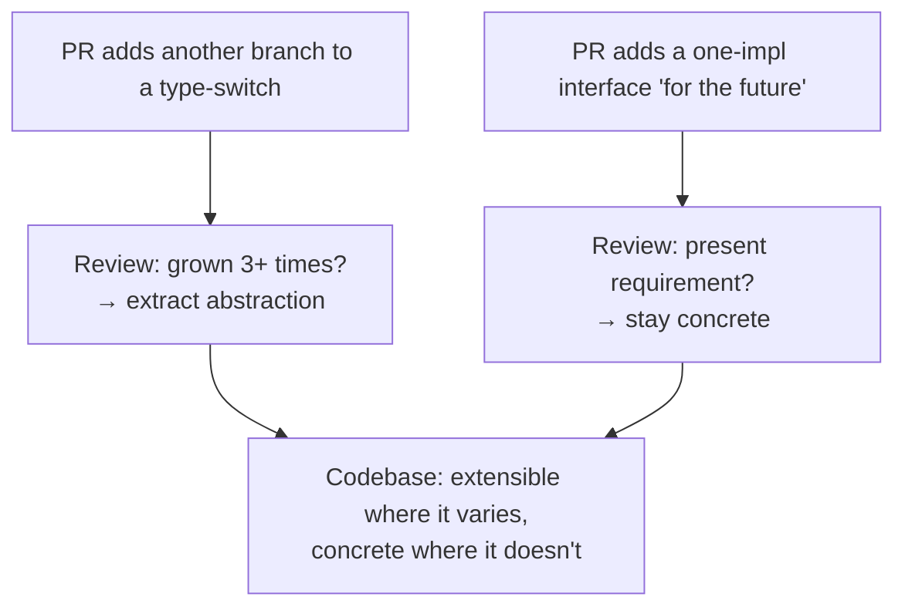
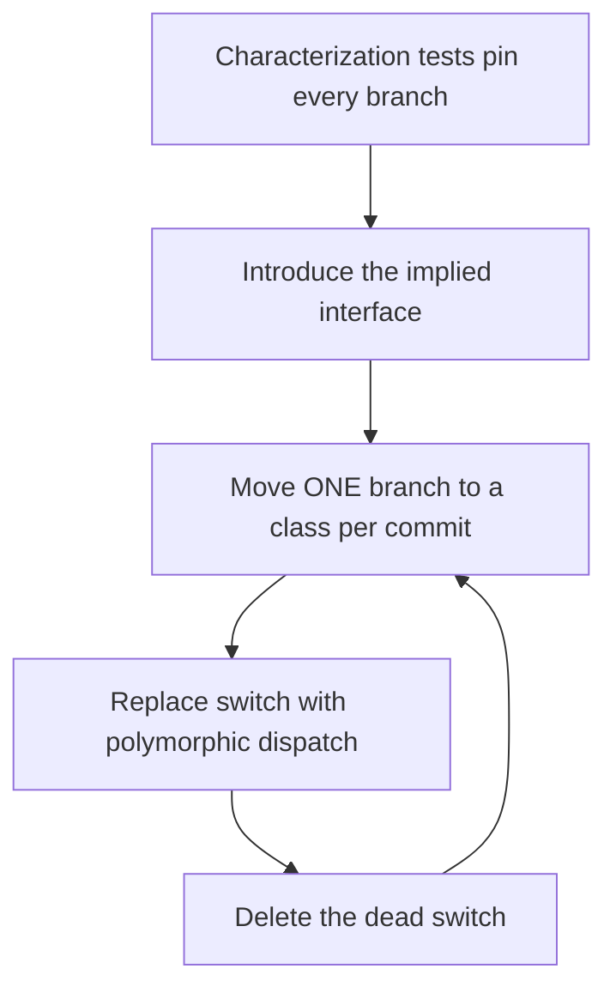

# Open/Closed Principle (OCP) — Professional

> **Category:** [Design Principles → SOLID](../../README.md) — add new behavior by writing new code, not by editing code that already works.

> **Prerequisites:** [Junior](junior.md) · [Middle](middle.md) · [Senior](senior.md)
> **Focus:** **Production** — reviews, team conventions, legacy systems, real incidents

---

## Introduction

> Focus: **production** — keeping a large, multi-contributor codebase extensible in the right places and simple everywhere else.

OCP is unusual among principles because it can be violated in **two opposite directions**, and a professional must police both:

- **Under-OCP:** the `switch`-over-type that grows every sprint, so each new variant edits and re-tests load-bearing code. This is the failure juniors recognize.
- **Over-OCP:** the speculative interface, the one-implementation abstraction, the plugin framework for three hard-coded rules. This is the failure *seniors* cause — and it's the more common and more expensive one in mature codebases.

At the professional level the question is operational: **how do you keep a codebase extensible along the axes that matter and brutally concrete everywhere else, across hundreds of changes a week from dozens of people?** The answer is a system: review standards that catch *both* directions, conventions that make "earn the abstraction" the default, and a disciplined way to fix both an ossified type-switch *and* a load-bearing wrong abstraction without breaking production.

---

## Enforcing OCP in Code Review

Code review is where the OCP balance is won or lost, because both failure modes enter one PR at a time. The reviewer's job is to ask one question of each direction.

### When new code edits an existing type-switch (under-OCP)

> **"Is this the *third* time we've added a branch here? If this switch keeps growing, let's close it behind an abstraction instead of editing it again."**

The tell: a PR adds an `else if`/`case` to a conditional that dispatches on a `type`/`kind`/`enum`. One addition is fine; a *pattern* of additions is the signal to refactor to polymorphism. Check the file's history — `git log -p` on that function reveals whether this branch is the third or fourth of its kind.

### When new code introduces an abstraction (risk of over-OCP)

> **"What real, present requirement makes this interface necessary? How many implementations exist *today*?"**

The tell: a new interface with **one** implementation, a factory that constructs one type, a `Strategy` with a single strategy, config for a value that has one production setting. "It's more flexible / future-proof / extensible" is a **red flag, not a justification.** If the honest answer is "we might need a second one later," the abstraction should come out — it can be added the day the second implementation is real, and it'll fit better then.

> The highest-value OCP review question cuts both ways: **"Is this axis actually varying — and is *this* the right axis to be open against?"**

### Review comment templates

> "This is the third payment branch we've added to `process()` this quarter. Let's extract a `PaymentMethod` interface so the next one is a new class, not another edit here."

> "This `ReportRenderer` interface has one implementation and one caller. What's the second renderer we're anticipating? If it's hypothetical, let's use the concrete class and extract the interface when the second one lands."

> "The interface guesses the axis is 'new formats,' but our last six changes were all new *fields*. Closing against formats won't help; we'll still edit every implementor for each field. Let's reconsider the axis."

> "Nice — extracting this strategy is justified: we now have three real discount rules. Make sure `Checkout` only depends on the interface, no `instanceof` leaks."

---

## The Two Failure Directions a Reviewer Must Catch

| | **Under-OCP** | **Over-OCP** |
|---|---|---|
| Symptom | Growing `switch`/`if` over a type | One-implementation interface, speculative factory, plugin framework for a fixed set |
| Who introduces it | Juniors; time pressure | Seniors; "best practice" reflex; résumé-driven development |
| Cost | Every variant edits + re-tests working code | Indirection, navigation cost, wrong-axis risk, dead flexibility |
| Review question | "Has this branch grown 3+ times? Close it." | "What present requirement forces this abstraction?" |
| Correct fix | Extract the abstraction (earned now) | Inline back to the concrete; add the seam when variation is real |

The professional insight: **most code reviews police under-OCP and ignore over-OCP**, because adding structure *looks* responsible. Flip that. In a mature codebase the cheaper-to-prevent and more frequent disease is speculative abstraction. Treat an unjustified interface with the same suspicion as a missing test.

---

## Team Conventions for OCP

Codify these so the right balance is the default, not a per-PR argument:

1. **Earn the abstraction (rule of three).** No interface/strategy/factory before the *third* concrete variant — unless the variation is provably certain (a contractually committed set of providers, a framework plugin point).
2. **No one-implementation interfaces in new code.** The explicit, documented exceptions: a **test seam** (you need a fake *now* — that's a present requirement) and a **published boundary** (a plugin/API contract that's intentionally open).
3. **Name the axis in the PR.** When you do introduce an OCP seam, state *which* axis it's closed against ("open for new payment methods"). This forces the author to articulate the prediction and lets reviewers challenge it.
4. **Concrete first, switch is fine until it grows.** A small, stable `switch` is *not* a violation. Don't pre-emptively polymorphism-ify every conditional.
5. **No `instanceof`/type-field reads in supposedly closed code.** A leaky abstraction isn't OCP. Make this a lint rule where possible.
6. **Published extension points get up-front design and a deprecation policy.** They're one-way doors; treat them like API contracts, not internal refactors.
7. **Celebrate the right concrete code.** "I replaced the strategy framework with a 20-line function; we only ever had one strategy" should earn respect, not suspicion.

These conventions encode the senior reasoning so the team gets the balance right by default and reviewers cite policy, not personal taste.

---

## Refactoring Legacy Type-Switches Toward OCP

The professional reality is rarely greenfield: it's a 400-line `switch` that's been edited for three years and has no tests. The approach is incremental and test-guarded — never a rewrite.

### The sequence (replace conditional with polymorphism)

```text
1. CHARACTERIZE — write tests that pin the CURRENT behavior of every
   branch (including bugs). You can't refactor safely without them.
2. INTRODUCE the abstraction — define the interface the branches imply.
3. MOVE ONE BRANCH at a time into an implementing class. Keep the old
   switch delegating to the new class. Tests stay green after each move.
4. REPLACE the switch with polymorphic dispatch once all branches moved.
5. DELETE the dead switch. The hierarchy is now closed against new types.
```

```java
// Step 3 — strangling the switch one branch at a time
double area(Shape s) {
    if (s instanceof Circle c) return new CircleArea().of(c);  // moved to a class
    // remaining branches still inline — migrate them one PR at a time
    if (s instanceof Rectangle r) return r.width * r.height;
}
```

The key disciplines: **characterization tests first** (you can't satisfy "it still works" without them — see [Refactoring as a Discipline](../../../craftsmanship-disciplines/03-refactoring-as-a-discipline/professional.md)), **one branch per commit** (small, reversible steps), and **only refactor the switch that has proven it churns** — don't polymorphism-ify a stable one for purity.

### Don't over-correct

A frequent professional mistake: replacing an honest, stable `switch` with a class hierarchy because "switches are bad." If the set is closed and doesn't grow, the switch was *fine* and the hierarchy is now *worse* (more files, indirection, no payoff). Refactor toward OCP only where the history shows the axis varies.

---

## Removing a Speculative OCP Abstraction Safely

Mature codebases are full of wrong, *load-bearing* abstractions (the senior-level death spiral, now depended on by many callers). Removing one safely:

```text
1. CHARACTERIZE every caller of the over-general interface with tests.
2. INLINE — push each implementation's body back into its caller, OR
   collapse the interface to the ONE method that actually varies.
3. SIMPLIFY each caller independently — delete methods/flags that this
   caller never used (the bolted-on UnsupportedOperationException ones).
4. RE-EXTRACT only the genuinely varying axis, if it still varies at all.
5. DELETE the old interface and its dead implementations.
```

This is "re-introduce the concrete to escape the wrong abstraction," executed with characterization tests as the net. The intermediate state has *less* abstraction on purpose — that's correct; the speculative interface was worse than the directness that replaces it. Watch especially for interfaces whose implementations `throw UnsupportedOperationException` — those are premature OCP that also violate [LSP](../03-lsp-liskov-substitution/professional.md) and [ISP](../04-isp-interface-segregation/professional.md), and they're prime removal candidates.

---

## Real Incidents

### Incident 1: The payment switch that broke on every release

A checkout service dispatched on payment type with a 300-line `switch (paymentType)`. Every new method (Apple Pay, then PIX, then SEPA) meant editing that switch, and twice a regression in an *untouched* branch shipped because the shared local variables above the switch were mutated differently per case. **Postmortem:** classic under-OCP — load-bearing code edited for every variant, no isolation between cases. **Fix:** extracted a `PaymentMethod` interface (the axis had clearly proven it varied — five additions in a year), moved each case to its own class with its own tests. New methods became new classes; the regression class of bug disappeared because adding a method no longer touched existing ones. **Lesson:** a type-switch that's been edited 3+ times for the *same kind* of change is begging to be closed.

### Incident 2: The plugin framework for three rules

A team built a generic, configurable, plugin-based "decision engine" to run what was, at launch, *three* hard-coded eligibility rules — anticipating that "business users will author rules." Two years later it ran ~six rules, all written by the same engineers, none by business users. The framework was ~6,000 lines; the rules were ~200. Every new rule meant learning the framework's DSL. **Postmortem:** over-OCP / gold-plating — extensibility built for an axis (third-party rule authors) that never materialized. **Fix:** rules re-expressed as plain functions (~200 lines total); the framework deleted. "Add a rule" went from days to minutes. **Lesson:** OCP at a boundary only pays if the boundary is actually *crossed by others*. Open for extension that nobody extends is pure cost.

### Incident 3: The interface that guessed the wrong axis

A `DocumentExporter` interface was introduced to be "open for new export formats." Over the next year, **zero** new formats were added — but the document *schema* changed eleven times, and each change forced editing every one of the five exporter implementations. **Postmortem:** the team closed against the wrong axis. Formats were stable; the schema churned. **Fix:** the export *logic* was unified (it barely varied by format) and format selection became a small data-driven step; the schema-mapping was centralized so a field change touched one place. **Lesson:** predict the axis from history. The dimension that *has* changed is the dimension to be open against — not the one that sounds extensible.

### Incident 4: The leaky "closed" core

A rendering pipeline had a clean `Renderer` interface — except the orchestrator did `if (renderer instanceof PdfRenderer) { renderer.setDpi(...) }` in three places. Every new renderer that needed special setup added another `instanceof` to the orchestrator, which was supposedly closed. **Fix:** moved the special setup into the interface as a uniform `configure(options)` and deleted the `instanceof` blocks. **Lesson:** an abstraction with `instanceof` leaks isn't closed; the leaks quietly re-create the switch you thought you'd removed. Lint for type-checks in code that claims to be polymorphic.

---

## The Politics of "Flexibility"

Sustaining the OCP balance is partly social:

- **"Flexible" sounds senior; "concrete" sounds junior.** A reviewer who removes an abstraction can look like they're "blocking extensibility." Reframe: removing an *unearned* abstraction is the senior move. Arm the team with the "what present requirement?" question so refusing speculation cites a standard.
- **Frameworks are résumé-driven.** Engineers build plugin systems partly because they're interesting and impressive. Channel that energy into the *axis that actually varies* (which is often less glamorous) and into tests/docs.
- **Under-OCP is invisible until it bites.** A growing switch ships fine for months, then a regression in an untouched branch causes an incident. Make "this branch has grown 3+ times" a visible review trigger before it bites.
- **Senior engineers set the default.** If the staff engineer reaches for an interface by reflex on every new class, everyone does. Model "concrete until it varies; abstract the axis that proves it churns," and *explain the prediction* when you do introduce a seam.

---

## Review Checklist

```text
OCP REVIEW CHECKLIST (police BOTH directions)

UNDER-OCP (missing abstraction)
[ ] New branch added to a switch/if over a TYPE/KIND?
[ ] Has this switch grown 3+ times for the same kind of change? → extract
[ ] Do shared mutable variables around the switch risk cross-branch regressions?
[ ] Does adding this variant force editing + re-testing unrelated branches?

OVER-OCP (speculative abstraction)
[ ] New interface/strategy/factory with ONE implementation? → why?
[ ] "What PRESENT requirement forces this abstraction?" (not "might need it")
[ ] Is this the RIGHT axis? Does history show THIS dimension varying?
[ ] Plugin/framework for a small, fixed, internally-owned set? → likely gold-plating

LEAKS & CORRECTNESS
[ ] No instanceof / type-field reads in code that claims to be closed
[ ] Interface methods all genuinely implemented (no UnsupportedOperationException)
[ ] Published extension points: designed up-front, versioned, deprecation policy
[ ] Characterization tests present before refactoring a legacy switch
```

---

## Cheat Sheet

```text
TWO FAILURE DIRECTIONS — police both
  UNDER-OCP  growing type-switch → every variant edits working code
  OVER-OCP   one-impl interface / framework for a fixed set → dead flexibility

THE REVIEW QUESTIONS
  to ADDERS of branches:      "has this switch grown 3+ times? close it."
  to ADDERS of abstractions:  "what PRESENT requirement forces this?
                               which axis? does history show it varying?"

EARN, DON'T FRONT-LOAD
  rule of three; concrete first; abstract the axis that PROVES it churns.
  exceptions (abstraction up-front): test seams, PUBLISHED plugin/API boundaries.

LEGACY SWITCH → OCP
  characterize → introduce interface → move one branch/commit →
  replace switch with dispatch → delete dead switch.

WRONG ABSTRACTION → CONCRETE
  characterize callers → inline / collapse to the one varying method →
  simplify each caller → re-extract only the real axis → delete old interface.

LEAKS KILL CLOSURE
  no instanceof / type-field reads in "closed" code. lint for it.
```

---

## Diagrams

### Where complexity enters from BOTH sides, and where review stops it



### Safe legacy switch → OCP migration



---

## Related Topics

- **The mechanism:** [Dependency Inversion (DIP)](../05-dip-dependency-inversion/professional.md).
- **Constrained by:** [LSP](../03-lsp-liskov-substitution/professional.md), [ISP](../04-isp-interface-segregation/professional.md).
- **The brake on over-OCP:** [YAGNI](../../01-generic/02-yagni/professional.md), [Simple Design](../../../craftsmanship-disciplines/04-simple-design/professional.md).
- **Legacy technique:** [Refactoring as a Discipline](../../../craftsmanship-disciplines/03-refactoring-as-a-discipline/professional.md) — replace conditional with polymorphism, characterization tests.
- **Tooling:** static analysis / lint rules for `instanceof` in polymorphic code; change-coupling analysis to find the real axis of variation in git history.

---


---

## Check your understanding

1. Explain Open/Closed Principle (OCP) — Professional Level in your own words and name the problem it solves.
2. How would you apply the ideas around Table of Contents, Introduction, Enforcing OCP in Code Review in a realistic engineering change?
3. What failure mode or misuse should you look for, and what evidence would reveal it?
4. How would you introduce and govern Open/Closed Principle (OCP) — Professional Level across teams through reversible, measurable increments?
5. What observable result would convince you that the approach improved the system?
