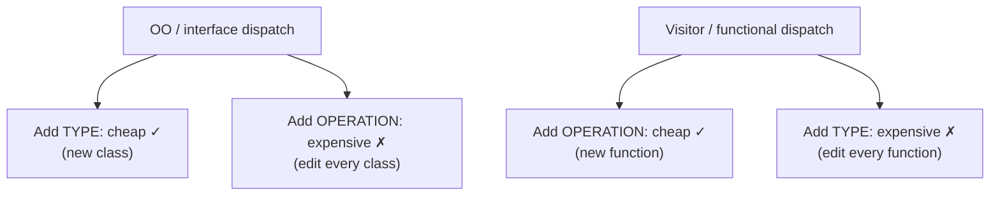
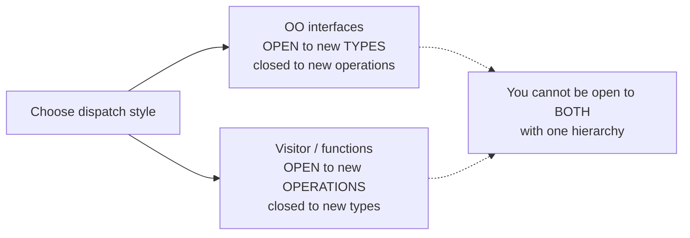

# Open/Closed Principle (OCP) — Senior

> **Category:** [Design Principles → SOLID](../../README.md) — add new behavior by writing new code, not by editing code that already works.

> **Prerequisites:** [Junior](junior.md) · [Middle](middle.md)
> **Focus:** **Design trade-offs** and **system-level reasoning**

---

## Introduction

> Focus: **design trade-offs** and **system-level reasoning**

At the senior level OCP stops being "replace the switch with an interface" and becomes a **stance on a deeper question**: *where in a system should you pay for flexibility, and where is flexibility a liability?* The naive reading — "make everything open for extension" — produces exactly the over-abstracted, indirection-heavy codebases that are *harder* to change than the simple ones they replaced. The senior reading is sharper:

> **OCP is a localized investment in flexibility along a *specific predicted axis*. Like any investment it has a price (indirection, more moving parts) and only pays off if the prediction is right. Seniors decide *which* axes are worth the price.**

This file covers the three hard truths:

1. **OCP can only ever protect one axis** — the expression problem makes this a mathematical fact, not a design failure.
2. **The wrong abstraction is more expensive than the duplication it removed** — so unearned OCP is a net loss.
3. **OCP is best treated as a *consequence* of good design under real change, not a goal you front-load.**

---

## Meyer's OCP vs. Martin's OCP

The principle has drifted in meaning, and a senior should be able to name both versions precisely because they imply different mechanisms.

| | **Meyer (1988)** | **Martin (Uncle Bob)** |
|---|---|---|
| Core mechanism | **Inheritance** — a class is closed (compiled, depended on) yet open via *subclassing* | **Polymorphism through abstraction** — depend on an interface, add new *implementations* |
| "Closed" means | The base class's source and clients are fixed | The client of the abstraction is fixed |
| "Open" means | You may subclass to add/override behavior | You may add a new implementor of the interface |
| Era's idiom | Implementation inheritance | Interface + composition |
| Modern verdict | Discouraged where it means deep inheritance (fragile base class) | The dominant, recommended reading |

Meyer's version, taken literally, encourages *implementation inheritance*, which carries its own problems (the fragile base class, [Liskov](../03-lsp-liskov-substitution/senior.md) violations, [composition-over-inheritance](../../02-coupling-and-cohesion/05-composition-over-inheritance/senior.md) pushback). Martin's version sidesteps these by using *interface* inheritance + composition: you implement a contract, you don't inherit an implementation.

> The senior translation: **when people say "OCP" today they almost always mean Martin's polymorphic version — depend on an abstraction, extend by adding an implementor.** Reach for *composition and interfaces*, not deep subclass hierarchies, to realize it.

---

## The Expression Problem: OCP Can Only Protect One Axis

This is the deepest senior insight about OCP, and it explains *why* "closed against what?" is unavoidable.

A data structure varies along **two** axes simultaneously: the set of **types** (Circle, Rectangle, Triangle…) and the set of **operations** (area, perimeter, render…). The **expression problem** (named by Philip Wadler) is the observation that mainstream type systems let you make *one* axis open at a time, not both:

```
              area()   perimeter()   render()      ← OPERATIONS
   Circle      ✓           ✓            ?
   Rectangle   ✓           ✓            ?
   Triangle    ✓           ✓            ?
   Hexagon     ?           ?            ?           ← TYPES
```

- **Object-oriented dispatch** (each type implements an interface) makes **adding a type cheap** (a new class, existing code closed) but **adding an operation expensive** (edit *every* class to add `render()`).
- **Functional/visitor dispatch** (each operation is a function that switches on type) makes **adding an operation cheap** (a new function) but **adding a type expensive** (edit *every* operation's switch).



The senior consequence: **"open for extension" is always relative to one chosen axis.** Choosing the OO style closes you against new types and *opens* you to expensive operation-additions. The skill is identifying which axis your domain actually varies along and orienting the dispatch that way. (Languages with multiple dispatch, type classes, or pattern-matching with exhaustiveness checks soften this, but the trade-off never fully vanishes.)

> This is *why* you cannot be "closed against all change." It's not a limitation of your skill — it's a structural property of dispatch. OCP forces a choice of axis; choose it deliberately.

---

## The Cost of Premature Abstraction

The industry instinct treats abstraction as free virtue. Seniors know the opposite is often true: **an extension point built for a variation that never arrives is pure cost, and the *wrong* extension point is worse than no extension point.**

The failure mode, mirroring Sandi Metz's "duplication is far cheaper than the wrong abstraction":

1. You see one behavior and, anticipating variation, build an interface "for OCP."
2. The variation that arrives is on a *different* axis than the one you protected.
3. To handle it, you now bend the abstraction — add a method, a flag, a parameter to the interface.
4. The abstraction grows misshapen, serving cases that don't share its original concept.
5. It's now **load-bearing** (callers depend on it) and **wrong** (it doesn't match the real variation), so it's expensive to keep *and* risky to remove.

```java
// A speculative "OCP" interface that guessed the wrong axis
interface ReportRenderer {
    String render(Report r);
    // later additions because the guess was wrong:
    void setLocale(Locale l);     // bolted on
    boolean supportsStreaming();  // bolted on
    byte[] renderBinary(Report r); // bolted on — most impls throw
}
```

Each method was a locally reasonable patch; the aggregate is an interface that no implementation satisfies cleanly (witness the `throw new UnsupportedOperationException()` bodies — a [Liskov](../03-lsp-liskov-substitution/senior.md) and [Interface Segregation](../04-isp-interface-segregation/senior.md) violation born from premature OCP).

> The senior rule: **prefer a concrete `if` to a speculative abstraction.** A conditional is visible, local, and cheap to replace with the *right* abstraction once the axis is observed. A wrong abstraction is invisible coupling that gets more expensive every day. This is *why* OCP must be earned, not front-loaded.

---

## OCP as a Consequence, Not a Goal

The most important reframing seniors carry: **you don't "apply OCP." You apply it *retroactively* to an axis that has proven it varies.**

Treating OCP as an up-front goal ("make this open for extension") generates speculative abstractions. Treating it as a *consequence* ("this switch has grown three times — close it") generates abstractions that fit. The discipline:

1. **Write the simple, concrete code** — a function, an `if`, the direct call.
2. **Let real requirements arrive.** Watch *which* part you keep editing.
3. **When a part proves it varies** (the rule of three), refactor it behind an abstraction — *now* OCP-closed against the axis you *observed*.

This is the same emergent-design stance behind [simple design](../../../craftsmanship-disciplines/04-simple-design/senior.md) and YAGNI: the design that's open for extension along the right axis is *discovered through change*, not designed in a vacuum. Martin himself frames OCP as something you achieve by *anticipating* the most likely change and protecting *only* that — explicitly **not** trying to protect against all change, which he calls a "bad" application of the principle.

> "We want to be closed against the *kinds of changes that experience tells us are likely*. This requires guessing — and we guess best from experience, not imagination."

---

## OCP, DIP, and the Direction of Dependencies

OCP and [Dependency Inversion (DIP)](../05-dip-dependency-inversion/senior.md) are so intertwined that some authors treat OCP as *the goal* and DIP as *the means*.

- **OCP** is the *objective*: existing code shouldn't change when behavior is extended.
- The **mechanism that achieves it** is **inverting the dependency**: the high-level policy and the low-level variant both depend on an abstraction *owned by the high-level side*. New variants depend on the abstraction; the abstraction depends on nothing; so the high-level code is closed.

```
   WITHOUT inversion (OCP impossible):
     HighLevel ──► ConcreteA            adding ConcreteB edits HighLevel

   WITH inversion (OCP achieved):
     HighLevel ──► «Abstraction» ◄── ConcreteA
                                  ◄── ConcreteB   (NEW — HighLevel untouched)
```

The arrow from `ConcreteB` *up* to the abstraction is the "inversion." It's what lets you add `ConcreteB` without touching `HighLevel`. **OCP without DIP is usually unachievable** — if high-level code depends directly on concretes, no amount of wishing makes it closed. The two principles describe the same refactor from different angles: OCP names the *benefit*, DIP names the *dependency rule* that produces it.

---

## Plugin Architectures: OCP at System Scale

OCP scales from a method to an entire system. A **plugin architecture** is OCP applied to the whole application boundary: the core is *closed* (shipped, stable, never recompiled), and the system is *open* (third parties add behavior).

The ingredients:

1. **A published abstraction** the core depends on (the plugin interface / extension point).
2. **A discovery mechanism** so the closed core can *find* implementations it was never compiled against (service loaders, dependency-injection scanning, manifest/entry-point registration, dynamic loading).
3. **A dependency rule** (DIP) so the core never references a plugin concretely.

This is how editors (VS Code extensions), browsers, CI systems, and frameworks (Spring, Django middleware, webpack loaders) achieve extensibility: the platform team ships a closed core and *everyone else* extends it without a pull request to the core. The economic payoff is enormous — extension scales beyond the core team — and it's *pure* OCP: behavior grows without core modification.

> At system scale the abstraction is a **published contract**, which makes it a *one-way door* (see [simple design — reversibility](../../../craftsmanship-disciplines/04-simple-design/senior.md)): once plugins depend on it, you can't change it freely. So plugin interfaces *deserve* up-front design, the opposite of internal abstractions. OCP at the boundary is worth front-loading precisely because the boundary is irreversible.

---

## Code Examples — Advanced

### Escaping a wrong OCP abstraction by re-introducing a conditional (Python)

```python
# BEFORE — a speculative interface that guessed wrong; impls fake half of it
class PricingRule(ABC):
    @abstractmethod
    def price(self, item): ...
    @abstractmethod
    def label(self): ...          # only ONE caller ever uses label()
    @abstractmethod
    def is_tax_exempt(self): ...  # most impls return False; bolted on later

# AFTER — the only axis that truly varies is the price calculation.
# Collapse the over-broad interface to the one method that varies,
# move the rest back to a plain conditional / data.
PriceFn = Callable[[Item], float]

def base_price(i):     return i.price
def member_price(i):   return i.price * 0.9

def total(items: list[Item], rule: PriceFn) -> float:
    return sum(rule(i) for i in items)   # closed against new price rules
# label / tax-exemption were NOT really varying — they don't belong in the seam.
```

The lesson: the seam should contain **exactly the axis that varies** and nothing else. A bloated interface is premature OCP that's also an [ISP](../04-isp-interface-segregation/senior.md) violation.

### Earning OCP only after the axis proves itself (Go)

```go
// PHASE 1 — one concrete behavior. NO interface. This is correct.
type StripeGateway struct{ /* ... */ }
func (s StripeGateway) Charge(amt Money) (Receipt, error) { /* ... */ }

// PHASE 2 — a second gateway becomes a REAL requirement (Adyen).
// NOW extract the interface, shaped by TWO concrete cases so it fits both.
type Gateway interface{ Charge(amt Money) (Receipt, error) }

// Go's structural typing means StripeGateway already satisfies Gateway —
// we add the abstraction WITHOUT editing StripeGateway. The language
// rewards earning OCP late: the seam appears only when variation is real.
```

Go's implicit interface satisfaction is a structural argument for emergent OCP: you can introduce the seam *after* the fact without touching existing types, so there's no incentive to speculate it early.

---

## Liabilities

### Liability 1: Speculative OCP (the "open for extension" everything-must-have-an-interface culture)

Building extension points before variation exists adds indirection, more files, harder navigation, and a wrong-axis risk — all to protect a change that may never come. The most common way OCP is misused is by *over*-applying it. Earn the abstraction; don't front-load it.

### Liability 2: Guessing the wrong axis

The expression problem guarantees you protect one axis at the expense of another. Protect the axis that doesn't churn and you get the worst of both worlds: indirection *plus* edits to working code when the real change arrives. Predict from history, not imagination.

### Liability 3: OCP via deep inheritance (Meyer taken too literally)

Realizing OCP through implementation inheritance invites fragile base classes and [Liskov](../03-lsp-liskov-substitution/senior.md) violations. Prefer composition and interface inheritance — Martin's reading — over deep subclass trees.

### Liability 4: A "closed" core that isn't (leaky abstraction)

If the supposedly closed code down-casts (`instanceof`), reads a `type` field, or special-cases a concrete variant, it isn't closed at all — every new variant still edits it. Abstraction leaks defeat OCP silently.

### Liability 5: Treating a published OCP boundary as reversible

Internal abstractions are cheap to change; a *published* plugin contract is a one-way door. Applying "extract it later, no big deal" thinking to an external extension point creates a migration nightmare. Boundary OCP needs up-front design.

---

## Pros & Cons at the System Level

| Dimension | OCP-extensible design | Concrete / direct design |
|---|---|---|
| Cost of adding a *predicted* variant | Low — new implementor, core untouched | Edit + re-test the existing switch |
| Cost when variation hits an *unpredicted* axis | High — bend the abstraction or rework it | Also high — but no abstraction to fight |
| Cost of unneeded flexibility | High — indirection built, maintained, often unused | Low — nothing speculative was built |
| Readability of internals | Lower — dispatch hidden behind abstraction | Higher — logic is local and visible |
| Extensibility by *other teams* (plugins) | High — published contract scales beyond core team | None — every extension is a core PR |
| Risk to existing behavior on extension | Low — old code not touched | Higher — every edit can regress |
| Dependence on guessing the axis right | Total — wrong axis = net loss | None — but no protection either |

The table makes the senior stance precise: OCP **wins decisively when the axis is predicted correctly and variation is plural** — especially at extensible boundaries where it scales work beyond your team. It **loses** when applied speculatively (unneeded flexibility, wrong-axis risk, worse readability). The verdict isn't "use OCP" or "don't" — it's **"earn OCP on the axis evidence proves varies, front-load it only at irreversible boundaries, and prefer a concrete conditional everywhere else."**

---

## Diagrams

### Earn OCP — don't front-load it

```mermaid
flowchart TD
    C[Write concrete code: if / direct call] --> V{Has this part<br/>varied 2-3 times?}
    V -- "No" --> C2[Keep it concrete<br/>(YAGNI / simple design)]
    V -- "Yes (axis observed)" --> A[Refactor behind an abstraction<br/>→ closed against THAT axis]
    A --> B{Is the seam a PUBLISHED<br/>boundary (plugin/API)?}
    B -- "Yes (one-way door)" --> U[Design it deliberately, up-front]
    B -- "No (internal)" --> E[Let it stay reversible / refactorable]
```

### The expression problem fixes the axis you can be open against



---

## Related Topics

- **The mechanism behind OCP:** [Dependency Inversion (DIP)](../05-dip-dependency-inversion/senior.md).
- **Constrained by:** [LSP](../03-lsp-liskov-substitution/senior.md) (extensions must substitute cleanly) and [ISP](../04-isp-interface-segregation/senior.md) (don't bloat the seam).
- **The brake:** [YAGNI](../../01-generic/02-yagni/senior.md), [Simple Design](../../../craftsmanship-disciplines/04-simple-design/senior.md), [Encapsulate What Changes](../../03-module-and-class/01-encapsulate-what-changes/senior.md).
- **Prefer composition:** [Composition Over Inheritance](../../02-coupling-and-cohesion/05-composition-over-inheritance/senior.md).
- **Realized by patterns:** Design Patterns — Strategy, Decorator, Template Method, Visitor.

---


---

## Check your understanding

1. Explain Open/Closed Principle (OCP) — Senior Level in your own words and name the problem it solves.
2. How would you apply the ideas around Table of Contents, Introduction, Meyer's OCP vs. Martin's OCP in a realistic engineering change?
3. What failure mode or misuse should you look for, and what evidence would reveal it?
4. How would you validate a system-level decision about Open/Closed Principle (OCP) — Senior Level under uncertainty?
5. What observable result would convince you that the approach improved the system?
