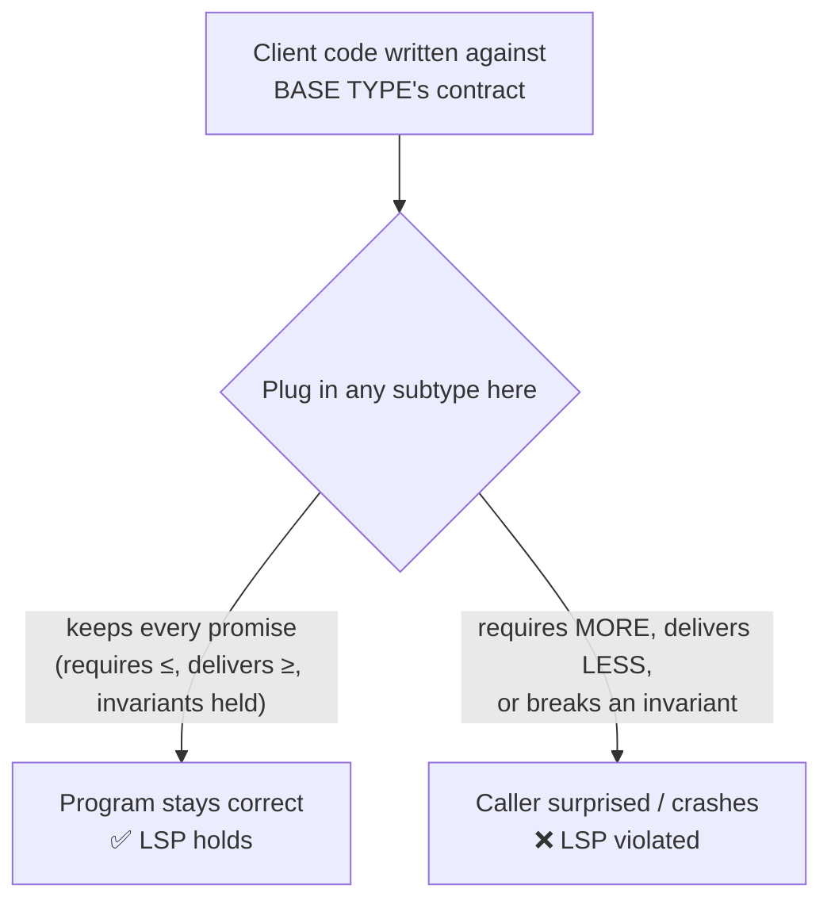
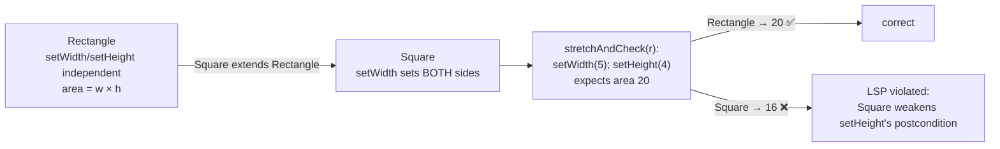

# Liskov Substitution Principle (LSP) — Junior

> **Category:** [Design Principles → SOLID](../../README.md) — the **L** in SOLID: subtypes must be usable anywhere their base type is expected, without breaking the program.

---

## Table of Contents

1. [Introduction](#introduction)
2. [Prerequisites](#prerequisites)
3. [Glossary](#glossary)
4. [What the Principle Actually Says](#what-the-principle-actually-says)
5. [IS-A Is Not Enough: IS-SUBSTITUTABLE-FOR](#is-a-is-not-enough-is-substitutable-for)
6. [Real-World Analogies](#real-world-analogies)
7. [Mental Models](#mental-models)
8. [A Worked Example: The Rectangle/Square Problem](#a-worked-example-the-rectanglesquare-problem)
9. [Code Examples](#code-examples)
10. [The Tell-Tale Smell: instanceof in the Client](#the-tell-tale-smell-instanceof-in-the-client)
11. [Best Practices](#best-practices)
12. [Common Mistakes](#common-mistakes)
13. [Tricky Points](#tricky-points)
14. [Test Yourself](#test-yourself)
15. [Cheat Sheet](#cheat-sheet)
16. [Summary](#summary)
17. [Further Reading](#further-reading)
18. [Related Topics](#related-topics)
19. [Diagrams](#diagrams)

---

## Introduction

> Focus: **What is it?** and **How to use it?**

The **Liskov Substitution Principle** is one sentence with enormous consequences:

> **If `S` is a subtype of `T`, then objects of type `T` may be replaced with objects of type `S` without altering any of the desirable properties of the program.**

In plainer words: **wherever your code expects a base type, it must be safe to hand it any subtype — and the program must still behave correctly.** If substituting a subclass for its parent surprises the caller — throws an unexpected exception, returns a wrong answer, or quietly breaks an assumption — you have violated LSP.

The principle is named for **Barbara Liskov**, who stated the formal version in a 1987 keynote (later refined with Jeannette Wing in 1994). Robert C. Martin folded it into SOLID as the third principle. The everyday version you'll actually use is the substitutability one above.

### Why this matters

The whole point of subtyping and polymorphism is that a caller can write code against a base type — `Shape`, `List`, `Bird`, `PaymentMethod` — and have it work for *every* current and future subtype without change. That promise only holds if every subtype honors the base type's **contract**. The moment one subtype misbehaves, callers have to start asking "*which* subtype is this?" and special-casing it — which destroys polymorphism and re-introduces exactly the rigid, change-resistant code that inheritance was supposed to eliminate.

LSP is the rule that keeps that promise. It tells you when an inheritance relationship is *real* (a true subtype) versus when it merely *looks* like one because the words sound right ("a square is a rectangle, isn't it?"). Getting this wrong produces some of the most famous bugs and design traps in object-oriented programming.

---

## Prerequisites

- **Required:** Comfort with **inheritance and polymorphism** — base classes/interfaces, subclasses, overriding methods, calling a method through a base-type reference.
- **Required:** You can read Java, Python, or TypeScript well enough to follow class definitions.
- **Helpful:** A feel for [Open/Closed Principle](../02-ocp-open-closed/junior.md) — OCP relies on substitutable subtypes, so LSP is what makes OCP safe.
- **Helpful:** Exposure to **interfaces / abstract types** as contracts callers depend on.

---

## Glossary

| Term | Definition |
|------|-----------|
| **Subtype / supertype** | `S` is a subtype of `T` (`T` the supertype) if a `T` is expected and an `S` is supplied — via subclassing, interface implementation, or structural typing. |
| **Substitutability** | The ability to use a subtype anywhere the supertype is expected, with no change in correctness. The thing LSP demands. |
| **Contract** | The promises a type makes to its callers: what it requires (preconditions), what it guarantees (postconditions), and what stays always-true (invariants). |
| **Precondition** | What must be true *before* a method runs for it to behave correctly (e.g., "argument must be non-negative"). |
| **Postcondition** | What the method guarantees is true *after* it runs (e.g., "the returned list is sorted"). |
| **Invariant** | A property that is always true of an object between method calls (e.g., "balance is never negative"). |
| **Behavioral subtyping** | The formal name for "a subtype that actually obeys the supertype's contract" — LSP made precise. |
| **Covariance / contravariance** | How return types (covariant — may narrow) and parameter types (contravariant — may widen) are allowed to change in a valid subtype. |

---

## What the Principle Actually Says

There are two layers, and you need both.

### The formal (Liskov/Wing) version

> Let `q(x)` be a property provable about objects `x` of type `T`. Then `q(y)` should be true for objects `y` of type `S` where `S` is a subtype of `T`.

That is academic phrasing for: *anything the program could rely on being true of the base type must still be true of the subtype.*

### The intuitive version (the one to memorize)

> **A subtype must be substitutable for its base type without breaking the program's correctness.**

The key word is **correctness**, not merely "compiles." Java will happily let a `Square` extend `Rectangle` and let a `ReadOnlyList` extend `List`; the compiler is satisfied. LSP is about whether the program still *works* — still produces right answers and doesn't surprise its callers — when the substitution happens at runtime. **LSP is a runtime/semantic rule, not a compile-time one.**

---

## IS-A Is Not Enough: IS-SUBSTITUTABLE-FOR

Beginners are taught "use inheritance for an IS-A relationship: a `Dog` IS-A `Animal`, so `Dog extends Animal`." LSP sharpens this rule into something far more reliable:

> **The test for inheritance is not "is an S a kind of T?" in English. It is: "can an S do everything a T promises, everywhere a T is used?"**

The English "is-a" lies constantly:

- A **square IS-A rectangle** in geometry — but a `Square` is *not substitutable* for a `Rectangle` whose width and height can be set independently. (We'll prove this below.)
- A **penguin IS-A bird** in biology — but a `Penguin` is *not substitutable* for a `Bird` that promises a working `fly()`.
- A **read-only list IS-A list** in everyday speech — but it is *not substitutable* for a `List` that promises `add()` works.

The reliable rule is **IS-SUBSTITUTABLE-FOR**. If `S` cannot stand in for `T` in every situation `T` supports, then `S` is *not* a subtype of `T` in the sense your program needs — no matter how natural the "is-a" sounds. When IS-A and IS-SUBSTITUTABLE-FOR disagree, **substitutability wins**, and you reach for [composition instead of inheritance](../../02-coupling-and-cohesion/05-composition-over-inheritance/junior.md).

---

## Real-World Analogies

| Concept | Analogy |
|---|---|
| **Substitutability** | A rental-car contract says "a midsize car." Any midsize the agency hands you must do everything you booked it for — seat four, fit your luggage, drive on the highway. If they substitute a two-seat sports car ("it's still a car!"), they've broken the contract even though it *is* a car. |
| **Strengthening a precondition** | You order "any pizza." The shop substitutes one that *requires* you to also order a drink. They've added a demand the contract never had — the substitution breaks. |
| **Weakening a postcondition** | A bank guarantees "your statement lists every transaction." A new branch substitutes one that lists *most* transactions. It delivers less than promised — substitution breaks. |
| **Violating an invariant** | A "tamper-evident" seal is supposed to be unbroken until you open it. A substitute jar arrives with the seal already broken. The always-true property is gone. |
| **IS-A vs IS-SUBSTITUTABLE-FOR** | A decoy duck IS-A duck on a shelf, but substitute it for a live duck in a pond and nothing works. Looking like the type isn't being the type. |

---

## Mental Models

**The intuition:** *"A subtype is a promise-keeper. It may keep its promises in its own way, and it may promise* more*, but it must never demand more from callers or deliver less than the base type promised."*

```
        CALLER writes against the BASE TYPE's contract
                          │
                          ▼
        ┌─────────────────────────────────────────┐
        │  Whatever subtype is plugged in here     │
        │  MUST honor the same contract:           │
        │   • require no MORE  (preconditions ≤)   │
        │   • deliver no LESS  (postconditions ≥)  │
        │   • keep what's always true (invariants) │
        └─────────────────────────────────────────┘
                          │
                          ▼
            program stays correct → LSP holds
```

A second model — **the "no surprises" rule:** a subtype is valid if a caller who knows *only* the base type's documentation is never surprised by the subtype's behavior. Every surprise (an exception that "couldn't happen," a value out of the promised range, a side effect the base type never had) is an LSP violation.

A third model — **LSP is OCP's safety guarantee.** [OCP](../02-ocp-open-closed/junior.md) lets you extend a system by adding new subtypes without touching old code. That only works if the new subtypes are genuinely substitutable. **LSP is the precondition that makes OCP safe.**

---

## A Worked Example: The Rectangle/Square Problem

This is the canonical LSP violation. Walk through it slowly — it teaches the whole principle.

### The "obvious" hierarchy

In math, a square *is* a rectangle (one with equal sides). So we model it that way:

```java
class Rectangle {
    protected int width, height;

    public void setWidth(int w)  { this.width = w; }
    public void setHeight(int h) { this.height = h; }
    public int  getWidth()       { return width; }
    public int  getHeight()      { return height; }
    public int  area()           { return width * height; }
}

class Square extends Rectangle {
    // A square must keep width == height. So overriding the setters
    // to keep both sides equal seems like the right thing to do:
    @Override public void setWidth(int w)  { this.width = w; this.height = w; }
    @Override public void setHeight(int h) { this.width = h; this.height = h; }
}
```

This compiles. It even looks responsible — the `Square` carefully preserves its own "sides are equal" invariant. The trap is sprung the moment a caller written against `Rectangle` is handed a `Square`.

### The caller that breaks

Here is a perfectly reasonable method written against the base type. It encodes a property a `Rectangle` user is entitled to rely on: *setting width and height are independent.*

```java
void stretchAndCheck(Rectangle r) {
    r.setWidth(5);
    r.setHeight(4);
    // A rectangle with width 5 and height 4 has area 20. Always.
    assert r.area() == 20 : "expected 20 but got " + r.area();
}
```

- Pass a `Rectangle`: `setWidth(5)`, `setHeight(4)` → area `20`. **Assertion holds.**
- Pass a `Square`: `setWidth(5)` sets *both* sides to 5; then `setHeight(4)` sets *both* sides to 4. Area = `16`. **Assertion fails.**

```
   stretchAndCheck(new Rectangle())   →  width=5, height=4  →  area 20   ✅
   stretchAndCheck(new Square())      →  width=4, height=4  →  area 16   ❌  SURPRISE
```

`Square` is not substitutable for `Rectangle`. The caller relied on a property of `Rectangle` ("width and height vary independently") that `Square` silently breaks. **That is the LSP violation** — and notice the bug is in the *design of the hierarchy*, not in the caller or the `Square` code, both of which are individually reasonable.

### Why exactly is this a violation?

In contract terms: `Rectangle.setHeight(h)` has an implicit **postcondition** — *"after this call, `getHeight() == h` and `getWidth()` is unchanged."* `Square.setHeight` **weakens** that postcondition (it changes the width too). Weakening a postcondition is forbidden for a subtype. The hierarchy lies: `Square` cannot keep `Rectangle`'s promises.

### The fix

There is no clever override that rescues this hierarchy — the contracts are genuinely incompatible. The fix is to stop pretending `Square` is a substitutable `Rectangle`:

```java
// Option A — model the real abstraction. Both are shapes; neither
// promises independent mutable width/height.
interface Shape { int area(); }

final class Rectangle implements Shape {
    private final int width, height;          // immutable: no setters to betray
    Rectangle(int width, int height) { this.width = width; this.height = height; }
    public int area() { return width * height; }
}

final class Square implements Shape {
    private final int side;
    Square(int side) { this.side = side; }
    public int area() { return side * side; }
}
```

Now `Square` and `Rectangle` are siblings under `Shape`, which promises only `area()` — a promise both can keep. There's no `setWidth`/`setHeight` contract to violate. **Making the types immutable removes the offending setters entirely**, which is the single most common cure for LSP problems.

> The lesson: the bug wasn't `Square`. It was the *claim* that `Square` is a substitutable `Rectangle`. English "is-a" said yes; substitutability said no. Substitutability wins.

---

## Code Examples

### Python — the "throws UnsupportedOperationException" anti-pattern

A classic violation: a subtype that can't honor a method "implements" it by throwing.

```python
class Bird:
    def fly(self):
        return "flap flap, airborne"

class Penguin(Bird):
    def fly(self):
        raise NotImplementedError("penguins can't fly")   # ← LSP violation

def migrate(birds):
    for b in birds:
        print(b.fly())     # written against Bird's contract: fly() works

migrate([Bird(), Penguin()])   # 💥 blows up on the Penguin
```

`Bird` promises `fly()` returns a description. `Penguin` *strengthens the precondition to "impossible"* by refusing to fly at all — so it's not substitutable. The caller, written innocently against `Bird`, crashes.

**Fix — model the real abstraction.** Not all birds fly; only *some* do. So `fly()` doesn't belong on `Bird`:

```python
class Bird:
    def eat(self): ...

class FlyingBird(Bird):
    def fly(self): return "airborne"

class Penguin(Bird):       # a Bird, but NOT a FlyingBird — and that's the point
    def swim(self): return "diving"

def migrate(flyers: list[FlyingBird]):
    for f in flyers:
        print(f.fly())     # only ever receives things that really fly
```

Now the type system says exactly what's true: a `Penguin` is a `Bird` but not a `FlyingBird`, and `migrate` only accepts `FlyingBird`. No subtype lies about what it can do.

### TypeScript — strengthening a precondition breaks substitutability

```typescript
class Account {
  // Contract: accepts ANY positive amount.
  withdraw(amount: number): void {
    if (amount <= 0) throw new Error("amount must be positive");
    // ...debit...
  }
}

class FixedAccount extends Account {
  // Adds a NEW demand the base type never made: amount must be a multiple of 100.
  withdraw(amount: number): void {
    if (amount % 100 !== 0) throw new Error("must be a multiple of 100"); // ← stronger precondition
    super.withdraw(amount);
  }
}

function payOut(acc: Account) {
  acc.withdraw(50);   // valid for Account's contract...
}

payOut(new Account());        // ok
payOut(new FixedAccount());   // 💥 rejects 50 — caller did nothing wrong
```

`FixedAccount` **strengthens the precondition** (it requires more of the caller than `Account` did). A caller satisfying `Account`'s contract (`amount > 0`) is rejected. That's the violation: **a subtype may not demand more from callers than the base type does.**

### Java — a substitutability-preserving subtype (the right way)

Here is what a *valid* subtype looks like — it keeps every promise and may keep them more strongly.

```java
class Stack {
    // Postcondition of push: size increases by 1; top() returns the pushed item.
    void push(int x) { /* ... */ }
    int  top()       { /* ... */ return 0; }
    int  size()      { /* ... */ return 0; }
}

class CountingStack extends Stack {
    private int pushes = 0;
    @Override void push(int x) {
        super.push(x);     // keeps every Stack postcondition...
        pushes++;          // ...and adds extra behavior that breaks NOTHING
    }
    int totalPushes() { return pushes; }   // a NEW capability, fine to add
}
```

`CountingStack` is fully substitutable: anywhere a `Stack` works, it works identically, plus it offers extra. **Adding capability is always safe; subtracting or weakening capability is what breaks LSP.**

---

## The Tell-Tale Smell: instanceof in the Client

The most reliable way to *detect* an LSP violation in existing code is to look for **type checks in the client**:

```java
// SMELL: the caller has to ask "which subtype is this?" — substitutability is broken
void render(Shape s) {
    if (s instanceof Square sq) {
        drawSquare(sq);          // special-casing a subtype
    } else if (s instanceof Rectangle r) {
        drawRectangle(r);
    } else {
        s.draw();                // the polymorphic path everyone else uses
    }
}
```

If clients must `instanceof`, downcast, or branch on the concrete type to get correct behavior, the subtypes are **not** truly substitutable — otherwise the polymorphic call (`s.draw()`) would suffice for all of them. These checks are the symptom; the disease is a broken contract. The cure is to make the subtypes honor a common contract so the client can call one polymorphic method and forget about the concrete type.

> Rule of thumb: **every `instanceof` / `isinstance` / downcast in client code is a suspect LSP violation.** (There are rare legitimate uses — equality, serialization, visitor dispatch — but treat each as guilty until proven innocent.)

---

## Best Practices

1. **Ask "is it substitutable?", not "is it a kind of?"** Before writing `extends`/`implements`, check that the subtype can keep *every* promise the base type makes, everywhere it's used.
2. **Prefer immutability.** Most LSP violations live in *setters* (Rectangle/Square) and other mutators. Immutable types have no setters to betray a contract — the problem often disappears.
3. **Model the real abstraction.** If only some birds fly, `fly()` belongs on `FlyingBird`, not `Bird`. Put a method on the type that can *always* honor it.
4. **Never "implement" a method by throwing `UnsupportedOperationException` / `NotImplementedError`.** That's a subtype announcing it can't keep the contract. Narrow the interface instead.
5. **Prefer [composition over inheritance](../../02-coupling-and-cohesion/05-composition-over-inheritance/junior.md)** when IS-A is shaky. Wrap the thing and expose only what you can truly support.
6. **Treat `instanceof` in clients as a red flag** signalling a substitutability problem to investigate.

---

## Common Mistakes

1. **Trusting English "is-a."** "A square is a rectangle" is true in geometry and false for substitutability. The words mislead; test the contract.
2. **Overriding a method to do *less* or *something incompatible*.** Returning `null` where the base returns a value, throwing where the base succeeds, ignoring an argument the base honors.
3. **Strengthening preconditions in a subclass.** Adding "but only if the input is even / a multiple of 100 / non-empty" demands the base type never made. The subtype rejects inputs the caller was promised would work.
4. **Weakening postconditions.** Promising less than the base — returning an unsorted list where the base guarantees sorted, leaving a field unchanged that the base updates.
5. **Throwing new exception types** the base type's contract didn't declare or imply, surprising callers.
6. **Forcing inheritance for code reuse.** Subclassing just to inherit a few methods, even when the IS-SUBSTITUTABLE-FOR relationship is false. Use composition to reuse without claiming a subtype relationship.

---

## Tricky Points

- **LSP is about behavior, not signatures.** Two methods can have *identical signatures* and still violate LSP because the subtype's *behavior* (its contract) differs. The compiler can't catch this; only reasoning about contracts (or a good test) can.
- **It compiles ≠ it's substitutable.** `Square extends Rectangle` compiles perfectly and is still wrong. LSP is a semantic rule the type checker doesn't enforce.
- **Adding capability is fine; removing it is not.** A subtype may do *more* (extra methods, stronger guarantees). It may not do *less* (refuse inputs, weaken guarantees). The asymmetry is the heart of the rule. (Formalized as covariance/contravariance at [Middle](middle.md) and [Senior](senior.md).)
- **The bug is usually in the hierarchy, not the subtype.** In Rectangle/Square, neither class is "wrong" alone — the *claim that one substitutes for the other* is wrong. Fix the relationship, not the class.
- **Some violations are in the JDK itself.** `java.util.Arrays.asList(...)` returns a fixed-size `List` whose `add()` throws `UnsupportedOperationException` — a real, shipping LSP violation you can trip over. (Detailed at [Middle](middle.md).)

---

## Test Yourself

1. State the Liskov Substitution Principle in one sentence.
2. Why is "a square is a rectangle" not enough to justify `Square extends Rectangle`?
3. In the Rectangle/Square example, *which* contract rule does `Square.setHeight` break — precondition, postcondition, or invariant?
4. Why is "implement an unsupported method by throwing an exception" an LSP violation?
5. What's the difference between IS-A and IS-SUBSTITUTABLE-FOR, and which one LSP cares about?
6. Name two concrete fixes for an LSP violation.
7. Why is `instanceof` in client code a smell?

---

## Cheat Sheet

```text
LISKOV SUBSTITUTION PRINCIPLE (the "L" in SOLID)
  Subtypes must be substitutable for their base types
  WITHOUT breaking the program's correctness.

THE TEST FOR INHERITANCE
  NOT  "is an S a kind of T?"        (English is-a — unreliable)
  YES  "can an S stand in for T      (IS-SUBSTITUTABLE-FOR)
        everywhere, keeping every promise?"

A VALID SUBTYPE MAY...            A VALID SUBTYPE MAY NOT...
  require LESS or equal (preconds)   require MORE (strengthen preconds)
  deliver MORE or equal (postconds)  deliver LESS (weaken postconds)
  keep all invariants                break an invariant
  add new methods/behavior           throw "Unsupported" for inherited ones

CANONICAL VIOLATIONS
  Rectangle/Square   setters break "width & height are independent"
  Bird/Penguin       fly() can't be honored by a penguin
  ReadOnlyList       add() throws UnsupportedOperationException

SMELL → instanceof / downcast / "if (type == X)" in CLIENT code

FIXES
  make it immutable · model the real abstraction · narrow the interface ·
  prefer composition over inheritance
```

---

## Summary

- **LSP:** subtypes must be **substitutable** for their base types without breaking the program's correctness. (Barbara Liskov, 1987; the **L** in SOLID.)
- The reliable inheritance test is **IS-SUBSTITUTABLE-FOR**, not English **IS-A**. When they disagree, substitutability wins.
- A valid subtype may **require no more** and **deliver no less** than the base, and must **preserve invariants**. Adding capability is safe; subtracting it breaks LSP.
- The canonical violations — **Rectangle/Square**, **Bird/Penguin**, **read-only list with a throwing `add()`** — all break a base-type promise a caller relied on.
- **It compiles ≠ it's correct:** LSP is a *semantic* rule the type checker can't enforce.
- The tell-tale **smell is `instanceof`/downcasts in client code**; the **fixes** are immutability, modeling the real abstraction, narrowing the interface, and composition over inheritance.

---

## Further Reading

- Barbara Liskov, *Data Abstraction and Hierarchy* (1988 keynote) — the original "substitution" statement.
- Barbara Liskov & Jeannette Wing, *A Behavioral Notion of Subtyping* (1994) — the rigorous version.
- Robert C. Martin, *Agile Software Development: Principles, Patterns, and Practices* — LSP as part of SOLID, with the Rectangle/Square example.
- Bertrand Meyer, *Object-Oriented Software Construction* — Design by Contract, the precondition/postcondition theory underneath LSP.

---

## Related Topics

- **Enables / made safe by:** [Open/Closed Principle](../02-ocp-open-closed/junior.md) — LSP is OCP's safety guarantee.
- **Sibling SOLID principles:** [Single Responsibility](../01-srp-single-responsibility/junior.md), [Interface Segregation](../04-isp-interface-segregation/junior.md), [Dependency Inversion](../05-dip-dependency-inversion/junior.md).
- **The usual fix:** [Composition Over Inheritance](../../02-coupling-and-cohesion/05-composition-over-inheritance/junior.md).
- **How it all interlocks:** [SOLID as a Whole and Smells](../06-solid-as-a-whole-and-smells/junior.md).

---

## Diagrams

### Substitutability — the one picture to remember



### The Rectangle/Square trap




---

## Check your understanding

1. Explain Liskov Substitution Principle (LSP) — Junior Level in your own words and name the problem it solves.
2. How would you apply the ideas around Table of Contents, Introduction, Prerequisites in a realistic engineering change?
3. What failure mode or misuse should you look for, and what evidence would reveal it?
4. What small example would prove that you can apply Liskov Substitution Principle (LSP) — Junior Level correctly?
5. What observable result would convince you that the approach improved the system?
