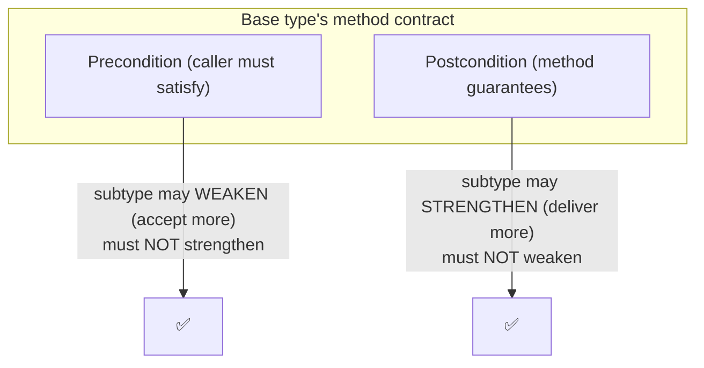
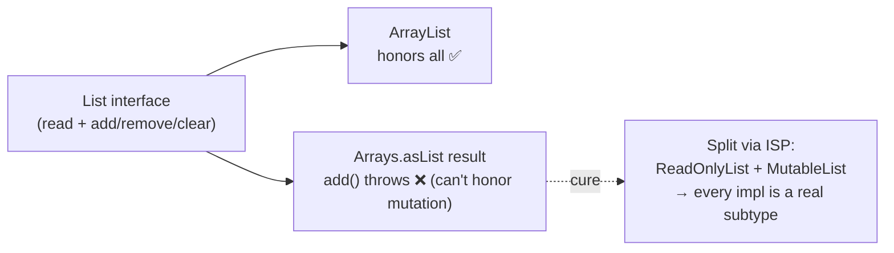

# Liskov Substitution Principle (LSP) — Middle

> **Category:** [Design Principles → SOLID](../../README.md) — the **L** in SOLID: subtypes must be usable anywhere their base type is expected, without breaking the program.

> **Prerequisite:** [Junior](junior.md)
> **Focus:** **Why** and **When** — the contract rules, applied to real code

---

## Table of Contents

1. [Introduction](#introduction)
2. [The Contract Rules in Full](#the-contract-rules-in-full)
3. [Preconditions Cannot Be Strengthened](#preconditions-cannot-be-strengthened)
4. [Postconditions Cannot Be Weakened](#postconditions-cannot-be-weakened)
5. [Invariants Must Be Preserved](#invariants-must-be-preserved)
6. [The History Constraint](#the-history-constraint)
7. [Variance: Arguments, Returns, Exceptions](#variance-arguments-returns-exceptions)
8. [A Real JDK Violation: the Immutable List](#a-real-jdk-violation-the-immutable-list)
9. [How to Fix LSP Violations](#how-to-fix-lsp-violations)
10. [Trade-offs](#trade-offs)
11. [Edge Cases](#edge-cases)
12. [Tricky Points](#tricky-points)
13. [Best Practices](#best-practices)
14. [Test Yourself](#test-yourself)
15. [Summary](#summary)
16. [Diagrams](#diagrams)

---

## Introduction

> Focus: **Why** and **When**

At the junior level, LSP is the slogan "subtypes must be substitutable" plus a few famous traps. At the middle level it becomes a **precise, checkable set of contract rules** you can apply to any proposed subtype *before* it bites you. Those rules — drawn straight from Liskov & Wing (1994) and Bertrand Meyer's **Design by Contract** — are:

1. **Preconditions cannot be strengthened** in the subtype.
2. **Postconditions cannot be weakened** in the subtype.
3. **Invariants** of the supertype **must be preserved**.
4. The **history constraint** — the subtype must not allow state changes the supertype forbade.
5. **Variance**: argument types may be widened (contravariant), return types may be narrowed (covariant), and no new checked exceptions may be thrown.

If a subtype satisfies all five, it is a **behavioral subtype** — substitutable, and safe to plug in anywhere via [OCP](../02-ocp-open-closed/middle.md). If it breaks even one, it's a latent bug. The middle-level skill is recognizing *which* rule a given hierarchy breaks, because the rule you broke tells you how to fix it.

---

## The Contract Rules in Full

LSP is really a statement about **contracts**, not class hierarchies. A method's contract has three parts:

> - **Precondition** — what the *caller* must guarantee before calling (what the method *requires*).
> - **Postcondition** — what the *method* guarantees after returning (what it *ensures*).
> - **Invariant** — what is *always* true of the object, before and after every public method.

A subtype overrides methods, so it can change all three. LSP constrains *how*:

```
                         SUPERTYPE                SUBTYPE may...
   PRECONDITION (require)   "amount > 0"          require the SAME or LESS
                                                   (accept ≥ what base accepts)   ⬇ weaken OK, ⬆ strengthen FORBIDDEN
   POSTCONDITION (ensure)   "returns sorted list" ensure the SAME or MORE
                                                   (deliver ≥ what base delivers)  ⬆ strengthen OK, ⬇ weaken FORBIDDEN
   INVARIANT                "balance ≥ 0"         keep ALL of them (may ADD more)  must hold; never break one
```

The asymmetry is the whole principle: a subtype must be **at least as permissive to callers** (preconditions) and **at least as generous in what it delivers** (postconditions). It may help itself to *more* internal invariants, but it can never weaken the ones callers depend on. Meyer's slogan: **"require no more, promise no less."**

---

## Preconditions Cannot Be Strengthened

A subtype must accept **every** input the base type accepts. It may accept *more* (a weaker, more permissive precondition), but never *fewer*.

```python
class Validator:
    # Precondition: name is a non-empty string.
    def validate(self, name: str) -> bool:
        if not name:
            raise ValueError("name required")
        return len(name) <= 50

class StrictValidator(Validator):
    # ❌ STRENGTHENS the precondition: now also requires no digits.
    def validate(self, name: str) -> bool:
        if any(c.isdigit() for c in name):
            raise ValueError("no digits allowed")   # base accepted "bob42"; this rejects it
        return super().validate(name)
```

A caller written against `Validator` is entitled to pass `"bob42"`. Hand it a `StrictValidator` and that valid call now throws. The subtype demands *more* of the caller than the contract allowed — **substitutability broken.**

> Why strengthening is forbidden: callers were promised the base type's precondition. A stricter subtype rejects inputs the caller is *allowed* to send. **Weakening** a precondition (accepting *more*) is fine — every old caller still works, and a few new inputs now succeed too.

The clean version: if "no digits" is a real, separate rule, it's a *different* abstraction (or a separate validator composed in), not a subtype that secretly rejects what its parent accepted.

---

## Postconditions Cannot Be Weakened

A subtype must guarantee **everything** the base type guarantees. It may promise *more* (a stronger postcondition), but never *less*.

```typescript
class NumberSource {
  // Postcondition: returns a value in [0, 100].
  next(): number {
    return Math.floor(Math.random() * 101);
  }
}

class BrokenSource extends NumberSource {
  // ❌ WEAKENS the postcondition: can now return values outside [0, 100].
  next(): number {
    return Math.floor(Math.random() * 1000);   // up to 999
  }
}

function gauge(src: NumberSource): string {
  const v = src.next();
  return `${v}%`;     // relies on the [0,100] promise — "732%" is nonsense
}
```

`gauge` trusts the documented range. `BrokenSource` delivers *less* certainty than promised, and the caller silently produces garbage. **Delivering less than promised is the violation.** Strengthening a postcondition (e.g., returning a value in the *narrower* `[0, 50]`) is always safe — every caller's expectation is still met, and then some.

---

## Invariants Must Be Preserved

An **invariant** is a property that holds across an object's whole lifetime. A subtype inherits the supertype's invariants and must never break them — though it may add its own (stronger) ones.

```java
class Account {
    protected long balanceCents;
    // INVARIANT: balanceCents >= 0  (never overdrawn)

    void withdraw(long cents) {
        if (cents > balanceCents) throw new IllegalArgumentException("insufficient funds");
        balanceCents -= cents;
    }
}

class OverdraftAccount extends Account {
    private long limitCents = 50_00;
    @Override void withdraw(long cents) {
        balanceCents -= cents;                 // ❌ allows balance to go negative
        // breaks Account's invariant "balanceCents >= 0"
    }
}
```

Any code relying on `Account`'s invariant — `assert balanceCents >= 0`, a UI that never shows negatives, a report that sums positive balances — is now wrong when handed an `OverdraftAccount`. The subtype quietly invalidated a property the whole system trusted.

> Note the direction: a subtype may make an invariant *stronger* (e.g., "balance ≥ 100") without breaking LSP, because everything that was true of the base is still true. It may never make it *weaker* (drop "balance ≥ 0"), because callers depend on it.

If overdrafts are a real requirement, the "never negative" property isn't truly an invariant of the abstraction — so model it explicitly (e.g., a `balance()` that can be negative *by contract*, with both account types honoring that wider contract), rather than smuggling a contract change in through a subclass.

---

## The History Constraint

The subtlest of the five rules, introduced by Liskov & Wing. It governs how an object's state may **change over time**:

> **The history constraint:** a subtype may not permit state changes that the supertype's contract forbids. Even if every individual method honors pre/postconditions, the *sequence* of allowed mutations must not exceed what the base type allows.

The classic case is **a mutable subtype of an immutable type.** Suppose the base type promises immutability — once constructed, its observable state never changes:

```java
class Point {                          // contract: immutable. x and y never change after construction.
    private final int x, y;
    Point(int x, int y) { this.x = x; this.y = y; }
    int getX() { return x; }
    int getY() { return y; }
}
```

A caller may safely cache a `Point`, use it as a map key, or share it across threads — all *because* it never changes. Now imagine a `MutablePoint extends Point` that adds `setX(int)`. Even though `setX` has a perfectly reasonable contract of its own, it introduces a **state transition the supertype forbade** ("x changes after construction"). Every caller that relied on immutability — the map key, the cache, the shared reference — is now broken, intermittently and invisibly.

That's the history constraint: the subtype widened the *set of allowed histories* (sequences of states) beyond what the base type permitted. **A method-by-method check would pass; the violation is only visible across the object's lifetime.** This is precisely why "make the base type immutable" is such a powerful LSP cure — an immutable contract has the simplest possible history (it never changes), and almost any subtype that adds mutation violates it.

---

## Variance: Arguments, Returns, Exceptions

The five rules cast as *type* rules — how an overriding method's signature may legally change:

| Aspect | Rule | Direction | Mnemonic |
|---|---|---|---|
| **Parameter types** | May be the **same or wider** (a supertype of the original) | **Contravariant** | accept *more* → require less of callers |
| **Return type** | May be the **same or narrower** (a subtype of the original) | **Covariant** | return *more specific* → deliver at least as much |
| **Exceptions** | May throw the **same or fewer/narrower** checked exceptions; **no new ones** | Covariant-ish | surprise callers with *fewer* failures, never more |

### Covariant returns (legal, and Java supports them)

```java
class AnimalShelter {
    Animal adopt() { /* ... */ return new Animal(); }
}
class CatShelter extends AnimalShelter {
    @Override Cat adopt() { /* ... */ return new Cat(); }   // ✅ Cat is-a Animal: narrower return is fine
}
```

A caller expecting an `Animal` still gets one (a `Cat` is an `Animal`). Returning something *more specific* delivers *at least* what was promised — postcondition strengthened. Java allows this directly (**covariant return types**, since Java 5).

### Contravariant parameters (the theory; most languages restrict it)

In theory, an override may *widen* a parameter: if the base accepts a `Cat`, the override could accept any `Animal` (it can handle the `Cat` and more). This **weakens the precondition**, which is allowed. In practice, **Java/C#/TypeScript treat a method with a wider parameter as an *overload*, not an override** — only invariant parameters override. So you rarely write contravariant parameters, but the *principle* is why widening a parameter would be safe and narrowing it would not.

### Exceptions: no new surprises

```java
class Reader {
    String read() throws IOException { /* ... */ return ""; }
}
class BadReader extends Reader {
    @Override
    String read() throws IOException, SQLException { /* ... */ }  // ❌ won't even compile: new checked exception
}
```

A subtype may throw the same or *fewer* exceptions, or subtypes of the declared ones. It may **not** introduce a new checked exception type the caller wasn't told to handle — that's a postcondition weakening (the method now has a failure mode the contract didn't list). Java enforces this for *checked* exceptions; for unchecked (runtime) exceptions, the compiler won't help — throwing a surprise `RuntimeException` is still an LSP violation, just one only reasoning (or tests) can catch.

---

## A Real JDK Violation: the Immutable List

LSP violations aren't just textbook hypotheticals — the **Java standard library ships several.** The most-cited:

```java
List<String> fixed = Arrays.asList("a", "b", "c");
fixed.add("d");   // 💥 throws UnsupportedOperationException at runtime
```

`Arrays.asList(...)` returns a `List` backed by the array — a fixed-size list whose `add`, `remove`, and `clear` throw `UnsupportedOperationException`. Same for `List.of(...)`, `Collections.unmodifiableList(...)`, and `Collections.emptyList()`.

The problem: `java.util.List`'s contract *declares* `add()` as a mutating operation callers may use. By returning a `List` whose `add()` throws, these factory methods hand back a type that **cannot keep `List`'s promise** — an LSP violation baked into the platform.

```
   void appendAll(List<String> dst, List<String> src) {  // written against List's contract
       for (String s : src) dst.add(s);                   // perfectly legal per the List interface
   }
   appendAll(new ArrayList<>(), src);          // fine
   appendAll(Arrays.asList(...), src);         // 💥 UnsupportedOperationException — caller did nothing wrong
```

How did the JDK end up here? `List` is a **fat interface** that bundles read operations *and* mutation operations into one contract, forcing every implementation to either support mutation or fake it with a thrown exception. The JDK chose to throw — accepting a known LSP violation rather than splitting `List` into `ReadOnlyList` + `MutableList`. **This is the textbook link between LSP and the [Interface Segregation Principle](../04-isp-interface-segregation/middle.md):** a fat interface *forces* LSP violations, because no single subtype can honestly implement all of it. Segregating the interface (a read-only contract that never promises `add`) would have removed the violation entirely.

> Lesson for your own code: when you find yourself implementing an interface method by throwing "unsupported," the interface is too fat. Split it (ISP) so each type implements only what it can truly honor — then every implementation is a real behavioral subtype.

---

## How to Fix LSP Violations

Five fixes, in rough order of preference:

| Fix | When to reach for it | Why it works |
|---|---|---|
| **Model the real abstraction** | The hierarchy claims a false "is-a" | Put each method on a type that can *always* honor it (`FlyingBird.fly`, `Shape.area`) so no subtype must fake one. |
| **Make the type immutable** | Violations live in setters/mutators (Rectangle/Square, mutable Point) | No setters → no contract to weaken; simplest possible history → history constraint trivially satisfied. |
| **Narrow the interface (ISP)** | One fat interface forces "unsupported" stubs (List) | Each smaller interface is honestly implementable → every implementor is a true subtype. |
| **Prefer composition over inheritance** | You only wanted code reuse, and IS-SUBSTITUTABLE-FOR is false | Wrap the collaborator and expose only what you can support — no false subtype claim. |
| **Tell, don't ask (no `instanceof`)** | Clients branch on concrete type | If clients must `instanceof`, the subtypes aren't substitutable — fix the contract so one polymorphic call suffices. |

### Worked fix — Rectangle/Square via immutability + a real abstraction

```python
from dataclasses import dataclass
from typing import Protocol

class Shape(Protocol):
    def area(self) -> float: ...      # the ONLY promise — both can keep it

@dataclass(frozen=True)               # frozen ⇒ immutable ⇒ no setters to betray
class Rectangle:
    width: float
    height: float
    def area(self) -> float: return self.width * self.height

@dataclass(frozen=True)
class Square:
    side: float
    def area(self) -> float: return self.side * self.side
```

`Square` and `Rectangle` are now **siblings**, not parent/child. The contract they share (`area()`) is one both honor unconditionally, and immutability deletes the `setWidth`/`setHeight` problem at the root. Two of the five fixes combined.

---

## Trade-offs

| Decision | LSP-strict (real subtypes only) | Loose (lean on "is-a", patch with checks) |
|---|---|---|
| Caller simplicity | High — one polymorphic call, no type checks | Low — clients riddled with `instanceof`/special cases |
| Adding a new subtype later | Safe ([OCP](../02-ocp-open-closed/middle.md) holds) | Risky — may break callers that assumed the old set |
| Up-front modeling effort | Higher — must find the *real* abstraction | Lower — slap `extends` on and move on |
| Bug class | Few; substitution is safe by construction | "Works until you pass the wrong subtype" runtime surprises |
| Hierarchy shape | Often flatter; more composition | Deep, tempting, fragile inheritance trees |

The honest tension: **finding the true abstraction is real work**, and sometimes a quick `extends` ships faster. But LSP violations are a particularly nasty bug class — they pass code review and tests with the "normal" subtype and detonate later when a different subtype flows through. The strict approach front-loads thinking to eliminate an entire category of runtime surprises.

---

## Edge Cases

### 1. The base type's contract is *implicit*

Most contracts aren't written down — they're implied by the base type's behavior and name. `Rectangle` never *documents* "width and height are independent," but callers rely on it. **Part of LSP discipline is making implicit contracts explicit** (in docs, types, or tests) so subtypes can be checked against them.

### 2. Empty / no-op overrides

A subtype that overrides a method to do *nothing* may or may not violate LSP — it depends on the contract. If the base method's postcondition is "best-effort logging," a no-op logger is fine. If it's "the item is persisted," a no-op `save()` is a silent weakening. **Judge against the contract, not the method body.**

### 3. Throwing on a method that's *contractually* optional

Some interfaces explicitly declare a method optional ("implementations *may* throw `UnsupportedOperationException`"). `java.util.Collection` does exactly this for mutators. When the contract *itself* sanctions the throw, a throwing implementation is technically conformant — the LSP problem has been pushed into the *interface design* (still an ISP smell), not the implementation. The contract being honest about its own weakness doesn't make the fat interface a good idea.

---

## Tricky Points

- **"Weaken precondition" and "weaken postcondition" pull in opposite directions.** Subtypes may *weaken preconditions* (accept more) but must *not weaken postconditions* (deliver less). Memorize: **require no more, promise no less.** Mixing these up is the #1 LSP confusion.
- **The history constraint is invisible to per-method checking.** A mutable subtype of an immutable type can have every method individually contract-correct and still violate LSP across the object's lifetime. Reason about *sequences of states*, not single calls.
- **Covariant returns are safe and supported; contravariant parameters are safe but usually unsupported.** Java gives you covariant returns directly; it treats widened parameters as overloads, so you mostly can't write the (legal) contravariant case.
- **Unchecked exceptions dodge the compiler but not LSP.** Throwing a surprise `RuntimeException`/`NotImplementedError` a base type never implied is a real violation the type system won't catch.
- **A fat interface manufactures LSP violations.** If an interface bundles capabilities no single type can all honor, implementers *must* fake some — which is why [ISP](../04-isp-interface-segregation/middle.md) and LSP are two views of the same problem.

---

## Best Practices

1. **Check the five rules before subclassing:** preconditions (no stronger), postconditions (no weaker), invariants (preserved), history (no new state transitions), variance (covariant returns, no new exceptions).
2. **Make the abstraction's contract explicit** — in docstrings, types, and (best) a shared test suite every subtype must pass.
3. **Default to immutability** to neutralize the setter and history-constraint violations in one move.
4. **Split fat interfaces (ISP)** so no implementation has to throw "unsupported."
5. **Reach for [composition](../../02-coupling-and-cohesion/05-composition-over-inheritance/middle.md)** the instant IS-A is true but IS-SUBSTITUTABLE-FOR is false.
6. **Write a contract test against the base type** and run *every* subtype through it — the most practical LSP enforcement you can automate (deepened at [Senior](senior.md)).

---

## Test Yourself

1. State Meyer's "require no more, promise no less" in terms of preconditions and postconditions.
2. Which direction may a subtype move a precondition? A postcondition? Why the asymmetry?
3. What is the history constraint, and why can't a per-method contract check catch its violations?
4. Explain covariant return types vs. contravariant parameters — which does Java actually let you write?
5. Why is `Arrays.asList(...).add(x)` throwing an LSP violation, and how does ISP relate?
6. Name the five fixes for an LSP violation and when each applies.

---

## Summary

- LSP is a set of **contract rules**: preconditions **can't be strengthened**, postconditions **can't be weakened**, invariants **must be preserved**, the **history constraint** forbids new state transitions, and overrides obey **variance** (covariant returns, no new exceptions).
- Meyer's compression: **"require no more, promise no less."** The asymmetry between preconditions (may weaken) and postconditions (may strengthen) is the core.
- The **history constraint** is why mutable subtypes of immutable types are LSP bugs — and why immutability is such a strong cure.
- The **immutable `List` in the JDK** (`Arrays.asList`, `List.of`, `unmodifiableList`) is a real shipping violation, caused by a **fat interface** — the direct tie to **[ISP](../04-isp-interface-segregation/middle.md)**.
- **Fixes:** model the real abstraction, make it immutable, narrow the interface (ISP), prefer [composition](../../02-coupling-and-cohesion/05-composition-over-inheritance/middle.md), and eliminate client `instanceof`.

---

## Diagrams

### Require no more, promise no less



### Fat interface forces an LSP violation (the List case)




---

## Check your understanding

1. Explain Liskov Substitution Principle (LSP) — Middle Level in your own words and name the problem it solves.
2. How would you apply the ideas around Table of Contents, Introduction, The Contract Rules in Full in a realistic engineering change?
3. What failure mode or misuse should you look for, and what evidence would reveal it?
4. Which local design trade-off would make you choose or reject Liskov Substitution Principle (LSP) — Middle Level in an existing codebase?
5. What observable result would convince you that the approach improved the system?
