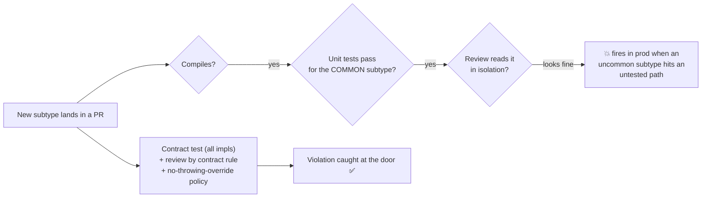
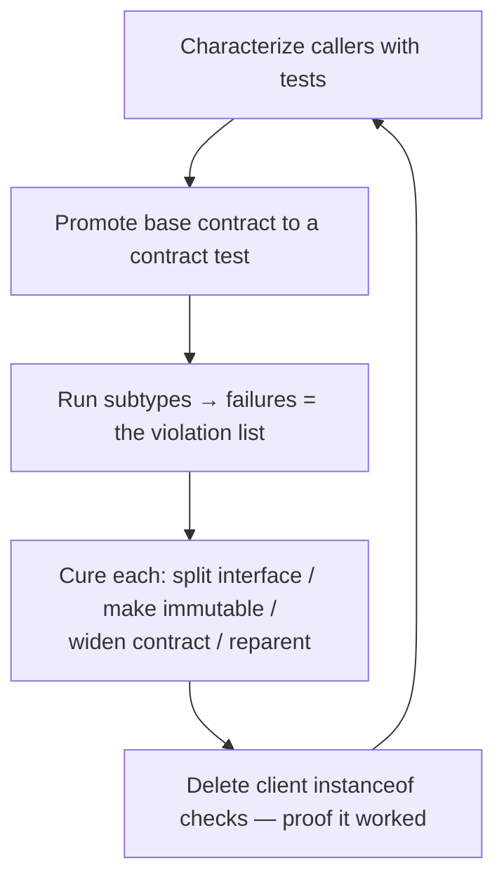

# Liskov Substitution Principle (LSP) — Professional

> **Category:** [Design Principles → SOLID](../../README.md) — the **L** in SOLID: subtypes must be usable anywhere their base type is expected, without breaking the program.

> **Prerequisites:** [Junior](junior.md) · [Middle](middle.md) · [Senior](senior.md)
> **Focus:** **Production** — reviews, real incidents, team conventions, legacy refactoring

---

## Table of Contents

1. [Introduction](#introduction)
2. [Enforcing LSP in Code Review](#enforcing-lsp-in-code-review)
3. [Contract Tests as a Team Standard](#contract-tests-as-a-team-standard)
4. [Real Incidents](#real-incidents)
5. [Team Conventions for Substitutability](#team-conventions-for-substitutability)
6. [Refactoring Legacy LSP Violations](#refactoring-legacy-lsp-violations)
7. [Substitutability Beyond Classes: APIs and Services](#substitutability-beyond-classes-apis-and-services)
8. [Review Checklist](#review-checklist)
9. [Cheat Sheet](#cheat-sheet)
10. [Diagrams](#diagrams)
11. [Related Topics](#related-topics)

---

## Introduction

> Focus: **production** — keeping subtypes honest across a large, multi-contributor codebase.

LSP violations are uniquely insidious in production because they **pass every gate that usually catches bugs.** They compile. They pass the unit tests — *for the common subtype the author tested.* They pass review, because the violation is in the *relationship* between two types, not visible in either file alone. Then, months later, an uncommon subtype flows through a code path nobody exercised, and a "this can never happen" exception fires in production, or a silently-weakened postcondition corrupts data without throwing at all.

At the professional level the job is to **build the system that catches behavioral-subtype violations before production**: review habits tuned to the smell, contract tests that make implicit contracts executable, conventions that stop the fragile hierarchies forming in the first place, and a disciplined way to dismantle the LSP violations already entrenched in legacy code. The compiler won't help you here — your process has to.

---

## Enforcing LSP in Code Review

The reviewer's challenge: LSP violations don't live in a diff, they live in a *relationship*. You have to read a new subtype and mentally check it against the base type's contract — which is often undocumented. A disciplined reviewer asks a fixed set of questions.

### Review by contract rule

1. **Override audit.** For every overridden method, ask: *Does it accept everything the base accepts (no stronger precondition)? Does it deliver everything the base promises (no weaker postcondition)? Does it throw anything new?*
2. **The throw test.** Does any override throw `UnsupportedOperationException` / `NotImplementedError` / `raise NotImplementedError`? **That's an LSP violation by definition** — the subtype is announcing it can't keep the contract. Push back hard.
3. **The invariant audit.** Does the subtype touch a field or state the base type guarantees something about? (Balance ≥ 0, immutability, "sorted," "non-empty"?)
4. **The history audit.** Does the subtype add mutation to something the base treats as immutable, or otherwise permit a state transition the base forbade?
5. **The client smell.** Does *this PR* (or the code it touches) add `instanceof`/`isinstance`/downcasts/`if type ==` to handle the new subtype? If clients must special-case it, it isn't substitutable.

### The highest-value review questions

> **"Does this override throw, return null, or refuse an input where the base type succeeds?"**

> **"If I pass this subtype to existing code that expects the base type, does anything break?"**

The second question reframes the whole review: a subtype is correct *only* if it can be handed, unannounced, to every existing consumer of the base type. Ask the author to name a consumer that *can't* take it — if one exists, the design is wrong.

### Review comment templates

> "`adopt()` here throws `UnsupportedOperationException` for `ShelterX`. Anything iterating `List<Shelter>` and calling `adopt()` will crash on this one. This isn't a `Shelter` — let's split the interface so only adoptable shelters expose `adopt()` (ISP)."

> "`Square extends Rectangle`: `setHeight` changes the width too, so it breaks the postcondition every `Rectangle` caller relies on. These should be immutable siblings under a `Shape` interface, not parent/child."

> "This override narrows the accepted range to multiples of 100 — that's a *stronger* precondition than the base. A caller passing `50` (valid per the base contract) will now be rejected. Either widen it back or this is a different abstraction."

> "I see a new `if (account instanceof OverdraftAccount)` in `Reporting`. That's the tell that `OverdraftAccount` isn't substitutable for `Account`. Can we fix the contract so reporting doesn't need to know the subtype?"

---

## Contract Tests as a Team Standard

The professional answer to "contracts are implicit and reviewers are fallible" is to make conformance **executable and mandatory.** Codify the supertype's contract as an abstract test suite that *every* implementation must pass.

```java
// One contract suite. Every PaymentGateway implementation extends it and
// runs the same behavioral checks. A non-substitutable subtype fails CI.
abstract class PaymentGatewayContractTest {
    abstract PaymentGateway gateway();

    @Test void charge_returns_receipt_with_matching_amount() {
        Receipt r = gateway().charge(Money.of(10_00));
        assertEquals(Money.of(10_00), r.amount());   // postcondition all gateways must keep
    }

    @Test void charge_rejects_non_positive_amount() {
        assertThrows(IllegalArgumentException.class,
                     () -> gateway().charge(Money.of(0))); // precondition all gateways share
    }

    @Test void charge_never_throws_on_a_valid_amount() {
        assertDoesNotThrow(() -> gateway().charge(Money.of(1_00)));
    }
}

class StripeGatewayTest extends PaymentGatewayContractTest {
    PaymentGateway gateway() { return new StripeGateway(fakeStripe()); }
}
class AdyenGatewayTest  extends PaymentGatewayContractTest {
    PaymentGateway gateway() { return new AdyenGateway(fakeAdyen()); }
}
```

Now adding a new gateway that strengthens a precondition, weakens a postcondition, or throws something new **fails the inherited suite in CI** — the LSP violation is caught at the door. Make "every implementation of a key abstraction extends its contract test" a *team standard*, enforced in review. This is the single highest-leverage LSP practice a professional can institutionalize; it converts a principle that no compiler checks into a green/red CI signal.

> Extend the same idea to **test doubles**: a fake/stub that stands in for a real collaborator should pass the *same* contract test, or it's an LSP violation in your test harness that will give you green tests over broken production behavior.

---

## Real Incidents

### Incident 1: The read-only repository that threw in production

A team introduced a `CachingReadOnlyRepository implements Repository` to speed up reads. `Repository` declared `save(entity)`; the read-only cache "implemented" it by throwing `UnsupportedOperationException` — "nobody calls `save` on the cache anyway." Eighteen months later a refactor routed a write path through a generic `Repository` reference that, in one configuration, resolved to the caching repo. **Result:** a customer's data update silently failed with a 500 in production; the write was lost. **Postmortem:** classic throwing-override LSP violation — the cache was *not* a `Repository`. **Fix:** split the interface (ISP) into `ReadRepository` and `WriteRepository`; the cache implements only `ReadRepository`, so the bad route became a *compile error*. **Lesson:** "nobody calls it" is not a contract — the type system routes calls you didn't anticipate.

### Incident 2: The Square/Rectangle that corrupted invoices

A reporting module computed bounding boxes for printed invoices using a `Rectangle` with `setWidth`/`setHeight`. A new "square stamp" feature added `Square extends Rectangle`. Layout code set width and height independently; for squares, the second setter clobbered the first, producing wrong dimensions and overlapping print elements on a subset of invoices. **It passed tests** because the test fixtures used `Rectangle`, never `Square`, through that path. **Fix:** made the shapes immutable value objects implementing a common `Bounded` interface; the independent-setter contract that `Square` couldn't keep was deleted. **Lesson:** the canonical textbook violation is a *real* production bug, and tests using only the base type will never catch it — you must test the *subtype* through the *base-typed* path.

### Incident 3: The mock that lied

A service's tests used a hand-rolled `FakeUserStore` standing in for `UserStore`. The real store rejected duplicate emails (a precondition/invariant); the fake silently accepted them. Tests of the "create user" flow passed. In production, the real store's duplicate-email rejection surfaced an unhandled exception path the tests never exercised. **Fix:** ran `FakeUserStore` through the *same* `UserStoreContractTest` the real store passed; the fake immediately failed the "rejects duplicate email" test and was corrected. **Lesson:** a test double is a subtype subject to LSP. An over-permissive double is a behavioral-subtype violation that produces *false confidence* — the most dangerous kind of green test.

### Incident 4: The covariant array that threw

A Java service stored `String[]` but passed it around as `Object[]` (legal — Java arrays are covariant). A logging utility, written against `Object[]`, occasionally wrote an `Integer` into a slot. At that write, the JVM threw `ArrayStoreException` in production — Java's runtime guard against the unsound covariance. **Fix:** used `List<String>` (invariant generics) instead of arrays; the compiler then rejected the bad write at build time. **Lesson:** Java arrays are a *known, language-level* LSP hole; prefer invariant generic collections, which encode LSP's variance rules and move the error from runtime to compile time.

---

## Team Conventions for Substitutability

Codify these so substitutability is the default, not a per-PR argument:

1. **No throwing overrides.** A subtype may not "implement" an inherited method by throwing `Unsupported`/`NotImplemented`. If it can't honor the method, the interface is too fat — **split it (ISP)** instead. This single rule eliminates the most common LSP violation.
2. **Every key abstraction has a contract test** that all implementations (and test doubles) must extend and pass.
3. **Prefer immutability** for value-like types — it neutralizes the setter and history-constraint violations (Rectangle/Square, mutable Point) by construction.
4. **`instanceof`/downcasts in client code require a comment justifying them** (and ideally a reviewer's blessing). They're guilty-until-proven-innocent of signalling an LSP violation.
5. **Favor composition over inheritance** by default; reach for `extends` only when IS-SUBSTITUTABLE-FOR is demonstrably true, not just IS-A.
6. **Cap inheritance depth** (e.g., two levels) in new code — every level multiplies the contracts a leaf must transitively honor.
7. **Prefer invariant generic collections over covariant arrays** (Java) — encode variance through the type system, catch violations at compile time.

These convert the senior reasoning into rules juniors follow by default and reviewers cite as policy, not opinion.

---

## Refactoring Legacy LSP Violations

Legacy systems are full of entrenched LSP violations — throwing overrides, `Square`-style hierarchies, and clients that have grown `instanceof` checks to cope with them. The professional approach is incremental and test-guarded; never a big-bang rewrite.

### The sequence

1. **Characterize first.** Before touching the hierarchy, write tests that pin *current* behavior of every caller of the base type — including the broken paths and the `instanceof` workarounds. You can't refactor safely without a behavior net. (See [Refactoring as a Discipline](../../../craftsmanship-disciplines/03-refactoring-as-a-discipline/junior.md).)
2. **Promote the contract to a test.** Encode the base type's *intended* contract as an abstract contract test; run every existing subtype through it. The failures are your prioritized list of violations.
3. **Pick the right cure per violation** (from [Middle](middle.md)/[Senior](senior.md)):
   - Throwing override → **split the interface (ISP)** so the type implements only what it can honor.
   - Mutable constrained subtype (Square/Circle) → **make immutable** and/or reparent under a common interface.
   - Subtype that breaks an invariant → **widen the base contract** to the honest common denominator, or split the type.
4. **Remove client `instanceof` last.** Once subtypes are genuinely substitutable, the type checks in clients become dead code — delete them. Their disappearance is the proof the refactor worked.
5. **Strangle, don't rewrite.** For a deeply broken hierarchy, introduce the corrected interface alongside the old one and migrate callers incrementally (Strangler Fig), rather than swapping everything at once.

### What *not* to do

- **Don't "fix" a violation by adding more `instanceof`.** Special-casing the misbehaving subtype in clients *entrenches* the violation and spreads it. Fix the contract, not the caller.
- **Don't delete the throwing override and leave the fat interface.** That just moves the crash; the interface still promises something some implementor can't deliver. Split the interface.
- **Don't refactor a hierarchy with no characterization tests.** LSP refactors change dispatch behavior in subtle ways; without a net, you'll trade a known violation for an unknown regression.

---

## Substitutability Beyond Classes: APIs and Services

At professional scale, LSP's most expensive violations are often *not* in class hierarchies — they're at **versioned API and service boundaries**, where "v2 must be substitutable for v1" is the same principle one level up.

- **API versioning is LSP.** A new API version is a "subtype" of the old contract if old clients keep working against it. **Strengthening a precondition** (a field that was optional is now required) or **weakening a postcondition** (a field clients relied on is no longer guaranteed) is an LSP violation that breaks every client — exactly the class-level rules, applied to wire contracts. Backward-compatible evolution *is* behavioral subtyping.
- **Consumer-driven contract tests** (e.g., Pact) are contract tests for services: the consumer encodes the contract it depends on, and the provider's CI fails if a change would violate substitutability for that consumer. This is the same "run every implementation through the contract suite" idea, across a network boundary.
- **The Robustness Principle interacts here:** "be liberal in what you accept" *weakens* preconditions (LSP-safe for new versions); "be conservative in what you send" keeps postconditions *at least* as strong. Backward compatibility is LSP plus the [Robustness Principle](../../02-coupling-and-cohesion/07-robustness-principle/professional.md).

> The professional reframing: **LSP is the theory of backward compatibility.** Whether the "subtype" is a subclass, a mock, a new API version, or a service implementation, the rule is identical — require no more, promise no less, never surprise the consumer who only knows the published contract.

---

## Review Checklist

```text
LSP REVIEW CHECKLIST
[ ] No override throws UnsupportedOperationException/NotImplementedError
[ ] Every override ACCEPTS everything the base accepts (no stronger precondition)
[ ] Every override DELIVERS everything the base promises (no weaker postcondition)
[ ] No override introduces a new exception type the base didn't declare/imply
[ ] No subtype breaks a base invariant (balance≥0, immutable, sorted, non-empty)
[ ] No subtype adds a state transition the base forbids (history constraint)
[ ] No new instanceof / isinstance / downcast / "if type ==" in CLIENT code
[ ] Return types only narrowed (covariant); generics use invariant collections
[ ] The subtype could be handed, unannounced, to EVERY existing base-type consumer
[ ] A contract test exists for the abstraction; this impl (and its doubles) pass it
[ ] (APIs) new version is backward compatible: pre not stronger, post not weaker
```

---

## Cheat Sheet

```text
THE INSTANT-FAIL SMELL
  override that throws "Unsupported"/"NotImplemented"  → LSP violation, every time
  instanceof / downcast in CLIENT code                 → subtype isn't substitutable

THE TWO REVIEW QUESTIONS
  "Does this override throw/return null/refuse input where the base succeeds?"
  "Can this subtype be handed, unannounced, to EVERY existing base-type consumer?"

ENFORCE
  contract test per abstraction; ALL impls + ALL test doubles must pass it.
  Run the subtype through the BASE-TYPED path in tests (not just the base type).

FIXES (legacy & new)
  throwing override        → split the interface (ISP)
  Square/Circle (mutable)  → make immutable + common interface
  invariant break          → widen base contract OR split the type
  client instanceof        → fix the contract; delete the checks last
  covariant array (Java)   → use invariant generic collections

SCALE-UP
  API v2 substitutable for v1 = LSP at the wire boundary (backward compatibility).
  consumer-driven contract tests = contract tests across a network boundary.
```

---

## Diagrams

### Where LSP violations slip through — and where to stop them



### Legacy LSP remediation



---

## Related Topics

- **The cure that removes throwing overrides:** [Interface Segregation Principle](../04-isp-interface-segregation/professional.md)
- **LSP makes this safe:** [Open/Closed Principle](../02-ocp-open-closed/professional.md)
- **Default fix for false is-a:** [Composition Over Inheritance](../../02-coupling-and-cohesion/05-composition-over-inheritance/professional.md)
- **Backward compatibility at the wire:** [Robustness Principle](../../02-coupling-and-cohesion/07-robustness-principle/professional.md)
- **How the five interlock:** [SOLID as a Whole and Smells](../06-solid-as-a-whole-and-smells/professional.md)
- **Refactoring net:** [Refactoring as a Discipline](../../../craftsmanship-disciplines/03-refactoring-as-a-discipline/junior.md)

---


---

## Check your understanding

1. Explain Liskov Substitution Principle (LSP) — Professional Level in your own words and name the problem it solves.
2. How would you apply the ideas around Table of Contents, Introduction, Enforcing LSP in Code Review in a realistic engineering change?
3. What failure mode or misuse should you look for, and what evidence would reveal it?
4. How would you introduce and govern Liskov Substitution Principle (LSP) — Professional Level across teams through reversible, measurable increments?
5. What observable result would convince you that the approach improved the system?
