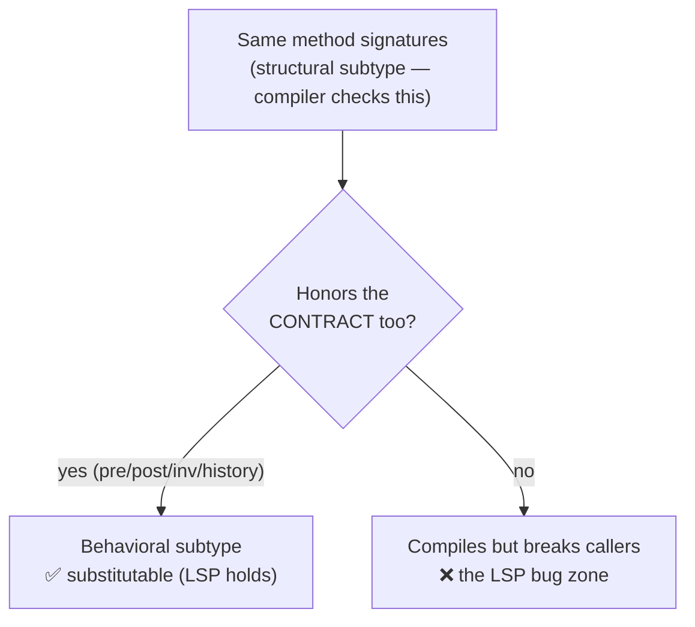
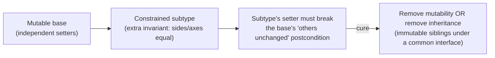

# Liskov Substitution Principle (LSP) — Senior

> **Category:** [Design Principles → SOLID](../../README.md) — the **L** in SOLID: subtypes must be usable anywhere their base type is expected, without breaking the program.

> **Prerequisites:** [Junior](junior.md) · [Middle](middle.md)
> **Focus:** **Design trade-offs** and **system-level reasoning**

---

## Table of Contents

1. [Introduction](#introduction)
2. [Liskov & Wing, Precisely](#liskov-wing-precisely)
3. [Design by Contract: LSP's Theoretical Home](#design-by-contract-lsps-theoretical-home)
4. [LSP Is About Contracts, Not Hierarchies](#lsp-is-about-contracts-not-hierarchies)
5. [The Circle-Ellipse Problem](#the-circle-ellipse-problem)
6. [Comparisons: LSP vs OCP, ISP, and Composition](#comparisons-lsp-vs-ocp-isp-and-composition)
7. [Enforcing LSP: Contract Tests](#enforcing-lsp-contract-tests)
8. [Variance in the Type System](#variance-in-the-type-system)
9. [Partial Substitutability and the Real World](#partial-substitutability-and-the-real-world)
10. [Dynamic Languages and Duck Typing](#dynamic-languages-and-duck-typing)
11. [Liabilities](#liabilities)
12. [Pros & Cons at the System Level](#pros-cons-at-the-system-level)
13. [Diagrams](#diagrams)
14. [Related Topics](#related-topics)

---

## Introduction

> Focus: **design trade-offs** and **system-level reasoning**

At the senior level, LSP stops being "don't make a `Square extend Rectangle`" and becomes a lens on a deeper question: **what does it actually mean for one type to be a subtype of another?** The naive answer — "it implements the interface / extends the class" — is the *syntactic* (structural) notion the compiler checks. LSP is the *semantic* notion: **behavioral subtyping**, where the subtype honors not just the supertype's *signatures* but its *contract*. The gap between those two notions is where every LSP bug lives.

This file covers the three hard senior questions:

1. **What's the precise formal definition** (Liskov & Wing) and its grounding in Design by Contract?
2. **How do you enforce LSP at scale** when contracts are mostly implicit? (Contract tests.)
3. **When is strict LSP impractical**, and how do partial substitutability and dynamic typing change the calculus?

---

## Liskov & Wing, Precisely

The 1994 paper *A Behavioral Notion of Subtyping* (Liskov & Wing) gives the rigorous definition the slogan compresses. Subtyping is defined by a **subtype requirement**:

> Let `φ(x)` be a property provable about objects `x` of type `T`. Then `φ(y)` must hold for objects `y` of type `S` where `S <: T`.

The paper decomposes this into concrete obligations a behavioral subtype `S` of `T` must meet:

| Obligation | Rule |
|---|---|
| **Preconditions** | `S`'s methods require **no more** than `T`'s (`pre_T ⟹ pre_S`). |
| **Postconditions** | `S`'s methods guarantee **no less** than `T`'s (`post_S ⟹ post_T`). |
| **Invariants** | Every invariant of `T` is preserved by `S`. |
| **History constraint** | `S` introduces no state change that `T`'s methods could not produce — `S`'s reachable state-transition relation is a subset of `T`'s. |

The **history constraint** is the paper's key novel contribution and the part most engineers miss. Earlier subtyping notions (e.g., America's) covered pre/post/invariants but not the *temporal* dimension. Liskov & Wing observed that you can satisfy every method-local contract and *still* break substitutability if the subtype permits state evolutions the supertype forbade (the immutable→mutable case from [Middle](middle.md)). Substitutability is a property of the type's *entire observable behavior over time*, not its methods in isolation.

> The senior reframing: **a behavioral subtype's set of possible "histories" (sequences of observable states) must be a subset of the supertype's.** It can do *fewer* things, never *more*, with the object's lifecycle.

---

## Design by Contract: LSP's Theoretical Home

LSP did not arrive in a vacuum. Bertrand Meyer's **Design by Contract** (DbC, in *Object-Oriented Software Construction* and the Eiffel language) had already formalized the precondition/postcondition/invariant machinery, and Meyer derived the **subcontracting rule** that *is* LSP from the caller's side:

> A redefined (overriding) routine may only **weaken the precondition** and **strengthen the postcondition** of the routine it redefines. Class invariants accumulate down the hierarchy (a subclass's invariant implies the parent's).

DbC frames the supertype as a **legal contract** between a routine and its callers, and a subtype as a **subcontractor**. A subcontractor may accept jobs the prime contractor would refuse (weaker precondition) and may deliver above spec (stronger postcondition), but it may **never** refuse a job the prime contractor accepted or deliver below spec. LSP is exactly the rule that makes subcontracting transparent to the client — the client signed a contract with the supertype and must never be able to tell that a subtype fulfilled it.

```
   CLIENT ── contract ──▶ SUPERTYPE (prime contractor)
                              │ delegates to
                              ▼
                          SUBTYPE (subcontractor)
   Must be INVISIBLE to the client:
     • accepts everything the supertype accepted (pre weaker/equal)
     • delivers everything the supertype promised (post stronger/equal)
     • never violates an invariant the client relies on
```

This is why **LSP is properly understood as a contract rule, not an inheritance rule.** Inheritance is merely one *mechanism* by which a subtype claims to fulfill a supertype's contract. Interface implementation, structural typing, and duck typing are others. LSP governs all of them, because all of them make the same promise to clients: *"you can treat this as a `T`."*

---

## LSP Is About Contracts, Not Hierarchies

A crucial senior shift: **stop thinking about LSP in terms of `extends`.** The principle applies wherever one type is *used as* another:

- A Go `struct` satisfying an `interface` (structural, no `extends` keyword).
- A Python object passed where another is expected (duck typing).
- A TypeScript object literal assigned to an interface type.
- A mock/stub standing in for a real collaborator in a test.

In *every* case, the substituted thing must honor the expected type's contract, or callers break. The "hierarchy" framing is an artifact of how LSP is usually taught (with Java `class` diagrams); the *principle* is **substitutability of contracts**, and it's just as live in languages with no inheritance at all.

A practical consequence: **a test double is subject to LSP.** A mock that returns values the real collaborator never would, or accepts inputs the real one rejects, is an LSP violation — your tests pass against a "subtype" that doesn't behave like production. This is a major (and underappreciated) source of "green tests, broken prod."

---

## The Circle-Ellipse Problem

The Circle-Ellipse problem is the Rectangle/Square problem's more general twin, and it sharpens the lesson. In math, a **circle is an ellipse with equal axes.** So:

```java
class Ellipse {
    protected double a, b;                 // semi-axes
    void setA(double a) { this.a = a; }    // stretch horizontally — independent
    void setB(double b) { this.b = b; }    // stretch vertically — independent
    double area() { return Math.PI * a * b; }
}

class Circle extends Ellipse {
    // To stay a circle, a must equal b. So setA must also set b... and now
    // setA's postcondition ("b unchanged") is broken — same trap as Square.
    @Override void setA(double r) { this.a = r; this.b = r; }
    @Override void setB(double r) { this.a = r; this.b = r; }
}
```

Identical pathology to Rectangle/Square: a mutable `Circle` cannot honor `Ellipse`'s promise that `setA` and `setB` are independent. But Circle-Ellipse exposes the *general principle* better, because it shows the violation is fundamentally about **a constrained subtype of a less-constrained mutable type**. Whenever a subtype must enforce an extra constraint (axes equal, sides equal, balance ≥ limit) that the base type's mutators can violate, you have the trap.

The set of resolutions is the senior toolkit for *all* such problems:

1. **Make the base immutable.** No mutators → no postcondition to break. `Circle` and `Ellipse` become immutable siblings (or `Circle` *is* immutably an `Ellipse`, since an immutable ellipse never gets stretched). **This is the cleanest resolution and works for both problems.**
2. **Invert the hierarchy** so the *more-constrained* type is the base. Sometimes `Ellipse extends Circle`-style inversions help, but usually neither direction works for *mutable* shapes — which is itself the lesson.
3. **Drop the hierarchy; use a common interface** that promises only what both honor (`Shape.area()`), with composition for shared code.
4. **Make the "constraint" first-class.** Model `axes` as a value object so "circle-ness" is data, not a subtype — no inheritance claim to violate.

> The deep lesson of Circle-Ellipse: **mutability + a subtype constraint = an LSP trap, almost always.** Whenever a subtype needs an extra invariant that the parent's setters can break, the inheritance is a lie. Remove the mutability or remove the inheritance.

---

## Comparisons: LSP vs OCP, ISP, and Composition

LSP doesn't stand alone; it's the connective tissue of SOLID.

| Principle | Relationship to LSP |
|---|---|
| **[OCP](../02-ocp-open-closed/senior.md)** | OCP says "extend by adding new subtypes without modifying existing code." That's only *safe* if the new subtypes are substitutable. **LSP is the precondition that makes OCP work** — without it, "add a subtype" silently breaks callers, defeating the whole point. |
| **[ISP](../04-isp-interface-segregation/senior.md)** | A fat interface *forces* LSP violations (some implementor must fake a method it can't honor — the `List.add` case). **ISP prevents LSP violations at the source** by ensuring every interface is small enough that every implementor can honor all of it. They're two views of "honest contracts." |
| **[Composition over inheritance](../../02-coupling-and-cohesion/05-composition-over-inheritance/senior.md)** | The most common *fix* for an LSP violation. When IS-SUBSTITUTABLE-FOR is false but you wanted code reuse, composition gives reuse without the false subtype claim. LSP is, in effect, the principle that tells you *when* inheritance is illegitimate and you must compose instead. |
| **[SRP](../01-srp-single-responsibility/senior.md)** | A type with two responsibilities often can't be cleanly substituted because subtypes specialize one responsibility and break the other. Cohesive types are easier to keep substitutable. |

The unifying senior insight: **LSP, OCP, and ISP are one idea about contracts seen from three angles.** OCP: *extend the system through substitutable subtypes.* ISP: *keep contracts small enough to be honestly implementable.* LSP: *make every subtype honor its contract.* Violate any one and the others wobble.

---

## Enforcing LSP: Contract Tests

The single most effective senior technique for enforcing LSP in a real codebase: **write the tests against the supertype's contract, then run every subtype through the same suite.** This turns the implicit contract into executable, enforced specification.

```python
import abc, pytest

# A contract test: any conforming subtype MUST pass these.
class ListContract(abc.ABC):
    @abc.abstractmethod
    def make(self) -> list: ...           # subclasses supply the implementation

    def test_add_increases_size(self):
        lst = self.make()
        before = len(lst)
        lst.append("x")                   # the CONTRACT: append works and grows the list
        assert len(lst) == before + 1

    def test_append_is_visible(self):
        lst = self.make()
        lst.append("x")
        assert "x" in lst

class TestArrayList(ListContract):
    def make(self): return []             # passes — honors the contract

# A type that DOESN'T honor "append works" would FAIL this suite —
# the LSP violation becomes a red test, caught in CI instead of prod.
```

This pattern — sometimes called **abstract test / contract test / "interface test suite"** — is the practical answer to "contracts are mostly implicit." You *make* the contract explicit by encoding it as a test class, then **every implementation inherits and must pass it.** Adding a new subtype that violates the contract fails CI immediately. It's the closest thing to compiler-enforced behavioral subtyping you can get in a mainstream language.

Property-based testing strengthens this further: encode the contract as *properties* (`for all inputs the base accepts, the subtype accepts them and the postcondition holds`) and let the framework hunt for the input that breaks substitutability.

---

## Variance in the Type System

Senior engineers should understand how languages *partially* enforce LSP through **variance** in their type systems — and where they don't.

- **Return-type covariance** is broadly supported (Java 5+, C#, C++, Kotlin, TypeScript): an override may return a subtype. This is safe (strengthens the postcondition).
- **Parameter contravariance** is *theoretically* the safe direction but rarely usable for method overrides — most OO languages require invariant parameters (Java/C# treat widened parameters as overloads). **Eiffel notoriously chose covariant parameters**, which is *unsound* and created the "catcall" problem — a famous cautionary tale that picking the wrong variance breaks LSP at the type-system level.
- **Generic variance** is where this gets real: `List<Cat>` is **not** a subtype of `List<Animal>` in Java (generics are invariant) precisely because allowing it would break LSP (you could `add(new Dog())` to a `List<Animal>` that's really a `List<Cat>`). Java's `? extends`/`? super` wildcards and C#/Kotlin's `out`/`in` annotations are the type system *encoding LSP's variance rules* so the compiler enforces substitutability for generics. Covariant arrays in Java (`Object[] a = new String[]`) are the classic *unsound* exception — they compile but throw `ArrayStoreException` at runtime, a deliberate LSP hole the language designers regret.

> The takeaway: variance annotations (`out`/`in`, `extends`/`super`) are **LSP made checkable by the compiler** for parameterized types. Understanding them as "which direction preserves substitutability" demystifies them.

---

## Partial Substitutability and the Real World

Strict, total behavioral subtyping is an ideal that real systems often can't fully reach. Senior judgement is knowing how to live with **partial substitutability** honestly:

- **Document the narrowed contract.** If a `CachedRepository` is substitutable for `Repository` *except* it may return slightly stale data, that's a weakened postcondition — but if every caller can tolerate staleness, it may be acceptable *as long as the weaker contract is documented and the supertype's contract is correspondingly weakened* ("returns possibly-stale data"). The fix is to make the *base* contract honest about what all subtypes guarantee, so there's no violation.
- **Push the constraint into the type.** When only *some* subtypes support an operation, split the type (ISP) so the operation lives on a narrower interface only the capable subtypes implement (`FlyingBird`, `MutableList`). Partial substitutability becomes *total* substitutability of *smaller* contracts.
- **Accept a violation deliberately, with eyes open.** The JDK accepted `List.add` throwing rather than splitting `List`. Sometimes the migration cost of doing it right exceeds the cost of a documented, well-known violation. The senior move is making that trade *consciously* and *documenting* it — not stumbling into it.

The principle behind all three: **if subtypes genuinely differ in what they can promise, the contract is in the wrong place.** Move it — weaken the base contract to the common denominator, or split the type so each contract is honestly honorable. "Partial substitutability" is almost always a signal that your abstraction boundary is misplaced.

---

## Dynamic Languages and Duck Typing

In duck-typed languages (Python, Ruby, JavaScript) there's no `extends`-based subtype check at all — "if it walks like a duck and quacks like a duck, it's a duck." Does LSP still apply? **Emphatically yes — and arguably more.**

Duck typing removes the *syntactic* subtype check but leaves the *semantic* one entirely on the programmer. When you pass any object with a `.read()` method where a file-like object is expected, you are asserting it's a behavioral subtype of "file-like" — and if its `.read()` violates the expected contract (returns the wrong type, has side effects, raises unexpected exceptions), you've broken LSP with *zero* compiler help. Duck typing is **LSP enforcement delegated 100% to discipline and tests.**

```python
# Duck typing: any "file-like" object is accepted. LSP says each must
# honor the file-like CONTRACT (.read() returns bytes/str, no surprise raises).
def process(stream):
    data = stream.read()          # contract: returns the stream's content
    return transform(data)

# A "subtype" that violates the contract — compiler can't stop you:
class FlakyStream:
    def read(self):
        raise ConnectionError("oops")   # surprise the caller never agreed to
```

This is why dynamic languages lean *harder* on contract tests, type hints (`typing.Protocol`), and runtime validation — they're recovering the substitutability guarantees that static behavioral-subtype checking would (partially) provide. The principle is identical; only the enforcement mechanism moves from compiler to test suite.

---

## Liabilities

### Liability 1: Treating "it compiles / it implements the interface" as conformance

The compiler checks *structural* subtyping (signatures); LSP is *behavioral*. The most dangerous teams equate "implements `List`" with "is a valid `List`." Conformance requires honoring the contract, which no mainstream compiler checks. **Contract tests, not the compiler, are your LSP gate.**

### Liability 2: Deep inheritance hierarchies amplify LSP risk

Every level of an inheritance tree is another contract that must be preserved transitively. A four-level hierarchy means a leaf must honor *all four ancestors'* contracts simultaneously. Deep hierarchies are LSP minefields; flat hierarchies + composition contain the risk.

### Liability 3: Implicit contracts make violations undetectable

If `Rectangle` never documents "width and height are independent," nobody can check `Square` against it. Undocumented contracts mean LSP violations are *discovered in production*, not review. The cure is making contracts explicit (types, docs, and especially contract tests).

### Liability 4: Test doubles that aren't behavioral subtypes

Mocks/stubs that don't honor the real collaborator's contract pass your tests while production fails. An over-permissive mock is an LSP violation in your test harness. Verify doubles against the same contract tests the real implementation passes (consumer-driven contracts at the service level).

---

## Pros & Cons at the System Level

| Dimension | LSP-respecting design | LSP-violating design (patched with type checks) |
|---|---|---|
| Polymorphism | Real — one call dispatches correctly for all subtypes | Fake — clients `instanceof`/branch on concrete type |
| [OCP](../02-ocp-open-closed/senior.md) | Holds — new subtypes drop in safely | Broken — new subtypes break existing callers |
| Bug profile | Few; substitution is correct by construction | Runtime surprises that pass review with the "normal" subtype |
| Caller complexity | Low — callers know only the contract | High — callers carry knowledge of the subtype zoo |
| Testability | High — one contract test suite covers all subtypes | Low — every caller must re-test every subtype path |
| Modeling cost | Higher up front — must find the real abstraction | Lower up front, far higher over time (patches accrete) |
| Hierarchy shape | Flatter, composition-heavy | Deep, inheritance-heavy, fragile |

The asymmetry that justifies the discipline: an LSP violation is **cheap to introduce and expensive to live with.** It passes tests and review with the common subtype, then surfaces as an intermittent production bug when an uncommon subtype flows through a path no one tested — and by then clients have grown `instanceof` checks that entrench the violation. Respecting LSP front-loads the modeling cost to eliminate that entire failure class.

---

## Diagrams

### Structural vs behavioral subtyping — the gap where bugs live



### The constrained-mutable-subtype trap (Square / Circle)



---

## Related Topics

- **LSP makes this safe:** [Open/Closed Principle](../02-ocp-open-closed/senior.md)
- **Prevents LSP violations at the source:** [Interface Segregation Principle](../04-isp-interface-segregation/senior.md)
- **The usual fix:** [Composition Over Inheritance](../../02-coupling-and-cohesion/05-composition-over-inheritance/senior.md)
- **The precise theory of coupling underneath contracts:** [Connascence](../../02-coupling-and-cohesion/03-connascence/senior.md)
- **How the five interlock:** [SOLID as a Whole and Smells](../06-solid-as-a-whole-and-smells/senior.md)

---


---

## Check your understanding

1. Explain Liskov Substitution Principle (LSP) — Senior Level in your own words and name the problem it solves.
2. How would you apply the ideas around Table of Contents, Introduction, Liskov & Wing, Precisely in a realistic engineering change?
3. What failure mode or misuse should you look for, and what evidence would reveal it?
4. How would you validate a system-level decision about Liskov Substitution Principle (LSP) — Senior Level under uncertainty?
5. What observable result would convince you that the approach improved the system?
