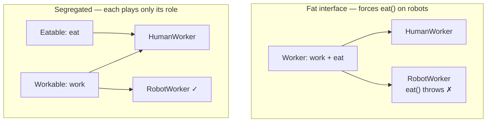
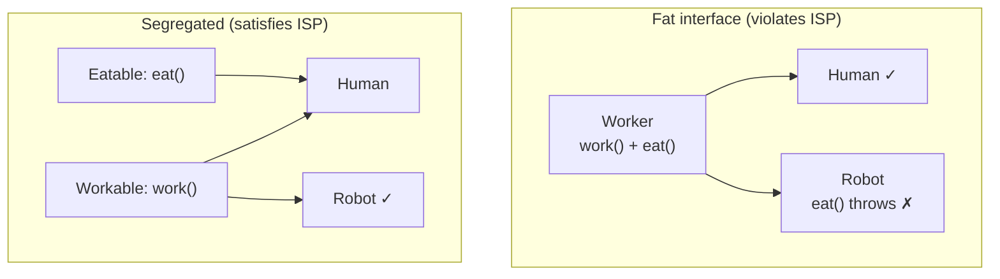

# Interface Segregation Principle (ISP) — Junior

> **Category:** [Design Principles → SOLID](../../README.md) — the fourth SOLID principle: many small, client-specific interfaces beat one fat general-purpose interface.

---

## Introduction

> Focus: **What is it?** and **How to use it?**

The **Interface Segregation Principle (ISP)** is the **I** in SOLID, introduced by Robert C. Martin ("Uncle Bob"). It says one thing, and says it sharply:

> **Clients should not be forced to depend on methods they do not use.**

In plain words: don't make a class implement (or import, or know about) parts of an interface it has no use for. When an interface bundles together capabilities that not every client needs, **split it** into several smaller interfaces — one per *role* a client actually plays. The result is many small, focused, **client-specific** interfaces instead of one big, bloated, **general-purpose** one.

That bloated interface has a name: the **fat interface**. It's an interface (or abstract class, or any contract) that has grown to cover several unrelated jobs, so that anything implementing it gets dragged into supporting methods it doesn't care about.

### Why this matters

When a class is forced to depend on methods it doesn't use, two bad things happen:

1. **Implementers are forced to write methods they can't honestly support.** They end up with empty methods, methods that `return null`, or — worst of all — methods that throw `UnsupportedOperationException` ("this isn't implemented, don't call it"). That's a landmine: the contract *says* the method works, but it doesn't.
2. **Clients get coupled to things they never touch.** In compiled languages, if you depend on a fat interface, a change to *any* method on it — even one you never call — can force your code to recompile and redeploy. You inherit the instability of the whole interface, not just the slice you use.

ISP is the cure: give each client an interface tailored to *its* needs, so it depends on exactly what it uses — no more, no less.

---

## Prerequisites

- **Required:** You understand **interfaces** (or abstract base classes / protocols) — a contract a class promises to fulfill.
- **Required:** Comfort with **polymorphism** — calling a method through an interface type without knowing the concrete class.
- **Helpful:** A look at the [Single Responsibility Principle](../01-srp-single-responsibility/junior.md) (SRP), the first SOLID principle — ISP is its sibling, applied to interfaces.
- **Helpful:** A feel for [coupling and cohesion](../../02-coupling-and-cohesion/02-maximise-cohesion/) — ISP is fundamentally about keeping interfaces *cohesive*.

---

## Glossary

| Term | Definition |
|------|-----------|
| **Interface** | A contract: a set of method signatures a class promises to implement, with no implementation of its own. |
| **Client** | The code that *uses* an interface (calls its methods through the abstract type). The thing that depends on it. |
| **Fat interface** | An interface that bundles many capabilities, forcing implementers and clients to deal with methods they don't need. |
| **Role interface** | A small interface that captures *one role* a client can play (e.g., `Printer`, `Scanner`). The opposite of fat. |
| **Header interface** | An interface that mirrors *all* the public methods of one class — often a fat interface in disguise (Fowler's term). |
| **Interface segregation** | Splitting a fat interface into several smaller, role-specific interfaces. |
| **`UnsupportedOperationException`** | An exception thrown by a method that the class is *forced* to declare but cannot meaningfully implement. A classic fat-interface symptom. |
| **Cohesion** | How closely the parts of a thing belong together. A cohesive interface has methods that all serve one purpose. |

---

## The Principle

> **Clients should not be forced to depend on methods they do not use.**

Read it carefully — the emphasis is on the **client**, not the interface or the implementer. ISP is a statement about *dependencies seen from the consumer's side*. The question to ask is never "is this interface big?" in the abstract. It's: **"Does this particular client depend on methods it never calls?"** If yes, the interface is too fat *for that client*, and it should be split so the client depends only on what it uses.

This gives ISP its operational shape:

- Look at each **client** of an interface.
- Find the **subset of methods** that client actually uses.
- If different clients use different subsets, **split the interface along those subsets**.

The split lines come from the *clients*, not from the implementation. That's why ISP produces **client-specific** interfaces.

---

## The Origin Story: The Xerox Printer

ISP was born from a real problem Uncle Bob consulted on at **Xerox**. They had a new printer system that could do many jobs: print, staple, fax, photocopy. The software modeled all of this through one giant class — call it `Job` — that exposed *every* operation the machine could perform.

The trouble: a piece of code that only needed to **print** still depended on the entire `Job` class, including `staple()`, `fax()`, and everything else. So when the stapling code changed, the printing code had to be **recompiled and redeployed** — even though printing has nothing to do with stapling. On the embedded system of the day, those rebuild-and-redeploy cycles were slow and painful. One fat class coupled everything to everything.

Uncle Bob's fix was to **segregate the interfaces by role**:

```
        Before                              After (segregated)

   ┌───────────────┐              ┌──────────┐ ┌──────────┐ ┌──────────┐
   │     Job       │              │  Print   │ │  Staple  │ │   Fax    │
   ├───────────────┤              │   Job    │ │   Job    │ │   Job    │
   │ print()       │              ├──────────┤ ├──────────┤ ├──────────┤
   │ staple()      │              │ print()  │ │ staple() │ │ fax()    │
   │ fax()         │              └────┬─────┘ └────┬─────┘ └────┬─────┘
   │ scan()        │                   │            │            │
   └───────────────┘                   ▼            ▼            ▼
        ▲                          print code   staple code   fax code
        │                          depends ONLY  depends ONLY  depends ONLY
   every client                    on Print      on Staple     on Fax
   depends on ALL
```

Now the printing code depends only on a `PrintJob` interface. Change the stapling logic and the printing code doesn't even notice — it never depended on `staple()` in the first place. The fat interface was **split by the roles its clients actually played**. That is ISP.

---

## The Fat-Interface Smell

How do you *recognize* a fat interface in code you're reading? It leaves fingerprints:

1. **Empty or stubbed-out method implementations.** A class implements the interface but several methods just have `{ }` (do nothing) or `return null`.
2. **`throw new UnsupportedOperationException()`.** The strongest smell. The class is declaring a method it cannot honestly fulfill, so it throws at runtime instead. The contract is lying.
3. **Implementers that only "really" implement a few of the methods.** If half the methods are real and half are token gestures, the interface is doing several jobs.
4. **Clients that call only a corner of the interface.** A consumer that touches 2 of 12 methods is depending on 10 it doesn't use.
5. **A change to one method recompiling unrelated code.** In a compiled language, this is the coupling cost made visible.

The throwing-method smell is important because it **also breaks the [Liskov Substitution Principle](../03-lsp-liskov-substitution/junior.md) (LSP)**. If `Robot implements Worker` but `robot.eat()` throws, then a `Robot` is *not* a safe substitute for a `Worker` — any code expecting `worker.eat()` to work will blow up. Fat interfaces force you into LSP violations. ISP and LSP are two views of the same defect here: the interface promises something the implementer can't deliver.

---

## Real-World Analogies

| Concept | Analogy |
|---|---|
| **Fat interface** | A universal TV remote with 60 buttons where you only ever use 3. Most buttons are clutter you must look past, and some do nothing on your TV. |
| **Role interfaces** | A Swiss Army knife vs. a toolbox of separate tools. The knife forces every tool into one handle; the toolbox lets you grab exactly the screwdriver you need. |
| **Forced to depend on unused methods** | A restaurant menu that requires you to order an appetizer, main, dessert, and wine as one fixed bundle even if you just want coffee. You're paying for (and coupled to) things you didn't want. |
| **`UnsupportedOperationException`** | A job description that lists "must be able to fly" for an office clerk. When someone takes the listing at face value and asks the clerk to fly, it fails — the contract over-promised. |
| **Client-specific split** | Building access cards: the cleaner's card opens the supply closet, the engineer's card opens the server room. No one carries a master key they have no business using. |

---

## Mental Models

**The core intuition:** *"Give every client the smallest interface it can use, not the biggest one you have."*

```
   FAT INTERFACE                         SEGREGATED INTERFACES
   one big contract                      several small role contracts

   ┌─────────────────┐                   ┌────────┐  ┌────────┐  ┌────────┐
   │   MegaService   │                   │ RoleA  │  │ RoleB  │  │ RoleC  │
   │  a() b() c()    │                   │  a()   │  │  b()   │  │  c()   │
   │  d() e() f()    │                   └───┬────┘  └───┬────┘  └───┬────┘
   └────────┬────────┘                       │           │           │
   client uses only a()                  client uses  client uses  client uses
   but depends on a–f                     only RoleA   only RoleB   only RoleC
```

A second model: **ISP is the Single Responsibility Principle, but for interfaces.** SRP says a *class* should have one reason to change. ISP says an *interface* should be small and cohesive enough that no client depends on parts of it for unrelated reasons. Where SRP looks at who *changes* a class, ISP looks at who *uses* an interface. (We sharpen this distinction at [Middle](middle.md) and [Senior](senior.md).)

A third model: **interfaces are designed from the client inward.** You don't first write a class and then publish "all its public methods" as the interface. You ask each *consumer* what it needs, and define the interface as exactly that need. The consumer's requirements draw the boundary.

---

## A Worked Example: The Worker Interface

This is the canonical teaching example for ISP. We're modeling workers in a factory.

### Start: one fat interface

```java
interface Worker {
    void work();
    void eat();
}
```

Reasonable at first — human workers both work and eat (they take lunch breaks the scheduler must account for). We write a `HumanWorker`:

```java
class HumanWorker implements Worker {
    public void work() { /* assemble widgets */ }
    public void eat()  { /* take a 30-min lunch break */ }
}
```

All fine. Now the factory adds **robot workers**. Robots work, but they don't eat. We're forced to implement `Worker`:

```java
class RobotWorker implements Worker {
    public void work() { /* assemble widgets, 24/7 */ }

    public void eat() {
        // robots don't eat... so what goes here?
        throw new UnsupportedOperationException("Robots do not eat");
    }
}
```

There it is — the smell. `RobotWorker` is **forced to depend on `eat()`, a method it does not use**. We had three bad options and picked the least-bad:

- Empty `eat()` — silently does nothing; a scheduler that calls `eat()` to plan break time gets fooled.
- `eat()` returning a dummy — lies about reality.
- `eat()` throwing — honest that it can't, but now `RobotWorker` is **not substitutable** for `Worker` (an LSP violation): any code doing `for (Worker w : workers) w.eat();` crashes on a robot.

The root cause: `Worker` is a **fat interface** that bundles two roles — *working* and *eating* — that not every worker plays.

### The fix: segregate by role

```java
interface Workable { void work(); }
interface Eatable  { void eat();  }

class HumanWorker implements Workable, Eatable {
    public void work() { /* ... */ }
    public void eat()  { /* ... */ }
}

class RobotWorker implements Workable {   // only the role it actually plays
    public void work() { /* ... */ }
    // no eat() — and nothing forces one
}
```

Now:

- `RobotWorker` depends only on `Workable`. No fake `eat()`, no exception, no lie.
- A scheduler that assigns work depends on `Workable` and can handle *all* workers.
- A break-time planner depends on `Eatable` and is handed *only* the workers who eat — robots never reach it.



No method is unused by anyone. That's ISP satisfied.

---

## Code Examples

### Python — splitting a multi-function-device interface

```python
from abc import ABC, abstractmethod

# BAD — fat interface: a simple printer is forced to "implement" scanning and faxing
class IMultiFunctionDevice(ABC):
    @abstractmethod
    def print_doc(self, doc): ...
    @abstractmethod
    def scan(self, doc): ...
    @abstractmethod
    def fax(self, doc): ...

class OldSimplePrinter(IMultiFunctionDevice):
    def print_doc(self, doc): ...          # real
    def scan(self, doc):
        raise NotImplementedError("no scanner")   # SMELL
    def fax(self, doc):
        raise NotImplementedError("no fax")       # SMELL
```

```python
# GOOD — role interfaces; each device implements only what it can do
class IPrinter(ABC):
    @abstractmethod
    def print_doc(self, doc): ...

class IScanner(ABC):
    @abstractmethod
    def scan(self, doc): ...

class IFax(ABC):
    @abstractmethod
    def fax(self, doc): ...

class SimplePrinter(IPrinter):
    def print_doc(self, doc): ...          # implements ONLY what it supports

class AllInOnePrinter(IPrinter, IScanner, IFax):
    def print_doc(self, doc): ...
    def scan(self, doc): ...
    def fax(self, doc): ...
```

A function that only prints takes an `IPrinter`, so it accepts both devices and depends on nothing else:

```python
def print_report(printer: IPrinter, report):
    printer.print_doc(report)   # works for SimplePrinter and AllInOnePrinter alike
```

### Go — structural interfaces make ISP almost automatic

Go is the poster child for ISP because its interfaces are **structural** (a type satisfies an interface just by having the right methods — no `implements` keyword). Idiomatic Go favors *tiny* interfaces, defined where they're *used*:

```go
// The standard library's io package is ISP in its purest form:
type Reader interface{ Read(p []byte) (n int, err error) }
type Writer interface{ Write(p []byte) (n int, err error) }

// A function asks for exactly the role it needs — nothing more:
func copyToLog(w Writer, msg string) {
    w.Write([]byte(msg))     // depends ONLY on Write, not on a fat "File" type
}
```

A `*os.File` can read, write, seek, and close — but `copyToLog` depends only on `Writer`. The fat concrete type exists; the *dependency* is narrow. Go's culture ("the bigger the interface, the weaker the abstraction" — Rob Pike) bakes ISP into the language's idioms.

### TypeScript — the same split with structural typing

```typescript
// BAD — one fat interface
interface Worker {
  work(): void;
  eat(): void;
}

// GOOD — segregated roles
interface Workable { work(): void; }
interface Eatable  { eat(): void; }

class Human implements Workable, Eatable {
  work() { /* ... */ }
  eat()  { /* ... */ }
}
class Robot implements Workable {
  work() { /* ... */ }   // no eat() — TypeScript doesn't force one
}

function assignShift(w: Workable) { w.work(); }   // accepts Human AND Robot
```

---

## Best Practices

1. **Design interfaces from the client's needs**, not from a class's full method list. Ask "what does *this* caller use?" and make that the interface.
2. **Prefer many small role interfaces** over one large one. A name like `Readable`, `Closeable`, `Printer` (one capability) is the target shape.
3. **Let a class implement several small interfaces.** `class Human implements Workable, Eatable` is perfectly normal — composition of roles.
4. **Treat `UnsupportedOperationException` / `NotImplementedError` as a design smell.** If you're forced to throw it, the interface is probably too fat for that implementer.
5. **Split along the lines clients actually use**, not along arbitrary categories. The clients draw the boundary.
6. **In Go/TypeScript, lean into structural typing** — define the small interface at the point of use and keep it minimal.

---

## Common Mistakes

1. **Building a "header interface" that mirrors a class's every public method.** That's a fat interface by default — it bundles whatever the class happens to do, not what any client needs.
2. **Implementing an interface with empty/throwing methods** and calling it done. That's the smell ISP exists to remove — and it breaks LSP.
3. **Forcing one interface on dissimilar clients.** A reporting client and an admin client rarely use the same methods; one interface for both is fat for each.
4. **Confusing ISP with SRP.** They're related but distinct: SRP is about a *class's reasons to change*; ISP is about *clients depending on unused methods*. (See [Tricky Points](#tricky-points).)
5. **Over-segregating into one interface per method** for no reason. ISP says split *where clients differ*, not split *everything* — too many micro-interfaces is its own problem (covered at [Middle](middle.md)).

---

## Tricky Points

- **ISP is about *forced dependency*, not interface size in the abstract.** A five-method interface is fine *if every client uses all five*. A two-method interface is too fat if some client uses only one of them. Always judge from the client.
- **The throwing-method smell links ISP and LSP.** When a fat interface forces `throw new UnsupportedOperationException()`, you've simultaneously violated ISP (forced dependency) and LSP (the implementer isn't substitutable). Fixing the fat interface fixes both.
- **ISP and SRP are *not* the same.** SRP: a class has one reason to change. ISP: an interface is small enough that no client depends on unused parts. A class can satisfy SRP yet still expose a fat interface to some clients — and vice versa. We make this precise at [Middle](middle.md).
- **Structural typing (Go, TypeScript) makes ISP nearly free** — you can define a tiny interface at the call site and any type with those methods satisfies it. In nominally-typed languages (Java, C#) you must declare `implements`, so segregation takes a little more upfront design. Discussed at [Senior](senior.md).

---

## Test Yourself

1. State the Interface Segregation Principle in one sentence.
2. In the printer origin story, *why* did changing `staple()` force the printing code to recompile?
3. What does a `throw new UnsupportedOperationException()` inside an interface implementation usually tell you?
4. How does the fat-interface smell also create an LSP violation?
5. Rewrite the `Worker { work(); eat(); }` interface to satisfy ISP. What does `RobotWorker` implement now?
6. Why does Go's structural typing make ISP easy to follow?

---

## Cheat Sheet

```text
INTERFACE SEGREGATION PRINCIPLE (ISP) — the "I" in SOLID
  "Clients should not be forced to depend on methods they do not use."
  → many small client-specific interfaces  >  one fat general-purpose interface

THE FAT-INTERFACE SMELL (how to spot a violation)
  - empty / no-op method bodies
  - throw new UnsupportedOperationException()  ← strongest smell (also breaks LSP)
  - implementers that only "really" implement a few methods
  - a change to one method recompiles unrelated clients

THE FIX
  - split the interface by the ROLES its clients actually play
  - a class implements several small interfaces (Workable + Eatable)
  - design interfaces from the CLIENT's needs, not the class's method list

CANONICAL EXAMPLES
  Worker{work,eat}      → Workable{work} + Eatable{eat}   (Robot can't eat)
  Xerox Job{print,...}  → Print/Staple/Fax role interfaces (Uncle Bob's origin)
  Go io.Reader/io.Writer = ISP built into the language

RELATIONSHIPS
  ISP ≈ "SRP for interfaces"   |   fat interface → LSP violation (throwing methods)
  ISP supports DIP (depend on small, stable abstractions)
```

---

## Summary

- **ISP** = *Clients should not be forced to depend on methods they do not use.* Prefer **many small, client-specific (role) interfaces** over one **fat, general-purpose** interface.
- It came from Uncle Bob's **Xerox printer** work: one fat `Job` class coupled every client to every operation, so changing `staple()` forced the printing code to recompile.
- The **fat-interface smell**: empty or `UnsupportedOperationException`-throwing methods, implementers using only a corner of the interface, and unrelated recompilation.
- A throwing method is **also an LSP violation** — the implementer isn't substitutable. Fixing the fat interface fixes both.
- The **fix** is to split by the roles clients play: `Worker{work, eat}` → `Workable` + `Eatable`, so a `Robot` implements only `Workable`.
- ISP is roughly **"SRP for interfaces."** Structural typing (Go, TypeScript) makes it almost automatic.

---

## Further Reading

- Robert C. Martin, *Agile Software Development: Principles, Patterns, and Practices* — the original ISP chapter and the Xerox story.
- Robert C. Martin, *Clean Architecture* — SOLID restated for components.
- Martin Fowler, [RoleInterface](https://martinfowler.com/bliki/RoleInterface.html) — role interface vs. header interface.
- Rob Pike, *Go Proverbs* — "The bigger the interface, the weaker the abstraction."

---

## Related Topics

- **Sibling SOLID principles:** [SRP](../01-srp-single-responsibility/junior.md) · [LSP](../03-lsp-liskov-substitution/junior.md) · [DIP](../05-dip-dependency-inversion/junior.md)
- **Underlying idea:** [Maximise Cohesion](../../02-coupling-and-cohesion/02-maximise-cohesion/)

---

## Diagrams




---

## Check your understanding

1. Explain Interface Segregation Principle (ISP) — Junior Level in your own words and name the problem it solves.
2. How would you apply the ideas around Table of Contents, Introduction, Prerequisites in a realistic engineering change?
3. What failure mode or misuse should you look for, and what evidence would reveal it?
4. What small example would prove that you can apply Interface Segregation Principle (ISP) — Junior Level correctly?
5. What observable result would convince you that the approach improved the system?
