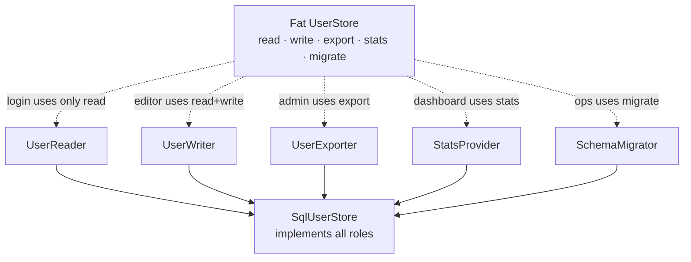
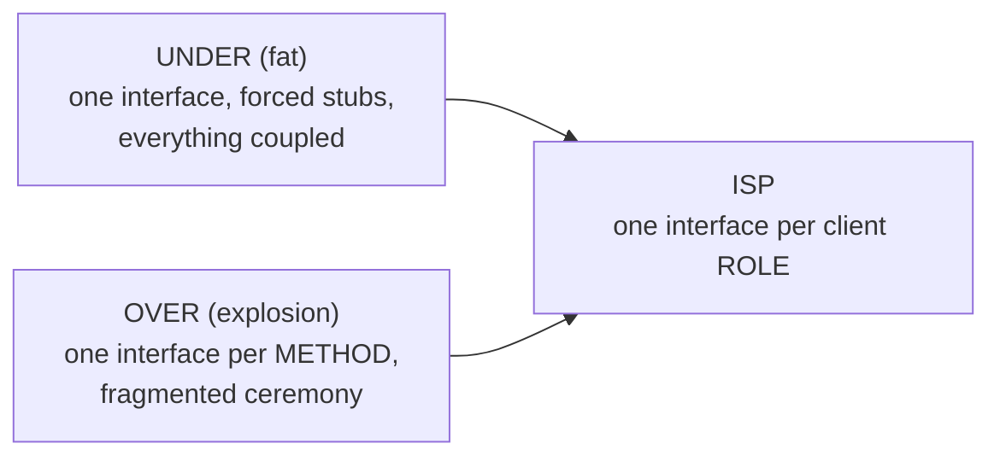

# Interface Segregation Principle (ISP) — Middle

> **Category:** [Design Principles → SOLID](../../README.md) — the fourth SOLID principle: many small, client-specific interfaces beat one fat general-purpose interface.

> **Prerequisite:** [Junior](junior.md)
> **Focus:** **Why** and **When**

---

## Table of Contents

1. [Introduction](#introduction)
2. [Applying ISP to Real Code](#applying-isp-to-real-code)
3. [Finding the Split Lines](#finding-the-split-lines)
4. [ISP vs. SRP — Drawing the Line Precisely](#isp-vs-srp--drawing-the-line-precisely)
5. [Header Interfaces vs. Role Interfaces](#header-interfaces-vs-role-interfaces)
6. [The Recompilation / Redeployment Cost](#the-recompilation--redeployment-cost)
7. [Structural Typing Makes ISP Cheap](#structural-typing-makes-isp-cheap)
8. [Trade-offs](#trade-offs)
9. [Edge Cases](#edge-cases)
10. [Tricky Points](#tricky-points)
11. [Best Practices](#best-practices)
12. [Test Yourself](#test-yourself)
13. [Summary](#summary)
14. [Diagrams](#diagrams)

---

## Introduction

> Focus: **Why** and **When**

At the junior level, ISP is a rule: don't force clients to depend on methods they don't use; split fat interfaces. At the middle level it becomes a **set of judgement calls**: *Where exactly do I cut a fat interface? Is this a header interface I should split, or is it genuinely cohesive? Is this really ISP, or am I confusing it with SRP? And when does splitting go too far and produce a swarm of tiny interfaces nobody can navigate?*

The recurring tension is between **two failure modes**:

- **Under-segregation (the fat interface)** — one big contract, implementers throwing `UnsupportedOperationException`, every client coupled to methods it never calls.
- **Over-segregation (interface explosion)** — so many one-method interfaces that the system fragments into ceremony, and assembling a working object means implementing a dozen tiny contracts.

ISP is the *direction* (toward smaller, client-specific interfaces); judgement is *how far* to go. The single best calibration tool is the one ISP itself hands you: **the client.** You split where clients differ, and you stop when each client depends only on what it uses.

---

## Applying ISP to Real Code

Consider a real-world fat interface — a "repository" that grew to serve every kind of consumer:

```typescript
// FAT — every client of UserStore depends on all of this
interface UserStore {
  findById(id: string): User;
  findByEmail(email: string): User;
  save(user: User): void;
  delete(id: string): void;
  exportAllToCsv(): string;        // used only by the admin export job
  recalculateStatistics(): Stats;  // used only by the analytics dashboard
  migrateSchema(): void;           // used only by the ops migration tool
}
```

Look at the **clients**, and the fatness becomes obvious:

| Client | Methods it actually uses |
|---|---|
| Login flow | `findByEmail` |
| Profile editor | `findById`, `save` |
| Admin export job | `exportAllToCsv` |
| Analytics dashboard | `recalculateStatistics` |
| Ops migration tool | `migrateSchema` |

The login flow depends on a contract that includes `migrateSchema()` — a method it will never call, owned by a totally different concern. If `migrateSchema`'s signature changes, the login code is (at minimum) recompiled, re-reviewed, and re-tested. Split by client:

```typescript
interface UserReader { findById(id: string): User; findByEmail(e: string): User; }
interface UserWriter { save(user: User): void; delete(id: string): void; }
interface UserExporter { exportAllToCsv(): string; }
interface StatsProvider { recalculateStatistics(): Stats; }
interface SchemaMigrator { migrateSchema(): void; }

// One concrete class can still implement several — clients see only their slice:
class SqlUserStore implements UserReader, UserWriter, UserExporter,
                              StatsProvider, SchemaMigrator { /* ... */ }
```

Now the login flow takes a `UserReader`. It is *physically incapable* of calling `migrateSchema` — and decoupled from it entirely. The concrete `SqlUserStore` still bundles everything; that's fine. **ISP constrains the interfaces clients depend on, not the number of methods on the implementation.**

---

## Finding the Split Lines

The hardest middle-level skill is knowing *where* to cut. The split lines are drawn by **clients and the roles they need**, not by guesswork. A practical procedure:

1. **List the clients** of the interface (every place that depends on it).
2. **For each client, record the method subset it actually uses.**
3. **Group methods by which clients use them.** Methods that always travel together (used by the same set of clients) belong in one interface; methods used by disjoint client sets belong in separate interfaces.
4. **Name each group after the role it represents** (`Reader`, `Closer`, `Printer`) — if you can't name it cleanly, the grouping is probably wrong.

```
   Methods:   findById  findByEmail  save  delete  export  stats  migrate
   Login:        .           ✓
   Profile:      ✓                    ✓
   Export:                                            ✓
   Analytics:                                                 ✓
   Migration:                                                       ✓
              └──────── Reader ───────┘└── Writer ──┘ Exporter Stats Migrator
```

The columns that share the same usage pattern collapse into one role interface; the ones that stand alone become their own. **The interface boundaries fall out of the client/method matrix** — you're not inventing them, you're reading them off the data.

---

## ISP vs. SRP — Drawing the Line Precisely

This is the distinction middle engineers most often blur, so let's make it exact. Both principles push toward smaller, more focused units, but they answer **different questions**:

| | **Single Responsibility (SRP)** | **Interface Segregation (ISP)** |
|---|---|---|
| Applies to | A class / module | An interface |
| The rule | One **reason to change** | No client depends on **unused methods** |
| The viewpoint | The **actor / source of change** ("who requests changes to this?") | The **client / consumer** ("who calls this, and what do they use?") |
| Violation looks like | A class edited for two unrelated reasons | An implementer throwing on methods it can't support |
| Fixed by | Splitting the class by responsibility | Splitting the interface by client need |

The crisp way to remember it:

> **SRP** asks *"why does this code change?"* and groups by the **source of change**.
> **ISP** asks *"what does this client use?"* and groups by the **shape of consumption**.

They frequently *co-occur* — a fat interface often sits in front of a class with multiple responsibilities — but they're independent:

- A class can have **one responsibility** yet expose a **fat interface** (e.g., a cohesive `File` whose huge API forces small clients to depend on methods they don't use). ISP violated, SRP not.
- A class can have **multiple responsibilities** behind a **narrow interface** each client uses fully. SRP violated, ISP not.

So fixing one does not automatically fix the other. SRP partitions *implementation* by change-reason; ISP partitions *the contract* by consumer-need. (We connect both to cohesion at [Senior](senior.md).)

---

## Header Interfaces vs. Role Interfaces

Martin Fowler named the two ways people create interfaces, and the distinction is the heart of ISP:

> **Header interface** — an interface that exposes *all* the public methods of a class (named for the way it resembles a C/C++ header file listing every function). It's defined from the *implementation* outward.
>
> **Role interface** — an interface defined for a *specific collaboration*, exposing only the methods one client role needs. It's defined from the *client* inward.

```
   HEADER INTERFACE                         ROLE INTERFACES
   (mirrors the class)                      (one per collaboration)

   class Order  ──►  interface IOrder       client A needs ──► Priceable
     total()          total()               client B needs ──► Refundable
     refund()         refund()              client C needs ──► Auditable
     audit()          audit()
     ...              ...   (all of it)     each client depends on ONLY its role
```

Header interfaces are the default an IDE encourages ("Extract Interface" → it dumps every public method) and the default a fat interface *is*. They satisfy almost nothing: clients still depend on the whole class surface, just through an interface name. ISP pushes you toward **role interfaces** — and the only way to know the roles is to look at the *clients*.

> A header interface with one implementation is doubly suspect: it adds an abstraction (a possible YAGNI / over-engineering cost) **and** it's fat (every client depends on everything). Role interfaces, by contrast, earn their keep by narrowing what each client depends on.

This is why "extract the interface from the class" is usually the *wrong* mental motion for ISP. The right motion is "extract the interface from the client's needs."

---

## The Recompilation / Redeployment Cost

ISP's original motivation at Xerox was not aesthetics — it was **build and deployment coupling**, and that cost is real in any statically compiled language.

When client code depends on a fat interface, it has a **compile-time dependency on the entire interface symbol**. A change to *any* method on that interface — adding a parameter, changing a return type, even adding a new method (which forces every implementer to update) — triggers:

- **Recompilation** of every translation unit that depends on the interface, including clients that never touch the changed method.
- **Recompilation of every implementer**, because adding a method to an interface breaks all implementers that don't yet have it.
- **Redeployment** of everything that recompiled, in environments where artifacts are deployed together.

```
   Fat interface change ripple:

   change staple() ─┐
                    ├─► recompile PrintClient   (never calls staple — but depends on Job)
                    ├─► recompile FaxClient      (never calls staple — but depends on Job)
                    └─► recompile every Job implementer
```

With **segregated** interfaces, the blast radius shrinks to the role that changed: change `Staple`, and only stapling clients and stapling implementers rebuild. Printing code, depending on `Print`, doesn't even know `Staple` changed. **ISP turns transitive compile coupling into local compile coupling.**

This cost is largest in C++ (header inclusion), significant in Java/C# (binary compatibility, large monorepo build graphs), and smallest in dynamic languages — but even in Python or JavaScript, a fat interface means a fat *test* surface and fat *cognitive* coupling: every client must reason about a contract larger than it uses.

---

## Structural Typing Makes ISP Cheap

In **nominally typed** languages (Java, C#), a class must *declare* `implements SomeInterface`. To segregate, you must define the small interfaces up front and wire them in — a real (if modest) design cost.

In **structurally typed** languages (**Go**, **TypeScript**), a type satisfies an interface simply by *having the right methods* — no declaration. This flips ISP from "a discipline you must remember" to "the path of least resistance":

```go
// Define the tiny interface AT THE POINT OF USE, naming only what you need.
// Any existing type with a Close() method satisfies it — no edits to that type.
type Closer interface{ Close() error }

func cleanup(c Closer) error { return c.Close() }
// *os.File, *sql.DB, net.Conn — all satisfy Closer implicitly, for free.
```

Idiomatic Go pushes this hard: define interfaces **in the consuming package**, keep them to one or two methods, and never publish a fat interface "for completeness." The standard library's `io.Reader`, `io.Writer`, `io.Closer`, and their combinations (`io.ReadWriteCloser`) are ISP as a design language. TypeScript's structural typing gives the same benefit: you can declare `function f(x: { close(): void })` and any object with `close` fits.

> The lesson for nominally-typed languages: you have to *do deliberately* what Go does *by default*. ISP is the discipline that recovers, in Java/C#, the client-driven narrowness that Go gets from its type system.

We go deeper on the structural/nominal trade-off at [Senior](senior.md).

---

## Trade-offs

| Decision | Lean segregated (many role interfaces) | Lean fat (one general interface) |
|---|---|---|
| Client coupling | Low — each depends only on what it uses | High — every client depends on everything |
| Recompile blast radius | Small (local to the role) | Large (transitive across all clients) |
| Implementer honesty | High — no forced stub/throw methods | Low — forced empty/throwing methods |
| Number of types to navigate | Higher — more interface names | Lower — one name |
| Risk of over-design | Interface explosion / fragmentation | — |
| Discoverability of "the whole API" | Lower (spread across roles) | Higher (one place) |

The asymmetry that favors segregation: a fat interface inflicts its cost on *every* client *continuously* (coupling, recompiles, forced stubs), while over-segregation's cost (more type names) is mostly a one-time navigation tax. But over-segregation is a **real** failure mode — see the edge cases. The target is **as many interfaces as there are distinct client roles, and no more.**

---

## Edge Cases

### 1. Interface explosion — too many micro-interfaces

If you split until every method is its own one-method interface *regardless of how clients use them*, you've over-applied ISP. Now constructing an object means implementing twelve interfaces, and readers must mentally re-assemble the roles. The guard: **split where clients differ, not where methods differ.** Two methods that are *always* used together by the *same* clients belong in one interface. ISP minimizes *forced* dependency, not interface count.

### 2. A method genuinely used by all clients

If every client uses every method, the interface is **not** fat — it's cohesive, and you should leave it whole. ISP doesn't say "small interfaces always"; it says "no *unused* dependencies." A three-method interface where all three are used by all clients is perfect.

### 3. Composing roles back together

When a client genuinely needs several roles, compose them — don't reach back for the fat interface:

```go
type ReadWriteCloser interface { Reader; Writer; Closer }  // built FROM small ones
```

In Java: a method parameter typed `<T extends Workable & Eatable>`, or a small composite interface that extends the roles. The composite is built *up from* role interfaces, so clients needing only one role still depend on only that one.

### 4. Default methods soften — but don't fix — fatness

Java 8 `default` methods and C# default interface methods let a fat interface provide no-op defaults so implementers needn't write stubs. This removes the *compile* pain but **not the ISP violation**: clients still depend on methods they don't use, and a default that does nothing can be a silent bug (the no-op `eat()` problem again). Defaults are a migration aid, not a substitute for segregation.

---

## Tricky Points

- **ISP measures *forced* dependency, never interface size alone.** A big interface every client fully uses is fine; a small one with one unused method for some client is a violation. Always reason from the client.
- **Splitting the interface does not require splitting the class.** One concrete class implementing five role interfaces is normal and good — the segregation is about what *clients depend on*, not about how the implementation is packaged.
- **"Extract Interface" from a class is the anti-pattern, not the goal.** It produces a header interface. Extract from the *client's* needs instead.
- **Over-segregation is real.** One interface per method, divorced from client roles, fragments the system. ISP is "no unused dependencies," not "maximize the interface count."
- **ISP supports DIP.** [Dependency Inversion](../05-dip-dependency-inversion/junior.md) says depend on abstractions; ISP makes those abstractions *small and stable*, so the dependency you invert onto is narrow and rarely changes. Small role interfaces are the *best* abstractions to depend on.

---

## Best Practices

1. **Drive splits from the client/method matrix.** Map who uses what; cut where usage patterns diverge.
2. **Define role interfaces, not header interfaces.** Name them after the capability (`Closer`, `Printer`), defined from the consumer inward.
3. **Let one class implement many small interfaces.** Segregate the contract, not necessarily the implementation.
4. **Stop splitting when each client depends only on what it uses.** That's the goal line — don't keep cutting into one-method shards for their own sake.
5. **Treat forced stubs/throws as the trigger to segregate.** An `UnsupportedOperationException` is the interface telling you it's too fat.
6. **In Go/TS, define minimal interfaces at the point of use.** Lean on structural typing; never publish a fat interface "for completeness."
7. **Compose roles upward** (`ReadWriteCloser`) instead of reaching back to the fat interface when a client needs several.

---

## Test Yourself

1. You have a `UserStore` interface with 8 methods. How do you decide where to split it?
2. Give a precise one-sentence difference between SRP and ISP.
3. What is a header interface, and why does it tend to violate ISP?
4. Why does a fat interface cause unrelated client code to recompile in a static language?
5. Can a class with a single responsibility still violate ISP? Give an example.
6. What is "interface explosion," and what's the rule that prevents it?

---

## Summary

- The middle-level skill is **placing the split lines**: cut a fat interface where its *clients* use different subsets, using the client/method matrix as the map.
- **ISP ≠ SRP.** SRP groups a class by **reason to change** (the actor); ISP groups an interface by **what clients use** (the consumer). They co-occur but are independent.
- Prefer **role interfaces** (defined from the client inward) over **header interfaces** (a mirror of the class's full API — usually fat by default).
- In static languages, fat interfaces cause **transitive recompilation/redeployment**; segregation makes the blast radius local.
- **Structural typing (Go, TS)** makes ISP nearly automatic — define tiny interfaces at the point of use.
- The opposite failure is **interface explosion**: split where clients differ, not where methods differ, and stop when no client depends on anything unused.

---

## Diagrams

### Split lines come from the clients, not the class



### Under- vs. over-segregation — ISP is the middle




---

## Check your understanding

1. Explain Interface Segregation Principle (ISP) — Middle Level in your own words and name the problem it solves.
2. How would you apply the ideas around Table of Contents, Introduction, Applying ISP to Real Code in a realistic engineering change?
3. What failure mode or misuse should you look for, and what evidence would reveal it?
4. Which local design trade-off would make you choose or reject Interface Segregation Principle (ISP) — Middle Level in an existing codebase?
5. What observable result would convince you that the approach improved the system?
