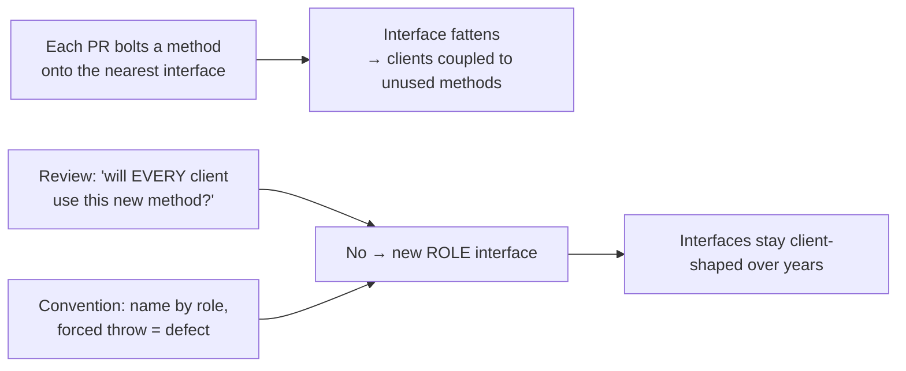
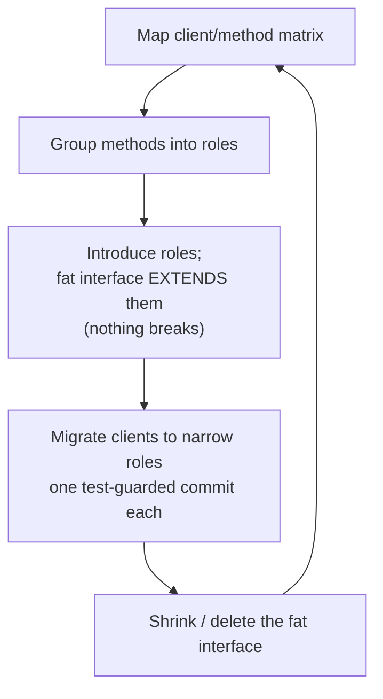

# Interface Segregation Principle (ISP) — Professional

> **Category:** [Design Principles → SOLID](../../README.md) — the fourth SOLID principle: many small, client-specific interfaces beat one fat general-purpose interface.

> **Prerequisites:** [Junior](junior.md) · [Middle](middle.md) · [Senior](senior.md)
> **Focus:** **Production** — reviews, team conventions, legacy refactoring, incidents

---

## Introduction

> Focus: **production** — keeping interfaces client-shaped across a large, long-lived, multi-team codebase.

In a real codebase, interfaces don't start fat — they **grow** fat. An interface ships with three honest methods; a year later it has eleven, because every team that needed *something near* this abstraction bolted its method onto the existing interface rather than defining a new role. No single addition was unreasonable; the aggregate is a contract that couples a dozen clients to methods they've never called, with three implementers throwing `UnsupportedOperationException` in the corners.

The professional question is operational: **how do you keep interfaces client-shaped when dozens of people, across teams, extend them under deadline pressure?** The answer is a system — review standards that catch fattening one method at a time, conventions that make role interfaces the default, detection that surfaces the forced-dependency smell, and a safe, incremental way to segregate a fat interface that's already load-bearing in production.

---

## Enforcing ISP in Code Review

Most interface fattening enters one PR at a time, which makes review the decisive control point. Two distinct review situations:

### Reviewing a *new* method added to an *existing* interface

This is where fattening happens. The reviewer's job is to ask whether the new method belongs on *this* interface or on a *new* role:

> **"Will every existing client of this interface use this new method? If not, you're adding a method that some clients will depend on but never call."**

If the new method serves only a subset of clients (or a brand-new client), it's a signal to define a **new role interface** rather than fatten the existing one. The default reflex on most teams — "just add it to the interface that's already there" — is exactly how fat interfaces are born.

### Reviewing a *new* interface

Check that it's a **role interface**, not a **header interface**:

1. **Does it mirror a class's full public API?** If the interface and the class have the same method list, it's a header interface — ask which clients need which methods and whether it should be split.
2. **Does it have exactly one implementation and one caller?** Then question whether the interface earns its keep at all (possible over-engineering — see [Simple Design](../../../craftsmanship-disciplines/04-simple-design/professional.md)), let alone whether it's segregated.
3. **Will any implementer be forced to stub or throw?** If you can already name a future implementer that can't honor every method, the interface is born fat.

### The forced-stub red flag

The single most reliable review signal is an implementation that **stubs, no-ops, or throws** on an interface method:

> "`S3Storage.lock()` throws `UnsupportedOperationException`. That tells me `Storage` bundles a `Lockable` role that object stores can't honor — let's split `Lockable` off so S3 implements only what it supports. As written, any client that calls `storage.lock()` will crash on an S3 backend (an LSP break too)."

Treat every forced stub/throw on an interface method as a **defect ticket against the interface**, not a quirk of the implementer.

### Review comment templates

> "This new `recalculateStats()` method serves only the analytics dashboard. Adding it here couples the login flow (which uses `findByEmail`) to a method it'll never call. Can we put it on a `StatsProvider` role instead?"

> "`IRepository` now mirrors every method of `JpaRepository` — that's a header interface. Which clients actually need `flush()` and `detach()`? Let's shape the interface to the use cases, not the implementation."

> "`FileExporter implements Importer` but `import_()` just `return null`. The interface is fat for an exporter — split `Importer`/`Exporter` so each side implements only its role."

---

## Team Conventions for ISP

Codify these so client-shaped interfaces are the default path, not a per-PR argument:

1. **Define interfaces from the consumer, not the class.** Convention: name interfaces after the **role/capability** (`OrderReader`, `Closeable`, `Printer`), never after the implementation (`JpaOrderRepositoryInterface`). A role name forces client-shaped thinking; a mirror name invites header interfaces.
2. **No new method on a shared interface unless all clients use it.** A method needed by a subset goes on a new (or different) role interface. Reviewers cite this policy, not personal taste.
3. **Forced stub/throw = interface defect.** A no-op or `UnsupportedOperationException` on an interface method must be justified in review or the interface gets split. (Document the rare legitimate exceptions, e.g., a deliberately optional capability with a capability-query method.)
4. **Ban "Extract Interface (all members)" as a design step.** That IDE action produces header interfaces. Extracting an interface must be driven by a client's needs.
5. **Compose roles upward, never reach back to the fat interface.** When a client needs several roles, use a composite (`ReadWriteCloser`) built from the small ones.
6. **One implementation, one caller → question the interface's existence.** Don't pre-emptively introduce interfaces; ISP applies once *multiple clients with different needs* exist. (Ties to YAGNI.)
7. **In Go/TypeScript, define interfaces in the consuming package, ≤ 2–3 methods.** Make structural typing do the segregation for you.

These encode the senior reasoning so the right shape is the default and reviewers cite a standard, not an opinion.

---

## Refactoring a Fat Interface in a Legacy System

Greenfield ISP is easy. The professional reality is **segregating an interface that already has a dozen methods, several implementers, and dozens of callers in production.** The approach is incremental, behavior-preserving, and never a big-bang rewrite.

### The sequence

```text
1. MAP   — build the client/method matrix: who calls which methods of the fat interface.
2. GROUP — cluster methods by the client-sets that use them; name each cluster as a role.
3. INTRODUCE — add the new role interfaces; have the fat interface EXTEND them
              (so nothing breaks yet — the fat interface still exists, now composed of roles).
4. MIGRATE — change each client, one at a time, to depend on the narrow role it needs
            instead of the fat interface. Small, test-guarded commits.
5. SHRINK — once no client depends on the fat interface directly, delete it
           (or leave the composite if some client genuinely needs the union).
```

Step 3 is the safety key. By making the fat interface **extend** the new role interfaces (in Java: `interface FatStore extends Reader, Writer, Exporter`), the existing code keeps compiling — `FatStore` still has every method. You then migrate clients off the fat type at your own pace. This is the **expand-then-contract** (parallel-change) pattern applied to interfaces: add the new shape, migrate, remove the old shape.

```java
// STEP 3 — fat interface now COMPOSED of roles; nothing breaks
interface Reader   { Order find(OrderId id); }
interface Writer   { void  save(Order o); }
interface Exporter { String exportCsv(); }
interface OrderStore extends Reader, Writer, Exporter {}   // still has all methods

// STEP 4 — migrate clients one at a time to the narrow role:
class PlaceOrder {
    private final Writer writer;          // was OrderStore; now depends only on save()
    PlaceOrder(Writer writer) { this.writer = writer; }
}
```

### Removing a forced-throw safely

When the fat interface forced an implementer to throw, segregation also *removes* the throw — but do it under tests:

```text
1. Characterize: write a test asserting the CURRENT behavior of every caller
   (including any that relied on catching the UnsupportedOperationException).
2. Split the offending role off the fat interface.
3. Make the implementer stop implementing the role it can't honor.
4. Fix the (now compile-time-visible) callers that wrongly assumed the method existed.
   The throw that was a RUNTIME landmine becomes a COMPILE error — strictly better.
```

Turning a runtime `UnsupportedOperationException` into a compile-time "this type doesn't have that method" is one of ISP's highest-value production wins: it moves a class of crashes from prod to the compiler.

### What *not* to do

- **Don't split without the client/method matrix.** Guessed boundaries produce role interfaces that don't match real usage — you'll re-split later.
- **Don't big-bang replace the fat interface.** Use expand-then-contract; keep the system compiling at every commit.
- **Don't over-segregate while you're in there.** Splitting into one-method interfaces that always travel together trades a fat-interface problem for a fragmentation problem.
- **Don't "fix" a forced throw with a silent no-op.** That converts an honest crash into a silent bug. Remove the dependency (segregate), don't hide it.

---

## Real Incidents

### Incident 1: The repository that recompiled the world

A monorepo had one `DataAccess` interface with ~20 methods (CRUD, bulk export, schema migration, cache warming). Every service depended on it. A routine change to the `migrateSchema()` signature triggered a **recompile and re-test of 40+ downstream services** — none of which had ever called `migrateSchema()`. CI went from 12 minutes to over an hour for an unrelated change. **Postmortem:** classic fat-interface transitive build coupling — the Xerox problem at monorepo scale. **Fix:** segregated `DataAccess` into `Reader`, `Writer`, `BulkExporter`, `SchemaMigrator`, `CacheWarmer`; migrated services to the role they used. The migration method now lives on an interface depended on by one tool. **Lesson:** a fat interface makes every client a hostage to every method's churn.

### Incident 2: The `UnsupportedOperationException` in production

A `PaymentMethod` interface had `refund()`. A new `GiftCardPayment` couldn't be refunded by policy, so it implemented `refund()` with `throw new UnsupportedOperationException()`. Months later a batch refund job iterated all payment methods and called `refund()` on each — and **crashed mid-batch on the first gift-card payment**, leaving the batch half-processed. **Postmortem:** the fat interface forced a throw (ISP), which made `GiftCardPayment` non-substitutable (LSP), which the batch job hit at runtime. **Fix:** split a `Refundable` role; gift cards don't implement it; the batch job's parameter type became `List<Refundable>`, so non-refundable methods are **excluded at compile time** — the bug became unrepresentable. **Lesson:** segregate the role and the LSP landmine disappears with it.

### Incident 3: The header-interface mirage

A team proudly "applied SOLID" by extracting an interface for every class — each interface a perfect mirror of its single implementation. Code review approvals cited "I" in SOLID. In reality, clients still depended on the *entire* class surface (just via an interface name), test mocks had to stub a dozen methods to exercise one, and the abstraction layer added indirection with zero decoupling benefit. **Postmortem:** header interfaces, not role interfaces — ISP cargo-culted. **Fix:** deleted the one-implementation mirror interfaces that no client needed narrowing for; where multiple clients genuinely differed, introduced *role* interfaces sized to each. **Lesson:** "one interface per class" is not ISP; ISP narrows what *clients* depend on.

### Incident 4: Over-segregation slowed everyone down

Reacting to Incident 3, the same team over-corrected: every method became its own interface. Constructing a domain service meant implementing nine interfaces that *always* appeared together; new hires couldn't find "the" abstraction. PR velocity dropped. **Postmortem:** interface explosion — Common Reuse over-applied. **Fix:** merged the interfaces that no client ever used apart back into cohesive role interfaces. **Lesson:** ISP's rule cuts both ways — package methods together iff some client uses them together; both under- and over-segregation violate it.

---

## Tooling and Detection

You can surface fat-interface smells mechanically, though the final call needs human judgment:

| Signal | How to detect | Catches |
|---|---|---|
| Forced stub / throw | grep / linter rule for `UnsupportedOperationException`, `NotImplementedError`, `return null` in interface impls | The strongest fat-interface smell (and LSP risk) |
| Header interface | Interface method-set == one class's public method-set; one implementation | Mirror interfaces with no segregation value |
| Low method-usage per client | Static analysis: per client, fraction of interface methods actually called | Clients depending on methods they don't use |
| Recompile blast radius | Build-graph / change-coupling analysis (which targets rebuild on an interface change) | Transitive coupling from fat interfaces |
| Interface fan-in × method count | Architecture tools (e.g., dependency analyzers) flag wide, fat, high-fan-in interfaces | High-blast-radius fat interfaces to split first |

Practical rules:

- **Lint for forced stubs/throws on interface methods** — it's cheap and the highest-signal check.
- **Prioritize splitting by blast radius:** segregate the fattest, most-depended-on interfaces first (highest fan-in × method count) — that's where coupling costs the most.
- **Watch method-count growth on shared interfaces over time** as a trend; an interface that gained methods every quarter is fattening.
- **Don't trust a metric to draw the split lines** — only the client/method matrix does that. Tools find *suspects*; humans shape the roles.

---

## The Politics of "But It's More Flexible"

Sustaining ISP is partly social, and the recurring antagonist is the **convenience argument**:

- **"Just add it to the existing interface — it's easier."** True for the author, costly for every client now coupled to the new method. Make the team norm explicit: a method that not all clients use goes on a new role. The reviewer is citing policy, not blocking a colleague.
- **"One interface per class is cleaner / more SOLID."** It *looks* tidy and feels principled, but it's a header interface — it narrows nothing. Reframe ISP as being about *clients*, not classes: the question is never "does this class have an interface?" but "does this client depend on methods it doesn't use?"
- **"Splitting it is a lot of churn."** Use expand-then-contract so the churn is incremental and safe — and weigh it against the recurring cost of every client recompiling on every unrelated change.
- **Forced throws get normalized.** Teams learn to "just throw `UnsupportedOperationException`" as routine. Treat each one as a defect against the interface; the moment throwing feels normal, fat interfaces are spreading.

The cultural reframe a professional drives: **the interface exists for its clients, not for its implementation.** An interface shaped by the implementation (a header) serves no one; an interface shaped by clients (a role) serves each of them exactly.

---

## Review Checklist

```text
ISP REVIEW CHECKLIST
[ ] NEW METHOD on existing interface — will EVERY current client use it?
    (No → put it on a new/different ROLE interface, don't fatten this one)
[ ] NEW INTERFACE — is it a ROLE (client-shaped) or a HEADER (class-mirror)?
[ ] FORCED STUB/THROW — any impl no-ops / returns null / throws Unsupported*?
    (Yes → interface is fat for that impl; split the role off. Also an LSP risk.)
[ ] CLIENT USAGE — does each client call (nearly) all methods of the interface it depends on?
[ ] DIP SYNERGY — are clients depending on the smallest stable role, not a fat abstraction?
[ ] OVER-SEGREGATION — are these tiny interfaces ALWAYS used together? (Yes → merge)
[ ] ONE IMPL + ONE CALLER — does this interface earn its existence at all? (YAGNI check)
[ ] COMPOSITION — multi-role clients use a composite built UP from roles, not the fat type
```

---

## Cheat Sheet

```text
ENFORCE        Highest-value review question on a NEW method:
               "Will EVERY current client use this? If not → new role interface."

SMELLS         throw UnsupportedOperationException / NotImplementedError / return null
               in an interface impl  →  interface is FAT (and breaks LSP).
               Header interface (mirrors a class, 1 impl) → narrows nothing.

FIX (legacy)   MAP client/method matrix → GROUP by client → INTRODUCE roles
               (fat iface EXTENDS them, nothing breaks) → MIGRATE clients one by one
               → SHRINK/delete the fat interface.  (= expand-then-contract)

WIN            Segregating turns a RUNTIME UnsupportedOperationException landmine
               into a COMPILE-TIME "method doesn't exist". Crash → compiler error.

BALANCE        Package methods together IFF some client uses them together.
               Under → fat (coupling).  Over → explosion (ceremony).

CONVENTIONS    name interfaces by ROLE not class · no method on shared iface unless
               all clients use it · forced throw = interface defect · compose roles UP ·
               Go/TS: tiny interfaces in the CONSUMING package.
```

---

## Diagrams

### How interfaces fatten — and where review stops it



### Safe legacy segregation (expand-then-contract)



---

## Related Topics

- **Sibling SOLID principles:** [SRP](../01-srp-single-responsibility/professional.md) · [LSP](../03-lsp-liskov-substitution/professional.md) · [DIP](../05-dip-dependency-inversion/professional.md) · [SOLID as a Whole](../06-solid-as-a-whole-and-smells/professional.md)
- **Underlying idea:** [Maximise Cohesion](../../02-coupling-and-cohesion/02-maximise-cohesion/)
- **Restraint check:** [Simple Design / YAGNI](../../../craftsmanship-disciplines/04-simple-design/professional.md)
- **Tooling:** linters for `UnsupportedOperationException`/`NotImplementedError`, dependency/build-graph analyzers, change-coupling analysis.

---


---

## Check your understanding

1. Explain Interface Segregation Principle (ISP) — Professional Level in your own words and name the problem it solves.
2. How would you apply the ideas around Table of Contents, Introduction, Enforcing ISP in Code Review in a realistic engineering change?
3. What failure mode or misuse should you look for, and what evidence would reveal it?
4. How would you introduce and govern Interface Segregation Principle (ISP) — Professional Level across teams through reversible, measurable increments?
5. What observable result would convince you that the approach improved the system?
