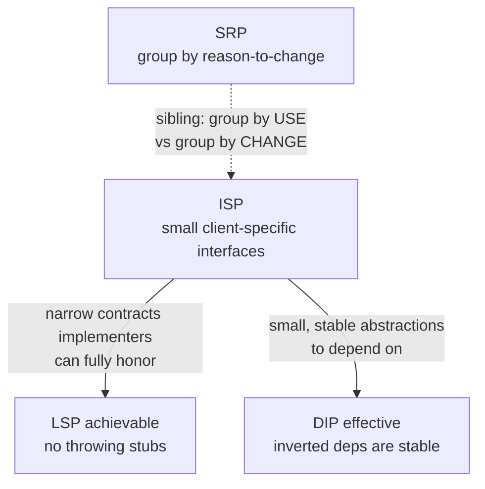
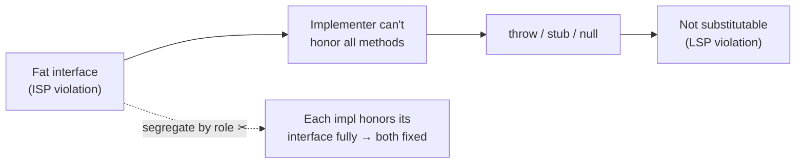

# Interface Segregation Principle (ISP) — Senior

> **Category:** [Design Principles → SOLID](../../README.md) — the fourth SOLID principle: many small, client-specific interfaces beat one fat general-purpose interface.

> **Prerequisites:** [Junior](junior.md) · [Middle](middle.md)
> **Focus:** **Design trade-offs** and **system-level reasoning**

---

## Table of Contents

1. [Introduction](#introduction)
2. [ISP as a Cohesion Theorem](#isp-as-a-cohesion-theorem)
3. [ISP and LSP: Two Views of One Defect](#isp-and-lsp-two-views-of-one-defect)
4. [ISP and DIP: Small Stable Abstractions](#isp-and-dip-small-stable-abstractions)
5. [ISP and SRP: The Precise Reconciliation](#isp-and-srp-the-precise-reconciliation)
6. [Nominal vs. Structural Typing](#nominal-vs-structural-typing)
7. [Where Segregation Goes Too Far](#where-segregation-goes-too-far)
8. [Advanced Examples](#advanced-examples)
9. [Liabilities](#liabilities)
10. [Pros & Cons at the System Level](#pros--cons-at-the-system-level)
11. [Diagrams](#diagrams)
12. [Related Topics](#related-topics)

---

## Introduction

> Focus: **design trade-offs** and **system-level reasoning**

At the senior level, ISP stops being "split fat interfaces" and becomes a lens on **where coupling enters a system through its contracts**. An interface is a *promise made to clients*; a fat interface is an over-broad promise that couples every client to the union of all consumers' needs. ISP is the discipline of making each promise no larger than the client it serves.

This file answers the hard questions:

1. **What is ISP *really*?** (It's a cohesion principle applied to the boundary between client and supplier — and it can be stated as a theorem about who depends on what.)
2. **How does ISP interlock with the other four SOLID principles?** (It's the connective tissue: fat interfaces force LSP violations, narrow interfaces enable DIP, and ISP is SRP's projection onto contracts.)
3. **When is a fat interface the right call**, and when does segregation become its own pathology?

---

## ISP as a Cohesion Theorem

The deepest reading of ISP is that it is **[cohesion](../../02-coupling-and-cohesion/02-maximise-cohesion/) measured from the client side.** An interface is *cohesive for a client* if the client uses all of it. A fat interface is, by construction, *incohesive*: it groups methods that no single client uses together.

State it as a near-theorem:

> If two methods on an interface are never used together by any client, then no client needs them as a unit — so binding them into one interface manufactures coupling that no client requires.

The contrapositive is the design rule: **methods belong in the same interface only if some client uses them together.** This is the same logic as the [Common Closure / Common Reuse](../../README.md) reasoning at the component level, projected down to a single contract. ISP is *Common Reuse Principle for interfaces*: things that aren't reused together shouldn't be packaged together, because depending on the package means depending on the parts you don't reuse.

This reframing dissolves the "how small should interfaces be?" anxiety. The answer is **client-shaped**: exactly as small as the largest method-set some client uses as a unit. Not smaller (that fragments — Common Reuse over-applied), not larger (that couples — ISP violated). The clients define the optimum; you're reading it off, not choosing it arbitrarily.

---

## ISP and LSP: Two Views of One Defect

The junior level noted that throwing-method fat interfaces violate [LSP](../03-lsp-liskov-substitution/junior.md). At the senior level, see *why* this is not a coincidence but a structural identity.

A fat interface makes a promise: *"every implementer supports all these methods."* When an implementer cannot honor part of the promise, it has exactly three escapes, all defects:

| Escape | ISP view | LSP view |
|---|---|---|
| `throw UnsupportedOperationException` | Forced dependency on an unsupported method | Substitution fails: client expecting the contract crashes |
| Empty / no-op body | Forced dependency, silently mis-honored | Weakened postcondition: the method "succeeds" without doing its job |
| `return null` / sentinel | Forced dependency, faked | Broken postcondition: caller gets a lie |

All three are the *same underlying fault* — an interface promising more than the implementer can deliver — seen through two principles. **ISP is the cause; the LSP violation is the symptom.** This is why segregating the interface fixes both at once: once `Robot` implements only `Workable`, there is no `eat()` to throw from, so there is nothing to substitute incorrectly.

> The chain: **fat interface (ISP violation) → implementer can't honor part of it → throws/stubs → not substitutable (LSP violation).** Cut the chain at its head — segregate — and both principles are satisfied.

The deeper unification: LSP is about *behavioral* substitutability of implementations; ISP is about *structural* narrowness of contracts. A narrow, role-shaped interface is one an implementer can *always honestly satisfy in full* — which is precisely the precondition for LSP to hold. **ISP makes LSP achievable** by ensuring no implementer is asked for behavior it can't provide.

---

## ISP and DIP: Small Stable Abstractions

[Dependency Inversion](../05-dip-dependency-inversion/junior.md) (DIP) says high-level modules should depend on abstractions, not concretions, and that abstractions shouldn't depend on details. DIP tells you *to* depend on an abstraction; **ISP tells you what shape that abstraction should be.**

The synergy is sharp:

- **DIP without ISP** inverts a dependency onto a *fat* abstraction. You've removed the dependency on the concrete class but replaced it with a dependency on a bloated interface — the client is still coupled to methods it doesn't use, just one level of indirection away. The inversion bought you little.
- **DIP with ISP** inverts onto a *role* interface — narrow, cohesive, and **stable** (a one- or two-method abstraction changes far less often than a fat one). The client now depends on the smallest, most stable thing possible.

```
   DIP alone:                          DIP + ISP:
   Client ──► IFatService              Client ──► IRole  (2 methods, stable)
              (12 methods, churns)                 ▲
                  ▲                                │
              Concrete impl                    Concrete impl
   (client still coupled to 12          (client coupled to exactly what it uses;
    methods of churn through the         the abstraction is small and rarely changes)
    interface)
```

There's a **stability argument** here that seniors should internalize: an interface's likelihood of changing scales with its surface area (more methods → more reasons to edit it). Small role interfaces are *intrinsically more stable* than fat ones, so depending on them — as DIP directs — is depending on something that won't drag you along when it changes. **ISP is what makes DIP's inverted dependencies actually stable.** The two principles are designed to be used together: invert (DIP) onto something narrow (ISP).

---

## ISP and SRP: The Precise Reconciliation

Juniors confuse them; middles distinguish them; seniors must state their exact relationship. Both descend from **cohesion**, but they cut along different axes:

- **SRP** partitions the *implementation* by **reason to change** (the actor/source-of-change axis). It asks: *if I change this class, whose request drove it?* Two actors → two responsibilities → split.
- **ISP** partitions the *contract* by **direction of use** (the client/consumer axis). It asks: *which clients call which methods?* Two disjoint client-sets → two interfaces → split.

They are **orthogonal projections of cohesion** onto different planes:

```
                  cohesion
                 /        \
            SRP /          \ ISP
        (group by      (group by
       reason-to-change  client-usage)
        — IMPLEMENTATION) — CONTRACT)
```

Why orthogonal and not equivalent? Because *who changes a class* and *who calls a method* are different relations. A class with one change-reason (SRP-clean) can serve clients with disjoint needs (ISP-dirty). A class with two change-reasons (SRP-dirty) can be consumed by clients that each use it fully (ISP-clean). They correlate in practice (fat interfaces often sit on multi-responsibility classes) but neither implies the other.

The senior payoff: **apply both, but at different layers.** Use SRP to decide how to *factor the code that does the work*; use ISP to decide how to *shape the contracts clients depend on*. A well-designed module is SRP-factored internally and ISP-shaped at its boundary — and the two decisions are made with different questions.

> Uncle Bob's own framing has drifted toward this: SRP is "gather what changes for the same reason, separate what changes for different reasons" (about *change*); ISP is about not depending on what you don't use (about *use*). Same family — cohesion — different question.

---

## Nominal vs. Structural Typing

ISP's *cost* and *ergonomics* depend heavily on the type system, and a senior should reason about this explicitly when choosing or designing in a language.

| | **Nominal** (Java, C#, Kotlin) | **Structural** (Go, TypeScript) |
|---|---|---|
| Satisfying an interface | Must declare `implements` | Automatic if methods match |
| Where interfaces live | Often with the implementation | Idiomatically with the *consumer* |
| Cost of segregation | Real: define + declare each role | Near-zero: declare the need at the call site |
| Risk | Header interfaces by default (IDE "Extract Interface") | Accidental satisfaction (a type fits an interface it shouldn't) |
| ISP as | A discipline you must apply | Mostly emergent from idiom |

**Structural typing makes ISP the path of least resistance.** In Go, you define `interface{ Read(...) }` *in the package that needs to read*, and any reader satisfies it without modification. This is ISP achieved *by the type system*: the client literally states the minimal contract it depends on, and nothing forces it to know about a wider surface. Rob Pike's proverb — *"the bigger the interface, the weaker the abstraction"* — is ISP elevated to a design value.

**Nominal typing requires deliberate ISP.** Because a class must name the interfaces it implements, the lazy path (extract the whole class's API into one interface) yields a header interface. Java mitigates this somewhat with multiple interface implementation (`implements A, B, C`) and `default` methods, but the engineer must *choose* to define small roles. The trade-off nominal typing buys: **explicitness** — you can't accidentally satisfy an interface, and the `implements` list documents intent. Structural typing trades that safety for ergonomics.

The senior judgment: in structural languages, ISP is nearly free — *take it*; in nominal languages, ISP is a deliberate cost — *spend it where clients genuinely differ*, and don't manufacture header interfaces with a single implementation (that's pure over-engineering with no segregation benefit).

---

## Where Segregation Goes Too Far

ISP is the *weakest* practical constraint to push to an extreme, because at the limit it produces **interface explosion**: one interface per method, irrespective of how clients use them. Senior judgment is knowing when a fat interface is actually correct and when a split is fragmentation.

A fat (whole) interface is **right** when:

- **Every client uses (nearly) all of it.** Then it's cohesive, not fat — there is no *unused* dependency to remove. ISP is about unused methods, not method count.
- **The methods form a genuine indivisible role.** A `Collection` interface (`add`, `remove`, `contains`, `size`, `iterator`) is large but coherent; clients of a collection generally want it whole. Shredding it into `Addable`, `Removable`, `Sizeable` would force every consumer to re-compose the obvious.
- **Splitting would manufacture combinatorial composites.** If a "role" only ever appears combined with others, the standalone interface adds names without reducing any client's dependency.

The tell of over-segregation: constructing or passing an object requires naming five interfaces that *always* travel together, and readers must mentally re-assemble the whole. That's **Common Reuse over-applied** — separating things that *are* reused together. The cure is the mirror of ISP: **merge interfaces that no client ever uses apart.**

> ISP and its overshoot are governed by the same rule: package methods together **iff** some client uses them together. Under-applied → fat interface (coupling). Over-applied → fragmentation (ceremony). The client's usage pattern is the arbiter in both directions.

---

## Advanced Examples

### Combining role interfaces without re-fattening (Go)

```go
// Small roles, each defined where used:
type Reader interface{ Read(p []byte) (int, error) }
type Writer interface{ Write(p []byte) (int, error) }
type Closer interface{ Close() error }

// Composite built UPWARD from roles — a client needing all three asks for this,
// while a client needing only Read still depends on Reader alone.
type ReadWriteCloser interface {
    Reader
    Writer
    Closer
}
// A *os.File satisfies all of these implicitly. The client picks its slice.
```

The key move: the composite is **assembled from** small interfaces, not split *from* a fat one. Clients that need one role depend on one role; clients needing the union ask for the composite — but the composite is transparent, made of the same small parts.

### Segregating at a DIP boundary (Java)

```java
// Persistence concern split into client-shaped roles, each a stable abstraction:
interface OrderReader { Order find(OrderId id); }
interface OrderWriter { void save(Order o); }

// High-level use cases depend on EXACTLY the role they need (DIP + ISP):
class PlaceOrderUseCase {
    private final OrderWriter writer;          // doesn't depend on read/export/migrate
    PlaceOrderUseCase(OrderWriter writer) { this.writer = writer; }
    void execute(Order o) { writer.save(o); }
}

class OrderHistoryQuery {
    private final OrderReader reader;          // doesn't depend on write
    OrderHistoryQuery(OrderReader reader) { this.reader = reader; }
    Order get(OrderId id) { return reader.find(id); }
}

// One adapter implements both; clients never see the other half:
class JpaOrderStore implements OrderReader, OrderWriter { /* ... */ }
```

`PlaceOrderUseCase` depends on a one-method, rarely-changing abstraction. A change to read or export semantics cannot recompile or destabilize it. This is the CQRS-flavored payoff of ISP at an architectural seam.

### Detecting fatness from the throw (any language)

```python
class S3Bucket(Storage):       # Storage has read/write/lock/transaction
    def read(self, k): ...
    def write(self, k, v): ...
    def lock(self, k):         # object stores don't lock
        raise NotImplementedError      # ← the interface is fat for S3
    def transaction(self):     # nor do they transact
        raise NotImplementedError      # ← split Lockable/Transactional off
```

The two `NotImplementedError`s are the interface confessing it bundled storage with locking/transactions — concerns only *some* backends (a SQL store) support. Segregate `Lockable` and `Transactional`; let `S3Bucket` implement only `Storage`.

---

## Liabilities

### Liability 1: Header interfaces masquerading as ISP

Teams "extract an interface" per class and believe they've applied ISP. They haven't — they've created header interfaces with one implementation: an extra abstraction (over-engineering) that *still* couples every client to the full class surface. Real ISP narrows what each client depends on; a header interface narrows nothing.

### Liability 2: Interface explosion / fragmentation

Over-zealous splitting yields one-method interfaces that always travel together, drowning the codebase in type names and forcing readers to re-compose roles mentally. The cost of navigating the fragments can exceed the coupling it removed. Split only where clients genuinely diverge.

### Liability 3: ISP without DIP/LSP awareness

Segregating interfaces while still depending on concretions (no DIP) gains little; segregating without noticing the LSP fault you're curing means you may "fix" the throw with a no-op (silent bug) instead of removing the dependency. ISP is most valuable applied *with* its sibling principles, not in isolation.

### Liability 4: Premature segregation with one client

If there is exactly one client and one implementation, segregating (or even introducing an interface) may be speculative generality — a YAGNI / [simple-design](../../../craftsmanship-disciplines/04-simple-design/junior.md) violation. ISP earns its keep when *multiple clients with different needs* exist; before that, you may be adding structure for a future that hasn't arrived.

---

## Pros & Cons at the System Level

| Dimension | Segregated (role interfaces) | Fat (general interface) |
|---|---|---|
| Client coupling | Minimal — each depends on its slice | Maximal — all depend on the union |
| Recompile / redeploy blast radius | Local to the changed role | Transitive across all clients |
| Implementer honesty (LSP) | High — no forced stubs/throws | Low — forces stubs/throws |
| Abstraction stability (for DIP) | High — small surface changes rarely | Low — large surface churns |
| Number of type names | Higher | Lower |
| Risk of fragmentation | Real if over-applied | — |
| Discoverability of full capability | Spread across roles | Centralized |
| Testability (mocking) | Easy — mock the one role | Harder — mock or stub the whole fat surface |

The system-level verdict: segregation wins on *every coupling and correctness dimension* (the ones that compound over a system's life) and loses only on *navigability/discoverability* (a mostly one-time cost) and on the risk of being **over**-applied. Because the wins compound and the losses don't, the senior default is to segregate toward client-shaped roles — stopping precisely at the point where each client depends only on what it uses, and not one cut further.

---

## Diagrams

### ISP is the hinge between LSP, DIP, and SRP



### The fat-interface defect chain (and where ISP cuts it)



---

## Related Topics

- **Sibling SOLID principles:** [SRP](../01-srp-single-responsibility/senior.md) · [LSP](../03-lsp-liskov-substitution/senior.md) · [DIP](../05-dip-dependency-inversion/senior.md) · [SOLID as a Whole](../06-solid-as-a-whole-and-smells/senior.md)
- **Underlying idea:** [Maximise Cohesion](../../02-coupling-and-cohesion/02-maximise-cohesion/) · [Connascence](../../02-coupling-and-cohesion/03-connascence/)
- **Restraint check:** [Simple Design / YAGNI](../../../craftsmanship-disciplines/04-simple-design/senior.md)

---


---

## Check your understanding

1. Explain Interface Segregation Principle (ISP) — Senior Level in your own words and name the problem it solves.
2. How would you apply the ideas around Table of Contents, Introduction, ISP as a Cohesion Theorem in a realistic engineering change?
3. What failure mode or misuse should you look for, and what evidence would reveal it?
4. How would you validate a system-level decision about Interface Segregation Principle (ISP) — Senior Level under uncertainty?
5. What observable result would convince you that the approach improved the system?
