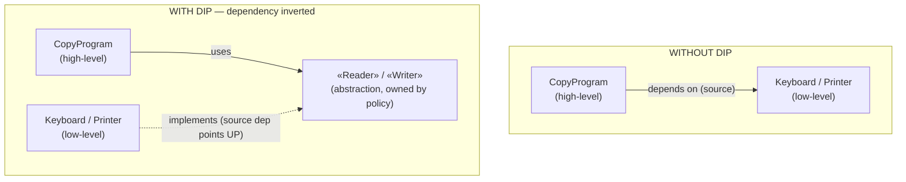
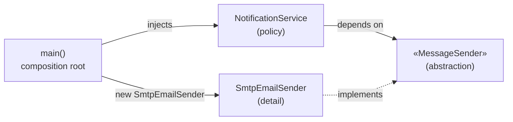

# Dependency Inversion Principle (DIP) — Junior

> **Category:** [Design Principles → SOLID](../../README.md) — the fifth principle: depend on abstractions, not on concrete details, and let the high-level policy own the abstraction.

---

## Introduction

> Focus: **What is it?** and **How to use it?**

The **Dependency Inversion Principle (DIP)** is the "D" of SOLID. It is about *which direction the arrows point* in your source code. Most code is written so that the important, high-level part (the business policy) reaches down and grabs a low-level, concrete part (a specific database, a specific file format, a specific email library). DIP says: **don't do that.** Instead, make the important code depend on an **abstraction** — an interface — and make the low-level detail depend on that same abstraction by implementing it.

Robert C. Martin ("Uncle Bob") states it in two clauses:

> 1. **High-level modules should not depend on low-level modules. Both should depend on abstractions.**
> 2. **Abstractions should not depend on details. Details should depend on abstractions.**

The first clause is about *modules*; the second is about *what an abstraction is allowed to mention.* Together they produce a design where your core logic knows nothing about the specific tools it happens to use today, so you can swap those tools — a real database for a fake one in a test, MySQL for Postgres, email for SMS — without touching the core.

### Why this matters

The thing your business actually cares about — *what an order is, how a price is calculated, when a user is allowed to do something* — is your most valuable code and the thing you least want to rewrite. The thing it least cares about — *which exact SMTP library sends the email* — is the most likely to change. When the valuable code depends directly on the disposable code, every change to the disposable part risks breaking the valuable part. DIP flips that dependency so the valuable code is **protected** from the churn of the details.

---

## Prerequisites

- **Required:** Interfaces / abstract types in at least one language (Java `interface`, Python `Protocol`/ABC, TypeScript `interface`, Go `interface`).
- **Required:** The difference between *defining* an interface and *implementing* it.
- **Helpful:** [Open/Closed Principle](../02-ocp-open-closed/junior.md) — DIP is the mechanism that usually makes OCP possible.
- **Helpful:** [Interface Segregation](../04-isp-interface-segregation/junior.md) — the abstractions DIP introduces should be *small* and client-shaped.
- **Helpful:** A feel for [coupling](../../02-coupling-and-cohesion/01-minimise-coupling/) — DIP is fundamentally a coupling-management technique.

---

## Glossary

| Term | Definition |
|------|-----------|
| **High-level module** | Code that holds policy / business rules — *what* the system does (e.g., "copy characters from input to output until end-of-file"). |
| **Low-level module** | Code that holds mechanism / details — *how* a specific thing is done (e.g., "read a key from this keyboard," "write a byte to this printer"). |
| **Abstraction** | An interface or abstract type that names a capability without naming an implementation (`Reader`, `Writer`, `OrderRepository`). |
| **Detail** | A concrete class that implements an abstraction (`KeyboardReader`, `PostgresOrderRepository`). |
| **Source-code dependency** | A compile-time "this file must know about that file" relationship — the arrow DIP inverts. |
| **Flow of control** | The runtime order in which code calls code — *not* what DIP inverts. |
| **Dependency Injection (DI)** | A *technique*: supply a collaborator from outside (via constructor/setter) instead of creating it inside. |
| **Inversion of Control (IoC)** | A broader *pattern*: the framework/runtime calls your code, rather than your code calling it ("don't call us, we'll call you"). |
| **Composition root** | The one place (near `main`) where concrete implementations are created and wired into the abstractions. |

---

## What DIP Actually Says

Re-read the two clauses, because each forbids something specific.

**Clause 1 — High-level and low-level both depend on abstractions.**
A `BillingService` (high-level) must not `import StripeClient` directly. Instead, `BillingService` depends on a `PaymentGateway` interface, and `StripeClient` *also* depends on `PaymentGateway` (by implementing it). Neither module references the other's concrete type; they meet in the middle, at the interface.

**Clause 2 — Abstractions don't depend on details.**
The `PaymentGateway` interface must not mention Stripe-specific types. If your interface has a method `chargeViaStripe(StripeToken t)`, the abstraction is *leaking* a detail and the second clause is violated — swapping to PayPal now means changing the interface, which means changing everyone who depends on it. A clean abstraction speaks only in terms the high-level policy understands: `charge(Money amount, Card card)`.

> A simple test for clause 2: *Could you implement this interface with a completely different vendor without changing the interface?* If a vendor's name or type appears in the abstraction, the answer is no — and you've leaked a detail.

---

## The "Inversion": What Gets Inverted

This is the part of DIP that confuses everyone, so go slowly.

**The flow of control is NOT inverted.** At runtime, the high-level `CopyProgram` still calls down into the low-level `Keyboard` to read a character. High calls low, exactly as you'd expect.

**The SOURCE-CODE dependency IS inverted.** Without DIP, the source-code arrow follows the call: `CopyProgram` → `Keyboard` (the file `copy.java` imports `Keyboard`). With DIP, you introduce a `Reader` interface, and crucially **the interface belongs to the high-level layer** — it is defined next to `CopyProgram`, in the policy's own package, because it expresses what the *policy* needs. Now:

- `CopyProgram` depends on `Reader` (same layer — barely a dependency at all).
- `Keyboard` depends on `Reader` too, because it *implements* it.

The arrow from `Keyboard` now points **up** toward the policy layer, against the flow of control. That backward-pointing arrow is the "inversion."

```text
WITHOUT DIP (dependency follows control)        WITH DIP (dependency inverted)

  ┌─────────────┐                                 ┌─────────────────────────┐
  │ CopyProgram │  (high-level policy)            │  POLICY LAYER           │
  └─────┬───────┘                                 │  ┌─────────────┐        │
        │ depends on (source)                     │  │ CopyProgram │        │
        │ + calls (control)                       │  └──────┬──────┘        │
        ▼                                         │         │ uses          │
  ┌─────────────┐                                 │         ▼               │
  │  Keyboard   │  (low-level detail)             │  ┌─────────────┐        │
  └─────────────┘                                 │  │  «Reader»   │ owns    │
                                                  │  └──────▲──────┘ the IF  │
   high → low for BOTH                            └─────────┼───────────────┘
   source dependency AND control                           │ implements (source dep points UP)
                                                  ┌─────────┴───────┐
                                                  │    Keyboard     │ (detail)
                                                  └─────────────────┘
                                                  control still flows high → low;
                                                  the SOURCE dependency is inverted.
```

The payoff: the policy layer can now be compiled, understood, and tested **without** the `Keyboard` file existing at all. The detail has become a *plugin* to the policy.

---

## DIP vs DI vs IoC — Three Things People Confuse

These three terms are used interchangeably in the wild, and that is a mistake. They are related but **not** the same. Memorize this table.

| | **DIP** (Dependency Inversion Principle) | **DI** (Dependency Injection) | **IoC** (Inversion of Control) |
|---|---|---|---|
| **What it is** | A *design principle* (a SOLID rule) | A *technique* for supplying dependencies | A broad *architectural pattern* |
| **It answers** | *Which way should source dependencies point?* | *How does an object get its collaborators?* | *Who is in charge of the program's flow — your code or a framework?* |
| **The rule / move** | Depend on abstractions; the policy owns them | Pass collaborators in from outside (constructor/setter), don't `new` them inside | The framework calls you ("Hollywood Principle: don't call us, we'll call you") |
| **Scope** | Source-code structure | Object construction | Program control flow |
| **Example** | `Service` depends on `Repository` interface | `new Service(realRepo)` in `main` | A web framework invokes your handler; an event loop calls your callback |

### How they relate without being equal

- **DI is one common *technique* for achieving DIP.** To make `BillingService` depend on the `PaymentGateway` *abstraction*, something must supply a concrete `StripeClient`. Injecting it (constructor injection) is the usual way. But you could also achieve DIP without classic DI (e.g., in Go, by accepting an interface parameter). **DIP is the goal; DI is a means.**
- **DI is a *form* of IoC.** "Inverting control" of object construction — letting an outside agent build and hand you your dependencies instead of you building them yourself — is one specific kind of inversion of control. But IoC is broader: a framework calling your event handler is IoC and has nothing to do with DI.
- **You can have one without the others.** You can inject a *concrete* class (DI without DIP — you injected it, but you depend on a concretion). You can have IoC with no DI (a template-method framework). You can satisfy DIP by hand-wiring with no container at all.

> One-line memory hook: **DIP** is *what to depend on*, **DI** is *how to receive it*, **IoC** is *who calls whom*. IoC has its own dedicated topic — see [Inversion of Control](../../02-coupling-and-cohesion/08-inversion-of-control/) — so we don't re-derive it here.

---

## Real-World Analogies

| Concept | Analogy |
|---|---|
| **Depend on an abstraction, not a detail** | A wall socket. Your laptop charger depends on the *standard socket shape* (the abstraction), not on the specific power station. Swap coal for solar behind the wall — your charger never notices. |
| **The high-level layer owns the interface** | A company publishes a *job description* (the interface) for the work *it* needs done, then hires whoever fits it. The company defines the contract; candidates conform to it — not the other way around. |
| **Detail as a plugin** | A power drill and its interchangeable bits. The drill (policy) defines the chuck (interface); each bit (detail) is built to fit the chuck. New bits plug into the unchanged drill. |
| **Dependency Injection** | You don't manufacture your own electricity; it's *delivered* to your socket. DI delivers collaborators to your object instead of making the object generate them. |
| **Inversion of Control** | An orchestra: musicians (your code) don't decide when to play; the conductor (the framework) cues them. "Don't call us, we'll call you." |

---

## Mental Models

**The intuition:** *"Make the disposable code depend on the valuable code, never the reverse — by putting an interface between them that the valuable code owns."*

```text
   VALUE / STABILITY  ──────────────────────────────►
   (least likely to change)            (most likely to change)

   ┌──────────────┐      ┌──────────────┐      ┌──────────────┐
   │  Business    │ owns │  Abstraction │ impl │   Detail     │
   │  Policy      │─────►│  (interface) │◄─────│ (DB, SMTP,   │
   │ (high-level) │      │              │      │  file, SDK)  │
   └──────────────┘      └──────────────┘      └──────────────┘
        stable                stable               volatile
   Source dependencies all point toward the STABLE, ABSTRACT center.
```

A second model: **abstractions are stable, details are volatile, and dependencies should always point from volatile toward stable.** Interfaces change rarely (they're contracts); their implementations change often. So pointing every source dependency *at the interface* means change in the volatile details can't ripple upward into the stable policy.

---

## A Worked Example: The Copy Program

This is Uncle Bob's canonical example. We have a tiny program: read characters from a device and write them to another device until end of input.

### The un-inverted version (high depends on low)

```python
def copy():
    while True:
        c = read_keyboard()      # low-level detail, called directly
        if c == EOF:
            break
        write_printer(c)         # low-level detail, called directly
```

`copy` is high-level policy — "move characters from a source to a sink." But it *names* `read_keyboard` and `write_printer`, two concrete low-level mechanisms. The dependency points **down** to the details.

**The pain:** now someone wants to copy from a keyboard to a *disk*. You edit `copy`. Then from a *network socket* to a printer — you edit `copy` again, probably adding a flag:

```python
def copy(dest="printer"):
    while True:
        c = read_keyboard()
        if c == EOF: break
        if dest == "printer": write_printer(c)
        elif dest == "disk":  write_disk(c)     # policy now knows every device
```

The high-level policy is now polluted with knowledge of every device. Every new device edits the policy. This is the disease DIP cures.

### The inverted version (both depend on an abstraction the policy owns)

Introduce two abstractions, **owned by the policy** (they describe what *copy* needs):

```python
from typing import Protocol

class Reader(Protocol):          # abstraction — defined WITH the policy
    def read(self) -> str | None: ...   # returns a char, or None at EOF

class Writer(Protocol):          # abstraction — defined WITH the policy
    def write(self, c: str) -> None: ...

def copy(reader: Reader, writer: Writer) -> None:   # high-level policy
    while (c := reader.read()) is not None:
        writer.write(c)
```

Now the *details* implement these abstractions:

```python
class KeyboardReader:                     # detail → depends on Reader
    def read(self) -> str | None: ...
class PrinterWriter:                      # detail → depends on Writer
    def write(self, c: str) -> None: ...
class DiskWriter:                         # a NEW detail — copy() never changes
    def write(self, c: str) -> None: ...
```

`copy` now knows nothing about keyboards, printers, or disks. To copy keyboard→disk, you wire it up at the **composition root** (next section) — *you never touch `copy`*. Adding a `NetworkReader` or `S3Writer` is a new file that implements the interface; the policy is closed against that change. (That's the [Open/Closed Principle](../02-ocp-open-closed/junior.md), and DIP is how you got it.)

---

## Code Examples

### Java — un-inverted vs inverted, with the composition root

```java
// ── UN-INVERTED: high-level service depends on a concrete low-level class ──
class NotificationService {                 // high-level policy
    private final SmtpEmailClient email = new SmtpEmailClient(); // ← concrete!
    void notifyShipped(Order o) {
        email.send(o.customerEmail(), "Your order shipped");
    }
}
// Problem: NotificationService is welded to SMTP. Can't test without a mail
// server; can't switch to SMS; the policy imports the detail.
```

```java
// ── INVERTED: the policy owns a small abstraction; details implement it ──

// Abstraction lives WITH the policy (its package), shaped by what policy needs:
interface MessageSender {                   // owned by the policy layer
    void send(String to, String body);
}

class NotificationService {                 // high-level policy
    private final MessageSender sender;     // depends on the ABSTRACTION
    NotificationService(MessageSender sender) {   // constructor injection
        this.sender = sender;
    }
    void notifyShipped(Order o) {
        sender.send(o.customerEmail(), "Your order shipped");
    }
}

// Details depend on the abstraction by implementing it (arrow points UP):
class SmtpEmailSender implements MessageSender {
    public void send(String to, String body) { /* ...SMTP... */ }
}
class TwilioSmsSender implements MessageSender {
    public void send(String to, String body) { /* ...SMS... */ }
}
```

```java
// ── COMPOSITION ROOT: the ONE place that knows the concrete types ──
public class Main {
    public static void main(String[] args) {
        MessageSender sender = new SmtpEmailSender();          // choose the detail here
        NotificationService service = new NotificationService(sender);  // inject it
        // ... run the app. To switch to SMS, change ONE line above.
    }
}
```

Notice three things: (1) `NotificationService` never names `SmtpEmailSender`; (2) the detail `SmtpEmailSender` names the abstraction `MessageSender` — its dependency points *up*; (3) only `Main` knows the concrete wiring.

### TypeScript — same shape, and why it makes tests trivial

```typescript
interface Clock { now(): Date; }            // tiny abstraction owned by policy

class SubscriptionService {                 // high-level policy
  constructor(private clock: Clock) {}      // constructor injection
  isExpired(sub: { expiresAt: Date }): boolean {
    return sub.expiresAt < this.clock.now();
  }
}

// Production detail:
class SystemClock implements Clock { now() { return new Date(); } }

// Test detail — a fake the policy accepts without any change:
class FixedClock implements Clock {
  constructor(private fixed: Date) {}
  now() { return this.fixed; }
}

// test: deterministic, no real time involved
const svc = new SubscriptionService(new FixedClock(new Date("2030-01-01")));
expect(svc.isExpired({ expiresAt: new Date("2029-12-31") })).toBe(true);
```

The whole reason this test is easy is DIP: `SubscriptionService` depends on the `Clock` *abstraction*, so a test can inject a `FixedClock`. Without DIP it would call `new Date()` directly and you couldn't control time.

### Python — DI vs DIP, to show the difference

```python
# DI but NOT DIP — we injected, but we still depend on a CONCRETION:
class ReportService:
    def __init__(self, db: PostgresClient):   # injected, yet a concrete type
        self.db = db                          # policy still imports Postgres

# DIP — depend on an abstraction (and inject it):
class OrderRepository(Protocol):              # abstraction owned by policy
    def find(self, id: str) -> Order: ...

class ReportService:
    def __init__(self, repo: OrderRepository):  # depends on the abstraction
        self.repo = repo
```

The first version uses dependency injection but still violates DIP — it depends on `PostgresClient`. **Injecting a concrete type is DI without inversion.** DIP requires the *type you depend on* to be an abstraction.

---

## Best Practices

1. **Depend on interfaces in your business logic; create concretes only at the edge.** Core classes accept abstractions; the composition root (`main`) builds the real implementations.
2. **Let the high-level layer own the interface.** Define `OrderRepository` next to the code that *uses* orders, not inside the database package. The consumer defines the contract.
3. **Keep abstractions free of detail-specific types** (clause 2). No `StripeToken`, `ResultSet`, or `HttpRequest` leaking into a domain interface.
4. **Prefer constructor injection.** It makes dependencies explicit and guarantees the object is fully formed (no half-constructed state).
5. **Wire at one composition root.** Concentrate all `new`/construction in one place near the entry point so the rest of the code stays abstraction-only.
6. **Don't add an interface until you have a reason** — a second implementation, a test seam, or a real boundary. (More on this debate at [Middle](middle.md).)

---

## Common Mistakes

1. **Confusing DIP with DI.** Injecting a *concrete* class satisfies DI but not DIP. DIP is about depending on an *abstraction*.
2. **Putting the interface in the wrong package.** Defining `OrderRepository` inside the persistence module makes the policy depend *down* on persistence — the dependency isn't inverted. The interface belongs with the policy.
3. **Leaky abstractions (clause-2 violation).** A "generic" interface whose methods take or return vendor types. Swapping vendors then forces an interface change.
4. **Interface for everything.** One-implementation interfaces with no test or boundary need are speculative generality — they add indirection for nothing. (See [Tricky Points](#tricky-points).)
5. **`new` inside the policy.** Any `new ConcreteThing()` inside a high-level class re-welds it to that detail, defeating the inversion.
6. **Thinking DIP inverts the flow of control.** It inverts the *source dependency*; control still flows high → low.

---

## Tricky Points

- **"Inversion" is about source dependencies, not runtime calls.** This is the single most misunderstood point. High-level still *calls* low-level at runtime; the *import arrow* is what flips.
- **DI without DIP is real.** You can inject concretions all day and still violate DIP. The litmus test: *is the declared type an abstraction or a concrete class?*
- **Not every dependency needs inverting.** Depending on stable, unlikely-to-change things (your language's standard library, a `String`, a well-established date type) is fine. DIP targets *volatile* details, not all dependencies. (Deepened at [Senior](senior.md).)
- **The interface belongs to the client, not the implementer.** This "ownership" rule is what makes the dependency invert. If the database team owns `OrderRepository`, you didn't invert anything — you just moved the coupling.
- **A service locator is *not* the same as DI** and is often an anti-pattern — it hides dependencies instead of declaring them. (Explained at [Middle](middle.md).)

---

## Test Yourself

1. State the two clauses of DIP.
2. In the inverted design, which way does the *source-code* dependency point, and which way does the *flow of control* point? Why are they different?
3. Who should *own* (define) the abstraction — the high-level module or the low-level module — and why?
4. Distinguish DIP, DI, and IoC in one sentence each.
5. Is injecting a concrete `PostgresClient` into a service an example of DIP? Why or why not?
6. What is a composition root and what lives there?

---

## Cheat Sheet

```text
DIP — TWO CLAUSES
  1. High-level & low-level both depend on ABSTRACTIONS (not each other).
  2. ABSTRACTIONS don't depend on DETAILS; DETAILS depend on ABSTRACTIONS.

THE INVERSION
  flow of control:      high ──calls──► low        (NOT inverted)
  source dependency:    low ──implements──► abstraction ◄──uses── high
                        (abstraction OWNED by the high-level/policy layer)

DIP vs DI vs IoC
  DIP = WHAT to depend on   → abstractions, owned by the policy
  DI  = HOW to receive it   → constructor/setter injection (a technique)
  IoC = WHO calls whom      → framework calls you ("don't call us")
  DI is a means to DIP; DI is a kind of IoC; none equals another.

HOW TO APPLY
  core classes accept interfaces → build concretes at ONE composition root
  prefer constructor injection · keep vendor types OUT of abstractions
  invert VOLATILE details, not stable stdlib types
```

---

## Summary

- **DIP** = depend on **abstractions**, not concrete details — in *both* directions (clause 1) and *all the way down* (clause 2: abstractions stay detail-free).
- The **inversion** is of the *source-code dependency*, not the flow of control. You insert an interface, **owned by the high-level policy layer**, so the low-level detail's dependency points *up* toward the policy.
- DIP turns volatile details into **plugins** of the stable policy, which is what makes the core testable and swappable.
- **DIP ≠ DI ≠ IoC.** DIP is the principle (what to depend on), DI is a technique (how to receive a dependency), IoC is the broad pattern (who calls whom). DI is a *means* to DIP and a *kind* of IoC.
- Build concretes only at the **composition root**; everywhere else, depend on abstractions.

---

## Further Reading

- Robert C. Martin, *Agile Software Development: Principles, Patterns, and Practices* — the original DIP chapter and the Copy/Button-Lamp examples.
- Robert C. Martin, *Clean Architecture* — the **Dependency Rule** generalizes DIP to whole architectures (see the Dependency Rule and Plugin Architecture and the DIP).
- Martin Fowler, *Inversion of Control Containers and the Dependency Injection Pattern* — the canonical DI-vs-IoC clarification.
- Alistair Cockburn, *Hexagonal Architecture (Ports and Adapters)* — the architectural expression of DIP.

---

## Related Topics

- **Sibling SOLID principles:** [Open/Closed](../02-ocp-open-closed/junior.md), [Interface Segregation](../04-isp-interface-segregation/junior.md), [SOLID as a Whole](../06-solid-as-a-whole-and-smells/junior.md).
- **Underlying coupling theory:** [Minimise Coupling](../../02-coupling-and-cohesion/01-minimise-coupling/), [Inversion of Control](../../02-coupling-and-cohesion/08-inversion-of-control/).
- **Architecture scale:** The Dependency Rule, Plugin Architecture and the DIP.

---

## Diagrams

### The dependency-arrow inversion (the heart of DIP)



### Where the concretes are born (composition root)




---

## Check your understanding

1. Explain Dependency Inversion Principle (DIP) — Junior Level in your own words and name the problem it solves.
2. How would you apply the ideas around Table of Contents, Introduction, Prerequisites in a realistic engineering change?
3. What failure mode or misuse should you look for, and what evidence would reveal it?
4. What small example would prove that you can apply Dependency Inversion Principle (DIP) — Junior Level correctly?
5. What observable result would convince you that the approach improved the system?
