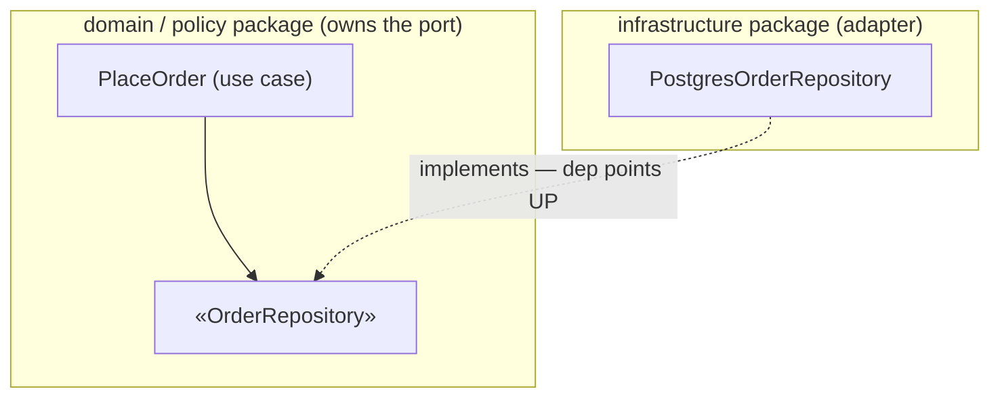
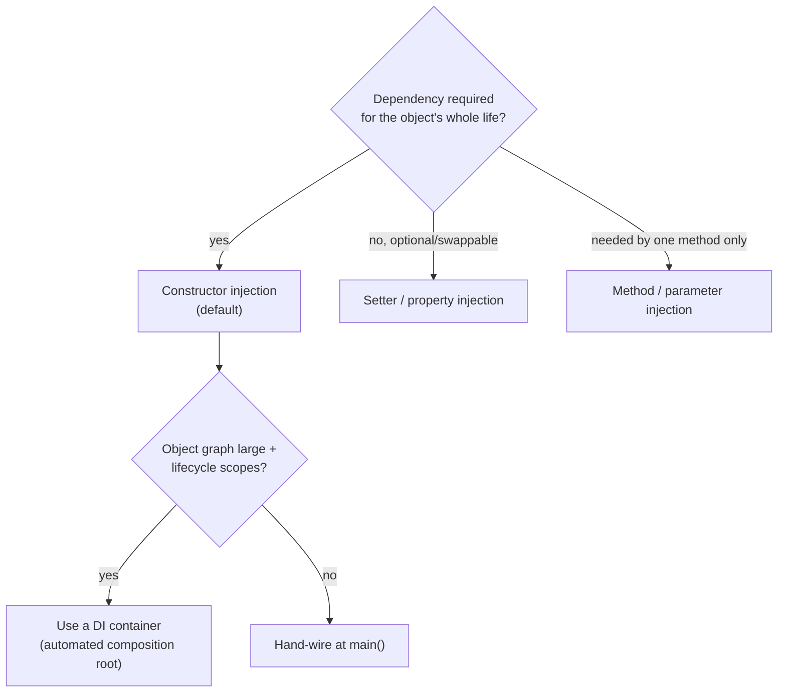

# Dependency Inversion Principle (DIP) — Middle

> **Category:** [Design Principles → SOLID](../../README.md) — the fifth principle: depend on abstractions, not on concrete details, and let the high-level policy own the abstraction.

> **Prerequisite:** [Junior](junior.md)
> **Focus:** **Why** and **When**

---

## Table of Contents

1. [Introduction](#introduction)
2. [Applying DIP to Real Code](#applying-dip-to-real-code)
3. [Ownership: Who Defines the Interface](#ownership-who-defines-the-interface)
4. [The Mechanisms of Injection](#the-mechanisms-of-injection)
5. [Service Locator: The Tempting Anti-Pattern](#service-locator-the-tempting-anti-pattern)
6. [DI Containers: When and Why](#di-containers-when-and-why)
7. [Ports and Adapters: DIP as Architecture](#ports-and-adapters-dip-as-architecture)
8. [When You DON'T Need an Interface](#when-you-dont-need-an-interface)
9. [Trade-offs](#trade-offs)
10. [Edge Cases](#edge-cases)
11. [Tricky Points](#tricky-points)
12. [Best Practices](#best-practices)
13. [Test Yourself](#test-yourself)
14. [Summary](#summary)
15. [Diagrams](#diagrams)

---

## Introduction

> Focus: **Why** and **When**

At the junior level DIP is a shape you recognize: policy depends on an interface, detail implements it, `main` wires it. At the middle level it becomes a set of judgement calls: *Who should own this interface? Constructor or setter injection? Do I reach for a DI container or wire by hand? Does this class even need an interface, or am I adding indirection for nothing?*

The recurring tension is between **decoupling** and **over-abstraction**. DIP applied everywhere produces a codebase where every concrete class hides behind a one-implementation interface, every dependency is injected, and following any call requires three hops through abstractions that exist only on paper. DIP applied *where it pays* produces a stable core that swaps details freely. The middle skill is telling those two apart — and the single best discriminator is **volatility crossing a boundary**: invert dependencies that point at *volatile details across a meaningful boundary*; leave the rest concrete.

---

## Applying DIP to Real Code

Take a realistic feature: a service that places an order, charges a card, and records the result.

```python
# ── VIOLATION: high-level policy welded to three concrete details ──
class PlaceOrder:
    def __init__(self):
        self.db = PostgresConnection(DSN)     # detail
        self.gateway = StripeClient(API_KEY)  # detail
        self.mailer = SmtpMailer(SMTP_HOST)   # detail

    def execute(self, cart, card):
        order = Order.from_cart(cart)
        self.db.insert("orders", order.to_row())          # DB-specific
        self.gateway.charge(card.token, order.total_cents) # Stripe-specific
        self.mailer.send(order.email, "Order confirmed")   # SMTP-specific
```

`PlaceOrder` is your most valuable code — it encodes the *order placement policy*. Yet it imports Postgres, Stripe, and SMTP. You cannot unit-test it without all three running; you cannot move off Stripe without editing it; a change to any vendor risks the policy.

```python
# ── DIP applied: policy depends on three abstractions it OWNS ──
from typing import Protocol

class OrderRepository(Protocol):
    def save(self, order: "Order") -> None: ...

class PaymentGateway(Protocol):
    def charge(self, card: "Card", amount: "Money") -> "Receipt": ...

class Notifier(Protocol):
    def order_confirmed(self, order: "Order") -> None: ...

class PlaceOrder:                              # high-level policy, detail-free
    def __init__(self, repo: OrderRepository,
                 gateway: PaymentGateway,
                 notifier: Notifier):
        self.repo, self.gateway, self.notifier = repo, gateway, notifier

    def execute(self, cart, card):
        order = Order.from_cart(cart)
        self.repo.save(order)
        self.gateway.charge(card, order.total)
        self.notifier.order_confirmed(order)
```

Two things to notice. First, the abstractions are phrased in *domain* terms — `charge(card, amount)`, not `charge(stripe_token, cents)`. That keeps clause 2 satisfied: no Stripe type leaks into the interface, so PayPal can implement it later without touching the contract. Second, the policy reads like a sentence of business intent, uncluttered by mechanism. The details live elsewhere:

```python
class PostgresOrderRepository:                 # adapter → implements OrderRepository
    def __init__(self, conn): self.conn = conn
    def save(self, order): self.conn.insert("orders", order.to_row())

class StripeGateway:                           # adapter → implements PaymentGateway
    def __init__(self, client): self.client = client
    def charge(self, card, amount):
        return Receipt.of(self.client.charge(card.token, amount.cents))
```

And the wiring happens once, at the composition root:

```python
def main():
    repo = PostgresOrderRepository(PostgresConnection(DSN))
    gateway = StripeGateway(StripeClient(API_KEY))
    notifier = EmailNotifier(SmtpMailer(SMTP_HOST))
    place_order = PlaceOrder(repo, gateway, notifier)   # inject the concretes
    # ... serve requests with place_order
```

---

## Ownership: Who Defines the Interface

This is the rule that *actually produces the inversion*, and the one most teams get wrong.

> **The interface belongs to the consumer (the high-level policy), not the provider (the low-level detail).**

`OrderRepository` is defined in the *domain/policy* package — next to `PlaceOrder` — because it expresses *what the policy needs from persistence*. The `PostgresOrderRepository` in the *infrastructure* package then *depends on* (implements) it. That is why the infrastructure's source dependency points **up** into the domain. The inversion is a direct consequence of ownership.

Contrast the common mistake: the database team writes an `OrderRepository` interface and ships it *in the persistence library*, and the domain imports it from there. Now the domain depends *downward* on the persistence library — you've added an interface but **inverted nothing**. The arrow still points the wrong way.

```text
WRONG OWNERSHIP (no inversion)            RIGHT OWNERSHIP (inverted)

  domain ──imports──► persistence.IRepo     domain.IRepo ◄──implements── persistence.Repo
  (domain depends DOWN on infra)            (infra depends UP on domain)
```

A practical tell: if deleting the infrastructure package would cause the domain package to stop compiling, you got ownership wrong. With correct DIP, the domain compiles **alone**; infrastructure is the optional plugin.

---

## The Mechanisms of Injection

DIP says *depend on an abstraction*; something still has to supply the concrete. Here are the ways, with when to use each.

| Mechanism | How | Use when | Caution |
|---|---|---|---|
| **Constructor injection** | Pass collaborators as constructor params | **Default.** Required, lifetime-long dependencies | Many params signals the class does too much (an [SRP](../01-srp-single-responsibility/junior.md) smell) |
| **Setter / property injection** | Expose a setter to install the dependency | Optional dependencies; reconfigurable at runtime | Object can exist half-wired (`null` collaborator) |
| **Method / parameter injection** | Pass the dependency to the one method that needs it | A collaborator used by a single operation | Not for pervasively-used dependencies |
| **Interface injection** | An interface declares the inject method | Rare; framework-driven | Mostly historical |

**Prefer constructor injection.** It makes the dependency list explicit (you can see everything a class needs in its signature), guarantees the object is fully formed before use (no half-constructed `null`-collaborator state), and supports `final`/`readonly` fields. Setter injection trades those guarantees for runtime flexibility — use it only for genuinely optional or swappable dependencies.

```typescript
// Constructor injection (default): dependencies are explicit and required
class InvoiceService {
  constructor(
    private readonly repo: InvoiceRepository,   // abstraction
    private readonly clock: Clock,              // abstraction
  ) {}
}

// Method injection: a dependency only one operation needs
class ReportService {
  generate(orders: Order[], formatter: ReportFormatter): string {
    return formatter.format(orders);            // injected per-call
  }
}
```

---

## Service Locator: The Tempting Anti-Pattern

A **service locator** is a global registry you *ask* for dependencies:

```typescript
class PlaceOrder {
  execute(cart: Cart) {
    const repo = ServiceLocator.get<OrderRepository>("repo");   // PULL dependency
    const gw   = ServiceLocator.get<PaymentGateway>("gateway"); // from a global
    // ...
  }
}
```

This *looks* like DI — you're still getting an abstraction — but it is widely considered an **anti-pattern**, and the reason is precise:

- **Hidden dependencies.** `PlaceOrder`'s constructor signature lies — it claims to need nothing, but it secretly needs a `repo` and a `gateway` from the locator. You can't see a class's true dependencies from its API. DI *pushes* dependencies in (visible in the signature); the locator lets the class *pull* them (invisible).
- **Coupling to the locator.** Every class now depends on the global `ServiceLocator` itself — a new, pervasive coupling, and a singleton, which is its own problem.
- **Fragile tests.** Tests must configure the global registry instead of just passing a fake to the constructor; tests can leak state into each other through the shared locator.
- **Runtime failures instead of compile-time guarantees.** A missing registration blows up at call time, deep in execution, not at construction.

> Rule of thumb: **DI = dependencies pushed in (declared in the signature); service locator = dependencies pulled out (hidden in the body).** Both supply abstractions, so both can satisfy DIP *in the narrow sense* — but the locator destroys the *visibility* and *testability* that motivate DIP in the first place. Prefer injection.

---

## DI Containers: When and Why

A **DI container** (Spring, Guice, .NET's built-in, Dagger, NestJS's injector) is a tool that automates the composition root: you register which concrete implements which abstraction, and the container constructs and wires the object graph for you.

```java
// Spring: register the binding once; the container injects everywhere
@Component class StripeGateway implements PaymentGateway { /* ... */ }

@Service class PlaceOrder {
    private final PaymentGateway gateway;
    PlaceOrder(PaymentGateway gateway) { this.gateway = gateway; } // auto-wired
}
```

A container is **DI plus IoC of construction**: you no longer call the constructors; the container does (the "Hollywood Principle" applied to wiring). Use one when:

- The object graph is **large** — hundreds of services where hand-wiring `main` becomes unwieldy.
- You want **lifecycle/scope management** (singleton vs per-request vs per-session) handled for you.
- The framework expects it (Spring, NestJS, ASP.NET are container-centric).

But know the trade-offs:

- **A container is not required for DIP or DI.** Plain constructor injection wired by hand in `main` fully satisfies both. Small/medium apps often don't need a container at all.
- **Containers can hide the wiring** and reintroduce service-locator-style action-at-a-distance if you use `context.getBean(X)` (that's a locator). Stick to constructor injection; avoid pulling from the container in business code.
- **Misconfiguration moves to runtime.** Binding errors surface when the container builds the graph, not at compile time.

> A DI container *implements* the composition root; it does not *replace* the principle. You can do DIP with no container, and you can misuse a container to violate DIP (by injecting concretes or pulling from the context).

---

## Ports and Adapters: DIP as Architecture

Scale DIP up from classes to whole layers and you get **Hexagonal Architecture** (a.k.a. *Ports and Adapters*, Alistair Cockburn) and Clean Architecture's **Dependency Rule**.

- The **application core** (domain + use cases) defines **ports** — interfaces for everything it needs from the outside (`OrderRepository`, `PaymentGateway`, `Notifier`). These are DIP abstractions, owned by the core.
- **Adapters** (a Postgres adapter, a Stripe adapter, an SMTP adapter, a REST controller) implement or drive those ports. They live *outside* the core and depend *inward* on it.

```text
        ┌──────────── outside (volatile) ────────────┐
        │  Postgres   Stripe    SMTP    HTTP          │   ← adapters
        └──────┬─────────┬────────┬───────┬───────────┘
               │ implements ports │ drive use cases
        ┌──────▼─────────▼────────▼───────▼───────────┐
        │              APPLICATION CORE               │   ← owns the PORTS
        │        (domain + use cases + ports)         │      (the abstractions)
        └─────────────────────────────────────────────┘
        ALL source dependencies point INWARD (DIP at architectural scale).
```

This is just DIP's "abstraction owned by the policy" rule applied at the boundary of the system. Clean Architecture's Dependency Rule — *source-code dependencies point only inward, toward higher-level policy* — **is DIP generalized.** (See The Dependency Rule and Plugin Architecture and the DIP; don't re-derive it here.)

---

## When You DON'T Need an Interface

DIP is widely over-applied. The honest middle-level truth: **a one-implementation interface with no boundary and no test need is speculative generality** — pure cost. You do *not* need an interface when:

- **There is exactly one implementation and no foreseeable second**, *and* the dependency doesn't cross a boundary you care to protect or test across. A `PriceFormatter` used in one place needs no `IPriceFormatter`.
- **The dependency is stable.** Depending directly on your language's standard library, value types (`String`, `Money`, `LocalDate`), or a battle-tested utility is fine — there's nothing volatile to insulate against. DIP targets *volatile details*.
- **The "abstraction" would just mirror the class.** An interface with the exact method set of its single implementor (`IUserService` ↔ `UserService`) adds a file and a hop and protects nothing. This "interface-per-class" reflex is dogma, not design.

You *do* want the interface when at least one is true: there's a **real second implementation**, a **test seam** you need (to fake a DB/clock/network), or a **genuine boundary** (your domain meeting a third-party SDK, a vendor you might swap). Absent those, the concrete dependency is the simpler, better design — and you can extract the interface the day a reason appears (structural typing in Go/TS makes that especially cheap). This debate is sharpened at [Senior](senior.md).

> "Program to an interface" is excellent advice *for a seam with two real sides or a boundary worth defending.* Applied to a lone concrete class, it's indirection cosplaying as decoupling.

---

## Trade-offs

| Dimension | Invert the dependency (DIP) | Depend on the concrete |
|---|---|---|
| Testability | High — inject fakes for DB/network/clock | Low — need the real thing |
| Swappability | High — change one wire at the root | Low — edit the policy |
| Readability of a single path | Lower — an extra hop through the interface | Higher — direct call |
| Number of moving parts | More (interface + wiring) | Fewer |
| Protects against volatile-detail change | Yes | No |
| Cost when there's truly one stable impl | Wasted indirection | None |

The asymmetry that guides the call: inversion's cost (one interface, one hop) is *constant and small*; its benefit (test seam, swap point, protected core) is *large but only realized at a real boundary or test need*. So invert **where a boundary or test need exists**, and stay concrete elsewhere. Don't pay the indirection tax with no boundary to show for it.

---

## Edge Cases

### 1. Depending on a stable abstraction you don't own

You don't have to define every abstraction yourself. Depending on a *stable, abstract* third-party type (e.g., `java.util.List`, a logging facade like SLF4J) already satisfies DIP's spirit — the thing is abstract and rarely changes. DIP's "own the interface" rule matters most when the abstraction must be *shaped by your policy* across a volatile boundary.

### 2. The data crossing the boundary leaks the detail

Even with a clean interface, you can leak a detail through the *data*: an `OrderRepository.findById` that returns a `ResultSet` or an ORM entity drags persistence into the domain. Keep the *types crossing the port* as domain types too (return an `Order`, not a `JpaOrderEntity`). Clause 2 covers data, not just method names.

### 3. Over-injection (too many constructor params)

A constructor with eight injected dependencies is satisfying DIP but failing [SRP](../01-srp-single-responsibility/junior.md) — the class does too much. The fix is not setter injection to "hide" the params; it's to split the class. DIP makes the SRP violation *visible*, which is a feature.

### 4. Frameworks that demand inheritance over injection

Some frameworks invert control via *inheritance* (extend a base controller) rather than injection. That's IoC without DI. You can still apply DIP inside your code by injecting your own collaborators into the framework-managed object.

---

## Tricky Points

- **An interface alone doesn't invert anything; ownership does.** If the low-level module defines the interface and the high-level imports it, the arrow still points down. The high-level must *own* the abstraction.
- **DI and service locator both supply abstractions, but only DI keeps them visible.** The locator hides dependencies and couples everything to a global — prefer injection.
- **A DI container is optional.** Hand-wiring `main` is real DI and real DIP. The container automates the composition root; it isn't the principle.
- **Invert volatility, not everything.** Stable dependencies (stdlib, value types) don't need inverting; one-impl classes with no boundary don't either.
- **Constructor over setter** unless the dependency is genuinely optional — setter injection permits half-constructed objects.

---

## Best Practices

1. **Phrase abstractions in domain terms** (`charge(card, amount)`), never vendor terms (`charge(stripeToken, cents)`) — keeps clause 2 satisfied.
2. **Define the interface in the consumer's package** so the dependency actually inverts; verify the domain compiles without the infrastructure.
3. **Default to constructor injection**; reserve setter/method injection for optional or per-call dependencies.
4. **Wire concretes only at the composition root** (`main` or container config); keep business code abstraction-only.
5. **Avoid the service locator** in business code; push dependencies in, don't pull them from a global.
6. **Add the interface when a real reason exists** — second implementation, test seam, or boundary — not by reflex.
7. **Keep the data crossing a port abstract too** (domain types, not ORM entities or `ResultSet`s).

---

## Test Yourself

1. Why does merely *adding* an interface not guarantee the dependency is inverted? What additional thing is required?
2. Give the precise reason the service locator is considered an anti-pattern compared to DI.
3. When should you prefer setter injection over constructor injection?
4. How does Clean Architecture's Dependency Rule relate to DIP?
5. Name three situations where you genuinely *should* introduce an interface, and one where you should not.
6. A constructor now takes eight injected dependencies. DIP is satisfied — so what's wrong, and what's the fix?

---

## Summary

- DIP in practice: high-level policy depends on **domain-phrased abstractions it owns**; volatile details implement them; concretes are built only at the **composition root**.
- **Ownership produces the inversion.** The interface must live with the consumer; otherwise the arrow doesn't flip.
- **Constructor injection is the default** mechanism; setter/method injection for optional/per-call dependencies; the **service locator is an anti-pattern** (hidden dependencies, global coupling).
- **DI containers** automate the composition root (DI + IoC of construction) but are *optional* — hand-wiring is full DIP.
- At scale, DIP becomes **Ports and Adapters / the Dependency Rule**: the core owns the ports, adapters depend inward.
- **Invert volatile details across real boundaries**; don't wrap every lone concrete class in a one-implementation interface.

---

## Diagrams

### Ownership decides direction



### Choosing the injection mechanism




---

## Check your understanding

1. Explain Dependency Inversion Principle (DIP) — Middle Level in your own words and name the problem it solves.
2. How would you apply the ideas around Table of Contents, Introduction, Applying DIP to Real Code in a realistic engineering change?
3. What failure mode or misuse should you look for, and what evidence would reveal it?
4. Which local design trade-off would make you choose or reject Dependency Inversion Principle (DIP) — Middle Level in an existing codebase?
5. What observable result would convince you that the approach improved the system?
