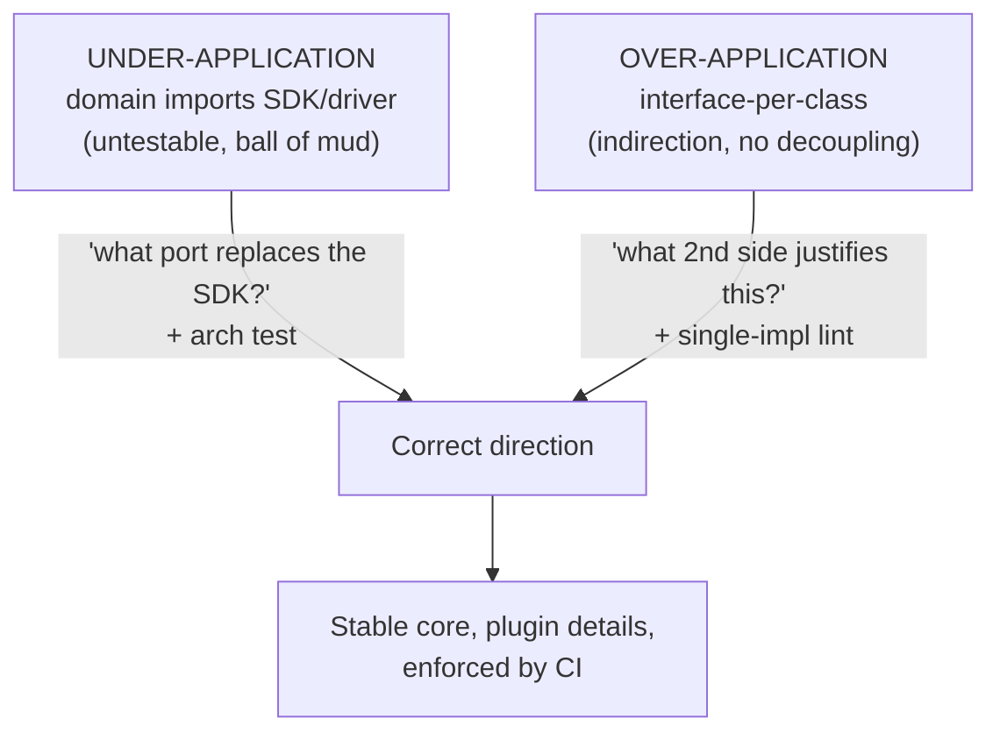
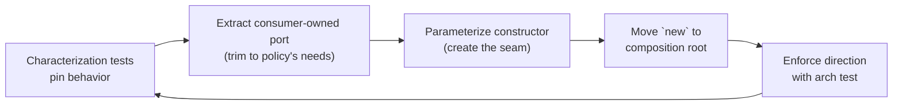

# Dependency Inversion Principle (DIP) — Professional

> **Category:** [Design Principles → SOLID](../../README.md) — the fifth principle: depend on abstractions, not on concrete details, and let the high-level policy own the abstraction.

> **Prerequisites:** [Junior](junior.md) · [Middle](middle.md) · [Senior](senior.md)
> **Focus:** **Production** — reviews, conventions, legacy refactoring, incidents

---

## Table of Contents

1. [Introduction](#introduction)
2. [Enforcing DIP in Code Review](#enforcing-dip-in-code-review)
3. [Team Conventions for DIP](#team-conventions-for-dip)
4. [Detecting Violations Mechanically](#detecting-violations-mechanically)
5. [Refactoring Legacy Code Toward DIP](#refactoring-legacy-code-toward-dip)
6. [Real Incidents](#real-incidents)
7. [The Politics of Abstraction](#the-politics-of-abstraction)
8. [Review Checklist](#review-checklist)
9. [Cheat Sheet](#cheat-sheet)
10. [Diagrams](#diagrams)
11. [Related Topics](#related-topics)

---

## Introduction

> Focus: **production** — keeping dependency direction correct across a large, multi-team codebase over years.

DIP fails in production in two opposite directions, and a professional must guard both. **Under-application:** business logic that imports the database driver, the HTTP client, and the cloud SDK directly — a core that can't be tested or deployed without its details and that rots into a big ball of mud where every layer knows every other. **Over-application:** interface-per-class dogma — a one-implementation interface in front of every concrete type, doubling navigation and edit cost while decoupling nothing.

The professional job is operational: keep source dependencies pointing the right way (toward stable abstractions, across the boundaries that matter) while refusing the speculative interfaces that masquerade as "good SOLID." That means review standards that catch *both* failure modes, conventions that make the correct dependency direction the default, mechanical detection that fails the build when the arrow points the wrong way, and a disciplined way to invert dependencies in legacy code that already points downward — without a rewrite.

---

## Enforcing DIP in Code Review

DIP is won or lost at the boundary commit. A reviewer checks three things, in order, and pushes back on *speculative abstraction* as hard as on *concrete coupling*.

### Review by question

1. **Does business/policy code import a volatile detail?** Grep the diff: does a domain/use-case class `import` a DB driver, HTTP client, SDK, or framework type? If yes, the dependency points the wrong way — it needs a port the policy owns.
2. **Who owns the new interface?** If the PR adds an interface, is it defined in the *consumer's* package or the *provider's*? A port defined in the infrastructure package and imported downward by the domain is **DIP theater** — it inverts nothing.
3. **Does this interface have (or will it ever have) a second side?** For every new interface ask: *is there a real second implementation, a needed test seam, or a genuine boundary?* If the honest answer is "no, but it's more flexible," it's a one-implementation header interface — remove it, depend on the concrete, extract the port when a reason appears.

### The two highest-value review questions

> **For a concrete dependency in policy code:** *"This use case imports `StripeClient` directly — what's the port it should depend on instead, and where does that port live?"*

> **For a new interface:** *"What is the second implementation, the test seam, or the boundary that justifies this interface? If there's one permanent implementation, let's use the concrete type."*

The first catches under-application; the second catches over-application. Asked routinely, non-confrontationally, they keep the dependency graph honest in both directions.

### Review comment templates

> "`OrderService` imports `software.amazon.awssdk.S3Client`. That welds the policy to S3 and makes it untestable. Let's have `OrderService` depend on a `FileStore` port it owns, and put the S3 code in an adapter that implements it."

> "This `IOrderMapper` interface has exactly one implementation, identical method set, no boundary. It's a header interface — doubles edit cost and decouples nothing. Use the concrete `OrderMapper`; we'll extract an interface if a second mapper or a test seam ever appears."

> "The `PaymentGateway` port returns a `StripeCharge`. That leaks a vendor type into the domain (clause 2). Let's return a domain `Receipt` so PayPal can implement the same port."

> "This interface lives in the `infra.persistence` package and the domain imports it — so the domain depends *down* on infra. Move the port into the domain package; infra should depend up on it."

> "You're calling `applicationContext.getBean(Repo.class)` inside the service — that's a service locator hiding a dependency. Inject `Repo` via the constructor instead."

---

## Team Conventions for DIP

Codify these so the right dependency direction is the default, not a per-PR argument:

1. **Dependency direction is a written rule.** "Source dependencies point inward, toward policy. Domain/use-case code imports no framework, driver, or SDK type." This gives reviewers a policy to cite, not a preference.
2. **Ports are owned by consumers.** New abstractions live in the package that *uses* them (domain/application), never in the infrastructure package. (Or in a dedicated `ports` module for shared ports — Separated Interface.)
3. **No one-implementation interfaces in new code.** Use the concrete type; extract a port when a second implementation, test seam, or boundary becomes real. (Document explicit exceptions: a port you ship for a not-yet-built adapter you're contractually committed to.)
4. **Ports speak the domain, not the vendor.** No `ResultSet`, `HttpResponse`, `StripeToken`, or ORM entity in a port's signature or return type.
5. **Constructor injection by default.** No service-locator / container-pull in business code; dependencies are declared in the signature.
6. **One composition root.** All concrete wiring lives in `main` / a single DI-config module; business code is abstraction-only.
7. **Architecture tests in CI** enforce the direction (next section) — the convention is checked by a machine, not just by reviewers.

---

## Detecting Violations Mechanically

DIP violations are unusually *machine-detectable* because they're statements about the import graph. Don't rely on review alone — fail the build.

| Tool | Language | Catches |
|---|---|---|
| **ArchUnit** | Java/Kotlin | "domain may not depend on infrastructure"; layer-direction rules |
| **ts-arch / dependency-cruiser** | TypeScript/JS | forbidden imports between layers; circular deps |
| **import-linter** | Python | layered/independence contracts on packages |
| **deptrac / phparkitect** | PHP | layer boundary rules |
| **go list / depguard** | Go | disallowed package imports |
| **NetArchTest / ArchUnitNET** | .NET | dependency-direction assertions |

A representative architecture test (ArchUnit) that encodes DIP at module scale:

```java
@AnalyzeClasses(packages = "com.app")
class DependencyDirectionTest {
    @ArchTest
    static final ArchRule domain_is_independent_of_infrastructure =
        noClasses().that().resideInAPackage("..domain..")
            .should().dependOnClassesThat().resideInAnyPackage(
                "..infra..", "..web..", "javax.persistence..",
                "software.amazon..", "com.stripe..");
    // The domain compiles and tests with NO knowledge of details. If a PR
    // makes a use case import a driver/SDK, this test fails the build.
}
```

This test is the *executable form* of DIP. It catches under-application (policy importing a detail) automatically. Over-application (header interfaces) is harder to detect mechanically — a complementary lint can flag *interfaces with exactly one implementor and an identical method set* as candidates for review, but treat it as a hint, not a hard gate (legitimate single-impl ports exist for not-yet-built adapters).

> The professional principle: **make the dependency direction a build-time invariant.** A diagram of "clean architecture" that isn't enforced by a test will be violated within weeks, one reasonable-looking import at a time.

---

## Refactoring Legacy Code Toward DIP

The realistic task: a `OrderService` that `new`s a `PostgresClient`, a `StripeClient`, and a `SmtpMailer` inside its methods, is untestable, and is in production. You invert it incrementally, test-guarded, never as a rewrite.

### The sequence

1. **Characterize first.** Wrap the existing behavior in tests that pin it *as-is* (even with the real dependencies, or via integration tests) so the refactor can't change behavior silently. You can't safely invert what you can't verify. (See [Refactoring as a Discipline](../../../craftsmanship-disciplines/03-refactoring-as-a-discipline/junior.md) and *Working Effectively with Legacy Code*.)

2. **Extract Interface from the concrete.** For each volatile detail, define a port **in the consumer's package**, shaped by *how the policy uses it* (not the full vendor API). The IDE "Extract Interface" refactoring does the mechanical part; you then trim the port to the methods the policy actually calls (an [ISP](../04-isp-interface-segregation/junior.md) pass) and rename the parameters/return types to domain terms.

3. **Parameterize from constructor (a.k.a. "Dependency-Breaking: Parameterize Constructor").** Replace the in-method `new PostgresClient()` with a constructor parameter typed as the port. This is the **seam-creation** step from Feathers' legacy techniques.

4. **Move construction to the composition root.** The `new PostgresClient()` calls migrate to `main`/DI config; the service now receives the adapter. The service is now unit-testable with a fake.

5. **Enforce the new direction with an architecture test** so the inversion can't regress.

```text
LEGACY                          AFTER INVERSION
class OrderService {            // domain owns the port
  void run() {                  interface OrderRepo { void save(Order o); }
    var db = new PgClient();    class OrderService {
    db.insert(...);              OrderService(OrderRepo repo) { this.repo = repo; }
  }                             void run() { repo.save(order); }   // no PgClient here
}                              }
                              // infra: class PgOrderRepo implements OrderRepo {...}
                              // main:  new OrderService(new PgOrderRepo(pgClient))
```

### What NOT to do in legacy inversion

- **Don't invert without a characterization test.** A "harmless" extract-interface that subtly changes a return type or null-handling is the classic refactor incident.
- **Don't copy the full vendor API into the port.** A port that mirrors every `StripeClient` method (so PayPal must implement Stripe-isms) re-leaks the detail. Shape the port to the *policy's* needs.
- **Don't replace concrete coupling with header-interface bloat.** Inverting `OrderService` doesn't mean every other class gets an interface too. Invert across the *volatile boundary*; leave internal pure logic concrete.
- **Don't big-bang it.** Invert one boundary per PR, behind tests, as you touch the code for feature work (Boy Scout Rule). A "make everything hexagonal" project is all risk and no incremental value.

---

## Real Incidents

### Incident 1: The cloud-SDK migration that touched 300 files

A team's domain code called the AWS S3 SDK directly wherever it needed file storage — "it's just storage, why abstract it?" A compliance requirement forced a move to an on-prem store. Because `s3Client.putObject(...)` calls were scattered through 300 domain files, the migration became a multi-month, high-risk rewrite touching business logic that had nothing to do with storage. **Root cause:** under-application of DIP at a volatile boundary (the storage vendor). **Fix going forward:** a `FileStore` port owned by the domain; S3 and the on-prem store as adapters; an ArchUnit test forbidding `software.amazon..` imports in `..domain..`. **Lesson:** a vendor SDK is a volatile detail across a boundary — exactly what DIP exists to invert. The port would have localized the migration to one adapter.

### Incident 2: The 400 header interfaces nobody could navigate

A team adopted "SOLID" by mandating an interface for every service and repository. Two years on: ~400 interfaces, each with exactly one implementation and an identical method set. Every code navigation went interface→impl→interface; every method addition edited two files; new hires couldn't find the *actual* code. Zero of the interfaces ever gained a second implementation. **Root cause:** over-application — interface-per-class dogma mistaken for DIP. **Fix:** a lint flagged single-impl/identical-signature interfaces; the team inlined the ones with no boundary and no test seam, keeping ports only at real boundaries (DB, payment, external APIs). Navigation and edit cost dropped sharply. **Lesson:** DIP is justified by a *real* second side or boundary, not by the presence of an interface keyword. Indirection without decoupling is pure cost.

### Incident 3: The container-pull that hid a missing dependency

A service fetched a collaborator via `applicationContext.getBean(FraudCheck.class)` deep inside a method instead of injecting it. A refactor removed the bean registration; the service compiled fine and only failed *at runtime in production*, on the fraud-check path, hours after deploy. **Root cause:** service-locator pattern (container-pull) hiding the dependency from the constructor signature and the compiler. **Fix:** constructor injection of `FraudCheck`; the missing wiring would have failed at context startup, before deploy. **Lesson:** DI *pushes* dependencies in and makes them visible; pulling them from a global/container reintroduces hidden dependencies and moves failures to runtime.

### Incident 4: The leaky port that defeated the swap

A team did invert payments behind a `PaymentGateway` port — but the port's `charge` method took a `StripePaymentMethod` and returned a `StripeCharge`. When they tried to add PayPal, the "abstraction" forced PayPal code to construct Stripe types. The port had inverted the *import* but leaked the *types* (clause-2 violation). **Fix:** re-shaped the port to domain types (`Card`, `Receipt`); both Stripe and PayPal adapters translated at their edges. **Lesson:** inverting the dependency isn't enough — the *data crossing the port* must be detail-free too, or you've moved the coupling into the types.

---

## The Politics of Abstraction

Sustaining correct dependency direction is partly social:

- **"Abstraction looks senior."** Adding interfaces *feels* like good engineering, so over-abstraction is rewarded and under-abstraction is invisible until the migration hits. Reframe: **the senior move is the right abstraction at the right boundary — and often that means deleting a speculative interface.**
- **"It's just a database / just storage."** Under-application is rationalized as pragmatism. Counter with the reversibility argument: a vendor SDK is a one-way-ish door; the port is cheap insurance against a costly migration. (See [Incident 1].)
- **DIP theater passes review.** A PR that adds an interface *looks* like it improved the design even when ownership is wrong (provider-owned) and nothing inverted. Arm reviewers with the ownership check and the architecture test so "there's an interface" isn't accepted as "the dependency is inverted."
- **Architecture diagrams lie without enforcement.** Every team has a clean-architecture diagram; few enforce it. Make the diagram an executable test, or it's fiction.

---

## Review Checklist

```text
DIP REVIEW CHECKLIST
[ ] DIRECTION — no domain/use-case code imports a driver/SDK/framework/HTTP type
[ ] OWNERSHIP — new ports live in the CONSUMER's package, not the provider's
[ ] SECOND SIDE — every new interface has a real 2nd impl / test seam / boundary
[ ] NO HEADER INTERFACE — reject 1-impl interfaces with identical method sets
[ ] CLAUSE 2 — ports speak DOMAIN types (no ResultSet/StripeToken/ORM entity)
[ ] INJECTION — constructor injection; NO container-pull / service-locator in policy
[ ] COMPOSITION ROOT — all concrete `new`/wiring is at main / DI config only
[ ] VOLATILITY — inverted deps target VOLATILE details across a boundary, not stdlib
[ ] ARCH TEST — the dependency direction is enforced by a CI architecture test
[ ] LEGACY — inversions are characterization-test-guarded, one boundary per PR
```

---

## Cheat Sheet

```text
ENFORCE   two questions:
  under-application → "what port should this policy depend on instead of the SDK?"
  over-application  → "what 2nd impl / test seam / boundary justifies this interface?"

VIOLATIONS (both directions)
  WRONG WAY:   domain imports driver/SDK/HTTP/framework → add a consumer-owned port
  THEATER:     interface owned by provider, imported downward → move it to consumer
  LEAKY PORT:  ResultSet/StripeToken/ORM entity in the signature → use domain types
  HEADER IF:   1 impl, identical method set, no boundary → inline to concrete
  LOCATOR:     container.getBean(X) in policy → constructor-inject instead

DETECT    ArchUnit / dependency-cruiser / import-linter — make the
          dependency direction a BUILD-TIME invariant, not a diagram.

LEGACY    characterize → extract consumer-owned port → parameterize ctor →
          move `new` to composition root → enforce with an arch test.
          One boundary per PR. Never big-bang. Never invert without tests.

VOLATILITY  invert toward STABLE abstractions across VOLATILE boundaries;
            stay concrete for stdlib/value types and lone internal logic.
```

---

## Diagrams

### Both failure modes, and the bar that stops each



### Legacy inversion, test-guarded



---

## Related Topics

- **SOLID interlock:** [OCP](../02-ocp-open-closed/junior.md), [ISP](../04-isp-interface-segregation/junior.md), [SOLID as a Whole](../06-solid-as-a-whole-and-smells/junior.md).
- **Control-flow inversion (distinct):** [Inversion of Control](../../02-coupling-and-cohesion/08-inversion-of-control/).
- **Legacy technique:** [Refactoring as a Discipline](../../../craftsmanship-disciplines/03-refactoring-as-a-discipline/junior.md).
- **Architecture scale & enforcement:** The Dependency Rule, Plugin Architecture and the DIP.
- **Tooling:** ArchUnit, dependency-cruiser, import-linter, deptrac, NetArchTest.

---


---

## Check your understanding

1. Explain Dependency Inversion Principle (DIP) — Professional Level in your own words and name the problem it solves.
2. How would you apply the ideas around Table of Contents, Introduction, Enforcing DIP in Code Review in a realistic engineering change?
3. What failure mode or misuse should you look for, and what evidence would reveal it?
4. How would you introduce and govern Dependency Inversion Principle (DIP) — Professional Level across teams through reversible, measurable increments?
5. What observable result would convince you that the approach improved the system?
