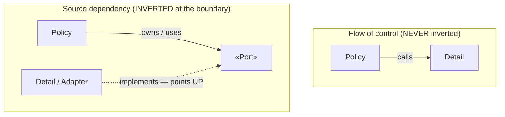
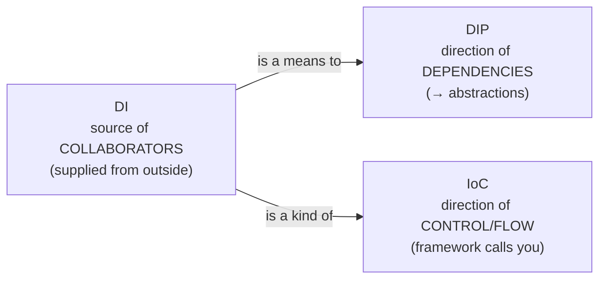

# Dependency Inversion Principle (DIP) — Senior

> **Category:** [Design Principles → SOLID](../../README.md) — the fifth principle: depend on abstractions, not on concrete details, and let the high-level policy own the abstraction.

> **Prerequisites:** [Junior](junior.md) · [Middle](middle.md)
> **Focus:** **Design trade-offs** and **system-level reasoning**

---

## Table of Contents

1. [Introduction](#introduction)
2. [The Precise Theory: Inverting the Compile-Time Graph](#the-precise-theory-inverting-the-compile-time-graph)
3. [DIP, DI, and IoC — The Airtight Distinction](#dip-di-and-ioc--the-airtight-distinction)
4. [Stable-Dependencies and the Volatility Heuristic](#stable-dependencies-and-the-volatility-heuristic)
5. [DIP and the Other SOLID Principles](#dip-and-the-other-solid-principles)
6. [The Over-Abstraction Failure Mode](#the-over-abstraction-failure-mode)
7. [Where to Put the Abstraction: Packaging Strategies](#where-to-put-the-abstraction-packaging-strategies)
8. [Advanced Examples](#advanced-examples)
9. [Liabilities](#liabilities)
10. [Pros & Cons at the System Level](#pros--cons-at-the-system-level)
11. [Diagrams](#diagrams)
12. [Related Topics](#related-topics)

---

## Introduction

> Focus: **design trade-offs** and **system-level reasoning**

At the senior level DIP stops being "inject an interface" and becomes a statement about **the shape of the source-dependency graph of an entire system** — and about which way that graph should point relative to volatility. A senior must be able to: prove *exactly* what gets inverted and what doesn't; defend the DIP/DI/IoC distinction under interview-grade pushback; decide *where* an abstraction physically lives so the inversion is real; and recognize when DIP has metastasized into an interface-per-class architecture that obscures more than it decouples.

This file covers four hard questions:

1. **What, precisely, is inverted — and against what?** (The compile-time dependency graph, against the flow of control.)
2. **How do DIP, DI, and IoC relate without collapsing into one another?**
3. **When is the missing abstraction correct, and when is the *present* abstraction the defect?**
4. **Where should the abstraction live** so the dependency actually inverts at module/package scale?

---

## The Precise Theory: Inverting the Compile-Time Graph

DIP is best understood as a claim about two *different* directed graphs over the same modules.

- **The runtime call graph (flow of control):** edge `A → B` means "A invokes B." This always points from high-level policy down to low-level mechanism, because policy *uses* mechanism. DIP does **not** touch this graph.
- **The compile-time dependency graph (source dependencies):** edge `A → B` means "the source of A must know about B to compile." Without DIP this graph *parallels* the call graph: policy imports mechanism. DIP **inverts the edges that cross a boundary** by inserting an abstraction the policy owns, so the mechanism's source edge points *up* toward the policy, against the flow of control.

> The inversion is the *decoupling of the compile-time graph from the runtime graph at chosen boundaries.* Before DIP they're parallel; after DIP, at the boundary, they point in opposite directions.

This is why DIP is the load-bearing principle of layered architecture. In a naive layered design, every layer's source depends downward (UI → business → persistence), so the business layer is forever coupled to persistence and can't be compiled, tested, or deployed without it. Apply DIP at the business/persistence boundary — business owns a repository *port*, persistence implements it — and the source dependency at that seam flips upward. Now business is the *independently deployable, independently testable* center, and persistence is a plugin. The runtime calls are unchanged; only the compile-time arrow moved. That single move is what makes Clean/Hexagonal architectures possible.

```text
Runtime (control)              Compile-time, no DIP        Compile-time, DIP
  Policy                         Policy                      Policy ──owns──► «Port»
    │ calls                        │ imports                                    ▲
    ▼                              ▼                                            │ implements
  Detail                         Detail                      Detail ────────────┘
(always high→low)            (parallels control)          (boundary edge INVERTED)
```

---

## DIP, DI, and IoC — The Airtight Distinction

This is the senior-grade clarification. The three concepts live on **three different axes**, and conflating them is the most common conceptual error in interviews and design discussions.

| Axis | **DIP** | **DI** | **IoC** |
|---|---|---|---|
| **Category** | Design *principle* (a property of source code) | Construction *technique* (how an object obtains collaborators) | Architectural *pattern* (who drives control flow) |
| **The question it answers** | Which way should compile-time dependencies point? | Where do an object's dependencies come from — built inside, or supplied outside? | Does my code call the framework, or does the framework call my code? |
| **The "inversion" it names** | Source dependency vs. flow of control | Control of *construction* (outside builds, not the object) | Control of *flow* (framework owns the main loop) |
| **Satisfied by** | Depending on an abstraction owned by the policy | Passing collaborators via ctor/setter/method | Frameworks, event loops, template methods, callbacks, DI containers |
| **Can exist alone** | Yes — achievable without DI or a container | Yes — you can inject *concretions* (DI, no DIP) | Yes — template-method frameworks use no DI |

### The relationships, stated precisely

1. **DI is *a* means to DIP, not *the* means, and not equivalent to it.**
   - DI without DIP: `new Service(new PostgresClient())` injects a *concretion* — the technique is DI, the principle DIP is **violated** (you depend on a detail).
   - DIP without classic DI: a Go function `func Copy(r Reader, w Writer)` depends on abstractions with no injection framework and arguably no "injection" ceremony — the *principle* holds via parameter passing.
   - So: **DIP is the goal (what you depend on); DI is one tactic to supply the abstraction.**

2. **DI is a *species* of IoC, but IoC is far broader.**
   - "Inverting control of *construction*" — an outside agent builds and hands you your dependencies — is one specific inversion of control. That's DI.
   - But IoC also covers control of *flow*: a web framework invoking your handler, an event loop calling your callback, a template method calling your overridden hook. None of those is DI. Fowler renamed "IoC" to "Dependency Injection" *specifically* for the construction sense, precisely because IoC was too broad a term to mean DI.

3. **None of the three is identical to another.** You can hold:
   - DIP + DI + IoC-container (Spring with interfaces) — the common modern stack.
   - DIP + DI + no container (hand-wired `main` with interfaces).
   - DI + no DIP (injected concretions).
   - IoC + no DI (extend a base controller / template method).
   - DIP + no DI (interface parameter, structural typing).

> The crispest formulation: **DIP is about the direction of *dependencies*; IoC is about the direction of *control/flow*; DI is the specific IoC mechanism that supplies dependencies from outside, and is the usual way to *achieve* DIP.** They co-occur so often that people fuse them — but a senior keeps the axes separate. IoC's own treatment lives at [Inversion of Control](../../02-coupling-and-cohesion/08-inversion-of-control/).

---

## Stable-Dependencies and the Volatility Heuristic

DIP says "depend on abstractions," but a literal reading ("never depend on a concrete class") is wrong and impractical — you depend on `String`, `int`, and `ArrayList` constantly. The senior refinement, from Uncle Bob, is **depend in the direction of stability, and invert only across volatility**:

> *Don't depend on volatile concrete things. Depend on stable things — and abstractions are stable.*

A dependency is worth inverting when the target is **volatile** — likely to change — *and* the dependency **crosses a boundary** you want to protect. Volatility is the trigger, not abstraction for its own sake.

| Target | Volatile? | Invert? |
|---|---|---|
| `String`, `LocalDate`, value objects | No (stable) | No — depend directly |
| Standard-library collections | No | No |
| A third-party payment SDK | Yes | **Yes** — own a `PaymentGateway` port |
| Your own persistence/database | Yes | **Yes** — own a repository port |
| A logging facade (SLF4J) | No (already a stable abstraction) | Already inverted — depend on it directly |
| A pure-function utility you own | No | No — it won't change under you |

This explains the apparent paradox of "depend on abstractions" coexisting with "don't wrap everything in an interface": you invert toward *stable abstractions* and away from *volatile details*. A stable concrete (a value type) needs no inversion; a volatile concrete across a boundary does. The Stable Abstractions Principle and Stable Dependencies Principle generalize this to components — see Component Coupling (ADP/SDP/SAP).

---

## DIP and the Other SOLID Principles

DIP is the principle the other four *converge on*; it's where SOLID's decoupling cashes out.

- **DIP enables [OCP](../02-ocp-open-closed/junior.md).** Open/Closed says "extend without modifying." The *mechanism* that lets you add a new behavior without editing the policy is an abstraction the policy depends on — which is exactly DIP. A new `PaymentGateway` implementation extends the system; the policy is closed against it. **OCP is the goal; DIP is the lever.**
- **DIP's abstractions should obey [ISP](../04-isp-interface-segregation/junior.md).** The ports you invert toward must be *small and client-shaped* — `Reader` and `Writer`, not a fat `Device` with twenty methods. A fat injected interface forces clients to depend on methods they don't use, re-coupling them. ISP keeps DIP's abstractions lean. (DIP says *invert*; ISP says *how to shape the thing you invert toward*.)
- **DIP relies on [LSP](../03-lsp-liskov-substitution/junior.md).** Injecting an implementation only works if every implementation is genuinely substitutable for the abstraction. An adapter that violates LSP (throws on a contract method, narrows behavior) breaks the policy that depends on the port. **DIP is only as sound as the substitutability of its implementations.**
- **DIP exposes [SRP](../01-srp-single-responsibility/junior.md) violations.** Over-injection (a constructor with ten dependencies) is DIP making an SRP failure visible. The remedy is splitting the class, not hiding the parameters.

The synthesis: **SRP/ISP shape the units, LSP guarantees their interchangeability, OCP is the protection you want, and DIP is the structural move — point source dependencies at owned abstractions — that delivers all of it.** (Full interlock at [SOLID as a Whole](../06-solid-as-a-whole-and-smells/junior.md).)

---

## The Over-Abstraction Failure Mode

DIP is the SOLID principle most often weaponized into harm. Pushed dogmatically, "depend on abstractions" becomes "every class gets an interface," producing the **interface-per-class** anti-architecture:

```text
IUserService ← UserService      IOrderService ← OrderService
IUserRepo    ← UserRepo         IEmailSender  ← EmailSender
(every interface has exactly ONE implementor, forever)
```

The symptoms and costs:

- **Indirection without decoupling.** An interface with one permanent implementation decouples nothing — it just inserts a hop. To read `UserService.register`, you jump to `IUserService`, find one implementor, jump back. Every navigation is doubled; nothing was made swappable.
- **The "header interface" smell.** `IUserService` whose method set is *identical* to `UserService` is not an abstraction — it's a duplicate of the class signature (Fowler's "header interface"). A true abstraction is *smaller and client-shaped* than its implementations.
- **Change amplification.** Adding a method now means editing two files (interface + impl) in lockstep — *more* coupling between them, not less.
- **False testability argument.** "I need the interface to mock it" is often a tell of over-mocking. If `UserService` is pure logic, test it directly; mock only at *real* boundaries (DB, network, clock). An interface created solely to enable a mock of your own pure code is usually a design smell pointing at a missing real seam.

The senior position: **DIP is justified by a real boundary or a real second implementation, not by a desire to "follow SOLID."** The decision rule is the volatility heuristic above. The wrong abstraction — a premature, speculative interface — carries the same cost here as anywhere: it's load-bearing indirection that obscures the code and resists removal. *Prefer a concrete dependency to a speculative interface;* extract the port the day a real second side or a real boundary appears. (This mirrors the simple-design stance: earn the SOLID structure through emergence, don't front-load it.)

> "Program to an interface, not an implementation" was advice about *seams with two real sides.* Read as "wrap every class in an interface," it manufactures the very complexity DIP exists to fight.

---

## Where to Put the Abstraction: Packaging Strategies

At class scale, "the policy owns the interface" is a packaging instruction. At module scale it becomes a real architectural choice with three common layouts:

1. **Abstraction in the consumer's package (classic DIP).** `OrderRepository` lives in the domain package; the infrastructure package depends on the domain to implement it. Cleanest inversion: the domain compiles standalone; infrastructure is a leaf plugin. This is the default for Hexagonal/Clean.

2. **Separate abstraction package ("Separated Interface," Fowler).** The port lives in its own module that *both* the policy and the adapter depend on. Used when you want neither the policy nor the adapter to depend on the other's package directly — common in larger systems and when multiple policies share a port. The dependency still inverts: both sides point at the neutral interface package.

3. **Abstraction in the provider's package (NON-inversion — usually wrong for DIP).** The interface ships with the implementation. This is *not* DIP — the consumer depends downward on the provider. It's acceptable only when the provider is a genuinely stable, published library whose interface is a real abstraction (e.g., SLF4J's API) — i.e., when there's nothing volatile to insulate against.

```text
(1) consumer-owned        (2) separated interface          (3) provider-owned (NOT DIP)
 domain.IRepo             ports.IRepo                        infra.IRepo
   ▲                       ▲        ▲                          ▲
   │ impl                  │ uses   │ impl                     │ imports
 infra.Repo            domain     infra.Repo                  domain
 (infra → domain)     (both → neutral ports)               (domain → infra: NOT inverted)
```

The senior judgement: use (1) by default; reach for (2) when several consumers share the port or when package-dependency hygiene forbids the adapter depending on the full domain; treat (3) as DIP *only* if the provider is a stable published abstraction.

---

## Advanced Examples

### Inverting across a boundary at *module* scale (Java packages)

```java
// ── package com.app.domain  (policy — compiles with NO knowledge of infra) ──
package com.app.domain;
public interface OrderRepository {            // port, OWNED by the domain
    Optional<Order> byId(OrderId id);
    void save(Order order);
}
public final class PlaceOrder {               // use case
    private final OrderRepository orders;
    public PlaceOrder(OrderRepository orders) { this.orders = orders; }
    public void handle(PlaceOrderCommand cmd) { /* ...uses orders... */ }
}

// ── package com.app.infra.jpa  (adapter — DEPENDS ON domain) ──
package com.app.infra.jpa;
import com.app.domain.OrderRepository;        // infra → domain (arrow points UP)
public final class JpaOrderRepository implements OrderRepository {
    public Optional<Order> byId(OrderId id) { /* JPA, returns DOMAIN Order */ }
    public void save(Order order)           { /* JPA */ }
}
// The infra package imports the domain; the domain imports NOTHING from infra.
// Delete com.app.infra.jpa and the domain still compiles. THAT is the inversion.
```

### DIP without a DI framework, leveraging structural typing (Go)

```go
// Policy owns the abstractions; no container, no annotations.
package billing

type Gateway interface{ Charge(c Card, amt Money) (Receipt, error) } // owned here
type Repo    interface{ Save(o Order) error }                        // owned here

type PlaceOrder struct{ gw Gateway; repo Repo }                      // depends on abstractions
func (p PlaceOrder) Run(o Order, c Card) error {
    if _, err := p.gw.Charge(c, o.Total); err != nil { return err }
    return p.repo.Save(o)
}

// package stripe — never imports billing's interface explicitly:
type Client struct{ /* ... */ }
func (Client) Charge(c billing.Card, amt billing.Money) (billing.Receipt, error) { /* ... */ }
// Client satisfies billing.Gateway STRUCTURALLY. Go lets the policy own the
// interface and the adapter satisfy it implicitly — DIP with zero ceremony,
// and the interface can be introduced LATER without touching Client.
```

### Distinguishing DI-without-DIP from DIP (TypeScript)

```typescript
// DI, but NOT DIP — injected a CONCRETION; policy still imports Postgres:
class ReportService {
  constructor(private db: PostgresPool) {}    // ← concrete type leaks in
}

// DIP — depend on an owned abstraction, then inject any implementation:
interface OrderQueries { topCustomers(n: number): Promise<Customer[]>; } // owned by policy
class ReportService {
  constructor(private queries: OrderQueries) {}  // abstraction
}
class PgOrderQueries implements OrderQueries { /* ... */ }   // adapter
// Same injection technique; only the SECOND depends on an abstraction → only it is DIP.
```

---

## Liabilities

### Liability 1: Interface-per-class architecture

The dominant DIP failure: one-implementation interfaces everywhere, doubling navigation and edit cost while decoupling nothing. The cure is the volatility heuristic — invert across *real* boundaries, stay concrete elsewhere.

### Liability 2: Leaky ports (clause-2 violations through types)

A port whose methods take/return vendor or persistence types (`ResultSet`, `StripeToken`, `JpaEntity`) drags the detail into the policy through the *data*, even though the method signature "looks" abstract. Keep the types crossing the port domain-pure.

### Liability 3: Misplaced ownership (no actual inversion)

Putting the interface in the provider's package and importing it downward is "DIP theater" — an interface that inverts nothing. Verify the consumer compiles without the provider.

### Liability 4: Service-locator / container-pull regression

Using `container.get(X)` inside business code reintroduces hidden dependencies and global coupling — a service locator wearing a container's clothes. Inject via constructor; never pull from the container in policy code.

### Liability 5: Mock-driven false seams

Creating an interface solely to mock your own pure logic produces over-mocked, brittle tests coupled to implementation. Test pure logic directly; reserve seams (and mocks) for real external boundaries.

---

## Pros & Cons at the System Level

| Dimension | DIP applied at real boundaries | No inversion / concrete deps | DIP over-applied (interface-per-class) |
|---|---|---|---|
| Core testability | High (fake the ports) | Low | High but often via false seams |
| Swappability of volatile details | High | Low | High in theory, unused in practice |
| Independent compile/deploy of core | Yes | No | Yes |
| Navigation/readability | Slight indirection at boundaries | Direct | Poor (every hop doubled) |
| Edit cost of adding a method | One port + impls | One class | Two files in lockstep, no benefit |
| Coupling to volatile details | None | Total | None (but at high indirection cost) |
| Best when | Volatile boundary or 2nd impl exists | Stable, single, internal dep | **Never** — it's the failure mode |

The table makes the senior stance precise: DIP wins decisively **at boundaries where a volatile detail meets stable policy, or where a second implementation/test seam is real.** It costs only indirection elsewhere, and that cost turns *negative* when applied to every lone concrete class. Invert at boundaries; stay concrete in the middle.

---

## Diagrams

### What inverts and what doesn't



### The three axes (don't conflate them)



---

## Related Topics

- **SOLID interlock:** [OCP](../02-ocp-open-closed/junior.md), [LSP](../03-lsp-liskov-substitution/junior.md), [ISP](../04-isp-interface-segregation/junior.md), [SOLID as a Whole](../06-solid-as-a-whole-and-smells/junior.md).
- **Control-flow inversion (distinct topic):** [Inversion of Control](../../02-coupling-and-cohesion/08-inversion-of-control/).
- **Coupling theory:** [Minimise Coupling](../../02-coupling-and-cohesion/01-minimise-coupling/), [Connascence](../../02-coupling-and-cohesion/03-connascence/).
- **Architecture scale:** The Dependency Rule, Plugin Architecture and the DIP, Component Coupling (ADP/SDP/SAP).

---


---

## Check your understanding

1. Explain Dependency Inversion Principle (DIP) — Senior Level in your own words and name the problem it solves.
2. How would you apply the ideas around Table of Contents, Introduction, The Precise Theory: Inverting the Compile-Time Graph in a realistic engineering change?
3. What failure mode or misuse should you look for, and what evidence would reveal it?
4. How would you validate a system-level decision about Dependency Inversion Principle (DIP) — Senior Level under uncertainty?
5. What observable result would convince you that the approach improved the system?
