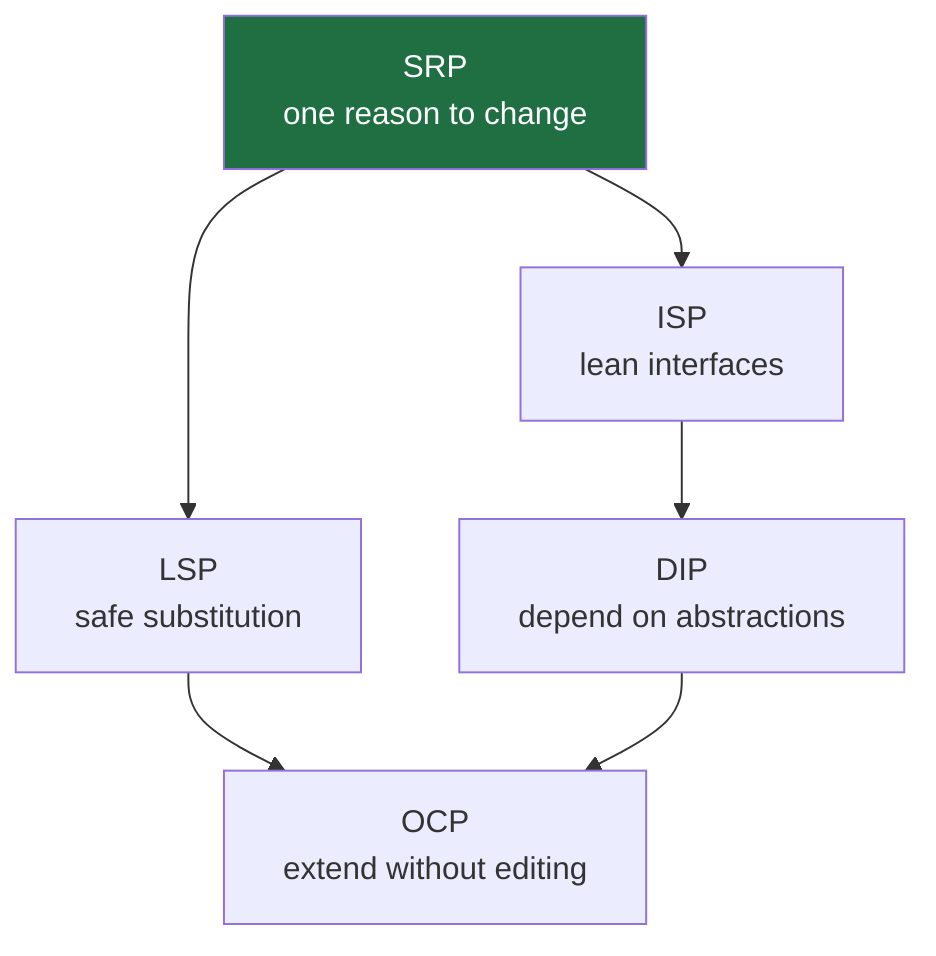
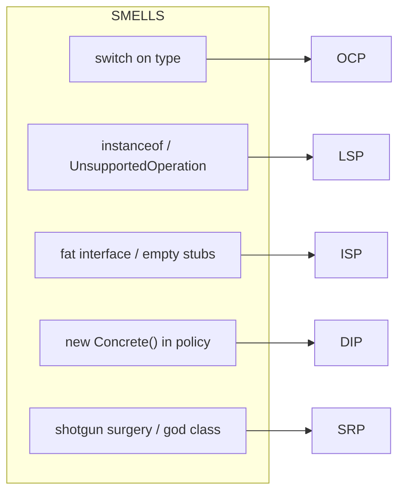
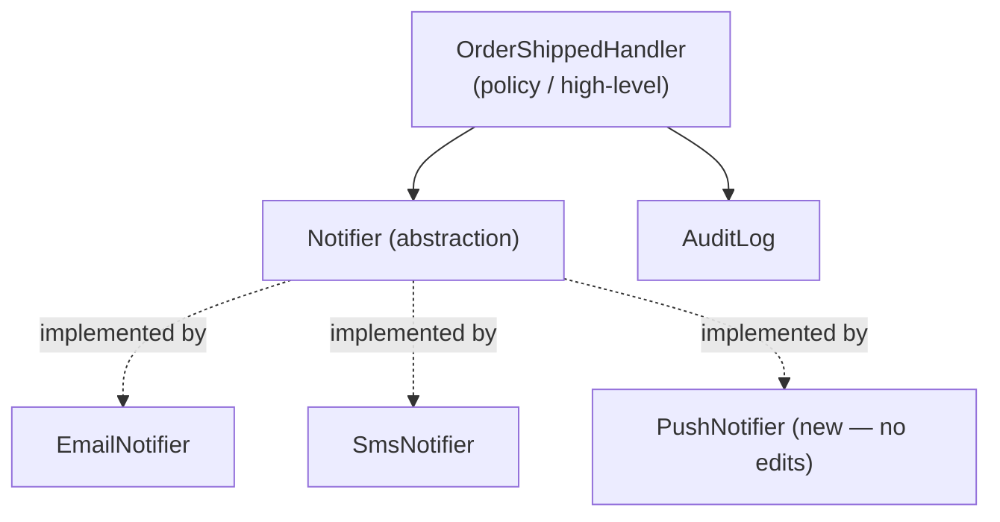
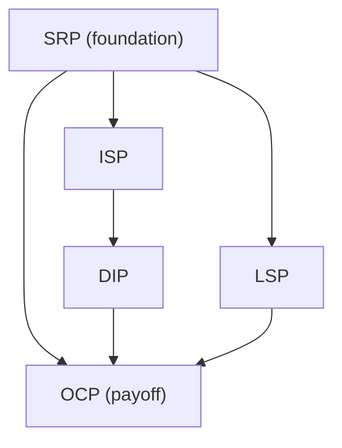
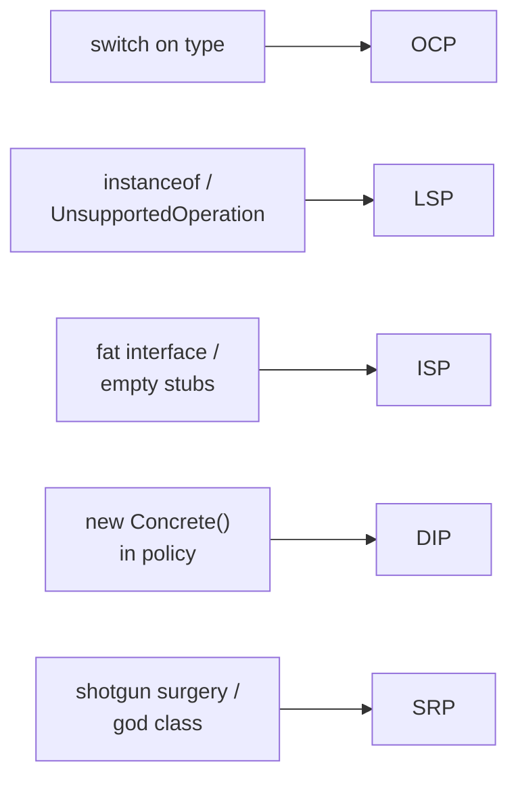

# SOLID as a Whole, and the Smells That Signal a Violation — Junior

> **Category:** [Design Principles → SOLID](../../README.md) — the five object-oriented design principles, seen as one system, plus the code smells that tell you a principle has been broken.

> **This is a synthesis topic, not a sixth principle.** It assumes you have met the five individually and now want to see how they fit together and how to *detect* a violation in real code.

---

## Table of Contents

1. [Introduction](#introduction)
2. [Prerequisites](#prerequisites)
3. [Glossary](#glossary)
4. [The Five at a Glance](#the-five-at-a-glance)
5. [How They Interlock](#how-they-interlock)
6. [Real-World Analogies](#real-world-analogies)
7. [Mental Models](#mental-models)
8. [The Smells That Signal a Violation](#the-smells-that-signal-a-violation)
9. [A Worked Example: One Module, All Five](#a-worked-example-one-module-all-five)
10. [Best Practices](#best-practices)
11. [Common Mistakes](#common-mistakes)
12. [Tricky Points](#tricky-points)
13. [Test Yourself](#test-yourself)
14. [Cheat Sheet](#cheat-sheet)
15. [Summary](#summary)
16. [Further Reading](#further-reading)
17. [Related Topics](#related-topics)
18. [Diagrams](#diagrams)

---

## Introduction

> Focus: **What is it?** and **How to use it?**

**SOLID** is an acronym for five object-oriented design principles that Robert C. Martin ("Uncle Bob") gathered and popularized around the turn of the 2000s. The five rules existed before the name; Michael Feathers suggested the memorable *ordering* of the initials that makes the word *SOLID*. They are:

> - **S** — **Single Responsibility Principle (SRP):** a class should have one, and only one, reason to change.
> - **O** — **Open/Closed Principle (OCP):** software should be open for extension but closed for modification.
> - **L** — **Liskov Substitution Principle (LSP):** subtypes must be substitutable for their base types.
> - **I** — **Interface Segregation Principle (ISP):** many small, client-specific interfaces beat one fat one.
> - **D** — **Dependency Inversion Principle (DIP):** depend on abstractions, not on concretions.

This topic does **not** re-teach the five — each has its own page (linked below). It teaches the two things you only see once you step back:

1. **The five are one system.** They are not five unrelated rules you check off; they reinforce each other and aim at a single goal — **code that tolerates change** without forcing edits to ripple across the codebase.
2. **Each principle has tell-tale smells.** You rarely catch a violation by reciting the definition. You catch it by recognizing a *smell* — a `switch` on a type, an `instanceof` check, a `throw new UnsupportedOperationException()`, a `new ConcreteService()` buried inside business logic — and knowing which principle it betrays. This page is, above all, **a catalog that maps smells to the principle they break.**

### Why this matters

Junior engineers tend to learn SOLID as five separate slogans and then struggle to apply any of them, because real code never announces "I am violating SRP." What it actually does is *smell*: a change to one feature breaks an unrelated one; a new payment type means editing a giant `if/else`; a subclass throws when you call a method the base type promised. Learning the smell-to-principle map turns SOLID from five abstract definitions into a **diagnostic skill you can use in code review tomorrow.**

---

## Prerequisites

- **Required:** You have met all five principles at least once. Read them first if not:
  [SRP](../01-srp-single-responsibility/), [OCP](../02-ocp-open-closed/), [LSP](../03-lsp-liskov-substitution/), [ISP](../04-isp-interface-segregation/), [DIP](../05-dip-dependency-inversion/).
- **Required:** Comfort with interfaces/abstract classes, inheritance, and polymorphism in at least one OO language.
- **Helpful:** A feel for [coupling and cohesion](../../02-coupling-and-cohesion/) — SOLID is, at bottom, a recipe for low coupling and high cohesion.
- **Helpful:** [KISS](../../01-generic/01-kiss/) and [YAGNI](../../01-generic/02-yagni/) — the counterweights that stop you from *over*-applying SOLID.

---

## Glossary

| Term | Definition |
|------|-----------|
| **SOLID** | Mnemonic for the five OO design principles (SRP, OCP, LSP, ISP, DIP). |
| **Abstraction** | A stable contract (interface, abstract class, protocol) that hides a varying implementation. |
| **Concretion** | A specific implementation class — the opposite of an abstraction. |
| **Smell** | A surface symptom in code that *suggests* a deeper design problem. Not a bug by itself. |
| **Seam** | A place where you can change behavior without editing existing code (e.g., an injected interface). |
| **Substitutability** | Whether an object of a subtype can stand in for the base type without surprising the caller (LSP). |
| **Refused bequest** | A subclass that inherits a method it doesn't want and disables or breaks it (an LSP/inheritance smell). |
| **Shotgun surgery** | One logical change forces edits in many scattered places (an SRP-related smell). |
| **Divergent change** | One module changes for many unrelated reasons (an SRP smell). |

---

## The Five at a Glance

Each principle below gets one paragraph and one memorable line. Follow the link for the full treatment.

### S — [Single Responsibility Principle](../01-srp-single-responsibility/)

A module should have exactly one *reason to change* — meaning one stakeholder or axis of change owns it. Martin's sharper phrasing: "gather together the things that change for the same reason; separate things that change for different reasons." A `Report` class that *computes* the figures, *formats* them as HTML, and *emails* them has three reasons to change (the accountant, the designer, the ops team) and should be three collaborators.

> **One class, one reason to change.**

### O — [Open/Closed Principle](../02-ocp-open-closed/)

You should be able to add new behavior by *adding* code, not by *editing* code that already works. The classic violation is a `switch (type)` that you must reopen every time a new type appears. The classic fix is polymorphism: new behavior arrives as a new class implementing an existing interface.

> **Add a class, don't edit a switch.**

### L — [Liskov Substitution Principle](../03-lsp-liskov-substitution/)

Anywhere the code expects a base type, *any* subtype must work without the caller knowing or caring which one it got. A `Square` that extends `Rectangle` but breaks `setWidth`/`setHeight` independence violates LSP; a subclass that throws `UnsupportedOperationException` for an inherited method violates LSP.

> **A subtype must keep every promise its base type made.**

### I — [Interface Segregation Principle](../04-isp-interface-segregation/)

No client should be forced to depend on methods it doesn't use. One fat `Machine` interface with `print`, `scan`, `fax`, `staple` forces a simple printer to implement (or stub) methods it can't do. Split it into role-sized interfaces — `Printer`, `Scanner` — so each client depends only on what it needs.

> **Many small interfaces beat one fat one.**

### D — [Dependency Inversion Principle](../05-dip-dependency-inversion/)

High-level policy (the *what*) must not depend on low-level detail (the *how*). Both should depend on an abstraction, and the detail should be wired in from outside (dependency injection). An order-processing class that does `new SmtpEmailSender()` inside itself is nailed to SMTP forever; depend on an `EmailSender` interface instead.

> **Depend on the interface; let the detail be plugged in.**

---

## How They Interlock

The single most important idea in this topic: **the five are not independent.** They form a small dependency web, and several of them only *work* because the others hold.

- **OCP usually needs DIP + LSP.** To be "closed for modification but open for extension," your stable code must call through an **abstraction** (that's DIP), and every new implementation plugged into that abstraction must be **safely substitutable** (that's LSP). An OCP seam built on an interface whose implementations violate LSP is a trap — the caller *thinks* it's extensible but new subtypes silently misbehave.
- **ISP supports DIP.** The abstraction you depend on (DIP) should be a *lean, client-specific* interface (ISP). Depending on a fat interface re-introduces the coupling DIP was trying to remove — you now depend on methods you don't use, so changes to them still affect you.
- **SRP underlies all of them.** A class with one responsibility is easy to give a clean interface (ISP), easy to substitute (LSP), easy to extend behind an abstraction (OCP), and easy to depend on through that abstraction (DIP). A class with three responsibilities resists every one of the other four.



Read the web like this: **SRP is the foundation; OCP is the payoff at the top; DIP and LSP are the two pillars OCP stands on; ISP makes DIP's abstraction the right size.** When people say "SOLID is one idea," this is the idea — *manage dependencies so that change is local.*

---

## Real-World Analogies

| Principle | Analogy |
|---|---|
| **SRP** | A restaurant separates chef, waiter, and cashier. One person doing all three is fragile — the moment any one role changes, the whole job is disrupted. |
| **OCP** | A power strip: you add a new appliance by plugging it in, not by rewiring the wall. The socket (interface) is closed; the set of appliances is open. |
| **LSP** | A rental-car contract: *any* car they give you must drive, brake, and steer the same way. A "car" that needs you to push it is not a valid substitute, even if it's parked in the car lot. |
| **ISP** | A TV remote with 60 buttons you never press vs. a clean remote with the 6 you use. The fat remote forces you to carry complexity you don't need. |
| **DIP** | A wall socket again: your laptop depends on the *socket standard*, not on a specific power plant. The plant (detail) can change without your laptop knowing. |
| **The whole system** | A building: SRP is rooms with single purposes; ISP is doors sized to their traffic; LSP is standard fittings; DIP is the socket/pipe standards; OCP is the ability to renovate one room without demolishing the house. |

---

## Mental Models

**Model 1 — SOLID is one goal seen from five angles.** All five exist to make *change cheap and local*. When you change one thing, you want to edit one place, and you want nothing else to break. SRP localizes the change; OCP lets you add instead of edit; DIP and ISP control who depends on whom; LSP guarantees the substitutes you plug in actually behave.

**Model 2 — Smells are the entry point, not the definitions.** You will almost never think "this violates ISP" from a blank slate. You will *see a smell* — a stub method that throws, a fat interface, a type-switch — and the smell tells you which principle to reach for.

```
   SEE A SMELL                  →  NAME THE PRINCIPLE   →  APPLY THE FIX
   ───────────────────────────     ──────────────────     ─────────────────────
   "change ripples everywhere"  →  SRP                  →  split responsibilities
   "switch on type to extend"   →  OCP                  →  polymorphism
   "subtype throws / misbehaves"→  LSP                  →  fix the hierarchy
   "fat interface, stub methods"→  ISP                  →  split the interface
   "new Concrete() in policy"   →  DIP                  →  inject an abstraction
```

**Model 3 — SOLID is a means, not the goal.** The goal is maintainable software. SOLID is heuristics that *usually* get you there. Over-applied — an interface for everything, a class per verb — it produces its own mess. Hold it alongside [KISS](../../01-generic/01-kiss/) and [YAGNI](../../01-generic/02-yagni/): apply the principle when a *real* smell or a *real* change demands it, not preemptively.

---

## The Smells That Signal a Violation

This is the heart of the topic. Robert Martin described how designs "rot" using four umbrella symptoms; underneath them sit concrete, recognizable smells that each point at a specific principle.

### Martin's four signs of a rotting design

> - **Rigidity** — the system is hard to change; every change forces a cascade of further changes.
> - **Fragility** — a change in one place breaks something unrelated and far away.
> - **Immobility** — you can't reuse a piece in another context because it drags too many dependencies with it.
> - **Viscosity** — doing the *right* thing (the clean change) is harder than doing the *wrong* hack, so the team takes the hack.

These four are the *experience* of bad design. The table below connects each concrete smell to the principle it breaks.

| Smell (what you see in the code) | Violated principle | Why |
|---|---|---|
| **Shotgun surgery** — one change edits many files | **SRP** | Responsibilities are scattered; one reason-to-change spans many places. |
| **Divergent change** — one class edited for many unrelated reasons | **SRP** | The class holds several responsibilities. |
| **God class / "and" in the class name** (`UserManagerAndMailer`) | **SRP** | More than one reason to change in one place. |
| **`switch`/`if-else` on a type code to pick behavior** | **OCP** | Adding a type means editing existing code, not adding a class. |
| **A class you must reopen for every new variant** | **OCP** | Not closed for modification. |
| **`instanceof` / type-checks before calling a method** | **LSP** | Callers must know the concrete type → substitution is broken. |
| **`throw new UnsupportedOperationException()` in an override** | **LSP** | The subtype refuses a promise the base type made. |
| **Refused bequest** — subclass empties/disables inherited methods | **LSP** | The subtype isn't truly an *is-a*. |
| **Override that strengthens preconditions / weakens postconditions** | **LSP** | The substitute surprises callers. |
| **Fat interface with many unrelated methods** | **ISP** | Clients depend on methods they never call. |
| **Empty / stubbed method implementations** (`scan() {}`) | **ISP** | The class was forced to implement what it can't do. |
| **`new ConcreteService()` inside high-level/business logic** | **DIP** | Policy is nailed to a detail; no seam to swap it. |
| **Hard-coded dependency** (a class instantiates its own DB/HTTP/SMTP client) | **DIP** | High-level depends on low-level concretion directly. |
| **Business logic that imports a framework/driver package** | **DIP** | The direction of dependency points the wrong way. |



The practical workflow is **smell → principle → fix**: you spot the smell first, name the principle it violates, then apply that principle's standard remedy. The rest of this page (and the higher levels) drills the map.

---

## A Worked Example: One Module, All Five

We'll evolve one small module — a **notification feature** that alerts a user after an order ships — and apply each principle *in turn* as a smell appears. This is the canonical "all five on one design" walk-through; the higher levels reuse the same module.

### Version 0 — the "it works" blob (violates everything)

```java
class OrderShippedHandler {
    void handle(Order order) {
        // 1. build the message
        String text = "Order " + order.id() + " shipped!";

        // 2. decide the channel by a type code   ← OCP smell (switch on type)
        if (order.user().channel().equals("email")) {
            SmtpClient smtp = new SmtpClient("mail.acme.com"); // ← DIP smell (new concrete)
            smtp.send(order.user().email(), text);
        } else if (order.user().channel().equals("sms")) {
            TwilioClient twilio = new TwilioClient(API_KEY);    // ← DIP smell again
            twilio.text(order.user().phone(), text);
        }

        // 3. also log it to the audit DB         ← SRP smell (second responsibility)
        new Database().insert("audit", "shipped " + order.id());
    }
}
```

This one class **builds** the message, **routes** it by a type code, **constructs** its own delivery clients, and **writes audit records**. It is rigid (a new channel means editing this method), fragile (changing the audit schema touches notification code), and immobile (you can't reuse the messaging part without dragging in the DB). Let's fix it principle by principle.

### Step 1 — SRP: one reason to change per class

The handler does message-building, delivery, *and* auditing. Split them.

```java
class ShipmentMessage {                 // reason to change: message wording
    String text(Order o) { return "Order " + o.id() + " shipped!"; }
}
class AuditLog {                        // reason to change: audit/compliance
    void record(String event) { /* ... */ }
}
// OrderShippedHandler now only orchestrates — it no longer *is* all three.
```

### Step 2 — DIP: depend on an abstraction, inject the detail

The handler still does `new SmtpClient(...)`. Invert it: depend on a `Notifier` interface and let the wiring be passed in.

```java
interface Notifier { void notify(User user, String text); }   // the abstraction

class OrderShippedHandler {
    private final Notifier notifier;
    private final AuditLog audit;
    OrderShippedHandler(Notifier notifier, AuditLog audit) {   // injected ← DIP satisfied
        this.notifier = notifier; this.audit = audit;
    }
}
```

### Step 3 — OCP: extend by adding a class, not editing a switch

The `if channel == "email" / "sms"` block is the OCP smell. Replace it with polymorphism — each channel is its own `Notifier`.

```java
class EmailNotifier implements Notifier {
    private final SmtpClient smtp;                  // injected, not new'd
    public void notify(User u, String text) { smtp.send(u.email(), text); }
}
class SmsNotifier implements Notifier {
    private final SmsGateway gateway;
    public void notify(User u, String text) { gateway.text(u.phone(), text); }
}
// Adding "push notifications" = add a PushNotifier class. No existing code is edited. ← OCP
```

### Step 4 — LSP: every Notifier must honor the same contract

Now that callers hold a `Notifier` and never check which one it is, **every implementation must actually deliver** when `notify` is called. A `NullNotifier` that silently does nothing, or a `FaxNotifier` that throws `UnsupportedOperationException`, would violate LSP — the caller would have to start doing `instanceof` checks, undoing OCP. The contract ("calling `notify` attempts delivery and throws only on a real delivery failure") must hold for *all* subtypes.

```java
// LSP-safe: a no-op channel is a CHOICE expressed honestly, not a broken promise.
class DisabledNotifier implements Notifier {
    public void notify(User u, String text) { /* intentionally no-op; documented */ }
}
// LSP-VIOLATING (don't do this):
class FaxNotifier implements Notifier {
    public void notify(User u, String text) {
        throw new UnsupportedOperationException("fax not supported");  // ← breaks substitution
    }
}
```

### Step 5 — ISP: keep the interface lean

`Notifier` has exactly one method, `notify`. That's already segregated. The ISP lesson appears if someone tries to *grow* it:

```java
// ISP smell creeping in — a fat interface:
interface Notifier {
    void notify(User u, String text);
    void registerDevice(Device d);   // only PushNotifier needs this
    boolean supportsRichMedia();      // only EmailNotifier cares
}
// Fix: keep Notifier lean; put device registration on a separate PushChannel interface
// so SmsNotifier and EmailNotifier aren't forced to stub methods they can't honor.
```

### The result



The handler now has **one reason to change** (SRP), depends only on **abstractions** that are **injected** (DIP), is **extended by adding classes** (OCP) whose implementations are **safely substitutable** (LSP), through an **interface that is lean** (ISP). Adding a push channel touches *zero* existing classes. That is what "SOLID as a whole" buys you.

---

## Best Practices

1. **Lead with the smell.** In review and in your own code, scan for the smells in the table first; let them point you to the principle.
2. **Treat OCP, DIP, LSP as a trio.** When you add an extension seam (OCP), make sure it's an abstraction (DIP) whose implementations are substitutable (LSP). They fail together.
3. **Inject dependencies; don't `new` them in policy.** A single `new ConcreteService()` inside business logic is the most common SOLID smell.
4. **Keep injected interfaces lean (ISP) so DIP actually decouples you.**
5. **Apply on demand, not preemptively.** Reach for the principle when a real change or a real smell appears — hold it against [YAGNI](../../01-generic/02-yagni/).
6. **Re-read the individual principle page** when a smell shows up; this page is the map, the sibling pages are the territory.

---

## Common Mistakes

1. **Memorizing five slogans, applying none.** Without the smell map, the definitions stay abstract. Learn the smell-to-principle table.
2. **Treating the five as independent.** Building an OCP seam while ignoring LSP gives you a fake extension point that breaks on the second implementation.
3. **Over-applying SOLID.** An interface per class, a factory for everything, a class per verb — this is the over-engineering [KISS](../../01-generic/01-kiss/) and [YAGNI](../../01-generic/02-yagni/) warn against. SOLID misapplied is its own smell.
4. **Confusing a smell with a bug.** A smell *suggests* a problem; it isn't automatically wrong. A `switch` over a *closed, stable* set of cases may be fine. Judgement, not reflex.
5. **Calling any big class an "SRP violation."** Size isn't the test — *number of reasons to change* is. A large class with one responsibility can be fine.
6. **Adding an abstraction with a single implementation "for DIP."** A one-implementation interface is usually speculative generality, not dependency inversion. Earn the seam when a second implementation (or a test double) is real.

---

## Tricky Points

- **`instanceof` isn't *always* an LSP violation.** It's a smell — a strong hint. Pattern-matching over a sealed/closed hierarchy (a deliberate sum type) can be legitimate. The violation is when callers *must* downcast to make polymorphism work that *should* have been polymorphic.
- **SRP's "responsibility" means "reason to change," not "task."** A class can do several small things that all change for the *same* reason and still satisfy SRP. Counting methods is the wrong test.
- **DIP is not just "use interfaces."** It's about the *direction* of dependency: high-level policy must not point at low-level detail. You can use interfaces and still violate DIP if the abstraction is owned by the detail layer.
- **OCP doesn't mean "never edit code."** It means design the *anticipated axis of variation* to be extensible. You cannot — and should not — make code closed against *every* possible change; that's over-engineering.
- **The four "rot" signs are symptoms, not principles.** Rigidity/fragility/immobility/viscosity are how bad design *feels*; the SOLID principles are the *cure* you apply once a smell localizes the cause.

---

## Test Yourself

1. Name the five principles the acronym SOLID stands for, in order.
2. Who assembled SOLID, and who suggested the ordering that spells the word?
3. Which two principles does OCP usually depend on to actually work, and why?
4. You see a `switch (shape.type())` choosing how to draw a shape. Which principle is smelled, and what's the fix?
5. A subclass overrides a method with `throw new UnsupportedOperationException()`. Which principle does this violate?
6. What is the difference between a *smell* and a *bug*?
7. Name Martin's four signs of a rotting design.

---

## Cheat Sheet

```text
SOLID — five principles, one goal: make change local and cheap
  S  Single Responsibility  one reason to change per class
  O  Open/Closed            extend by ADDING code, not editing it
  L  Liskov Substitution    a subtype must keep its base type's promises
  I  Interface Segregation  many small interfaces > one fat one
  D  Dependency Inversion   depend on abstractions; inject the detail

INTERLOCK
  SRP  → foundation for all four
  OCP  ← needs DIP (the seam) + LSP (safe substitutes)
  DIP  ← needs ISP (lean abstraction to depend on)

SMELL → PRINCIPLE
  shotgun surgery / divergent change / god class .... SRP
  switch-on-type / reopen-per-variant ............... OCP
  instanceof / UnsupportedOperationException / refused bequest .. LSP
  fat interface / empty stub methods ................ ISP
  new Concrete() in policy / hard-coded dependency .. DIP

ROT SIGNS (symptoms, not principles)
  Rigidity · Fragility · Immobility · Viscosity

COUNTERWEIGHT
  apply on a real smell/change — not preemptively (KISS, YAGNI)
```

---

## Summary

- **SOLID** = SRP, OCP, LSP, ISP, DIP — five OO principles assembled by **Robert C. Martin**, ordered into the word by **Michael Feathers**. This is a *synthesis* page, not a sixth principle.
- The five are **one system** aimed at making change **local and cheap**. **SRP** is the foundation; **OCP** is the payoff; **DIP + LSP** are the pillars OCP stands on; **ISP** keeps DIP's abstraction the right size.
- You apply SOLID by **recognizing smells**, not by reciting definitions: switch-on-type → OCP, `instanceof`/`UnsupportedOperationException` → LSP, fat interface/empty stubs → ISP, `new Concrete()` in policy → DIP, shotgun surgery/god class → SRP.
- Martin's four signs of a rotting design — **rigidity, fragility, immobility, viscosity** — are the symptoms; the principles are the cure.
- SOLID is a **means, not an end.** Over-applied it becomes over-engineering; balance it with [KISS](../../01-generic/01-kiss/) and [YAGNI](../../01-generic/02-yagni/).

---

## Further Reading

- Robert C. Martin, *Agile Software Development: Principles, Patterns, and Practices* — the origin of the SOLID write-ups and the "design rot" (rigidity/fragility/immobility/viscosity) framing.
- Robert C. Martin, *Clean Architecture* — SOLID at component scale.
- Robert C. Martin, "The Principles of OOD" (objectmentor / blog.cleancoder.com) — concise per-principle statements.
- Martin Fowler & Kent Beck, *Refactoring* — the smell catalog (shotgun surgery, divergent change, refused bequest) that this page maps to principles.
- The five sibling pages: [SRP](../01-srp-single-responsibility/) · [OCP](../02-ocp-open-closed/) · [LSP](../03-lsp-liskov-substitution/) · [ISP](../04-isp-interface-segregation/) · [DIP](../05-dip-dependency-inversion/).

---

## Related Topics

- **The five principles:** [SRP](../01-srp-single-responsibility/), [OCP](../02-ocp-open-closed/), [LSP](../03-lsp-liskov-substitution/), [ISP](../04-isp-interface-segregation/), [DIP](../05-dip-dependency-inversion/)
- **Underlying ideas:** [Coupling & Cohesion](../../02-coupling-and-cohesion/), [Connascence](../../02-coupling-and-cohesion/03-connascence/)
- **Counterweights:** [KISS](../../01-generic/01-kiss/), [YAGNI](../../01-generic/02-yagni/)
- **Smells in depth:** Clean Code → Emergence

---

## Diagrams

### The interlock web (who needs whom)



### Smell → principle map



---


---

## Check your understanding

1. Explain SOLID as a Whole, and the Smells That Signal a Violation — Junior Level in your own words and name the problem it solves.
2. How would you apply the ideas around Table of Contents, Introduction, Prerequisites in a realistic engineering change?
3. What failure mode or misuse should you look for, and what evidence would reveal it?
4. What small example would prove that you can apply SOLID as a Whole, and the Smells That Signal a Violation — Junior Level correctly?
5. What observable result would convince you that the approach improved the system?
