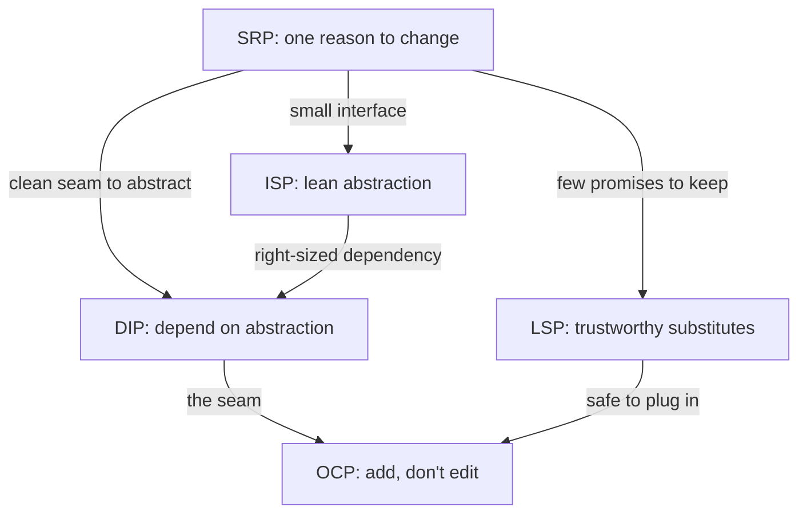
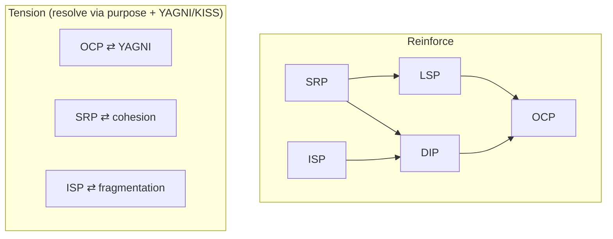
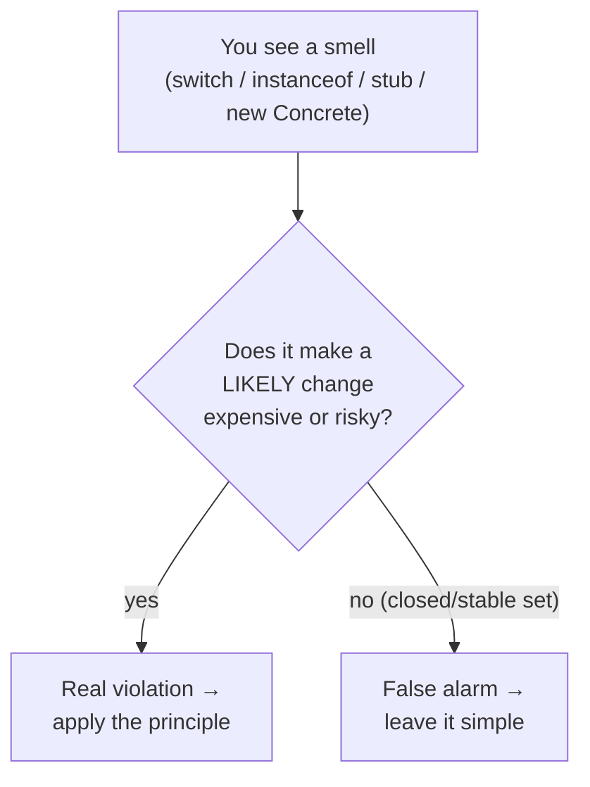

# SOLID as a Whole, and the Smells That Signal a Violation — Middle

> **Category:** [Design Principles → SOLID](../../README.md) — the five principles as one interacting system, and how to apply the whole set to real code.

> **Prerequisite:** [Junior](junior.md)
> **Focus:** **Why** and **When** — how the principles reinforce and tension each other, and how to apply the full set under real pressure.

---

## Table of Contents

1. [Introduction](#introduction)
2. [How the Principles Reinforce Each Other](#how-the-principles-reinforce-each-other)
3. [How the Principles Tension Each Other](#how-the-principles-tension-each-other)
4. [Applying the Full Set to Real Code](#applying-the-full-set-to-real-code)
5. [The Smell Catalog, Deepened](#the-smell-catalog-deepened)
6. [Trade-offs](#trade-offs)
7. [Edge Cases](#edge-cases)
8. [Tricky Points](#tricky-points)
9. [Best Practices](#best-practices)
10. [Test Yourself](#test-yourself)
11. [Summary](#summary)
12. [Diagrams](#diagrams)

---

## Introduction

> Focus: **Why** and **When**

At the junior level you learned the smell-to-principle map. At the middle level the question becomes *judgement*: when several principles point in different directions, which one wins? When does applying SRP create an ISP problem? When is a `switch` statement actually fine and OCP the over-reaction?

The central middle-level insight: **the five principles are not a checklist you satisfy independently — they are a tension system you balance.** Apply SRP too aggressively and you shatter a cohesive class into anemic fragments, each needing its own interface (now an ISP and DIP burden). Chase OCP everywhere and you drown in single-implementation abstractions (a YAGNI violation). The skill is reading which principle the *current* code and the *current* change actually need, and stopping there.

---

## How the Principles Reinforce Each Other

The junior interlock web showed the dependency structure. Here is *why* each link makes the others stronger, with the mechanism spelled out.

### SRP makes everything else achievable

A single-responsibility class is the precondition for the other four:

- It has a **small, coherent interface** — so ISP is satisfied almost for free.
- It is **easy to substitute** — fewer responsibilities means fewer promises to keep, so LSP holds more easily.
- It has **one axis of variation** — so the OCP seam (if you need one) is obvious and clean.
- It is **easy to depend on through an abstraction** — DIP works because there's one clear thing to abstract.

> A god class violates SRP *and* makes SOLID compliance impossible for the other four, because there's no clean seam to put an interface on. Fix SRP first; the rest get easier.

### OCP, DIP, and LSP are a single mechanism

These three describe one move from three angles:

- **DIP** says: *point the dependency at an abstraction.*
- **OCP** says: *now you can add a new implementation behind that abstraction without editing the caller.*
- **LSP** says: *and the caller can trust any implementation you plug in.*

Remove any one and the other two collapse. DIP without LSP gives you a seam whose implementations the caller can't trust (so it adds `instanceof` checks, killing OCP). OCP without DIP has nowhere to plug the extension in. They are best understood as **one capability — "extend behavior by adding a substitutable implementation behind an abstraction"** — that SOLID happens to name in three parts.

### ISP sharpens DIP

DIP says depend on an abstraction; ISP says make that abstraction *the right size*. A fat abstraction re-creates the coupling DIP tried to remove: depend on a 12-method interface and you're transitively coupled to all 12 methods' reasons to change, even if you call one. ISP trims the abstraction down to exactly what *this* client needs — completing DIP's decoupling.



---

## How the Principles Tension Each Other

Reinforcement is the happy story. The harder, more useful story is the **tensions** — the cases where pushing one principle works against another. Middle engineers earn their title by navigating these.

| Tension | What happens | Resolution heuristic |
|---|---|---|
| **SRP ⇄ "fewest classes"** | Splitting responsibilities multiplies classes; taken too far you get anemic fragments and navigation overhead. | Split on **real, distinct reasons to change** — not on every verb. If two "responsibilities" always change together, they're one. |
| **OCP ⇄ YAGNI** | Adding an abstraction "to be open for extension" before any second case exists = speculative generality. | Add the OCP seam when the **second variant is real** (or a test double needs it), not on the first. |
| **ISP ⇄ SRP-driven fragmentation** | Aggressive interface splitting can produce a swarm of one-method interfaces that obscure the design. | Segregate by **client role**, not by method count. One interface per *kind of caller*, not per method. |
| **DIP ⇄ simplicity** | Inverting every dependency adds indirection; a tiny script doesn't need a `Notifier` interface. | Invert dependencies that **cross a boundary you'll want to swap or test**; leave trivial, stable internals concrete. |
| **OCP ⇄ DRY / clarity** | An over-flexible plugin architecture for a closed, stable set of cases is harder to read than a plain `switch`. | If the set of variants is **genuinely closed and stable**, an explicit switch can beat a polymorphic maze. |

The meta-rule: **SOLID principles are heuristics, and heuristics conflict.** When they do, fall back to the *purpose* — making change cheap and local — and to the [KISS](../../01-generic/01-kiss/)/[YAGNI](../../01-generic/02-yagni/) counterweights. The principle that serves an actual, present need wins; the one serving a hypothetical loses.

---

## Applying the Full Set to Real Code

Let's take a more realistic module than the junior toy: a **payment-processing service** that charges an order and records the result. We'll diagnose the smells, then apply the whole set.

### The starting code (Python) — smells flagged

```python
class PaymentProcessor:
    def process(self, order):
        # validate
        if order.total <= 0:
            raise ValueError("bad total")

        # pick gateway by string code            ← OCP smell (switch on type)
        if order.method == "card":
            stripe = StripeClient(api_key=os.environ["STRIPE_KEY"])  # ← DIP smell
            resp = stripe.charge(order.card_token, order.total)
        elif order.method == "paypal":
            pp = PayPalClient(secret=os.environ["PP_SECRET"])        # ← DIP smell
            resp = pp.pay(order.paypal_id, order.total)
        else:
            raise ValueError("unknown method")

        # persist the receipt                     ← SRP smell (second responsibility)
        db = PostgresConnection()                                    # ← DIP smell
        db.execute("INSERT INTO receipts ...", resp.id, order.id)

        # email the customer                      ← SRP smell (third responsibility)
        SmtpClient().send(order.email, f"Paid: {resp.id}")          # ← DIP smell
        return resp
```

One method **validates, routes, charges, persists, and emails**, constructing four concrete clients along the way. Five smells, four principles. We refactor in the smell→principle order that keeps each step small.

### Step 1 — SRP: separate the reasons to change

```python
class PaymentProcessor:
    def __init__(self, gateway, receipts, notifier):
        self._gateway = gateway          # charging
        self._receipts = receipts        # persistence
        self._notifier = notifier        # customer comms

    def process(self, order):
        self._validate(order)
        result = self._gateway.charge(order)
        self._receipts.save(result, order)
        self._notifier.payment_succeeded(order, result)
        return result
```

`PaymentProcessor` now *orchestrates*; it no longer *is* the gateway, the database, and the mailer. Each of those is one reason to change, owned by one collaborator.

### Step 2 — DIP: the collaborators are abstractions, injected

```python
class PaymentGateway(Protocol):
    def charge(self, order) -> ChargeResult: ...
class ReceiptStore(Protocol):
    def save(self, result, order) -> None: ...
class CustomerNotifier(Protocol):
    def payment_succeeded(self, order, result) -> None: ...
```

`PaymentProcessor` depends only on these protocols and receives concrete implementations from outside (the composition root). High-level policy no longer points at Stripe, Postgres, or SMTP.

### Step 3 — OCP: new gateways are new classes

```python
class StripeGateway:
    def __init__(self, client): self._client = client
    def charge(self, order):
        r = self._client.charge(order.card_token, order.total)
        return ChargeResult(id=r.id, status=r.status)

class PayPalGateway:
    def __init__(self, client): self._client = client
    def charge(self, order):
        r = self._client.pay(order.paypal_id, order.total)
        return ChargeResult(id=r.id, status=r.status)

# Adding ApplePay = add ApplePayGateway. PaymentProcessor is untouched.  ← OCP
```

### Step 4 — LSP: every gateway honors the `charge` contract

The contract is: *`charge(order)` attempts payment and returns a `ChargeResult`, raising only on a genuine payment failure.* Every gateway must obey it. A gateway that returned `None` on success, or threw `NotImplementedError` for refunds it inherited, would force the processor to special-case it — breaking substitution and OCP. We keep the contract uniform and document it.

### Step 5 — ISP: don't fatten the gateway interface

Suppose refunds arrive. The temptation is to add `refund()` to `PaymentGateway`. But not every caller refunds, and not every gateway supports it identically. Segregate:

```python
class PaymentGateway(Protocol):
    def charge(self, order) -> ChargeResult: ...

class Refundable(Protocol):                 # separate role interface  ← ISP
    def refund(self, charge_id) -> RefundResult: ...
# A gateway that can refund implements BOTH; one that can't implements only PaymentGateway,
# instead of being forced to stub refund() with UnsupportedOperationException (which would
# also be an LSP violation).
```

Notice how **ISP and LSP cooperate here**: segregating `Refundable` out means no gateway is ever forced to stub a method it can't honor — which is exactly the situation that produces LSP-violating `UnsupportedOperationException` throws.

### The payoff

Adding Apple Pay touches zero existing classes. Swapping Postgres for DynamoDB means one new `ReceiptStore` implementation. Testing `PaymentProcessor` needs no real Stripe, DB, or SMTP — just in-memory fakes that satisfy the protocols. That testability is the *practical* reason DIP exists, and it's the clearest signal you applied the set correctly.

---

## The Smell Catalog, Deepened

The junior table mapped smells to principles. The middle skill is reading the smell *in context* — knowing when it's real and when it's a false alarm.

| Smell | Principle | When it's a **real** violation | When it's a **false alarm** |
|---|---|---|---|
| `switch`/`if` on a type code | OCP | The set of cases grows over time and each addition edits the switch | The set is **closed and stable** (e.g., the four suits in a deck); a switch is clearer than polymorphism |
| `instanceof` / downcast | LSP | Callers must check the concrete type to call the right behavior | Deliberate pattern-matching over a **sealed/sum type** (Kotlin `sealed`, Rust `enum`, `switch` over a closed hierarchy) |
| `throw new UnsupportedOperationException()` | LSP | A subtype refuses an inherited promise callers rely on | An interface method that is *contractually optional* and documented as such (rare; usually a design smell itself) |
| Fat interface | ISP | Different clients use disjoint subsets of the methods | One cohesive client genuinely uses all the methods together |
| Empty/stub method | ISP / LSP | The class can't honor the method but was forced to implement it | A legitimately empty hook with a documented default (e.g., a lifecycle callback) |
| `new ConcreteService()` in business logic | DIP | The concretion crosses a boundary you'll swap or test | The "concretion" is a trivial value object or a stable standard-library type (no need to abstract `new ArrayList()`) |
| Shotgun surgery | SRP | One conceptual change edits many files | The edits are genuinely independent changes that happened to land together |

> **The unifying test:** a smell is a real violation when it makes a *likely future change* expensive or risky. If the change it guards against will never happen (closed set, stable concretion), applying the principle is over-engineering. Smells are *priors*, not verdicts.

---

## Trade-offs

| You gain (applying SOLID) | You pay |
|---|---|
| Change becomes local — add a class instead of editing many | More classes/interfaces to navigate |
| Testability — inject fakes, no real I/O in unit tests | Indirection — "where does this actually run?" gets harder to trace |
| Reuse — modules drag fewer dependencies | Up-front design effort to find the right seams |
| Parallel work — teams own implementations behind shared abstractions | Risk of speculative abstractions that never pay off (YAGNI) |

The honest framing: **SOLID trades local simplicity for global flexibility.** That trade is worth it where change is likely and costly; it's a *loss* where the code is stable and small. The middle engineer applies it *selectively*, at the boundaries that actually move.

---

## Edge Cases

### 1. The legitimately closed set

A `switch` over the seven days of the week, or the four card suits, is not an OCP violation — the set will never grow. Forcing polymorphism here adds classes for no flexibility benefit. OCP guards *open* axes of variation; closed sets aren't one.

### 2. The single-implementation interface

An interface with one implementation is *usually* a YAGNI smell, not DIP done right. The exception: you need a **test double** *now*, or you're crossing a published boundary (a plugin API). A test seam is a present requirement, so the interface is justified — but say so explicitly.

### 3. SRP vs. cohesion

Splitting a class because it "has two methods" can *lower* cohesion if those methods share state and always change together. SRP is about *reasons to change*, which is a cohesion question — group what changes together (see [Maximise Cohesion](../../02-coupling-and-cohesion/02-maximise-cohesion/)). Over-splitting manufactures coupling between fragments that should have stayed one.

### 4. LSP in languages without inheritance

In Go (structural typing) or Rust (traits), there's no class inheritance, but LSP still applies to *interface/trait implementations*: any type satisfying an interface must honor the interface's contract. The "subtype" is "any implementer." `UnsupportedOperationException`-style violations become `panic("not implemented")` — same smell, same principle.

---

## Tricky Points

- **SOLID is not five things to "always do."** It's five lenses to *diagnose* a design when a change hurts. Applying all five preemptively to trivial code is the classic over-engineering trap.
- **The principles share a root: dependency management.** SRP, OCP, DIP, ISP are all about *who depends on whom and why*; LSP is about *whether a dependency's substitutes are trustworthy*. If you remember one thing: SOLID is about controlling the direction and trustworthiness of dependencies.
- **A clean OCP seam can hide an LSP bug.** Polymorphism makes the caller blind to which implementation it holds — which is the point, but it means an LSP-violating implementation fails *silently* at runtime instead of loudly at compile time. OCP raises the stakes on LSP.
- **ISP failures often masquerade as LSP failures.** The empty/throwing stub method is caused by a fat interface (ISP) but *manifests* as a broken substitute (LSP). Fix the interface (ISP) and the LSP symptom disappears.
- **"Depends on an interface" ≠ DIP.** If the interface lives in the low-level module and the high-level module imports *down* to get it, the dependency still points the wrong way. DIP requires the abstraction to be owned by (or at least point toward) the high-level policy.

---

## Best Practices

1. **Fix SRP first.** A single-responsibility class makes the other four tractable. Untangle responsibilities before adding interfaces.
2. **Treat OCP/DIP/LSP as one move.** When you add a seam, make it an abstraction (DIP) with a trustworthy contract (LSP) that you extend by adding (OCP).
3. **Segregate interfaces by client role, not by method count** (ISP). One interface per *kind of caller*.
4. **Earn abstractions; don't speculate them.** Add the seam when the second case or a test double is real — hold the line with [YAGNI](../../01-generic/02-yagni/).
5. **Read smells in context.** Ask "does this make a *likely* change expensive?" A smell over a closed/stable set is a false alarm.
6. **Use injectability as your check.** If you can unit-test the high-level class with fakes and no real I/O, your DIP/OCP/ISP are probably right.

---

## Test Yourself

1. Why is fixing SRP a precondition for cleanly applying the other four?
2. Explain why OCP, DIP, and LSP are "one move seen from three angles."
3. Give a tension between two SOLID principles and the heuristic that resolves it.
4. You see a `switch` statement. What single question decides whether it's an OCP violation?
5. How do ISP and LSP cooperate when you split a `Refundable` interface out of `PaymentGateway`?
6. Why does a clean OCP seam *raise the stakes* on LSP?

---

## Summary

- The five principles form a **tension system**, not an independent checklist. They reinforce each other (SRP enables all; OCP+DIP+LSP are one move; ISP sharpens DIP) and they conflict (OCP vs. YAGNI, SRP vs. cohesion, ISP vs. fragmentation).
- Applying the **full set** to real code follows the smell→principle order: untangle SRP, invert dependencies (DIP), make extension additive (OCP), keep substitutes trustworthy (LSP), keep interfaces lean (ISP). **Injectability/testability is the check that you got it right.**
- The **smell catalog** must be read *in context*: a smell is a real violation only when it makes a *likely* future change expensive. Over a closed, stable set, the same "smell" is a false alarm.
- The unifying root of SOLID is **dependency management** — controlling the direction and trustworthiness of dependencies so that change stays local.

---

## Diagrams

### Reinforce vs. tension



### Smell read in context



---


---

## Check your understanding

1. Explain SOLID as a Whole, and the Smells That Signal a Violation — Middle Level in your own words and name the problem it solves.
2. How would you apply the ideas around Table of Contents, Introduction, How the Principles Reinforce Each Other in a realistic engineering change?
3. What failure mode or misuse should you look for, and what evidence would reveal it?
4. Which local design trade-off would make you choose or reject SOLID as a Whole, and the Smells That Signal a Violation — Middle Level in an existing codebase?
5. What observable result would convince you that the approach improved the system?
