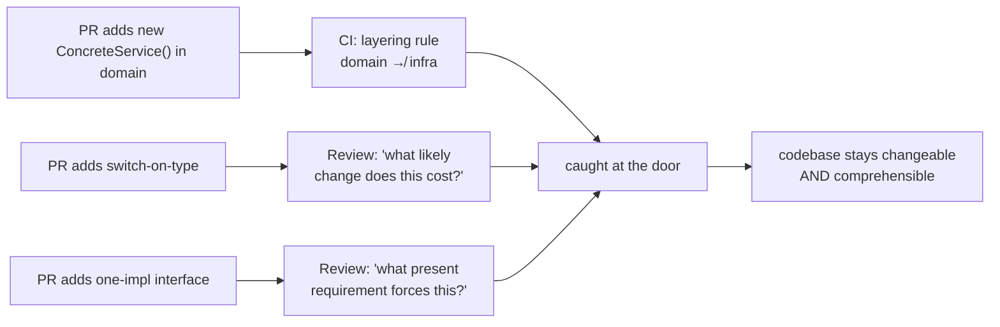
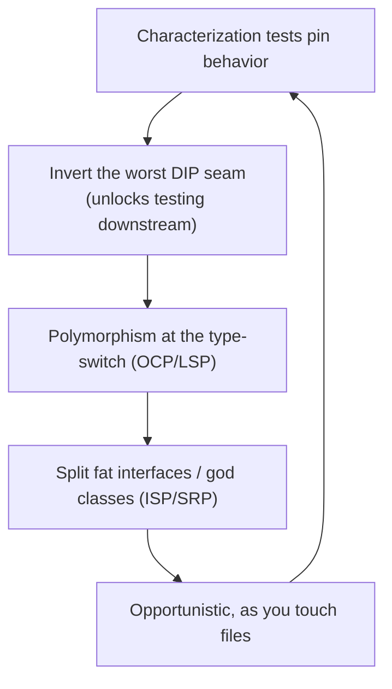

# SOLID as a Whole, and the Smells That Signal a Violation — Professional

> **Category:** [Design Principles → SOLID](../../README.md) — the production playbook: a unified smell catalog for code review, enforcement, real incidents, team adoption, and legacy refactoring.

> **Prerequisites:** [Junior](junior.md) · [Middle](middle.md) · [Senior](senior.md)
> **Focus:** **Production** — reviews, enforcement, team conventions, legacy systems at scale.

---

## Introduction

> Focus: **production** — keeping SOLID's *benefits* without its *dogma* across a large, multi-contributor codebase over years.

At the professional level the question is operational: **how do you get the maintainability SOLID promises across hundreds of weekly changes from dozens of engineers — without the codebase rotting into either spaghetti (no SOLID) or an interface-per-class maze (SOLID-as-dogma)?**

The answer is a system: a **smell catalog** the whole team shares (so violations are named, not argued), review standards that catch violations *and* over-application, automated gates that flag the mechanical smells, and a disciplined, test-guarded approach to clawing SOLID into legacy code. The professional's distinctive skill — built on the [senior critique](senior.md) — is enforcing SOLID *and* enforcing restraint, because in production over-engineering is as costly as under-engineering.

---

## The Unified Smell Catalog

This is the artifact to put on the team wiki. Every smell maps to the principle it violates, the standard fix, and — critically — the **false-alarm caveat** so reviewers don't trigger over-engineering by "fixing" smells that aren't real.

| # | Smell (what the reviewer sees) | Violates | Standard fix | False alarm when… |
|---|---|---|---|---|
| 1 | **Divergent change** — one class edited for many unrelated reasons | SRP | Split by reason-to-change | The reasons always change together (one responsibility) |
| 2 | **Shotgun surgery** — one change edits many files | SRP (scattered) | Consolidate the responsibility into one owner | Edits are genuinely independent changes |
| 3 | **God class / `XAndY` name / `Manager`/`Util`** | SRP | Extract collaborators | A thin, cohesive façade with one reason to change |
| 4 | **`switch`/`if` on a type code to select behavior** | OCP | Polymorphism (one class per case behind an interface) | The set of cases is **closed and stable** |
| 5 | **"Reopen this file for every new variant"** | OCP | Extension point (Strategy/registry) | Variation axis is genuinely fixed |
| 6 | **`instanceof` / downcast before calling a method** | LSP | Make the behavior polymorphic on the base type | Deliberate match over a **sealed/sum type** |
| 7 | **`throw new UnsupportedOperationException()` in an override** | LSP | Don't inherit the method; split the type/interface | Documented, contractually-optional method (rare) |
| 8 | **Refused bequest** — subclass empties inherited methods | LSP | Prefer composition; the *is-a* is false | — (almost always real) |
| 9 | **Override strengthens preconditions / weakens postconditions** | LSP | Restore the base contract | — |
| 10 | **Fat interface — clients use disjoint method subsets** | ISP | Split by client role | One cohesive client uses all methods together |
| 11 | **Empty / stub method implementations** | ISP (often → LSP) | Segregate the interface so no class is forced to stub | A genuine no-op hook with a documented default |
| 12 | **`new ConcreteService()` inside high-level/business logic** | DIP | Inject an abstraction from the composition root | Trivial value object / stable stdlib type |
| 13 | **Class instantiates its own DB/HTTP/SMTP/file client** | DIP | Depend on an injected port; wire detail at the edge | — |
| 14 | **Business/domain code imports a framework/driver package** | DIP | Invert: define the port in the domain, implement in the adapter | — |
| 15 | **One-implementation interface with one caller** | *over-application* (YAGNI) | **Inline the interface**; re-introduce at the 2nd impl | A real test double or published plugin boundary needs it |

> **Two columns matter equally.** Most teams enforce the "Violates/Fix" columns and forget the "False alarm" column — and so they *create* over-engineering by ritually splitting closed-set switches and abstracting stable concretions. The false-alarm column is what separates a SOLID-literate team from a cargo-cult one.

### Mapping to Martin's "design rot"

Reviewers should also recognize the *systemic* symptoms that mean several of these smells have accumulated:

| Rot sign | What it feels like | Likely underlying smells |
|---|---|---|
| **Rigidity** | "A one-line change took two days" | OCP (#4,#5), SRP (#1) |
| **Fragility** | "We changed X and Y broke" | SRP (#2), DIP (#12–14) |
| **Immobility** | "We can't reuse this without dragging half the app" | DIP (#12–14), ISP (#10) |
| **Viscosity** | "The hack is easier than the right fix" | accumulated #1–14; tooling/process friction |

---

## Enforcing SOLID in Code Review

Code review is where SOLID is won or lost, because both violations *and* over-applications enter one PR at a time. The reviewer's job is **bidirectional**: catch the missing seam *and* catch the speculative one.

### The two highest-value review questions

> **For a suspected violation:** "What *likely future change* does this code make expensive or risky?"
> **For a suspected over-application:** "What *present requirement* — a second implementation, or a real test double — forces this abstraction?"

The first question prevents under-engineering (you only apply a principle when a real change is at stake). The second prevents over-engineering (you only add an abstraction when there's a present need). Together they hold the team between the two failure modes the [senior critique](senior.md) identified.

### Review comment templates

> "This `switch (paymentType)` will be reopened every time we add a method — that's an OCP smell (#4). Could each method be a `PaymentGateway` implementation so adding Apple Pay is a new class, not an edit here?"

> "`OrderService.charge()` does `new StripeClient()` directly (DIP, #12). That nails us to Stripe and means this can't be unit-tested without a real API key. Inject a `PaymentGateway` and wire Stripe at the composition root."

> "`Bird.fly()` throwing `UnsupportedOperationException` for `Penguin` is an LSP violation (#7) — callers can't treat all `Bird`s uniformly. Suggest splitting `Flyer` out so only flying birds implement it (which also fixes the ISP issue)."

> "Heads up — `IEmailSender` has one implementation and one caller (#15). Unless there's a second sender or a test double coming, let's use `SmtpEmailSender` directly and extract the interface when we actually need it. Keeping it now is speculative (YAGNI)."

> "This split `AddressValidator` / `AddressNormalizer` / `AddressFormatter` — do they ever change independently? If they always change together, this is SRP-over-application; one cohesive `Address` type would be clearer."

### What good reviewers do *not* do

- Don't demand an interface for every class "for testability" — most classes are tested directly; abstract only across real boundaries.
- Don't reflexively reject every `switch` — ask first whether the set is closed.
- Don't let "but SOLID says" end the discussion. Cite the *concrete smell and the likely change*, not the acronym.

---

## Automated Enforcement

Some smells are mechanically detectable; lint them so reviewers spend their attention on judgement, not pattern-matching.

| Smell | Tooling that flags it |
|---|---|
| God class (size/method/field count) | SonarQube, PMD `ExcessivePublicCount`/`TooManyMethods`, Checkstyle |
| High coupling / cyclic dependencies between modules | ArchUnit (Java), `import-linter` (Python), `depcruise` (JS), `go-arch-lint` |
| `instanceof` chains / type-switch | SonarQube `S1872`/custom rules; many linters flag long `instanceof` ladders |
| Concrete instantiation across a layer boundary | **ArchUnit / import-linter layered-architecture rules** (domain must not import infra) — the most valuable DIP guard |
| Fat interface | Harder to automate; method-count thresholds are a weak proxy |
| Cognitive complexity (proxy for SRP/clarity) | SonarQube cognitive-complexity gate |

> **The single most valuable automated SOLID rule is a layering check** (ArchUnit / import-linter): *"domain packages may not depend on infrastructure packages."* It enforces DIP's *direction* at the boundary that matters and catches the `new ConcreteService()` / framework-import smells (#12–14) before review. Add it to CI first.

Caveats: automation catches **mechanical** smells (size, imports, type-switches) but **cannot** judge whether a `switch` is over a closed set, whether duplication is coincidental, or whether an interface is speculative. Those stay human. Never gate on a metric that rewards the wrong behavior (e.g., a cyclomatic gate that incentivizes method-shredding into unreadable fragments).

---

## Real Incidents

### Incident 1: The `instanceof` ladder that broke on every new type (LSP/OCP)

A pricing service held a `List<Discount>` and computed totals with a chain of `if (d instanceof PercentDiscount) … else if (d instanceof BuyOneGetOne) …`. Each new promotion meant editing the pricing loop (OCP, #4/#6) *and* every other place that switched on discount type (shotgun surgery, #2). A holiday "bundle" promotion was added; one of the four `instanceof` sites was missed; bundles priced at full cost for a weekend. **Fix:** `Discount` became an interface with `apply(Cart): Money`; each promotion an implementation (OCP + polymorphism), eliminating every `instanceof`. **Lesson:** `instanceof` ladders are duplicated knowledge about a type hierarchy — adding a type means finding *all* of them, and you will miss one.

### Incident 2: The domain that couldn't be tested or migrated (DIP)

An order module instantiated its Postgres connection and Stripe client directly inside domain methods (#12–14). Consequences compounded: unit tests required a live DB and Stripe sandbox (so they were slow and flaky and mostly didn't exist), and when a compliance rule forced a move to a different payment processor, the Stripe calls were entangled across 60 domain files. The migration took a quarter. **Fix:** introduced `PaymentGateway` and `OrderRepository` ports owned by the domain, with Stripe/Postgres adapters at the edge; added an ArchUnit rule banning `infrastructure` imports from `domain`. **Lesson:** DIP's payoff is testability *and* swappability; skipping it at a real boundary (a one-way door) is the costliest SOLID mistake.

### Incident 3: The interface-per-class maze (SOLID-as-dogma)

A team mandated "program to an interface" for *every* class. Two years in, the codebase had ~600 interfaces, ~580 of which had exactly one implementation and one caller. "Go to definition" always landed on an interface; understanding any call required a second jump to the impl. Onboarding engineers reported the indirection as the #1 comprehension barrier. **Fix:** a scripted audit removed single-implementation interfaces that had no test-double or plugin justification (~400 deleted); the rule changed to "extract an interface at the second implementation." **Lesson:** SOLID applied as law manufactures the complexity it was meant to remove. The "fewest elements" rule ([Simple Design](../../../craftsmanship-disciplines/04-simple-design/)) vetoes the speculative interface — enforce *that* too.

### Incident 4: The fat interface that forced lying stubs (ISP → LSP)

A `Device` interface had `print`, `scan`, `fax`, `staple`. The new label printer implemented all four, stubbing `scan`/`fax`/`staple` to `throw new UnsupportedOperationException()` (#11 → #7). A batch job that iterated `Device`s and called `scan()` crashed in production the first time a label printer was in the list. **Fix:** segregated `Printer`/`Scanner`/`Fax`/`Stapler`; the label printer implemented only `Printer`; the batch job's collection type became `List<Scanner>`, so a non-scanner couldn't be in it (the type system now prevents the crash). **Lesson:** a fat interface (ISP) forces classes to lie via stubs, and those lies surface as LSP runtime failures. Fix the interface and the substitution bug disappears.

---

## Team Adoption Without Dogma

The cultural challenge is teaching SOLID so the team gets its benefits *without* turning it into ritual. Codify these:

1. **Adopt the smell catalog, not the acronym.** Engineers learn faster from "we don't ship `instanceof` ladders or `new ConcreteService()` in the domain" than from abstract definitions. The catalog above is the shared language.
2. **Enforce the false-alarm column.** State explicitly: a `switch` over a closed set is fine; a one-impl interface is a YAGNI smell. This is what keeps adoption from becoming over-engineering.
3. **"Earn the abstraction" rule.** No interface without a second implementation or a present test-double/plugin need. Pairs with the [YAGNI](../../01-generic/02-yagni/) and [Simple Design](../../../craftsmanship-disciplines/04-simple-design/) policies.
4. **One layering rule in CI** (domain ↛ infrastructure). It's the highest-leverage automated guard and teaches DIP's direction by example.
5. **Celebrate deletions of speculative abstractions** as much as additions of needed ones. Flip the incentive: removing the unused `IFooFactory` is senior work, not "undoing" someone's design.
6. **Senior engineers model restraint.** If the staff engineer reaches for an interface by reflex, everyone does. Model "concrete first, abstract on the second case," and *explain why you didn't add the seam.*

> The reframe to drive: **SOLID is a set of OO heuristics for managing change, not a quality gate you maximize.** A codebase with *more* SOLID structure is not automatically better; the goal is changeable, comprehensible code — sometimes that means adding a seam, sometimes deleting one.

---

## Legacy Refactoring Strategy

Greenfield SOLID is easy. The reality is introducing it into a large, under-tested, in-production system. The approach is incremental, test-guarded, and opportunistic — never a rewrite.

### The sequence

1. **Characterize before you change.** You cannot safely refactor toward SRP/OCP without tests pinning current behavior (bugs included). Write characterization tests around the code you're about to touch. (See Working with Legacy Code and Feathers' *Working Effectively with Legacy Code*.)
2. **Break the worst DIP smell first — at a seam you need anyway.** The highest-value first move is usually inverting a hard-coded dependency you must touch for feature work (e.g., wrap the direct DB/HTTP call behind a port), because it *unlocks testing* for everything downstream. Use Feathers' seam techniques (Extract Interface, Parameterize Constructor).
3. **Then OCP/LSP at the type-switch.** Replace the `instanceof`/type-code `switch` that hurts most with polymorphism — but only where the variation axis is genuinely open.
4. **ISP/SRP opportunistically.** Split fat interfaces and god classes *as you touch them* (Boy Scout Rule), not in a big-bang "SOLID-ify the codebase" project (which never finishes and is all risk).
5. **Strangle over-engineered subsystems.** For a part that's SOLID-*over*-applied (interface maze), inline the speculative interfaces incrementally behind the existing surface rather than rewriting.

### What *not* to do

- **Don't SOLID-ify without tests.** A "harmless" extraction that shifts behavior is the classic legacy incident. The "passes all tests" floor is non-negotiable.
- **Don't replace under-engineering with over-engineering.** Introducing an interface-per-class maze "to be SOLID" is not progress. Aim for the *needed* seams, not the maximum.
- **Don't boil the ocean.** A standalone "make it SOLID" initiative with no feature value rarely survives a deadline. Tie every refactor to work already flowing through the code.

---

## Review Checklist

```text
SOLID REVIEW CHECKLIST (catch violations AND over-applications)

VIOLATIONS — does a likely change make this expensive/risky?
[ ] SRP  — does this class change for >1 unrelated reason? (#1) does one
           change edit many files? (#2)
[ ] OCP  — switch/if on a type code that grows over time? (#4,#5)
[ ] LSP  — instanceof/downcast to call behavior? (#6) override that throws
           UnsupportedOperationException / refuses a bequest? (#7,#8)
[ ] ISP  — fat interface whose clients use disjoint subsets? (#10) classes
           forced to stub methods? (#11)
[ ] DIP  — new ConcreteService() in business logic? (#12) class builds its own
           DB/HTTP/SMTP client? (#13) domain imports a framework? (#14)

OVER-APPLICATION — is there a PRESENT requirement for this abstraction?
[ ] one-implementation interface w/ one caller, no test-double need? (#15) → inline
[ ] switch over a CLOSED, stable set forced into polymorphism? → revert
[ ] cohesive class split into anemic fragments that change together? → merge
[ ] interface segregated into one-method soup obscuring the design? → consolidate

SYSTEMIC
[ ] domain ↛ infrastructure (DIP direction) — covered by CI layering rule?
[ ] no lower-rule fix (e.g. DRY) broke a higher value (clarity/correctness)?
```

---

## Cheat Sheet

```text
THE CATALOG (smell → principle → fix)
  divergent change / god class ............ SRP → split by reason-to-change
  switch-on-type / reopen-per-variant ..... OCP → polymorphism behind interface
  instanceof / UnsupportedOperation /
    refused bequest ....................... LSP → fix hierarchy / split type
  fat interface / forced stub methods ..... ISP → split by client role
  new Concrete() in policy / hard-coded
    DB·HTTP·SMTP / domain imports framework  DIP → inject port, wire at edge

TWO REVIEW QUESTIONS
  violation?       "what LIKELY change does this make expensive?"
  over-app?        "what PRESENT requirement forces this abstraction?"

AUTOMATE FIRST
  domain ↛ infrastructure  (ArchUnit / import-linter)  ← highest leverage
  cognitive-complexity gate (not cyclomatic-only)

LEGACY ORDER
  characterize → invert worst DIP seam (unlocks tests) → OCP/LSP at the
  type-switch → ISP/SRP opportunistically (Boy Scout) → strangle the maze

DON'T
  interface-per-class · abstract stable concretions · big-bang SOLID-ify ·
  refactor without tests · let "SOLID says" end a design argument
```

---

## Diagrams

### Where violations and over-applications enter — and where they're stopped



### Legacy SOLID-ification order



---

## Related Topics

- **The five principles:** [SRP](../01-srp-single-responsibility/), [OCP](../02-ocp-open-closed/), [LSP](../03-lsp-liskov-substitution/), [ISP](../04-isp-interface-segregation/), [DIP](../05-dip-dependency-inversion/)
- **Restraint:** [YAGNI](../../01-generic/02-yagni/), [KISS](../../01-generic/01-kiss/), [Simple Design](../../../craftsmanship-disciplines/04-simple-design/)
- **Legacy technique:** Working with Legacy Code
- **Tooling:** ArchUnit, import-linter, dependency-cruiser, SonarQube (cognitive complexity), PMD/Checkstyle.

---


---

## Check your understanding

1. Explain SOLID as a Whole, and the Smells That Signal a Violation — Professional Level in your own words and name the problem it solves.
2. How would you apply the ideas around Table of Contents, Introduction, The Unified Smell Catalog in a realistic engineering change?
3. What failure mode or misuse should you look for, and what evidence would reveal it?
4. How would you introduce and govern SOLID as a Whole, and the Smells That Signal a Violation — Professional Level across teams through reversible, measurable increments?
5. What observable result would convince you that the approach improved the system?
