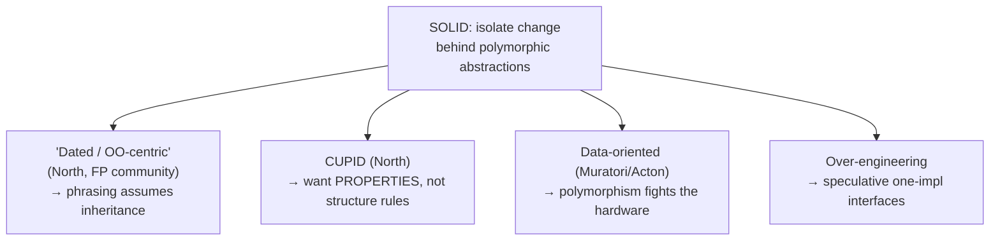
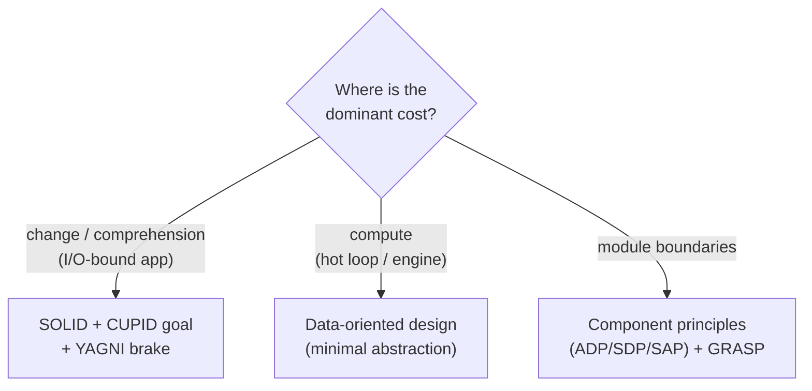

# SOLID as a Whole, and the Smells That Signal a Violation — Senior

> **Category:** [Design Principles → SOLID](../../README.md) — the honest critique: where SOLID came from, where it holds, where it's dated, and what to reach for instead.

> **Prerequisites:** [Junior](junior.md) · [Middle](middle.md)
> **Focus:** **Design trade-offs** and **system-level reasoning** — the intellectually honest case for *and against* SOLID.

---

## Table of Contents

1. [Introduction](#introduction)
2. [What SOLID Actually Optimizes For](#what-solid-actually-optimizes-for)
3. [The "SOLID Is Dated" Critique](#the-solid-is-dated-critique)
4. [Dan North's CUPID](#dan-norths-cupid)
5. [The Data-Oriented Counterpoint (Muratori)](#the-data-oriented-counterpoint-muratori)
6. [When SOLID Over-Engineers](#when-solid-over-engineers)
7. [SOLID in Functional vs. OO Code](#solid-in-functional-vs-oo-code)
8. [Alternatives and Complements: GRASP, Component Principles, Simple Design](#alternatives-and-complements-grasp-component-principles-simple-design)
9. [Liabilities](#liabilities)
10. [Pros & Cons at the System Level](#pros--cons-at-the-system-level)
11. [The Balanced Senior Position](#the-balanced-senior-position)
12. [Diagrams](#diagrams)
13. [Related Topics](#related-topics)

---

## Introduction

> Focus: **design trade-offs** and **system-level reasoning**

A junior recites SOLID; a middle engineer applies it with judgement; a **senior knows its boundaries** — what it optimizes for, what it costs, and the substantive, named critiques that have accumulated since Robert Martin assembled it. This file is deliberately *adversarial toward SOLID* in places, because the senior failure mode is dogma: applying the five principles as universal law, producing interface-per-class architectures that are *harder* to change than the duplication they replaced.

The honest position is not "SOLID is good" or "SOLID is dead." It's: **SOLID is a set of OO-specific heuristics that optimize for one thing — accommodating change behind polymorphic seams — and that goal is sometimes the wrong thing to optimize.** Knowing *when* is the senior skill. We'll name the critics and steelman each argument rather than strawman it.

---

## What SOLID Actually Optimizes For

Strip away the five names and SOLID has a single thesis: **isolate the parts of a system likely to change behind stable, polymorphic abstractions, so that change is additive and local.** Every principle serves that thesis — SRP localizes the change, DIP/ISP point dependencies at the right-sized abstraction, OCP makes the change additive, LSP keeps the substitutes trustworthy.

This is a *specific* optimization with specific assumptions baked in:

- **Assumption 1: change is the dominant cost.** SOLID trades simplicity and (often) performance for changeability. If your code is stable, you paid for flexibility you'll never use.
- **Assumption 2: the right unit of design is the class/interface.** SOLID is phrased in objects, inheritance, and polymorphism. Its remedies are *more types*. Codebases organized around data and functions rather than objects don't map cleanly onto it.
- **Assumption 3: runtime polymorphism is an acceptable price.** OCP's "add a class behind an interface" usually means a virtual call / interface dispatch. In OO business software that's free; in performance-critical or data-oriented code it is not.

Naming the assumptions is what lets you decide when SOLID applies. When all three hold (most line-of-business OO software), SOLID is excellent. When they don't, the critiques below bite.

---

## The "SOLID Is Dated" Critique

The most-cited modern critique is that SOLID is **OO-centric and a product of its era** (late-1990s/early-2000s enterprise Java/C++, deep inheritance hierarchies, design-pattern maximalism). The argument, made by Dan North, Brian Marick, parts of the functional community, and many practitioners, runs:

1. **It assumes inheritance-heavy OO.** LSP is explicitly about subtype/supertype substitution — a non-issue in code that prefers composition or has no inheritance. ISP and OCP are framed around interfaces-as-the-extension-mechanism.
2. **The acronym was reverse-engineered for memorability.** Michael Feathers arranged the initials to spell SOLID; the *ordering* carries no design meaning. Critics argue a mnemonic chosen for its word shape gets treated as if the order were a methodology.
3. **Each principle is individually vague enough to mean anything.** "One reason to change" (SRP) — whose reason, at what granularity? People argue endlessly because the principle under-specifies. North's sharpest jab: SOLID principles are "subjective and complicated to apply," which is why two competent engineers reach opposite conclusions from the same principle.
4. **Mechanically applied, it produces *worse* code** — `IFooFactory`, `AbstractFooManagerImpl`, an interface for every class — the "enterprise FizzBuzz" caricature. The principles meant to reduce complexity, ritually applied, *manufacture* it.

This critique is **partly right and partly a strawman of bad practitioners.** SOLID *is* OO-centric (point 1 is simply true). The acronym *is* a mnemonic, not an ordered method (point 2 is true). But points 3–4 indict *misapplication*, not the principles: every heuristic is "vague" and "produces bad code when applied mechanically." The senior takeaway: treat SOLID as *OO-specific heuristics requiring judgement*, not as universal law — and don't defend the strawman version the critics rightly mock.

---

## Dan North's CUPID

Dan North (who coined "BDD") proposed **CUPID** in 2021 as an explicit alternative framing — not five rules but five *properties* code can have, which he calls "joyful." His core objection: SOLID prescribes *structure* (split this, invert that), whereas what we actually want are *qualities*. CUPID describes the qualities directly:

> - **C — Composable:** plays well with others; small surface area, few dependencies, intention-revealing — easy to combine.
> - **U — Unix philosophy:** does one thing well (echoes SRP, but at the *component* level and about *purpose*, not "reasons to change").
> - **P — Predictable:** does what you expect; observable, deterministic, well-tested (subsumes the *intent* of LSP — no surprises — without the inheritance framing).
> - **I — Idiomatic:** feels natural in its language and codebase; low cognitive friction for the local team.
> - **D — Domain-based:** the code's structure and language mirror the problem domain, not technical layers.

### CUPID vs. SOLID, honestly

| | SOLID | CUPID |
|---|---|---|
| Nature | Rules about *structure* | Properties / *qualities* to aim at |
| Paradigm | OO-centric (inheritance, interfaces) | Paradigm-agnostic (works for FP, data-oriented) |
| Failure mode | Mechanical over-abstraction | Vaguer — harder to "check" in review |
| Phrasing of "no surprises" | LSP (inheritance) | Predictable (behavioral) |
| Phrasing of "one job" | SRP (reasons to change) | Unix philosophy (purpose) + Domain-based |

North's strongest point is **Predictable subsuming LSP**: what LSP is *really* protecting is "a substitute shouldn't surprise you," and you can say that without invoking subtype/supertype hierarchies at all — which matters because most modern code substitutes via composition, not inheritance. His weakest point (which he concedes) is **checkability**: SOLID's smells are concrete and reviewable (`switch`-on-type, stub methods); CUPID's "joyful" properties are harder to operationalize in a PR. The senior synthesis: **use SOLID's smells as the diagnostic, use CUPID's properties as the goal.** They're not enemies; SOLID is one *means* to CUPID's *ends*.

---

## The Data-Oriented Counterpoint (Muratori)

The sharpest *performance-grounded* critique comes from the data-oriented design (DOD) community — Mike Acton, and Casey Muratori's "Clean Code, Horrible Performance" being the most-discussed statement. The argument is not "SOLID is wrong" but "**SOLID's central mechanism — polymorphism behind abstractions — is actively hostile to how modern hardware works.**"

The DOD case:

1. **OCP/DIP's virtual dispatch defeats the CPU.** Replacing a `switch` with polymorphic classes (the textbook OCP fix) turns a predictable branch into an indirect call through a vtable — defeating branch prediction and instruction prefetch. Muratori's benchmark famously showed a "clean," polymorphic shape-area calculator running ~15× slower than a `switch`-based one doing the same arithmetic.
2. **Abstraction scatters data; hardware wants it contiguous.** SOLID encourages modeling each entity as an object with its own methods. DOD says: model the *data* and process it in tight, cache-friendly loops (structure-of-arrays over array-of-structures). "What is the data and how is it transformed?" beats "what objects are there and what are their responsibilities?"
3. **The abstraction you can't see through is the abstraction you can't optimize.** DIP's inversion hides the concrete type from the caller — which is the *point* for changeability and the *problem* for performance, because the compiler can't inline or vectorize across the seam.

### How seriously to take it

This critique is **correct within its domain and over-generalized outside it.** In a game inner loop, a physics engine, a codec, a database storage engine — DOD is right and SOLID's polymorphism is a real cost; the `switch` Muratori prefers is genuinely better there. In a CRUD web service spending 99% of its wall-clock in network and DB I/O, the vtable cost is *unmeasurable noise*, and SOLID's changeability is worth far more than nanoseconds you'll never spend. The senior error is **applying either dogma across the boundary** — bringing DOD's "no abstraction" to a sprawling business app (now unmaintainable), or bringing SOLID's interface-everything to a hot loop (now slow). *Match the design philosophy to where the cost actually is.*

> The reconciliation: SOLID optimizes **programmer time under change**; DOD optimizes **machine time under load**. They're answers to different questions. Profile to learn which cost dominates *your* code, then choose.

---

## When SOLID Over-Engineers

Beyond the named critiques, the everyday senior judgement is spotting when applying a SOLID principle *adds* complexity for no real return:

- **One-implementation interfaces (DIP/OCP misapplied).** `OrderService` → `IOrderService` with one impl and one caller. This is speculative generality, not dependency inversion. It adds a file, an indirection, and a "go-to-definition lands on an interface" tax — for a flexibility nobody needs. Earn the interface at the *second* implementation or a *real* test-double need.
- **SRP shattered into anemic fragments.** Splitting a cohesive 80-line class into six 15-line classes that always change together *lowers* cohesion and raises navigation cost. SRP is about *reasons to change*, not line count; over-splitting manufactures coupling between the fragments.
- **OCP against a closed set.** Building a plugin/strategy architecture for the four card suits or seven weekdays. The set will never grow; the `switch` is clearer and faster. OCP guards *open* axes of variation only.
- **ISP into one-method-interface soup.** Segregating until every interface has exactly one method can obscure the design as badly as a fat interface — now the *relationships* between roles are invisible. Segregate by client role, not to a method-count target.

The tell is always the same: **an abstraction with no second case behind it, justified by "flexibility" or "future-proofing" rather than a present requirement.** That's the [YAGNI](../../01-generic/02-yagni/) violation SOLID is most often used to rationalize. [KISS](../../01-generic/01-kiss/) and Kent Beck's [Simple Design](../../../craftsmanship-disciplines/04-simple-design/) rules are the explicit counterweight: *fewest elements* is a rule too, and a speculative interface fails it.

---

## SOLID in Functional vs. OO Code

A senior must know how the five translate (or dissolve) outside class-based OO:

| Principle | In OO | In FP / data-oriented |
|---|---|---|
| **SRP** | One reason to change per *class* | One reason to change per *function/module*; pure functions are SRP by default (one input→output transform). Survives intact. |
| **OCP** | Add a subclass behind an interface | Add a case to a sum type + a function clause; or pass a function (higher-order functions *are* the extension mechanism). Reframed, not gone. |
| **LSP** | Subtype substitutability | Becomes **parametricity / honoring a typeclass or trait contract** — any implementation of `Ord`/`Monoid` must obey its laws. "Predictable" (CUPID) captures it better than "Liskov." |
| **ISP** | Split fat interfaces | Pass exactly the functions/capabilities a caller needs; small typeclasses over god-typeclasses. Survives as "narrow your function's inputs." |
| **DIP** | Inject an interface | Pass functions as arguments (the function *is* the abstraction); effects at the edges. DIP becomes "parameterize over behavior," which FP does natively. |

The pattern: **SRP and ISP survive almost unchanged; OCP and DIP reduce to "use higher-order functions"; LSP is better re-expressed as "obey the contract/law" (i.e., Predictable).** This is itself evidence for the "OO-centric" critique — LSP is the principle that needs the most translation, precisely because subtype substitution is an OO-specific concern. In a codebase that's mostly pure functions and sum types, you rarely *say* "SOLID" — but the underlying goals (one job, narrow inputs, no surprises, parameterize over behavior) are all still there, wearing functional clothes.

---

## Alternatives and Complements: GRASP, Component Principles, Simple Design

SOLID is not the only catalog, and at the senior level you draw on several:

### GRASP (Larman)

**General Responsibility Assignment Software Patterns** answer a question SOLID barely addresses: *which class should own a given responsibility?* Its nine patterns — Information Expert, Creator, Controller, Low Coupling, High Cohesion, Polymorphism, Pure Fabrication, Indirection, Protected Variations — are more about **assigning** responsibilities than constraining their shape. **Protected Variations** is essentially OCP generalized ("identify points of predicted variation and create a stable interface around them"); **Information Expert** and **Creator** give you SRP-compatible *placement* rules SOLID lacks. GRASP and SOLID are complementary: GRASP says *where to put responsibility*, SOLID says *how to shape the dependencies once it's placed*.

### Component / package principles (Martin's own "other" principles)

Often forgotten: Robert Martin wrote a *second* set for the **component/package scale** — the cohesion principles (REP: Reuse-Release Equivalence, CCP: Common Closure, CRP: Common Reuse) and the coupling principles (ADP: Acyclic Dependencies, SDP: Stable Dependencies, SAP: Stable Abstractions). SOLID is the *class*-scale story; these are the *module*-scale story. A senior designing a system needs both — SOLID alone won't tell you how to draw component boundaries or which way the dependency arrows should point between packages. (See Clean Architecture for the component principles in depth.)

### Simple Design (Beck) and the generic principles

Kent Beck's four [Simple Design](../../../craftsmanship-disciplines/04-simple-design/) rules — *passes tests, reveals intent, no duplication, fewest elements* — are the **antidote to SOLID over-application**. "Fewest elements" directly vetoes the speculative interface. Together with [KISS](../../01-generic/01-kiss/) and [YAGNI](../../01-generic/02-yagni/), they form the restraint that keeps SOLID from metastasizing. The mature stance: **reach SOLID structure by refactoring toward it when a real change demands it (emergent), not by front-loading every abstraction the principles could justify.**

---

## Liabilities

### Liability 1: Dogma produces interface-per-class architectures

Applied as law, SOLID generates a one-to-one interface-to-class mapping, factories for trivial construction, and indirection that makes the codebase *harder* to read and navigate than the duplication it replaced. The principles meant to manage complexity become a source of it. **Audit every abstraction for a present second case.**

### Liability 2: It's silent on performance

SOLID has no opinion on cache locality, allocation, or dispatch cost. In performance-critical code its central mechanism (polymorphism behind abstractions) is a liability the principles won't warn you about. **You** must know where the hot path is and exempt it.

### Liability 3: Under-specification breeds dogmatic argument

"One reason to change" and "depend on abstractions" are vague enough that teams argue in circles, each citing SOLID for opposite conclusions. The principles don't adjudicate; *reversibility, present-requirement, and profiling* do. Don't let "but SOLID says" end a design discussion — it never settles anything by itself.

### Liability 4: It crowds out the other scales

Teams that internalize SOLID often *stop there*, neglecting the component-scale principles (acyclic dependencies, stable abstractions) and the data-oriented questions. SOLID is the *class* scale only. A system designed with SOLID and nothing else can still have a tangled dependency graph between its modules.

---

## Pros & Cons at the System Level

| Dimension | SOLID applied with judgement | SOLID applied as dogma | Data-oriented / minimal-abstraction |
|---|---|---|---|
| Changeability of business logic | **High** | High but buried in indirection | Lower (change touches more) |
| Readability / navigability | Good | **Poor** (interface maze) | Good (flat, explicit) |
| Testability | **High** (inject fakes) | High | Lower (harder to isolate) |
| Runtime performance | Fine for I/O-bound | Fine for I/O-bound | **High** (cache/dispatch-friendly) |
| Fit for hot loops / engines | Poor | Poor | **Excellent** |
| Cognitive load (small codebase) | Low–medium | **High** | Low |
| Risk of speculative abstraction | Low | **High** | Very low |

The table makes the senior position concrete: **SOLID-with-judgement wins for changeable, I/O-bound business software; data-oriented wins for performance-critical inner loops; SOLID-as-dogma wins nowhere.** Choose by where the dominant cost lives.

---

## The Balanced Senior Position

Putting the critics and the defenders together:

1. **SOLID is a strong default for OO business software** where change is the dominant cost and I/O dominates runtime. There, its trade (simplicity/perf for changeability) is the right trade.
2. **It is OO-centric** (the critics are right). In FP/data-oriented code, its goals survive but its *phrasing* doesn't — translate to "one job, narrow inputs, no surprises, parameterize over behavior."
3. **Its mechanism (polymorphism) has a real performance cost** (Muratori is right) — exempt hot paths; profile before abstracting performance-sensitive code.
4. **Mechanical application is the failure mode** the critics rightly mock. Use the *smells* as your diagnostic (they're concrete and reviewable); use **CUPID's properties** and **Simple Design's "fewest elements"** as the goal and the brake.
5. **Complement it with the other scales** — GRASP for responsibility placement, the component principles for module boundaries, Simple Design/KISS/YAGNI for restraint.

> The senior doesn't ask "is this SOLID?" They ask "where does the cost in this code actually live — change, comprehension, or compute? — and which heuristics serve *that* cost?" SOLID is one answer in the toolbox, not the toolbox.

---

## Diagrams

### What each critique targets

### Choose by where the cost lives

---

## Related Topics

- **The five principles:** [SRP](../01-srp-single-responsibility/), [OCP](../02-ocp-open-closed/), [LSP](../03-lsp-liskov-substitution/), [ISP](../04-isp-interface-segregation/), [DIP](../05-dip-dependency-inversion/)
- **Counterweights:** [KISS](../../01-generic/01-kiss/), [YAGNI](../../01-generic/02-yagni/), [Simple Design](../../../craftsmanship-disciplines/04-simple-design/)
- **Other scales:** [Coupling & Cohesion](../../02-coupling-and-cohesion/), Component principles → Clean Architecture
- **Sources:** Dan North, "CUPID — for joyful coding"; Casey Muratori, "Clean Code, Horrible Performance"; Mike Acton, "Data-Oriented Design and C++"; Craig Larman, *Applying UML and Patterns* (GRASP).

---

---

## Check your understanding

1. Explain SOLID as a Whole, and the Smells That Signal a Violation — Senior Level in your own words and name the problem it solves.
2. How would you apply the ideas around Table of Contents, Introduction, What SOLID Actually Optimizes For in a realistic engineering change?
3. What failure mode or misuse should you look for, and what evidence would reveal it?
4. How would you validate a system-level decision about SOLID as a Whole, and the Smells That Signal a Violation — Senior Level under uncertainty?
5. What observable result would convince you that the approach improved the system?
