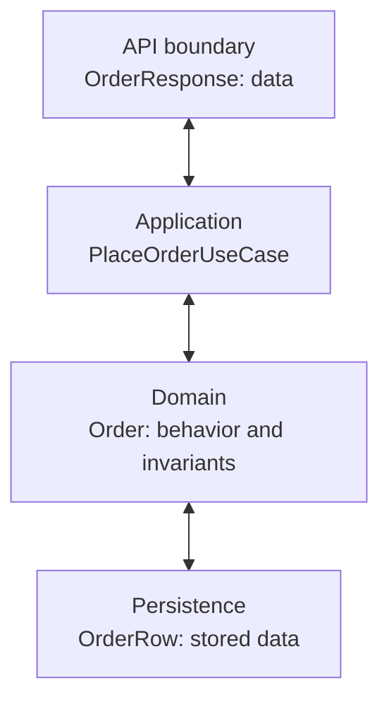

# Behavior-First Mindset — Senior

> **What?** Where behavior-first design rubs against the rest of the stack — ORMs that demand no-arg constructors, DTOs at API edges, frameworks that reflect on fields, and domains where the *data-oriented* approach is the correct call.
> **How?** By separating the domain layer (where behavior lives) from the infrastructure and transport layers (where frames want dumb structures), and by knowing when to drop the behavioral lens entirely.

---

## 1. Behavior-first survives contact with frameworks — but bends

The mindset from `junior.md` and `middle.md` is correct in the small. In the large, three forces push back:

1. **Persistence** — JPA/Hibernate want a public no-arg constructor and field/setter access for proxies and dirty checking.
2. **Serialization** — Jackson, Gson, MapStruct want public getters or annotated fields.
3. **Tools** — Lombok, IDEs, validation frameworks all key off bean-style accessors.

Junior advice ("don't write getters") meets reality: your `Order` is a JPA entity, your `OrderResponse` is a Jackson DTO, and a generator wants `@Data` on both. The senior question isn't *"how do I avoid this?"* but *"where do I let this happen, and what stays clean?"*

---

## 2. Two layers, two object styles

The fix is *not* to make the domain object also be the DTO and also be the JPA entity. It is to keep them separate.



The domain `Order` has behavior. The `OrderRow` is anemic on purpose — it exists to be mapped by Hibernate. A mapper translates between them. That mapper is boring code, and that is fine.

See `../../08-tactical-ddd/` for the larger pattern (aggregates, repositories, application services).

---

## 3. The JPA tax

A pure behavior-first `Order` looks like this:

```python
class Order:
    def __init__(self, order_id: OrderId, customer: CustomerId,
                 lines: list[OrderLine]) -> None:
        self._id = order_id
        self._customer = customer
        self._lines = list(lines)
        self._status = OrderStatus.DRAFT

    def place(self) -> None: ...
    def pay(self, method: PaymentMethod) -> Receipt: ...
    def ship(self, carrier: Carrier) -> Shipment: ...
```

JPA can't manage this directly: no no-arg constructor, no setters, lazy proxies can't intercept the methods cleanly. Three options:

**(a) Make the domain class JPA-friendly.** Add a `protected Order() {}` constructor. Keep fields private; let Hibernate use field access. Avoid `final` on fields it touches. The behavior stays — you've only paid a small surface tax.

```python
class OrderRecord(Base):
    __tablename__ = "orders"

    id: Mapped[str] = mapped_column(primary_key=True)
    customer_id: Mapped[str]
    status: Mapped[str]

    def to_domain(self, lines: list[OrderLine]) -> Order:
        return Order(OrderId(self.id), CustomerId(self.customer_id), lines)
```

**(b) Split domain and persistence.** `Order` is a pure POJO with behavior. `OrderRow` is a JPA entity, dumb on purpose. A repository maps between them.

```python
class OrderRepository(Protocol):
    def by_id(self, order_id: OrderId) -> Order | None: ...
    def save(self, order: Order) -> None: ...

class SqlAlchemyOrderRepository:
    def by_id(self, order_id: OrderId) -> Order | None:
        row = self._session.get(OrderRecord, order_id.value)
        return None if row is None else self._to_domain(row)

    def save(self, order: Order) -> None:
        self._session.merge(self._to_record(order))
```

(b) is purer; (a) is cheaper. (a) is what most working systems do unless the domain is genuinely complex. Pick deliberately.

**Either way: no getters on the domain class unless a use case demands them.** JPA can read private fields by reflection. You do not have to expose them to the rest of your code.

---

## 4. DTOs at the API boundary

The HTTP layer wants a flat shape. Your `Order` has behavior. The fix is the same: a separate type.

```python
@dataclass(frozen=True)
class OrderResponse:
    id: str
    customer: str
    lines: list[LineDto]
    status: str
    total: Decimal

    @classmethod
    def from_domain(cls, order: Order) -> "OrderResponse":
        return cls(
            id=order.id.value,
            customer=order.customer.value,
            lines=[LineDto.from_domain(line) for line in order.lines],
            status=order.status.name,
            total=order.total.amount,
        )
```

`OrderResponse` is a record. It's fine for it to be data — its job is to be serialized. The behavior-first rule applies to the domain, not the wire format. Resist the temptation to merge them "to save typing" — the moment they merge, the API shape constrains the domain forever.

---

## 5. Lombok `@Data` is the wrong tool for the domain

`@Data` generates getters, setters, `equals`, `hashCode`, and `toString` for every field. On a DTO, that's harmless. On a domain object, it ruins behavior-first design in one annotation:

- Every field becomes mutable through a setter.
- Every field is readable, so callers will reach in instead of asking the object to act.
- `equals` is based on all fields, including ones that shouldn't define identity.

Use `@Value` (immutable) for value objects. Use `@Getter` selectively. For domain entities, write the methods you actually need. The five minutes you save with `@Data` cost you the encapsulation `junior.md` argued for.

---

## 6. State-machine objects: behavior-first's sweet spot

Behavior-first thinking aligns naturally with state machines. An `Order` doesn't have a `status` field that other code checks — it has methods that *transition* the state, and illegal transitions are illegal *at the method level*.

The naive form:

```python
def ship(self) -> None:
    if self.status is not OrderStatus.PAID:
        raise ValueError("order must be paid before shipping")
    self.status = OrderStatus.SHIPPED
```

Better — encode the state in the type, so illegal transitions don't compile:

```python
@dataclass(frozen=True)
class DraftOrder:
    lines: tuple[OrderLine, ...]
    def place(self) -> "PlacedOrder": ...

@dataclass(frozen=True)
class PlacedOrder:
    lines: tuple[OrderLine, ...]
    def pay(self, method: PaymentMethod) -> "PaidOrder": ...

@dataclass(frozen=True)
class PaidOrder:
    lines: tuple[OrderLine, ...]
    def ship(self, carrier: Carrier) -> "ShippedOrder": ...

@dataclass(frozen=True)
class ShippedOrder:
    shipment: Shipment
```

Now `shippedOrder.pay(...)` doesn't exist. The compiler enforces the protocol. Behavior-first reaches its purest form: each state is an object, and its methods *are* the legal transitions.

This is heavy for trivial cases. Reach for it when the state machine has more than three states and the cost of an illegal transition is real (money lost, double charges, broken inventory).

---

## 7. Tell-don't-ask across collaborator boundaries

A risk with behavior-first design at scale: every object tells every other object what to do, and you end up with a tangled web where nothing can be changed in isolation.

Three rules cut the tangle:

**Direction matters.** Higher-level objects depend on lower-level ones, not the reverse. `Order` knows about `OrderLine`. `OrderLine` does not call back into `Order`. If you find a downward arrow, you have a leak.

**Commands carry intent.** When an interaction needs more than one object's collaboration, model the *interaction* as an object — a command, not a method call ping-pong:

```python
@dataclass(frozen=True)
class PlaceOrder:
    customer: CustomerId
    lines: tuple[LineRequest, ...]

    def execute(self, catalog: ProductCatalog, stock: StockReservation) -> Order:
        resolved = [catalog.resolve(line) for line in self.lines]
        stock.reserve(resolved)
        return Order.draft(self.customer, resolved).place()
```

The command names the use case. Collaborators are passed in. Nothing reaches sideways.

**Mediators for cross-cutting flows.** When three objects must coordinate, a mediator object owns the dance. The objects stay behavior-rich within their boundaries; the mediator owns the orchestration. This keeps the in-domain interaction graph shallow.

---

## 8. Where behavior-first is *wrong*

Behavior-first is not a universal law. Several domains read better as data with functions:

**Data pipelines.** A row in a Spark/Flink job goes through `map`, `filter`, `aggregate`, `join`. Wrapping each row in a behavior-rich object adds nothing and costs everything (allocations, virtual calls, JVM heat). A `record` plus pure functions is correct.

**Transforms and adapters.** Code that converts one shape to another (JSON to protobuf, CSV to domain, etc.) is best written as a function from one record to another. Forcing behavior onto an `IntermediateForm` class is friction.

**ML feature engineering.** A feature vector is a vector. It does not "do" anything; you compute on it. Make it data.

**Configuration.** A `DatabaseConfig` record holding `host`, `port`, `user` is fine. It does not need a `connect()` method — connecting is a separate concern.

The senior judgement is: **behavior-first lives in the domain layer.** Outside the domain — at the edges (transport, storage, transforms, configuration) — data-first is often better. Don't try to make every object rich; some objects are *meant* to be passive.

See also the data-oriented patterns under `05-java-senior-topics/` for record-heavy designs.

---

## 9. What "rich" actually means

A common misreading of behavior-first: "more methods means more OO". That produces classes with `getX`, `getY`, `withX`, `addX`, `removeX`, `findX`, `isXValid`, `validateX`, `notifyX` — a wall of methods that don't model a coherent responsibility.

A rich object often has *fewer* methods than its anemic twin, because:

- Several small accessors collapse into one named operation.
- Internal helpers are private, not public.
- Methods that don't model a domain interaction are removed, not added.

```python
class Subscription:
    def renew(self, payment: Money) -> Renewal: ...
    def cancel(self, reason: Reason) -> None: ...
    def is_active(self) -> bool: ...
```

Three methods. That's the whole API. Anything else (`expiresAt`, `lastBilled`, `paymentHistory`) is implementation detail, exposed only if a caller has a real reason to know.

**Heuristic:** if you can't sketch the object's full API on the back of a business card, it has too many methods.

---

## 10. Testability shifts

Behavior-first changes what you test:

**Data-first tests** assert state:
```python
cart.add(book, 2)
assert len(cart.items) == 2
assert cart.total == Decimal("40")
```

**Behavior-first tests** assert outcomes and interactions:
```python
receipt = cart.add(book, 2).check_out(visa)
assert receipt.total == Money(Decimal("40"), "USD")
payment_gateway.charge.assert_called_once_with(visa, receipt.total)
```

You test what the object *does*, not what it *contains*. If you have to call `getItems()` in a test, that's a hint the test is reaching for internals — which usually means production code can reach too.

This also lets you change internal representation freely. Switch `items` from `List` to `Map`; tests still pass because they never named `items`.

**Caveat:** don't over-mock. The point is to test that the object honors its contract, not that it makes a specific sequence of internal calls. See `../../06-method-dispatch-and-internals/` for the underlying call mechanics that mocks intercept.

---

## 11. Performance: behavior-rich is not slower

A pure-data object plus a long external function chain compiles to the same bytecode as a behavior-rich object that does the work itself. The JIT inlines private helpers and short methods. The cost of `order.pay(method)` versus a free function `pay(order, method)` is exactly zero in steady state.

Where performance does diverge:

- **Allocation pressure** — behavior-first sometimes creates short-lived value objects (`Money`, `Quantity`). Modern escape analysis scalarizes these. Profile before assuming a cost.
- **Megamorphic call sites** — if `order` is sometimes `DraftOrder`, sometimes `PaidOrder`, sometimes `ShippedOrder`, the call site becomes polymorphic. The JIT handles 2 targets perfectly and 3 reasonably; beyond that, expect a virtual call. Sealed types help the JIT reason about this.
- **Reflection-based frameworks** — Hibernate's field access via reflection has a cost on the first hit; it's optimized after. Not a behavior-first problem, but a thing you'll measure.

The right rule: write the design correctly, then profile. The behavior-first version is almost never the bottleneck.

---

## 12. Reservation example: putting it together

A reservation domain ties most of the above into one picture.

Domain (rich, sealed state machine):

```python
@dataclass(frozen=True)
class PendingReservation:
    id: ReservationId
    guest: GuestId
    dates: DateRange
    room: Room

    def confirm(self, payment: Payment) -> ConfirmedReservation:
        required = self.room.price_per_night * self.dates.nights
        if not payment.covers(required):
            raise InsufficientPayment
        return ConfirmedReservation(self.id, self.guest, self.dates,
                                    self.room, payment.receipt)

    def cancel(self, reason: Reason, clock: Clock) -> CancelledReservation:
        return CancelledReservation(self.id, reason, clock.now())
```

Persistence (anemic row):

```python
@dataclass
class ReservationRow:
    id: str
    guest_id: str
    starts_on: date
    ends_on: date
    room_id: str
    status: str
    payment_ref: str | None = None
    cancelled_at: datetime | None = None
    cancel_reason: str | None = None
```

Transport (record DTO):

```python
@dataclass(frozen=True)
class ReservationResponse:
    id: str
    guest: str
    starts_on: str
    ends_on: str
    room: str
    status: str
```

The domain owns behavior. The row owns storage. The response owns the wire shape. A mapper layer (a few short methods) glues them. Each layer is correct in its own style — none of them try to do all three jobs.

---

## 13. When to break your own rule

You will hit cases where the cost of separation is greater than the benefit. Signals to flatten:

- The domain object has *no* behavior worth modelling — it's genuinely just data (e.g., a `CountryCode`).
- The team is small, the domain is shallow, and the duplication of mapping code is more bug-prone than the lack of separation.
- The framework's lifecycle (e.g., Spring's `@ConfigurationProperties`) is doing the right thing already.

In those cases, **a record is your domain object**. That is consistent with behavior-first thinking: the object is what it does, and if it does nothing, it's a record. Don't manufacture behavior just to keep the rule.

---

## 14. Senior checklist

- [ ] Domain objects own their state transitions; status checks live inside methods, not at call sites.
- [ ] DTOs and persistence rows are separate types — records or anemic entities, not the domain class.
- [ ] No `@Data` on domain entities. `@Value` on value objects is fine.
- [ ] State machines with more than three states are modelled with sealed types.
- [ ] Tests assert outcomes and interactions; reaching for `getX()` in a test is a smell.
- [ ] Cross-object flows are commands or mediators, not method ping-pong.
- [ ] Data-pipeline and transform code is allowed to be data-first. The rule is for the domain.
- [ ] Mapping code between layers exists and is boring. That's the point.

---

## 15. What's next

| Topic                                                  | File              |
| ------------------------------------------------------ | ----------------- |
| Driving behavior-first across a team and codebase      | `professional.md`  |
| Hands-on exercises                                     | [check your understanding](#check-your-understanding)         |
| Tactical DDD: aggregates, repositories, app services   | `../../08-tactical-ddd/` |

---

**Memorize this:** behavior-first is a *domain layer* discipline. Keep the rich behavior where the business rules live; let DTOs and JPA rows be anemic on purpose; pick state-machine objects when illegal transitions cost real money. The rule isn't "every class has behavior" — it's "the object that owns a rule owns the methods that enforce it".

---

---

## Check your understanding

1. Explain Behavior-First Mindset in your own words and name the problem it solves.
2. How would you apply the ideas around Behavior-first survives contact with frameworks — but bends, Two layers, two object styles, The JPA tax in a realistic engineering change?
3. What failure mode or misuse should you look for, and what evidence would reveal it?
4. How would you validate a system-level decision about Behavior-First Mindset under uncertainty?
5. What observable result would convince you that the approach improved the system?
