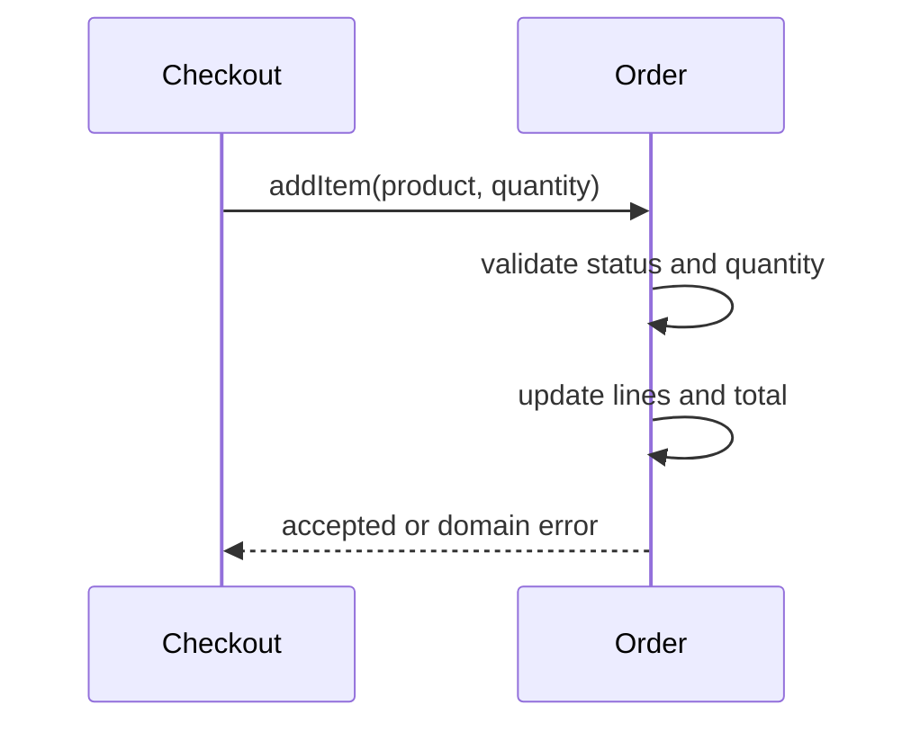

# Object-Oriented Design — Junior

An object combines state with behavior that protects valid state. Avoid classes that are only bags of fields while services manipulate them from outside.

Use small names from the domain. Keep constructors valid. Hide mutation that could violate invariants. Prefer composition for “has-a” relationships; use inheritance only for a genuine substitutable “is-a” contract.

KISS and YAGNI mean implement the simplest design that expresses today’s verified behavior. DRY applies to knowledge, not every similar line.

## Test yourself

1. Which object should protect an order’s status rule?
2. Why is a public setter risky?
3. When does composition beat inheritance?
4. What knowledge is truly duplicated?

Continue to [`middle.md`](middle.md).
