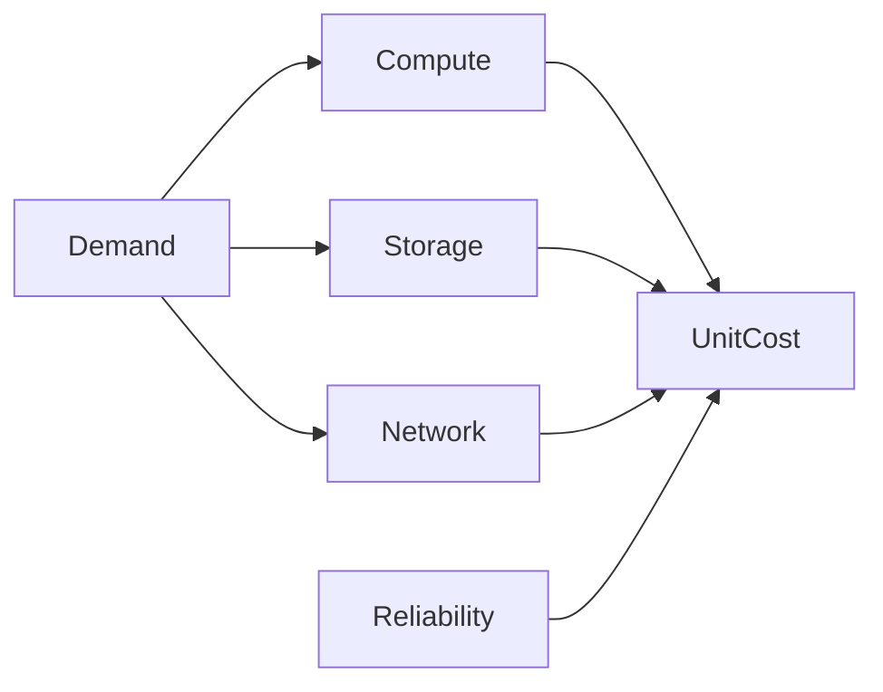

# Cost Efficiency

> Deliver required user outcomes and reliability with the lowest sustainable total cost, not the smallest cloud bill.

| Level | Guide | You are done when |
|---|---|---|
| Junior | [Find cost drivers](junior.md) | You can attribute spend and remove obvious waste safely. |
| Middle | [Model unit cost](middle.md) | You can connect capacity, egress, storage, and product usage. |
| Senior | [Optimize architecture](senior.md) | You can trade performance, reliability, lifecycle, and cost. |
| Professional | [Govern FinOps](professional.md) | You can align ownership, forecasting, and optimization across portfolios. |

## Practice rule

Optimize cost per useful outcome under reliability and security constraints; never optimize an isolated bill line.

## Related

- [Estimation](../estimation/README.md)
- [Performance](../performance/README.md)
