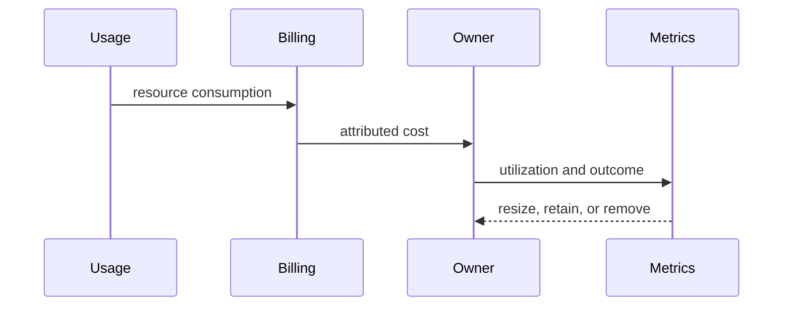

# Cost Efficiency — Junior

Tag resources, identify owners, and break spend into compute, storage, network, managed services, licenses, and operations. Remove idle resources, oversized instances, orphaned volumes, and accidental retention only after validating impact.

## Test yourself

1. Which resource has no owner?
2. How do you verify it is idle?
3. What reliability constraint prevents removal?
4. Which unit connects spend to value?

Continue to [`middle.md`](middle.md).
