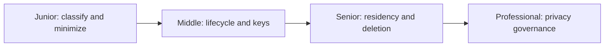
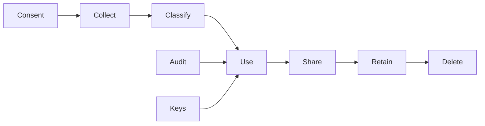

# Data Privacy

> Know which personal data exists, why it is used, where it moves, who can access it, and how it is deleted.

| Level | Guide | You are done when |
|---|---|---|
| Junior | [Handle data safely](junior.md) | You can identify PII, minimize collection, and prevent leakage. |
| Middle | [Design data lifecycle](middle.md) | You can apply retention, audit, and encryption controls. |
| Senior | [Meet distributed obligations](senior.md) | You can implement deletion, residency, and key lifecycle across systems. |
| Professional | [Govern privacy](professional.md) | You can align policy, architecture, evidence, and incident response. |

## Practice rule

Do not collect data without a defined purpose, owner, access rule, retention period, and deletion path.

## Related

- [Security at Scale](../security-at-scale/README.md)
- [Cost Efficiency](../cost-efficiency/README.md)
