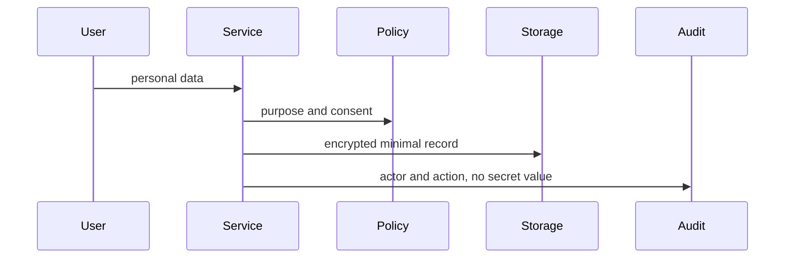

# Data Privacy — Junior

Classify direct identifiers, quasi-identifiers, sensitive attributes, credentials, and operational metadata. Minimize collection and redact logs, traces, errors, and test fixtures.

## Test yourself

1. Which field is a quasi-identifier?
2. Why is production data unsafe in tests?
3. What belongs in an audit event?
4. How is deletion verified?

Continue to [`middle.md`](middle.md).
