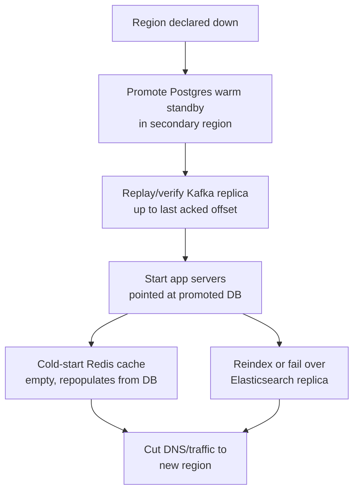

# Disaster Recovery — Middle

<!-- level-focus -->
At middle level, focus on this question:

> Given a system made of several components with different criticality, which standby tier — cold, warm, or hot — fits each one, and what does it cost you to put a component in the wrong tier?

Use the smallest realistic scenario that exposes the decision and its failure behavior.
> **Roadmap:** [Infrastructure](../README.md) → Disaster Recovery

*Junior-level DR proves one component can be restored. Middle-level DR is choosing, deliberately and per component, how much standby infrastructure that restore is worth paying for — and getting the failover order right when several components depend on each other.*

---

## Core Concept 1 — The three standby tiers, compared

Every DR strategy for a stateful component sits somewhere on a spectrum from "nothing running until disaster strikes" to "a full duplicate running at all times." The three named tiers anchor that spectrum:

| Tier | What's actually running before a disaster | Typical RTO | Typical RPO | Relative cost |
|---|---|---|---|---|
| **Cold standby** | Nothing — infrastructure is defined (as code) but not provisioned; backups exist in storage | Hours | Matches backup interval (often up to 24h) | Lowest — pay only for backup storage |
| **Warm standby** | A scaled-down replica running continuously, kept reasonably in sync, promoted on failover | Minutes to tens of minutes | Minutes (continuous or frequent replication) | Medium — running reduced-scale infrastructure at all times |
| **Hot standby** | A full-scale, kept-in-sync standby, ready to take traffic immediately | Seconds to low minutes | Near-zero (synchronous or near-real-time replication) | Highest — running duplicate full-scale infrastructure |

None of these is "the right answer" in the abstract. Each is a purchase: you're buying a lower RTO/RPO by paying more, in both infrastructure cost and operational complexity (more moving parts that can themselves fail, drift, or go stale). The middle-level skill is matching the tier to what a component is actually worth losing, not defaulting to the tier that sounds the safest.

---

## Core Concept 2 — Choosing the tier per component, not per system

A system is rarely one tier all the way down. A checkout database losing an hour of orders is a materially different cost than an internal analytics dashboard losing a day of aggregated stats — so they don't belong in the same tier, even though they might live in the same deployment.

Evaluate each component against three questions:

1. **What does losing this component's data actually cost, in the time units RPO is measured in?** Lost orders and lost payment confirmations cost real money per minute; lost analytics rollups cost mostly inconvenience per day.
2. **What does being down for this long actually cost?** A checkout outage compounds every minute it continues; an internal reporting tool being down for an afternoon is an annoyance.
3. **What's the operational cost of keeping this tier alive** — extra infrastructure to patch and monitor, extra replication links that can themselves fail or drift, extra on-call surface?

The signal you've **under-applied** standby investment: a real (or drilled) failure breaches the RTO/RPO that actually matters to the business — a cold-standby checkout database takes six hours to restore when the business needed two. The signal you've **over-applied** it: a component sits in hot standby, fully duplicated and continuously monitored, for a workload where nobody would notice a four-hour outage — that's ongoing cost and operational surface bought against a risk nobody was worried about.

---

## Core Concept 3 — Incremental adoption: earn the next tier, don't assume it

Jumping straight to hot standby for everything is both expensive and, ironically, less safe than it looks — a synchronous replication link and an automated promotion path are more moving parts, and more moving parts that have never been exercised are more things that can fail silently. The incremental path:

1. **Prove backups restore reliably (cold standby), first.** Nothing else is worth building until this is true — a warm or hot standby built on top of a data pipeline nobody has proven correct just replicates the same defect faster.
2. **Move to warm standby only for components where the drilled cold-standby RTO has already been measured and shown to miss the target.** The decision to invest in continuous replication should be justified by a number from a drill, not a guess about what "probably" needs it.
3. **Reserve hot standby for the smallest, most tightly scoped set of components where seconds-to-minutes of RTO is the actual business requirement** — usually the write path of a payments or checkout system, not the whole application.

This mirrors the general principle that the right amount of any protective mechanism is the least amount that still meets the requirement it exists to satisfy — spend the next tier of investment only where a measured gap justifies it.

---

## Core Concept 4 — Cross-component scenario: a region failure across four different data stores

**Setup.** An order-processing system is built from four stateful components, each with a different natural fit:

- **Postgres primary** (orders, payments) — the write-of-record; losing recent writes here is the costliest failure in the system.
- **Redis cache** (session and product-page cache) — fully derived from Postgres and the catalog service; nothing here is authoritative.
- **Kafka** (order-events queue, feeding fulfillment and notifications) — holds in-flight work; a lost message means an order that's paid for but never fulfilled.
- **Elasticsearch** (product search index) — derived from the catalog, rebuildable but slow to reindex from scratch.

A regional outage takes down all four at once. The failover has to happen in a specific order, because some components depend on others being correct before they can be trusted:

**Why the order matters.** Starting app servers before Postgres finishes promotion means the app connects to a database that isn't yet accepting writes, or worse, one still mid-promotion with an inconsistent replication state. Cutting traffic before Kafka's replica has caught up to the last acknowledged offset can silently drop or duplicate in-flight orders. Redis and Elasticsearch, by contrast, don't block the failover at all — they're both fully derived, so the app can serve correctly (if slower, with more cache misses and degraded search relevance) while they warm back up in the background.

**The tier decisions that follow from this map:** Postgres gets warm standby (continuously replicated, promoted on failover — losing the write-of-record for hours is not acceptable). Kafka gets warm standby with the same replication guarantee, because "acceptable data loss" for in-flight orders is measured in minutes, not the backup interval. Redis gets no standby at all — cold-starting an empty cache is cheap and expected. Elasticsearch gets either a cheap warm replica or a documented "rebuild from source, expect degraded search for N minutes" plan, because full search-result correctness during a failover is far less costly to lose temporarily than order data.

---

## Core Concept 5 — Verifying at two levels: per-component and integrated-flow

**Unit-level verification** (per component, same discipline as the junior level): each stateful component has its own restore or promotion drill, timed and recorded independently — Postgres promotion time, Kafka replica catch-up time, Elasticsearch reindex time.

**Integrated-flow verification**: running all four components' failover together, in the dependency order from the diagram above, and confirming the *user-facing outcome* — can a real checkout complete, end to end, against the failed-over stack? This catches failures that no single component's drill can: an app server with a hardcoded connection string that a per-component DB drill never exercised, a DNS TTL long enough that traffic keeps hitting the dead region for minutes after cutover, a Kafka consumer group that doesn't automatically repoint to the new broker set.

A component passing its own drill in isolation is necessary but not sufficient — the middle-level discipline is running the integrated drill on a schedule, not assuming that four passing unit drills compose into a working failover.

---

## Common Mistakes

1. **Putting every component in the same tier for simplicity.** This either overspends on components that don't need it or underspends on the one that does — usually both at once.
2. **Choosing a tier from a general rule of thumb instead of a measured RTO/RPO gap.** "We should probably have warm standby for that" is not a decision; a drilled cold-standby RTO that misses the target is.
3. **Failing over components out of dependency order.** Starting the app before the database is promoted, or cutting traffic before the queue replica has caught up, turns a clean failover into a data-consistency incident.
4. **Treating Redis-like derived caches as if they needed the same standby investment as the source of truth.** A cache that can cold-start from its source doesn't need replication; spending on it is waste that could have gone toward Kafka or Postgres.
5. **Testing each component's restore in isolation and calling the system "DR-ready."** Passing unit drills says nothing about whether the full, ordered, integrated failover actually works end to end.

---

## Apply it

1. List the stateful components in a system you work on (databases, caches, queues, search indexes) and classify each by what it would actually cost the business to lose an hour of its data and to be down for an hour.
2. Assign each component a standby tier (cold, warm, or hot) based on that classification, and write one sentence justifying each choice.
3. Diagram the dependency order those components must fail over in — which one has to be promoted or verified before the next one can safely start.
4. Run a per-component drill for at least one component, and separately run an integrated drill exercising the full failover order for the whole scenario.
5. Compare what each drill revealed: did the unit-level result predict the integrated-level result, or did the integrated drill expose a problem (ordering, config, DNS) the unit drill couldn't have caught?

## Verify your work

- Each stateful component has an assigned tier with a one-sentence justification tied to a cost estimate, not a default.
- At least one component has a measured, timed restore or promotion result from an isolated drill.
- The integrated-flow drill produced a real end-to-end outcome (e.g., a test transaction completing) against the failed-over stack, not just each component reporting healthy independently.
- You can name at least one issue the integrated drill would catch that the per-component drills would not (ordering, stale connection config, DNS propagation delay).

## Review questions

- What determines which standby tier a given component actually needs — cost of data loss and downtime, or a general rule of thumb?
- Why might a fully-derived cache need no standby investment at all, while the database behind it needs warm or hot standby?
- What could go wrong if components fail over out of dependency order, even if each one's own drill passes?
- What can an integrated-flow drill reveal that four separate, passing unit-level drills cannot?
