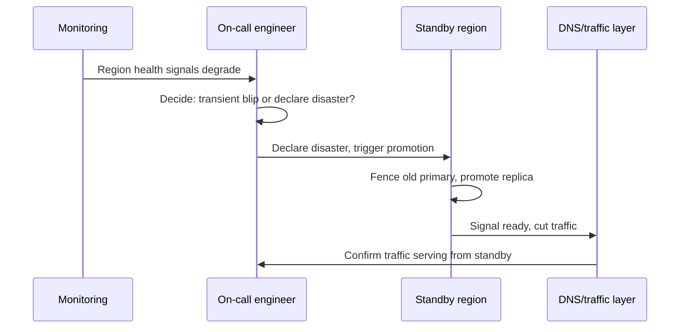

# Disaster Recovery — Senior

<!-- level-focus -->
At senior level, focus on this question:

> What architectural invariant guarantees your system's stated RTO/RPO still holds as components, dependencies, and ownership change, and what evidence — a live failover, not a tabletop discussion — proves it?

Use the smallest realistic scenario that exposes the decision and its failure behavior.
> **Roadmap:** [Infrastructure](../README.md) → Disaster Recovery

*A DR plan that lives as a document, reviewed in a meeting once a year, degrades the moment the system it describes changes underneath it. A senior engineer's job is to state the recovery guarantee as something falsifiable, and to keep proving it as the system evolves — not to trust that the plan is still true because nobody has said otherwise.*

---

## Core Concept 1 — State the invariant, don't just point at the plan

At the middle level, DR is a set of per-component tier decisions. At senior level, those decisions need to compose into one falsifiable, system-wide claim — an **invariant** that survives the question "is this still true after last month's changes?":

> *A full-region loss recovers checkout capability within 2 hours, with no more than 15 minutes of acknowledged order data lost, and this is proven by an actual failover at least once per quarter.*

Notice what makes this different from "we have a DR plan for checkout": it names a bound on both RTO and RPO, and it names the evidence standard (an actual failover, on a cadence) rather than resting on the plan's existence. "We have a DR plan" is not falsifiable — a plan can exist and be wrong, stale, or untested, and the sentence remains technically true. The invariant above can be falsified by a single failed drill, which is exactly the property that makes it useful.

---

## Core Concept 2 — Failure modes specific to disaster recovery at scale

Beyond "the backup didn't restore," a set of failure modes appears specifically once a system has enough moving parts and enough history that DR mechanics interact with the rest of the architecture:

**Restore-order dependencies that aren't documented.** A schema migration deployed last week means the backup taken before it doesn't match the application code currently running. Restoring last night's dump and starting this week's app version can fail outright, or worse, silently write inconsistent data. The invariant has to account for schema and code version compatibility, not just data currency.

**Split-brain during promotion.** If the old primary isn't fully fenced off (network partition healed unexpectedly, a lagging health check) before the standby is promoted, both can accept writes simultaneously — producing two diverging histories that are far harder to reconcile than a clean data loss would have been. A promotion procedure needs an explicit fencing step, not an assumption that the old primary is gone because it's supposed to be.

**DNS and client-side caching delaying an otherwise-clean cutover.** A failover that promotes the standby and updates DNS in under a minute can still take many more minutes to actually redirect traffic, if clients or intermediate resolvers cache the old address past its TTL. The RTO invariant has to be measured from "user traffic actually reaches the new region," not from "the failover script finished."

**Cross-service data inconsistency after an asynchronous restore.** If Postgres is restored to T-10 minutes but Kafka's replica is caught up to T-1 minute, the app can end up processing order events for orders that, according to the restored database, don't exist yet. DR invariants that only state a per-component RPO miss this — the real requirement is a *consistent recovery point across dependent stores*, not just a bound on each one independently.

---

## Core Concept 3 — The recovery clock, applied to a declared disaster

The same MTTD/MTTA/MTTF/verify decomposition used for incident recovery generally applies with a DR-specific twist: **MTTA here includes the decision to declare a disaster at all**, which is often the largest and most judgment-laden segment of the clock.



The "decide: transient blip or declare disaster?" step is where senior-level judgment lives. Declaring too early triggers an unnecessary, disruptive failover over a self-resolving blip; declaring too late burns RTO budget waiting for confidence that should have come from a pre-agreed threshold. The fix is the same one that works for any judgment call under pressure: define the declaration criteria in advance ("no successful health check from the primary region for 3 consecutive minutes, corroborated by two independent monitoring sources") so the decision is a lookup during an incident, not a debate.

---

## Core Concept 4 — Evidence over preference: drills versus tabletop exercises

A **tabletop exercise** — walking through the DR plan verbally, asking "and then what would we do?" — is useful for finding gaps in the plan's logic. It is not evidence that the plan works, because it never touches the actual fencing, promotion, DNS propagation, or client reconnection behavior that determines the real RTO. Only a **live failover drill** — actually cutting real (or realistically shadowed) traffic to the standby and measuring what happens — produces evidence.

Run the invariant as a testable hypothesis, the same evidentiary discipline chaos engineering and game days apply more broadly, here aimed specifically at the recovery invariant:

```text
Hypothesis: promoting the warm-standby Postgres replica and cutting DNS
            restores checkout capability within 2 hours, with at most
            15 minutes of order data lost, measured end to end.

Drill: fence the primary, promote the replica, cut DNS, run a real
       checkout transaction against the new region.

Evidence to collect:
  - Wall-clock time from disaster declaration to a successful checkout
  - Timestamp gap between last acknowledged write on old primary and
    first write accepted on promoted replica
  - Whether any client or resolver kept sending traffic to the old
    region after DNS was cut, and for how long
  - Whether Kafka's replica offset was consistent with the promoted
    database's recovery point at the moment traffic was cut
```

If the drill measures 3 hours instead of the invariant's 2, or reveals clients still hitting the old region 8 minutes after cutover, that gap is the finding — not something to explain away as "the drill environment was different." It means either the invariant's bound is wrong, or something in the failover mechanics (DNS TTL, fencing, replication lag) doesn't yet support the bound that was promised.

---

## Core Concept 5 — The invariant has to evolve with the system, and it has to stay distinct from steady-state multi-region operation

Two traps specifically threaten a DR invariant's validity over time. First, **the invariant goes stale silently** — a new service is added to the checkout path, calls a dependency that was never included in the failover order, and nobody updates the invariant or the drill to cover it, because nothing forces that update to happen. Second, and more subtly, **DR gets conflated with multi-region steady-state operation**: a team that runs active-active across regions for latency or availability reasons can mistakenly assume that arrangement also satisfies its disaster-recovery obligations, when in fact active-active steady state and a *declared-disaster* failover are different mechanisms with different failure modes — active-active handles a single instance or AZ dying gracefully by design, but a full regional data-plane failure, a bad global deploy, or a corrupted replication stream can still require the same fencing-and-promotion discipline this invariant describes, run against whichever region is still healthy. Treating "we're multi-region" as equivalent to "we have disaster recovery" is exactly the kind of unproven assumption a drill is meant to expose.

---

## Common Mistakes

1. **Trusting a tabletop walkthrough as proof the DR plan works.** Only a live failover drill exercises the actual fencing, promotion, and traffic-cutover mechanics that determine the real RTO.
2. **Stating RPO per component instead of as a consistent recovery point across dependent stores.** A database restored to one timestamp and a queue replica caught up to a different one can produce data that's individually "recent" and collectively inconsistent.
3. **Leaving disaster-declaration criteria undefined.** Without a pre-agreed threshold, the largest and most variable part of the recovery clock becomes a debate held during the incident itself.
4. **Assuming a multi-region, active-active architecture already satisfies DR requirements.** Steady-state regional redundancy and a declared-disaster failover are different mechanisms, and the latter needs its own drilled, falsifiable invariant.
5. **Never revisiting the invariant when the system changes.** A new dependency added to a critical path, with no corresponding update to the failover order or drill scope, is a silent hole in the invariant.

---

## Apply it

1. Write, in one falsifiable sentence, the RTO/RPO invariant your system is supposed to satisfy for its most critical path today (or should satisfy, if none exists).
2. List every store or service in that critical path whose recovery point must stay consistent with the others (e.g., the database and the event queue), and identify whether your current plan states a bound for each independently or for the set as a whole.
3. Define, in writing, the exact criteria that trigger a disaster declaration — not "when it seems bad," but a specific signal and duration.
4. Run (or schedule) one live failover drill that exercises fencing, promotion, and traffic cutover together, and measure the end-to-end RTO and the cross-store recovery-point gap.
5. Compare the measured result against the invariant, and write down whether the gap (if any) points to a wrong invariant or a broken mechanism.

## Verify your work

- The invariant is written as a specific, falsifiable claim naming both an RTO bound and a cross-store-consistent RPO bound.
- Disaster-declaration criteria are written down as a concrete signal and threshold, not left to in-the-moment judgment.
- A live drill (not a tabletop discussion) produced a measured end-to-end RTO and a measured recovery-point gap across at least two dependent stores.
- Any gap between the measured result and the invariant has a named cause (fencing delay, DNS TTL, replication lag, undocumented new dependency), not an unexplained discrepancy.

## Review questions

- What makes an RTO/RPO invariant falsifiable rather than aspirational?
- Why is a tabletop exercise insufficient evidence that a DR plan actually works?
- What does it mean for a recovery point to be "consistent across dependent stores," and why can two individually-recent recovery points still be inconsistent together?
- Why can an active-active multi-region architecture still need its own drilled disaster-recovery invariant, separate from its steady-state redundancy?
