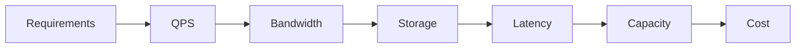

# Production Estimation

> Estimate orders of magnitude early enough to reject designs that cannot meet load, latency, storage, or cost constraints.

| Level | Guide | You are done when |
|---|---|---|
| Junior | [Estimate one workload](junior.md) | You can derive QPS, bandwidth, and storage from assumptions. |
| Middle | [Build a capacity model](middle.md) | You can connect traffic, latency budgets, and resources. |
| Senior | [Plan under uncertainty](senior.md) | You can model peaks, growth, failure, and headroom. |
| Professional | [Govern capacity planning](professional.md) | You can align forecasts, benchmarks, spend, and reliability. |

## Practice rule

Show units, assumptions, ranges, and sensitivity. Precision without evidence is not accuracy.

## Related

- [Performance](../performance/README.md)
- [Cost Efficiency](../cost-efficiency/README.md)
