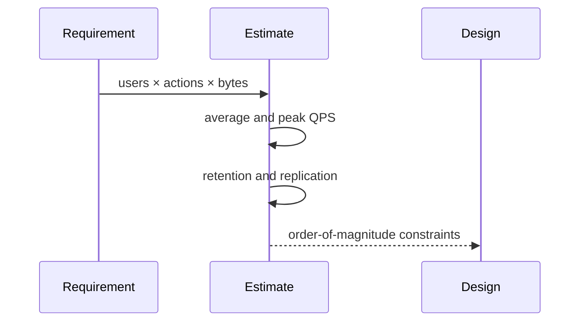

# Estimation — Junior

Convert requirements into units. If 10 million daily events average 2 KB, start with `10M / 86,400 ≈ 116 events/s`, then apply a peak factor. Storage per day is about 20 GB before replication, indexes, metadata, and compression.

Use a range for uncertain inputs and keep a small table of useful numbers: network throughput, disk latency, memory size, and service limits. Verify the most sensitive assumption with measurement.

## Test yourself

1. Derive peak QPS from daily traffic and a 10× peak factor.
2. Which multipliers turn logical bytes into physical storage?
3. Why are units essential?
4. Which assumption should you measure first?

Continue to [`middle.md`](middle.md).
