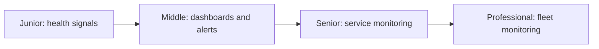
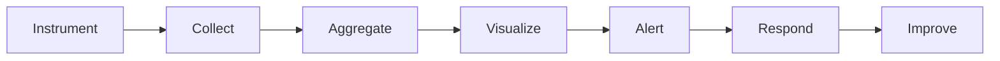

# Production Monitoring

> Detect user impact and unsafe system state early enough for a human or automation to act.

| Level | Guide | You are done when |
|---|---|---|
| Junior | [Monitor one service](junior.md) | You can distinguish availability, health, and performance. |
| Middle | [Build actionable alerts](middle.md) | You can create dashboards, synthetic checks, and useful thresholds. |
| Senior | [Monitor user outcomes](senior.md) | You can align alerts with SLOs, security, and capacity. |
| Professional | [Govern fleet monitoring](professional.md) | You can operate scalable, reliable monitoring systems. |

## Practice rule

Every alert needs an owner, user impact, action, urgency, and runbook. Otherwise it is a dashboard query, not an alert.

## Related

- [Observability](../observability/README.md)
- [SRE & Reliability](../sre-reliability/README.md)
